# 三、Eclipse 优先

Eclipse 是一个集成开发环境，我们将在整个 Android 开发过程中使用它。Eclipse 不仅仅是一个简单的代码编辑器。它是一个非常强大和复杂的工具平台。从这个角度来看，这一章非常重要，因为我们将通过为 Eclipse 设置合适的工作环境来为后面的章节建立框架。

本章将介绍 Eclipse，强调最常用的 Eclipse 组件。熟悉 Eclipse 是顺利体验 Android 开发的关键。

### Eclipse历史

1995 年，Sun Microsystems 向公众发布了 Java 编程语言的第一个公共实现。Java 的到来将开发者社区分成了两个群体:一个以微软技术和工具为中心，另一个以 Java 平台为中心。

Visual Studio 是微软的工具平台，以集成的方式提供对所有微软技术的访问。市场上有许多成功的 Java 开发工具，但是它们没有像微软技术那样紧密集成。

在 20 世纪 90 年代末，IBM 是 Java 的主要参与者。IBM 当时的主要目标是让开发人员更接近 Java 中间件。IBM 知道理想的开发环境必须由来自 IBM、第三方和客户内部工具的异构组合组成。IBM 的对象技术国际(OTI)实验室是 VisualAge 产品家族的幕后支持者，他们在构建集成开发环境方面有着丰富的经验。作为第一个步骤，VisualAge for Java Micro Edition 是作为完全使用 Java 编程语言的集成开发环境的重新实现而开发的。后来，VisualAge for Java Micro Edition 代码被用作 Eclipse 平台的基础。

IBM 已经意识到，仅仅在这个新平台上拥有 IBM 产品不足以获得开发人员社区的广泛采用。集成第三方工具是 Eclipse 平台成功的关键。2001 年，IBM 决定为 Eclipse 平台采用开源许可和操作模型。IBM 和其他八个组织一起建立了 Eclipse 联盟。该联盟的主要运营原则是推动 Eclipse 平台的营销和关系，同时将 Eclipse 源代码的控制权留给开放源代码社区。

2003 年，Eclipse 平台及其快速增长的开源和商业扩展集开始受到开发人员的欢迎。2004 年，Eclipse Foundation，一个拥有自己的专业和独立员工的非营利组织，接管了 Eclipse 平台的全部控制权。Eclipse 现在是领先的 Java 开发环境。由于其独特和可扩展的架构，它也被用作许多其他编程语言的开发环境。

### Eclipse 架构

作为一名 Android 开发人员，您不需要与 Eclipse 平台的内部交互。然而，了解它的架构将使您更容易概念化和理解 Eclipse 的一般工作方式。

Eclipse 平台主要是为构建集成开发环境而设计的。它是一个高度可扩展的平台，而不是一套特定任务的定制工具。

Eclipse 平台定义了机制和规则，并通过提供一组定义良好的 API，允许在它们之上构建工具。Eclipse 平台是围绕插件的概念构建的，如图 3-1 所示。

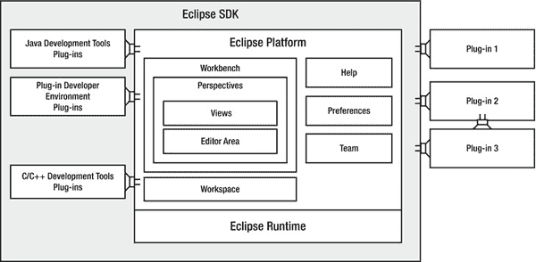

**图 3-1。** *Eclipse 平台架构概述*

插件是 Eclipse 平台的最小单元。它们是结构化的代码束，为平台贡献了一组功能。插件可以单独开发、分发和部署。Eclipse 平台也允许插件具有可扩展性。插件可以通过定义良好的 API 提供一组扩展点，供其他插件扩展其功能。

Eclipse 平台中的每个子系统都基于一组插件。例如，Eclipse 的 Java 开发工具是一组插件，以集成的方式为平台提供 Java 开发功能。Java 开发工具插件也是可扩展的。

在本书中，我们将使用 Android 开发工具插件。这些扩展了现有的 Java 开发工具，以便提供特定于 Android 的开发工具和功能。

Eclipse 平台的核心，也称为 Eclipse 运行时，负责提供插件可以工作和互操作的基础设施。Eclipse 运行时还提供了任何实用服务器，这将使开发人员更容易开发新的插件。在撰写本文时，最新版本是 Eclipse Indigo 3.7.2。

在接下来的小节中，我们将为 Eclipse 设置合适的工作环境。

### 安装 Java 开发工具包

Eclipse 是一个基于 Java 的应用，它需要一个 Java 虚拟机才能运行。在安装 Eclipse 之前，您需要安装 Java 开发工具包(JDK)，而不仅仅是 Java 运行时版本(JRE)。Eclipse 支持多种 JDK 风格，比如 IBM JDK、OpenJDK 和 Oracle JDK(以前称为 Sun JDK)。在本节中，我们将假设您正在安装 Oracle JDK，它是最初的 JDK 实现，支持更广泛的平台。

JDK 的版本也需要与 Dalvik 虚拟机兼容，因为我们将使用 Eclipse 进行 Android 开发。在撰写本文时，Dalvik 虚拟机支持 Java 编译器兼容级别 1.5 和 1.6。尽管新版本的 JDK 可以配置为在这些合规级别上工作，但是从相应的 JDK 版本 JDK 6 开始要容易得多。

使用您最喜欢的网络浏览器，导航至`[http://www.oracle.com/technetwork/java/javase/downloads/index.html](http://www.oracle.com/technetwork/java/javase/downloads/index.html)`。如[图 3-2](#fig_3_2) 所示，你会看到一个下载选项列表。

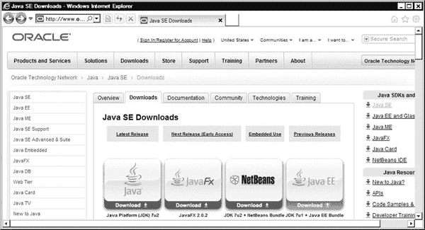

**图 3-2。** *甲骨文网站上的 Java 下载页面*

因为我们想下载 JDK 6 而不是 JDK 的最新版本，所以向下滚动到下载页面的 Java SE 6 部分。在撰写本文时，JDK 6 的最新版本是 Update 31。点击 JDK 6 旁边的下载按钮继续。

目前，Oracle JDK 不提供 Mac OS X 平台的安装包，因为安装程序是通过苹果的软件更新分发的。对于所有其他主要平台，Oracle JDK 安装程序都列在该页面上，如[图 3-3](#fig_3_3) 所示。每个操作系统的安装过程各不相同。为了使安装过程尽可能顺利，我们将在下面的章节中介绍三种主要的操作系统——Windows、Mac OS X 和 Linux。

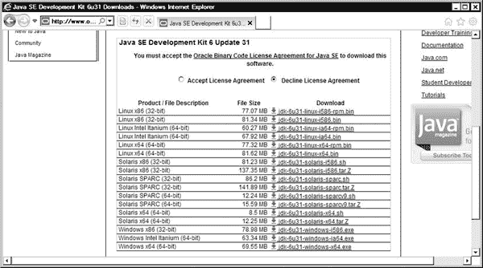

**图 3-3。** *主要操作系统的 Oracle JDK 安装包列表*

#### 在 Windows 上安装 JDK

Oracle JDK 是作为 Microsoft Windows 操作系统的可执行安装程序提供的。安装向导将指导您在机器上安装 JDK，如图[图 3-4](#fig_3_4) 所示。

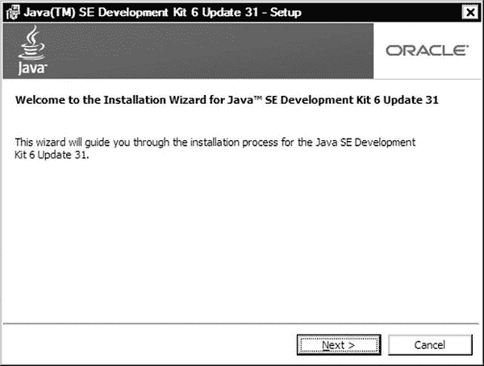

**图 3-4。** *甲骨文 JDK 6 安装向导*

安装向导将首先安装 JDK，然后安装 JRE。在安装过程中，向导会询问目标目录以及要安装的组件。您可以在这里继续使用默认值。记下 JDK 部件的安装目录。

安装向导将自动进行必要的系统更改。安装过程完成后，JDK 就可以使用了。

在 Windows 上，安装向导不会自动将 Java 二进制目录添加到系统变量`Path`中，所以您需要这样做。转到控制面板并选择系统(或从开始菜单中选择运行，然后执行`sysdm.cpl`)以打开系统属性对话框。切换到高级选项卡，点击环境变量按钮，如图[图 3-5](#fig_3_5) 所示。

**图 3-5。** *系统属性对话框的高级标签*

如[图 3-6](#fig_3_6) 所示，环境变量对话框分为两部分:上面的是用户的，下面的是系统的。

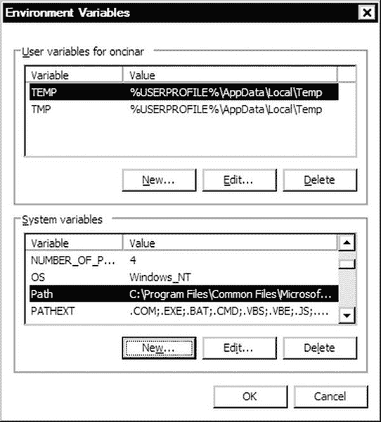

**图 3-6。** *环境变量对话框*

在“系统变量”窗格中，单击“新建”按钮定义新的环境变量。将变量名设置为`JAVA_HOME`，将变量值设置为 JDK 安装目录，如图 3-7 中[所示。单击确定按钮保存变量。](#fig_3_7)

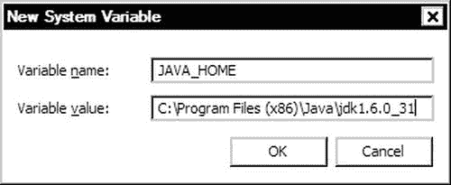

**图 3-7。**T2】设置 JAVA_HOME 系统环境变量

在系统变量列表中，双击`Path`变量，将`;%JAVA_HOME%\bin`追加到变量值，如图[图 3-8](#fig_3_8) 所示。

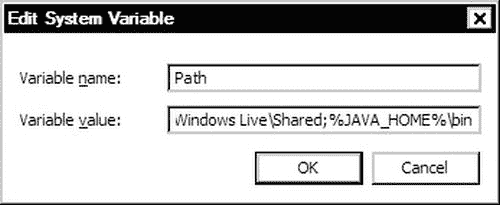

**图 3-8。**T3】设置 Path 系统环境变量

现在，可以从命令提示符轻松访问 JDK。为了验证安装，通过选择**启动附件命令提示符**打开命令提示符窗口。使用命令提示符，执行`javac –version`。如果安装成功，你会看到 JDK 版本号，如图[图 3-9](#fig_3_9) 所示。

**图 3-9。** *Windows 命令行提示显示 JDK 版本*

#### 在 Mac OS X 上安装 JDK

苹果 Mac OS X 操作系统出厂时已经安装了 JDK。它基于 Oracle JDK，但由 Apple 配置以更好地与 Mac OS X 集成。JDK 的新版本可通过软件更新窗口获得，如[图 3-10](#fig_3_10) 所示。确保主机上安装了 JDK 6 或更高版本。

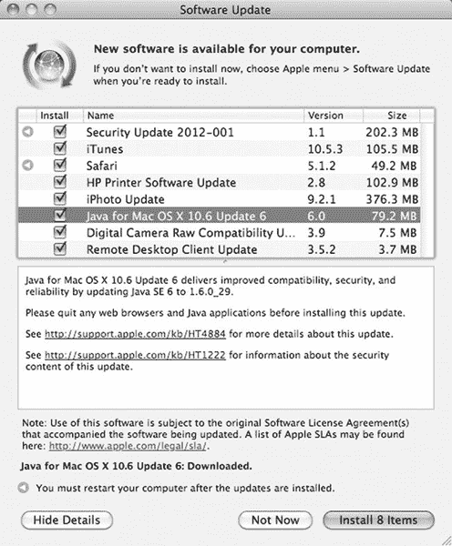

**图 3-10。** *Mac OS X 软件更新窗口显示 JDK*

#### 在 Linux 上安装 JDK

JDK 安装过程因 Linux 发行版而异。由于 Oracle JDK 的许可条款，它不包含在任何 Linux 发行版中。某些发行版附带了一个存根应用，它允许您安装 Oracle JDK，而无需通过 web 下载过程。如本章前面的[图 3-3](#fig_3_3) 所示，Oracle 的网站为 Linux 系统提供了两种类型的安装包:

*   名称以-rpm.bin 结尾的安装包包含一组 Red Hat Package Manager (RPM)格式的可安装包。如果您使用的是 Linux 发行版，如 Red Hat Enterprise Linux、Fedora、CentOS、SUSE 或 openSUSE，您可以下载这个安装包。
*   名称以结尾的安装包。bin 包含一个自解压 ZIP 存档文件。这个安装包可以在任何 Linux 发行版上运行，尽管在安装之后需要一些手动的系统配置。

在本节中，我们将假设您运行的是支持 RPM 的 Linux 发行版。

下载 RPM 格式的安装包后，打开一个终端窗口。如[图 3-11](#fig_3_11) 所示，首先调用`chmod +x jdk-6u31-linux-i586-rpm.bin`启用安装程序上的执行位。要开始安装，在命令行上调用`sudo ./jdk-6u31-linux-i586-rpm.bin`。根据 JDK 的版本，用适当的文件名替换`jdk-6u31-linux-i586-rpm.bin`。

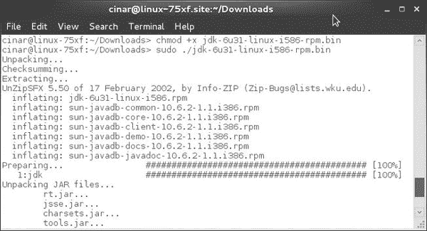

**图 3-11。** *在 Linux 上安装 Oracle JDK*

**注意:**在 Linux 操作系统上，安装软件包需要超级用户(root)权限。在启动`rpm`之前，`sudo`命令将提示输入密码以授予超级用户权限。

### 安装 Eclipse

安装 Eclipse 是一个相当简单的过程，尽管不同操作系统的安装过程有所不同。在这一节中，我们将再次介绍三种主要的操作系统:Windows、Mac OS X 和 Linux。

使用您最喜欢的 web 浏览器，导航到 Eclipse web 站点，`[http://www.eclipse.org](http://www.eclipse.org)`，如图[图 3-12](#fig_3_12) 所示(在您阅读本文时，该站点可能看起来有所不同)。在本书中，我们将使用最新版本的 Eclipse。在撰写本文时，最新版本是 Eclipse Indigo 3.7.1。

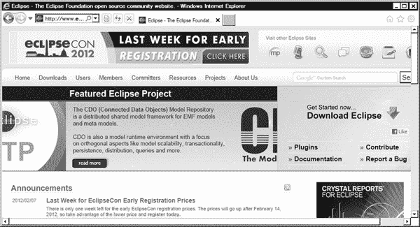

**图 3-12。** *月食网站*

点击下载页面的链接。如[图 3-13](#fig_3_13) 所示，您将看到一长串您选择的操作系统(在本例中是 Windows)的可下载 Eclipse 版本。在这个列表中，Eclipse Classic 是您可以下载的最基本的 Eclipse 包。它只包含 Eclipse 平台和 Java 开发工具(JDT)。您当然可以从这个包开始，然后安装您选择的其他插件。

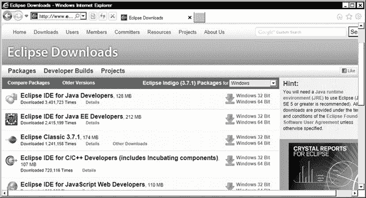

**图 3-13。** *月食下载页面*

这个列表中的其他 Eclipse 包只是包含了一组常用的插件，这些插件是用 Eclipse 平台为主要编程语言预先打包的。你可以在`[http://www.eclipse.org/downloads/compare.php](http://www.eclipse.org/downloads/compare.php)`找到这些包的详细对比。

#### 在 Windows 上安装 Eclipse

Microsoft Windows 的 Eclipse 安装包以 ZIP 存档文件的形式提供。只需右击该文件并从上下文菜单中选择 **Extract All…** 。

如[图 3-14](#fig_3_14) 所示，Windows 会提示输入解压文件的目标目录。在本节中，我们将假设目标目录是 c 盘的根目录`C:\`。

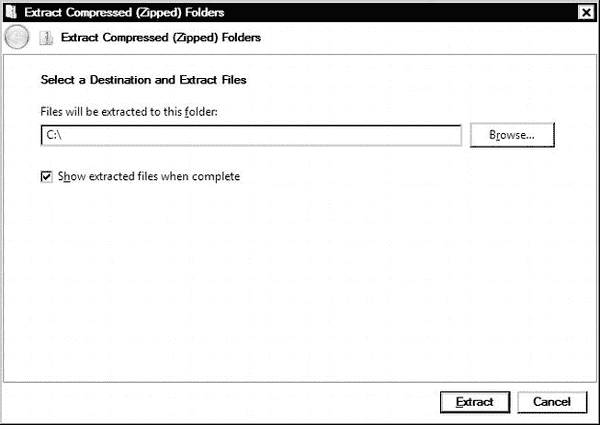

**图 3-14。** *解压 Eclipse ZIP 包到它的目的地*

当这个过程完成后，Eclipse 将被安装在`C:\eclipse`目录下，如图[图 3-15](#fig_3_15) 所示。您现在可以考虑创建一个 Eclipse 应用的快捷方式。

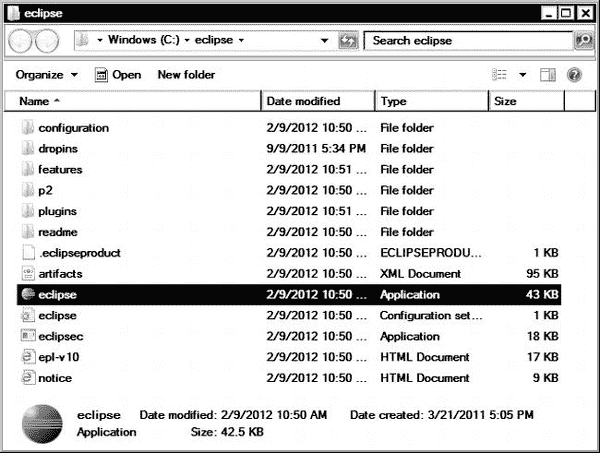

**图 3-15。**安装后的 *Eclipse 文件*

#### 在 Mac OS X 上安装 Eclipse

Mac OS X 的 Eclipse 安装包以 GZIP 压缩 TAR 文件的形式提供。下载完成后，Eclipse 将出现在您的`Downloads`目录中。根据操作系统的版本，您可能需要双击以提取存档文件(如果尚未提取)。

您可以将 Eclipse 从`Downloads`目录拖放到您的`Applications`目录，如图[图 3-16](#fig_3_16) 所示。

**图 3-16。** *将 Eclipse 从下载目录移动到应用目录*

稍后，您还可以将 Eclipse 添加到您的仪表板中，以便于访问。

#### 在 Linux 上安装 Eclipse

Linux 的 Eclipse 安装包以 GZIP 压缩 TAR 文件的形式提供。打开一个终端窗口，将目录切换到您想要安装 Eclipse 的目的地，如图[图 3-17](#fig_3_17) 所示。要提取 Eclipse 文件，在命令行上发出`tar zxf eclipse-java-indigo-SR1-linux-gtk.tar.gz`，根据 Eclipse 的版本替换文件名。

**图 3-17。**T2】在 Linux 上安装 Eclipse

Eclipse 现在已经可以使用了。您可能会发现创建 Eclipse 应用的快捷方式非常方便。

### 探索月食

您现在已经准备好开始使用 Eclipse 了。在这一节中，我们将开始探索 Eclipse 及其使用的术语。

#### 工作空间

当你启动 Eclipse 时，会提示你选择工作区目录，如图[图 3-18](#fig_3_18) 所示。在 Eclipse 术语中，*工作区*是存储项目、源代码和 Eclipse 设置的目录。

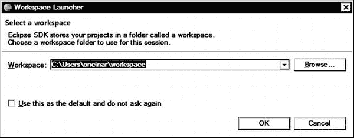

**图 3-18。** *Eclipse 启动时的工作区选择对话框*

如果使用默认设置，Eclipse 将在用户的主目录下创建一个名为`workspace`的新目录。在 Workspace Launcher 对话框中，您也可以将这个工作区设置为默认工作区，Eclipse 下次不会再提示它。

工作区对于组织项目非常有用。例如，我同时在两个主要工作区工作:一个是与工作相关的项目，另一个是我的车库项目。然而，许多 Eclipse 开发人员可以很好地使用单个工作区。

在您选择了您的工作空间之后，Eclipse 会用欢迎屏幕来欢迎您，如图 3-19 所示。在这里，您可以找到有用的 Eclipse 资源链接，比如教程和示例。在右上角，单击工作台链接进入主屏幕。

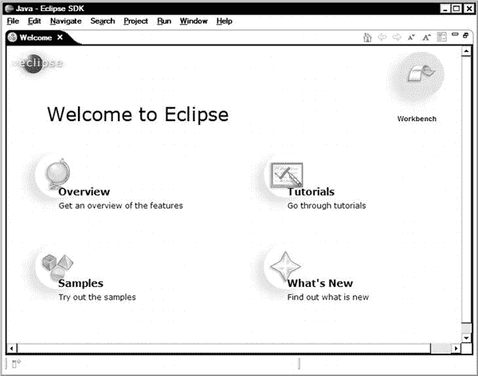

**图 3-19。** *月食的开场欢迎画面*

**提示:**选择**帮助**T4】欢迎可以随时回到欢迎界面。

#### 工作台

在 Eclipse 术语中， *Workbench* 指的是桌面开发环境。这是图 3-20 中[所示的 Eclipse 窗口的名称。每个工作台都包含一组透视图，以及它们各自的视图、编辑器、菜单和工具栏项。](#fig_3_20)

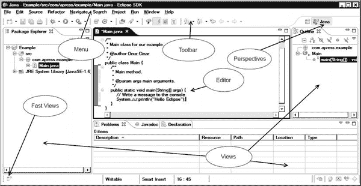

**图 3-20。** *Eclipse 工作台*

您可以一次打开多个工作台。要打开一个新工作台，选择**窗口**  **新窗口**。

#### 视角

一个*透视图*定义了视图集和视图在工作台中的布局。每个透视图都旨在帮助完成特定类型的任务:

*   **Java 透视图**:这个透视图结合了开发 Java 应用时常用的视图、菜单和工具栏。
*   **Debug 透视图**:这个透视图包含了与故障排除和调试 Java 应用相关的视图。

Eclipse 为常见任务提供了预定义的透视图。您还可以根据自己的需求修改透视图并定义新的透视图。为此，选择**窗口**  **自定义视角**。

您可以使用视角切换器，如[图 3-21](#fig_3_21) 所示，或者选择**窗口**T5】打开视角随时切换视角。

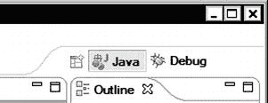

**图 3-21。** *视角切换器*

当您启动一个新的任务时，比如调试一个项目，Eclipse 还会提出改变透视图的建议。这允许根据当前任务在透视图之间自动切换。

#### 编辑

编辑器允许您编辑源代码和资源文件。根据文件类型，Eclipse 支持多种编辑器风格。例如，源代码和 XML 资源文件是用不同的编辑器类型处理的。

大多数文件类型已经用 Eclipse 中正确的编辑器进行了映射。如果 Eclipse 找不到特定文件类型的内部编辑器，它就依赖操作系统来找到外部编辑器。例如，如果您试图打开一个 PNG 格式的图形文件，由于 Eclipse 没有内部图形编辑器，它将依靠操作系统的映射来启动 PNG 文件的默认编辑器。根据活动编辑器的类型，仅显示相关的工具栏和菜单项。

可以同时打开任意数量的编辑器。编辑器在编辑器区域中以单独的选项卡出现，如图[图 3-22](#fig_3_22) 所示。在任何给定时间，只能有一个编辑器处于活动状态。

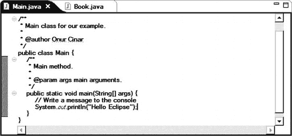

**图 3-22。** *编辑区*

您可以通过右键单击编辑器选项卡，从上下文菜单中选择**移动**  **编辑器**，并将分离的编辑器移动到您喜欢的角落位置，将编辑器区域分成多个选项卡组。

#### 观点

视图为项目和编辑器提供了可选的表示，允许在工作台中轻松导航和访问信息。例如，Outline 视图提供了当前编辑的源文件中的方法和变量的列表，允许在编辑器中轻松导航。

Eclipse 提供了许多视图。要打开一个新视图，选择**窗口**  **显示视图**。如[图 3-23](#fig_3_23) 所示，下拉菜单只显示最常用的视图。如需完整列表，请选择**其他…** 。

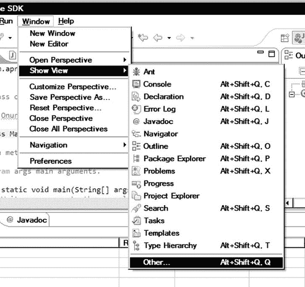

**图 3-23。** *选择视图*

根据透视图的布局，视图可以始终可见、堆叠在选项卡式笔记本中或最小化。视图可能在视图区域中嵌入了自己的工具栏和菜单。

#### 快速查看

*快速视图*是隐藏视图，可以使用工作台左下角状态栏上的快速视图图标快速打开和关闭，如图[图 3-24](#fig_3_24) 所示。

**图 3-24。** *状态栏上的快速查看图标*

点击快速查看图标，弹出下拉菜单，如图[图 3-25](#fig_3_25) 所示。

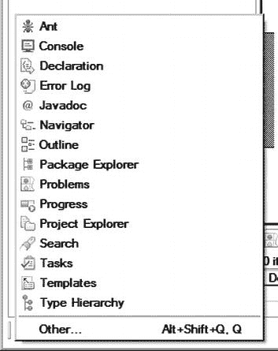

**图 3-25。** *快速查看下拉菜单*

快速视图的工作方式与其他视图类似，但在不使用时不会占用任何屏幕空间。您可以将任何视图拖放到快速视图图标上，使其成为快速视图。

**提示:**或者，与快速视图相同类型的行为可以通过最小化视图来实现。最小化视图以类似工具栏的方式显示。它们比快速视图更容易激活，因为每个最小化视图都可以通过其图标容易地识别，该图标在显示器上总是可见的。

##### 快速查看

快速视图是隐藏的视图，当通过组合键触发时，显示在编辑器区域的顶部。快速视图旨在提供对光标下的元素或当前活动编辑器的信息的轻松访问。快速大纲视图和快速类型层次视图就是例子。

#### 菜单

Eclipse 有不同种类的菜单。其中一些菜单比其他的更难发现。最明显的是工作台顶部的主菜单，如图[图 3-26](#fig_3_26) 所示。

**图 3-26。** *主菜单*

视图也可以有自己的菜单，如视图工具栏上朝下的三角形图标所示，如图 3-27 所示。单击此图标显示视图的菜单。

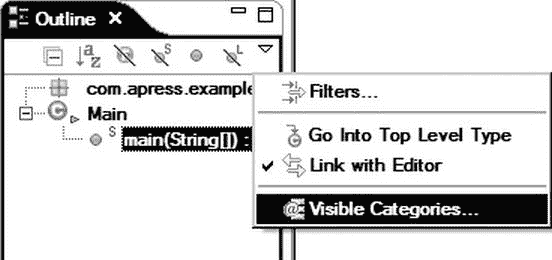

**图 3-27。** *一个查看菜单*

工作台中的子窗口也提供了一个菜单，也称为系统菜单，用于窗口相关的操作。右键单击窗口的标题栏可以激活该菜单，如图[图 3-28](#fig_3_28) 所示。

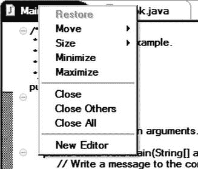

**图 3-28。** *一个系统菜单*

编辑器和大多数视图还为各种任务集提供了上下文菜单。您可以通过右击该视图上的任意位置来访问该菜单，如图[图 3-29](#fig_3_29) 所示。

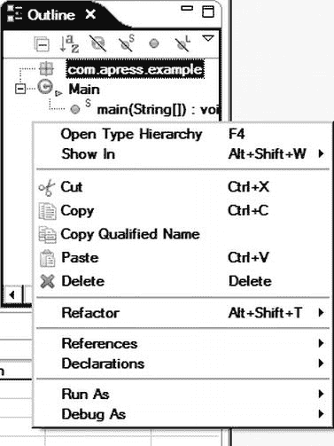

**图 3-29。** *一个查看菜单*

#### 工具栏

工具栏为常见任务提供快捷方式。工作台包含多种类型的工具栏。最重要的是屏幕上方主菜单下方的工具栏，如图[图 3-30](#fig_3_30) 所示。该工具栏包含最常用的 Eclipse 任务的图标。

**图 3-30。** *顶部工具栏*

根据所关注的编辑器或视图，工具栏项目可能会在启用和禁用状态之间切换，以反映任务在当前上下文中的可用性。

另一个工具栏出现在工作台的右下角。它包含欢迎屏幕中提到的资源的快捷方式。

视图也可能有工具栏。这些工具栏位于视图内，视图标题的正下方，如图[图 3-31](#fig_3_31) 所示。

**图 3-31。** *大纲视图工具栏*

Eclipse 还提供了一个工具栏，可以方便地访问最小化视图，如图 3-32 所示。

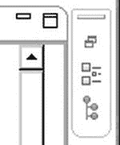

**图 3-32。** *工具栏用于最小化视图*

#### 项目

一个*项目*是 Eclipse 中最大的结构单元，用于分组和组织相关的文件、文件夹、资源、设置和其他工件。例如，Java 项目是一组源文件、资源和设置。

当前工作区中可用的项目通过项目浏览器视图呈现给用户，如图[图 3-33](#fig_3_33) 所示。

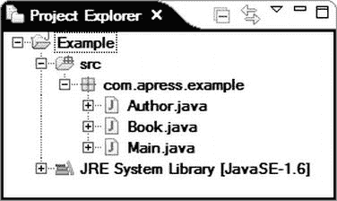

**图 3-33。** *项目浏览器视图*

项目可以是打开的，也可以是关闭的。当项目处于关闭状态时，它需要较少的内存，在构建期间不会被检查，并且在工作台中不可编辑。关闭项目以缩短活动项目的构建时间始终是一个好的做法。

要创建新项目，从顶部菜单栏中选择**文件**  **新项目**。您将看到新项目对话框，其中列出了可用的项目类型，如图 3-34 所示。

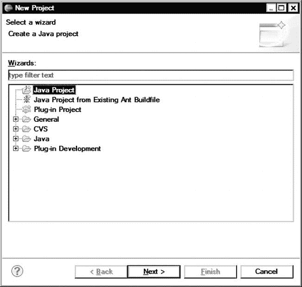

**图 3-34。** *新建项目向导对话框*

### 总结

在本章中，我们首先介绍了在 Microsoft Windows、Mac OS X 和 Linux 系统上为 Eclipse 建立合适的工作环境的步骤。接下来，我们简要回顾了 Eclipse 架构，以便更好地从概念上理解 Eclipse 平台通常是如何工作的。然后我们探索了最常用的用户界面组件。例如工作区、工作台、透视图、编辑器和视图。

这一章为后面的章节奠定了基础。在下一章，我们将探索导航、重构、原型和 Eclipse 平台提供的其他高级特性。

### 参考文献

本章使用了以下参考资料:

*   `[http://www.ibm.com/developerworks/rational/library/nov05/cernosek](http://www.ibm.com/developerworks/rational/library/nov05/cernosek)`Eclipse简史
*   关于 Eclipse 基金会，`[http://www.eclipse.org/org/](http://www.eclipse.org/org/)`
*   Eclipse 平台技术概述，`[http://www.eclipse.org/whitepapers/eclipse-overview.pdf](http://www.eclipse.org/whitepapers/eclipse-overview.pdf)`
*   Eclipse 文档，`[http://help.eclipse.org/indigo/index.jsp](http://help.eclipse.org/indigo/index.jsp)`