## 第五章

## Eclipse 的 Android 开发工具

在前四章中，我们已经非常详细地研究了 Android 框架和 Eclipse 集成开发环境。在这一章中，我们将使用 Eclipse 的 Android 开发工具(ADT)插件把这两个世界粘在一起。我们将从安装 ADT 和 Android 软件开发工具包(SDK)开始我们的旅程。然后我们将开始探索它们提供的视图和工具。在下一章，在开发我们的第一个 Android 项目时，我们将开始把这些视图和工具付诸实践。

### 准备日食

尽管 Eclipse 附带了用于 Java 开发的工具，但是为了使用 Eclipse 开发 Android 应用程序，还需要特定于 Android 的平台 API 和应用程序打包工具。

#### 安装 Android 开发工具

正如在第 3 章中所解释的，Eclipse 平台是围绕插件的概念构建的。ADT 是一组用于 Eclipse 平台上 Android 应用程序开发的插件。

ADT 扩展了 Eclipse 集成开发环境的功能，允许应用程序开发人员执行以下任务:

*   快速建立新的 Android 项目
*   可视化设计高级用户界面
*   访问和使用 Android 框架组件
*   调试、单元测试和发布 Android 应用程序

ADT 是在开源 Apache 许可下提供的免费软件。关于最新 ADT 版本和最新安装步骤的更多信息可以在 Eclipse 的 ADT 插件页面(`[http://developer.android.com/sdk/eclipse-adt.html](http://developer.android.com/sdk/eclipse-adt.html)`)上找到。

我们将使用 Eclipse 的安装新软件向导来安装 ADT。从顶部菜单栏选择**帮助**T3】安装新软件启动向导，如图[图 5-1](#fig_5_1) 所示。

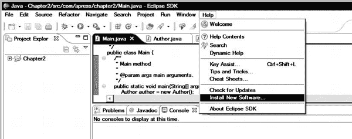

**图 5-1。** *选择安装新软件*

向导将启动并显示可用插件的列表。由于 ADT 不是官方 Eclipse 软件存储库的一部分，您需要首先添加 Android 的 Eclipse 软件存储库作为一个新的软件站点。为此，点击添加按钮，如图[图 5-2](#fig_5_2) 所示。

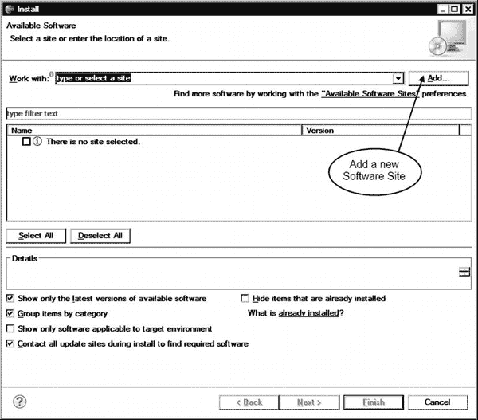

**图 5-2。** *开始添加新软件*

将出现“添加存储库”对话框。在“名称”字段中，输入引用该存储库的唯一名称。在位置字段中，输入 Android 的 Eclipse 软件仓库的 URL:`[https://dl-ssl.google.com/android/eclipse/](https://dl-ssl.google.com/android/eclipse/)`，如图[图 5-3](#fig_5_3) 所示。

**图 5-3。** *添加存储库对话框完成，带有 ADT 信息*

添加新软件站点后，安装新软件向导会显示可用的 ADT 插件列表，如图[图 5-4](#fig_5_4) 所示。这些插件中的每一个对 Android 应用程序开发都至关重要，强烈建议您安装所有的插件。(我们将在本章后面的“探索 ADT”一节中讨论这些插件。)单击 Select All 按钮选择所有 ADT 插件，然后单击 Next 按钮进入下一步。

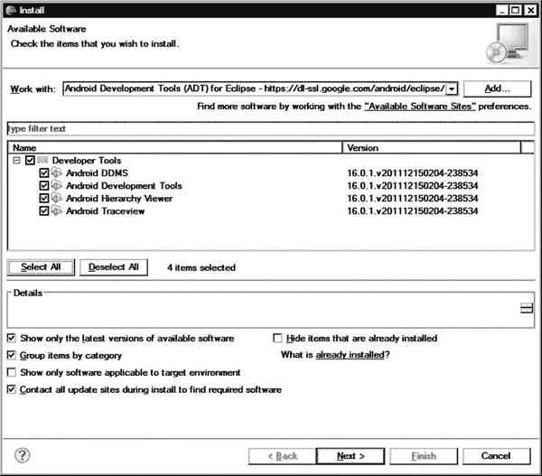

**图 5-4。** *安装 ADT 开发工具*

Eclipse 将检查所选插件的列表，将所有依赖项添加到列表中，然后提交最终的下载列表以供审查。单击“下一步”按钮进入下一步。

ADT 还包含一组具有不同许可条款的其他第三方组件。在安装过程中，Eclipse 会显示每个软件许可，并要求用户接受许可协议的条款，以便继续安装。查看许可协议，选择接受其条款，然后单击完成按钮开始安装过程。Eclipse 将报告安装的进度，如图 5-5 中的[所示。](#fig_5_5)

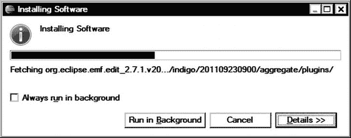

**图 5-5** *。ADT 安装进度*

ADT 插件来自未签名的 JAR 文件，这可能会触发安全警告，如图[图 5-6](#fig_5_6) 所示。单击“确定”按钮消除警告并继续安装。当 ADT 插件安装完成后，Eclipse 将需要重启以应用更改。

**图 5-6。** *由于未签名的 ADT 插件导致的安全警告*

#### 安装 Android SDK

ADT 是一组插件，将 Android 开发工具融入 Eclipse 集成开发环境；它不是 Android SDK 的替代品。

Android SDK 是一套全面的开发工具，包括 Android 平台 Java 库、应用打包程序、调试器、仿真器和大量文档。为了使用 ADT 做任何有用的事情，需要在机器上安装 Android SDK。重新启动后，ADT 会用 SDK 配置向导欢迎您，如图[图 5-7](#fig_5_7) 所示。

**图 5-7。** *Android SDK 配置向导*

SDK 配置向导允许您将 ADT 指向现有的 Android SDK(如果之前已安装)，或者指示 ADT 为您下载并安装 Android SDK。单击“完成”按钮继续 SDK 配置过程。SDK 配置向导将指导您完成将 Android SDK 安装到您的主机上的过程。请注意 Android SDK 的安装目录，因为您将需要它来更新系统变量`Path`，如下所述。

##### 更新路径

在 Android SDK 安装期间，`Path`变量不会自动添加到系统中。ADT 不要求在系统变量`Path`中包含 SDK 二进制文件，但是为了使这些文件易于访问，强烈建议您添加它们。

###### 更新 Microsoft Windows 上的路径

正如我们在第 3 章中所做的那样，将 JDK 添加到系统`Path`变量中，打开控制面板并选择系统以启动系统属性对话框。切换到高级选项卡，并单击环境变量按钮。从系统变量窗格中选择变量`Path`，并点击编辑按钮。将`;<*sdk-dir*>\tools;<*sdk-dir*>\platform-tools`追加到`Path`变量值，将`<*sdk-dir*>`替换为 Android SDK 安装目录，如图[图 5-8](#fig_5_8) 所示。单击确定按钮保存更改。

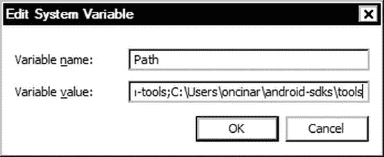

**图 5-8。** *添加 Android SDK 目录到 Windows 系统路径变量*

###### 更新 Mac OS X 和 Linux 上的路径

要将 Android SDK 二进制目录附加到您的系统`Path`变量中，请在 Mac OS X 上打开一个终端窗口，或者在 Linux 上打开一个 shell 窗口，然后输入以下命令(将`<*sdk-dir*>`替换为 Android SDK 安装目录):

`export PATH=$PATH:<sdk-dir>/tools:<sdk-dir>/platform-tools >> ~/.bashrc`

[图 5-9](#fig_5_9) 显示了终端窗口中的命令。

**图 5-9。** *添加 Android SDK 目录到 Mac OS X 系统路径变量*

#### 安装平台 API

默认情况下，SDK 配置向导将安装最新版本的 Android APIs 但是，您可以随时使用 Android SDK 管理器安装不同版本的 Android APIs。要启动 SDK 管理器，从顶部菜单栏选择**窗口**  ** Android SDK 管理器**，如图[图 5-10](#fig_5_10) 所示。

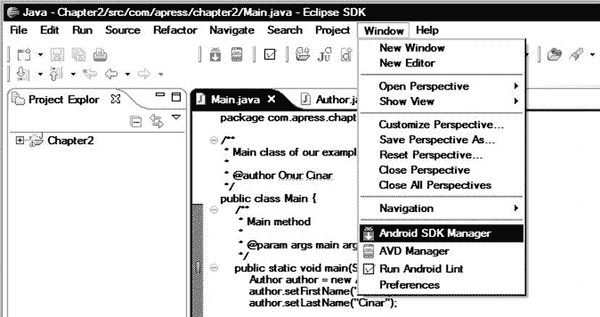

**图 5-10。** *打开 Android SDK 管理器*

如[图 5-11](#fig_5_11) 所示，Android SDK 管理器显示了一个 Android SDK 组件列表，如工具、API 和插件，可以下载。该列表以树状方式构建。列表中的第一项是工具。这些是 Android SDK 的通用和必需组件。强烈建议您使用最新版本的工具组件。列表中的其他组件按照 Android 版本和 API 级别分组，它们是可选的。

**图 5-11。** *使用 Android SDK 管理器*

单击这些 Android 版本旁边的加号，查看可用组件列表。根据所选的版本，您将看到一个核心组件列表，以及可用的附加组件。尽管此列表会因所选版本而异，但以下是最常见的组件:

*   **SDK 平台**:这是为所选 Android 版本开发应用程序必须安装的核心组件。Android SDK 管理器将 SDK 平台安装在`<*sdk-dir*>/platforms/android-<*api-level*>`目录下，仿真器系统镜像安装在`<*sdk-dir*>/system-img/android-<*api-level*>`目录子文件夹下。Android SDK 基于您的应用程序的目标平台为您的应用程序提供这些资源。Android 开发人员不希望直接与这些文件交互。
*   **Android SDK**文档:这提供了在`[http://developer.android.com](http://developer.android.com)`网站上可获得的 Android 资源的离线版本。如果选择安装，Android SDK 管理器会将文档安装在`<*sdk-dir*>/docs`目录下。您可以通过将 web 浏览器指向`file:///<*sdk-dir*>/docs/index.html`来访问文档的主页。为了快速和脱机访问，您可以考虑安装此组件。
*   **SDK**的样例:这些样例应用程序演示了 Android APIs 的使用。Android SDK 管理器将示例应用程序安装在`<*sdk-dir*>/samples/android-<*api-level*>`目录子文件夹下。强烈建议您安装示例应用程序，因为它们是了解 Android API 特性并进行实验的绝佳资源。
*   【Android SDK 的源代码:这些提供了 Android 框架的源代码。Android SDK 管理器将源代码安装在`<*sdk-dir*>/sources/android-<*api-level*>`目录下。在对 Android 应用程序进行故障诊断时，这些源文件非常方便，因为它们允许开发人员深入 Android 框架，以快速确定许多模糊问题的根本原因。
*   **谷歌公司**的谷歌 API:这不是核心组件的一部分，是作为一个附加组件发布的。Android SDK 管理器将这些 API 安装在`<*sdk-dir*>/add-ons`目录下。这个插件允许你使用谷歌的 API 和服务开发应用程序，比如谷歌地图。它还附带了一个扩展的模拟器系统映像，其中包含默认模拟器系统映像中没有的 Google 系统组件。

你可能还记得第一章的内容，Android 市场高度分散，Android 的新版本传播非常缓慢。为了覆盖更大的用户群，在最广泛支持的 API 级别之上构建应用程序是一种常见的做法。在撰写本文时，使用最广泛的 Android 版本是 2.3.3，它支持 API 级。

要安装 API level 10，单击列表中 Android 2.3.3 (API 10)旁边的加号将其展开。选择 SDK 平台组件和您想要安装的任何其他组件，然后单击“安装软件包”按钮。Android SDK 管理器将要求您接受所选组件的许可条款。选择 Accept All，然后单击 Install 按钮继续安装软件包。

某些组件可能要求您在制造商的网站上注册并提供下载凭据。在这些情况下，Android SDK 管理器会显示相应的对话框来指导您完成整个过程。Android SDK 管理器将选定的组件安装在 SDK 目录下相应的目录中。SDK 目录的位置显示在 Android SDK 管理器对话框的顶部，标记为“SDK 路径”(参见[图 5-11](#fig_5_11) )。

### 探索 ADT

ADT 提供了从 Eclipse 内部对 Android SDK 组件的访问。在本节中，我们将探索这些组件:Android 虚拟设备管理器、Dalvik 调试监视器、Traceview、层次结构查看器和 Android Lint。

#### 安卓虚拟设备管理

Android SDK 带有一个全功能模拟器，一个在你的机器上运行的虚拟设备。Android 模拟器允许您在本地机器上开发和测试 Android 应用程序，而无需使用物理设备。

Android 模拟器运行完整的 Android 系统堆栈，包括 Linux 内核。这是一个完全虚拟化的设备，可以模仿真实设备的所有硬件和软件功能。用户可以使用 Android 虚拟设备(AVD)管理器定制这些功能。要启动 AVD 管理器，从顶部菜单栏选择**窗口**  ** AVD 管理器**，如图[图 5-12](#fig_5_12) 所示。

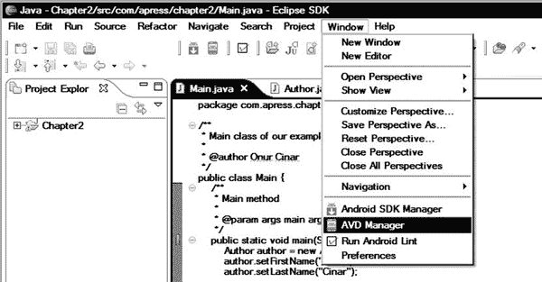

**图 5-12。**T3】启动 AVD 管理器

AVD 管理器允许您定义多个虚拟设备配置。AVD 管理器对话框列出了之前定义的配置，如图[图 5-13](#fig_5_13) 所示。

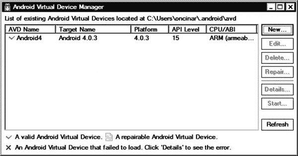

**图 5-13。***AVD 管理器对话框中列出的现有虚拟设备*

##### 配置新的虚拟设备

要定义新的虚拟机实例，请单击 AVD 管理器对话框右侧的新建按钮。这将打开创建新的 Android 虚拟设备(AVD)对话框，如图[图 5-14](#fig_5_14) 所示。

**图 5-14。** *配置新的虚拟设备*

该对话框包含以下字段:

*   **名称**:这是新虚拟设备配置的唯一名称。
*   **目标**:这是虚拟设备的 Android 版本号和 API 级别。下拉列表仅显示使用 Android SDK 管理器安装的 Android 版本。如果首选版本不可用，您将需要使用 Android SDK 管理器安装它。
*   **CPU/ABI** :这是新虚拟设备的机器架构。目前只支持 ARM 机器架构。
*   **SD 卡**:这或者是 SD 卡的大小，或者是现有磁盘镜像的位置。如果此虚拟设备配置不需要 SD 卡，此字段可以为空。
*   **快照**:这是为了允许在会话之间保持虚拟设备的状态。
*   **皮肤**:这是虚拟设备的皮肤和屏幕尺寸。下拉列表是根据已安装的版本和附件填充的。也可以定义自定义屏幕尺寸。
*   **硬件**:这是虚拟设备支持的硬件特性列表，比如 GPS 和摄像头。您可以通过点击新建按钮并选择单个项目来启用功能，如图[图 5-15](#fig_5_15) 所示。

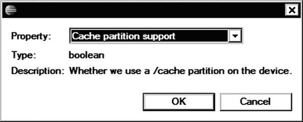

**图 5-15。** *添加硬件特性*

在接下来的章节中，我们将使用 Android 模拟器。建议使用以下虚拟机配置来执行这些章节中的示例代码片段:

*   Name 参数应该设置为 **Android_10** 。
*   目标参数应该设置为**Android 2 . 3 . 3–API Level 10**。如果此目标在下拉列表中不可用，请使用 Android SDK 管理器下载它。
*   SD 卡的大小至少应设置为 128MB。

其他设置可以保持不变。

设置参数后，单击创建 AVD 按钮存储虚拟设备配置。

##### 启动模拟器

虚拟设备配置可用于随时启动模拟器实例。选择虚拟设备配置后，单击 Start 按钮使用所选的虚拟设备配置启动一个新的模拟器实例。在启动仿真器之前，AVD 管理器显示启动选项对话框，如图[图 5-16](#fig_5_16) 所示。

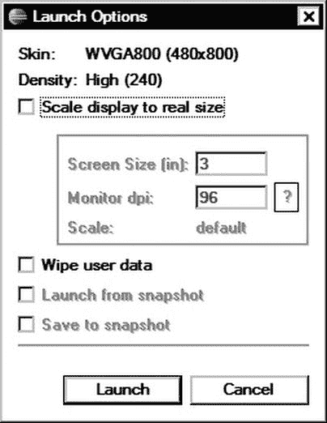

**图 5-16。** *模拟器启动选项对话框*

模拟器屏幕可能看起来太大，这取决于您的屏幕大小和分辨率。使用“启动选项”对话框，选中“按实际大小缩放显示”框，并设置监视器大小和分辨率来缩放模拟器。

“启动选项”对话框还允许您擦除用户数据，以将模拟器恢复到初始状态。如果在配置期间将快照设置为 Enabled，则 Launch Options 对话框还允许您从现有快照启动模拟器，并决定模拟器状态是应该存储在快照中还是在终止时丢弃。

点击启动选项对话框中的启动按钮，启动模拟器，如图[图 5-17](#fig_5_17) 所示。Android 模拟器可能需要一些时间来启动，这取决于您的主机平台的 CPU 能力。

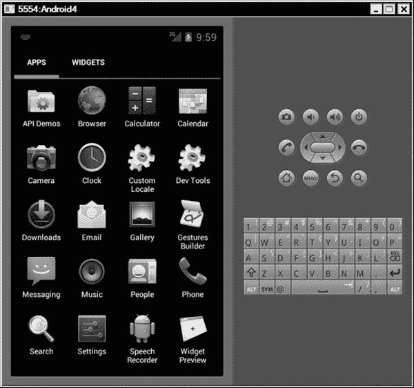

**图 5-17。** *仿真器实例*

##### 控制仿真器

模拟器窗口的左窗格显示模拟器显示，右窗格包含软键。可以使用鼠标模拟触摸事件。此外，在[表 5-1](#tab_5_1) 中列出的组合键可用于控制硬件功能。

T2】

##### Android 控制台

基于鼠标和键盘的控制方法允许用户与仿真器交互并执行常见任务。但是，通过这种方法无法直接控制硬件功能，如网络连接。Android 控制台提供了一个广泛的界面，允许用户控制仿真器和硬件功能。在一台机器上，多个模拟器实例可以并行运行。每个模拟器实例都被自动分配一个唯一的端口号，介于 5554 和 5584 之间。该编号出现在仿真器窗口标题栏上的配置名称之前(参见图 5-17[)。](#fig_5_17)

模拟器监听该端口号以提供对 Android 控制台的访问。可以使用 telnet 应用程序连接到该端口来访问 Android 控制台。Telnet 应用程序建立到给定端口的 TCP 连接，并允许用户与远程服务交互。在 Mac OS X 和 Linux 平台上，telnet 应用程序由操作系统提供。对于 Windows 系统，可以下载一个免费的 telnet 应用，比如 PuTTY ( `[http://www.chiark.greenend.org.uk/~sgtatham/putty/download.html](http://www.chiark.greenend.org.uk/~sgtatham/putty/download.html)`)。

使用基于您的系统的 telnet 应用程序，连接到与模拟器实例相关联的地址`localhost`和端口号。连接到 Android 控制台后，基于文本的界面允许您控制模拟器和硬件功能。输入 **`help`** ，可以得到可用命令列表，如图[图 5-18](#fig_5_18) 所示。

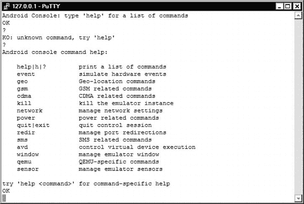

**图 5-18。** *仿真器控制端口命令列表*

#### 达尔维克调试监控服务器

Android SDK 附带了一个名为 Dalvik Debug Monitor Server (DDMS)的调试工具。DDMS 允许开发人员监控连接的设备和仿真器并与之交互。它提供端口转发、屏幕捕获、访问进程和线程状态、堆信息、文件浏览器、日志和许多其他功能。

DDMS 还充当运行在设备或仿真器上的 Dalvik 虚拟机与 Eclipse 调试器之间的桥梁。它处理底层通信设置，以允许 Eclipse 调试器与 Dalvik 虚拟机通信。这使得开发人员可以轻松调试 Android 应用程序，就像它们是运行在主机上的普通 Java 应用程序一样。

尽管 DDMS 是作为一个独立的应用程序与 Android SDK 一起提供的，但它被 ADT 分解成多个 Eclipse 视图，并作为一个结合了这些单独视图的 Eclipse 透视图提供。在这一章中，我们将重点介绍 DDMS 的日食透视风味。

要启动 DDMS 透视图，从顶部菜单栏中选择**窗口**  **打开透视图**  **其他…** ，并从打开透视图对话框中选择 DDMS。 DDMS 透视图由多个特定于 Android 的视图组成，如图[图 5-19](#fig_5_19) 所示，并在以下章节中描述。

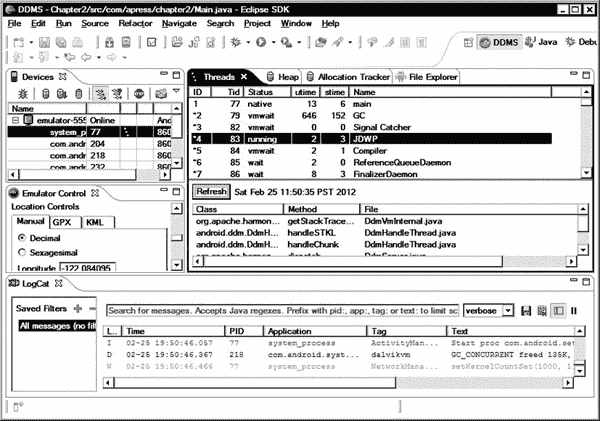

**图 5-19** *。DDMS 视角*

##### 设备视图

Devices 视图提供了连接的设备和仿真器的列表。通过单击每个设备左侧的加号，可以展开每个设备以显示正在运行的应用程序列表。设备视图还提供了一个工具栏和下拉菜单来启动所选设备或应用程序的常用操作，如图[图 5-20](#fig_5_20) 所示。

**图 5-20。** *设备视图下拉菜单*

设备视图下拉菜单提供以下选项:

*   **调试过程**:该选项为选定的应用程序启动一个调试会话。
*   **更新堆**:该选项支持收集所选应用程序的堆信息。
*   **转储 HPROF 文件**:该选项将所选应用程序的堆转储到 HPROF 格式的文件中，以便进行更深入的内存调查。
*   **Cause GC** :该选项触发所选应用程序的垃圾收集，以释放未使用的内存。
*   **更新线程**:该选项支持跟踪所选应用程序的线程状态。
*   **Start Method Profiling** :该选项允许从所选的应用程序中收集方法调用的分析数据。
*   **停止进程**:该选项停止选中的申请进程。
*   **截屏**:该选项将设备的当前显示捕捉到一个文件中。
*   **重置 adb** :该选项重置 Android 调试桥(adb)，该调试桥提供主机和设备之间的连接。

##### 仿真器控制视图

如果所选设备是仿真器，仿真器控制视图允许模拟语音和数据网络以及位置状态，用于调试和测试目的，如图[图 5-21](#fig_5_21) 所示。

**图 5-21。** *仿真器控制视图*

模拟器控件视图功能分为三个部分:

*   **电话状态**:此部分允许更改设备网络状态的不同方面，如连接状态、网络速度和延迟。
*   **电话操作**:该部分允许针对设备生成呼叫和 SMS 消息，以便测试应用程序与传入语音呼叫和 SMS 消息的交互。
*   **位置控制**:该部分允许为设备设置一个模拟位置，以测试应用程序与位置变化的交互。可以将模拟位置指定为固定坐标，或者可以使用 GPX 或 KML 格式的坐标文件将多个位置注入到设备中。

##### 日志猫视图

图 5-22 中的[所示的 LogCat 视图提供了对设备日志信息的访问。它以表格的形式实时显示日志消息。该表分为多列，包括级别、时间、PID、应用、标签和消息。](#fig_5_22)

**图 5-22。** *显示日志消息的 LogCat 视图*

LogCat 视图允许按日志级别和基于消息过滤标准过滤日志消息。常用的日志过滤器也可以存储和重用。您可以使用 LogCat 视图界面将显示的日志消息保存到文件中。

##### 线程视图

Threads 视图提供对所选应用程序的线程状态和堆栈跟踪的访问。默认情况下，不启用线程跟踪。要访问线程信息，请使用设备视图选择应用程序，然后单击更新线程按钮。线程视图以表格的形式呈现现有线程的列表，如图[图 5-23](#fig_5_23) 所示。

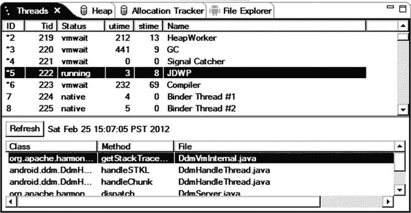

**图 5-23。** *选中应用的线程视图*

线程视图列提供每个线程的以下信息:

*   **ID** :这是分配给线程实例的虚拟机。
*   **TID** :这是 Linux 操作系统分配的线程 ID。
*   **状态**:线程的当前状态，可以是以下任意一种状态:
    *   运行中，当**执行代码**
    *   睡觉，当**睡在** `Thread.sleep()` **叫**
    *   监视器，当**等待监视器锁定**
    *   等待，当**在等待时** `Object.wait()` **呼叫**
    *   本机，当**执行本机代码**时
    *   Vmwait，当**等待虚拟机资源**
*   **Utime** :这是以 jiffies 为单位运行用户代码所花费的时间。
*   **Stime** :这是以 jiffies 为单位运行系统代码所花费的时间。
*   **名称**:这是应用程序赋予线程的名称。

**注:** A **jiffy** 是系统定时器中断一个滴答持续时间的时间单位。在 Android 系统中，一瞬间等于 4 毫秒。

##### 堆视图

堆视图提供关于所选应用程序正在使用的内存量的信息。它是研究记忆问题的一个非常重要的工具。它以表格的形式显示堆分配的列表，如图[图 5-24](#fig_5_24) 所示。此表显示了每个堆分配的计数、总大小和统计信息，按类类型分组。堆视图的底部窗格包含一个直方图，展示了每个分配大小的分配计数。

**图 5-24。** *堆视图*

默认情况下，不会从每个应用程序收集堆信息。要开始收集堆分配信息，请在 Devices 视图中选择应用程序，然后单击 Update Heap 按钮。堆视图将开始从应用程序收集堆分配信息。堆分配信息是在虚拟机进行垃圾收集时收集的。要获得堆分配的快速快照，单击 Cause GC 按钮触发垃圾收集。

##### 分配跟踪器视图

分配跟踪器视图允许跟踪所选应用程序的内存分配。对于研究复杂应用程序中的内存问题，这是一个非常有用的工具。该视图以表格形式提供分配列表，如图[图 5-25](#fig_5_25) 所示。这些列显示关于分配的信息，包括分配的类类型；分配大小；以及分配发生在哪个类、方法和线程中。

**图 5-25。** *分配跟踪器视图*

要开始从选定的应用程序收集分配数据，请单击开始跟踪按钮。使用该应用程序，执行作为内存调查主题的任何操作。在此过程中，您可以通过单击“获取分配”按钮来获取分配的快照。完成调查后，单击“停止跟踪”按钮停止分配跟踪器。

##### 文件浏览器视图

文件资源管理器视图允许用户与选定设备上的文件系统进行交互。如[图 5-26](#fig_5_26) 所示，以树和表相结合的形式展示了设备的文件系统。你可以通过点击目录左边的加号来展开目录。该列表还显示了每个文件和目录的大小、权限、修改日期和时间。

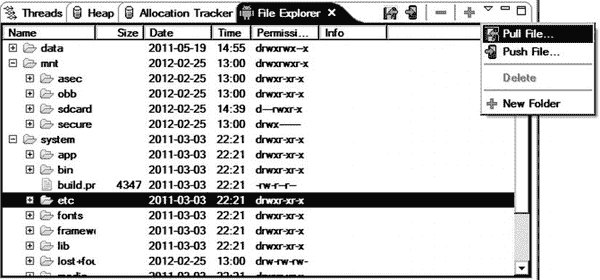

**图 5-26。** *文件浏览器查看所选设备上的列表文件*

文件资源管理器视图还通过其工具栏和下拉菜单提供文件操作，下拉菜单有以下选项:

*   **拉文件**:该选项将文件从设备下载到主机。
*   **推送文件**:该选项将文件从主机上传到设备。
*   **删除**:该选项从设备中删除所选文件。
*   **新文件夹**:该选项向设备添加新文件夹。

这些文件操作在一个受限制的用户帐户下运行，该帐户称为 shell 用户。因此，可以在设备上执行的操作受到该用户帐户权限的限制。如果操作由于限制而无法完成，文件资源管理器视图将显示一个错误对话框来通知用户。

#### Traceview

由于堆和分配跟踪器视图允许您分析其应用程序的内存消耗，Traceview 允许您分析应用程序执行期间 CPU 时间消耗的细分。Traceview 附带了 Android SDK，既可以作为独立的应用程序，也可以作为 Eclipse 编辑器插件。

Traceview 对记录的跟踪文件进行操作。默认情况下，Dalvik 虚拟机不会生成这些跟踪文件。要创建跟踪文件，您可以使用通过`android.os.Debug` API 提供的跟踪方法，或者您可以通过单击 Devices 视图中的 Start Method Profiling 按钮启用 DDMS 跟踪。Traceview 分析跟踪文件并给出结果，如图[图 5-27](#fig_5_27) 所示。

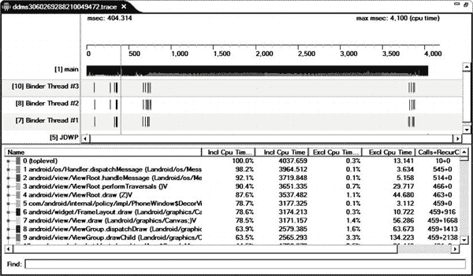

**图 5-27。** *Traceview 分析一个跟踪文件*

Traceview 有两个面板:

*   **时间线面板**:顶部面板在自己的行中显示每个线程的执行，时间向右增加。在这个线程中执行的每个方法都用颜色编码，并在时间轴上显示为一条细线。
*   **Profile panel** :底部面板显示每种方法所用时间的详细汇总。它显示了包容性和排他性的时代。独占时间是运行方法本身所花费的时间。Inclusive time 是运行该方法和从此方法调用的其他方法所花费的总时间。配置文件面板还显示了方法被调用的次数。该面板提供了大量信息，用于识别在应用程序执行期间消耗最多 CPU 时间的方法。

#### 层级查看器

*   Android 用户界面构建在布局组件之上，布局组件根据可用的屏幕空间动态定位其子视图。当这些布局和视图的结构不正确时，它们很容易降低整个应用程序的速度，并且很难在复杂的应用程序中找到这些瓶颈。
*   Android SDK 附带了一个名为 Hierarchy Viewer 的工具，允许您调试和优化用户界面。它提供了布局和视图层次的可视化表示。它还决定了测量、布局和绘制视图所需的时间。瓶颈是用颜色标记的，这使得它们很容易被发现。
*   层次查看器还提供了像素完美工具，它放大了用户界面。这允许您检查实际显示的像素属性，以便进行最后的处理。

尽管 Hierarchy Viewer 是 Android SDK 中的一个独立应用程序，但它被 ADT 分解成多个 Eclipse 视图，并作为一个合并了这些单独视图的 Eclipse 透视图提供。在这一章中，我们将关注 Eclipse 透视图风格的层次结构查看器。

要启动层次结构查看器透视图，从顶部菜单栏中选择**窗口**  **打开透视图**  **其他…** ，并从打开透视图对话框中选择层次结构查看器。层次结构查看器透视图由多个特定于 Android 的视图组成，如图 5-28 所示，并在以下章节中描述。

**图 5-28。** *层级视图*

##### Windows 视图

Windows 视图以树状格式列出连接的设备和仿真器。点击左边的加号可以展开每个设备以显示活动窗口，如图[图 5-29](#fig_5_29) 所示。

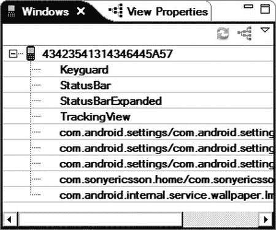

**图 5-29。** *显示活动窗口的窗口视图*

需要选择一个窗口才能使用层级查看器。如果您的应用程序在列表中不可见，请单击视图的刷新按钮以重新加载活动窗口列表。

##### 树形视图

树形视图以树状方式显示所选窗口的布局结构(参见[图 5-28](#fig_5_28) )。每个树项目都使用线条连接到其父项目，这使得更容易可视化视图层次结构。

每个视图项目都以其名称和资源 ID 作为标题。您可以拖动内容在视图中导航。在标题下面，测量、布局和绘制步骤所花费的时间用颜色编码，并显示为用绿色、黄色或红色填充的圆圈。红色表示视图组件在这些步骤中花费了太多时间。当您点击一个视图项目时，这些步骤的实际测量以毫秒为单位显示，如图[图 5-30](#fig_5_30) 所示。

**图 5-30。** *树形视图显示查看项目详情*

##### 树形总览视图

根据视图层次结构的大小，可能无法显示树视图中的所有视图和组件。对于视图层次内的导航，树形总览视图提供了代表整个树形视图窗口的较小地图，如图[图 5-31](#fig_5_31) 所示。当前选择的视图在地图上高亮显示。

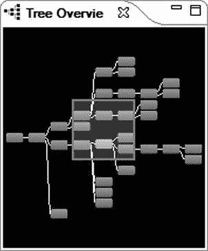

**图 5-31。** *将整个树形视图表示为地图的树形视图*

##### 查看属性视图

“视图属性”视图提供了对选定视图组件的属性的访问。“视图属性”视图在左窗格中显示为一个选项卡。使用 View Properties 视图，您可以检查所有的属性，而不需要查看应用程序源代码。为了使导航更容易，属性以按属性类别组织的树形格式显示，如图[图 5-32](#fig_5_32) 所示。

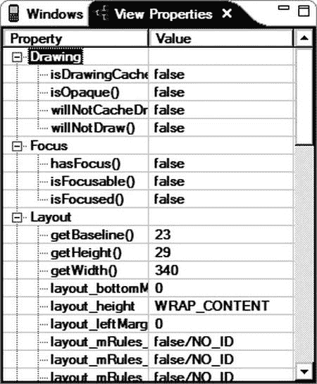

**图 5-32。** *视图属性视图列出活动视图的所有属性*

##### 布局视图

布局视图提供了整个窗口的框图表示，如图 5-33 所示。选择视图块时，将在树视图和视图属性视图中选择相应的视图。

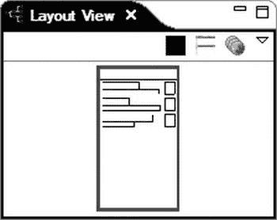

**图 5-33。** *显示块表示的布局视图*

块的轮廓颜色也提供了关于视图的额外信息:

*   红色粗体表示当前在树视图中选择的视图。
*   浅红色代表当前选中视图的父视图。
*   白色表示不是当前选定视图的父视图或子视图的可见视图。

#### Android Lint

Android Lint 是一个工具，用于扫描 Android 应用程序项目中的潜在错误和最常见的错误。它还会查找布局、资源和清单文件中的任何不一致之处。它是一个非常强大的工具，应该在开发周期中使用，以保持应用程序源代码的整洁和健壮。

Android Lint 工具可以检测以下问题:

*   缺失和未使用的翻译
*   未使用和不一致的资源
*   字符串资源的排版建议
*   可访问性和国际化问题，如硬编码字符串
*   布局性能问题
*   布局和输入框的可用性问题
*   图标和图形问题，如重复的图标和错误的大小
*   清单错误
*   使用不推荐使用的 API

Android Lint 既作为独立的应用程序提供，用于快速集成到现有的构建系统中，也作为 Eclipse 插件集成到开发环境中。在这一节中，我们将关注 Lint Eclipse 插件。

要启动 Android Lint，选择一个项目，从顶部菜单栏选择**窗口**  **运行 Android Lint** ，如图[图 5-34](#fig_5_34) 所示。

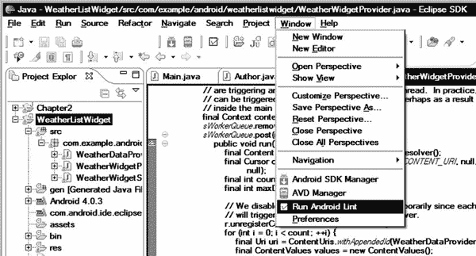

**图 5-34。** *选择运行 Android Lint*

Android Lint 遍历项目文件，并通过 Lint Warnings 视图显示其结果，如图[图 5-35](#fig_5_35) 所示。

**图 5-35。** *安卓线头警告视图*

Lint 警告以表格形式列出。这些列显示 Lint 警告消息以及相关的文件和行号。从表中选择一个警告项会在右窗格中显示已识别问题的详细描述。

通过其工具栏，Lint Warnings 视图还允许您对列出的警告启动以下操作:

*   **刷新**:再次检查项目文件，刷新 Lint 警告列表。
*   **修复**:如果解决方案已知，这将自动修复警告。
*   **忽略类型**:忽略所有相同类型的警告。例如，您可以忽略所有与图像密度相关的警告。
*   **删除**:从列表中删除选中的警告。
*   **删除所有**:从列表中删除所有警告。

Lint 也可以通过其首选项对话框进行配置。在 Windows 和 Linux 上选择**窗口**  **首选项**，或者在 Mac OS X 上选择 **Eclipse**  **首选项**，并从首选项类别列表中选择 Android，然后选择 Lint 错误检查以访问 Lint 属性。Lint 首选项对话框提供了可以通过 Lint 检测到的问题列表。使用此列表，您可以更改与这些问题相关的严重级别，如图[图 5-36](#fig_5_36) 所示。如果某个问题与项目无关，可以将其严重性级别设置为 Ignore，以便在 Lint 警告中隐藏这些问题。

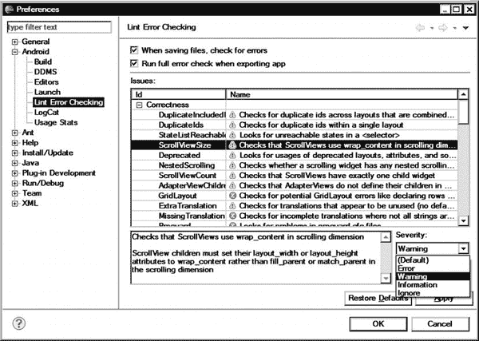

**图 5-36。** *设置线头偏好*

### 发布申请

如前几章所述，Android 平台要求每个应用程序都要经过其作者的签名，才能在 Android 平台上部署。ADT 提供了一个向导来指导开发人员完成签名过程。

在开发阶段，Android SDK 透明地生成一个调试密钥来自动签署应用程序，以简化流程。但是当应用程序要向公众发布时，Android 要求用发布密钥对其进行签名。

与其他移动平台不同，Android 不依赖认证机构向开发者颁发数字证书。每个 Android 开发者都可以在其主机上生成一个密钥并签署一个 Android 应用程序。当一个应用程序被安装在 Android 上时，它的签名被用来检查应用程序更新的真实性。如果应用程序更新没有使用相同的密钥签名，Android 不允许新版本作为更新部署。ADT 插件提供了一组向导，用于在公开发布之前生成密钥和签署应用程序。

要对您的应用进行发布签名，使用包资源管理器，选择应用项目，右键单击，从上下文菜单中选择**Android Tools****Export Signed Application Package…**，启动导出 Android 应用向导，如图[图 5-37](#fig_5_37) 所示。

**图 5-37。** *导出安卓应用向导*

确认要导出的项目，然后单击“下一步”按钮继续。如[图 5-38](#fig_5_38) 所示，向导将询问要使用的密钥库的位置。如果这是您第一次签署应用程序，请选择“创建新的密钥库”单选按钮来生成新的密钥库。密钥库持有一个或多个私钥。使用浏览按钮，选择密钥库的位置和文件名。定义保护密钥库的密码，然后单击“下一步”按钮继续。

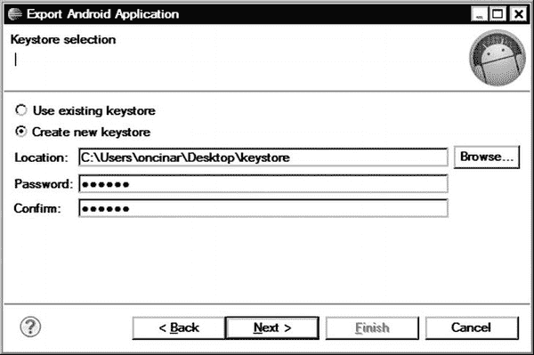

**图 5-38。** *用于导出签名应用程序的密钥库选择*

如果您选择创建一个新的密钥库，导出 Android 应用程序向导会显示一个表单，以获取足够的信息来正确地生成密钥，如[图 5-39](#fig_5_39) 所示。填写完必要的信息后，单击“下一步”按钮继续。

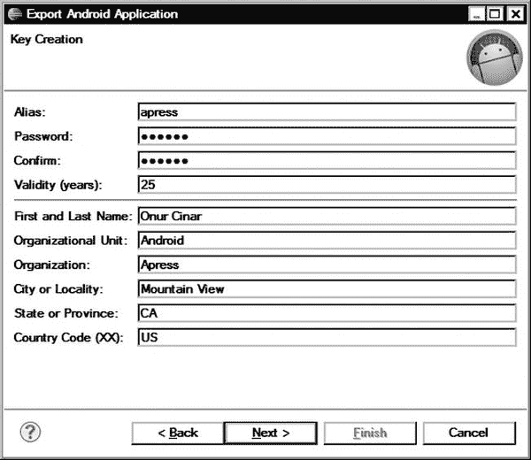

**图 5-39。** *键创建信息表单*

如果您已经有一个要使用的密钥库，向导将要求您从给定的密钥库中选择要使用的密钥，如[图 5-40](#fig_5_40) 所示。

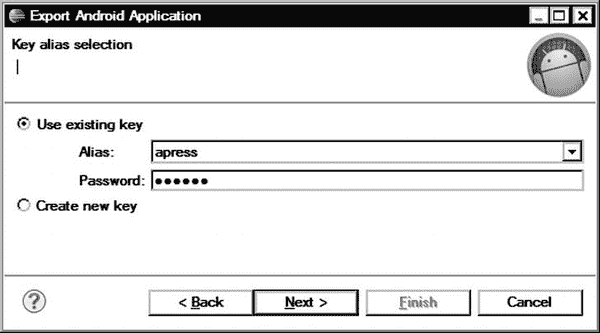

**图 5-40。** *从给定的密钥库中通过别名选择密钥*

作为最后一步，导出 Android 应用程序向导将询问将要发布的已签名的 APK 文件的目标位置，如图[图 5-41](#fig_5_41) 所示。单击浏览按钮，并选择位置和文件名。然后单击“完成”按钮开始该过程。

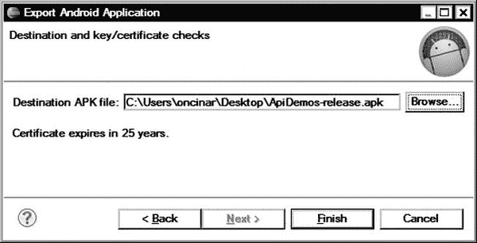

**图 5-41。** *设置已签名的 APK 文件的发布目的地*

向导将在发布模式下编译 Android 应用程序，并用所选密钥对其进行签名。签署的 APK 文件可以向公众发布。

### 总结

本章介绍了 Eclipse 的 ADT 插件。我们通过安装 ADT 和 Android SDK 开始了我们的旅程。然后，我们配置了一个 Android 虚拟机，并探索了它的控制界面。接下来，我们看了 DDMS、Traceview、Hierarchy Viewer 和 Android Lint，探索如何在日常 Android 开发中使用这些工具。最后，我们讲述了如何使用 ADT 为 Android 应用程序签名以供发布。

### 资源

以下资源可用于本章涵盖的主题:

*   Android Lint，`[http://tools.android.com/tips/lint](http://tools.android.com/tips/lint)`
*   调试和分析用户界面
*   达尔维克调试监视器，`[http://www.netmite.com/android/mydroid/dalvik/docs/debugmon.html](http://www.netmite.com/android/mydroid/dalvik/docs/debugmon.html)`
*   Android 工具项目，`[http://tools.android.com/](http://tools.android.com/)`