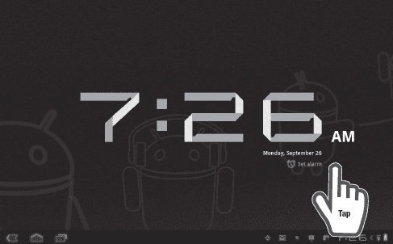
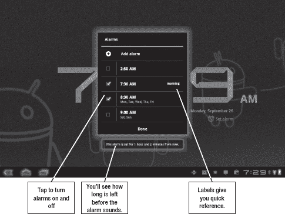
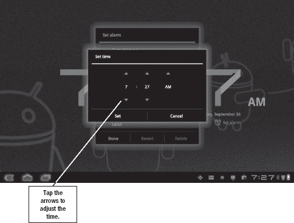
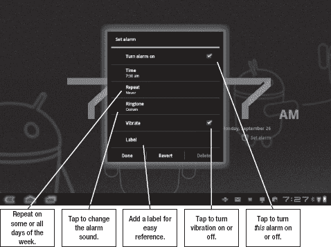
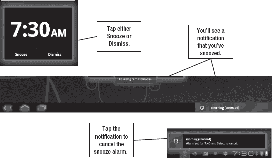
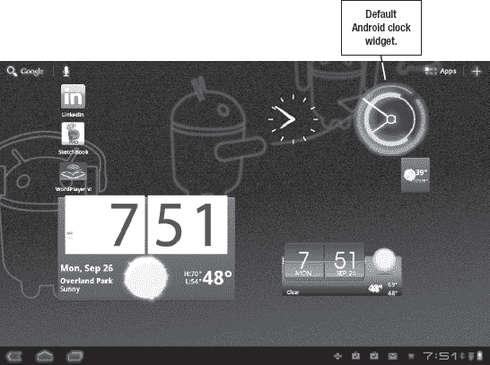
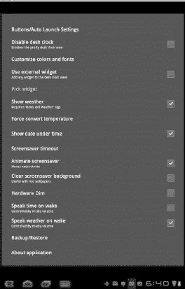
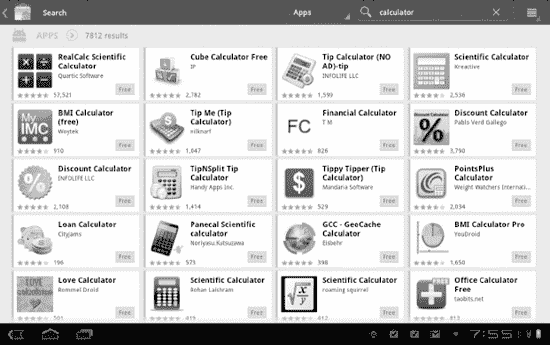
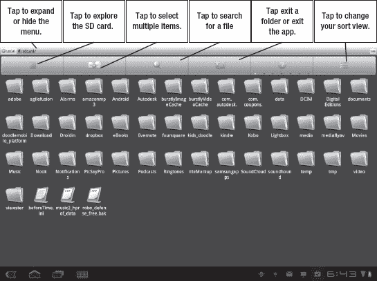
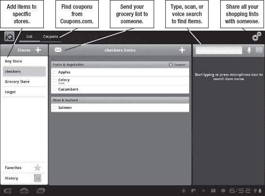

## 第二十三章

## **时钟、计算器和其他实用工具**

本章将探索那些在紧要关头非常有用的小工具。如你所料，我们将看看**时钟**和**计算器**应用程序；但是，我们还将看看其他一些工具，您可以下载这些程序来充分利用您的平板电脑。

### 时钟

Android 平板电脑附带了一个有用的，虽然简单的**时钟**应用程序。你并不真的需要它来显示时间，因为你可以随时低头看屏幕右下角。然而，**时钟**应用程序确实带有闹铃。如果你在晚上把平板电脑放在充电支架上，这个应用程序可以作为一个很好的闹钟。

按照以下步骤开始使用**时钟**应用程序的闹铃功能:

1.  通过小工具或点击应用程序图标启动**时钟**应用程序。
2.  Tap the **Set alarm** link below the time (see [Figure 23–1](#fig_23_1)). 

    **图 23–1。** *设置闹钟*

3.  If you have existing alarms, you can simply tap them to turn them on (see [Figure 23–2](#fig_23_2)). Otherwise, tap **+ Add alarm.** 

    **图 23–2***。打开或关闭警报*

    **1。**点击**向上箭头**或**向下箭头**设置时间，然后点击**设置**(参见[图 23–3](#fig_23_3))。

    

    **图 23–3***。调整时间*

4.  Adjust any other settings (see [Figure 23–4](#fig_23_4)). 

    **图 23–4***。设置剩余的报警功能*

#### 重复报警

每个闹铃响后都会关闭，除非您将其设定为重复事件。

如果你想让闹钟只在工作日叫醒你，你可以设置周一至周五的**重复选项。每个闹钟每 24 小时只能响一次，因为只能设置一次；但是，您可以将每个闹钟设定为多天。您也可以添加任意数量的警报；所以，如果你需要在周四比平时更早上班，你可以简单地设置两个闹钟。**

**提示:**由于你可以在每次闹铃的基础上改变铃声，你可以为你想起床的时间设置一种铃声，为你想去上班的时间设置另一种铃声。

#### 打盹和解除警报

现在是早上，闹钟响了。你怎么关掉它？你有两个选择:点击**打盹**或者点击**解散。**但如果你像我一样早上昏昏沉沉，你可能会按错选项，意识到你按了**贪睡**，而你本打算按**解散**。如果您遇到这种情况，只需点击屏幕底部的通知提醒，如图[Figure 23–5](#fig_23_5)所示。

**图 23–5。** *打盹报警*

### 延长时钟

你可能已经注意到，你平板电脑的**时钟**应用附带了一个相当无聊的数字**时钟**小工具。在某些情况下，您的平板电脑可能附带了不同的 widget。在其他情况下，它只是发光的蓝色数字时钟。不用担心:安卓市场上有大量免费和高级版本的时钟工具。大多数都将天气预报和时间显示结合在一起，这在你想清楚早上要穿什么的时候非常有用。[图 23–6](#fig_23_6)显示了一些你可以下载的小工具。

**图 23–6***。可下载的时钟部件*

#### 备用报警

app store 拥有的远不止小工具；它也有许多可供选择的警报。**闹钟升级版**和**闹钟至尊版**提供基本功能之外的功能。例如，**极端闹钟**有一个巨大的**贪睡**按钮，它让你解决数学问题来证明你醒着。**闹钟 Plus** 在闹钟响起时会报时播报天气和时间。

然而，在你承诺支付替代闹钟之前，你应该验证它在平板电脑上是否好看。

### 计算器

这看起来可能是一个小细节，但你的平板电脑内置了一个**计算器**应用程序，按钮大到足以让你的手指使用。如图[图 23–7](#fig_23_7)所示，这个计算器不仅仅能够做加法和减法。

**图 23–7。** *计算器 app*

这个应用程序的功能足以解决大多数常见的数学问题；然而，它并不是最棒的计算器。如果你需要真正的科学计算器的功能，你需要下载另一个计算器应用程序。你可以通过搜索安卓市场找到科学日历、小费计算器、利息计算器、身体质量指数计算器等等，如图[图 23–8](#fig_23_8)所示。

**图 23–8。** *可用计算器应用的样本*

### ES 文件浏览器

您可以通过使用 USB 线将平板电脑连接到电脑并将其安装为驱动器，来浏览 SD 卡或内部存储内容。然而，这需要你有一根电缆和一台电脑，以便随时浏览你的文件。我还推荐使用一款应用程序，比如来自 Estrongs 公司的 **ES 文件浏览器**(见[图 23–9](#fig_23_9))。

**图 23–9。**T3**ES 文件浏览器**来自 Estrongs 公司的应用

ES 文件浏览器顾名思义:它可以让你查看和浏览储存在平板电脑上的文件。它还允许您复制和粘贴它们。例如，如果你需要将一本电子书移动到你的阅读应用程序上，这是很方便的。

移动和复制文件的界面需要一点时间来适应。您可以长按一个项目；也可以点击选择，然后按左下角的**操作**菜单按钮，如图[图 23–10](#fig_23_10)所示。

**图 23-10。***ES 文件浏览器中的操作菜单*

### 杂货清单

有许多在线购物的应用程序，我们在前面的章节中已经探索了其中的一些。这里还有一个值得一看的:杂货店智商应用程序可以让你在商店里创建一个购物清单。虽然你可以在手机上使用这个应用程序，但大显示屏让它对平板电脑很有吸引力(见[图 23–11](#fig_23_11))。

**图 23–11***。杂货智商 app*

**杂货智商**来自 Coupons.com，所以强调优惠券和商业产品；然而，它也允许你与他人分享你的购物清单，比如配偶或团队。您可以为不同的商店创建不同的列表，您可以通过键入、语音、历史记录甚至扫描的条形码来输入您的列表。

说到条形码:任何好的带摄像头的安卓平板电脑都应该有条形码扫描仪。有许多工作得很好，从基本的**条形码扫描仪**到**谷歌眼镜**，它也试图识别非条形码物体。