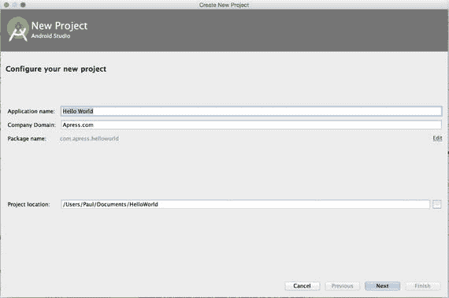
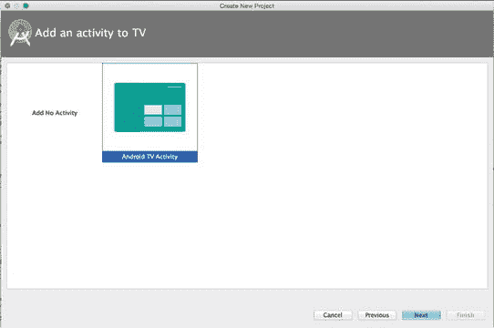
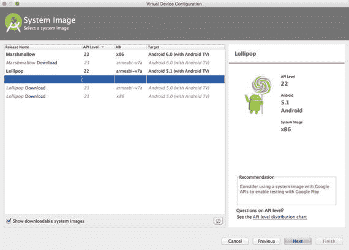
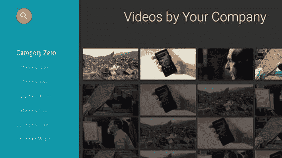

# 1.入门指南

Electronic supplementary material The online version of this chapter (doi:[10.​1007/​978-1-4842-1784-9_​1](http://dx.doi.org/10.1007/978-1-4842-1784-9_1)) contains supplementary material, which is available to authorized users.

众所周知，科技在我们生活的方方面面都在不断进步。随着智能手机和平板电脑的爆炸式增长，电视作为下一个联网“智能”设备加入竞争只是时间问题。虽然交互式电视已经存在了几年，但主要竞争者只是最近才进入市场，Android TV 是在 2014 年 6 月推出的(尽管在谷歌电视的失败尝试和 Chromecast 的巨大成功之后)，Apple TV 最终在 2015 年 9 月向应用程序开发者开放了他们的平台。有鉴于此，现在是通过使用 Android TV 扩展您的技能组合来为应用程序开发的下一个趋势做准备的最佳时机。

## 安卓电视到底是什么？

Android TV 是谷歌开发的互动电视平台，于 2014 年在其 I/O 大会上发布。利用谷歌从他们之前的一次进入客厅的尝试(称为谷歌电视)中吸取的经验，他们创建了这个操作系统，以便轻松嵌入电视机，或者通过使用独立的机顶盒，让传统的“哑”电视成为交互式电视。新平台是一个针对电视进行了优化的 Android 版本，可以访问开发人员已经熟悉的所有功能，以及通过向后倾斜支持库提供的一些附加组件。

除了能够为 Android TV 创建原生应用，该操作系统还提供了对 Google Cast 的支持。Google Cast 作为 Chromecast 背后的技术为大多数人所熟悉。这意味着，如果您现有的应用程序支持强制转换，那么用户仍然可以在 Android TV 上使用它，尽管没有原生 Android TV 应用程序提供的完整沉浸式体验。虽然了解如何开发支持 cast 的应用程序是有用的，但这本书将专注于为 Android TV 开发原生应用程序。

## 对这本书有什么期待

这本书旨在让你开始使用 Android 电视平台，以便你可以扩展现有的应用程序或创建自己的应用程序来改善用户的客厅体验。您应该对 Android 开发有一个基本的了解，因为您将使用适配器、片段、活动、视图和其他标准的 Android 组件。任何专门为 Android TV 介绍的内容都将在本书中讨论，因此不需要这些组件的先前知识。在阅读本书的过程中，您将通过编写每个组件来创建一个相对简单的 Android TV 媒体应用程序，以便充分理解该应用程序是如何运行的。您还将构建几个强调附加 API 的小示例程序，比如 LAN 通信和从游戏控制器读取输入，这样您就可以开始构建其他应用程序，比如游戏和实用程序。在此过程中，您将了解到与智能手机和平板电脑相比，电视用户体验有何不同的设计理念。

当你读完这本书时，你应该已经牢牢掌握了与 Android TV 相关的词汇。你不仅能够为该平台创建应用程序，还应该能够通过理解你在论坛和谷歌的大量精心编写的 Android 文档中搜索的内容，自信地找到更复杂问题的答案。

## 正在设置

为 Android 开发的一个好处是，开发工具可以在大多数现代计算机平台上使用，Android TV 开发也不例外。为了编写本书中的例子，你需要一台运行 Windows、Mac OS X 或 Linux 的计算机。这本书将重点介绍使用 Android Studio 作为开发环境，它本身目前需要 Java 运行时环境(JRE)和 Java 开发工具包(JDK)。如果您还没有 Android Studio，您可以通过访问 [`https://developer.android.com/sdk/index.html`](https://developer.android.com/sdk/index.html) ，下载 Android Studio，并按照您的操作系统的安装说明进行操作，获得并找到 Android 开发的官方系统要求，包括最低操作系统版本。在撰写本文时，Android Studio 的最新版本是 1.4。在安装过程中，您需要安装至少适用于 Android 5.0 (Lollipop)的平台工具和 API。

## 创建新的 Android 电视项目

一旦您安装并设置了 Android Studio，您就可以使用 Google 提供的基本 Android TV 模板创建一个示例项目。打开 Android Studio，点击快速启动标题下的开始一个新的 Android Studio 项目。

当您到达配置您的新项目屏幕时，将应用程序名称设置为 Hello World，将公司域设置为`apress.com`，将您的项目位置设置为您想要保存源代码的位置(参见图 [1-1](#Fig1) )。填写完所有必需的信息后，单击下一步，您将进入一个屏幕，选择您的应用将支持的外形。

图 1-1。

Configure your new project screen

对于 Hello World 应用程序，取消选中电话和平板电脑旁边的复选框，并激活电视旁边的复选框。虽然您的项目中可能有一个支持手机和平板电脑的模块，但在本书中，为了简单起见，我们将忽略这种情况。Android TV 需要的最低 API 版本是最早的 21 版(Lollipop ),因为 Android TV 是和 Lollipop 一起推出的。图 [1-2](#Fig2) 显示了在继续之前，您的目标 Android 设备屏幕应该是什么样子。

图 1-2。

Screen for selecting form factors supported by your app

当你点击“下一步”时，你将被带到一个屏幕，询问你是要创建一个空项目还是一个默认的 Android TV 活动，如图 [1-3](#Fig3) 所示。对于此示例，选择 Android TV 活动选项。

图 1-3。

Selecting an Android TV template

您遇到的下一个屏幕将为您提供重命名示例 Android TV 应用程序中的活动、片段和布局文件的选项(图 [1-4](#Fig4) )。对于本例，您可以接受默认值并单击 Finish。

图 1-4。

Naming your files

Android Studio 将花一些时间为你的 Hello World 应用程序创建通用模板。如果您浏览这个应用程序的源代码，您会注意到十几个 Java 文件。您可能还会注意到，有些文件，比如`VideoDetailsFragment.java`，包含不推荐使用的代码，或者 Google 不再推荐使用的代码。现在，请忽略它们，因为在本书的后面部分，您将了解到为媒体应用程序推荐的不同组件。

## 运行您的 Android 电视应用程序

下一步你要做的是运行你的安卓电视应用程序。与移动开发一样，您可以使用仿真器，也可以将其安装在物理设备上。为了创建 Android TV 仿真器，请在 Android Studio 工具栏中单击 AVD 管理器按钮(它看起来像一个手机屏幕，图标的右下角有一个 Android 头，并且是图 [1-5](#Fig5) 中左起第八个按钮)。

图 1-5。

Android Studio toolbar with AVD Manager button

在出现的 AVD 管理器对话框的左下角选择创建虚拟设备…并从左栏中选择电视类别。应该有多个设备配置文件可供选择，如图 [1-6](#Fig6) 所示，所以选择任何一个并点击下一步。

图 1-6。

Virtual device options

下一个屏幕应该为您提供一个用于创建基本仿真器的系统映像列表。如果在下一个屏幕上没有必要的系统映像，请选中显示可下载的系统映像复选框。您应该会看到类似于图 [1-7](#Fig7) 的内容。根据屏幕右侧的建议框下载一个系统映像，以便构建一个在您的系统上运行良好的虚拟设备。

图 1-7。

Selection of system images for the Android TV emulator

最后一个屏幕(如图 [1-8](#Fig8) 所示)将为您提供自定义虚拟设备设置的选项。出于这些目的，您可以保留默认值，然后单击 Finish 创建您的模拟器。

图 1-8。

Configuring your new Android virtual device

虽然模拟器很方便，但最好还是在物理设备上测试。在 2014 年 I/O 期间，谷歌发布了一套开发设备，可以由开发人员请求，称为 ADT-1。棒棒糖一经正式发布，谷歌就公布了 Nexus Player，可供购买。其他设备，如 NVIDIA SHIELD，也可以从第三方制造商处获得。随着越来越多的原始设备制造商将 Android TV 集成到他们的电视机或创建机顶盒，测试设备的选择将继续增加。如果你有一个测试用的物理设备，你只需在它运行的时候把它插到你的电脑上就可以直接安装你的应用了。

现在您已经创建了一个 Hello World 示例应用程序和一个运行应用程序的环境，单击 Android Studio 工具栏中的绿色 run 箭头来安装您的应用程序，以确保一切正常。当您的应用程序在仿真器或实际的 Android 电视设备上启动时，您应该会看到类似图 [1-9](#Fig9) 的屏幕。

图 1-9。

Initial screen for the Android TV template application

## 摘要

在本章中，您已经迈出了学习 Android 电视平台的第一步。您学习了如何设置示例 Android TV 项目，并且创建了一个用于查看 Android TV 应用程序的模拟器。在下一章中，你将会学到一些如何设计你的应用程序，当你从房间的另一边观看时，它对你的用户是有用的，并且你将会被介绍到媒体应用程序的一些组件。