第七章


创建和移植基于 NDK 的 Android 应用

很明显，我们的科技已经超越了我们的人性。

—阿尔伯特·爱因斯坦

Android 应用可以使用本地开发工具包(NDK) 工具集合并本地代码。它允许开发人员重用遗留代码，为低级硬件编程，并通过利用非最佳或不可能的特性来区分他们的应用。

本章深入介绍了如何为英特尔架构创建基于 NDK 的应用。它还涵盖了移植现有的基于 NDK 的应用的案例。它深入讨论了英特尔编译器和默认 NDK 编译器之间的差异，并解释了如何充分利用英特尔 NDK 环境。

JNI 和 NDK 简介

JNI 简介

我们知道 Java 应用并不直接运行在硬件上，而是实际运行在一个虚拟机上。应用的源代码不是被编译以获得硬件指令，而是被编译以获得虚拟机的解释来执行代码。比如 Android 应用运行在 Dalvik 虚拟机上；它的编译代码是 DEX 格式的 Dalvik 虚拟机的可执行代码。这个特性意味着 Java 运行在虚拟机上，确保了它的跨平台能力:这就是它的“编译一次，随处运行”的特性。Java 的这种跨平台能力导致它与本地机器的各种内部组件的连接较少，并限制了它与本地机器的各种内部组件的交互，使得很难使用本地机器指令来利用机器的性能潜力。很难利用基于本地的指令来运行巨大的现有软件库，因此功能和性能受到限制。

有没有办法让 Java 代码和原生代码软件协同工作，共享资源？答案是肯定的——通过使用 Java 本地接口(JNI) ，这是一种 Java 本地操作的实现方法。JNI 是一个 Java 平台，被定义为与本地平台上的代码进行交互的 Java 标准。(一般称为*主机平台*。但这一章是针对移动平台的，为了和移动交叉开发主机区分，我们称之为*本地平台。*)所谓“接口”包括两个方向——一个是 Java 代码调用原生函数(方法)，一个是本地应用调用 Java 代码。相对来说，前一种方法在 Android 应用开发中使用的更多。因此，本章主要关注 Java 代码调用本地函数的方法。

Java 通过 JNI 调用本地函数的方式是将本地方法以库文件 s 的形式存储，比如在 Windows 平台上，文件在。DLL 文件格式，并且在 UNIX/Linux 机器上文件位于。所以文件格式。通过调用本地库文件的内部方法，Java 可以与本地机器建立密切联系。这被称为各种接口的*系统级方法*。

JNI 通常有两种使用场景:一是能够使用遗留代码(例如 C/C++、Delphi 等开发工具)；第二，更直接地与硬件交互以获得更好的性能。当你阅读这一章的时候，你会看到其中的一些内容。

JNI 一般工作流程如下:Java 发起调用，让本地函数的侧代码(比如用 C/C++写的函数)运行。这一次，对象是从 Java 端传递过来的，并在本地函数完成时运行。在运行完一个本地函数之后，结果的值被返回给 Java 代码。这里，JNI 是一个适配器，在 Java 语言和本地编译语言(如 C/C++)之间映射变量和函数(Java 方法)。我们知道 Java 和 C/C++在函数原型定义和变量类型上有很大的不同。为了使两者匹配，JNI 提供了一个`jni.h`文件来完成两者之间的映射。这个过程如图[图 7-1](#Fig1) 所示。


[图 7-1](#_Fig1) 。JNI 通用工作流程

通过 JNI 和 Java 程序(尤其是 Android 应用)调用 C/C++函数的一般框架如下:

1.  编译 native 的方式是在 Java 类中声明的(C/C++函数)。
2.  编译包含原生方法的`.java`源代码文件(在 Android 中构建项目)。
3.  `javah`命令生成一个`.h`文件，根据`.class`文件对应本地方法。
4.  C/C++方法是用来实现本地方法的。
5.  这一步推荐的方法是先将函数原型复制到`.h`文件中，然后修改函数原型，添加函数体。在此过程中，应注意以下几点:
    *   JNI 函数调用必须使用 C 函数。如果是 C++函数，别忘了加上`extern` C 关键字。
    *   方法名的格式应该遵循以下模板:`Java_package_class_method`，即`Java_package`名称类名和函数方法名。
6.  C 或 C++文件被编译成一个动态库(在 Windows 下这是一个. DLL 文件，在 UNIX/Linux 下是一个. SO 文件)。

使用 Java 类中的`System.loadLibrary()`或`System.load()`方法加载生成的动态库。

这两个功能略有不同:

*   `System.loadLibrary()` :加载本地链接库下的默认目录(例如对于 Windows，这是`\System32, jre\bin`，以此类推)。
*   `System.load()` :根据添加到交叉链接库的本地目录，必须使用绝对路径。

第一步，Java 调用原生 C/C++函数；C 和 C++的格式不一样。例如，对于 Java 方法，如不传递参数和返回一个`String`类，C 和 C++代码在以下方面有所不同:

c 代码:

```java
Call function:(*env) -> <jni function> (env, <parameters>)
Return jstring:return (*env)->NewStringUTF(env, "XXX");
```

C++代码:

```java
Call function:env -> <jni function> (<parameters>)
Return jstring:return env->NewStringUTF("XXX");
```

其中两个 Java `String`对象`NewStringUTF`函数都是由 JNI 提供的 C/C++生成的。

Java 方法及其与 C 函数原型 Java 的对应关系

回想一下，为了让 Java 程序调用代码框架中的 C/C++函数，您使用了`javah`命令，该命令将根据`.class`文件为本地方法生成相应的`.h`文件。`.h`文件是按照一定的规则生成的，从而使正确的 Java 代码找到对应的 C 函数来执行。

例如，下面的 Android Java 代码:

```java
public class HelloJni extends Activity

1.   {
2.      public void onCreate(Bundle savedInstanceState)
3.      {
4.         TextView tv.setText(stringFromJNI() );  // Use C function Code
5.      }
6.      publicnativeString  stringFromJNI();
7.   }
```

对于第 4 行使用的 C 函数`stringFromJNI()`，由`javah`生成的`.h`文件中的函数原型是:

```java
1.   JNIEXPORT jstring JNICALL Java_com_example_hellojni_HelloJni_stringFromJNI
2.     (JNIEnv *, jobject);
```

在这方面，C 源代码文件对于函数代码的定义大致有:

```java
1.     /*
2.     ...
3.     Signature: ()Ljava/lang/String;
4.     */
5.     jstring Java_com_example_hellojni_HelloJni_stringFromJNI (JNIEnv* env,  jobject thiz )
6.     {
7.          ...
8.         return (*env)->NewStringUTF(env, "...");
9.     }
```

从这段代码中可以看到，函数名相当长，但还是很有规律，完全符合命名约定:`java_package_class_method`。`Hello.java`中的`stringFromJNI()`方法对应 C/C++中的`Java_com_example_hellojni_HelloJni_stringFromJNI()`方法。

注意`Signature: ()Ljava/lang/String;`的注释。`()Ljava/lang/String;`的括号`()`表示函数参数为空，这意味着除了两个参数`JNIEnv *`和`jobject`之外，没有其他参数。`JNIEnv *`和`jobject`是所有 JNI 函数必须拥有的两个参数，分别针对`jni`环境和对应的`Java`类(或对象)本身。`Ljava/lang/String;`表示函数的返回值是一个 Java `String`对象。

Java 和 C 数据类型映射

如前所述，Java 和 C/C++变量类型非常不同。JNI 提供了一种机制来完成 Java 和 C/C++之间的映射。主要类型之间的对应关系如[表 7-1](#Tab1) 所示。

[表 7-1](#_Tab1) 。Java 到 C 类型映射

| 

Java 类型

 | 

原生类型

 | 

描述

 |
| --- | --- | --- |
| `boolean` | `jboolean` | C/C++ 8 位整数 |
| `byte` | `jbyte` | C/C++无符号 8 位整数 |
| `char` | `jchar` | C/C+无符号 16 位整数 |
| `short` | `jshort` | C/C++有符号 16 位整数 |
| `int` | `jint` | C/C++有符号 32 位整数 |
| `long` | `jlong` | C/C++无符号 64 位整数 |
| `float` | `jfloat` | C/C++ 32 位浮点 |
| `double` | `jdouble` | C/C++ 64 位浮点 |
| `void` | `void` | 不适用的 |
| `Object` | `jobject` | 任何 Java 对象，或者不对应于`java`类型的对象 |
| `Class` | `jclass` | 类对象 |
| `String` | `jstring` | 字符串对象 |
| `Object[]` | `jobjectArray` | 任何对象的数组 |
| `Boolean[]` | `jbooleanArray` | 布尔数组 |
| `byte[]` | `jbyteArray` | 比特阵列 |
| `char[]` | `jcharArray` | 字符数组 |
| `short[]` | `jshortArray` | 短整数数组 |
| `int[]` | `jintArray` | 整数数组 |
| `long[]` | `jlongArray` | 长整数数组 |
| `float[]` | `jfloatArray` | 浮点数组 |
| `double[]` | `jdoubleArray` | 双浮点阵列 |

`Note`Java 类型与本地(C/C++)类型的对应关系。

当传递一个 Java 参数时，使用 C 代码的思路如下:

*   基本类型可以直接使用；比如`double`和`jdouble`可以互通。基本类型是从[表 7-1](#Tab1) 中的`boolean`到`void`行所列的类型。在这种类型中，如果用户将一个`boolean`参数传递给方法，就会有一个名为`jboolean`的本地方法对应于`boolean`类型。类似地，如果本地方法返回一个`jint`，那么 Java 会返回一个`int`。
*   Java 对象用法。一个`Object`对象有`String`对象和一个通用对象。这两个对象的处理方式略有不同。
*   `String`对象。Java 程序传递的`String`对象是本地方法中对应的`jstring`类型。C 中的`jstring`类型和`char *`不同。所以如果你只是把它当成一个`char *`，就会出现错误。因此，您需要在使用之前将`jstring`转换成 C/C++中的`char *`。这里我们用`JNIEnv`的方法进行换算。
*   `Object`对象。使用以下代码获取类的对象处理程序:

```java
jclass objectClass = (env)->FindClass("com/ostrichmyself/jni/Structure");
```

然后使用以下代码获取该类所需的域处理程序:

```java
jfieldID str = (env)->GetFieldID(objectClass,"nameString","Ljava/lang/String;");
jfieldID ival = (env)->GetFieldID(objectClass,"number","I");
```

然后使用下面类似的代码为`jobject`对象的传入字段赋值:

```java
(env)->SetObjectField(theObjet,str,(env)->NewStringUTF("my name is D:"));
(env)->SetShortField(theObjet,ival,10);
```

*   如果没有传入的对象，那么 C 代码可以使用下面的代码来生成新的对象:

    ```java
    jobject myNewObjet = env->AllocObject(objectClass);
    ```

*   Java 数组处理。对于数组类型，JNI 提供了一些可操作的函数。例如，`GetObjectArrayElement`可以接受传入的数组，并使用`NewObjectArray`创建一个数组结构。
*   资源释放的原则。C/C++ `new`的对象或者`malloc`的对象需要使用 C/C++来释放内存。
*   如果`JNIEnv`方法的新对象没有被 Java 使用，就必须释放它。
*   使用`GetStringUTFChars`从 Java 转换一个 string 对象得到 UTF，需要打开内存，使用完`char *`后必须释放内存。使用的方法是`ReleaseStringUTFChars`。

这些是 Java 与 C/C++交换数据时类型映射的简要描述。有关 Java 和 C/C++数据类型的更多信息，请参考相关的 Java 和 JNI 书籍、文档和示例。

NDK 简介

从前面的描述中，你知道 Java 代码可以使用 JNI 访问本地函数(比如 C/C++)。要达到这种效果，你需要开发工具。有一整套基于核心 Android SDK 的开发工具，您可以使用它们将 Java 应用交叉编译为可以在目标 Android 设备上运行的应用。同样，您需要交叉开发工具来将 C/C++代码编译成可以在 Android 设备上运行的应用。这个工具就是安卓原生开发套件，或者安卓 NDK。

在 NDK 之前，Android 平台上的第三方应用是在一个特殊的基于 Java 的 Dalvik 虚拟机上开发的。原生 SDK 允许开发人员直接访问 Android 系统资源，并使用传统的 C 或 C++编程语言创建应用。应用包文件(`.apk`)可以直接嵌入到本地库中。简而言之，通过 NDK，原本在 Dalvik 虚拟机上运行的 Android 应用现在可以使用 C/C++等本地代码语言来执行程序。这提供了以下好处:

*   性能提升。它使用本机代码来开发程序中需要高性能的部分，并直接访问 CPU 和硬件。
*   重用现有本机代码的能力。

当然，相对于 Dalvik 虚拟机，使用原生 SDK 编程也有一些缺点，比如增加了程序复杂度，兼容性难以保证，无法访问框架 API，调试更加困难，灵活性降低等等。此外，访问 JNI 会导致一些额外的性能开销。

简而言之，NDK 应用开发有其优点和缺点。你需要根据自己的判断使用 NDK。最佳策略是使用 NDK 来开发应用中本机代码可以提高性能的部分。

NDK 包括以下主要部件:

*   工具和构建文件从 C/C++生成本机代码库。这包括一系列的 NDK 命令，包括`javah`(使用`.class`文件生成相应的`.h`文件)、`gcc`(稍后描述)和其他命令。它还包括`ndk-build`可执行脚本等等，这些将在后面的会话中详细介绍。
*   应用包(应用包文件，即`.apk`文件)中会嵌入一个一致的本地库，可以部署在 Android 设备中。
*   对所有未来 Android 平台的一些原生系统头文件和库的支持。

NDK 应用开发的流程框架如图[图 7-2](#Fig2) 所示。Android 应用由三部分组成:Android 应用文件、Java 本地库文件和动态库。这三个部分通过各自的生成路径从不同的源生成。对于一个普通的 Android 应用，Android SDK 生成 Android 应用文件和 Java 原生库文件。Android NDK 生成动态库文件(带有。SO 扩展名)使用非本机代码(通常是 C 源代码文件)。最后在目标机器上安装 Android 应用文件、Java 库文件和本地动态库，并运行完整的协作应用。

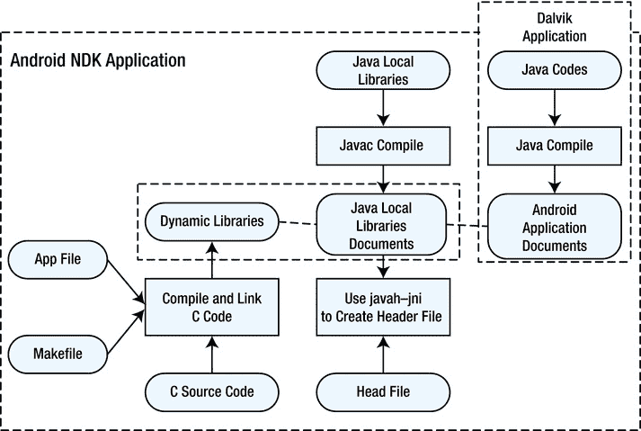

[图 7-2](#_Fig2) 。安卓 NDK 应用开发流程图

NDK 开发的应用项目(简称 NDK 应用项目)有组件，如图[图 7-3](#Fig3) 所示。与使用 Android SDK 开发的典型应用相比，在 NDK 开发的项目添加了 Dalvik 类代码、清单文件、公共资源，以及 JNI 和 NDK 生成的共享库。

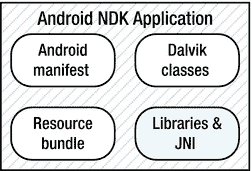

[图 7-3](#_Fig3) 。Android NDK 应用的应用组件

Android 在其关键 API 版本中增加了 NDK 支持。每个版本都包括一些新的 NDK 特性、简单的 C/C++、兼容的 STL、硬件扩展等等。这些特性使得 Android 更加开放，更加强大。Android API 及其与 NDK 的对应关系如[表 7-2](#Tab2) 所示。

[表 7-2](#_Tab2) 。主要 Android API 与 NDK 版本的关系

| 

API 版本

 | 

支持的 NDK 版本

 |
| --- | --- |
| API 级 | Android 1.5 NDK 1 |
| API 级 | Android 1.6 NDK 2 |
| API 级 | Android 2.1 NDK 3 |
| API 级 | Android 2.2 NDK 4 |
| API 级 | Android 2.3 NDK 5 |
| API 级 | Android 3.1 NDK 6 |
| API 级 | Android 4.0.1 NDK 7 |
| API 级 | Android 4.0.3 NDK 8 |
| API 级 | Android 4.1 NDK 8b |
| API 级 | Android 4.2 NDK 8d |
| API 级 | Android 4.3 NDK 9b |

 **提示**使用安卓 NDK 生成的每一段原生代码都被赋予了一个匹配的应用二进制接口(ABI) 。ABI 精确地定义了应用及其代码在运行时如何与系统交互。ABI 可以大致理解为类似于计算机架构中的 ISA(指令集架构)。

典型的 ABI 包含以下信息:

*   CPU 指令集应该使用的机器代码。
*   运行时内存访问排名。
*   可执行二进制文件的格式(动态库、程序等)以及允许和支持的内容类型。
*   在应用代码和系统之间传递数据时使用的不同约定(例如，函数调用何时注册和/或如何使用堆栈、对齐限制等)。
*   枚举类型、结构字段和数组的对齐和大小限制。
*   运行时应用机器码的可用函数符号列表通常来自一组非常特定的库。每个受支持的 ABI 都有一个唯一的名称。

Android 目前支持以下 ABI 类型:

*   *ARM eabi*–这是 ARM CPU 的 abi 名称，它至少支持 ARMv5TE 指令集。
*   ARM eabi-v7a–这是基于 ARM 的 CPU 的另一个 abi 名字；它扩展了 armeabi CPU 指令集扩展，如 Thumb-2 指令集扩展和用于向量浮点硬件的浮点处理单元指令。
*   *x86*——这是 ABI 的名字，一般称为支持 x86 或 IA-32 指令集的 CPU。更具体地说，它的目标在下面的会话中经常被称为 i686 或奔腾 Pro 指令集。英特尔凌动处理器属于这种 ABI 类型。

这些类型具有不同的兼容性。X86 与 armeabi 和 armeabi-v7a 不兼容。armeabi-v7a 机器与 armeabi 兼容，这意味着 armeabi 框架指令集可以在 armeabi-v7a 机器上运行，但不一定相反，因为一些 ARMv5 和 ARMv6 机器不支持 armeabi-v7a 代码。因此，当您构建应用时，应该根据用户对应的 ABI 机器类型仔细选择用户。

NDK 装置

这里我们以 NDK Windows 环境为例来说明 NDK 软件的安装。Windows NDK 包括以下模块:

*   Cygwin 在 Windows 命令行中运行 Linux 命令。
*   安卓 NDK 包，包括`ndk-build`等按键命令，是 NDK 软件的核心；它将 C/C++文件编译成。所以共享库文件。
*   CDT (C/C++开发工具，C/C++开发工具)是一个 Eclipse 插件，可以将 C/C++文件编译成。所以 Eclipse 中的共享库。这意味着您可以使用它来`ndk-build`替换命令行命令。

CDT 模块不是必需的，但它确实支持在熟悉的 Eclipse IDE 中进行开发。Cygwin 模块必须安装在 Windows 环境中，但在 Linux 环境中不是必需的。当然，整个开发环境需要支持 Java 开发环境。以下部分分别解释了每个模块的安装步骤。

安卓 NDK 安装

本节介绍如何安装 Android NDK:

1.  Visit the Android NDK official web site at `http://developer.android.com/sdk/ndk/index.html` and download the latest NDK package, as shown in [Figure 7-4](#Fig4). In this case, you click on the file `android-ndk-r8d-windows.zip` and download the files to the local directory.

    

    [图 7-4](#_Fig4) 。NDK 包下载页面来自安卓官方网站

2.  安装安卓 NDK。

Android NDK 安装相对简单。你需要做的就是把下载的`android-ndk-r4b-windows.zip`解压到指定的目录。在本例中，我们将 Android NDK 安装在目录`D:\Android\android-ndk-r8d`中。您需要记住这个位置，因为下面的配置需要它来设置环境。

安装 Cygwin

本节介绍如何安装 Cygwin:

1.  Visit Cygwin’s official web site (`http://www.cygwin.com/`). Download the Cygwin software, as shown in [Figure 7-5](#Fig5). Go to the download page, and then click on the `setup.exe` file to download and install packages.

    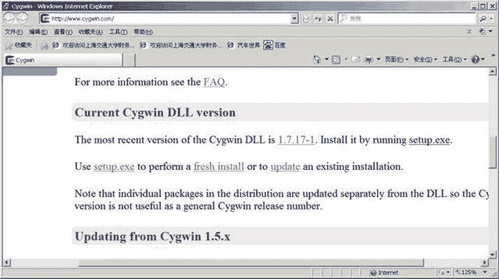

    [图 7-5](#_Fig5) 。Cygwin 下载页面

2.  Double-click the downloaded `setup.exe` file to start the installation. The pop-up shown in [Figure 7-6](#Fig6) appears.

    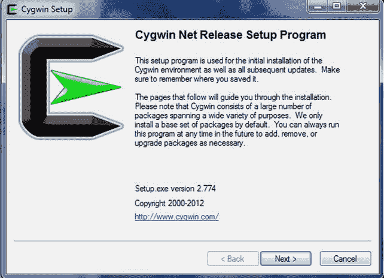

    [图 7-6](#_Fig6) 。Cygwin 初始安装窗口

3.  The installation mode selection box is shown in [Figure 7-7](#Fig7). In this example, select Install from Internet mode.

    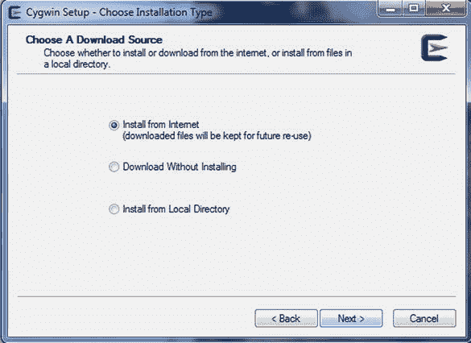

    [图 7-7](#_Fig7) 。Cygwin 安装模式选择

4.  The display installation directory and user settings selection box is shown in [Figure 7-8](#Fig8).

    

    [图 7-8](#_Fig8) 。安装目录和用户设置选择

5.  You are next prompted to enter a temporary directory to store the downloaded files, as shown in [Figure 7-9](#Fig9).

    

    [图 7-9](#_Fig9) 。Cygwin 下载文件临时目录设置

6.  Next you are prompted to select an Internet connection type, as shown in [Figure 7-10](#Fig10). For this example, select Direct Connection.

    

    [图 7-10](#_Fig10) 。Cygwin 设置互联网连接类型选择

7.  You are now prompted to select a download mirror site, as shown in [Figure 7-11](#Fig11).

    

    [图 7-11](#_Fig11) 。Cygwin Install:提示选择下载镜像站点

8.  Start the download and install the basic parts, as shown in [Figure 7-12(a)](#Fig12). During the setup, a Setup alert will indicate that this is the first time you are installing Cygwin, as shown in [Figure 7-12(b)](#Fig12). Click OK to continue.

    

    [图 7-12](#_Fig12) 。Cygwin 安装包下载安装T3】

9.  Select the packages to install, as shown in [Figure 7-13](#Fig13). The default is to install all of the packages.

    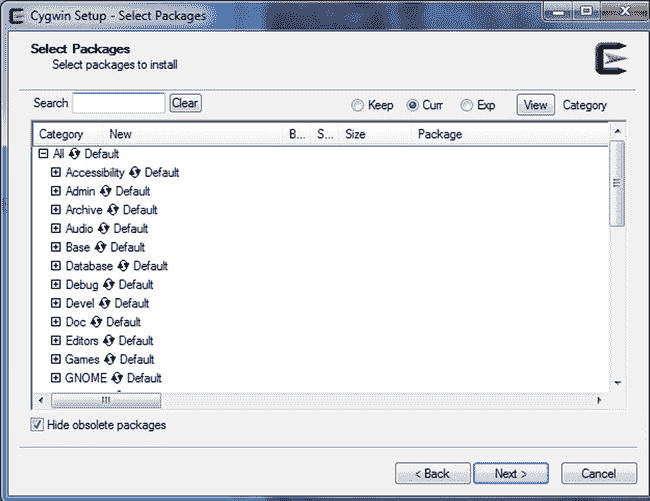

    [图 7-13](#_Fig13) 。Cygwin 软件包安装选择

    您下载了所有组件，总大小超过 3GB。这需要在正常的宽带网速下花费很长时间；实际上不建议安装所有组件。你需要安装 NDK Devel 组件和 Shells 组件，如图 7-14 所示。

    

    [图 7-14](#_Fig14) 。NDK 要求的 Cygwin 组件包

    从安装组件包中选择 Devel 和 Shells 的一些技巧。你可以先点击所有旁边的循环图标；它将在安装、默认和卸载之间循环。将其设置为 Uninstall 状态，然后单击 Devel 和 Shells 条目旁边的循环图标，使其保持 install 状态。最后，单击“下一步”继续。

10.  The contents of the selected components are displayed next, as shown in [Figure 7-15](#Fig15).

    

    [图 7-15](#_Fig15) 。选择 Cygwin 组件包后的依赖提醒

11.  Start to download and install the selected components, as shown in [Figure 7-16](#Fig16).

    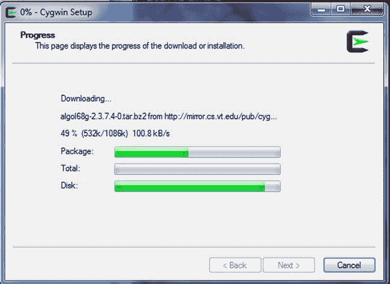

    [图 7-16](#_Fig16) 。Cygwin 下载并安装选定的组件

12.  Installation is complete. Message boxes appear, as shown in [Figure 7-17](#Fig17).

    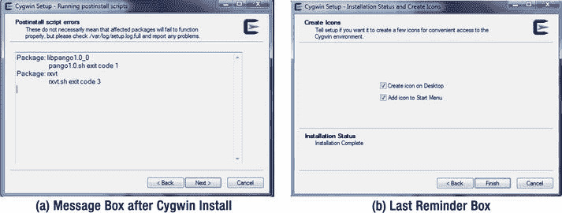

    [图 7-17](#_Fig17) 。安装完成后，Cygwin 提醒框

13.  配置 Cygwin Windows path 环境变量。

按照以下步骤将 NDK 包安装目录和 Cygwin bin 目录添加到`path`环境变量中:

1.  在桌面上，右键单击我的电脑并选择\属性\高级\环境变量菜单项。
2.  点击`PATH`变量中的系统变量。然后点击安装目录后添加的【变量值】NDK 包的对话框中的编辑按钮，在子目录 build\tools\cygwin\bin 下。

例如，如果 NDK 安装在目录`D:\Android\android-ndk-r8d`中，而 Cygwin 安装在目录`D:\cygwin`中，则在`PATH`变量后添加路径，如下所示:

```java
PATH=...;D:\Android\android-ndk-r8d;D:\Android\android-ndk-r8d\build\tools;D:\cygwin\bin
```

这样配置成功后，就可以使用 Linux 命令下的控制台命令`cmd`了。例如，[图 7-18](#Fig18) 显示了一个带有 Windows `dir`命令和 Linux `ls`命令的命令行窗口。


[图 7-18](#_Fig18) 。安装 NDK 后的命令行窗口

您为 NDK 配置 Cygwin 的内部环境变量，如下所示:

1.  Before configuring the NDK Cygwin internal environment variables, you must run Cygwin at least once, otherwise the `\cygwin\`home directory will be empty. Click the Browse button in Windows Explorer and select the `mintty.exe` file under the `bin` subdirectory of the Cygwin installation directory (in this example, it is located at `D:\cygwin\bin`). The window is shown in [Figure 7-19](#Fig19).

    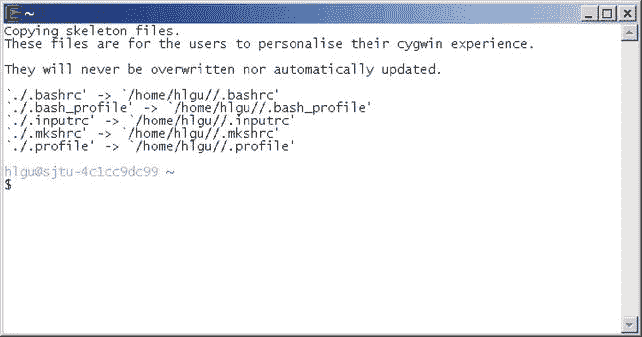

    [图 7-19](#_Fig19) 。第一次启动 Cygwin 时的初始窗口

2.  Then select the Windows `menu \programs\Cygwin\Cygwin` terminal. You can directly enter the Cygwin window, as shown in [Figure 7-20](#Fig20).

    

    [图 7-20](#_Fig20) 。Cygwin 窗口(如果不是第一次运行)

    这将在`empty\cygwin\home`下创建一个用户名(在本例中是 Windows 登录用户名`hlgu`)子目录，并在该目录下生成几个文件。

    ```java
    D:\cygwin\home\hlgu>dir
    2013-01-30  00:42             6,054 .bashrc
    2013-01-30  00:52                 5 .bash_history
    2013-01-30  01:09             1,559 .bash_profile
    2013-01-30  00:42             1,919 .inputrc
    2012-12-01  08:58             8,956 .mkshrc
    2013-01-30  00:42             1,236 .profile
    ```

3.  Find `.bash_profile` in the installation directory `cygwin\home\<username>\ file`. In this case, it is `D:\cygwin\home\hlgu\.Bash_profile`. To the end of the file, add the following code:

    ```java
    NDK=<android-ndk-r4b unzipped_NDK_folder>
    export NDK
    ANDROID_NDK_ROOT=<android-ndk-r4b unzipped_NDK_folder >
    export ANDROID_NDK_ROOT
    ```

    行`<android-ndk-r4b unzipped_NDK_folder >`对应 NDK 包的安装目录。(本例中是`D:\Android\android-ndk-r8d`。)Cygwin 提供了一个目录转换机制。在目录前面加上`/cygdrive/DRIVELETTER/`，表示驱动器中的指定目录。这里，`DRIVELETTER`是目录的驱动字母。考虑这个例子:

    ```java
    NDK= /cygdrive/d/Android/android-ndk-r8d
    export NDK
    ANDROID_NDK_ROOT=/cygdrive/d/Android/android-ndk-r8d
    export ANDROID_NDK_ROOT
    ```

4.  Determine whether the command can be run by testing the `make` command.

    ```java
    C:\Documents and Settings\hlgu>make -v
    GNU Make 3.82.90
    Built for i686-pc-cygwin
    Copyright (C) 2010 Free Software Foundation, Inc.
    License GPLv3+: GNU GPL version 3 or later <http://gnu.org/licenses/gpl.html>
    This is free software: you are free to change and redistribute it.
    There is NO WARRANTY, to the extent permitted by law.
    ```

    如果你看到这个输出，这意味着`make`命令运行正常。确保 Make 的版本为 3.8.1 或更高版本，因为此会话中的所有示例都需要 3.8.1 或更高版本才能成功编译。

    现在您可以测试`gcc`、`g+`、`gcj`和`gnat`命令:

    ```java
    C:\Documents and Settings\hlgu>gcc -v
    Access denied.
    C:\Documents and Settings\hlgu>g++ -v
    Access denied.
    C:\Documents and Settings\hlgu>gcj
    Access denied
    C:\Documents and Settings\hlgu>gnat
    Access denied.
    ```

    如果您收到`Access denied`消息，您需要继续以下步骤。否则，安装成功完成。

5.  在 Cygwin 的`bin`目录下，删除`gcc.exe`、`g++.exe`、`gcj.exe`、`gnat.exe`文件。
6.  在同一目录下，选择需要的与版本匹配的`gcc`、`g++`、`gcj`和`gnat`文件。比如版本 4 对应`gcc-4.exe`、`g++-4.exe`、`gcj-4.exe`、`gnat-4.exe`。复制这些文件，并将复制的文件重命名为`gcc.exe`、`g++.exe`、`gcj.exe`和`gnat.exe`。
7.  Now test again to see if `gcc` and the other commands can run:

    ```java
    C:\Documents and Settings\hlgu> gcc -v
    ```

    使用内置规范，您可以看到哪些命令可用:

    ```java
    COLLECT_GCC=gcc
    COLLECT_LTO_WRAPPER=/usr/lib/gcc/i686-pc-cygwin/4.5.3/lto-wrapper.exe
    Target: i686-pc-cygwin
    Configured with: /gnu/gcc/releases/respins/4.5.3-3/gcc4-4.5.3-3/src/gcc-4.5.3/co
    nfigure --srcdir=/gnu/gcc/releases/respins/4.5.3-3/gcc4-4.5.3-3/src/gcc-4.5.3 --
    prefix=/usr --exec-prefix=/usr --bindir=/usr/bin --sbindir=/usr/sbin --libexecdi
    r=/usr/lib --datadir=/usr/share --localstatedir=/var --sysconfdir=/etc --dataroo
    tdir=/usr/share --docdir=/usr/share/doc/gcc4 -C --datadir=/usr/share --infodir=/
    usr/share/info --mandir=/usr/share/man -v --with-gmp=/usr --with-mpfr=/usr --ena
    ble-bootstrap --enable-version-specific-runtime-libs --libexecdir=/usr/lib --ena
    ble-static --enable-shared --enable-shared-libgcc --disable-__cxa_atexit --with-
    gnu-ld --with-gnu-as --with-dwarf2 --disable-sjlj-exceptions --enable-languages=
    ada,c,c++,fortran,java,lto,objc,obj-c++ --enable-graphite --enable-lto --enable-
    java-awt=gtk --disable-symvers --enable-libjava --program-suffix=-4 --enable-lib
    gomp --enable-libssp --enable-libada --enable-threads=posix --with-arch=i686 --w
    ith-tune=generic --enable-libgcj-sublibs CC=gcc-4 CXX=g++-4 CC_FOR_TARGET=gcc-4
    CXX_FOR_TARGET=g++-4 GNATMAKE_FOR_TARGET=gnatmake GNATBIND_FOR_TARGET=gnatbind -
    -with-ecj-jar=/usr/share/java/ecj.jar
    Thread model: posix
    gcc version 4.5.3 (GCC)

    C:\Documents and Settings\hlgu>g++ -v
    ```

    使用内置的规范，比如`gcc`，您可以看到哪些命令是可用的:

    ```java
    COLLECT_GCC=g++
    COLLECT_LTO_WRAPPER=/usr/lib/gcc/i686-pc-cygwin/4.5.3/lto-wrapper.exe
    Target: i686-pc-cygwin
    Configured with: /gnu/gcc/releases/respins/4.5.3-3/gcc4-4.5.3-3/src/gcc-4.5.3/co
    nfigure --srcdir=/gnu/gcc/releases/respins/4.5.3-3/gcc4-4.5.3-3/src/gcc-4.5.3 --
    prefix=/usr --exec-prefix=/usr --bindir=/usr/bin --sbindir=/usr/sbin --libexecdi
    r=/usr/lib --datadir=/usr/share --localstatedir=/var --sysconfdir=/etc --dataroo
    tdir=/usr/share --docdir=/usr/share/doc/gcc4 -C --datadir=/usr/share --infodir=/
    usr/share/info --mandir=/usr/share/man -v --with-gmp=/usr --with-mpfr=/usr --ena
    ble-bootstrap --enable-version-specific-runtime-libs --libexecdir=/usr/lib --ena
    ble-static --enable-shared --enable-shared-libgcc --disable-__cxa_atexit --with-
    gnu-ld --with-gnu-as --with-dwarf2 --disable-sjlj-exceptions --enable-languages=
    ada,c,c++,fortran,java,lto,objc,obj-c++ --enable-graphite --enable-lto --enable-
    java-awt=gtk --disable-symvers --enable-libjava --program-suffix=-4 --enable-lib
    gomp --enable-libssp --enable-libada --enable-threads=posix --with-arch=i686 --w
    ith-tune=generic --enable-libgcj-sublibs CC=gcc-4 CXX=g++-4 CC_FOR_TARGET=gcc-4
    CXX_FOR_TARGET=g++-4 GNATMAKE_FOR_TARGET=gnatmake GNATBIND_FOR_TARGET=gnatbind -
    -with-ecj-jar=/usr/share/java/ecj.jar
    Thread model: posix
    gcc version 4.5.3 (GCC)

    C:\Documents and Settings\hlgu>gcj
    gcj: no input files

    C:\Documents and Settings\hlgu>gnat
    GNAT 4.5.3
    Copyright 1996-2010, Free Software Foundation, Inc.

    List of available commands

    gnat bind               gnatbind
    gnat chop               gnatchop
    gnat clean              gnatclean
    gnat compile            gnatmake -f -u -c
    gnat check              gnatcheck
    gnat sync               gnatsync
    gnat elim               gnatelim
    gnat find               gnatfind
    gnat krunch             gnatkr
    gnat link               gnatlink
    gnat list               gnatls
    gnat make               gnatmake
    gnat metric             gnatmetric
    gnat name               gnatname
    gnat preprocess         gnatprep
    gnat pretty             gnatpp
    gnat stack              gnatstack
    gnat stub               gnatstub
    gnat xref               gnatxref
    Commands find, list, metric, pretty, stack, stub and xref accept project file sw
    itches -vPx, -Pprj and -Xnam=val
    ```

8.  最后，检查一下 NDK 核心命令`ndk-build`脚本，看看它是否可以运行。

    ```java
    C:\Documents and Settings\hlgu>ndk-build
    Android NDK: Your Android application project path contains spaces: 'C:/./ Settings/'
    Android NDK: The Android NDK build cannot work here. Please move your project to a different location.
    D:\Android\android-ndk-r8d\build/core/build-local.mk:137: *** Android NDK: Aborting. Stop.
    ```

如果您的输出看起来像这样，这表明 Cygwin 和 NDK 已经安装和配置成功。

安装 CDT

CDT 是一个 Eclipse 插件，它将 C 代码编译成。所以共享库。事实上，在安装了 Cygwin 和 NDK 模块后，你可以将 C 代码编译成。所以在命令行共享库，这意味着 Windows NDK 的核心组件已经安装。如果你仍然喜欢使用 Eclipse IDE 而不是命令行编译器来编译本地库，你需要安装 CDT 模块；否则，跳过这一步，直接看 NDK 的例子。

如果需要安装 CDT，请使用以下步骤:

1.  Visit Eclipse’s official web site at `http://www.eclipse.org/cdt/downloads.php` to download the CDT package. As shown on the download page in [Figure 7-21](#Fig21), you can click to download a version of the software. In this case, click `cdt-master-8.1.1.zip` to start the download.

    

    [图 7-21](#_Fig21) 。CDT 下载页面

2.  启动 Eclipse。选择`menu \HELP\Install new software`开始安装 CDT。
3.  In the pop-up Install dialog box, click Add, as shown in [Figure 7-22](#Fig22).

    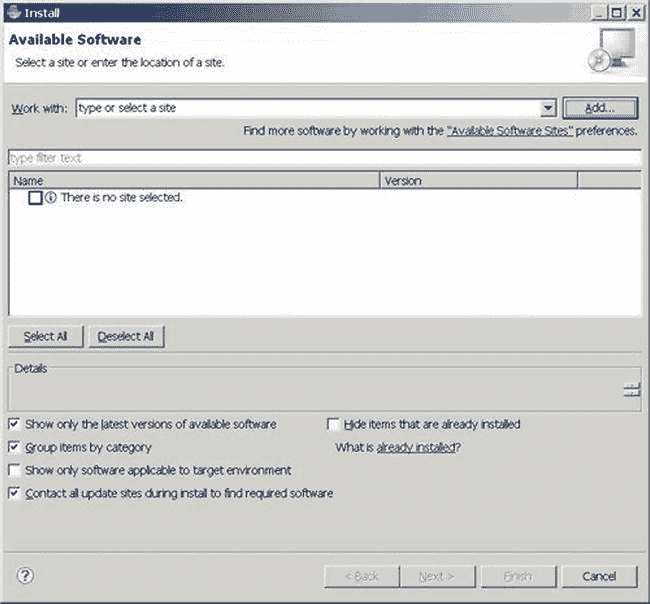

    [图 7-22](#_Fig22) 。Eclipse 安装软件对话框

4.  In the pop-up Add Repository dialog box, enter a name for Name and a software download web site address in Location. You can enter the local address or the Internet address. If you’re using an Internet address, Eclipse will go to the Internet to download and install the package, while the local address will direct Eclipse to install the software from the local package. Enter the local address; then you can click the Archive button in the pop-up dialog box and enter the directory and filename for the downloaded `cdt-master-8.1.1.zip file`, as shown in [Figure 7-23](#Fig23). If the file is downloaded from the Internet, the address is `http://download.eclipse.org/tools/cdt/releases/galileo/`.

    

    [图 7-23](#_Fig23) 。Eclipse 软件更新安装地址对话框

5.  After returning to the Install dialog box, click to select the software components that need to be installed, as shown in [Figure 7-24](#Fig24).

    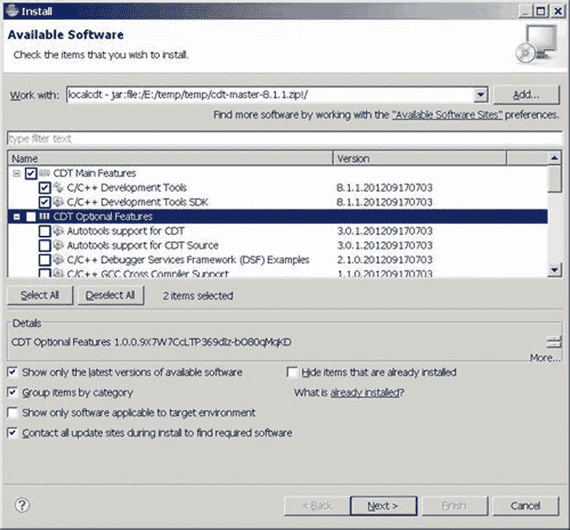

    [图 7-24](#_Fig24) 。要安装的组件的 CDT 选择框

    在组件列表中，CDT 主要功能是必需的组件。在本例中，我们仅选择该组件。

6.  A list of detailed information about CDT components to install is displayed, as shown in [Figure 7-25](#Fig25).

    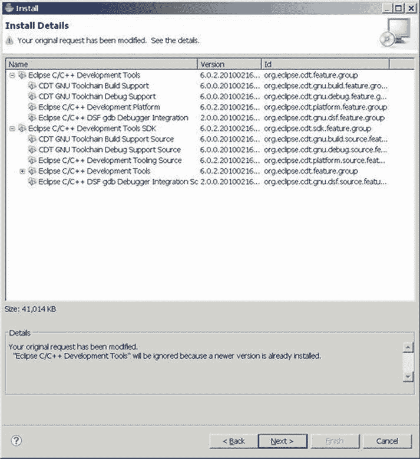

    [图 7-25](#_Fig25) 。CDT 组件安装的详细信息

7.  Review the licenses dialog box. Click “I accept the terms of the license agreement” to continue, as shown in [Figure 7-26](#Fig26).

    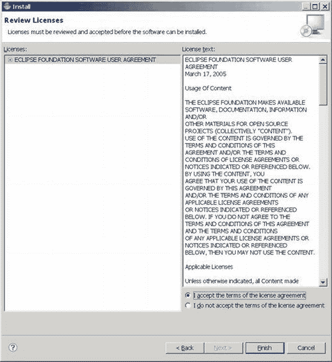

    [图 7-26](#_Fig26) 。CDT 执照审核窗口

8.  The installation process starts, as shown in [Figure 7-27](#Fig27).

    

    [图 7-27](#_Fig27) 。CDT 安装进度

9.  当安装过程完成时，重启 Eclipse 以完成安装。

NDK 的例子

本节包括一个例子来说明 JNI 和 NDK 的用法。如前所述，NDK 可以从命令行运行，也可以在 Eclipse IDE 中运行。我们将使用这两种方法来生成相同的 NDK 应用。

使用命令行方法生成一个库文件

这个例子的名字是`jnitest`，它是一个演示 JNI 代码框架的简单例子。以下几节概述了这些步骤。

创建一个 Android 应用项目

首先，你需要创建一个 Android app 项目，编译代码，生成`.apk`包。在 Eclipse 中创建一个项目，并将项目命名为`jnitest`。选择 Build SDK 支持 x86 版本的 API(这里是 Android 4.0.3)，如图[图 7-28](#Fig28) 所示。最后，您生成项目。


[图 7-28](#_Fig28) 。jnitest 项目参数设置

项目生成后，文件结构被创建，如图 7-29 所示。请注意库文件(在本例中为`android.jar`)所在的目录，因为下面的步骤将使用该参数。


[图 7-29](#_Fig29) 。jnitest 项目的文件结构

修改 Java 文件

接下来修改 Java 文件，使用 C 函数创建代码。在这种情况下，唯一的 Java 文件是`MainActivity.java`。您需要修改其代码，如下所示:

```java
1.      package com.example.jnitest;
2.      import android.app.Activity;
3.      import android.widget.TextView;
4.      import android.os.Bundle;
5.      public class MainActivity extends Activity
6.      {
7.          @Override
8.          public void onCreate(Bundle savedInstanceState)
9.          {
10.             super.onCreate(savedInstanceState);
11.             TextView tv = new TextView(this);
12.             tv.setText(stringFromJNI() ); // stringFromJNIas a  C function
13.             setContentView(tv);
14.         }
15.     publicnativeString stringFromJNI();
16.
17.         static {
18.                     System.loadLibrary("jnitestmysharelib");
19.         }
20.     }
```

代码非常简单。在第 11 行到第 13 行，您使用一个`TextView`来显示从`stringFromJNI()`函数返回的字符串。但与之前讨论的 Android 应用不同的是，整个项目中没有任何地方可以找到这个功能的实现代码。那么函数的实现发生在哪里呢？在第 15 行中，您声明该函数不是用 Java 编写的，而是由本地(本机)库编写的，这意味着该函数在 Java 之外。既然它是在本地库中实现的，那么问题是什么库呢？答案在第 17–20 行中描述。`System`类的`static`函数`LoadLibrary`的参数描述了库的名称。该库是一个名为`libjnitestmysharelib.so`的 Linux 共享库。在静态区声明的应用代码将在`Activity.onCreate`之前执行。该库将在第一次使用时加载到内存中。

有趣的是，当`loadLibrary`函数加载库名时，它会自动在参数和*前加上`lib`前缀。*所以后缀结尾。当然，如果参数指定的库文件的名称以`lib`开头，该函数不会在文件名前添加前缀`lib`。

在 Eclipse 中生成项目

只建(build)，而不跑。这将编译项目，但是`.apk`文件不会被部署到目标机器上。

当这一步完成后，相应的`.class`文件将在名为`bin\classes\com\example\jnitest`的项目目录中生成。这一步必须在下一步之前完成，因为下一步需要合适的`.class`文件。

在项目根目录下创建一个子目录

将这个子目录命名为`jni`。例如，如果项目根目录是`E:\temp\AndroidDev\workspace\jnitest`，可以使用`md`命令创建`jni`子目录。

```java
E:\temp\Android Dev\workspace\jnitest>mkdir jni
```

然后测试目录是否已经建立:

```java
E:\temp\Android Dev\workspace\jnitest>dir
...
2013-02-01  00:45    <DIR>          jni
```

创建一个 C 接口文件

所谓 C 接口文件，就是配合本地(外部)函数工作的 C 函数原型。特定于这种情况的是`stringFromJNI`函数的 C 函数原型。您声明您需要使用`external`函数的原型，但是它是 Java 格式的:您需要将其更改为 C 格式构建 C-JNI 接口文件。这一步可以用`javah`命令来完成。命令格式是:

```java
$ javah -classpath <directory of jar and .class documents>  -d <directory of .h documents>  <the package + class name of class>
```

命令参数描述如下:

*   `-classpath`:表示类路径
*   `-d ...`:表示生成的头文件的存储目录
*   `<class name>` *:* 正在使用的本机函数的完整`.class`类名，由“包+类的类名”组件组成。

对于此示例，请遵循以下步骤:

1.  从命令行输入根目录(在本例中是`E:\temp\Android Dev\workspace\jnitest`)。
2.  然后运行以下命令:

```java
E:> javah -classpath "D:\Android\android-sdk\platforms\android-15\android.jar";bin/classes  com.example.jnitest.MainActivity
```

在这个例子中，使用的本机函数的`stringFromJNI`的类是`MainActivity`，编译这个类后的结果文件是`MainActivity`。类，它位于项目的根目录`bin \classes\com\example`目录下。其类`MainActivity.java`的源代码文件的第一行显示了该类的包在哪里:

```java
package com.example.jnitest;
```

在前面的命令中，`class name = package name.Class name`(注意不要使用`.class`后缀)，`-classpath`首先需要解释整个包的 Java 库路径(本例中库文件为`android.jar`；其位置如图[图 7-30](#Fig30) 所示，即`D:\Android\android-sdk\ platforms\android-15\android.jar`。`-classpath`还需要说明目标类(`MainActivity.class`)目录。在本例中，它位于`bin\classes`目录中，在`bin\classes\com\example\ MainActivity.class`下(两者都用分号分隔)。

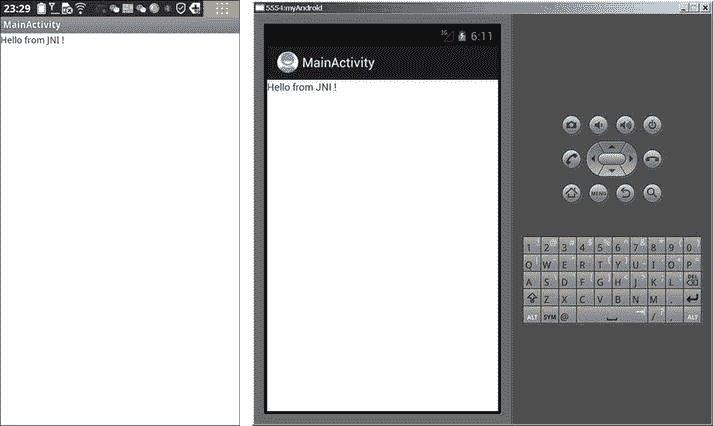

[图 7-30](#_Fig30) 。jnitest 应用运行界面

经过前面的步骤后，在当前目录(项目根目录)下生成了`.h`文件。该文件定义了 C 语言的函数接口。

您可以测试前面步骤的输出:

```java
E:\temp\Android Dev\workspace\jnitest>dir
...
2013-01-31  22:00      3,556 com_example_jnitest_MainActivity.h
```

显然已经生成了一个新的`.h`文件。该文件内容如下:

```java
1.      /* DO NOT EDIT THIS FILE - it is machine generated */
2.      #include <jni.h>
3.      /* Header for class com_example_jnitest_MainActivity */
4.
5.      #ifndef _Included_com_example_jnitest_MainActivity
6.      #define _Included_com_example_jnitest_MainActivity
7.      #ifdef __cplusplus
8.      extern "C" {
9.      #endif
10.     #undef com_example_jnitest_MainActivity_MODE_PRIVATE
11.     #define com_example_jnitest_MainActivity_MODE_PRIVATE 0L
12.     #undef com_example_jnitest_MainActivity_MODE_WORLD_READABLE
13.     #define com_example_jnitest_MainActivity_MODE_WORLD_READABLE 1L
14.     #undef com_example_jnitest_MainActivity_MODE_WORLD_WRITEABLE
15.     #define com_example_jnitest_MainActivity_MODE_WORLD_WRITEABLE 2L
16.     #undef com_example_jnitest_MainActivity_MODE_APPEND
17.     #define com_example_jnitest_MainActivity_MODE_APPEND 32768L
18.     #undef com_example_jnitest_MainActivity_MODE_MULTI_PROCESS
19.     #define com_example_jnitest_MainActivity_MODE_MULTI_PROCESS 4L
20.     #undef com_example_jnitest_MainActivity_BIND_AUTO_CREATE
21.     #define com_example_jnitest_MainActivity_BIND_AUTO_CREATE 1L
22.     #undef com_example_jnitest_MainActivity_BIND_DEBUG_UNBIND
23.     #define com_example_jnitest_MainActivity_BIND_DEBUG_UNBIND 2L
24.     #undef com_example_jnitest_MainActivity_BIND_NOT_FOREGROUND
25.     #define com_example_jnitest_MainActivity_BIND_NOT_FOREGROUND 4L
26.     #undef com_example_jnitest_MainActivity_BIND_ABOVE_CLIENT
27.     #define com_example_jnitest_MainActivity_BIND_ABOVE_CLIENT 8L
28.     #undef com_example_jnitest_MainActivity_BIND_ALLOW_OOM_MANAGEMENT
29.     #define com_example_jnitest_MainActivity_BIND_ALLOW_OOM_MANAGEMENT 16L
30.     #undef com_example_jnitest_MainActivity_BIND_WAIVE_PRIORITY
31.     #define com_example_jnitest_MainActivity_BIND_WAIVE_PRIORITY 32L
32.     #undef com_example_jnitest_MainActivity_BIND_IMPORTANT
33.     #define com_example_jnitest_MainActivity_BIND_IMPORTANT 64L
34.     #undef com_example_jnitest_MainActivity_BIND_ADJUST_WITH_ACTIVITY
35.     #define com_example_jnitest_MainActivity_BIND_ADJUST_WITH_ACTIVITY 128L
36.     #undef com_example_jnitest_MainActivity_CONTEXT_INCLUDE_CODE
37.     #define com_example_jnitest_MainActivity_CONTEXT_INCLUDE_CODE 1L
38.     #undef com_example_jnitest_MainActivity_CONTEXT_IGNORE_SECURITY
39.     #define com_example_jnitest_MainActivity_CONTEXT_IGNORE_SECURITY 2L
40.     #undef com_example_jnitest_MainActivity_CONTEXT_RESTRICTED
41.     #define com_example_jnitest_MainActivity_CONTEXT_RESTRICTED 4L
42.     #undef com_example_jnitest_MainActivity_RESULT_CANCELED
43.     #define com_example_jnitest_MainActivity_RESULT_CANCELED 0L
44.     #undef com_example_jnitest_MainActivity_RESULT_OK
45.     #define com_example_jnitest_MainActivity_RESULT_OK -1L
46.     #undef com_example_jnitest_MainActivity_RESULT_FIRST_USER
47.     #define com_example_jnitest_MainActivity_RESULT_FIRST_USER 1L
48.     #undef com_example_jnitest_MainActivity_DEFAULT_KEYS_DISABLE
49.     #define com_example_jnitest_MainActivity_DEFAULT_KEYS_DISABLE 0L
50.     #undef com_example_jnitest_MainActivity_DEFAULT_KEYS_DIALER
51.     #define com_example_jnitest_MainActivity_DEFAULT_KEYS_DIALER 1L
52.     #undef com_example_jnitest_MainActivity_DEFAULT_KEYS_SHORTCUT
53.     #define com_example_jnitest_MainActivity_DEFAULT_KEYS_SHORTCUT 2L
54.     #undef com_example_jnitest_MainActivity_DEFAULT_KEYS_SEARCH_LOCAL
55.     #define com_example_jnitest_MainActivity_DEFAULT_KEYS_SEARCH_LOCAL 3L
56.     #undef com_example_jnitest_MainActivity_DEFAULT_KEYS_SEARCH_GLOBAL
57.     #define com_example_jnitest_MainActivity_DEFAULT_KEYS_SEARCH_GLOBAL 4L
58.     /*
59.      * Class:     com_example_jnitest_MainActivity
60.      * Method:    stringFromJNI
61.      * Signature: ()Ljava/lang/String;
62.      */
63.     JNIEXPORT jstring JNICALL Java_com_example_jnitest_MainActivity_stringFromJNI
64.       (JNIEnv *, jobject);
65.
66.     #ifdef __cplusplus
67.     }
68.     #endif
69.     #endif
```

在前面的代码中，请特别注意第 63–64 行，这是一个本地函数`stringFromJNI`的 C 函数原型。

编译相应的。c 文件

这是一个局部函数的真正实现(`stringFromJNI`)。按照前面的步骤，通过修改`.h`文件获得源代码文件。

创建新的。项目中`jni`子目录下的 c 文件。文件名可以随机创建。在本例中，它被命名为`jnitestccode.c`。内容如下:

```java
1.      #include <string.h>
2.      #include <jni.h>
3.      jstring Java_com_example_hellojni_HelloJni_stringFromJNI( JNIEnv* env,  jobject thiz )
4.      {
5.          return (*env)->NewStringUTF(env, "Hello from JNI !"); // Newly added code
6.      }
```

前面的代码定义了函数实现，非常简单。第 3 行是函数`stringFromJNI`的原型定义中使用的 Java 代码。它基本上是从前面的步骤中获得的`.h`文件的相应内容的副本(`com_example_jnitest_MainActivity.h`的第 63–64 行)，并稍微做了一些修改。该函数的原型格式是固定的— `JNIEnv* env`和`jobject thiz`是 JNI 的固有参数。因为`stringFromJNI`函数的参数为空，所以生成的 C 函数只有两个参数。第 5 行代码的作用是返回字符串`"Hello fromJNI!"`作为返回值。

第 2 行的代码是包含 JNI 函数的头文件，任何使用 JNI 的函数都需要这个函数。因为它与`string`函数相关，所以在这种情况下，第 1 行包含相应的头文件。完成前面的步骤后，`.h`文件不再有用，可以删除。

在 jni 目录下创建 NDK Makefile 文件

这些文件主要包括`Android.mk`和`Application.mk`文件，其中需要`Android.mk`。但是，如果使用应用的默认配置，则不需要`Application.mk`。四个具体步骤如下:

1.  Create a new `Android.mk` text file in the `jni` directory in the project. This file tells the compiler about some requirements, such as which C files to compile, the filename for compiled code, and so on. Enter the following:

    ```java
       LOCAL_PATH := $(call my-dir)
       include $(CLEAR_VARS)
       LOCAL_MODULE  := jnitestmysharelib
       LOCAL_SRC_FILES  := jnitestccode.c
       include $(BUILD_SHARED_LIBRARY)
    ```

    接下来解释文件内容。

    第 3 行表示生成的。所以 filename(标识您的`Android.mk`文件中描述的每个模块)。它必须与 Java 代码中的`System.loadLibrary`函数的参数值一致。该名称必须是唯一的，并且不能包含任何空格。

     **注意**构建系统会自动生成适当的前缀和后缀。换句话说，如果一个是名为`jnitestmysharelib`的共享库模块，那么就会生成一个`libjnitestmysharelib.so`文件。如果您将库命名为`libhello-jni`，编译器将不会添加`lib`前缀，也会生成`libhello-jni.so`。

    第 4 行的`LOCAL_SRC_FILES`变量必须包含要编译并打包成模块的 C 或 C++源代码文件。前面的步骤创建了一个 C 文件名。

     **注意**用户不必在这里列出头文件和包含文件，因为编译器会自动为你识别依赖文件。只列出直接传递给编译器的源代码文件。此外，C++源文件的默认扩展名是. CPP。只要定义了`LOCAL_DEFAULT_CPP_EXTENSION`变量，就可以指定不同的扩展名。不要忘记开头的小圆点(。cxx，而不是 cxx)。

    第 3 行到第 4 行的代码非常重要，必须根据每个 NDK 应用的实际配置进行修改。其他行的内容可以从前面的例子中复制。

2.  Create an `Application.mk` text file in the `jni` directory in the project. This file tells the compiler the specific settings for this application. Enter the following:

    ```java
    APP_ABI := x86
    ```

    这个文件非常简单。您使用由 x86 架构的应用指令生成的目标代码，因此您可以在英特尔凌动处理器上运行应用。对于 APP_ABI 参数，请使用 x86、armeabi 或 armeabi-v7a。

3.  Next, compile the .c file to the .SO shared library file.

    转到项目根目录(`AndroidManifest.xml`所在的位置)并运行`ndk-build`命令:

    ```java
    E:\temp\Android Dev\workspace\jnitest>ndk-build
    D:/Android/android-ndk-r8d/build/core/add-application.mk:128: Android NDK: WARNI
    NG: APP_PLATFORM android-14 is larger than android:minSdkVersion 8 in ./AndroidM
    anifest.xml
    "Compile x86  : jnitestmysharelib <= jnitestccode.c
    SharedLibrary  : libjnitestmysharelib.so
    Install        : libjnitestmysharelib.so => libs/x86/libjnitestmysharelib.so
    ```

    前面的命令将在项目中添加两个子目录(`libs`和`obj`)。包括的执行版本。所以将文件(名为`libjnitestmysharelib.so`的命令执行信息提示文件)放在`obj`目录下，最终会将最终版本放在`libs`目录下。

    如果前面的步骤没有定义指定 ABI 的`Application.mk`文件，使用`ndk-build`命令将生成 ARM 架构的目标代码(armeabi)。如果您必须生成 x86 体系结构指令，您也可以使用`ndk-build APP_ABI = x86`命令来补救这种情况。该命令生成的目标代码的架构仍然是 x86。

4.  Deployment: run the project.

    完成这一步后，就差不多可以部署和运行项目了。在目标设备的界面上运行的应用如[图 7-30](#Fig30) 所示。

在 IDE 中生成库文件

回想一下上一节中描述的将 C 文件编译成动态库的过程。所以可以在 Android 目标设备上运行的文件。您可以在命令行中运行`ndk-build`命令来完成这个过程。事实上，您也可以在 Eclipse IDE 中完成这一步。

在 IDE 中生成库文件时，前四个步骤中的代码与上一节中的代码完全相同。你只需要编译。c 文件转换成。所以改为共享库文件。这详细解释如下:

1.  Compile the .C file into the .SO shared library file. Right-click on the project name, and select Build Path, Configure Build Path. In the pop-up dialog box, select the Builders branch. Then click the New button in the dialog box. Double-click Program in the prompt dialog box. This process is shown in [Figure 7-31](#Fig31).

    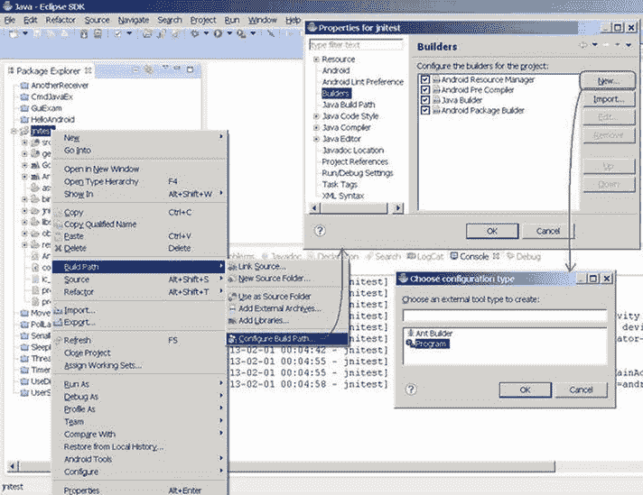

    [图 7-31](#_Fig31) 。在 Eclipse 中输入编译 C 代码界面的参数设置

2.  In the Edit Configuration dialog box, enter the following for the Main tab settings:
    *   *地点*:通往小天鹅的路径`bash.exe`。
    *   *工作目录*:Cygwin 的 bin 目录。
    *   *自变量:*

    ```java
    --login -c "cd '/cygdrive/E/temp/Android Dev/workspace/jnitest' && $ANDROID_NDK_ROOT/ndk-build"
    ```

    其中`E/temp/Android Dev/workspace/jnitest`是项目的字母和路径。整个设置如图 7-32 中的[所示。](#Fig32)

    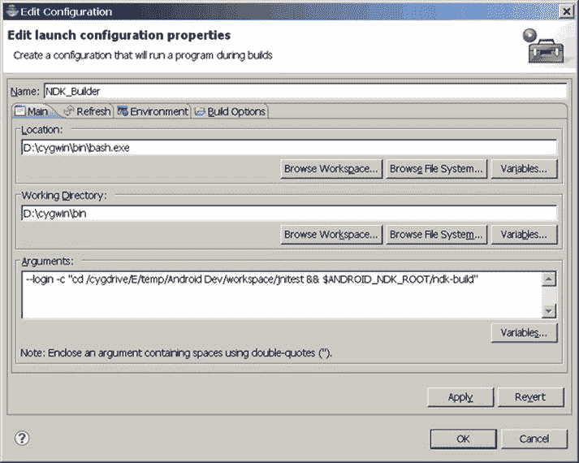

    [图 7-32](#_Fig32) 。编辑配置窗口中的主选项卡设置

3.  Then configure the Refresh tab, ensuring that these items are selected—The Entire Workspace and Recursively Include Sub-Folders—as shown in [Figure 7-33](#Fig33).

    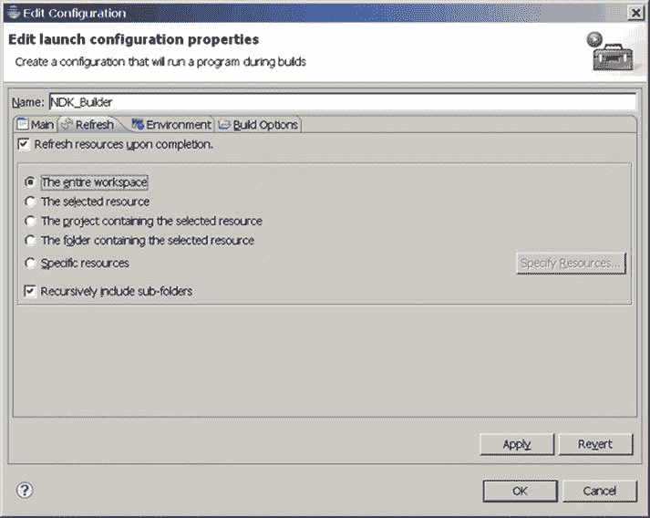

    [图 7-33](#_Fig33) 。编辑配置窗口刷新选项卡设置

4.  Reconfigure the Build Options tab. Check the During Auto Builds and Specify Working Set of Relevant Resources items, as shown in [Figure 7-34](#Fig34).

    

    [图 7-34](#_Fig34) 。编辑配置窗口构建选项选项卡设置

5.  Click on the Specify Resources button. In the Edit Working Set dialog box, select the `jni` directory, as shown in [Figure 7-35](#Fig35).

    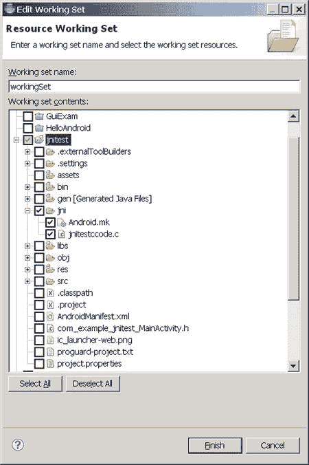

    [图 7-35](#_Fig35) 。选择相关文件所在的源代码目录

6.  正确配置前面的步骤后，将保存配置。它会自动编译`jni`目录下的 C 相关代码并输出相应的。所以库文件放在项目的`libs`目录下。`libs`目录是自动创建的。在控制台窗口中，您可以看到构建的输出信息，如下所示:

    ```java
    /cygdrive/d/Android/android-ndk-r8d/build/core/add-application.mk:128: Android NDK: WARNING: APP_PLATFORM android-14 is larger than android:minSdkVersion 8 in ./AndroidManifest.xml
    Cygwin         : Generating dependency file converter script
    Compile x86    : jnitestmysharelib <= jnitestccode.c
    SharedLibrary  : libjnitestmysharelib.so
    Install        : libjnitestmysharelib.so => libs/x86/libjnitestmysharelib.so
    ```

NDK 应用开发工作流分析

前面描述的生成 NDK 项目的过程很自然地实现了 C 库与 Java 的集成。在最后一步，你编译。c 文件放入。所以共享库文件。库的中间版本放在`obj`目录中，最终版本放在`libs`目录中。项目文件结构创建完成，如图[图 7-36](#Fig36) 所示。

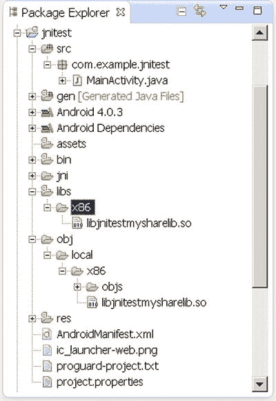

[图 7-36](#_Fig36) 。NDK 图书馆文件生成后的 jnitest 项目结构

共享库。所以文件在主机中的项目目录中，并将被打包在生成的`.apk`文件中。`.apk`文件本质上是一个压缩文件。可以使用 WinRAR 之类的压缩软件查看其内容。对于这个例子，您可以在项目目录的`bin`子目录中找到`.apk`文件。用 WinRAR 打开，显示文件结构。

`.apk`的`lib`子目录的内容是项目的`lib`子目录的克隆。在[图 7-36](#Fig36) 中生成。所以文件显示在`lib\x86`子目录中。

当`.apk`被部署到目标机器时，它将被解包，在这种情况下。因此文件将被放在`/data/dat/XXX/lib`目录中，其中`XXX`是应用包的名称。例如，对于前面的例子，目录是`/data/data/com.example.jnitest/lib`。您可以在 Eclipse DDMS 下查看目标机器的文件结构；该示例的文件结构如图[图 7-37](#Fig37) 所示。


[图 7-37](#_Fig37) 。NDK 图书馆文件生成后的 jnitest 项目结构

在[图 7-37](#Fig37) 中，你可以找到。所以库文件放在`/data/data/XXX/lib`目录下，这样当应用运行时，`System.loadLibrary`函数可以加载到内存中运行。这里你可以看到。所以文件中有 DDMS 的图形显示。有兴趣的读者可以在命令行上尝试一下，使用`adb` shell 命令查看目标文件目录中的相应内容。

此外，如果您在模拟器中运行`jnitest`应用(在这种情况下，目标机器是一个虚拟机)，您将在 Eclipse `Logcat`窗口中看到以下输出:

```java
1.  07-10 05:43:08.579: E/Trace(6263): error opening trace file: No such file or directory (2)
2.  07-10 05:43:08.729: D/dalvikvm(6263): Trying to load lib /data/data/com.example.jnitest/lib/libjnitestmysharelib.so 0x411e8b30
3.  07-10 05:43:08.838: D/dalvikvm(6263): Added shared lib /data/data/com.example.jnitest/lib/libjnitestmysharelib.so 0x411e8b30
4.  07-10 05:43:08.838: D/dalvikvm(6263): No JNI_OnLoad found in /data/data/com.example.jnitest/lib/libjnitestmysharelib.so 0x411e8b30, skipping init
5.  07-10 05:43:11.773: I/Choreographer(6263): Skipped 143 frames!  The application may be doing too much work on its main thread.
6.  07-10 05:43:12.097: D/gralloc_goldfish(6263): Emulator without GPU emulation detected.
```

第 2–3 行是关于。所以共享库加载到应用中。

**NDK 编译器优化**

从前面的例子中，您可以看到 NDK 工具的核心作用是将源代码编译到。所以库文件可以在 Android 机器上运行。那个。所以库文件被放在项目目录的`lib`子目录中，这样当您使用 Eclipse 部署应用时，您可以将库文件部署到目标设备上的适当位置，并且应用可以使用库函数运行。

 **注**NDK 应用的本质是建立一个符合 JNI 标准的代码框架。这将使 Java 应用能够使用超出虚拟机范围的本地函数。

用于将源代码编译成. SO 库文件的关键 NDK 命令是`ndk-build`。它实际上不是一个单独的命令，而是一个可执行的脚本。它调用 GNU 交叉开发工具中的`make`命令来编译一个项目，例如调用`gcc`编译器编译源代码来完成整个过程，如图[图 7-38](#Fig38) 所示。当然也可以直接用。所以 Android 应用中已经有第三方开发的共享库，从而避免了自己写库(函数代码)的需要。

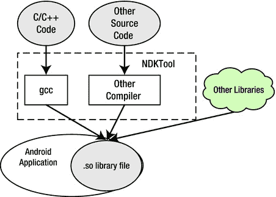

[图 7-38](#_Fig38) 。NDK 工具的工作机理

如图[7-38](#Fig38)所示，核心 GNU 编译器`gcc`是 NDK 中完成 C/C++源代码编译的核心工具。`gcc`是 Linux 的标准编译器，可以在本地机器上编译链接 C、C++、Object-C、FORTRAN 等源代码。事实上，`gcc`编译器不仅可以进行本地编译，还可以进行交叉编译。Android NDK 和其他嵌入式开发工具已经使用了这个特性。在编译器用法上，`gcc`交叉编译兼容原生编译；也就是说，本地编译代码的命令参数和开关本质上可以被移植，而无需修改交叉编译代码。因此，下面描述的`gcc`编译方法对于本地编译和交叉编译都是通用的。

在 **`Chapter 9: Performance Optimizations for Android Applications on x86`** 中，我们将更详细地讨论编译器优化(即一些优化如何由编译器自动完成)。对于基于 Intel x86 架构处理器的系统，除了 GNU `gcc`编译器，Intel C/C++编译器也是一个不错的工具。相对来说，由于英特尔 C/C ++编译器充分利用了英特尔处理器的特性，代码优化结果会更好。对于 Android NDK，无论是 Intel C/C++编译器还是`gcc`都可以完成 C/C++代码编译。目前，英特尔 C/C ++编译器提供了适当的使用机制。普通用户需要一个专业的许可证，而`gcc`是开源的、免费的软件，更容易获得。以下部分使用`gcc`作为实验工具，解释如何为 Android 应用执行 C/C++模块编译器优化。

`gcc`优化由编译器开关的优化选项控制。这些选项有些是独立于机器的，有些是与机器相关联的。这里我们将讨论一些重要的选项。对于与机器相关的选项，我们将只描述与英特尔处理器相关的选项。

独立于机器的编译器开关选项

`gcc`编译器开关的独立于机器的选项是`-Ox`选项，它们对应不同的优化级别。详情如下。

-0 或-01

一级优化是默认的优化级别，使用`-O`选项。编译器试图减少代码大小和执行时间。对于大型函数，需要花费更多的编译时间，使用大量的内存资源进行优化编译。

当不使用`-O`选项时，编译器的目标是减少编译的开销，以便快速调试结果。在这种编译模式下，语句是独立的。通过在两个语句之间插入断点来中断程序运行，用户可以重新分配变量或修改程序计数器来跳转到其他当前正在执行的语句，这样就可以精确地控制运行过程。当用户想调试时，也可以得到结果。此外，如果不使用`-O`选项，只有寄存器声明的变量可以进行寄存器分配。

当您指定`-O`选项时，`-fthread-jumps`和`-fdefer-pop`选项被打开。在带有延迟槽的机器上，打开`-fdelayed-branch`选项。即使对于支持无帧指针调试的机器，`-fomit-frame-pointer`选项也是打开的。一些机器可能还会激活其他选项。

-02

进一步优化。GCC 执行几乎所有支持的优化，不涉及空间速度的权衡。与`-O`相比，该选项增加了编译时间和生成代码的性能。

-03

进一步优化。选项`-O3`打开由`-O2`指定的所有优化，同时打开`-finline-functions`、`-funswitch-loops`、`-fpredictive-commoning`、`-fgcse-after-reload`、`-ftree-vectorize`、 *-* 、`fvect-cost-model`、`-ftree-partial-pre`和`-fipa-cp-clone`选项。

-00

减少编译时间并使调试产生预期的结果。这是默认设置。

自动内联函数通常用作函数优化措施。c99(1999 年开发的 C 语言 ISO 标准)和 C++都支持`inline`关键字。`inline`函数反映了用内联空间换取时间的思想。编译器不把内联描述的函数编译成函数，而是直接为函数体扩展代码，从而省去函数调用，返回`call ret`指令和参数的`push`指令执行。例如，在下面的函数中:

```java
inline long factorial (int i)
{
   return factorial_table[i];
}
```

所有出现的`factorial ()`调用都被替换为`factorial_table []`数组引用。

当处于优化状态时，一些编译器会将该函数视为内联函数，即使该函数不使用内联指令。只有在适当的情况下(比如函数代码体相对较短，定义在头文件中)，它才会这样做，以换取执行时间。

循环展开是一种经典的速度优化方法，被许多编译器视为自动优化策略。例如，以下循环代码需要循环 100 个周期:

```java
for (i = 0; i < 100; i++)
{
   do_stuff(i);
}
```

在所有 100 个循环中，在每个循环结束时，必须检查循环条件以进行比较判断。通过使用循环展开策略，代码可以转换如下:

```java
for (i = 0; i < 100; )
{
   do_stuff(i); i++;
   do_stuff(i); i++;
   do_stuff(i); i++;
   do_stuff(i); i++;
   do_stuff(i); i++;
   do_stuff(i); i++;
   do_stuff(i); i++;
   do_stuff(i); i++;
   do_stuff(i); i++;
   do_stuff(i); i++;
}
```

如您所见，新代码将比较指令从 100 次减少到 10 次，用于条件比较的时间可以减少 90%。

前面描述的两种方法都将提高目标代码的优化。这是时间优化思想的典型空间。

英特尔处理器相关的编译器开关选项

`gcc`的`m`选项是为英特尔 i386 和 x86 - 64 处理器家族定义的。主要命令选项在[表 7-3](#Tab3) 中解释。

[表 7-3](#_Tab3) 。与英特尔处理器相关的 gcc 开关选项

| 

切换选项

 | 

注意

 | 

描述

 |
| --- | --- | --- |
| `-march=cpu-type` `-mtune=cpu-type` |  | 为指定类型的 CPU 生成的代码。CPU 类型可以是 i386、i486、i586、奔腾、i686、奔腾 4 等等 |
| `-msse` |  | 编译器自动向量化。使用或不使用 MMX、SSE、SSE2 指令。例如，`-msse`表示编程入指令，`–mno-sse`表示未编程入 SSE 指令 |
| `-msse2` |  |
| `-msse3` |  |
| `-mssse3` | `gxx-4.3 new addition` |
| `-msse4.1` | `gcc-4.3 new addition` |
| `-msse4.2` | `gcc-4.3 new addition` |
| `-msse4` | `Include 4.1, 4.2 ,gcc-4.3 new addition` |
| `-mmmx` |  |
| `-mno-sse` |  |
| `-mno-sse2` |  |
| `-mno-mmx` |  |
| `-m32` `-m64` |  | 生成 32/64 机器码 |

在[表 7-3](#Tab3) 中，`-march`是机器的 CPU 类型，`-mtune`是编译器想要优化的 CPU 类型(默认与`-march`相同)。`-march`选项是“紧约束”，而`-mtune`是“松约束”`-mtune`选项可以提供向后兼容性。

带`-march = i686, -mtune = pentium4`的编译器优化选项针对奔腾 4 处理器进行了优化，但也可以在任何 i686 上运行。

对于`-mtune = pentium-mmx`编译的程序，可以运行奔腾 4 处理器。

```java
-march=cpu-type
```

该选项将生成指定机器类型的`cpu-type`指令。`-mtune = cpu-type`选项仅可用于优化为`cpu-type`生成的代码。相比之下，`-march = cpu-type`为指定类型的处理器生成不能在非`gcc`上运行的代码，这意味着`-march = cpu-type`意味着`-mtune = cpu-type`选项。

与英特尔处理器相关的`cpu-type`选项值在[表 7-4](#Tab4) 中列出。

[表 7-4](#_Tab4) 。gcc-March 参数的主要可选值为 cpu-type

| 

cpu 类型值

 | 

描述

 |
| --- | --- |
| `native` | 这通过确定编译机器的处理器类型来选择 CPU 在编译时生成代码。使用`-march=native`启用本地机器支持的所有指令子集(因此结果可能不会在不同的机器上运行)。使用`-mtune=native`在所选指令集的约束下产生针对本地机器优化的代码。 |
| `i386` | 原装英特尔 i386 CPU。 |
| `i486` | 英特尔 i486 CPU。(该芯片未实施任何调度。) |
| `i586` | 不支持 MMX 的英特尔奔腾 CPU。 |
| `pentium` |
| `pentium-mmx` | 英特尔奔腾 MMX CPU，基于支持 MMX 指令集的奔腾内核。 |
| `pentiumpro` | 英特尔奔腾 Pro CPU。 |
| `i686` | 与`-march`一起使用时，使用的是奔腾 Pro 指令集，所以代码运行在所有 i686 系列芯片上。当与`-mtune`一起使用时，它与“通用”具有相同的含义。 |
| `pentium2` | 英特尔奔腾 II CPU，基于支持 MMX 指令集的奔腾 Pro 内核。 |
| `pentium3` | 英特尔奔腾 III CPU，基于支持 MMX 和 SSE 指令集的奔腾 Pro 内核。 |
| `pentium3m` |
| `pentium-m` | 英特尔奔腾 M；支持 MMX、SSE 和 SSE2 指令集的低功耗版本英特尔奔腾 III CPU。由迅驰笔记本使用。 |
| `pentium4` | 支持 MMX、SSE 和 SSE2 指令集的英特尔奔腾 4 CPU。 |
| `pentium4m` |
| `prescott` | 英特尔奔腾 4 CPU 的改进版本，支持 MMX、SSE、SSE2 和 SSE3 指令集。 |
| `nocona` | 英特尔奔腾 4 CPU 的改进版本，支持 64 位扩展、MMX、SSE、SSE2 和 SSE3 指令集。 |
| `core2` | 具有 64 位扩展的英特尔酷睿 2 CPU，支持 MMX、SSE、SSE2、SSE3 和 SSSE3 指令集。 |
| `corei7` | 具有 64 位扩展的英特尔酷睿 i7 CPU，支持 MMX、SSE、SSE2、SSE3、SSSE3、SSE4.1 和 SSE4.2 指令集。 |
| `corei7-avx` | 具有 64 位扩展的英特尔酷睿 i7 CPU，支持 MMX、SSE、SSE2、SSE3、SSSE3、SSE4.1、SSE4.2、AVX、AES 和 PCLMUL 指令集。 |
| `core-avx-i` | 支持 64 位扩展、MMX、SSE、SSE2、SSE3、SSSE3、SSE4.1、SSE4.2、AVX、AES、PCLMUL、FSGSBASE、RDRND 和 F16C 指令集的英特尔酷睿 CPU。 |
| `atom` | 支持 64 位扩展、MMX、SSE、SSE2、SSE3 和 SSSE3 指令集的英特尔凌动 CPU。 |

Traditional `gcc`是一个本地编译器。这些命令选项可以添加到`gcc`来控制`gcc`编译器选项。例如，假设您有一个`int_sin.c`文件。

```java
$ gcc int_sin.c
```

前面的命令使用了`-O1`优化级别(默认级别),并将`int_sin.c`编译成一个可执行文件，默认名为`a.out`。

```java
$ gcc int_sin.c -o sinnorm
```

前面的命令使用`-O1`优化级别(默认级别)将`int_sin.c`编译成可执行文件；可执行文件的文件名被指定为`sinnorm`。

```java
$ gcc int_cos.c -fPIC -shared -o coslib.so
```

前面的命令使用`-O1`优化级别(默认级别)将`int_cos.c`编译成一个名为`coslib.so`的共享库文件。与之前编译成可执行程序的源代码文件不同，这个命令要求源代码文件`int_cos.c`不包含 main 函数。

```java
$ gcc -O0 int_sin.c
```

前面的命令用默认文件名将`int_sin.c`编译成可执行文件。编译器不执行任何优化。

```java
$ gcc -O3 int_sin.c
```

前面的命令使用最高的优化级别`-O3`将`int_sin.c`文件编译成具有默认文件名的可执行文件。

```java
$ gcc -msse int_sin.c
```

前面的命令使用 SSE 指令将`int_sin.c`编译成一个可执行文件。

```java
$ gcc -mno-sse int_sin.c
```

前面的命令将`int_sin.c`编译成一个可执行文件，没有任何 SSE 指令。

```java
$ gcc -mtune=atom int_sin.c
```

前面的命令将`int_sin.c`编译成可以使用英特尔凌动处理器指令的可执行文件。

从前面由`gcc`本地编译的例子中，您有了一些使用编译器`switch`选项进行`gcc`编译器优化的经验。对于`gcc`原生编译器，可以在`switch`选项中直接使用`gcc`命令来实现编译器优化。然而，从前面的例子中，你知道 NDK 不直接使用`gcc`命令。那么如何设置`gcc`编译器`switch`选项来实现 NDK 优化呢？

回想一下使用 NDK 的例子，您使用了`ndk-build`命令来编译 C/C++源代码；该命令首先需要读取 makefile 文件`Android.mk`。这个文件实际上包含了`gcc`命令选项。`Android.mk`使用`LOCAL_CFLAGS`控制并完成`gcc`命令选项。`ndk-build`命令将把`LOCAL_CFLAGS`运行时间值传递给`gcc`，作为其命令选项来运行`gcc`命令。`LOCAL_CFLAGS`将数值传递给`gcc`并将其作为命令选项来运行`gcc`命令。

例如，您将`Android.mk`修改如下:

```java
1.  LOCAL_PATH := $(call my-dir)
2.  include $(CLEAR_VARS)
3.  LOCAL_MODULE       := jnitestmysharelib
4.  LOCAL_SRC_FILES    := jnitestccode.c
5.  LOCAL_CFLAGS       := -O3
6.  include $(BUILD_SHARED_LIBRARY)
```

第 5 行是新增加的。它设置了`LOCAL_CFLAGS`变量脚本。

当你执行`ndk-build`命令时，相当于增加了一个`gcc -O3`命令选项。它指示`gcc`在最高优化级别 O3 编译 C 源代码。同样，如果您将第 5 行编辑为:

```java
LOCAL_CFLAGS       := -msse3
```

你指示`gcc`使用 SSE3 指令将 C 源代码编译成目标代码。

感兴趣的读者可以将`LOCAL_CFLAGS`设置为不同的值，比较目标库文件的大小和内容差异。注意，前面的例子`jnitest` C 代码非常简单，不涉及复杂的任务。因此，当从不同的`LOCAL_CFLAGS`值编译时，库文件的大小或内容不会有很大的不同。

那么，库文件的大小或内容会有显著的不同吗？其实答案是肯定的。在这方面，我们将在下面的章节中给出实际的例子。

概观

学习完本章后，您应该对 Android 原生开发套件有了全面的了解，并了解如何使用它来创建面向英特尔平台的 Android 应用。我们还介绍了英特尔 C++编译器及其选项。重要的是要记住，英特尔 C++编译器只是可用于英特尔 Android 应用的可能编译器之一。我们详细讨论了用于与您的 NDK 应用交互的 Java 本地接口，以及它是如何操作的。我们还介绍了各种代码示例，以便更好地解释英特尔 C++编译器的各种基本优化。