第三章

游戏开发 101

游戏开发很难——不是因为它是火箭科学，而是因为在你真正开始编写你梦想的游戏之前，有大量的信息需要消化。在编程方面，您必须担心诸如文件输入/输出(I/O)、用户输入处理、音频和图形编程以及网络代码之类的日常事务。而这些只是基础！最重要的是，你会想要建立你真正的游戏机制。代码也需要结构，如何创建游戏的架构并不总是显而易见的。你实际上必须决定如何让你的游戏世界移动。你能不使用物理引擎，而使用你自己的简单模拟代码吗？你的游戏世界设定的单位和尺度是什么？如何翻译到屏幕上？

实际上还有另一个许多初学者忽略的问题，那就是，在你开始动手之前，你实际上必须首先设计你的游戏。数不清的项目从未公开，并陷入技术演示阶段，因为对游戏实际上应该如何运行从来没有任何清晰的想法。我们不是在谈论你的普通第一人称射击游戏的基本游戏机制。这是最简单的部分:WASD 移动键加鼠标，你就完成了。你应该问自己这样的问题:有闪屏吗？它过渡到什么？主菜单屏幕上有什么？实际游戏画面上有哪些平视显示元素？如果我按下暂停按钮会发生什么？设置屏幕上应该提供什么选项？我的 UI 设计在不同的屏幕尺寸和长宽比下会怎样？

有趣的是没有灵丹妙药；没有处理所有这些问题的标准方法。我们不会假装给你开发游戏的终极解决方案。相反，我们将尝试说明我们通常是如何设计游戏的。你可以决定完全适应它或者修改它以更好地满足你的需要。没有规则——对你有效的就行。然而，你应该总是努力寻找一个简单的解决方案，无论是在代码上还是在纸上。

流派:适合每个人的口味

在你的项目开始时，你通常决定你的游戏将属于哪种类型。除非你想出一些全新的、前所未见的东西，否则你的游戏创意很有可能会符合当前流行的广泛类型之一。大多数流派都建立了游戏机制标准(例如，控制方案、特定目标等等)。偏离这些标准可以让游戏大受欢迎，因为游戏玩家总是渴望新的东西。不过，这也是一个很大的风险，所以要仔细考虑你的新平台玩家/第一人称射击游戏/即时战略游戏是否真的有观众。

让我们来看看 Google Play 上更受欢迎的流派的一些例子。

休闲游戏

可能 Google Play 上最大的游戏部分是所谓的休闲游戏。那么到底什么是休闲游戏呢？这个问题没有具体的答案，但是休闲游戏有一些共同的特点。通常，它们具有很好的可访问性，因此即使非游戏玩家也可以很容易地使用它们，这极大地增加了潜在玩家的数量。一场游戏最多只需要几分钟。然而，休闲游戏的简单性容易让人上瘾，经常让玩家沉迷几个小时。实际的游戏机制从极其简单的益智游戏到一键平台游戏，再到像把纸团扔进篮子这样简单的事情。由于休闲风格的模糊定义，这种可能性是无穷无尽的。

*神庙逃亡*(见[图 3-1](#Fig1) )，由伊玛吉工作室制作，是完美的休闲游戏范例。你引导一个人物通过充满障碍的多条轨迹。整个输入方案是基于滑动的。如果你向左或向右滑动，角色会向那个方向转弯(假设前面有一个十字路口)。如果你向上滑动，角色会跳跃，而向下滑动会使角色滑到障碍物下面。一路上你可以获得各种奖励和动力。易于理解的控制、明确的目标和漂亮的 3D 图形使这款游戏在苹果应用商店和谷歌 Play 上一炮而红。

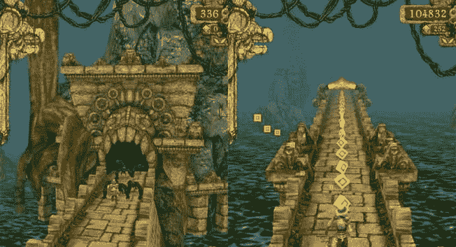

[图 3-1。](#_Fig1)伊曼吉工作室的《神庙逃亡》

*宝石矿工:挖得更深*(见[图 3-2](#Fig2) )，由一人军 Psym 机动，是完全不同的动物。这是同一家公司大获成功的*宝石矿工* 的续集。它只是稍微迭代了一下原文。你扮演一名矿工，试图在随机产生的矿中找到有价值的矿石、金属和宝石。这些宝藏可以用来交换更好的设备，以挖掘更深的地方，找到更有价值的宝藏。它利用了一个事实，即许多人喜欢研磨的概念:没有太多的努力，你就不断地得到新的噱头，让你玩下去。这个游戏的另一个有趣的方面是地雷是随机产生的。这极大地增加了游戏的重玩价值，而没有增加额外的游戏机制。为了增加趣味，游戏提供了具有具体目标的挑战关卡，完成后你可以获得奖牌。这是一个非常轻量级的成就系统。

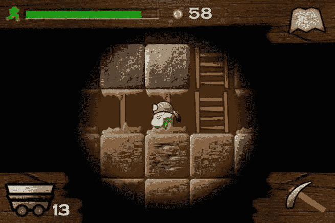

[图 3-2。](#_Fig2)宝石矿工:深入挖掘，Psym Mobile

这个游戏更有趣的一面是它的赚钱方式。尽管目前的趋势是“免费增值”游戏(游戏本身是免费的，而额外的内容可以以经常是荒谬的价格购买)，它使用的是“老派”付费模式。大约 2 美元一张，超过 100，000 次下载，这对于一个非常简单的游戏来说是相当大的一笔钱。这种销售数字在 Android 上很少见，尤其是 Psym Mobile 基本上没有为游戏做任何广告。前作的成功及其庞大的玩家基础很大程度上保证了续集的成功。

休闲游戏类别的所有可能的子类别的列表将会占据本书的大部分。在这个流派中可以找到许多更具创新性的游戏概念，值得在市场上查看各自的类别以获得一些灵感。

益智游戏

益智游戏无需介绍。我们都知道一些很棒的游戏，比如俄罗斯方块和 T2 宝石迷阵。他们是安卓游戏市场的重要组成部分，在所有人群中都很受欢迎。与基于 PC 的益智游戏(通常只涉及将三个颜色或形状的物体放在一起)相比，Android 上的许多益智游戏偏离了经典的 match-3 公式，使用了更复杂的基于物理的谜题。

*切绳子*(见[图 3-3](#Fig3) )，作者 ZeptoLab，是一个物理学难题的极好例子。游戏的目标是给每个屏幕上的小生物喂糖果。这块糖必须通过切断它所系的绳子，将它放入气泡中以便它可以向上漂浮，绕过障碍物等等来引导它。每个游戏对象在某种程度上都是物理模拟的。这款游戏由 2D 物理引擎 Box2D 驱动。*割绳子*在 iOS 应用商店和 Google Play 上都获得了瞬间的成功，甚至已经被移植到浏览器中运行！

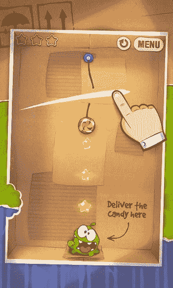

[图 3-3。](#_Fig3)割断绳子，由 ZeptoLab

*器械*(见[图 3-4](#Fig4) )，由 Bithack(另一个一人公司)制作，深受老牌 Amiga 和 PC 经典*不可思议机器*的影响。像*切断绳子*，这是一个物理难题，但它给了玩家更多的控制她解决每个难题的方式。各种积木，如可以钉在一起的简单木头、绳子、马达等等，可以以创造性的方式组合起来，将蓝色的球从关卡的一端带到目标区域。

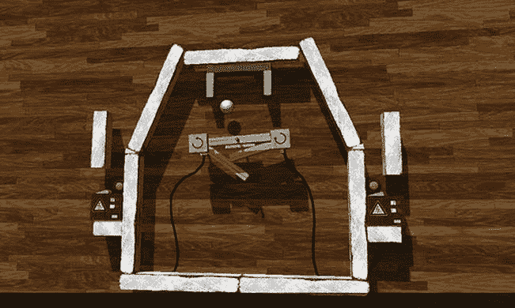

[图 3-4。](#_Fig4)仪器，由 Bithack

除了有预制关卡的战役模式，还有一个沙盒环境，在那里你可以发挥你的创造力。更好的是，你的定制装置可以很容易地与他人分享。设备的这个方面保证了即使玩家已经完成了游戏，仍然有大量的额外内容需要探索。

当然，你也可以在市场上找到各种各样的俄罗斯方块克隆版，match-3 游戏，以及其他标准公式。

动作和街机游戏

动作和街机游戏通常会释放 Android 平台的全部潜力。其中许多都具有令人惊叹的 3D 视觉效果，展示了在当前这一代硬件上的可能性。这种类型有许多子类别，包括赛车游戏、射击游戏、第一和第三人称射击游戏以及平台游戏。在过去的几年里，随着大型游戏工作室开始将其游戏移植到 Android 上，Android 市场的这一部分已经获得了很大的吸引力。

*SHADOWGUN* (见[图 3-5](#Fig5) )，由 MADFINGER Games 出品，是一款视觉效果惊人的第三人称射击游戏，展示了最近的 Android 手机和平板电脑的计算能力。与许多 AAA 游戏一样，它在 Android 和 iOS 上都可以使用。 *SHADOWGUN* 利用跨平台游戏引擎 Unity，是 Unity 在移动设备上的力量的典型代表之一。游戏性方面，它是一个双模拟棍射击游戏，甚至允许躲在板条箱和其他通常在手机动作游戏中找不到的漂亮机械装置后面。

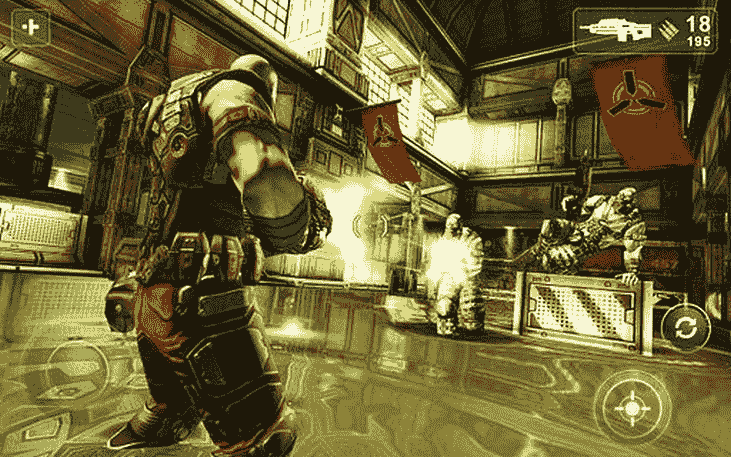

[图 3-5。](#_Fig5) SHADOWGUN，由 MADFINGER 游戏

虽然很难获得确切的数字，但 Android 市场的统计数据似乎表明， *SHADOWGUN* 的下载量与之前讨论过的*宝石矿*大致相当。这表明，创造一款成功的 Android 游戏并不一定需要一个庞大的 AAA 团队。

*坦克英雄:激光战争*(见[图 3-6](#Fig6) ) 是*坦克英雄*的续集，由一个名为 Clapfoot Inc .的非常小的独立团队创作。你指挥一辆坦克，你可以装备越来越多疯狂的附件，如射线枪、声波炮等等。关卡非常小，限制在平坦的战场上，周围散布着互动元素，你可以利用这些元素来消灭游戏场上所有其他的敌方坦克。通过简单地触摸敌人或游戏场地来控制坦克，作为回应，它将采取适当的行动(分别是射击或移动)。虽然它在视觉上还没有达到 *SHADWOGUN* 的水平，但它仍然拥有相当好看的动态照明系统。这里要吸取的教训是，即使是小团队，如果他们对内容加以约束，比如限制比赛场地的大小，也可以创造出视觉上令人愉悦的体验。

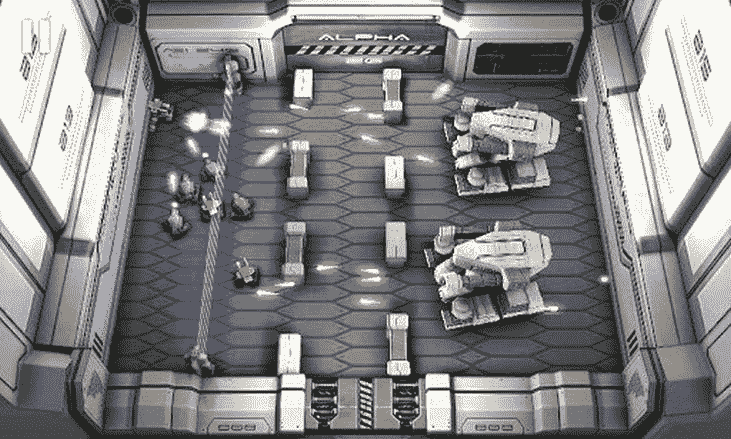

[图 3-6。《坦克英雄:激光战争》,克拉普富特公司出品。](#_Fig6)

*龙，飞吧！*(见[图 3-7](#Fig7) )，by Four pixel，改编自 Andreas Illiger 的极其成功的游戏 *Tiny Wings* ，在撰写本文时该游戏仅在 iOS 上可用。你控制一条小龙在几乎无限多的斜坡上上下下，同时收集各种宝石。如果加速足够快，小龙可以起飞和飞行。这是通过在下坡时触摸屏幕来实现的。机制非常简单，但随机生成的世界和对更高分数的渴望使人们回来寻求更多。


[图 3-7。](#_Fig7)龙，飞！，四个像素

*龙，飞吧！*很好地说明了一个现象:通常，特定的手机游戏流派会出现在 iOS 上。即使有巨大的需求，原创者也不经常把他们的游戏移植到 Android 上。其他游戏开发商可以介入，为 Android 市场提供替代版本。这也可能完全适得其反，如果“灵感”游戏太过抄袭，就像 Zynga 对一款名为*小塔*的游戏所做的那样。推广一个创意通常会受到好评，而公然抄袭另一个游戏通常会遭到恶语相向。

*【马克思·佩恩】(见[图 3-8](#Fig8))由 Rockstar Games 出品，是一款 2001 年出版的老牌 PC 游戏的移植。我们把它放在这里是为了说明一个不断增长的趋势，即 AAA 出版商把他们的旧知识产权移植到移动环境中。《马克思·佩恩》讲述了一名警察的家庭被贩毒集团谋杀的故事。马克斯暴跳如雷，为妻子和孩子报仇。所有这一切都嵌入了黑色电影风格的叙事中，通过连环漫画和短片场景来展示。最初的游戏严重依赖于我们在 PC 上玩射击游戏时习惯使用的标准鼠标/键盘组合。Rockstar Games 成功创造了基于触摸屏的控件。虽然控制不如 PC 上的精确，但它们仍然足以让游戏在触摸屏上变得令人愉快。*

 *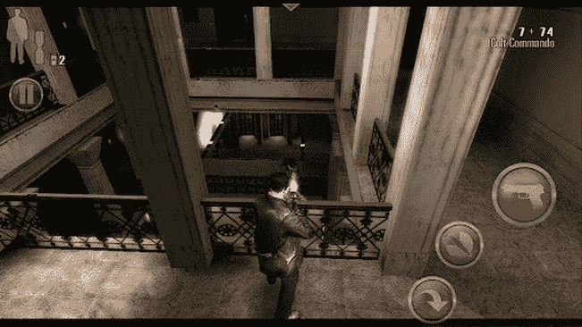

[图 3-8。](#_Fig8)马克思·佩恩，由摇滚明星游戏公司出品

动作和街机类型在市场上仍然有点代表性不足。玩家渴望好的动作游戏，所以那可能是你的专长！

塔防游戏

鉴于他们在 Android 平台上的巨大成功，我们觉得有必要将塔防游戏作为他们自己的类型来讨论。塔防游戏作为由 modding 社区开发的 PC 即时战略游戏的变体变得流行起来。这个概念很快就被翻译成了单机游戏。塔防游戏目前是 Android 上最畅销的游戏类型。

在一个典型的塔防游戏中，一些主要是邪恶的力量在所谓的波浪中派出生物来攻击你的城堡/基地/水晶/你能想到的。你的任务是通过放置射击来袭敌人的防御炮塔来保卫游戏地图上的那个特殊地方。对于每一个你杀死的敌人，你通常会得到一些钱或点数，你可以投资在新的炮塔或升级上。这个概念非常简单，但是要在这种类型的游戏中找到平衡是非常困难的。

DroidHen 的是 Google Play 上最受欢迎的免费游戏之一，但它使用了 flash 游戏玩家所熟知的简单的塔防旋转。你有一个玩家控制的塔，而不是建造多个塔，它可以接受许多升级，从攻击力增加到分裂箭。除了主要武器，还有不同的科技法术树可以用来消灭入侵的敌军。这个游戏的好处在于它很简单，容易理解，而且很精致。图形都很干净，主题也很好，DroidHen 得到了恰到好处的平衡，这往往会让你玩得比你计划的时间长得多。这款游戏在赚钱方面很聪明，因为你可以获得许多免费升级，但对于没有耐心的人来说，你总是可以用真钱提前购买一些东西，并获得即时满足。

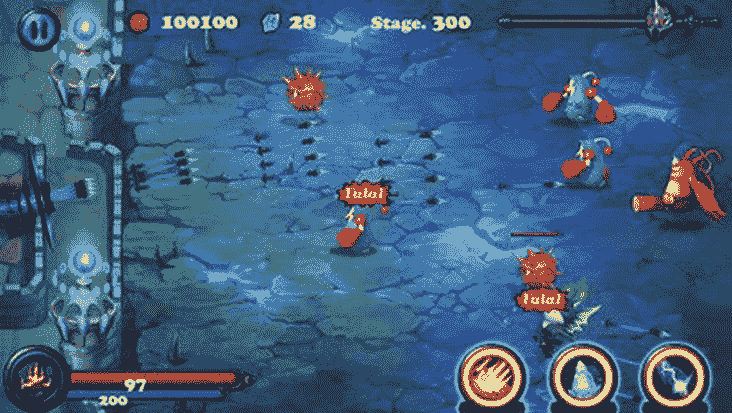

[图 3-9。](#_Fig9)防御者，由 DroidHen

*防御者*只有一个等级，但是它把坏人混在一起进行一波又一波的攻击。就好像你没有注意到它只有一个等级，因为它看起来很漂亮，会让你把更多的注意力放在坏人、你的武器和你的法术上。总的来说，这应该是一个小开发团队在合理的时间内开发出的游戏类型的好灵感，一个休闲玩家会喜欢的游戏。

社交游戏

你不会以为我们会跳过社交游戏吧？如果有什么不同的话，“社交”这个词是我们现代技术集体中最大的热门话题(也是最大的赚钱机器之一)。什么是社交游戏？在游戏中，你可以与朋友和熟人分享经验，通常以病毒式反馈循环的方式相互交流。这是惊人的强大，如果做得好，它可以滚雪球般变成雪崩式的成功。

Zynga 的 *Words with Friends* (见[图 3-10](#Fig10) )将回合制游戏添加到已经建立的基于磁贴的单词创建类型中。《T4》与朋友的对话的真正创新之处在于整合了聊天和多个同时进行的游戏。你可以同时玩很多游戏，这样就不用等待一个游戏了。一篇著名的评论(由约翰·梅耶撰写)称，“‘和朋友聊天’应用是新的 Twitter。”这很好地概括了 Zynga 如何很好地利用社交空间，并将其与一款非常容易上手的游戏相结合。

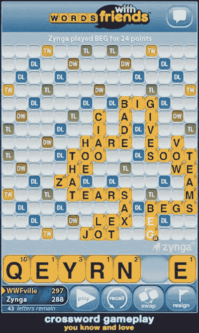

[图 3-10。Zynga 的《与朋友的话》](#_Fig10)

*画东西*(见[图 3-11](#Fig11) )，由 OMGPOP 出品，是一款让玩家一笔一划猜测某人在画什么的游戏。这不仅很有趣，而且其他玩家也将自己的作品提交给朋友，这是众包内容的神奇之处。 *Draw Something* 乍一看像是一个基本的手指绘画应用，但仅仅几分钟后，游戏的精髓就真正显现出来了，因为你想立即提交你的猜测，猜测另一个，然后画出你自己的，并让你的朋友一起分享乐趣。

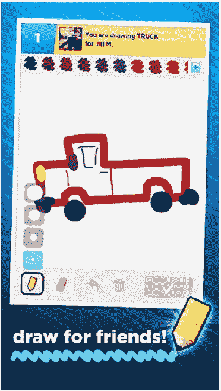

[图 3-11。](#_Fig11)画点东西，由 OMGPOP

超越流派

许多新游戏、创意、流派和应用一开始看起来并不是游戏，但它们确实是。因此，当进入 Google Play 时，很难真正明确指出现在有什么创新。我们见过这样的游戏，其中平板电脑被用作游戏主机，然后连接到电视，电视又通过蓝牙连接到多个 Android 手机，每个手机都被用作控制器。休闲、社交游戏已经做得很好了，许多在苹果平台上开始的热门游戏现在都移植到了 Android 上。一切可能的都已经做了吗？不可能！对于那些愿意冒险尝试一些新游戏创意的人来说，总会有尚未开发的市场和游戏创意。硬件变得越来越快，这开启了全新的可能性领域，以前由于缺乏 CPU 马力，这些可能性是不可行的。

所以，现在你已经知道 Android 上已经有什么可用的了，我们建议你启动 Google Play 应用，看看之前展示的一些游戏。注意它们的结构(例如，哪些屏幕通向其他哪些屏幕，哪些按钮做什么，游戏元素如何相互交互等等)。用分析的心态玩游戏，实际上可以获得对这些事情的感觉。暂且抛开娱乐因素，专心解构游戏。一旦你完成了，回来继续读下去。我们要在纸上设计一个非常简单的游戏。

游戏设计:笔比代码更强大

正如我们前面所说的，启动 IDE 并拼凑出一个不错的技术演示是很诱人的。如果你想建立实验游戏机制的原型，看看它们是否真的有效，这是可以的。然而，一旦你这样做了，就扔掉原型。拿起一支笔和一些纸，坐在一把舒适的椅子上，仔细思考你的游戏的所有高级方面。先不要专注于技术细节，你以后会做的。现在，你想专注于设计游戏的用户体验。做到这一点的最好方法是画出以下内容:

*   核心游戏机制，包括关卡概念(如果适用的话)
*   主要人物的粗略背景故事
*   一系列的物品，能量或者其他可以改变角色，机械或者环境的东西
*   基于背景故事和人物的图形风格草图
*   所有相关屏幕的草图，屏幕之间的转换图，以及转换触发器(例如，游戏结束状态)

如果你看过目录，你就会知道我们将在 Android 上实现 *Snake* 。 *《蛇》*是手机市场上最受欢迎的游戏之一。如果你还不知道*蛇*，在继续阅读之前，在网上查一下。与此同时，我们将在这里等着。。。

欢迎回来。所以，现在你知道 *Snake* 是关于什么的了，让我们假装是我们自己想出了这个主意，并开始为它设计。让我们从游戏机制开始。

核心游戏机制

在我们开始之前，这里有一份我们需要的清单:

*   一把剪刀
*   用来写字的东西
*   很多纸

在我们游戏设计的这个阶段，一切都是移动的目标。我们建议你用纸创建基本的构建模块，并在桌子上重新排列它们，直到它们合适为止，而不是用 Paint、Gimp 或 Photoshop 精心制作精美的图像。你可以很容易地从物理上改变事情，而不必应付一个愚蠢的鼠标。一旦你确定了你的纸张设计，你就可以拍照或扫描设计供将来参考。让我们从创建核心游戏屏幕的那些基本块开始。图 3-12 向你展示了我们的核心游戏机制需要什么。

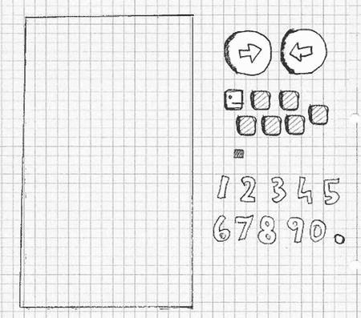

[图 3-12。](#_Fig12)游戏设计积木

最左边的矩形是我们的屏幕，大约是 Nexus One 屏幕的大小。这是我们放置其他元素的地方。下一个构建模块是两个箭头按钮，我们将使用它们来控制蛇。最后，还有蛇头、几条尾巴和一块它可以吃的东西。我们还写了一些数字，并把它们剪了下来。这些将用于显示分数。[图 3-13](#Fig13) 展示了我们对初始竞争环境的愿景。

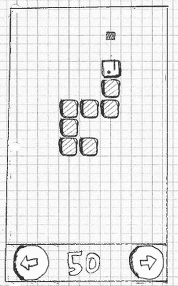

[图 3-13。](#_Fig13)最初的比赛场地

让我们来定义游戏机制:

*   这条蛇沿着它的头指向的方向前进，拖着它的尾巴。头部和尾部由大小相等的部分组成，在视觉上没有太大的区别。
*   如果蛇走出屏幕边界，它会从另一边重新进入屏幕。
*   如果按下右箭头或左箭头按钮，蛇将顺时针(右)或逆时针(左)旋转 90 度。
*   如果蛇撞到自己(比如尾巴的一部分)，游戏就结束了。
*   如果蛇用头撞上了一个棋子，这个棋子就消失了，分数增加 10 分，场上出现一个新的棋子，位置不是蛇自己占据的。蛇还长了一个尾巴。新的尾巴部分附在蛇的末端。

对于这样一个简单的游戏来说，这是一个相当复杂的描述。请注意，我们按照复杂性升序对项目进行了排序。当蛇在游戏场上吃掉一块时游戏的行为可能是最复杂的。当然，更复杂的游戏无法用如此简洁的方式描述。通常，您会将这些拆分成单独的部分，并单独设计每个部分，在流程结束时的最终合并步骤中将它们连接起来。

最后一个游戏力学项目有这样的暗示:游戏最终会结束，因为屏幕上的所有空间都将被蛇用尽。

既然我们完全原创的游戏力学想法看起来不错，让我们试着为它想出一个背景故事。

一个故事和一种艺术风格

虽然有僵尸、宇宙飞船、矮人和大量爆炸的史诗故事会很有趣，但我们必须意识到我们的资源是有限的。我们的绘图技巧，如[图 3-12](#Fig12) 所示，有些欠缺。如果我们的生命取决于僵尸，我们就不能画它。所以我们做了任何有自尊的独立游戏开发者都会做的事情:诉诸涂鸦风格，并相应地调整设置。

进入诺姆先生的世界。Nom 先生是一条纸蛇，总是渴望吃掉从不明来源掉落在他的纸地上的墨滴。Nom 先生非常自私，他只有一个不那么高尚的目标:成为世界上最大的墨水纸蛇！

这个小小的背景故事让我们可以定义更多的东西:

*   艺术风格是 doodly。我们将在以后扫描我们的构建模块，并在我们的游戏中使用它们作为图形资产。
*   由于 Nom 先生是一个个人主义者，我们将稍微修改他的块状性质，给他一个适当的蛇脸。和一顶帽子。
*   可消化的部分将被转化成一组墨水污迹。
*   我们将通过让诺姆先生每次吃到墨水渍时发出咕噜声来解决游戏的音频问题。
*   与其选择“涂鸦蛇”这样无聊的标题，不如把这个游戏叫做“Nom 先生”，一个更有趣的标题。

图 3-14 显示了 Nom 先生的全盛时期，以及一些将取代原块的墨迹。我们还画了一个很棒的 Nom 先生标志，可以在整个游戏中重复使用。

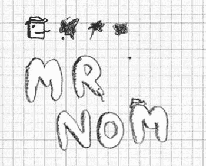

[图 3-14。](#_Fig14)Nom 先生，他的帽子，墨水渍，还有商标

屏幕和过渡

随着游戏机制、背景故事、人物和艺术风格的固定，我们现在可以设计我们的屏幕和它们之间的过渡。然而，首先重要的是要准确理解屏幕是由什么组成的:

*   屏幕是填充整个显示器的原子单位，它只负责游戏的一部分(例如，主菜单、设置菜单或动作发生的游戏屏幕)。
*   一个屏幕可以由多个组件组成(例如，按钮、控件、平视显示器或游戏世界的渲染)。
*   屏幕允许用户与屏幕的元素进行交互。这些交互可以触发屏幕转换(例如，按下主菜单上的新游戏按钮可以将当前活动的主菜单屏幕与游戏屏幕或级别选择屏幕交换)。

有了这些定义，我们就可以开动脑筋，设计 Nom 先生游戏的所有屏幕。

我们的游戏首先呈现给玩家的是主菜单屏幕。什么是好的主菜单屏幕？

*   原则上，显示我们游戏的名字是一个好主意，所以我们会放上 Nom 先生的标志。
*   为了让事情看起来更一致，我们还需要一个背景。为此，我们将重复使用运动场背景。
*   玩家通常会想玩这个游戏，所以让我们加入一个游戏按钮。这将是我们的第一个交互组件。
*   Players want to keep track of their progress and awesomeness, so we’ll also add a high-score button as shown in [Figure 3-15](#Fig15), another interactive component.

    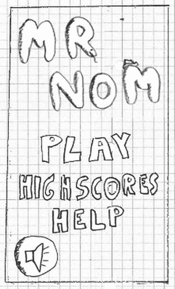

    [图 3-15。](#_Fig15)主菜单屏幕

*   可能有人不知道蛇。让我们以帮助按钮的形式给他们一些帮助，帮助按钮将转换到帮助屏幕。
*   虽然我们的音效设计会很可爱，但有些玩家可能还是喜欢安静地玩。给他们一个象征性的切换按钮来启用和禁用声音就可以了。

我们实际上如何在屏幕上布置这些组件是一个品味问题。你可以开始研究计算机科学的一个分支，叫做人机界面(HCI ),以获得关于如何向用户展示你的应用的最新科学观点。不过，对 Nom 先生来说，这可能有点过头了。我们采用了图 3-15 所示的简单设计。

请注意，所有这些元素(徽标、菜单按钮等)都是独立的图像。

从主菜单屏幕开始，我们获得了一个直接的优势:我们可以直接从交互组件中获得更多的屏幕。在 Nom 先生的例子中，我们需要一个游戏屏幕、一个高分屏幕和一个帮助屏幕。我们不包括设置屏幕，因为唯一的设置(声音)已经出现在主菜单屏幕上。

让我们暂时忽略游戏屏幕，先把注意力集中在高分屏幕上。我们决定高分将存储在本地的 Nom 先生，所以我们将只跟踪单个玩家的成就。我们还决定只记录五个最高分。因此，高分屏幕将看起来像[图 3-16](#Fig16) ，在顶部显示“高分”文本，随后是五个最高分和一个带箭头的按钮，指示您可以过渡回某个内容。我们将再次重复使用运动场的背景，因为我们喜欢它便宜。

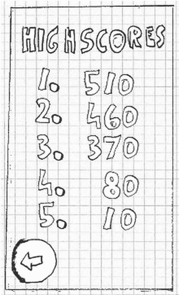

[图 3-16。](#_Fig16)高分屏幕

接下来是帮助屏幕。它将告知玩家背景故事和游戏机制。所有这些信息在一个屏幕上显示有点太多了。因此，我们将帮助屏幕分成多个屏幕。这些屏幕中的每一个都将向用户呈现一条必不可少的信息:Nom 先生是谁，他想要什么，如何控制 Nom 先生让他吃墨迹，以及 Nom 先生不喜欢什么(即吃自己)。总共有三个帮助屏幕，如图[图 3-17](#Fig17) 所示。请注意，我们在每个屏幕上添加了一个按钮，以表明还有更多信息需要阅读。我们一会儿就把这些屏幕连接起来。

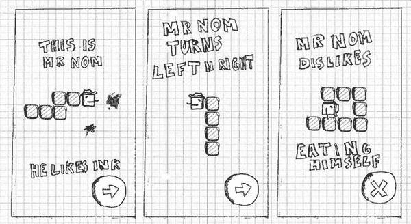

[图 3-17。](#_Fig17)帮助屏幕

最后，是我们的游戏屏幕，我们已经看到了。不过，我们忽略了一些细节。第一，游戏不应该马上开始；我们应该给运动员一些时间准备。因此，屏幕将开始请求触摸屏幕以开始咀嚼。这并不保证单独的屏幕；我们将直接在游戏屏幕中实现初始暂停。

说到暂停，我们还将添加一个按钮，允许用户暂停游戏。一旦暂停，我们还需要给用户一个恢复游戏的方法。在这种情况下，我们将只显示一个大的 Resume 按钮。在暂停状态下，我们还将显示另一个按钮，允许用户返回主菜单屏幕。一个额外的退出按钮让用户返回到主菜单。

万一 Nom 先生咬到自己的尾巴，我们需要通知玩家游戏结束了。我们可以实现一个单独的游戏结束屏幕，或者我们可以留在游戏屏幕内，只覆盖一个大的“游戏结束”信息。在这种情况下，我们将选择后者。为了使事情圆满，我们还将显示玩家获得的分数，以及一个返回主菜单的按钮。

把游戏屏幕的这些不同状态想象成子屏幕。我们有四个子屏幕:初始就绪状态、正常游戏状态、暂停状态和游戏结束状态。图 3-18 显示了这些子屏幕。

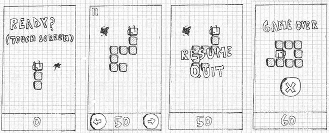

[图 3-18。](#_Fig18)游戏画面及其四种不同状态

现在是时候把屏幕连在一起了。每个屏幕都有一些交互组件，用于转换到另一个屏幕。

*   从主菜单屏幕，我们可以通过相应的按钮进入游戏屏幕、高分屏幕和帮助屏幕。
*   从游戏屏幕，我们可以通过暂停状态的按钮或游戏结束状态的按钮返回到主菜单屏幕。
*   从高分屏幕，我们可以回到主菜单屏幕。
*   从第一个帮助屏幕，我们可以转到第二个帮助屏幕；从第二个到第三个；从第三个到第四个；从第四个开始，我们将返回到主菜单屏幕。

这就是我们所有的转变！看起来没那么糟，是吧？[图 3-19](#Fig19) 直观地总结了所有的转换，箭头从每个交互组件指向目标屏幕。我们还放入了组成屏幕的所有元素。


[图 3-19。](#_Fig19)所有设计元素和过渡

我们现在已经完成了第一个完整的游戏设计。剩下的就是实现了。我们如何把这个设计变成一个可执行的游戏？

**注意**我们刚刚使用的游戏设计方法对于小游戏来说是很好的。这本书叫做*开始安卓游戏*，所以这是一个合适的方法论。对于较大的项目，你最有可能在一个团队中工作，每个团队成员专攻一个方面。虽然您仍然可以在该上下文中应用这里描述的方法，但是您可能需要对它进行一点调整，以适应不同的环境。您还将更加迭代地工作，不断完善您的设计。

代码:本质细节

这里还有一个先有鸡还是先有蛋的情况:我们只想了解与游戏编程相关的 Android APIs。然而，我们仍然不知道如何实际编程一个游戏。我们有一个如何设计的想法，但将其转化为可执行文件对我们来说仍然是巫术。在下面的小节中，我们想给你一个游戏元素的概述。我们将查看一些接口的伪代码，稍后我们将使用 Android 提供的功能来实现这些代码。接口令人敬畏有两个原因:它们允许我们专注于语义而不需要知道实现细节，并且它们允许我们稍后交换实现(例如，代替使用 2D CPU 渲染，我们可以利用 OpenGL ES 在屏幕上显示 Nom 先生)。

每一个游戏都需要一个基本的框架来抽象和减轻与底层操作系统通信的痛苦。通常这被分成如下模块:

*   *应用和窗口管理*:这是负责创建一个窗口，并处理像关闭窗口或暂停/恢复 Android 中的应用这样的事情。
*   *输入*:这与窗口管理模块有关，它跟踪用户输入(即触摸事件、击键、外围和加速度计读数)。
*   文件输入/输出(File I/O):这允许我们从磁盘中获取我们的资产字节到我们的程序中。
*   *图形*:这可能是除了实际游戏之外最复杂的模块了。它负责加载图形并将它们绘制在屏幕上。
*   *音频*:这个模块负责加载和播放一切会撞击我们耳朵的东西。
*   游戏框架(Game framework):这将上述所有内容联系在一起，为编写游戏提供了一个易于使用的基础。

每个模块都由一个或多个接口组成。每个接口至少有一个具体的实现，它基于底层平台(在我们的例子中是 Android)提供的东西应用接口的语义。

**注意**是的，我们故意在前面的列表中遗漏了网络。我们不会在本书中实现多人游戏。这是一个相当高级的话题，取决于游戏的类型。如果你对这个话题感兴趣，你可以在网上找到一系列的教程。是一个开始的好地方。)

在下面的讨论中，我们将尽可能地与平台无关。这些概念在所有平台上都是相同的。

应用和窗口管理

游戏就像任何其他有用户界面的计算机程序一样。它包含在某种窗口中(如果底层操作系统的 UI 范例是基于窗口的，这是所有主流操作系统的情况)。窗口作为一个容器，我们基本上认为它是一个画布，我们从中绘制游戏内容。

除了触摸客户区或按键之外，大多数操作系统允许用户以一种特殊的方式与窗口交互。在桌面系统上，你通常可以拖动窗口，调整它的大小，或者最小化到某种任务栏。在 Android 中，调整大小被适应方向变化所取代，最小化类似于通过按下 home 键或对来电的反应将应用放在后台。

应用和窗口管理模块还负责实际设置窗口，并确保它由单个 UI 组件填充，我们稍后可以渲染该组件，该组件以触摸或按键的形式接收来自用户的输入。UI 组件可以通过 CPU 呈现，也可以是硬件加速的，就像 OpenGL ES 一样。

应用和窗口管理模块没有一组具体的接口。稍后我们会将它与游戏框架合并。我们必须记住的是我们必须管理的应用状态和窗口事件:

*   *Create* :当窗口(以及应用)启动时调用一次
*   *暂停*:当应用被某种机制暂停时调用
*   *Resume* :当应用恢复并且窗口再次在前台时调用

**注意**此时，一些安卓迷可能会翻白眼。为什么只使用单一窗口(Android speak 中的*活动*)？为什么不在游戏中使用一个以上的 UI 小部件呢——比如说，实现我们的游戏可能需要的复杂 UI？主要原因是我们想要完全控制我们游戏的外观和感觉。它还允许我们专注于 Android 游戏编程，而不是 Android UI 编程，关于这个主题有更好的书籍——例如，马克·墨菲的优秀*开始 Android 3* (Apress，2011)。

投入

用户肯定会想以某种方式与我们的游戏互动。这就是输入模块的用武之地。在大多数操作系统上，诸如触摸屏幕或按键之类的输入事件被分派到当前聚焦的窗口。然后，窗口将进一步将事件分派给具有焦点的 UI 组件。调度过程通常对我们是透明的；我们唯一关心的是从聚焦的 UI 组件中获取事件。操作系统的 UI APIs 提供了一种挂钩到事件调度系统的机制，以便我们可以轻松地注册和记录事件。这种事件的挂钩和记录是输入模块的主要任务。

我们可以用记录的信息做什么？有两种操作方式:

*   *轮询*:通过轮询，我们只检查输入设备的当前状态。当前检查和上一次检查之间的任何状态都将丢失。例如，这种输入处理方式适用于检查用户是否触摸了特定的按钮。它不适合跟踪文本输入，因为键事件的顺序丢失了。
*   基于事件的处理(Event-based handling):这为我们提供了自上次检查以来发生的事件的完整历史记录。它是执行文本输入或任何其他依赖于事件顺序的任务的合适机制。检测手指第一次接触屏幕或抬起的时间也很有用。

我们想要处理什么输入设备？在 Android 上，我们有三种主要的输入方式:触摸屏、键盘/轨迹球和加速度计。前两种方法适用于轮询和基于事件的处理。加速度计通常只是被轮询。触摸屏可以产生三个事件:

*   *向下触摸*:手指触摸屏幕时会发生这种情况。
*   *触摸拖动*:手指在屏幕上拖动时会出现这种情况。在拖拽之前，总会有一个向下的事件。
*   *Touch up* :手指从屏幕上抬起时会出现这种情况。

每个触摸事件都有附加信息:相对于 UI 组件原点的位置，以及在多点触摸环境中用于识别和跟踪不同手指的指针索引。

键盘可以产生两种类型的事件:

*   *按键按下*:这种情况发生在按键被按下的时候。
*   *向上键*:当一个键被抬起时会发生这种情况。此事件之前总是有一个按键事件。

关键事件也携带附加信息。按键事件存储被按下的按键的代码。按键事件存储按键的代码和实际的 Unicode 字符。按键代码和按键事件生成的 Unicode 字符是有区别的。在后一种情况下，还会考虑其他键的状态，例如 Shift 键。例如，通过这种方式，我们可以在按键事件中获得大写和小写字母。对于按键事件，我们只知道某个键被按下了；我们不知道按键实际上会产生哪个字符。

寻求使用自定义 usb 硬件(包括操纵杆、模拟控制器、特殊键盘、触摸板或其他 android 支持的外围设备)的开发人员可以通过使用 android.hardware.usb 包 API 来实现这一点，这些 API 在 API level 12 (Android 3.1)中引入，并通过 com.android.future.usb 包向后移植到 Android 2 . 3 . 4。USB API 使 Android 设备能够在主机模式下运行，这允许外围设备连接到 Android 设备并由其使用，或者在附件模式下运行，这允许设备作为另一个 USB 主机的附件。这些 API 不是初学者的材料，因为设备访问级别非常低，为 USB 附件提供数据流 I/O，但重要的是要注意功能确实存在。如果你的游戏设计围绕一个特定的 USB 附件，你肯定会想为该附件开发一个通信模块，并使用它制作原型。

最后，还有加速度计。尽管几乎所有的手机和平板电脑都将加速度计作为标准硬件，但包括机顶盒在内的许多新设备可能没有加速度计，因此请始终计划使用多种输入模式，这一点很重要。

为了使用加速度计，我们将总是轮询加速度计的状态。加速度计报告地球重力在加速度计三个轴之一上施加的加速度。轴被称为 x、y 和 z。[图 3-20](#Fig20) 描述了每个轴的方向。每个轴上的加速度用米每秒平方(m/s <sup>2</sup> 表示。从物理课上，我们知道一个物体在地球上自由落体时会以大约 9.8 米/秒 <sup>2</sup> 的速度加速。其他星球引力不同，所以加速度常数也不同。为了简单起见，我们在这里只讨论地球。当一个轴指向远离地心的方向时，最大的加速度作用在它上面。如果一个轴指向地球的中心，我们得到一个负的最大加速度。例如，如果你在纵向模式下将手机直立，那么 y 轴将报告 9.8 米/秒的加速度 <sup>2</sup> 。在[图 3-20](#Fig20) 中，z 轴将报告加速度为 9.8 米/秒 <sup>2</sup> ，x 轴和 y 轴将报告加速度为零。

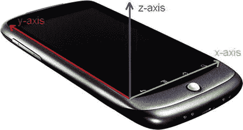

[图 3-20。](#_Fig20)安卓手机上的加速度计轴。z 轴指向手机之外

现在，让我们定义一个接口，它给我们提供对触摸屏、键盘和加速度计的轮询访问，也给我们提供对触摸屏和键盘的基于事件的访问(见[清单 3-1](#list1) )。

***[清单 3-1。](#_list1)*** *输入界面以及 KeyEvent 和 TouchEvent 类*

```java
package com.badlogic.androidgames.framework;

import java.util.List;

public interface Input {
    public static class KeyEvent {
        public static final int *KEY_DOWN* = 0;
        public static final int *KEY_UP* = 1;

        public int type;
        public int keyCode;
        public char keyChar;
    }

    public static class TouchEvent {
        public static final int *TOUCH_DOWN* = 0;
        public static final int *TOUCH_UP* = 1;
        public static final int *TOUCH_DRAGGED* = 2;

        public int type;
        public int x, y;
        public int pointer;
    }

    public boolean isKeyPressed(int keyCode);

    public boolean isTouchDown(int pointer);

    public int getTouchX(int pointer);

    public int getTouchY(int pointer);

    public float getAccelX();

    public float getAccelY();

    public float getAccelZ();

    public List<KeyEvent> getKeyEvents();

    public List<TouchEvent> getTouchEvents();
}
```

我们的定义由两个类开始，KeyEvent 和 TouchEvent。KeyEvent 类定义了编码 KeyEvent 类型的常量；TouchEvent 类也是如此。如果事件的类型是 KEY_UP，则 KeyEvent 实例记录其类型、键的代码和 Unicode 字符。

TouchEvent 代码类似，它保存 TouchEvent 的类型、手指相对于 UI 组件原点的位置以及触摸屏驱动程序赋予手指的指针 ID。只要手指在屏幕上，该手指的指针 ID 就会保持不变。如果两个手指放下，手指 0 抬起，那么手指 1 只要接触屏幕就保持其 ID。新手指将获得第一个空闲 ID，在本例中为 0。指针 id 通常是按顺序分配的，但并不保证会这样。例如，索尼 Xperia Play 使用 15 个 id，并以循环方式将它们分配给 touches。不要在代码中对新指针的 ID 做任何假设——只能使用索引读取指针的 ID 并引用它，直到指针被抬起。

接下来是输入接口的轮询方法，这应该是不言自明的。Input.isKeyPressed()接受一个键码，并返回相应的键当前是否被按下。Input.isTouchDown()、Input.getTouchX()和 Input.getTouchY()返回给定指针是否按下，以及其当前的 x 和 y 坐标。请注意，如果相应的指针没有实际接触屏幕，坐标将是未定义的。

Input.getAccelX()、Input.getAccelY()和 Input.getAccelZ()返回每个加速度计轴各自的加速度值。

最后两种方法用于基于事件的处理。它们返回自我们上次调用这些方法以来记录的 KeyEvent 和 TouchEvent 实例。事件根据发生的时间进行排序，最新的事件位于列表的末尾。

有了这个简单的接口和这些助手类，我们可以满足所有的输入需求。让我们继续处理文件。

**注意**虽然带有公共成员的可变类令人厌恶，但我们可以在这种情况下摆脱它们，原因有两个:Dalvik 在调用方法(在这种情况下是 getters)时仍然很慢，事件类的可变性对输入实现的内部工作没有影响。请注意，这通常是不好的风格，但是出于性能原因，我们偶尔会采用这种快捷方式。

文件输入输出

读写文件对于我们的游戏开发工作来说是非常重要的。假设我们在 Java 领域，我们主要关心的是创建 InputStream 和 OutputStream 实例，这是从特定文件读取数据和向特定文件写入数据的标准 Java 机制。在我们的例子中，我们主要关心的是读取游戏中打包的文件，比如关卡文件、图像和音频文件。写文件是我们很少做的事情。通常，如果我们想保持高分或游戏设置，或者保存一个游戏状态，以便用户可以从他们离开的地方继续，我们就只写文件。

我们想要尽可能简单的文件访问机制。清单 3-2 显示了我们对简单接口的建议。

***[清单 3-2。](#_list2)*** *文件 I/O 接口*

```java
package com.badlogic.androidgames.framework;

import java.io.IOException;
import java.io.InputStream;
import java.io.OutputStream;

public interface FileIO {
    public InputStream readAsset(String fileName)throws IOException;

    public InputStream readFile(String fileName)throws IOException;

    public OutputStream writeFile(String fileName)throws IOException;
}
```

那是相当精简和卑鄙的。我们只是指定一个文件名，然后得到一个流作为回报。正如我们在 Java 中通常做的那样，我们将抛出一个 IOException 以防出错。当然，我们在哪里读写文件取决于实现。资产将从我们的应用的 APK 文件中读取，文件将从 SD 卡(也称为外部存储)中读取和写入。

返回的 InputStreams 和 OutputStreams 是普通的 Java 流。当然，一旦我们用完它们，我们必须把它们关上。

声音的

虽然音频编程是一个相当复杂的话题，但我们可以用一个非常简单的抽象来摆脱它。我们不会做任何高级音频处理；我们只是回放从文件中加载的声音效果和音乐，就像我们在图形模块中加载位图一样。

不过，在我们深入模块接口之前，让我们停下来，了解一下声音实际上是什么，以及它是如何以数字形式表示的。

声音的物理学

声音通常被建模为在空气或水等介质中传播的一组波。波不是实际的物理对象，而是分子在介质中的运动。想象一个小池塘，你往里面扔一块石头。当石头撞击池塘表面时，它将推开池塘内的大量水分子，这些被推开的分子将把它们的能量转移给它们的邻居，邻居也将开始移动和推动。最终，你会看到圆形的波浪从石头击中池塘的地方出现。

声音产生的时候也会发生类似的情况。你得到的不是圆周运动，而是球形运动。从你童年可能进行过的高度科学的实验中你可能知道，水波是可以相互作用的；它们可以相互抵消或相互加强。声波也是如此。当你听音乐时，环境中的所有声波结合起来形成你听到的音调和旋律。声音的音量取决于移动和推动的分子对其邻居并最终对你的耳朵施加了多少能量。

录制和回放

录制和回放音频的原理在理论上非常简单。为了记录，我们记录下形成声波的分子对空间中的某个区域施加一定压力的时间点。回放这些数据仅仅是让扬声器周围的空气分子像我们记录时一样摆动和移动。

在实践中，当然要复杂一点。音频通常以两种方式录制:模拟或数字。在这两种情况下，声波都被某种麦克风记录下来，麦克风通常由一层薄膜组成，将分子的推动转化为某种信号。信号的处理和存储方式决定了模拟录音和数字录音的区别。我们正在数字化工作，所以让我们看看那个案例。

以数字方式记录音频意味着以离散的时间步长测量并存储麦克风膜片的状态。根据周围分子的推动，膜可以相对于中性状态向内或向外推动。这个过程被称为*采样*，因为我们在离散的时间点采集膜状态样本。我们每单位时间内采集的样本数称为*采样率*。通常时间单位以秒为单位，单位称为赫兹(Hz)。每秒采样越多，音频质量就越高。CD 以 44，100Hz 或 44.1KHz 的采样率回放。例如，当通过电话线传输语音时，采样率较低(在这种情况下通常为 8KHz)。

采样率只是决定录音质量的一个因素。我们存储每个膜状态样本的方式也起作用，它也受数字化的影响。让我们回忆一下膜的实际状态是什么:它是膜离中性状态的距离。因为膜是被向内推还是向外推是有区别的，所以我们记录了带符号的距离。因此，特定时间步的膜状态是单个负数或正数。我们可以用多种方式存储这个有符号数:作为有符号的 8 位、16 位或 32 位整数，作为 32 位浮点数，甚至作为 64 位浮点数。每种数据类型都有有限的精度。一个 8 位有符号整数可以存储 127 个正距离值和 128 个负距离值。32 位整数提供了更高的分辨率。当存储为浮点型时，膜状态通常归一化为 1 到 1 之间的范围。最大的正值和最小的负值代表了膜离开其中性状态的最远距离。膜状态也被称为*振幅*。它代表撞击它的声音的响度。

使用单个麦克风，我们只能录制单声道声音，这将丢失所有空间信息。通过两个麦克风，我们可以测量空间中不同位置的声音，从而获得所谓的*立体声*。例如，您可以将一个麦克风放在发声物体的左侧，另一个放在右侧，从而获得立体声。当声音通过两个扬声器同时播放时，我们可以合理地再现音频的空间分量。但这也意味着当存储立体声音频时，我们需要存储两倍数量的样本。

回放最终是一件简单的事情。一旦我们获得了数字形式的音频样本，并且具有特定的采样速率和数据类型，我们就可以将这些数据发送到音频处理单元，它会将信息转换为信号，供连接的扬声器使用。扬声器解释这个信号，并将其转化为薄膜的振动，这又会导致周围的空气分子移动并产生声波。这正是为记录所做的，只是颠倒了！

音频质量和压缩

哇，好多理论。我们为什么关心？如果您注意了，现在您可以根据采样率和用于存储每个样本的数据类型来判断音频文件是否是高质量的。采样率越高，数据类型精度越高，音频质量就越好。然而，这也意味着我们需要更多的存储空间来存放音频信号。

想象一下，我们以 60 秒的长度录制相同的声音，但我们录制了两次:一次是以 8KHz 的采样率、每样本 8 位，另一次是以 44KHz 的采样率、16 位精度。我们需要多少内存来存储每个声音？在第一种情况下，每个样本需要 1 个字节。将其乘以 8,000Hz 的采样率，我们需要每秒 8000 字节。对于我们完整的 60 秒录音，这是 480，000 字节，或大约半兆字节(MB)。我们更高质量的录音需要更多的内存:每个样本 2 字节，每秒 44，000 字节的 2 倍。也就是每秒 88000 字节。将此乘以 60 秒，我们得到 5，280，000 字节，或 5MB 多一点。你通常的 3 分钟流行歌曲会占用超过 15MB 的质量，这只是一个单声道录音。对于立体声录音，你需要两倍的内存。对于一首愚蠢的歌来说相当多的字节！

许多聪明人想出了减少录音所需字节数的方法。他们发明了相当复杂的心理声学压缩算法，分析未压缩的音频记录，并输出较小的压缩版本。压缩通常是*有损*，意味着原始音频的一些次要部分被省略。当你播放 MP3 或 OGGs 时，你实际上是在听压缩的有损音频。因此，使用 MP3 或 OGG 等格式将有助于我们减少存储音频所需的磁盘空间。

回放压缩文件的音频怎么样？虽然存在用于各种压缩音频格式的专用解码硬件，但是普通的音频硬件通常只能处理未压缩的样本。在实际向声卡输入样本之前，我们必须先读入样本并解压缩。我们可以这样做一次，将所有未压缩的音频样本存储在内存中，或者只在需要时从音频文件的分区中流过。

在实践中

您已经看到，即使是 3 分钟的歌曲也会占用大量内存。因此，当我们播放游戏音乐时，我们会实时输入音频样本，而不是将所有音频样本预加载到内存中。通常，我们只有一个音乐流在播放，所以我们只需访问磁盘一次。

对于短暂的声音效果，如爆炸或枪声，情况略有不同。我们经常想要同时播放多次声音效果。对于声音效果的每个实例，从磁盘流式传输音频样本不是一个好主意。不过，我们很幸运，因为短音不会占用太多内存。因此，我们将把音效的所有样本读入内存，这样我们就可以直接同时播放它们。

我们有以下要求:

*   我们需要一种方法来加载音频文件，以便进行流式播放和从内存中播放。
*   我们需要一种方法来控制流式音频的回放。
*   我们需要一种方法来控制满载音频的回放。

这直接转化为音频、音乐和声音接口(分别显示在[清单 3-3](#list3) 到 [3-5、](#list5)中)。

***[清单 3-3。](#_list3)*** *音频接口*

```java
package com.badlogic.androidgames.framework;

public interface Audio {
    public Music newMusic(String filename);

    public Sound newSound(String filename);
}
```

音频接口是我们创建新的音乐和声音实例的方式。一个音乐实例代表一个流式音频文件。一个声音实例代表一个简短的声音效果，我们将它完全保存在内存中。Audio.newMusic()和 Audio.newSound()方法都将文件名作为参数，并在加载过程失败时抛出 IOException(例如，当指定的文件不存在或损坏时)。文件名指的是我们的应用的 APK 文件中的资产文件。

***清单 3-4。*** *音乐界面*

```java
package com.badlogic.androidgames.framework;

public interface Music {
    public void play();

    public void stop();

    public void pause();

    public void setLooping(boolean looping);

    public void setVolume(float volume);

    public boolean isPlaying();

    public boolean isStopped();

    public boolean isLooping();

    public void dispose();
}
```

音乐界面稍微复杂一点。它具有开始播放音乐流、暂停和停止音乐流的方法，并将其设置为循环播放，这意味着当它到达音频文件的结尾时，它将自动从头开始播放。此外，我们可以将音量设置为 0(静音)到 1(最大音量)范围内的浮动值。还提供了一些 getter 方法，允许我们轮询 Music 实例的当前状态。一旦我们不再需要音乐实例，我们就必须处理它。这将关闭所有系统资源，例如音频流所来自的文件。

***[清单 3-5。](#_list5)*** *声音界面*

```java
package com.badlogic.androidgames.framework;

public interface Sound {
    public void play(float volume);
,,,
    public void dispose();
}
```

声音界面更简单。我们需要做的就是调用它的 play()方法，该方法再次接受一个 float 参数来指定音量。我们可以随时调用 play()方法(例如，当 Nom 先生吃了一个墨迹)。一旦我们不再需要 Sound 实例，我们就必须释放它来释放样本使用的内存，以及其他可能相关的系统资源。

**注意**虽然我们在本章中讲述了很多内容，但关于音频编程还有很多内容需要学习。我们简化了一些内容，以保持这一部分简洁明了。例如，通常你不会线性地指定音量。在我们的背景下，可以忽略这个小细节。只是要意识到还有更多！

制图法

我们游戏框架核心的最后一个模块是图形模块。你可能已经猜到了，它将负责把图像(也称为*位图*)绘制到我们的屏幕上。这听起来可能很容易，但如果你想要高性能的图形，你至少要知道图形编程的基本知识。让我们从 2D 图形的基础开始。

我们需要问的第一个问题是这样的:图像到底是如何输出到我的显示器上的？答案相当复杂，我们不一定需要知道所有的细节。我们将快速回顾一下我们的计算机和显示器内部发生了什么。

栅格、像素和帧缓冲区

今天的显示器是基于光栅的。*光栅*是一个所谓图片元素的二维网格。你可能知道它们是*像素*，我们将在随后的文本中这样称呼它们。光栅网格的宽度和高度是有限的，我们通常用每行和每列的像素数来表示。如果你觉得勇敢，你可以打开你的电脑，试着在你的显示器上辨认出单个的像素。请注意，我们对您的眼睛造成的任何损害概不负责。

一个像素有两个属性:在网格中的位置和颜色。像素的位置以离散坐标系中的二维坐标给出。 *离散*是指一个坐标总是在一个整数位置。坐标是在施加于网格上的欧几里得坐标系中定义的。坐标系的原点是网格的左上角。正 x 轴指向右侧，y 轴指向下方。最后一项是最让人困惑的。我们一会儿会回来。出现这种情况的原因很简单。

忽略愚蠢的 y 轴，我们可以看到，由于我们坐标的离散性，原点与网格中左上角的像素重合，位于(0，0)。原点像素右边的像素位于(1，0)，原点像素下面的像素位于(0，1)，依此类推(见[图 3-21](#Fig21) 左侧)。显示器的光栅网格是有限的，因此有意义的坐标数量有限。负坐标在屏幕外。大于或等于栅格宽度或高度的坐标也在屏幕之外。请注意，最大的 x 坐标是栅格的宽度减 1，最大的 y 坐标是栅格的高度减 1。这是因为原点与左上角的像素重合。一个接一个的错误是图形编程中常见的挫折来源。


[图 3-21。](#_Fig21)显示光栅网格和 VRAM，过于简化

显示器从图形处理器接收恒定的信息流。它按照控制屏幕绘制的程序或操作系统的指定，对显示器光栅中每个像素的颜色进行编码。显示器将每秒刷新其状态几十次。确切的速率称为*刷新率*。它用赫兹表示。液晶显示器的刷新率通常为每秒 60Hz 阴极射线管(CRT)显示器和等离子显示器通常具有更高的刷新率。

图形处理器可以访问一个称为视频随机存取存储器(VRAM)的特殊内存区域。在 VRAM 中，有一个保留区域用于存储屏幕上显示的每个像素。这个区域通常被称为*帧缓冲区*。一幅完整的屏幕图像因此被称为一帧。对于显示器光栅网格中的每个像素，在保存像素颜色的帧缓冲区中都有相应的内存地址。当我们想改变屏幕上显示的内容时，我们只需改变 VRAM 内存区域中像素的颜色值。

现在是时候解释为什么显示器坐标系中的 y 轴指向下方了。内存，无论是 VRAM 还是普通 RAM，都是线性一维的。把它想象成一个一维数组。那么我们如何将二维像素坐标映射到一维内存地址呢？[图 3-21](#Fig21) 显示了一个相当小的 3×2 像素的显示光栅网格，以及它在 VRAM 中的表示。(我们假设 VRAM 仅由帧缓冲存储器组成。)由此，我们可以很容易地推导出下面的公式来计算一个像素在(x，y)处的内存地址:

```java
int address = x + y * rasterWidth;
```

我们也可以反过来，从地址到像素的 x 和 y 坐标:

```java
int x = address % rasterWidth;
int y = address / rasterWidth;
```

因此，由于 VRAM 中像素颜色的内存布局，y 轴指向下方。这实际上是从早期计算机图形学继承下来的遗产。监视器将更新屏幕上每个像素的颜色，从左上角开始，移动到右边，在下一行回到左边，直到它们到达屏幕的底部。将 VRAM 内容以易于将颜色信息传输到监视器的方式进行布局是很方便的。

**注意**如果我们可以完全访问帧缓冲区，我们可以使用前面的等式编写一个完整的图形库来绘制像素、线条、矩形、加载到内存的图像等等。由于各种原因，现代操作系统不允许我们直接访问帧缓冲区。相反，我们通常绘制到一个内存区域，然后由操作系统复制到实际的帧缓冲区。不过，一般概念在这种情况下也适用！如果你对如何有效地做这些低级的事情感兴趣，在网上搜索一个叫 Bresenham 的家伙和他的画线和画圆算法。

垂直同步和双缓冲

现在，如果你还记得关于刷新率的那一段，你可能已经注意到刷新率似乎相当低，我们可以比显示器刷新更快地写入帧缓冲区。这是有可能的。更糟糕的是，我们不知道显示器何时从 VRAM 获取最新的帧副本，如果我们正在画东西，这可能是一个问题。在这种情况下，显示器将显示旧帧缓冲区内容的一部分和新状态的一部分，这是不希望的情况。你可以在许多 PC 游戏中看到这种效果，它表现为撕裂(屏幕同时显示上一帧的部分和新帧的部分)。

这个问题解决方案的第一部分叫做*双缓冲*。图形处理单元(GPU)实际上管理两个帧缓冲区，而不是单个帧缓冲区:前端缓冲区和后端缓冲区。将从中提取像素颜色的前缓冲区可供显示器使用，后缓冲区可用于绘制我们的下一帧，同时显示器很高兴地从前缓冲区获取数据。当我们完成绘制当前帧时，我们告诉 GPU 将两个缓冲区相互交换，这通常意味着只交换前后缓冲区的地址。在图形编程文献和 API 文档中，您可能会发现术语*翻页*和*缓冲区交换*，它们指的就是这个过程。

但是，仅仅双缓冲并不能完全解决问题:当屏幕正在刷新内容时，交换仍然会发生。这就是*垂直同步*(也称为 *vsync* )发挥作用的地方。当我们调用 buffer swap 方法时，GPU 会一直阻塞，直到显示器发出信号，表示它已经完成了当前的刷新。如果发生这种情况，GPU 可以安全地交换缓冲区地址，一切都会好起来。

幸运的是，如今我们几乎不需要关心这些烦人的细节。VRAM 以及双缓冲和垂直同步的细节对我们是安全隐藏的，因此我们无法对它们进行破坏。相反，我们被提供了一组 API，这些 API 通常限制我们操作应用窗口的内容。其中一些 API，如 OpenGL ES，公开了硬件加速，它基本上只不过是用图形芯片上的专用电路操纵 VRAM。看，这不是魔法！至少在高层次上，您应该了解内部工作原理的原因是，它允许您了解应用的性能特征。当 vsync 启用时，你永远不能超过屏幕的刷新率，如果你所做的只是绘制一个像素，这可能会令人困惑。

当我们使用非硬件加速的 API 进行渲染时，我们不会直接处理显示器本身。相反，我们在窗口中绘制一个 UI 组件。在我们的例子中，我们处理一个扩展到整个窗口的 UI 组件。因此，我们的坐标系不会延伸到整个屏幕，而只会延伸到我们的 UI 组件。UI 组件实际上变成了我们的显示器，拥有自己的虚拟帧缓冲区。然后，操作系统将管理所有可见窗口内容的合成，并确保它们的内容被正确地传输到它们在实际帧缓冲区中覆盖的区域。

什么是颜色？

你会注意到，到目前为止，我们已经很方便地忽略了颜色。我们在图 3-21 中虚构了一种叫做颜色的类型，并假装一切正常。让我们看看什么是真正的颜色。

从物理上来说，颜色是你的视网膜和视觉皮层对电磁波的反应。这种波的特征是它的波长和强度。我们可以看到波长大约在 400 到 700 纳米之间的波。电磁波谱的这个子波段也被称为可见光光谱。彩虹显示了可见光光谱的所有颜色，从紫色到蓝色到绿色到黄色，然后是橙色，最后是红色。显示器所做的只是为每个像素发射特定的电磁波，我们感受到的是每个像素的颜色。不同类型的显示器使用不同的方法来实现这一目标。这个过程的一个简化版本是这样的:屏幕上的每个像素都是由三种不同的荧光粒子组成的，它们会发出红色、绿色或蓝色中的一种颜色的光。当显示器刷新时，每个像素的荧光粒子将通过某种方式发光(例如，在 CRT 显示器的情况下，像素的粒子被一束电子击中)。对于每个粒子，显示器可以控制它发出多少光。例如，如果一个像素完全是红色的，那么只有红色的粒子会被全强度的电子击中。如果我们想要三种基色之外的颜色，我们可以通过混合基色来实现。混合是通过改变每个粒子发出颜色的强度来完成的。电磁波在到达我们视网膜的途中会相互叠加。我们的大脑将这种混合解释为一种特定的颜色。因此，颜色可以由基色红、绿、蓝的混合强度来确定。

颜色模型

我们刚刚讨论的被称为颜色模型，特别是 RGB 颜色模型。当然，RGB 代表红色、绿色和蓝色。我们可以使用更多的颜色模型，例如 YUV 和 CMYK。然而，在大多数图形编程 API 中，RGB 颜色模型几乎是标准的，所以我们在这里只讨论它。

RGB 颜色模型被称为*加色*颜色模型，因为最终颜色是通过混合加色原色红、绿和蓝而获得的。你可能在学校尝试过混合原色。[图 3-22](#Fig22) 向你展示了一些 RGB 颜色混合的例子，让你回忆一下。


[图 3-22。](#_Fig22)享受混合红、绿、蓝三原色的乐趣

当然，通过改变红色、绿色和蓝色成分的强度，我们可以生成比图 3-22 所示更多的颜色。每个分量可以具有介于 0 和某个最大值(比如 1)之间的强度值。如果我们将每个颜色分量解释为一个三维欧几里得空间的三个轴中的一个值，我们可以绘制出一个所谓的*色立方体*，如图[图 3-23](#Fig23) 所示。如果我们改变每种成分的强度，就有更多的颜色可供选择。颜色以三元组(红、绿、蓝)给出，其中每个分量的范围在 0.0 和 1.0 之间(0.0 表示该颜色没有强度，1.0 表示完全强度)。黑色位于原点(0，0，0)，白色位于原点(1，1，1)。


[图 3-23。](#_Fig23)强大的 RGB 颜色立方体

数字编码颜色

我们如何在计算机内存中对 RGB 颜色三元组进行编码？首先，我们必须定义颜色组件要使用的数据类型。我们可以使用浮点数，并将有效范围指定为 0.0 到 1.0 之间。这将为每个组件提供相当多的分辨率，并为我们提供许多不同的颜色。遗憾的是，这种方法占用了大量空间(每像素 3 乘以 4 或 8 字节，这取决于我们使用的是 32 位还是 64 位浮点)。

我们可以做得更好——以失去一些颜色为代价——这完全没问题，因为显示器通常只能发出有限的颜色。我们可以使用无符号整数，而不是对每个组件使用浮点数。现在，如果我们对每个分量使用 32 位整数，我们没有得到任何东西。相反，我们对每个分量使用一个无符号字节。每个分量的强度范围从 0 到 255。因此，对于 1 个像素，我们需要 3 个字节，即 24 位。这是 2 的 24 次方(16，777，216)种不同的颜色。这对我们的需要来说足够了。

我们能再降低一点吗？是的，我们可以。我们可以将每个组件打包成一个 16 位字，因此每个像素需要 2 个字节的存储空间。红色用 5 位，绿色用 6 位，蓝色用剩下的 5 位。绿色获得 6 位的原因是我们的眼睛可以看到更多的绿色阴影，而不是红色或蓝色。所有的位加在一起构成 2 的 16 次方(65，536)种我们可以编码的不同颜色。[图 3-24](#Fig24) 显示了如何用上述三种编码对颜色进行编码。


[图 3-24。](#_Fig24)粉红色的颜色编码(抱歉，在这本书的印刷本中将是灰色的)

在浮点数的情况下，我们可以使用三个 32 位的 Java 浮点数。在 24 位编码的情况下，我们有一个小问题:Java 中没有 24 位整数类型，所以我们可以将每个组件存储在一个字节中，或者使用 32 位整数，剩下的高 8 位不用。在 16 位编码的情况下，我们也可以使用两个单独的字节，或者将各个部分存储在一个短值中。注意 Java 没有无符号类型。由于二进制补码的强大功能，我们可以安全地使用有符号整数类型来存储无符号值。

对于 16 位和 24 位整数编码，我们还需要指定在短整型值中存储三个部分的顺序。通常使用两种方法:RGB 和 BGR。[图 3-23](#Fig23) 使用 RGB 编码。蓝色分量位于最低的 5 或 8 位，绿色分量使用接下来的 6 或 8 位，红色分量使用最高的 5 或 8 位。BGR 编码正好颠倒了这个顺序。绿色的位留在原处，红色和蓝色的位交换位置。我们将在整本书中使用 RGB 顺序，因为 Android 的图形 API 也使用这种顺序。让我们总结一下到目前为止讨论的颜色编码:

*   32 位浮点 RGB 编码的每个像素有 12 个字节，亮度在 0.0 和 1.0 之间变化。
*   24 位整数 RGB 编码的每个像素有 3 或 4 个字节，亮度在 0 到 255 之间变化。组件的顺序可以是 RGB 或 BGR。在某些圈子里，这也被称为 RGB888 或 BGR888，其中 8 表示每个元件的位数。
*   16 位整数 RGB 编码对于每个像素有 2 个字节；红色和蓝色的强度介于 0 和 31 之间，绿色的强度介于 0 和 63 之间。组件的顺序可以是 RGB 或 BGR。在某些圈子中，这也被称为 RGB565 或 BGR565，其中 5 和 6 指定相应元件的位数。

我们使用的编码类型也被称为*色深*。我们创建并存储在磁盘或内存中的图像具有定义的颜色深度，实际图形硬件和显示器本身的帧缓冲区也是如此。现在的显示器通常有一个默认的 24 位色深，在某些情况下可以配置得更少。图形硬件的帧缓冲区也相当灵活，它可以使用许多不同的颜色深度。当然，我们自己的图像也可以有我们喜欢的任何颜色深度。

**注意**对每像素颜色信息进行编码的方式还有很多。除了 RGB 颜色，我们还可以有灰度像素，它只有一个单一的组成部分。由于这些不常用，我们在这一点上忽略它们。

图像格式和压缩

在我们游戏开发过程中的某个时刻，我们的美工会给我们提供用 Gimp、Paint.NET 或 Photoshop 等图形软件制作的图像。这些图像可以以各种格式存储在磁盘上。为什么首先需要这些格式？难道我们不能将栅格数据作为字节块存储在磁盘上吗？

嗯，我们可以，但是让我们检查一下那会占用多少内存。假设我们想要最好的质量，所以我们选择以每像素 24 位的 RGB888 编码我们的像素。该图像的大小为 1，024 × 1，024 像素。这是 3MB 的一个微不足道的形象！使用 RGB565，我们可以将其降至大约 2MB。

就像音频一样，有很多关于如何减少存储图像所需内存的研究。像往常一样，采用压缩算法，专门为存储图像和尽可能多地保留原始颜色信息的需要而定制。两种最流行的格式是 JPEG 和 PNG。JPEG 是一种有损格式。这意味着一些原始信息在压缩过程中被丢弃。PNG 是一种无损格式，它将再现百分之百真实的原始图像。有损格式通常表现出更好的压缩特性，并且占用更少的磁盘空间。因此，我们可以根据磁盘内存的限制来选择使用哪种格式。

与音效类似，当我们将图像加载到内存中时，我们必须对其进行完全解压缩。因此，即使你的图像在磁盘上压缩了 20KB，你仍然需要 RAM 中的全宽乘以高乘以色深的存储空间。

一旦加载并解压缩，图像将以像素颜色数组的形式可用，与 VRAM 中的帧缓冲区布局方式完全相同。唯一的区别是像素位于普通 RAM 中，颜色深度可能不同于帧缓冲区的颜色深度。载入的图像也有一个类似 framebuffer 的坐标系，原点在左上角，x 轴指向右边，y 轴指向下面。

一旦图像被加载，我们可以简单地通过将图像中的像素颜色传输到帧缓冲区中的适当位置，将它绘制到 RAM 中的帧缓冲区。我们不用手来做这件事；相反，我们使用提供该功能的 API。

Alpha 合成和混合

在我们开始设计我们的图形模块接口之前，我们必须处理另外一件事:图像合成。为了便于讨论，假设我们有一个可以渲染的帧缓冲区，以及一组加载到 RAM 中的图像，我们将在帧缓冲区中抛出这些图像。图 3-25 显示了一个简单的背景图像，还有鲍勃，一个杀僵尸的女人缘。

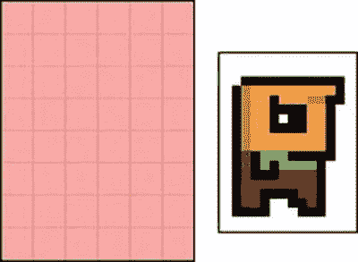

[图 3-25。](#_Fig25)一个简单的背景和鲍勃，宇宙的主人

要绘制 Bob 的世界，我们首先将背景图像绘制到 framebuffer，然后在 framebuffer 中的背景图像上绘制 Bob。这个过程被称为*合成*，因为我们将不同的图像合成为最终的图像。我们绘制图像的顺序是相关的，因为任何新的绘制操作都会覆盖帧缓冲区中的当前内容。那么，我们合成的最终结果会是什么呢？[图 3-26](#Fig26) 给你看。


[图 3-26。将背景和鲍勃合成到帧缓冲区中(这不是我们想要的)](#_Fig26)

哎哟，这不是我们想要的。在图 3-26 中，注意 Bob 被白色像素包围。当我们在背景上绘制 Bob 到 framebuffer 时，那些白色像素也被绘制，有效地覆盖了背景。如何绘制 Bob 的图像，使得只绘制 Bob 的像素，忽略白色背景像素？

进入*阿尔法混合*。在 Bob 的例子中，这在技术上被称为 alpha 蒙版，但这只是 alpha 混合的一个子集。图形软件通常让我们不仅指定像素的 RGB 值，还指示其半透明性。可以把它看作是像素颜色的另一个组成部分。我们可以对它进行编码，就像我们对红色、绿色和蓝色分量进行编码一样。

我们之前暗示过，我们可以在 32 位整数中存储 24 位 RGB 三元组。在这个 32 位整数中有 8 个未使用的位，我们可以抓取并在其中存储我们的 alpha 值。然后我们可以指定一个像素的半透明度从 0 到 255，其中 0 是完全透明的，255 是不透明的。根据组件的顺序，这种编码称为 ARGB8888 或 BGRA8888。当然还有 RGBA8888 和 ABGR8888 格式。

在 16 位编码的情况下，我们有一个小问题:我们的 16 位短整型的所有位都被颜色分量占用了。让我们模仿 ARGB8888 格式，类似地定义一个 ARGB4444 格式。我们的 RGB 值总共剩下 12 位，每个颜色分量 4 位。

我们可以很容易地想象完全半透明或不透明的像素渲染方法是如何工作的。在第一种情况下，我们只需忽略 alpha 分量为零的像素。在第二种情况下，我们只需覆盖目标像素。然而，当一个像素既没有完全半透明也没有完全不透明的 alpha 分量时，事情会变得稍微复杂一点。

当以正式的方式谈论混合时，我们必须定义一些事情:

*   混合有两个输入和一个输出，每个都表示为 RGB 三元组(C)加上 alpha 值(α)。
*   这两个输入被称为*源*和*目的地*。源是我们要在目标图像(即帧缓冲区)上绘制的图像像素。目标像素是我们将要用源像素(部分)过度绘制的像素。
*   输出再次是表示为 RGB 三元组和 alpha 值的颜色。不过，通常我们会忽略 alpha 值。为了简单起见，我们将在本章中这样做。
*   为了简化数学，我们将 RGB 和 alpha 值表示为 0.0 到 1.0 范围内的浮点数。

有了这些定义，我们可以创建所谓的混合方程。最简单的等式是这样的:

```java
red = src.red * src.alpha + dst.red * (1 – src.alpha)
blue = src.green * src.alpha + dst.green * (1 – src.alpha)
green = src.blue * src.alpha + dst.blue * (1 – src.alpha)
```

src 和 dst 是我们想要彼此混合的源和目标的像素。我们将这两种颜色按分量混合。请注意，在这些混合等式中缺少目标 alpha 值。让我们尝试一个例子，看看它做了什么:

```java
src = (1, 0.5, 0.5), src.alpha = 0.5, dst = (0, 1, 0)
red = 1 * 0.5 + 0 * (1 – 0.5) = 0.5
blue = 0.5 * 0.5 + 1 * (1 – 0.5) = 0.75
red = 0.5 * 0.5 + 0 * (1 – 0.5) = 0.25
```

[图 3-27](#Fig27) 说明了前面的等式。我们的源颜色是粉红色，目标颜色是绿色。这两种颜色对最终输出颜色的贡献相等，导致绿色或橄榄色有点脏。


[图 3-27。](#_Fig27)混合两个像素

两位名叫波特和达夫的绅士提出了一系列混合方程式。不过，我们将坚持前面的等式，因为它涵盖了我们的大多数用例。试着在纸上或你选择的图形软件中进行实验，感受一下混合会对你的作品产生什么样的影响。

**注**勾兑是一个很广的领域。如果你想充分利用它的潜力，我们建议你在网上搜索波特和达夫在这个问题上的原创作品。然而，对于我们将要编写的游戏，前面的等式就足够了。

请注意，前面的等式中包含了大量乘法运算(准确地说是六次)。乘法是昂贵的，我们应该尽可能避免它们。在混合的情况下，我们可以通过将源像素颜色的 RGB 值与源 alpha 值相乘来消除其中的三个乘法。大多数图形软件支持图像的 RGB 值与相应的 alphas 值相乘。如果不支持，可以在加载时在内存中实现。然而，当我们使用图形 API 绘制混合图像时，我们必须确保使用正确的混合公式。我们的图像仍然包含 alpha 值，所以前面的等式会输出不正确的结果。源 alpha 不得与源颜色相乘。幸运的是，所有 Android 图形 API 都允许我们完全指定我们想要如何混合我们的图像。

在 Bob 的例子中，我们只是在首选的图形软件程序中将所有白色像素的 alpha 值设置为零，加载 ARGB8888 或 ARGB4444 格式的图像，可能会预乘 alpha，并使用一种绘图方法，使用正确的混合公式进行实际的 alpha 混合。结果看起来像[图 3-28](#Fig28) 。

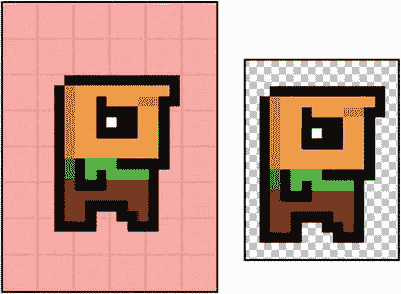

[图 3-28。](#_Fig28) Bob blended 在左边，Bob in Paint。NET .在右边。棋盘显示白色背景像素的 alpha 为零，因此背景棋盘会发光

**注意**JPEG 格式不支持存储每个像素的 alpha 值。在这种情况下，请使用 PNG 格式。

在实践中

有了这些信息，我们终于可以开始设计图形模块的接口了。让我们来定义这些接口的功能。注意，当我们提到 framebuffer 时，我们实际上是指我们所绘制的 UI 组件的虚拟 framebuffer。我们只是假装直接绘制到真正的帧缓冲区。我们需要能够执行以下操作:

*   从磁盘加载图像，并将其存储在内存中，以便以后绘制。
*   用一种颜色清除帧缓冲区，这样我们就可以清除最后一帧中仍然存在的内容。
*   将帧缓冲区中特定位置的像素设置为特定颜色。
*   向帧缓冲区绘制线条和矩形。
*   将先前加载的图像绘制到帧缓冲区。我们希望能够画出完整的图像或图像的一部分。我们还需要能够绘制混合和不混合的图像。
*   获取帧缓冲区的尺寸。

我们提出两个简单的接口:图形和位图。让我们从图形界面开始，如清单 3-6 所示。

***[清单 3-6。](#_list6)*** *图形界面*

```java
package com.badlogic.androidgames.framework;

public interface Graphics {
    public static enum PixmapFormat {
        *ARGB8888*,*ARGB4444*,*RGB565*
    }

    public Pixmap newPixmap(String fileName, PixmapFormat format);

    public void clear(int color);

    public void drawPixel(int x, int y, int color);

    public void drawLine(int x, int y, int x2, int y2, int color);

    public void drawRect(int x, int y, int width, int height, int color);

    public void drawPixmap(Pixmap pixmap, int x, int y, int srcX, int srcY,
            int srcWidth, int srcHeight);

    public void drawPixmap(Pixmap pixmap, int x, int y);

    public int getWidth();

    public int getHeight();
}
```

我们从一个名为 PixmapFormat 的公共静态枚举开始。它编码了我们将支持的不同像素格式。接下来，我们有我们的图形界面的不同方法:

*   Graphics.newPixmap()方法将加载 JPEG 或 PNG 格式的图像。我们为生成的位图指定一个期望的格式，这是对加载机制的一个提示。产生的位图可能有不同的格式。我们这样做是为了在某种程度上控制已加载图像的内存占用(例如，通过将 RGB888 或 ARGB8888 图像加载为 RGB565 或 ARGB4444 图像)。文件名指定了我们的应用的 APK 文件中的一个资产。
*   Graphics.clear()方法用给定的颜色清除整个帧缓冲区。我们的小框架中的所有颜色将被指定为 32 位 ARGB8888 值(当然，Pixmaps 可能有不同的格式)。
*   Graphics.drawPixel()方法会将 framebuffer 中(x，y)处的像素设置为给定的颜色。屏幕外的坐标将被忽略。这叫做*削波*。
*   Graphics.drawLine()方法类似于 Graphics.drawPixel()方法。我们指定线条的起点和终点，以及颜色。位于帧缓冲区栅格之外的线的任何部分都将被忽略。
*   Graphics.drawRect()方法在 framebuffer 中绘制一个矩形。(x，y)指定帧缓冲区中矩形左上角的位置。参数 width 和 height 指定 x 和 y 的像素数，矩形将从(x，y)开始填充。我们在 y 方向向下填充。颜色参数是用来填充矩形的颜色。
*   Graphics.drawPixmap()方法将 Pixmap 的矩形部分绘制到 framebuffer 中。(x，y)坐标指定了帧缓冲区中位图目标位置的左上角位置。参数 srcX 和 srcY 指定了矩形区域的相应左上角，该矩形区域是从像素图中使用的，在像素图自己的坐标系中给出。最后，srcWidth 和 srcHeight 指定了我们从位图中获取的部分的大小。
*   最后，Graphics.getWidth()和 Graphics.getHeight()方法以像素为单位返回 framebuffer 的宽度和高度。

除 Graphics.clear()之外的所有绘制方法都会自动对它们接触的每个像素执行混合，如前一节所述。我们可以根据具体情况禁用混合来加快绘制速度，但这会使我们的实现变得复杂。通常，对于像 Nom 先生这样的简单游戏，我们可以一直启用混合。

列表 3-7 中的[给出了 Pixmap 接口。](#list7)

***[清单 3-7。](#_list7)*** *点阵图界面*

```java
package com.badlogic.androidgames.framework;

import com.badlogic.androidgames.framework.Graphics.PixmapFormat;

public interface Pixmap {
    public int getWidth();

    public int getHeight();

    public PixmapFormat getFormat();

    public void dispose();
}
```

我们保持它非常简单和不可变，因为合成是在帧缓冲区中完成的:

*   Pixmap.getWidth()和 Pixmap.getHeight()方法以像素为单位返回 Pixmap 的宽度和高度。
*   方法返回 Pixmap 存储在 RAM 中的 PixelFormat。
*   最后，还有 Pixmap.dispose()方法。Pixmap 实例会耗尽内存和潜在的其他系统资源。如果我们不再需要它们，我们应该用这种方法处理它们。

有了这个简单的图形模块，我们以后可以很容易地实现 Nom 先生。让我们以对游戏框架本身的讨论来结束这一章。

游戏框架

在我们做了所有的基础工作之后，我们终于可以谈论如何实现游戏本身了。为此，让我们确定我们的游戏必须执行哪些任务:

*   游戏被分成不同的屏幕。每个屏幕执行相同的任务:评估用户输入，将输入应用到屏幕状态，以及渲染场景。一些屏幕可能不需要任何用户输入，只是在一段时间后转换到另一个屏幕(例如，闪屏)。
*   屏幕需要以某种方式进行管理(也就是说，我们需要跟踪当前屏幕，并有办法过渡到新屏幕，这可以归结为销毁旧屏幕并将新屏幕设置为当前屏幕)。
*   游戏需要授予屏幕对不同模块(图形、音频、输入等)的访问权限，以便它们可以加载资源、获取用户输入、播放声音、渲染到帧缓冲区，等等。
*   由于我们的游戏将是实时的(这意味着事物将不断移动和更新)，我们必须使当前屏幕更新其状态，并尽可能经常地呈现它自己。我们通常会在一个叫做*主循环*的循环中这样做。当用户退出游戏时，循环将终止。这个循环的单次迭代被称为*帧*。我们可以计算的每秒帧数(FPS)被称为*帧率*。
*   说到时间，我们还需要记录自上一帧以来已经过去的时间跨度。这是用于独立于帧的运动，我们将在一分钟内讨论。
*   游戏需要跟踪窗口状态(即它是暂停还是恢复)，并将这些事件通知当前屏幕。
*   游戏框架将处理设置窗口和创建 UI 组件，我们渲染和接收输入。

让我们将其归结为一些伪代码，暂时忽略暂停和恢复等窗口管理事件:

```java
createWindowAndUIComponent();

Input input = new Input();
Graphics graphics = new Graphics();
Audio audio = new Audio();
Screen currentScreen = new MainMenu();
Float lastFrameTime = currentTime();

while ( !userQuit() ) {
   float deltaTime = currentTime() – lastFrameTime;
   lastFrameTime = currentTime();

   currentScreen.updateState(input, deltaTime);
   currentScreen.present(graphics, audio, deltaTime);
}

cleanupResources();
```

我们首先创建游戏的窗口和 UI 组件，我们向其渲染并从其接收输入。接下来，我们实例化完成底层工作所需的所有模块。我们实例化我们的开始屏幕并使它成为当前屏幕，我们记录当前时间。然后我们进入主循环，如果用户表示他或她想要退出游戏，主循环将终止。

在游戏循环内，我们计算所谓的 *delta 时间*。这是从最后一帧开始所经过的时间。然后我们记录下当前帧开始的时间。增量时间和当前时间通常以秒为单位。对于屏幕，delta time 表示自上次更新以来已经过了多长时间——如果我们想要进行独立于帧的移动(我们稍后将回到这一点),则需要该信息。

最后，我们简单地更新当前屏幕的状态并呈现给用户。更新取决于增量时间以及输入状态；因此，我们将它们提供给屏幕。该演示包括将屏幕状态呈现到帧缓冲区，以及回放屏幕状态所需的任何音频(例如，由于上次更新中发射的一个镜头)。表示方法可能还需要知道自上次调用以来已经过了多长时间。

当主循环终止时，我们可以清理并释放所有资源，关闭窗口。

这也是几乎所有游戏的高级工作方式:处理用户输入，更新状态，将状态呈现给用户，并无限重复(或者直到用户厌倦了我们的游戏)。

现代操作系统上的 UI 应用通常不能实时工作。它们使用基于事件的范例，其中操作系统通知应用输入事件，以及何时呈现自身。这是通过应用在启动时向操作系统注册的回调来实现的；然后，它们负责处理收到的事件通知。所有这些都发生在所谓的 *UI 线程*—UI 应用的主线程中。尽可能快地从回调中返回通常是一个好主意，所以我们不想在其中一个回调中实现我们的主循环。

相反，我们将游戏的主循环放在一个单独的线程中，当游戏启动时，我们将产生这个线程。这意味着当我们想要接收 UI 线程事件时，例如输入事件或窗口事件，我们必须采取一些预防措施。但是这些都是我们以后在为 Android 实现游戏框架时要处理的细节。请记住，我们需要在某些时候同步 UI 线程和游戏的主循环线程。

游戏和屏幕界面

综上所述，让我们试着设计一个游戏界面。下面是这个接口的实现必须做的事情:

*   设置窗口和 UI 组件，并挂钩回调，以便我们可以接收窗口和输入事件。
*   启动主循环线程。
*   跟踪当前屏幕，并告诉它在每次主循环迭代中更新和呈现自己(也称为帧)。
*   将任何窗口事件(例如，暂停和恢复事件)从 UI 线程转移到主循环线程，并将它们传递到当前屏幕，以便它可以相应地更改其状态。
*   授权访问我们之前开发的所有模块:输入、文件、图形和音频。

作为游戏开发人员，我们希望不知道我们的主循环运行在什么线程上，以及我们是否需要与 UI 线程同步。我们只是想在低级模块和一些窗口事件通知的帮助下实现不同的游戏屏幕。因此，我们将创建一个非常简单的游戏界面，隐藏所有这些复杂性，以及一个抽象的屏幕类，我们将使用它来实现我们所有的屏幕。[清单 3-8](#list8) 显示游戏界面。

***[清单 3-8。](#_list8)*** *游戏界面*

```java
package com.badlogic.androidgames.framework;

public interface Game {
    public Input getInput();

    public FileIO getFileIO();

    public Graphics getGraphics();

    public Audio getAudio();

    public void setScreen(Screen screen);

    public Screen getCurrentScreen();

    public Screen getStartScreen();
}
```

正如预期的那样，有几个 getter 方法可以返回我们底层模块的实例，游戏实现将实例化和跟踪这些模块。

Game.setScreen()方法允许我们设置游戏的当前屏幕。这些方法将被实现一次，连同所有的内部线程创建、窗口管理和主循环逻辑，它们将不断要求当前屏幕呈现并更新自身。

Game.getCurrentScreen()方法返回当前活动的屏幕实例。

稍后我们将使用一个名为 AndroidGame 的抽象类来实现游戏接口，它将实现除 Game.getStartScreen()方法之外的所有方法。这个方法将是一个抽象方法。如果我们为实际游戏创建 AndroidGame 实例，我们将扩展它并覆盖 Game.getStartScreen()方法，将实例返回到游戏的第一个屏幕。

为了让你对设置我们的游戏有多简单有个印象，这里有个例子(假设我们已经实现了 AndroidGame 类):

```java
public class MyAwesomeGameextends AndroidGame {
    public Screen getStartScreen () {
        return new MySuperAwesomeStartScreen(this );
    }
}
```

太棒了，不是吗？我们所要做的就是实现我们想要用来启动游戏的屏幕，AndroidGame 类会为我们完成剩下的工作。从这一点开始，我们的 MySuperAwesomeStartScreen 将被主循环线程中的 AndroidGame 实例请求更新和呈现。注意，我们将 MyAwesomeGame 实例本身传递给屏幕实现的构造函数。

**注意**如果你想知道实际上是什么实例化了我们的 MyAwesomeGame 类，我们给你一个提示:AndroidGame 将从 Activity 派生，当用户启动我们的游戏时，它将由 Android 操作系统自动实例化。

拼图的最后一块是抽象类屏幕。我们让它成为一个抽象类，而不是一个接口，这样我们就可以实现一些簿记。这样，在抽象 Screen 类的实际实现中，我们必须编写更少的样板代码。清单 3-9 显示了抽象的屏幕类。

***[清单 3-9。](#_list9)*** *屏幕类*

```java
package com.badlogic.androidgames.framework;

public abstract class Screen {
    protected final Game game;

    public Screen(Game game) {
        this .game = game;
    }

    public abstract void update(float deltaTime);

    public abstract void present(float deltaTime);

    public abstract void pause();

    public abstract void resume();

    public abstract void dispose();
}
```

事实证明，记账并没有那么糟糕。构造函数接收游戏实例，并将其存储在所有子类都可以访问的最终成员中。通过这种机制，我们可以实现两件事:

*   我们可以访问游戏界面的底层模块来回放音频、在屏幕上绘图、获取用户输入以及读写文件。
*   我们可以在适当的时候通过调用 Game.setScreen()来设置一个新的当前屏幕(例如，当按下一个按钮触发到新屏幕的转换时)。

第一点非常明显:我们的屏幕实现需要访问这些模块，这样它才能真正做一些有意义的事情，比如渲染大量患有狂犬病的独角兽。

第二点允许我们在屏幕实例本身中容易地实现我们的屏幕转换。每个屏幕可以根据其状态(例如，当按下菜单按钮时)决定何时转换到其他屏幕。

方法 Screen.update()和 Screen.present()现在应该是不言自明的了:它们将更新屏幕状态并相应地显示出来。游戏实例将在主循环的每次迭代中调用它们一次。

当游戏暂停或恢复时，将调用 Screen.pause()和 Screen.resume()方法。这同样由游戏实例完成，并应用于当前活动的屏幕。

如果调用 Game.setScreen()，游戏实例将调用 Screen.dispose()方法。游戏实例将通过这个方法释放当前屏幕，从而给屏幕一个机会来释放它的所有系统资源(例如，存储在 Pixmaps 中的图形资源)，以便在内存中为新屏幕的资源腾出空间。对 Screen.dispose()方法的调用也是屏幕确保保存任何需要持久性的信息的最后机会。

简单的例子

继续我们的 MySuperAwesomeGame 示例，这里是 MySuperAwesomeStartScreen 类的一个非常简单的实现:

```java
public class MySuperAwesomeStartScreen extends Screen {
    Pixmap awesomePic;
    int x;

    public MySuperAwesomeStartScreen(Game game) {
        super (game);
        awesomePic = game.getGraphics().newPixmap("data/pic.png",
                PixmapFormat.*RGB565*);
    }

    @Override
    public void update(float deltaTime) {
        x += 1;
        if (x > 100)
            x = 0;
    }

    @Override
    public void present(float deltaTime) {
        game.getGraphics().clear(0);
        game.getGraphics().drawPixmap(awesomePic, x, 0, 0, 0,
                awesomePic.getWidth(), awesomePic.getHeight());
    }

    @Override
    public void pause() {
        // nothing to do here
    }

    @Override
    public void resume() {
        // nothing to do here
    }

    @Override
    public void dispose() {
        awesomePic.dispose();
    }
}
```

让我们看看这个类，结合 MySuperAwesomeGame 类，将会做什么:

1.  当 MySuperAwesomeGame 类被创建时，它将设置窗口、我们向其呈现和从其接收事件的 UI 组件、接收窗口和输入事件的回调以及主循环线程。最后，它将调用自己的 mysuperawesomegay . getstartscreen()方法，该方法将返回 MySuperAwesomeStartScreen()类的一个实例。
2.  在 MySuperAwesomeStartScreen 构造函数中，我们从磁盘加载一个位图，并将其存储在一个成员变量中。这就完成了我们的屏幕设置，控制权交还给了 MySuperAwesomeGame 类。
3.  主循环线程现在将不断调用我们刚刚创建的实例的 mysuperawesomestartscreen . update()和 mysuperawesomestartscreen . present()方法。
4.  在 mysuperawesomestartscreen . update()方法中，我们每帧增加一个名为 x 的成员。这个成员持有我们想要渲染的图像的 x 坐标。当 x 坐标值大于 100 时，我们将其重置为 0。
5.  在 mysuperawesomestartscreen . present()方法中，我们用黑色(0x00000000 = 0)清除帧缓冲区，并在位置(x，0)呈现我们的位图。
6.  主循环线程将重复步骤 3 到 5，直到用户按下设备上的后退按钮退出游戏。游戏实例将调用 mysuperawesomestarscreen . dispose()方法，该方法将释放位图。

这是我们第一个(不那么)激动人心的游戏！用户只会看到图像在屏幕上从左向右移动。这并不是一个令人愉快的用户体验，但我们稍后会解决这个问题。请注意，在 Android 上，游戏可以暂停，并在任何时间点恢复。然后，我们的 MyAwesomeGame 实现将调用 mysuperawesomestartscreen . pause()和 mysuperawesomestartscreen . resume()方法。只要应用本身暂停，主循环线程就会暂停。

还有最后一个我们必须要说的问题:帧率——独立运动。

帧速率-独立运动

让我们假设用户的设备可以以 60FPS 的速度运行上一节中的游戏。我们的 Pixmap 将在 100 帧中前进 100 个像素，因为我们每帧将 MySuperAwesomeStartScreen.x 成员增加 1 个像素。在 60FPS 的帧速率下，到达位置(100，0)大约需要 1.66 秒。

现在让我们假设第二个用户在不同的设备上玩我们的游戏。那个设备能够以每秒 30 帧的速度运行我们的游戏。每秒，我们的位图前进 30 个像素，所以到达位置(100，0)需要 3.33 秒。

这很糟糕。它可能不会对我们的简单游戏所产生的用户体验产生影响，但是用超级马里奥代替像素地图，并考虑以依赖于帧的方式移动他将意味着什么。假设我们按住右边的 D-pad 按钮，马里奥就会跑到右边。在每一帧中，我们将他推进 1 个像素，就像我们在像素图中所做的那样。在能以 60 FPS 运行游戏的设备上，马里奥的运行速度将是以 30 FPS 运行游戏的设备的两倍！这将完全改变用户体验，取决于设备的性能。我们需要解决这个问题。

这个问题的解决方案叫做独立于帧速率的运动。我们不是每帧固定移动我们的点阵图(或马里奥),而是指定每秒单位的移动速度。假设我们希望我们的位图每秒前进 50 个像素。除了每秒 50 像素的值之外，我们还需要关于自从我们上次移动位图以来已经过了多长时间的信息。这就是这个奇怪的 delta 时间发挥作用的地方。它告诉我们自上次更新以来已经过去了多长时间。因此，我们的 mysuperawesomestartscreen . update()方法应该如下所示:

```java
@Override
public void update(float deltaTime) {
    x += 50 * deltaTime;
    if(x > 100)
        x = 0;
}
```

如果我们的游戏以恒定的 60FPS 运行，传递给该方法的增量时间将始终是 1/60 0.016 秒。因此，在每一帧中，我们前进 50×0.016 \u 0.83 像素。在 60FPS 下，我们推进 60×0.83∾50 像素！我们用 30FPS 来测试一下这个:50×1/30∾1.66。乘以 30FPS，我们再次每秒移动 50 个像素。因此，无论运行我们游戏的设备执行游戏的速度有多快，我们的动画和动作将始终与实际的挂钟时间保持一致。

如果我们真的用前面的代码来尝试，我们的位图根本不会以 60FPS 的速度移动。这是因为我们代码中的一个错误。我们会给你一些时间来发现它。这很微妙，但却是游戏开发中常见的陷阱。我们用来增加每一帧的 x 成员实际上是一个整数。整数加 0.83 不会有任何影响。要解决这个问题，我们只需将 x 存储为浮点数而不是整数。这也意味着我们在调用 Graphics.drawPixmap()时，必须向 int 添加一个强制转换。

**注意**虽然 Android 上的浮点计算通常比整数运算慢，但影响几乎可以忽略不计，所以我们可以不用使用更昂贵的浮点运算。

这就是我们游戏框架的全部内容。我们可以直接把 Mr. Nom 设计的屏幕翻译成我们的类和框架的接口。当然，一些实现细节仍然需要注意，但是我们将把它留到后面的章节。现在，你可以为自己感到骄傲。你坚持读完这一章，现在你已经准备好成为 Android(和其他平台)的游戏开发者了！

摘要

大约 50 页高度浓缩和信息丰富的内容之后，你应该对创建一个游戏有一个很好的想法。我们在 Google Play 上查看了一些最受欢迎的流派，并得出了一些结论。我们从头开始设计了一个完整的游戏，只用了剪刀、一支笔和一些纸。最后，我们探索了游戏开发的理论基础，我们甚至创建了一组接口和抽象类，我们将在本书中使用它们来实现基于这些理论概念的游戏设计。如果你觉得你想超越这里所涵盖的基础知识，那么尽一切办法在网上寻找更多的信息。你手里握着所有的关键词。理解这些原则是开发稳定且性能良好的游戏的关键。也就是说，让我们为 Android 实现我们的游戏框架吧！*