# 七、OpenGL ES：温和介绍

诺姆先生获得了巨大的成功。由于其坚实的初始设计和游戏框架，实现 Nom 先生对我们来说轻而易举。最棒的是，游戏即使在低端设备上也能流畅运行。当然，Nom 先生不是一个非常复杂或图形密集型的游戏，所以使用 Canvas API 进行渲染被证明是一个好主意。

然而，当你想做一些更复杂的事情时，你会碰壁:Canvas 只是跟不上这样一个游戏的视觉复杂性。如果你想玩 3D 游戏，画布也帮不了你。所以。。。你能做什么？

这就是 OpenGL ES 的用武之地。在这一章中，首先我们将简要地看一下 OpenGL ES 实际上是什么和做什么。然后，我们将重点关注使用 OpenGL ES 进行 2D 图形，而不必深入到使用 API 进行 3D 图形的更复杂的数学领域(我们将在后面的章节中讨论)。我们将一步一步来，因为 OpenGL ES 会变得非常复杂。你准备好了解 OpenGL ES 了吗？

什么是 OpenGL ES，我为什么要关心？

OpenGL ES 是(3D)图形编程的行业标准。它特别针对移动和嵌入式设备。它由 Khronos Group 维护，Khronos Group 是一个行业联盟，其成员包括 ATI、NVIDIA 和 Intel 等；这些公司共同定义并扩展了标准。

说到标准，目前 OpenGL ES 有四个增量版本:1.0、1.1、2.0，以及最近发布的 3.0。我们关心的是本书中的前两个。所有 Android 设备都支持 OpenGL ES 1.0，并且大多数还支持 1.1 版本，该版本在 1.0 规范中添加了一些新功能。然而，OpenGL ES 2.0 打破了与 1.x 版本的兼容性。您可以使用 1.x 或 2.0，但不能同时使用两者。原因是 1.x 版本使用一种称为*固定功能管道*、的编程模型，而 2.0 版本允许您通过所谓的*着色器*以编程方式定义渲染管道的一部分。很多二代设备已经支持 OpenGL ES 2.0 然而，学习 3D 编程和使用着色器进行编程的认知摩擦非常大。OpenGL ES 1.x 对于大多数游戏来说已经足够好了，所以我们在这里坚持使用它。OpenGL ES 3.0 是如此的新鲜，以至于在我写这篇文章的时候，还没有设备实现这个标准。设备制造商需要一段时间才能跟上速度。

**注意**仿真器支持 OpenGL ES 1.0 和 2.0。然而，仿真并不完美。此外，虽然 OpenGL ES 是一种标准，但不同的制造商对它有不同的解释，并且设备之间的性能差异很大，因此请确保在各种设备上进行测试，以确保兼容性。我们将设计几个有用的类，可以在任何设备上工作。

OpenGL ES 是一个 API，它以 Khronos Group 提供的一组 C 头文件的形式出现，同时还有一个非常详细的规范，说明了在这些头文件中定义的 API 应该如何工作。这包括诸如像素和线条必须如何渲染之类的事情。然后，硬件制造商采用该规范，并在 GPU 驱动程序之上为他们的 GPU 实现该规范。你可以在 http://www.khronos.org/opengles 找到所有的规格和更多。

这些实现的质量略有不同:一些公司严格遵守标准(PowerVR)，而其他公司似乎很难坚持下去。这有时会导致实现中依赖于 GPU 的错误，这些错误与 Android 本身无关，而是与制造商提供的硬件驱动程序有关。在您进入 OpenGL ES 领域的过程中，我们将为您指出任何特定于设备的问题。

**注意** OpenGL ES 或多或少是功能更丰富的桌面 OpenGL 标准的兄弟。它不同于后者，因为某些功能被减少或完全删除。尽管如此，还是有可能编写一个可以运行这两种规范的应用，如果你想把你的游戏移植到你的桌面上，这是一个很好的选择。

那么 OpenGL ES 实际上是做什么的呢？简短的回答是，这是一个精简的三角形渲染机器。长的答案有点复杂。

编程模型:一个类比

总的来说，OpenGL ES 是一个 3D 图形编程 API。因此，它有一个非常好且易于理解的编程模型，我们可以用一个简单的类比来说明。

把 OpenGL ES 想象成像照相机一样工作。要拍照，你得去你想拍的场景。您的场景由对象组成，例如，一张上面有更多对象的桌子。它们都有相对于你的相机的位置和方向，以及不同的材质和纹理。玻璃是半透明的，具有反射性；桌子可能是木头做的；一本杂志上有一位政治家的最新照片；等等。有些物体甚至会四处移动(例如，一只果蝇)。您的相机还具有一些属性，如焦距、视野、图像分辨率、将要拍摄的照片的大小，以及在世界范围内的唯一位置和方向(相对于某个原点)。即使物体和相机都在移动，当你按下快门时，你会捕捉到场景的静止图像(现在，我们将忽略快门速度，这可能会导致图像模糊)。在那个无限小的瞬间，一切都静止不动，轮廓分明，照片准确地反映了位置、方向、纹理、材质和照明的所有配置。[图 7-1](#Fig1) 展示了一个抽象的场景，有一台相机，灯光，和三个不同材质的物体。

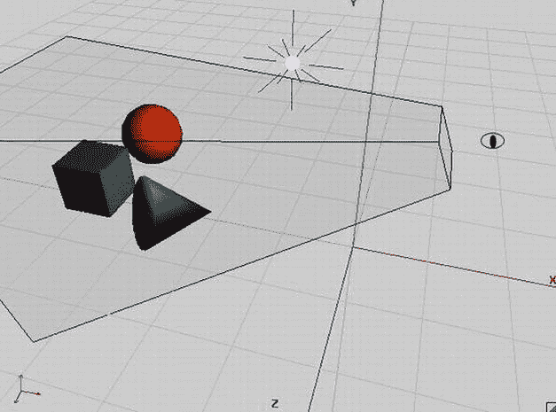

[图 7-1。](#_Fig1)抽象场景

每个对象都有相对于场景原点的位置和方向。由眼睛指示的摄像机也具有相对于场景原点的位置。[图 7-1](#Fig1) 中的金字塔是所谓的*视体*或*视见体*、，它显示了摄像机捕捉了多少场景以及摄像机是如何定向的。带有光线的小白球是场景中的光源，它也有一个相对于原点的位置。

我们可以直接将这个场景映射到 OpenGL ES，但是要这样做，我们需要定义以下内容:

*   *物体(又称模型)* : 这些通常由四组属性组成:几何形状、颜色、纹理和材质。几何图形被指定为一组三角形。每个三角形由三维空间中的三个点组成，所以我们有相对于坐标系原点定义的 x，y，z 坐标，如图[图 7-1](#Fig1) 所示。注意 z 轴指向我们。颜色通常指定为 RGB 三色，我们已经习惯了。纹理和材质稍微复杂一点。我们稍后会谈到这些。
*   *灯光* : OpenGL ES 提供了几个不同的灯光类型和不同的属性。它们只是在 3D 空间中具有位置和/或方向的数学对象，加上诸如颜色之类的属性。
*   *相机* : 这也是一个在 3D 空间中有位置和方向的数学对象。此外，它还有控制我们看到多少图像的参数，类似于真正的相机。所有这些共同定义了一个视见体或视见平截头体(在[图 7-1](#Fig1) 中用顶部被切掉的金字塔表示)。这个金字塔里面的任何东西都可以被摄像机看到；外面的任何东西都不会进入最终的画面。
*   *视窗* : 这定义了最终图像的尺寸和分辨率。可以把它想象成你放入模拟相机的胶片类型，或者你用数码相机拍摄的照片的图像分辨率。

考虑到所有这些，OpenGL ES 可以从摄像机的角度构建我们场景的 2D 位图。请注意，我们在 3D 空间中定义一切。那么，OpenGL ES 如何将它映射到二维空间呢？

预测

这个 2D 映射是通过一个叫做*投影*的东西来完成的。我们已经提到 OpenGL ES 主要关注三角形。单个三角形在 3D 空间中定义了三个点。为了将这样的三角形渲染到帧缓冲区，OpenGL ES 需要知道这些 3D 点在帧缓冲区的基于像素的坐标系中的坐标。一旦知道了这三个角点坐标，它就可以简单地在帧缓冲区中画出三角形内部的像素。我们甚至可以通过将 3D 点投影到 2D 来编写我们自己的小 OpenGL ES 实现，并通过画布简单地在它们之间画线。

3D 图形中常用的投影有两种。

*   *平行(或正交)投影* : 如果你曾经玩过 CAD 应用，你可能已经知道这个了。平行投影不在乎物体离相机有多远；在最终图像中，对象将始终具有相同的大小。这种类型的投影通常用于在 OpenGL ES 中渲染 2D 图形。
*   *透视投影* : 你的眼睛每天都在使用这种投影。离你越远的物体在你的视网膜上显得越小。当我们用 OpenGL ES 做 3D 图形时，通常使用透视投影。

在这两种情况下，你都需要一个被称为*投影平面*、的东西，它几乎与你的视网膜完全相同——它是光线实际记录形成最终图像的地方。就面积而言，数学平面是无限的，而我们的视网膜是有限的。我们的 OpenGL ES“视网膜”等于图 7-1 中[所见的视锥顶部的矩形。视图截锥的这一部分是 OpenGL ES 投射点的地方。这个区域被称为裁剪平面、](#Fig1)附近的*，它有自己的小 2D 坐标系。[图 7-2](#Fig2) 再次显示了附近的裁剪平面，从摄像机的角度看，与坐标系叠加。*

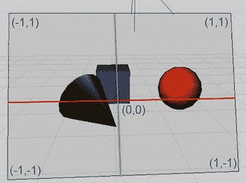

[图 7-2。](#_Fig2)近裁剪平面(也称为投影平面)及其坐标系

注意坐标系绝不是固定的。我们可以操纵它，这样我们就可以在任何我们喜欢的投影坐标系中工作；例如，我们可以指示 OpenGL ES 让原点在左下角，让“视网膜”的可视区域在 x 轴上是 480 个单位，在 y 轴上是 320 个单位。听起来很熟悉？是的，OpenGL ES 允许你为投影点指定任何你想要的坐标系。

一旦我们指定了视图平截头体，OpenGL ES 就会获取三角形的每个点，并通过投影平面从其中射出一条光线。平行投影和透视投影的区别在于这些光线的方向是如何构成的。[图 7-3](#Fig3) 显示了从上方观察时两者的区别。


[图 7-3。](#_Fig3)透视投影(左)和平行投影(右)

透视投影通过相机(或眼睛，在这种情况下)从三角形点射出光线。因此，更远的物体在投影平面上会显得更小。当我们使用平行投影时，光线是垂直于投影平面射出的。在这种情况下，无论距离多远，物体都将在投影平面上保持其大小。

正如前面指出的，我们的投影平面在 OpenGL ES 行话中被称为裁剪平面附近的*。视见体的所有边都有相似的名称。离相机最远的那个被称为*远裁剪平面*。其余称为*左*、*右*、*上*和*下*裁剪平面。那些平面之外或之后的任何东西都不会被渲染。部分位于视见平截头体内的对象将从这些平面中被剪切掉，这意味着视见平截头体外的部分将被切掉。这就是*裁剪平面*名称的由来。*

你可能想知道为什么图 7-3 中平行投影情况下的视截头体是矩形的。事实证明，投影实际上是由我们如何定义裁剪平面决定的。在透视投影的情况下，左侧、右侧、顶部和底部裁剪平面不垂直于近平面和远平面(见[图 7-3](#Fig3) ，仅显示了左侧和右侧裁剪平面)。在平行投影的情况下，这些平面是垂直的，这告诉 OpenGL ES 以相同的大小渲染一切，不管它离相机有多远。

标准化设备空间和视口

一旦 OpenGL ES 计算出三角形在近裁剪平面上的投影点，它就可以最终将它们转换为帧缓冲区中的像素坐标。为此，它必须首先将这些点转换到所谓的*标准化设备空间*。这等于图 7-2 中[所示的坐标系。基于这些标准化的设备空间坐标，OpenGL ES 通过以下简单公式计算最终的帧缓冲区像素坐标:](#Fig2)

```java
pixelX = (norX + 1) / (viewportWidth + 1) + norX
pixelY = (norY + 1) / (viewportHeight + 1) + norY
```

其中，norX 和 norY 是 3D 点的标准化设备坐标，viewportWidth 和 viewportHeight 是 x 轴和 y 轴上以像素为单位的视口大小。我们不必担心标准化的设备坐标，因为 OpenGL 会自动为我们完成转换。然而，我们真正关心的是视口和视见体。稍后，您将看到如何指定视图截锥，从而指定投影。

矩阵

OpenGL ES 以*矩阵*的形式表达投影。我们不需要知道矩阵的内部。我们只需要知道它们对我们在场景中定义的点做了什么。这里是矩阵的执行摘要:

*   矩阵对要应用于点的变换进行编码。变换可以是投影、平移(其中点四处移动)、围绕另一个点和轴的旋转或缩放等。
*   通过将这样的矩阵乘以一个点，我们将变换应用于该点。例如，将一个点与编码 x 轴上 10 个单位的平移的矩阵相乘，将使该点在 x 轴上移动 10 个单位，从而修改其坐标。
*   我们可以通过矩阵相乘将存储在不同矩阵中的变换连接成一个矩阵。当我们用一个点乘以这个单个连接矩阵时，存储在该矩阵中的所有变换都将应用于该点。应用变换的顺序取决于矩阵相乘的顺序。
*   有一种特殊的矩阵叫做*单位矩阵*。如果我们把一个矩阵或者一个点乘以它，什么都不会发生。把一个点或矩阵乘以一个单位矩阵想象成一个数乘以 1。根本没有效果。一旦您了解 OpenGL ES 如何处理矩阵(参见“矩阵模式和活动矩阵”一节)，单位矩阵的相关性将变得清晰——这是一个经典的先有鸡还是先有蛋的问题。

**注意**当我们在这个上下文中谈论点时，我们实际上指的是 3D 矢量。

OpenGL ES 有三种不同的矩阵，适用于我们的模型点:

*   *模型-视图矩阵* : 我们可以使用这个矩阵来移动、旋转或缩放三角形的点(这是模型-视图矩阵的*模型*部分)。这个矩阵也用于指定我们摄像机的位置和方向(这是*视图*部分)。
*   投影矩阵 : 这个名字说明了一切——这个矩阵编码了一个投影，也就是我们相机的视锥。
*   纹理矩阵 : 这个矩阵允许我们操作纹理坐标(我们将在后面讨论)。然而，我们将避免在本书中使用这个矩阵，因为 OpenGL ES 的这一部分由于错误的驱动程序而在一些设备上被破坏了。

渲染管道

OpenGL ES 跟踪这三个矩阵。每次我们设置一个矩阵，OpenGL ES 会记住它，直到我们再次改变矩阵。在 OpenGL ES 中，这被称为一个*状态*。 OpenGL 不仅仅跟踪矩阵状态；它还跟踪我们是否想要阿尔法混合三角形，我们是否想要将光照考虑在内，哪个纹理应该应用于我们的几何图形，等等。事实上，OpenGL ES 是一个巨大的状态机；我们设置它的当前状态，向它提供我们的对象的几何图形，并告诉它为我们渲染一幅图像。让我们看看一个三角形是如何通过这个强大的三角形渲染机器的。[图 7-4](#Fig4) 显示了 OpenGL ES 管道的高度简化视图。


[图 7-4。](#_Fig4)三角形之道

三角形通过此管道的方式如下所示:

1.  我们的勇敢三角形首先被模型-视图矩阵转换。这意味着它的所有点都与这个矩阵相乘。这种乘法将有效地在世界上移动三角形的点。
2.  然后将得到的输出乘以投影矩阵，有效地将 3D 点转换到 2D 投影平面上。
3.  在这两个步骤之间(或平行于它们)，当前设置的灯光和材质也被应用到我们的三角形，赋予它颜色。
4.  所有这些完成后，投影的三角形被剪切到我们的“视网膜”上，并通过应用视口变换转换到帧缓冲区坐标。
5.  最后一步，OpenGL 根据灯光阶段的颜色、要应用于三角形的纹理以及三角形的每个像素可能会或可能不会与帧缓冲区中的像素相结合的混合状态来填充三角形的像素。

你需要学习的只是如何在 OpenGL ES 中抛出几何图形和纹理，并设置前面每个步骤所使用的状态。在你这样做之前，你需要了解 Android 是如何授权你访问 OpenGL ES 的。

**注意**虽然对 OpenGL ES 管道的高级描述大多是正确的，但它被极大地简化了，并省略了一些在后面章节中会变得重要的细节。另一个需要注意的是，当 OpenGL ES 执行投影时，它实际上并不投影到 2D 坐标系上；相反，它投射到一个叫做*的齐次坐标系*中，实际上是四维的。这是一个非常复杂的数学主题，所以为了简单起见，我们将只坚持 OpenGL ES 投影到 2D 坐标的简化前提。

在开始之前

在本章的其余部分，我们将提供许多简短的例子，就像我们在第 4 章讨论 Android API 基础时所做的一样。我们将使用我们在[第 4 章](04.html)中使用的相同的 starter 类，它向您显示了您可以开始的 starter 活动列表。唯一会改变的是通过反射实例化的活动的名称，以及它们所在的包。本章其余部分的所有例子都在 com . badlogic . androidgames . GL basics 包中，其余代码保持不变。您的新启动活动将被命名为 GLBasicsStarter。你还将复制所有来自[第五章](05.html)的源代码，即 com . badlogic . androidgames . framework 包及其所有子包。在这一章中，你将编写一些新的框架和助手类，它们将放在 com . bad logic . androidgames . framework 包和子包中。

我们还有一个清单文件。由于下面的每个例子都是一个活动，我们还必须确保每个例子在清单中都有一个条目。所有的例子都将使用一个固定的方向(纵向或横向，取决于例子)，并将告诉 Android 它们可以处理键盘、keyboardHidden 和 orientationChange 事件。这与我们在第四章中使用的设置几乎完全相同。

别挡着我们的路，让乐趣开始吧！

GLSurfaceView :自 2008 年以来让事情变得简单

我们需要的第一件事是某种类型的视图，允许我们通过 OpenGL ES 进行绘制。幸运的是，在 Android API 中有这样一个视图——它被称为 GLSurfaceView，它是 SurfaceView 类的派生，我们已经用它来绘制 Nom 先生的世界。

我们还需要一个单独的主循环线程，这样我们就不会陷入 UI 线程的泥潭。惊喜:GLSurfaceView 已经为我们设置了这样的线程！我们需要做的就是实现一个名为 GLSurfaceView 的侦听器接口。渲染器并将其注册到 GLSurfaceView。该接口有三种方法:

```java
interface Renderer {
    public void onSurfaceCreated(GL10 gl, EGLConfig config);

    public void onSurfaceChanged(GL10 gl, int width, int height);

    public void onDrawFrame(GL10 gl);
}
```

每次创建 onSurfaceCreated()表面时都会调用 onSurfaceCreated()方法。这发生在我们第一次启动活动时，以及每次我们从暂停状态回到活动时。该方法有两个参数:一个 GL10 实例和一个 EGLConfig。GL10 实例允许我们向 OpenGL ES 发出命令。EGLConfig 只是告诉我们表面的属性，比如颜色、深度等等。我们通常会忽略它。我们将在 onSurfaceCreated()方法中设置我们的几何图形和纹理。

每次调整图面大小时，都会调用 onSurfaceChanged()方法。我们以像素为单位获取新的表面宽度和高度作为参数，如果我们想发出 OpenGL ES 命令，还需要一个 GL10 实例。

onDrawFrame()方法是有趣的地方。它在精神上类似于我们的 Screen.render()方法，该方法被 GLSurfaceView 为我们设置的渲染线程尽可能频繁地调用。在这个方法中，我们执行所有的渲染。

除了注册渲染器监听器，我们还必须在活动的 onPause()/onResume()方法中调用 glsurface view . on pause()/on resume()。原因很简单。GLSurfaceView 将在其 onResume()方法中启动渲染线程，并在其 onPause()方法中将其拆除。这意味着当我们的活动暂停时，我们的侦听器不会被调用，因为调用我们的侦听器的呈现线程也将被暂停。

唯一令人沮丧的是:每次我们的活动暂停时，GLSurfaceView 的表面就会被破坏。当活动恢复时，调用 GLSurfaceView.onResume()时，GLSurfaceView 实例化一个新的 OpenGL ES 呈现表面，并通过调用侦听器的 onSurfaceCreated()方法通知我们这一点。如果没有一个问题，这一切都很好:我们到目前为止设置的所有 OpenGL ES 状态都将丢失。这也包括像纹理这样的东西，我们必须重新加载。这个问题被称为*上下文丢失*。单词 *context* 源于这样一个事实:OpenGL ES 将一个上下文与我们创建的每个表面相关联，它保存着当前的状态。当我们破坏了表面，背景也就消失了。不过，考虑到我们恰当地设计了游戏来处理这种上下文丢失，这也不是那么糟糕。

**注意**实际上，EGL 负责上下文和表面的创建和破坏。EGL 是另一个 Khronos 组标准；它定义了操作系统的 UI 如何与 OpenGL ES 协同工作，以及操作系统如何授予 OpenGL ES 对底层图形硬件的访问权限。这包括表面创建以及上下文管理。因为 GLSurfaceView 为我们处理了所有 EGL 的东西，所以我们几乎在所有情况下都可以安全地忽略它。

遵循传统，让我们写一个小例子，用随机颜色清空屏幕。清单 7-1 显示了代码。列表被分开，评论混杂在一起。

***[清单 7-1](#_list1) 。****【GLSurfaceViewTest.java】；清屏狂*

```java
package com.badlogic.androidgames.glbasics;

import java.util.Random;

import javax.microedition.khronos.egl.EGLConfig;
import javax.microedition.khronos.opengles.GL10;

import android.app.Activity;
import android.opengl.GLSurfaceView;
import android.opengl.GLSurfaceView.Renderer;
import android.os.Bundle;
import android.util.Log;
import android.view.Window;
import android.view.WindowManager;

public class GLSurfaceViewTest extends Activity {
    GLSurfaceView glView;

    public void onCreate(Bundle savedInstanceState) {
        super .onCreate(savedInstanceState);
        requestWindowFeature(Window.*FEATURE_NO_TITLE*);
        getWindow().setFlags(WindowManager.LayoutParams.*FLAG_FULLSCREEN*,
                WindowManager.LayoutParams.*FLAG_FULLSCREEN*);
        glView = new GLSurfaceView(this );
        glView.setRenderer(new SimpleRenderer());
        setContentView(glView);
    }
```

我们将对 GLSurfaceView 实例的引用作为该类的成员。在 onCreate()方法中，我们让应用全屏显示，创建 GLSurfaceView，设置渲染器实现，并让 GLSurfaceView 成为我们活动的内容视图。

```java
    @Override
    public void onResume() {
        super .onPause();
        glView.onResume();
    }

    @Override
    public void onPause() {
        super .onPause();
        glView.onPause();
    }
```

在 onResume()和 onPause()方法中，我们调用 supermethods 以及各自的 GLSurfaceView 方法。这将启动和关闭 GLSurfaceView 的渲染线程，进而在适当的时候触发我们的渲染器实现的回调方法。

```java
    static class SimpleRendererimplements Renderer {
        Random rand = new Random();

        public void onSurfaceCreated(GL10 gl, EGLConfig config) {
            Log.*d*("GLSurfaceViewTest", "surface created");
        }

        public void onSurfaceChanged(GL10 gl, int width, int height) {
            Log.*d*("GLSurfaceViewTest", "surface changed: " + width + "x"
                    + height);
        }

        public void onDrawFrame(GL10 gl) {
            gl.glClearColor(rand.nextFloat(), rand.nextFloat(),
                    rand.nextFloat(), 1);
            gl.glClear(GL10.*GL_COLOR_BUFFER_BIT*);
        }
    }
}
```

代码的最后一部分是我们的渲染器实现。它只是在 onSurfaceCreated()和 onSurfaceChanged()方法中记录一些信息。真正有趣的部分是 onDrawFrame()方法。

如前所述，GL10 实例让我们可以访问 OpenGL ES API。GL10 中的 10 表示它为我们提供了 OpenGL ES 1.0 标准中定义的所有功能。目前，我们对此感到满意。按照标准中的定义，该类的所有方法都映射到相应的 C 函数。每个方法都以前缀 gl 开始，这是 OpenGL ES 的一个老传统。

我们调用的第一个 OpenGL ES 方法是 glClearColor()。你可能已经知道那会有什么作用。它设置当我们发出清除屏幕的命令时使用的颜色。OpenGL ES 中的颜色几乎总是 RGBA，其中每个分量的范围在 0 到 1 之间。在 RGB565 中有很多定义颜色的方法，但是现在，让我们坚持使用浮点表示法。我们可以只设置一次用于清除的颜色，OpenGL ES 会记住它。我们用 glClearColor()设置的颜色是 OpenGL ES 的状态之一。

下一个调用实际上用我们刚刚指定的透明颜色来清除屏幕。方法 glClear()接受一个指定要清除哪个缓冲区的参数。除了帧缓冲区之外，OpenGL 还有其他一些缓冲区。你将在第 10 章中了解它们，但是现在，我们所关心的是保存我们像素的帧缓冲区，OpenGL ES 称之为*颜色缓冲区*。为了告诉 OpenGL ES 我们想要清除那个确切的缓冲区，我们指定了常量 GL10。GL_COLOR_BUFFER_BIT。

OpenGL ES 有很多常量，都被定义为 GL10 接口的静态公共成员。像这些方法一样，每个常量都有前缀 GL_。

这是我们的第一个 OpenGL ES 应用。我们不会给你留下令人印象深刻的截图，因为你可能知道它看起来像什么。

注意你永远不能从另一个线程调用 OpenGL ES！第一条也是最后一条戒律！原因是 OpenGL ES 被设计成只在单线程环境中使用，它不是线程安全的。它可以在多线程上工作，但许多驱动程序对此有问题，这样做没有真正的好处。

galgame:实现游戏界面

在前一章中，我们实现了 AndroidGame 类，它将音频、文件 I/O、图形和用户输入处理的所有子模块联系在一起。我们希望在即将推出的 2D OpenGL ES 游戏中重用其中的大部分，所以让我们实现一个名为 GLGame 的新类，它实现了我们之前定义的游戏接口。

你会注意到的第一件事是，以你目前对 OpenGL ES 的了解，你不可能实现图形界面。这里有一个惊喜:你不会实现它。OpenGL 不太适合图形界面的编程模型；相反，我们将实现一个新的类 GLGraphics，它将跟踪我们从 GLSurfaceView 获得的 GL10 实例。清单 7-2 显示了代码。

***[清单 7-2](#_list2) 。****【GLGraphics.java】；跟踪 GLSurfaceView 和 GL10 实例*

```java
package com.badlogic.androidgames.framework.impl;

import javax.microedition.khronos.opengles.GL10;

import android.opengl.GLSurfaceView;

public class GLGraphics {
    GLSurfaceView glView;
    GL10 gl;
    GLGraphics(GLSurfaceView glView) {
        this.glView = glView;
    }

    public GL10 getGL() {
        return gl;
    }

    void setGL(GL10 gl) {
        this.gl = gl;
    }

    public int getWidth() {
        return glView.getWidth();
    }

    public int getHeight() {
        return glView.getHeight();
    }
}
```

这个类只有几个 getters 和 setters。注意，我们将在 GLSurfaceView 设置的渲染线程中使用这个类。因此，调用视图的方法可能会有问题，因为视图主要位于 UI 线程上。在这种情况下，没问题，因为我们只查询 GLSurfaceView 的宽度和高度，所以我们没有问题。

GLGame 类更复杂一些。它借用了 AndroidGame 类的大部分代码。渲染线程和 UI 线程之间的同步稍微复杂一些。让我们在[清单 7-3](#list3) 中来看看。

***[清单 7-3](#_list3) 。****GLGame.java*，浩浩荡荡的 OpenGL ES 游戏实现

```java
package com.badlogic.androidgames.framework.impl;

import javax.microedition.khronos.egl.EGLConfig;
import javax.microedition.khronos.opengles.GL10;

import android.app.Activity;
import android.content.Context;
import android.opengl.GLSurfaceView;
import android.opengl.GLSurfaceView.Renderer;
import android.os.Bundle;
import android.os.PowerManager;
import android.os.PowerManager.WakeLock;
import android.view.Window;
import android.view.WindowManager;

import com.badlogic.androidgames.framework.Audio;
import com.badlogic.androidgames.framework.FileIO;
import com.badlogic.androidgames.framework.Game;
import com.badlogic.androidgames.framework.Graphics;
import com.badlogic.androidgames.framework.Input;
import com.badlogic.androidgames.framework.Screen;

public abstract class GLGame extends Activityimplements Game, Renderer {
    enum GLGameState {
        *Initialized*,
        *Running*,
        *Paused*,
        *Finished*,
        *Idle*
    }

    GLSurfaceView glView;
    GLGraphics glGraphics;
    Audio audio;
    Input input;
    FileIO fileIO;
    Screen screen;
    GLGameState state = GLGameState.*Initialized*;
    Object stateChanged = new Object();
    long startTime = System.*nanoTime*();
    WakeLock wakeLock;
```

该类扩展了 Activity 类，实现了 Game 和 GLSurfaceView。渲染器接口。它有一个名为 GLGameState 的枚举，用于跟踪 GLGame 实例所处的状态。一会儿你会看到它们是如何被使用的。

该类的成员由一个 GLSurfaceView 实例和一个 GLGraphics 实例组成。这个类也有音频、输入、文件和屏幕实例，这些是我们编写游戏所需要的，就像我们编写 AndroidGame 类一样。状态成员通过一个 GLGameState 枚举来跟踪状态。stateChanged 成员是一个我们将用来同步 UI 和呈现线程的对象。最后，我们有一个成员来跟踪增量时间和一个唤醒锁，我们将使用它来防止屏幕变暗。

```java
    @Override
    public void onCreate(Bundle savedInstanceState) {
        super .onCreate(savedInstanceState);
        requestWindowFeature(Window.*FEATURE_NO_TITLE*);
        getWindow().setFlags(WindowManager.LayoutParams.*FLAG_FULLSCREEN*,
                             WindowManager.LayoutParams.*FLAG_FULLSCREEN*);
        glView = new GLSurfaceView(this );
        glView.setRenderer(this );
        setContentView(glView);

        glGraphics = new GLGraphics(glView);
        fileIO = new AndroidFileIO(this );
        audio = new AndroidAudio(this );
        input = new AndroidInput(this , glView, 1, 1);
        PowerManager powerManager = (PowerManager) getSystemService(Context.*POWER_SERVICE*);
        wakeLock = powerManager.newWakeLock(PowerManager.*FULL_WAKE_LOCK*, "GLGame");
    }
```

在 onCreate()方法中，我们执行通常的设置例程。我们让活动全屏显示，并实例化 GLSurfaceView，将其设置为内容视图。我们还实例化了所有其他实现框架接口的类，比如 AndroidFileIO 和 AndroidInput 类。注意，我们重用了在 AndroidGame 类中使用的类，除了 AndroidGraphics。另一个重点是，我们不再让 AndroidInput 类将触摸坐标缩放到目标分辨率，就像在 AndroidGame 中一样。标度值都是 1，所以我们将得到真实的触摸坐标。我们为什么这样做，以后会变得很清楚。我们要做的最后一件事是创建唤醒锁实例。

```java
    @Override
    public void onResume() {
        super .onResume();
        glView.onResume();
        wakeLock.acquire();
    }
```

在 onResume()方法中，我们让 GLSurfaceView 通过调用其 onResume()方法来启动渲染线程。我们也获得了唤醒锁。

```java
    public void onSurfaceCreated(GL10 gl, EGLConfig config) {
        glGraphics.setGL(gl);

        synchronized (stateChanged) {
            if (state == GLGameState.*Initialized*)
                screen = getStartScreen();
            state = GLGameState.*Running*;
            screen.resume();
            startTime = System.*nanoTime*();
        }
    }
```

接下来将调用 onSurfaceCreate()方法，这当然是在渲染线程上调用的。在这里，您可以看到状态枚举是如何使用的。如果是第一次启动应用，state 会是 GLGameState.Initialized，这种情况下我们调用 getStartScreen()方法返回游戏的开始画面。如果游戏没有处于初始化状态，而是已经运行，我们知道我们刚刚从暂停状态恢复。在任何情况下，我们都将 state 设置为 GLGameState。运行并调用当前屏幕的 resume()方法。我们还记录了当前时间，这样我们就可以在以后计算 delta 时间。

同步是必要的，因为我们在 synchronized 块中操作的成员可以在 UI 线程上的 onPause()方法中操作。这是我们必须防止的，所以我们使用一个对象作为锁。我们也可以使用 GLGame 实例本身，或者一个适当的锁。

```java
    public void onSurfaceChanged(GL10 gl, int width, int height) {
    }
```

onSurfaceChanged()方法基本上只是一个存根。我们在这里无事可做。

```java
    public void onDrawFrame(GL10 gl) {
        GLGameState state = null ;

        synchronized (stateChanged) {
            state = this.state;
        }
        if (state == GLGameState.*Running*) {
            float deltaTime = (System.*nanoTime*()-startTime) / 1000000000.0f;
            startTime = System.*nanoTime*();
            screen.update(deltaTime);
            screen.present(deltaTime);
        }
        if (state == GLGameState.*Paused*) {
            screen.pause();
            synchronized (stateChanged) {
                this.state = GLGameState.*Idle*;
                stateChanged.notifyAll();
            }
        }
        if (state == GLGameState.*Finished*) {
            screen.pause();
            screen.dispose();
            synchronized (stateChanged) {
                this.state = GLGameState.*Idle*;
                stateChanged.notifyAll();
            }
        }
    }
```

onDrawFrame()方法是执行大部分工作的地方。渲染线程尽可能频繁地调用它。在这里，我们检查我们的游戏处于什么状态，并作出相应的反应。由于可以在 UI 线程的 onPause()方法上设置状态，所以我们必须同步对它的访问。

如果游戏正在运行，我们计算 delta 时间，并告诉当前屏幕更新并自我呈现。

如果游戏暂停，我们告诉当前屏幕也暂停。然后，我们将状态更改为 GLGameState。Idle，表示我们收到了 UI 线程的暂停请求。因为我们在 UI 线程的 onPause()方法中等待这种情况发生，所以我们通知 UI 线程现在可以真正暂停应用了。这个通知是必要的，因为我们必须确保渲染线程被正确地暂停/关闭，以防我们的活动在 UI 线程上被暂停或关闭。

如果活动正在关闭(而不是暂停)，我们对 GLGameState.Finished 作出反应。在这种情况下，我们告诉当前屏幕暂停并释放自己，然后向 UI 线程发送另一个通知，该线程等待呈现线程正确关闭。

```java
    @Override
    public void onPause() {
        synchronized (stateChanged) {
            if (isFinishing())
                state = GLGameState.*Finished*;
            else
                state = GLGameState.*Paused*;
            while (true ) {
                try {
                    stateChanged.wait();
                    break ;
                } catch (InterruptedException e) {
                }
            }
        }
        wakeLock.release();
        glView.onPause();
        super .onPause();
    }
```

onPause()方法是我们常用的活动通知方法，当活动暂停时，在 UI 线程上调用该方法。根据应用是关闭还是暂停，我们相应地设置状态，并等待呈现线程处理新状态。这是通过标准的 Java 等待/通知机制实现的。

最后，我们释放唤醒锁，并告诉 GLSurfaceView 和 Activity 暂停自己，有效地关闭了渲染线程并破坏了 OpenGL ES 表面，这触发了前面提到的可怕的 OpenGL ES 上下文丢失。

```java
    public GLGraphics getGLGraphics() {
        return glGraphics;
    }
```

getGLGraphics()方法是一个只能通过 GLGame 类访问的新方法。它返回我们存储的 GLGraphics 实例，以便我们可以在以后的屏幕实现中访问 GL10 接口。

```java
    public Input getInput() {
        return input;
    }

    public FileIO getFileIO() {
        return fileIO;
    }

    public Graphics getGraphics() {
        throw new IllegalStateException("We are using OpenGL!");
    }

    public Audio getAudio() {
        return audio;
    }
    public void setScreen(Screen newScreen) {
        if (screen ==null )
            throw new IllegalArgumentException("Screen must not be null");

        this.screen.pause();
        this.screen.dispose();
        newScreen.resume();
        newScreen.update(0);
        this.screen = newScreen;
    }

    public Screen getCurrentScreen() {
        return screen;
    }
}
```

班上的其他人像以前一样工作。如果我们不小心试图访问标准图形实例，我们会抛出一个异常，因为 GLGame 不支持它。相反，我们将使用通过 GLGame.getGLGraphics()方法获得的 GLGraphics 方法。

为什么我们要经历与渲染线程同步的所有痛苦？这将使我们的屏幕实现完全依赖于渲染线程。Screen 的所有方法都将在那里执行，如果我们想访问 OpenGL ES 功能，这是必要的。记住，我们只能在渲染线程上访问 OpenGL ES。

让我们用一个例子来完成它。清单 7-4 展示了我们在本章中的第一个例子在使用 GLGame 和 Screen 时的样子。

***[清单 7-4](#_list4) 。****【GLGameTest.java】；更多的屏幕清晰，现在是 100%的 GLGame*

```java
package com.badlogic.androidgames.glbasics;

import java.util.Random;

import javax.microedition.khronos.opengles.GL10;

import com.badlogic.androidgames.framework.Game;
import com.badlogic.androidgames.framework.Screen;
import com.badlogic.androidgames.framework.impl.GLGame;
import com.badlogic.androidgames.framework.impl.GLGraphics;

public class GLGameTest extends GLGame {
    public Screen getStartScreen() {
        return new TestScreen(this );
    }

    class TestScreen extends Screen {
        GLGraphics glGraphics;
        Random rand = new Random();
        public TestScreen(Game game) {
            super (game);
            glGraphics = ((GLGame) game).getGLGraphics();
        }

        @Override
        public void present(float deltaTime) {
            GL10 gl = glGraphics.getGL();
            gl.glClearColor(rand.nextFloat(), rand.nextFloat(),
                    rand.nextFloat(), 1);
            gl.glClear(GL10.*GL_COLOR_BUFFER_BIT*);
        }

        @Override
        public void update(float deltaTime) {
        }

        @Override
        public void pause() {
        }

        @Override
        public void resume() {
        }

        @Override
        public void dispose() {
        }
    }
}
```

这是与我们上一个例子相同的程序，除了我们现在从 GLGame 而不是 Activity 派生，并且我们提供了一个屏幕实现而不是 GLSurfaceView。渲染器实现。

在下面的例子中，我们将只看每个例子的屏幕实现的相关部分。我们示例的整体结构将保持不变。当然，我们必须将示例 GLGame 实现添加到我们的 starter 活动以及 manifest 文件中。

这样一来，让我们渲染我们的第一个三角形。

看，妈妈，我有一个红色的三角形！

你已经知道 OpenGL ES 在我们告诉它画一些几何图形之前需要设置一些东西。我们最关心的两件事是投影矩阵(以及与之相关的视图截锥)和视口，视口控制着输出图像的大小和渲染输出在帧缓冲区中的位置。

定义视口

OpenGL ES 使用视口作为一种方式，将投影到近剪裁平面的点的坐标转换为帧缓冲区像素坐标。我们可以用下面的方法告诉 OpenGL ES 只使用我们的帧缓冲区的一部分——或者全部:

```java
GL10.glViewport(int x, int y, int width, int height)
```

x 和 y 坐标指定帧缓冲区中视口的左上角，宽度和高度以像素为单位指定视口的大小。请注意，OpenGL ES 假设帧缓冲坐标系的原点在屏幕的左下角。通常我们将 x 和 y 设置为 0，将宽度和高度设置为屏幕分辨率，因为我们使用的是全屏模式。通过这种方法，我们可以指示 OpenGL ES 只使用一部分帧缓冲区。然后，它将获取渲染输出，并自动将其拉伸到该部分。

**注意**虽然这个方法看起来像是为我们设置了一个 2D 坐标系来进行渲染，但实际上并不是这样。它只定义了 OpenGL ES 用来输出最终图像的帧缓冲区部分。我们的坐标系是通过投影和模型视图矩阵定义的。

定义投影矩阵

接下来我们需要定义的是投影矩阵。由于本章我们只关心 2D 图形，我们想用平行投影。我们如何做到这一点？

矩阵模式和有源矩阵

我们已经讨论过 OpenGL ES 跟踪三个矩阵:投影矩阵、模型视图矩阵和纹理矩阵(我们将继续忽略)。OpenGL ES 提供了几种特定的方法来修改这些矩阵。然而，在我们使用这些方法之前，我们必须告诉 OpenGL ES 我们想要操作哪个矩阵。我们通过以下方法做到这一点:

```java
GL10.glMatrixMode(int mode)
```

模式参数可以是 GL10。GL_PROJECTION，GL10。GL_MODELVIEW，或 GL10。GL _ 纹理。应该清楚这些常数中的哪一个将使哪一个矩阵活跃。对矩阵操作方法的任何后续调用都将针对我们用此方法设置的矩阵，直到我们通过对此方法的另一个调用再次更改活动矩阵。这种矩阵模式是 OpenGL ES 的状态之一(如果我们的应用暂停并恢复，当我们丢失上下文时，它将丢失)。要通过任何后续调用来操作投影矩阵，我们可以像这样调用方法:

```java
gl.glMatrixMode(GL10.GL_PROJECTION);
```

带 glOrthof 的正投影

OpenGL ES 提供以下方法将活动矩阵设置为正交(平行)投影矩阵:

```java
GL10.glOrthof(int left, int right, int bottom, int top, int near, int far)
```

嘿，这看起来好像和我们的视图截锥的剪裁平面有关。。。的确如此！那么我们在这里指定什么值呢？

OpenGL ES 有一个标准坐标系，如图[图 7-5](#Fig5) 所示。正 x 轴指向右侧，正 y 轴指向上方，正 z 轴指向我们。使用 glOrthof()，我们在这个坐标系中定义我们的平行投影的视图截锥。如果你回头看[图 7-3](#Fig3) ，你可以看到平行投影的视锥是一个盒子。我们可以将 glOrthof()的参数解释为指定视图截锥框的两个角。图 7-5 说明了这一点。


[图 7-5。](#_Fig5)一个正交视图截锥

我们的视见平截头体的正面将直接映射到我们的视口。在从(0，0)到(480，320)的全屏视口的情况下(例如，Hero 上的横向模式)，正面的左下角将映射到屏幕的左下角，正面的右上角将映射到屏幕的左上角。OpenGL 将为我们自动执行拉伸。

因为我们想做 2D 图形，我们将指定角点——左、下、近、右、上、远(见[图 7-5](#Fig5))——以一种允许我们在某种像素坐标系中工作的方式，就像我们对画布和 Nom 先生所做的那样。下面是我们如何建立这样一个坐标系:

```java
gl.glOrthof(0, 480, 0, 320, 1, -1);
```

[图 7-6](#Fig6) 显示了视图截锥。

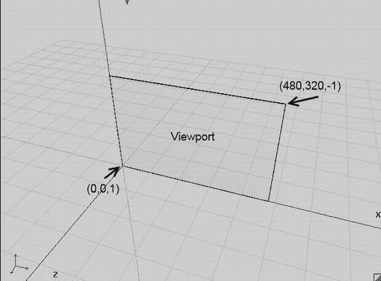

[图 7-6。](#_Fig6)我们用 OpenGL ES 实现 2D 渲染的平行投影视锥

我们的视图截锥很薄，但这没关系，因为我们只在 2D 工作。我们坐标系的可见部分从(0，0，1)到(480，320，–1)。我们在此框中指定的任何点也将在屏幕上可见。这些点将被投影到这个盒子的正面，这是我们心爱的近裁剪平面。然后投影会被拉伸到视口，不管它有多大。假设我们有一台 Nexus One，在风景模式下分辨率为 800×480 像素。当我们指定我们的视见平截头体时，我们可以在 480×320 的坐标系中工作，OpenGL 会将其拉伸到 800×480 的帧缓冲区(如果我们指定视口覆盖整个帧缓冲区)。最重要的是，没有什么能阻止我们使用更疯狂的视锥。我们也可以使用一个带拐角的(1，–1，100)和(2，2，–100)。我们指定的落在这个框内的所有东西都将是可见的，并且会被自动拉伸——非常漂亮！

注意，我们还设置了近剪裁平面和远剪裁平面。因为在这一章中我们将完全忽略 z 坐标，你可能想用 0 来表示近和远；然而，由于各种原因，这是一个坏主意。为了安全起见，我们在 z 轴上给视图截锥一点缓冲。我们所有几何图形的点都将在 x-y 平面中定义，z 设置为 0-2D。

注意你可能已经注意到，y 轴现在指向上方，原点在屏幕的左下角。虽然画布、UI 框架和许多其他 2D 渲染 API 使用 y 向下、原点左上角的约定，但实际上使用这种“新”坐标系进行游戏编程更方便。例如，如果超级马里奥在跳跃，你不希望他在上升的过程中 y 坐标增加而不是减少吗？想在另一个坐标系中工作？好吧，就把 glOrthof()的底部和顶部参数交换一下。此外，虽然视图截锥的图示从几何角度来看大多是正确的，但 glOrthof()实际上对近裁剪平面和远裁剪平面的解释略有不同。因为这有点复杂，我们就假设前面的例子是正确的。

一个有用的片段

这里有一小段将在本章的所有例子中使用。它用黑色清除屏幕，将视口设置为跨越整个帧缓冲区，并设置投影矩阵(从而设置视见平截头体)，以便我们可以在一个舒适的坐标系中工作，原点在屏幕的左下角，y 轴指向上方。

```java
gl.glClearColor(0,0,0,1);
gl.glClear(GL10.GL_COLOR_BUFFER_BIT);
gl.glViewport(0, 0, glGraphics.getWidth(), glGraphics.getHeight());
gl.glMatrixMode(GL10.GL_PROJECTION);
gl.glLoadIdentity();
gl.glOrthof(0, 320, 0, 480, 1, -1);
```

等等，glLoadIdentity()在里面做什么？嗯，OpenGL ES 提供给我们的大多数操作活动矩阵的方法实际上并没有设置矩阵；取而代之的是，它们从所取的任何参数中构造一个临时矩阵，并将其与当前矩阵相乘。glOrthof()方法也不例外。例如，如果我们在每一帧调用 glOrthof()，我们会将投影矩阵与其自身相乘。我们没有这样做，而是在乘以投影矩阵之前，确保我们有一个干净的单位矩阵。记住，矩阵乘以单位矩阵会再次输出矩阵本身，这就是 glLoadIdentity()的作用。可以把它想象成首先加载值 1，然后用它乘以我们拥有的任何东西——在我们的例子中，是 glOrthof()产生的投影矩阵。

请注意，我们的坐标系现在从(0，0，1)变为(320，480，–1)——这是针对肖像模式渲染的。

指定三角形

接下来，我们必须弄清楚如何告诉 OpenGL ES 我们想要它渲染的三角形。首先，让我们定义一下三角形的组成:

*   三角形由三个点组成。
*   每个点称为一个顶点。
*   顶点在 3D 空间中有一个位置。
*   3D 空间中的位置由三个浮点数给出，分别指定 x、y 和 z 坐标。
*   一个顶点可以有额外的属性，比如颜色或者纹理坐标(我们将在后面讨论)。这些也可以用浮点来表示。

OpenGL ES 期望以数组的形式发送我们的三角形定义；但是，鉴于 OpenGL ES 实际上是一个 C API，我们不能只使用标准的 Java 数组。相反，我们必须使用 Java NIO 缓冲区，它只是连续字节的内存块。

一个小的 NIO 缓冲区题外话

准确地说，我们需要使用*直接* NIO 缓冲区。这意味着内存不是在虚拟机的堆内存中分配的，而是在本机堆内存中分配的。要构建这样一个直接的 NIO 缓冲区，我们可以使用下面的代码片段:

```java
ByteBuffer buffer = ByteBuffer.allocateDirect(NUMBER_OF_BYTES);
buffer.order(ByteOrder.nativeOrder());
```

这将分配一个 ByteBuffer，它总共可以容纳 NUMBER_OF_BYTES 个字节，并且它将确保字节顺序等于底层 CPU 使用的字节顺序。NIO 缓冲区有三个属性。

*   容量:缓冲区总共可以容纳的元素数量。
*   Position:下一个元素将被写入或读取的当前位置。
*   Limit:已定义的最后一个元素的索引，加 1。

缓冲区的容量就是它的实际大小。对于 ByteBuffer，它以字节为单位。position 和 limit 属性可以被认为是定义了缓冲区中从 position 开始到 limit (exclusive)结束的段。

因为我们想将顶点指定为浮点，所以最好不要处理字节。幸运的是，我们可以将 ByteBuffer 实例转换为 FloatBuffer 实例，这就允许我们这样做:使用 floats。

```java
FloatBuffer floatBuffer = buffer.asFloatBuffer();
```

在 FloatBuffer 的情况下，容量、位置和限制是以浮点数的形式给出的。我们对这些缓冲区的使用模式将非常有限——它是这样的:

```java
float[] vertices = { ... definitions of vertex positions etc.  ... };
floatBuffer.clear();
floatBuffer.put(vertices);
floatBuffer.flip();
```

我们首先在一个标准的 Java 浮点数组中定义数据。在将浮点数组放入缓冲区之前，我们告诉缓冲区通过 clear()方法清除自身。这实际上不会擦除任何数据，但它会将位置设置为 0，并将容量限制设置为。接下来，我们使用 FloatBuffer.put(float[] array)方法将整个数组的内容复制到缓冲区，从缓冲区的当前位置开始。复制后，缓冲区的位置将增加数组的长度。接下来，调用 put()方法将附加数据追加到我们复制到缓冲区的最后一个数组的数据中。对 FloatBuffer.flip()的最后一次调用只是交换位置和界限。

对于这个例子，让我们假设顶点数组的大小是五个浮点数，并且我们的 FloatBuffer 有足够的容量来存储这五个浮点数。在调用 FloatBuffer.put()之后，缓冲区的位置将是 5(索引 0 到 4 由数组中的五个浮点数占据)。该限制仍将等于缓冲器的容量。调用 FloatBuffer.flip()后，位置将被设置为 0，限制将被设置为 5。对从缓冲区读取数据感兴趣的任何一方将知道它应该从索引 0 到 4 读取浮点数(记住限制是排他的)；这也正是 OpenGL ES 需要知道的。但是，请注意，它会愉快地忽略这个限制。通常，除了向它传递缓冲区之外，我们还必须告诉它要读取的元素的数量。没有错误检查，所以要小心。

有时，在我们填满缓冲区后，手动设置它的位置是很有用的。这可以通过调用以下方法来完成:

```java
FloatBuffer.position(int position)
```

稍后，当我们临时将填充的缓冲区的位置设置为 0 以外的值，以便 OpenGL ES 从特定位置开始读取时，这将会很方便。

将顶点发送到 OpenGL ES

那么我们如何定义第一个三角形的三个顶点的位置呢？简单——假设我们的坐标系是(0，0，1)到(320，480，–1 ),正如我们在前面的代码片段中定义的那样——我们可以做以下事情:

```java
ByteBuffer byteBuffer = ByteBuffer.*allocateDirect*(3 * 2 * 4);
byteBuffer.order(ByteOrder.*nativeOrder*());
FloatBuffer vertices = byteBuffer.asFloatBuffer();
vertices.put(new float [] {   0.0f,   0.0f,
                           319.0f,   0.0f,
                           160.0f, 479.0f  });
vertices.flip();
```

前三行应该已经很熟悉了。唯一有趣的部分是我们分配了多少字节。我们有三个顶点，每个顶点由 x 和 y 坐标组成。每个坐标是一个浮点数，因此占用 4 个字节。那是 3 个顶点 2 个坐标乘以 4 个字节，对于我们的三角形总共是 24 个字节。

**注意**我们只能用 x 和 y 坐标指定顶点，OpenGL ES 会自动为我们将 z 坐标设置为 0。

接下来，我们将保存顶点位置的浮点数组放入缓冲区。我们的三角形从左下角(0，0)开始，到视见体/屏幕的右边缘(319，0)，然后到视见体/屏幕的上边缘的中间。作为优秀的 NIO 缓冲区用户，我们还在缓冲区上调用 flip()方法。因此，位置将是 0，限制将是 6(记住，FloatBuffer 限制和位置是以浮点数而不是字节给出的)。

一旦我们准备好了 NIO 缓冲区，我们就可以告诉 OpenGL ES 用它的当前状态(即视口和投影矩阵)来绘制它。这可以通过下面的代码片段来完成:

```java
gl.glEnableClientState(GL10.*GL_VERTEX_ARRAY*);
gl.glVertexPointer( 2, GL10.*GL_FLOAT*, 0, vertices);
gl.glDrawArrays(GL10.*GL_TRIANGLES*, 0, 3);
```

对 glEnableClientState()的调用有点过时了。它告诉 OpenGL ES 我们要画的顶点有位置。这有点傻，原因有二:

*   这个常数叫做 GL10。GL_VERTEX_ARRAY，有点混乱。如果叫 GL10 就更有意义了。GL_POSITION_ARRAY
*   没有办法画出没有位置的东西，所以调用这个方法有点多余。无论如何，我们这样做是为了让 OpenGL ES 开心。

在对 glVertexPointer()的调用中，我们告诉 OpenGL ES 在哪里可以找到顶点位置，并给它一些附加信息。第一个参数告诉 OpenGL ES，每个顶点位置由两个坐标 x 和 y 组成。如果我们指定了 x、y 和 z，我们就会向该方法传递三个。第二个参数告诉 OpenGL ES 我们用来存储每个坐标的数据类型。在这种情况下，是 GL10。GL_FLOAT，表示我们使用了编码为 4 字节的浮点数。第三个参数 stride 告诉 OpenGL 我们的顶点位置之间的距离，以字节为单位。在前面的例子中，stride 是 0，因为位置被紧密压缩[顶点 1 (x，y)，顶点 2 (x，y)，等等]。最后一个参数是我们的 FloatBuffer，需要记住两件事:

*   FloatBuffer 表示本机堆中的一个内存块，因此有一个起始地址。
*   FloatBuffer 的位置是从起始地址的偏移量。

OpenGL ES 将获取缓冲区的起始地址，并添加缓冲区的位置以到达缓冲区中的浮点值，当我们告诉它绘制缓冲区的内容时，它将从该浮点值开始读取顶点。顶点指针(也应该称为*位置指针*)是 OpenGL ES 的一种状态。只要我们不改变它(并且上下文没有丢失)，OpenGL ES 就会记住它，并在所有需要顶点位置的后续调用中使用它。

最后，调用 glDrawArrays()。它会画出我们的三角形。第一个参数指定了我们将要绘制的图元的类型。在这种情况下，我们说我们想要呈现一个三角形列表，这是通过 GL10 指定的。GL _ 三角形。下一个参数是相对于顶点指针指向的第一个顶点的偏移量。偏移量是以顶点来度量的，而不是以字节或浮点来度量。如果我们指定了不止一个三角形，我们可以使用这个偏移量来只呈现三角形列表的一个子集。最后一个参数告诉 OpenGL ES 应该使用多少个顶点进行渲染。在我们的例子中，有三个顶点。请注意，如果我们绘制 GL10，我们必须始终指定 3 的倍数。GL _ 三角形。每个三角形由三个顶点组成，所以这是有意义的。对于其他基本类型，规则略有不同。

一旦我们发出 glVertexPointer()命令，OpenGL ES 就会将顶点位置传输到 GPU，并存储在那里，以供所有后续的渲染命令使用。每次我们告诉 OpenGL ES 渲染顶点时，它都会从我们上次通过 glVertexPointer()指定的数据中获取它们的位置。

我们的每个顶点可能有更多的属性，而不仅仅是一个位置。另一个属性可能是顶点的颜色。我们通常将那些属性称为*顶点属性*。

你可能想知道 OpenGL ES 如何知道我们的三角形应该有什么颜色，因为我们只有指定的位置。事实证明，对于我们没有指定的任何顶点属性，OpenGL ES 都有合理的默认值。这些默认值中的大多数都可以直接设置。例如，如果我们想为我们绘制的所有顶点设置默认颜色，我们可以使用以下方法:

```java
GL10.glColor4f(float r, float g, float b, float a)
```

这个方法将为所有没有指定颜色的顶点设置默认颜色。颜色以 0.0 到 1.0 范围内的 RGBA 值给出，与之前的透明颜色一样。OpenGL ES 的默认颜色以 is (1，1，1，1)开始，即完全不透明的白色。

这就是我们使用自定义平行投影渲染三角形所需的全部代码——仅 16 行代码，用于清理屏幕、设置视口和投影矩阵、创建 NIO 缓冲区(在其中存储顶点位置)以及绘制三角形！现在比较一下，我们花了六页来向你们解释。当然，我们可以省略细节，使用更粗俗的语言。问题是 OpenGL ES 有时非常复杂，为了避免出现空屏幕，最好了解它的全部内容，而不只是复制和粘贴代码。

把它放在一起

为了完成这一部分，让我们通过一个漂亮的 GLGame 和屏幕实现将所有这些放在一起。清单 7-5 显示了完整的例子。

***[清单 7-5](#_list5) 。****FirstTriangleTest.java*

```java
package com.badlogic.androidgames.glbasics;

import java.nio.ByteBuffer;
import java.nio.ByteOrder;
import java.nio.FloatBuffer;

import javax.microedition.khronos.opengles.GL10;

import com.badlogic.androidgames.framework.Game;
import com.badlogic.androidgames.framework.Screen;
import com.badlogic.androidgames.framework.impl.GLGame;
import com.badlogic.androidgames.framework.impl.GLGraphics;

public class FirstTriangleTest extends GLGame {
    public Screen getStartScreen() {
        return new FirstTriangleScreen(this );
    }
```

FirstTriangleTest 类派生自 GLGame，因此必须实现 Game.getStartScreen()方法。在该方法中，我们创建了一个新的 FirstTriangleScreen，GLGame 将频繁调用它来更新和显示它自己。请注意，当调用此方法时，我们已经在主循环中——或者更确切地说，在 GLSurfaceView 呈现线程中——因此我们可以在 FirstTriangleScreen 类的构造函数中使用 OpenGL ES 方法。让我们仔细看看这个屏幕实现。

```java
    class FirstTriangleScreen extends Screen {
        GLGraphics glGraphics;
        FloatBuffer vertices;
        public FirstTriangleScreen(Game game) {
            super (game);
            glGraphics = ((GLGame)game).getGLGraphics();

            ByteBuffer byteBuffer = ByteBuffer.*allocateDirect*(3 * 2 * 4);
            byteBuffer.order(ByteOrder.*nativeOrder*());
            vertices = byteBuffer.asFloatBuffer();
            vertices.put(new float [] {    0.0f,   0.0f,
                                         319.0f,   0.0f,
                                         160.0f, 479.0f});
            vertices.flip();
        }
```

FirstTriangleScreen 类包含两个成员:一个 GLGraphics 实例和我们可靠的 FloatBuffer，它存储了三角形三个顶点的 2D 位置。在构造函数中，我们从 GLGame 中获取 GLGraphics 实例，并根据前面的代码片段创建和填充 FloatBuffer。由于屏幕构造函数获得了一个游戏实例，我们必须将它转换为一个 GLGame 实例，这样我们就可以使用 GLGame.getGLGraphics()方法。

```java
        @Override
        public void present(float deltaTime) {
            GL10 gl = glGraphics.getGL();
            gl.glViewport(0, 0, glGraphics.getWidth(), glGraphics.getHeight());
            gl.glClear(GL10.*GL_COLOR_BUFFER_BIT*);
            gl.glMatrixMode(GL10.*GL_PROJECTION*);
            gl.glLoadIdentity();
            gl.glOrthof(0, 320, 0, 480, 1, -1);

            gl.glColor4f(1, 0, 0, 1);
            gl.glEnableClientState(GL10.*GL_VERTEX_ARRAY*);
            gl.glVertexPointer( 2, GL10.*GL_FLOAT*, 0, vertices);
            gl.glDrawArrays(GL10.*GL_TRIANGLES*, 0, 3);
        }
```

present()方法反映了我们刚刚讨论的内容:我们设置视口，清除屏幕，设置投影矩阵，以便我们可以在自定义坐标系中工作，设置默认的顶点颜色(在本例中为红色)，指定我们的顶点将有位置，告诉 OpenGL ES 它可以在哪里找到这些顶点位置，最后，呈现我们令人惊叹的红色小三角形。

```java
        @Override
        public void update(float deltaTime) {
            game.getInput().getTouchEvents();
            game.getInput().getKeyEvents();
        }

        @Override
        public void pause() {
        }

        @Override
        public void resume() {
        }

        @Override
        public void dispose() {
        }
    }
}
```

其余的类只是样板代码。在 update()方法中，我们确保事件缓冲区不会被填满。代码的其余部分什么也不做。

**注意**从现在开始，我们将只关注屏幕类本身，因为封闭的 GLGame 派生类，如 FirstTriangleTest，将总是相同的。我们还将通过删除 Screen 类的任何空方法或样板方法来减少一点代码量。下面的例子只是在成员、构造函数和当前方法方面有所不同。

[图 7-7](#Fig7) 显示了[清单 7-5](#list5) 的输出。


[图 7-7。](#_Fig7)我们第一个吸引人的三角形

根据 OpenGL ES 最佳实践，以下是我们在本例中做错的地方:

*   我们一遍又一遍地将相同的状态设置为相同的值，没有任何必要。OpenGL ES 中的状态改变是昂贵的——有些多一点，有些少一点。我们应该总是试图减少我们在单个帧中进行的状态改变的数量。
*   一旦我们设置了视窗和投影矩阵，它们将永远不会改变。我们可以将该代码移动到 resume()方法中，该方法在每次 OpenGL ES 表面被(重新)创建时只被调用一次；这也处理 OpenGL ES 上下文丢失。
*   我们还可以将设置用于清除的颜色和设置默认顶点颜色转移到 resume()方法中。这两种颜色也不会变。
*   我们可以将 glEnableClientState()和 glVertexPointer()方法移到 resume()方法中。
*   我们只需要调用每个框架的 glClear()和 glDrawArrays()。两者都使用当前的 OpenGL ES 状态，只要我们不改变它们，只要我们不因为活动被暂停和恢复而丢失上下文，它们就会保持不变。

如果我们将这些优化付诸实践，我们的主循环中将只有两个 OpenGL ES 调用。为了清楚起见，我们现在将避免使用这种最小状态改变优化。然而，当我们开始编写我们的第一个 OpenGL ES 游戏时，我们将不得不尽我们所能遵循那些实践来保证良好的性能。

让我们给三角形的顶点添加更多的属性，从颜色开始。

**注意**非常非常警觉的读者可能已经注意到[图 7-7](#Fig7) 中的三角形实际上在右下角缺少了一个像素。这可能看起来像一个典型的一个错误，但它实际上是由于 OpenGL ES 光栅化(绘制像素)三角形的方式。有一个特定的三角形栅格化规则是造成这种假象的原因。不用担心——我们最关心的是渲染 2D 矩形(由两个三角形组成),这种效果会消失。

指定逐顶点颜色

在前面的例子中，我们通过 glColor4f()为所有绘制的顶点设置了一个全局默认颜色。有时我们希望有更细粒度的控制(例如，我们希望设置每个顶点的颜色)。OpenGL ES 为我们提供了这一功能，而且它真的很容易使用。我们所要做的就是为每个顶点添加 RGBA 浮动组件，并告诉 OpenGL ES 在哪里可以找到每个顶点的颜色，就像我们告诉它在哪里可以找到每个顶点的位置一样。让我们从给每个顶点添加颜色开始。

```java
int VERTEX_SIZE = (2 + 4) * 4;
ByteBuffer byteBuffer = ByteBuffer.allocateDirect(3 * VERTEX_SIZE);
byteBuffer.order(ByteOrder.nativeOrder());
FloatBuffer vertices = byteBuffer.asFloatBuffer();
vertices.put(new float[] {   0.0f,   0.0f, 1, 0, 0, 1,
                            319.0f,   0.0f, 0, 1, 0, 1,
                            160.0f, 479.0f, 0, 0, 1, 1});
vertices.flip();
```

我们首先要为我们的三个顶点分配一个 ByteBuffer。ByteBuffer 应该有多大？我们每个顶点有两个坐标和四个(RGBA)颜色分量，所以总共有六个浮点数。每个浮点值占用 4 个字节，因此单个顶点使用 24 个字节。我们将这些信息存储在 VERTEX_SIZE 中。当我们调用 ByteBuffer.allocateDirect()时，我们只是将 VERTEX_SIZE 乘以我们希望存储在 ByteBuffer 中的顶点数。剩下的就不言自明了。我们将一个 FloatBuffer 视图放到 ByteBuffer 中，并将顶点放入 ByteBuffer 中。浮动数组的每一行按顺序保存 x 和 y 坐标以及顶点的 R、G、B 和 A 分量。

如果我们要渲染这个，就要告诉 OpenGL ES，我们的顶点不仅有位置，还有颜色属性。和以前一样，我们首先调用 glEnableClientState():

```java
gl.glEnableClientState(GL10.GL_VERTEX_ARRAY);
gl.glEnableClientState(GL10.GL_COLOR_ARRAY);
```

既然 OpenGL ES 知道它可以预期每个顶点的位置和颜色信息，我们必须告诉它在哪里可以找到这些信息:

```java
vertices.position(0);
gl.glVertexPointer(2, GL10.GL_FLOAT, VERTEX_SIZE, vertices);
vertices.position(2);
gl.glColorPointer(4, GL10.GL_FLOAT, VERTEX_SIZE, vertices);
```

我们从设置 FloatBuffer 的位置开始，它将我们的顶点设置为 0。因此，位置指向缓冲区中第一个顶点的 x 坐标。接下来，我们调用 glVertexPointer()。与前一个例子唯一的不同是，我们现在还指定了顶点的大小(记住，它是以字节为单位的)。然后 OpenGL ES 将从缓冲区中我们告诉它开始的位置开始读取顶点位置。对于第二个顶点位置，它会将 VERTEX_SIZE 字节添加到第一个位置的地址，依此类推。

接下来，我们将缓冲区的位置设置为第一个顶点的 R 分量，并调用 glColorPointer()，它告诉 OpenGL ES 在哪里可以找到我们顶点的颜色。第一个参数是每种颜色的组件数量。这总是四个，因为 OpenGL ES 要求我们提供 R、G、B 和每个顶点一个组件。第二个参数指定每个组件的类型。与顶点坐标一样，我们使用 GL10。GL_FLOAT 再次指示每个颜色分量是介于 0 和 1 之间的浮点数。第三个参数是顶点颜色之间的跨度。当然和顶点位置之间的步幅是一样的。最后一个参数是我们的顶点缓冲。

由于我们在 glColorPointer()调用之前调用了 vertices . position(2 ), OpenGL ES 知道可以从缓冲区中的第三个浮点开始找到第一个顶点颜色。如果我们没有将缓冲区的位置设置为 2，OpenGL ES 就会从位置 0 开始读取颜色。那会很糟糕，因为那是我们第一个顶点的 x 坐标。[图 7-8](#Fig8) 显示了 OpenGL ES 将从哪里读取我们的顶点属性，以及它如何为每个属性从一个顶点跳到下一个。

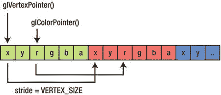

[图 7-8。](#_Fig8)我们的 FloatBuffer 保存顶点，从其中读取位置/颜色的 OpenGL ES 的起始地址，以及用于跳到下一个位置/颜色的 stride

为了绘制三角形，我们再次调用 glDrawElements()，它告诉 OpenGL ES 使用 FloatBuffer 的前三个顶点来绘制三角形:

```java
gl.glDrawElements(GL10.GL_TRIANGLES, 0, 3);
```

因为我们启用了 GL10。GL_VERTEX_ARRAY 和 GL10。GL_COLOR_ARRAY，OpenGL ES 知道应该使用 glVertexPointer()和 glColorPointer()指定的属性。它将忽略默认颜色，因为我们提供了自己的逐顶点颜色。

**注意**我们刚才指定顶点的位置和颜色的方式叫做*交错*。这意味着我们将一个顶点的属性打包在一个连续的内存块中。还有另一种方法可以实现这个目标:*非交错顶点数组*。我们可以使用两个浮动缓冲器，一个用于位置，一个用于颜色。然而，由于内存局部性，交错执行得更好，所以我们在这里不讨论非交错顶点数组。

将所有这些整合到一个新的 GLGame 和屏幕实现中应该是轻而易举的事情。清单 7-6 显示了 ColoredTriangleTest.java 文件的摘录。我们省略了样板代码。

***[清单 7-6](#_list6) 。****摘自 ColoredTriangleTest.java；交错位置和颜色属性*

```java
class ColoredTriangleScreen extends Screen {
    final int VERTEX_SIZE = (2 + 4) * 4;
    GLGraphics glGraphics;
    FloatBuffer vertices;

    public ColoredTriangleScreen(Game game) {
        super (game);
        glGraphics = ((GLGame) game).getGLGraphics();
        ByteBuffer byteBuffer = ByteBuffer.*allocateDirect*(3 * VERTEX_SIZE);
        byteBuffer.order(ByteOrder.*nativeOrder*());
        vertices = byteBuffer.asFloatBuffer();
        vertices.put(new float [] {   0.0f,   0.0f, 1, 0, 0, 1,
                                    319.0f,   0.0f, 0, 1, 0, 1,
                                    160.0f, 479.0f, 0, 0, 1, 1});
        vertices.flip();
    }

    @Override
    public void present(float deltaTime) {
        GL10 gl = glGraphics.getGL();
        gl.glViewport(0, 0, glGraphics.getWidth(), glGraphics.getHeight());
        gl.glClear(GL10.*GL_COLOR_BUFFER_BIT*);
        gl.glMatrixMode(GL10.*GL_PROJECTION*);
        gl.glLoadIdentity();
        gl.glOrthof(0, 320, 0, 480, 1, -1);

        gl.glEnableClientState(GL10.*GL_VERTEX_ARRAY*);
        gl.glEnableClientState(GL10.*GL_COLOR_ARRAY*);

        vertices.position(0);
        gl.glVertexPointer(2, GL10.*GL_FLOAT*, VERTEX_SIZE, vertices);
        vertices.position(2);
        gl.glColorPointer(4, GL10.*GL_FLOAT*, VERTEX_SIZE, vertices);

        gl.glDrawArrays(GL10.*GL_TRIANGLES*, 0, 3);
    }
```

酷——这看起来仍然很简单。与前面的例子相比，我们简单地在我们的 FloatBuffer 中的每个顶点添加了四个颜色分量，并启用了 GL10。GL_COLOR_ARRAY 最好的一点是，我们在下面的例子中添加的任何额外的顶点属性都将以同样的方式工作。我们只是告诉 OpenGL ES 不要为那个特定的属性使用默认值；相反，我们告诉它在我们的 FloatBuffer 中查找属性，从特定的位置开始，按 VERTEX_SIZE 字节从一个顶点移动到另一个顶点。

现在，我们也可以关闭 GL10。GL_COLOR_ARRAY，以便 OpenGL ES 再次使用默认的顶点颜色，我们可以像前面一样通过 glColor4f()来指定。为此我们可以称之为

```java
gl.glDisableClientState(GL10.GL_COLOR_ARRAY);
```

OpenGL ES 将关闭从我们的浮动缓冲区读取颜色的功能。如果我们已经通过 glColorPointer()设置了一个颜色指针，OpenGL ES 会记住这个指针，即使我们只是告诉 OpenGL ES 不要使用它。

为了结束这个例子，让我们看一下前面程序的输出。[图 7-9](#Fig9) 为截图。

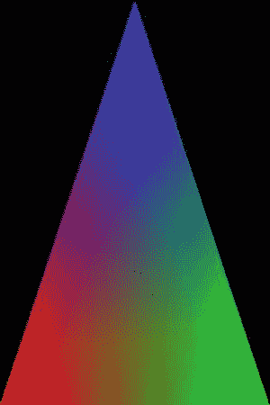

[图 7-9。](#_Fig9)逐顶点彩色三角形

哇，这太棒了！对于 OpenGL ES 将如何使用我们指定的三种颜色(红色用于左下顶点，绿色用于右下顶点，蓝色用于上顶点)，我们没有做任何假设。原来它会为我们插值顶点之间的颜色。有了这个，我们可以很容易地创建漂亮的渐变。；然而，颜色本身不会让我们快乐很久。我们想用 OpenGL ES 画图像。这就是*纹理贴图* 发挥作用的地方。

纹理映射:壁纸变得简单

当我们编写 Nom 先生时，我们加载了一些位图并直接将它们绘制到帧缓冲区——不涉及旋转，只需要一点点缩放，这很容易实现。在 OpenGL ES 中，我们最关心的是三角形，它可以有我们想要的任何方向和比例。那么，如何用 OpenGL ES 渲染位图呢？

很简单，只需将位图加载到 OpenGL ES(就此而言，加载到 GPU，它有自己的专用 RAM)，为我们三角形的每个顶点添加一个新属性，并告诉 OpenGL ES 渲染我们的三角形，并将位图(在 OpenGL ES 中也称为*纹理*)应用到三角形。让我们首先看看这些新的顶点属性实际上指定了什么。

纹理坐标

要将位图映射到三角形，我们需要将*纹理坐标*添加到三角形的每个顶点。什么是纹理坐标？它指定纹理(我们上传的位图)中的一个点映射到三角形的一个顶点。纹理坐标通常是 2D。

虽然我们称我们的位置坐标为 x、y 和 z，但是纹理坐标通常被称为 u 和 v 或者 s 和 t，这取决于你所在的图形程序员圈子。OpenGL ES 称它们为 s 和 t，所以这就是我们要坚持的。如果你在网上阅读使用 u/v 命名法的资源，不要混淆:它和 s，t 是一样的，坐标系是什么样子的？[图 7-10](#Fig10) 显示了我们将 Bob 上传到 OpenGL ES 后，他在纹理坐标系中的样子。

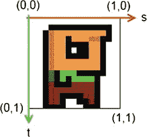

[图 7-10。](#_Fig10) Bob，上传到 OpenGL ES，显示在纹理坐标系中

这里发生了一些有趣的事情。首先，s 等于标准坐标系中的 x 坐标，t 等于 y 坐标。s 轴指向右侧，t 轴指向下方。坐标系的原点与 Bob 图像的左上角重合。图像的右下角映射到(1，1)。

那么，像素坐标怎么了？原来 OpenGL ES 不是很喜欢他们。相反，我们上传的任何图像，无论其宽度和高度是多少像素，都将嵌入到这个坐标系中。图像的左上角将始终位于(0，0)，右下角将始终位于(1，1)—即使宽度是高度的两倍。我们称这些*为归一化坐标*，它们实际上有时会让我们的生活变得更容易。现在，我们如何将 Bob 映射到我们的三角形？简单，我们只要给三角形的每个顶点一个 Bob 坐标系中的纹理坐标对。[图 7-11](#Fig11) 显示了一些配置。


[图 7-11。](#_Fig11)三个不同的三角形映射到 Bob 名称 v1、v2 和 v3 各自指定三角形的一个顶点

我们可以把我们的三角形的顶点映射到纹理坐标系。请注意，三角形在位置坐标系中的方向不必与它在纹理坐标系中的方向相同。坐标系完全解耦。因此，让我们看看如何将这些纹理坐标添加到我们的顶点:

```java
int VERTEX_SIZE = (2 + 2) * 4;
ByteBuffer byteBuffer = ByteBuffer.allocateDirect(3 * VERTEX_SIZE);
byteBuffer.order(ByteOrder.nativeOrder());
vertices = byteBuffer.asFloatBuffer();
vertices.put(new float [] {    0.0f,   0.0f, 0.0f, 1.0f,
                             319.0f,   0.0f, 1.0f, 1.0f,
                             160.0f, 479.0f, 0.5f, 0.0f});
vertices.flip();
```

那很容易。我们所要做的就是确保我们的缓冲区中有足够的空间，然后将纹理坐标附加到每个顶点。前面的代码对应于图 7-10 中[最右边的映射。请注意，我们的顶点位置仍然在我们通过投影定义的常用坐标系中给出。如果我们愿意，我们也可以给每个顶点添加颜色属性，就像前面的例子一样。然后，OpenGL ES 会动态地将插值的顶点颜色与三角形映射到的纹理像素的颜色混合。当然，我们需要相应地调整缓冲区的大小以及 VERTEX_SIZE 常量；比如(2 + 4 + 2) × 4。为了告诉 OpenGL ES 我们的顶点有纹理坐标，我们再次使用 glEnableClientState()和 glTexCoordPointer()方法，该方法的行为与 glVertexPointer()和 glColorPointer()完全相同(这里可以看出一个模式吗？):](#Fig10)

```java
gl.glEnableClientState(GL10.GL_VERTEX_ARRAY);
gl.glEnableClientState(GL10.GL_TEXTURE_COORD_ARRAY);

vertices.position(0);
gl.glVertexPointer(2, GL10.GL_FLOAT, VERTEX_SIZE, vertices);
vertices.position(2);
gl.glTexCoordPointer(2, GL10.GL_FLOAT, VERTEX_SIZE, vertices);
```

不错——看起来很眼熟。那么，剩下的问题是，我们如何将纹理上传到 OpenGL ES 并告诉它将其映射到我们的三角形？自然，这就有点复杂了。但是不要害怕，这仍然很容易。

上传位图

首先，我们必须加载我们的位图。我们已经知道如何在 Android 上做到这一点:

```java
Bitmap bitmap = BitmapFactory.decodeStream(game.getFileIO().readAsset("bobrgb888.png"));
```

这里我们以 RGB888 配置加载 Bob。接下来我们需要做的是告诉 OpenGL ES 我们想要创建一个新的纹理。OpenGL ES 对一些东西有对象的概念，比如纹理。要创建一个纹理对象，我们可以调用下面的方法:

```java
GL10.glGenTextures(int numTextures, int [] ids, int offset)
```

第一个参数指定我们想要创建多少个纹理对象。通常，我们只想创建一个。下一个参数是一个 int 数组，OpenGL ES 将把生成的纹理对象的 id 写入这个数组。最后一个参数只是告诉 OpenGL ES 应该从哪里开始在数组中写入 id。

你已经知道 OpenGL ES 是一个 C API。自然，它不能为一个新的纹理返回一个 Java 对象；相反，它给我们一个 ID，或者说是那个纹理的句柄。每次我们想让 OpenGL ES 用那个特定的纹理做一些事情，我们指定它的 ID。下面是一个更完整的代码片段，展示了如何生成一个新的纹理对象并获取其 ID:

```java
int textureIds[] = new int [1];
gl.glGenTextures(1, textureIds, 0);
int textureId = textureIds[0];
```

纹理对象仍然是空的，这意味着它还没有任何图像数据。让我们上传我们的位图。为此，我们首先要绑定纹理。绑定 OpenGL ES 中的某个东西意味着我们希望 OpenGL ES 在所有后续调用中使用该特定对象，直到我们再次改变绑定。在这里，我们想要绑定一个纹理对象，方法 glBindTexture()可用于该对象。一旦我们绑定了一个纹理，我们就可以操作它的属性，比如图像数据。下面是我们将 Bob 上传到新的纹理对象的方法:

```java
gl.glBindTexture(GL10.*GL_TEXTURE_2D*, textureId);
GLUtils.*texImage2D*(GL10.*GL_TEXTURE_2D*, 0, bitmap, 0);
```

首先，我们用 glBindTexture()绑定纹理对象。第一个参数指定了我们想要绑定的纹理类型。我们的鲍勃的形象是 2D，所以我们使用 GL10。2D 纹理。还有其他的纹理类型，但是在本书中我们不需要它们。我们将始终指定 GL10。GL_TEXTURE_2D 用于需要知道我们想要处理的纹理类型的方法。该方法的第二个参数是我们的纹理 ID。一旦方法返回，所有使用 2D 纹理的后续方法都将使用我们的纹理对象。

下一个方法调用调用由 Android 框架提供的 LUtils 类的方法。通常，上传纹理图像的任务是相当复杂的；这个小助手类大大减轻了我们的痛苦。我们需要做的就是指定纹理类型(GL10。GL_TEXTURE_2D)，mipmapping 级别(我们会在[第 11 章](11.html)里看那个；默认为 0)、我们要上传的位图，以及另一个参数，在所有情况下都必须设置为 0。在这个调用之后，我们的纹理对象已经附加了图像数据。

**注意**纹理对象及其图像数据实际上保存在视频 RAM 中，而不是我们通常的 RAM 中。当 OpenGL ES 上下文被破坏时(例如，当我们的活动被暂停和恢复时)，纹理对象(和图像数据)将会丢失。这意味着我们必须重新创建纹理对象，并在每次重新创建 OpenGL ES 上下文时重新加载我们的图像数据。如果我们不这样做，我们只会看到一个白色的三角形。

纹理过滤

在使用纹理对象之前，我们还需要定义最后一件事。事实上，我们的三角形在屏幕上占用的像素可能比纹理映射区域中的像素多或少。例如 [图 7-10](#Fig10) 中鲍勃的图像尺寸为 128×128 像素。我们的三角形映射到图像的一半，所以它使用纹理的(128×128) / 2 像素(也称为*纹理像素*)。当我们使用前面代码片段中定义的坐标将三角形绘制到屏幕上时，它将占用(320×480) / 2 个像素。我们在屏幕上使用的像素比我们从纹理贴图中获取的像素要多得多。当然，也可以反过来:我们在屏幕上使用的像素少于纹理映射区域的像素。第一种情况称为*放大*、，第二种情况称为*缩小*。对于每种情况，我们需要告诉 OpenGL ES 它应该如何放大或缩小纹理。在 OpenGL ES 行话中，放大和缩小也被称为缩小和放大过滤器。这些过滤器是我们的纹理对象的属性，很像图像数据本身。要设置它们，我们首先必须确保通过调用 glBindTexture()来绑定纹理对象。如果是这种情况，我们可以这样设置它们:

```java
gl.glTexParameterf(GL10.GL_TEXTURE_2D, GL10.GL_TEXTURE_MIN_FILTER, GL10.GL_NEAREST);
gl.glTexParameterf(GL10.GL_TEXTURE_2D, GL10.GL_TEXTURE_MAG_FILTER, GL10.GL_NEAREST);
```

两次我们都使用方法 GL10.glTexParameterf()，它设置纹理的属性。在第一次调用中，我们指定缩小过滤器；在第二个例子中，我们称之为放大过滤器。该方法的第一个参数是纹理类型，默认为 GL10。2D 纹理。第二个参数告诉方法我们想要设置哪些属性——在我们的例子中是 GL10。GL_TEXTURE_MIN_FILTER 和 GL10。GL_TEXTURE_MAG_FILTER 最后一个参数指定应该使用的过滤器类型。我们这里有两个选择:GL10。GL_NEAREST 和 GL10。GL_LINEAR。

第一种过滤器类型将总是选择纹理图中最近的纹理元素来映射到一个像素。第二种过滤器类型将对三角形的一个像素的四个最近的纹理元素进行采样，并对它们进行平均以得到最终的颜色。如果我们想要一个像素化的外观，我们使用第一种类型的过滤器，如果我们想要一个平滑的外观，我们使用第二种。[图 7-12](#Fig12) 显示了这两种过滤器的区别。


[图 7-12。](#_Fig12) GL10。GL_NEAREST vs. GL10。GL_LINEAR。第一种过滤器类型产生像素化的外观；第二个稍微缓和了一些

我们的纹理对象现在已经完全定义好了:我们创建了一个 ID，设置了图像数据，并指定了在我们的渲染不是像素完美的情况下要使用的过滤器。一旦我们定义好纹理，通常的做法是解除绑定。我们还应该回收我们加载的位图，因为我们不再需要它。(为什么要浪费内存？)这可以通过下面的代码片段来实现:

```java
gl.glBindTexture(GL10.GL_TEXTURE_2D, 0);
bitmap.recycle();
```

这里，0 是一个特殊的 ID，它告诉 OpenGL ES 应该解除当前绑定的对象。当然，如果我们想使用纹理来绘制三角形，我们需要再次绑定它。

处理纹理

如果我们不再需要纹理对象，知道如何从视频 RAM 中删除它也很有用(就像我们使用 Bitmap.recycle()来释放位图的内存)。这可以通过下面的代码片段来实现:

```java
gl.glBindTexture(GL10.GL_TEXTURE_2D, 0);
int textureIds = { textureid };
gl.glDeleteTextures(1, textureIds, 0);
```

请注意，在删除纹理对象之前，我们首先必须确保它当前没有被绑定。其余部分类似于我们如何使用 glGenTextures()创建纹理对象。

一个有用的片段

作为参考，下面是在 Android 上创建纹理对象、加载图像数据和设置过滤器的完整代码片段:

```java
Bitmap bitmap = BitmapFactory.*decodeStream*(game.getFileIO().readAsset("bobrgb888.png"));
int textureIds[] = new int [1];
gl.glGenTextures(1, textureIds, 0);
int textureId = textureIds[0];
gl.glBindTexture(GL10.*GL_TEXTURE_2D*, textureId);
GLUtils.*texImage2D*(GL10.*GL_TEXTURE_2D*, 0, bitmap, 0);
gl.glTexParameterf(GL10.*GL_TEXTURE_2D*, GL10.*GL_TEXTURE_MIN_FILTER*, GL10.*GL_NEAREST*);
gl.glTexParameterf(GL10.*GL_TEXTURE_2D*, GL10.*GL_TEXTURE_MAG_FILTER*, GL10.*GL_NEAREST*);
gl.glBindTexture(GL10.*GL_TEXTURE_2D*, 0);
bitmap.recycle();
```

毕竟没那么糟。所有这些最重要的部分是在我们完成后回收位图；否则，我们会浪费内存。我们的图像数据安全地存储在纹理对象的视频 RAM 中(直到上下文丢失，我们需要重新加载它)。

启用纹理

在我们用纹理绘制三角形之前，还有一件事要完成。我们需要绑定纹理，我们需要告诉 OpenGL ES，它实际上应该将纹理应用于我们渲染的所有三角形。是否进行纹理映射是 OpenGL ES 的另一种状态，我们可以通过以下方法来启用和禁用:

```java
GL10.glEnable(GL10.GL_TEXTURE_2D);
GL10.glDisable(GL10.GL_TEXTURE_2D);
```

这些看起来有点眼熟。在前面几节中启用/禁用顶点属性时，我们使用了 glEnableClientState()/glDisableClientState()。正如我们前面提到的，这些都是 OpenGL 早期的遗物。这些没有与 glEnable()/glDisable()合并是有原因的，但我们在这里不会深入讨论。只需要记住使用 glEnableClientState()/glDisableClientState()来启用和禁用顶点属性，使用 glEnable()/glDisable()用于 OpenGL 的任何其他状态，比如纹理。

把它放在一起

这样一来，我们现在可以写一个小例子把所有这些放在一起。[清单 7-7](#list7) 显示了 theTexturedTriangleTest.java 源文件的摘录，只列出了其中包含的 TexturedTriangleScreen 类的相关部分。

***[清单 7-7](#_list7) 。****摘自 TexturedTriangleTest.java；纹理一个三角形*

```java
class TexturedTriangleScreen extends Screen {
    final int VERTEX_SIZE = (2 + 2) * 4;
    GLGraphics glGraphics;
    FloatBuffer vertices;
    int textureId;

    public TexturedTriangleScreen(Game game) {
        super (game);
        glGraphics = ((GLGame) game).getGLGraphics();

        ByteBuffer byteBuffer = ByteBuffer.*allocateDirect*(3 * VERTEX_SIZE);
        byteBuffer.order(ByteOrder.*nativeOrder*());
        vertices = byteBuffer.asFloatBuffer();
        vertices.put(new float [] {    0.0f,   0.0f, 0.0f, 1.0f,
                                     319.0f,   0.0f, 1.0f, 1.0f,
                                     160.0f, 479.0f, 0.5f, 0.0f});
        vertices.flip();
        textureId = loadTexture("bobrgb888.png");
    }

    public int loadTexture(String fileName) {
        try {
            Bitmap bitmap = BitmapFactory.*decodeStream*(game.getFileIO().readAsset(fileName));
            GL10 gl = glGraphics.getGL();
            int textureIds[] = new int [1];
            gl.glGenTextures(1, textureIds, 0);
            int textureId = textureIds[0];
            gl.glBindTexture(GL10.*GL_TEXTURE_2D*, textureId);
            GLUtils.*texImage2D*(GL10.*GL_TEXTURE_2D*, 0, bitmap, 0);
            gl.glTexParameterf(GL10.*GL_TEXTURE_2D*, GL10.*GL_TEXTURE_MIN_FILTER*, GL10.*GL_NEAREST*);
            gl.glTexParameterf(GL10.*GL_TEXTURE_2D*, GL10.*GL_TEXTURE_MAG_FILTER*, GL10.*GL_NEAREST*);
            gl.glBindTexture(GL10.*GL_TEXTURE_2D*, 0);
            bitmap.recycle();
            return textureId;
        } catch (IOException e) {
            Log.*d*("TexturedTriangleTest", "couldn't load asset 'bobrgb888.png'!");
            throw new RuntimeException("couldn't load asset '" + fileName + "'");
        }
    }

    @Override
    public void present(float deltaTime) {
        GL10 gl = glGraphics.getGL();
        gl.glViewport(0, 0, glGraphics.getWidth(), glGraphics.getHeight());
        gl.glClear(GL10.*GL_COLOR_BUFFER_BIT*);
        gl.glMatrixMode(GL10.*GL_PROJECTION*);
        gl.glLoadIdentity();
        gl.glOrthof(0, 320, 0, 480, 1, -1);

        gl.glEnable(GL10.*GL_TEXTURE_2D*);
        gl.glBindTexture(GL10.*GL_TEXTURE_2D*, textureId);

        gl.glEnableClientState(GL10.*GL_VERTEX_ARRAY*);
        gl.glEnableClientState(GL10.*GL_TEXTURE_COORD_ARRAY*);

        vertices.position(0);
        gl.glVertexPointer(2, GL10.*GL_FLOAT*, VERTEX_SIZE, vertices);
        vertices.position(2);
        gl.glTexCoordPointer(2, GL10.*GL_FLOAT*, VERTEX_SIZE, vertices);

        gl.glDrawArrays(GL10.*GL_TRIANGLES*, 0, 3);
    }
```

我们可以自由地将纹理加载到一个名为 loadTexture()的方法中，该方法只接受要加载的位图的文件名。该方法返回由 OpenGL ES 生成的纹理对象 ID，我们将在 present()方法中使用它来绑定纹理。

我们的三角形的定义不应该是一个大惊喜；我们只是给每个顶点添加了纹理坐标。

present()方法做它一直做的事情:它清除屏幕并设置投影矩阵。接下来，我们通过调用 glEnable()来启用纹理映射，并绑定我们的纹理对象。剩下的只是我们之前做的:启用我们想要使用的顶点属性；告诉 OpenGL ES 在哪里可以找到它们，用什么步长；最后，通过调用 glDrawArrays()来绘制三角形。[图 7-13](#Fig13) 显示了前面代码的输出。

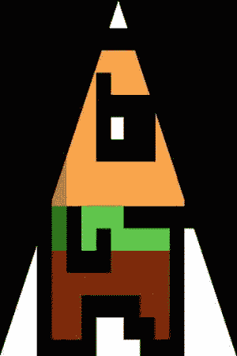

[图 7-13。纹理映射鲍勃到我们的三角形](#_Fig13)

还有最后一件事我们还没有提到，它非常重要:我们加载的所有位图的宽度和高度必须是 2 的幂。坚持下去，否则东西会爆炸。

那么这实际上意味着什么呢？我们在示例中使用的 Bob 的图像大小为 128×128 像素。值 128 是 2 的 7 次方(2×2×2×2×2×2×2)。其他有效的图像大小包括 2×8、32×16、128×256 等。我们的图像可以有多大也是有限制的。遗憾的是，这取决于我们的应用运行的硬件。OpenGL ES 1.x 标准没有指定最低支持的纹理大小；然而，从经验来看，512×512 像素的纹理似乎可以在所有当前的 Android 设备上工作(并且很可能也可以在所有未来的设备上工作)。我们甚至可以说 1024×1024 也可以。

到目前为止，我们忽略的另一个问题是纹理的颜色深度。幸运的是，我们用来将图像数据上传到 GPU 的方法 LUtils.texImage2D()很好地解决了这个问题。OpenGL ES 可以处理 RGBA8888、RGB565 等颜色深度。我们应该始终努力使用尽可能低的色深来降低带宽。为此，我们可以使用位图工厂。选项类在内存中将 RGB888 位图加载到 RGB565 位图。一旦我们用我们想要的颜色深度加载了我们的位图实例，LUtils.texImage2D()就会接管并确保 OpenGL ES 以正确的格式获取图像数据。当然，你应该经常检查颜色深度的减少是否对你的游戏的视觉保真度有负面影响。

纹理类

为了减少后续示例所需的代码，我们编写了一个名为 Texture 的小助手类。它将从资源中加载一个位图，并从中创建一个纹理对象。它也有一些方便的方法来绑定和处理纹理。清单 7-8 显示了代码。

***[清单 7-8](#_list8) 。****Texture.java*，一点 OpenGL ES 纹理类

```java
package com.badlogic.androidgames.framework.gl;

import java.io.IOException;
import java.io.InputStream;

import javax.microedition.khronos.opengles.GL10;

import android.graphics.Bitmap;
import android.graphics.BitmapFactory;
import android.opengl.GLUtils;

import com.badlogic.androidgames.framework.FileIO;
import com.badlogic.androidgames.framework.impl.GLGame;
import com.badlogic.androidgames.framework.impl.GLGraphics;

public class Texture {
    GLGraphics glGraphics;
    FileIO fileIO;
    String fileName;
    int textureId;
    int minFilter;
    int magFilter;
    int width;
    int height;

    public Texture(GLGame glGame, String fileName) {
        this.glGraphics = glGame.getGLGraphics();
        this.fileIO = glGame.getFileIO();
        this.fileName = fileName;
        load();
    }

    private void load() {
        GL10 gl = glGraphics.getGL();
        int [] textureIds = new int [1];
        gl.glGenTextures(1, textureIds, 0);
        textureId = textureIds[0];

        InputStream in = null ;
        try {
            in = fileIO.readAsset(fileName);
            Bitmap bitmap = BitmapFactory.*decodeStream*(in);
            width = bitmap.getWidth();
            height = bitmap.getHeight();
            gl.glBindTexture(GL10.*GL_TEXTURE_2D*, textureId);
            GLUtils.*texImage2D*(GL10.*GL_TEXTURE_2D*, 0, bitmap, 0);
            setFilters(GL10.*GL_NEAREST*, GL10.*GL_NEAREST*);
            gl.glBindTexture(GL10.*GL_TEXTURE_2D*, 0);
        } catch (IOException e) {
            throw new RuntimeException("Couldn't load texture '" + fileName + "'", e);
        } finally {
            if (in != null )
                try { in.close(); } catch (IOException e) { }
        }
    }

    public void reload() {
        load();
        bind();
        setFilters(minFilter, magFilter);
        glGraphics.getGL().glBindTexture(GL10.*GL_TEXTURE_2D*, 0);
    }

    public void setFilters(int minFilter, int magFilter) {
        this.minFilter = minFilter;
        this.magFilter = magFilter;
        GL10 gl = glGraphics.getGL();
        gl.glTexParameterf(GL10.*GL_TEXTURE_2D*, GL10.*GL_TEXTURE_MIN_FILTER*, minFilter);
        gl.glTexParameterf(GL10.*GL_TEXTURE_2D*, GL10.*GL_TEXTURE_MAG_FILTER*, magFilter);
    }

    public void bind() {
        GL10 gl = glGraphics.getGL();
        gl.glBindTexture(GL10.*GL_TEXTURE_2D*, textureId);
    }

    public void dispose() {
        GL10 gl = glGraphics.getGL();
        gl.glBindTexture(GL10.*GL_TEXTURE_2D*, textureId);
        int [] textureIds = { textureId };
        gl.glDeleteTextures(1, textureIds, 0);
    }
}
```

这个类唯一有趣的地方是 reload()方法，当 OpenGL ES 上下文丢失时我们可以使用它。还要注意，setFilters()方法只有在纹理实际绑定的情况下才有效。否则，它将设置当前绑定纹理的过滤器。

我们也可以为顶点缓冲区写一个小的辅助方法。但在我们这样做之前，我们还得讨论一件事:索引顶点。

索引顶点:因为重复使用对你有好处

到目前为止，我们已经定义了三角形列表，其中每个三角形都有自己的顶点集。我们实际上只画了一个三角形，但是增加更多的三角形并不是什么大事。

然而，在某些情况下，两个或多个三角形可以共享一些顶点。让我们想想如何用现有的知识绘制一个矩形。我们简单地定义两个三角形，这两个三角形的两个顶点具有相同的位置、颜色和纹理坐标。我们可以做得更好。[图 7-14](#Fig14) 显示了渲染矩形的旧方法和新方法。


[图 7-14。](#_Fig14)将一个矩形渲染成两个有六个顶点的三角形(左)，渲染成有四个顶点(右)

我们只定义这些顶点一次，而不是用顶点 v4 和 v6 复制顶点 v1 和 v2。在这种情况下，我们仍然渲染两个三角形，但我们明确告诉 OpenGL ES 每个三角形使用哪些顶点(即，第一个三角形使用 v1、v2 和 v3，第二个三角形使用 v3、v4 和 v1)，每个三角形使用哪些顶点是通过顶点数组中的索引定义的。数组中的第一个顶点的索引为 0，第二个顶点的索引为 1，依此类推。对于前面的矩形，我们有一个索引列表，如下所示:

```java
short[] indices = { 0, 1, 2,
                    2, 3, 0  };
```

顺便提一下，OpenGL ES 希望我们将索引指定为 shorts(这不完全正确；我们也可以使用字节)。然而，与顶点数据一样，我们不能只将一个短数组传递给 OpenGL ES。它需要一个直接的短缓冲区。我们已经知道如何处理:

```java
ByteBuffer byteBuffer = ByteBuffer.allocate(indices.length * 2);
byteBuffer.order(ByteOrder.nativeOrder());
ShortBuffer shortBuffer = byteBuffer.asShortBuffer();
shortBuffer.put(indices);
shortBuffer.flip();
```

一个 short 需要 2 字节的内存，所以我们为我们的 ShortBuffer 分配 indexes . length×2 字节。我们再次将顺序设置为 native，并获得一个 ShortBuffer 视图，这样我们可以更容易地处理底层的 ByteBuffer。剩下的就是把我们的索引放入 ShortBuffer 并翻转它，这样限制和位置就设置正确了。

如果我们想把 Bob 画成一个有两个索引三角形的矩形，我们可以这样定义我们的顶点:

```java
ByteBuffer byteBuffer = ByteBuffer.allocateDirect(4 * VERTEX_SIZE);
byteBuffer.order(ByteOrder.nativeOrder());
vertices = byteBuffer.asFloatBuffer();
vertices.put(new float [] {  100.0f, 100.0f, 0.0f, 1.0f,
                            228.0f, 100.0f, 1.0f, 1.0f,
                            228.0f, 229.0f, 1.0f, 0.0f,
                            100.0f, 228.0f, 0.0f, 0.0f });
vertices.flip();
```

顶点的顺序与图 7-14 右边部分的顺序完全相同。我们告诉 OpenGL ES 我们有顶点的位置和纹理坐标，并且它可以通过调用 glEnableClientState()和 glVertexPointer()/glTexCoordPointer()找到这些顶点属性。唯一的区别是我们调用的绘制两个三角形的方法:

```java
gl.glDrawElements(GL10.*GL_TRIANGLES*, 6, GL10.*GL_UNSIGNED_SHORT*, indices);
```

这个方法其实和 glDrawArrays()很像。第一个参数指定了我们想要呈现的图元的类型——在本例中，是一个三角形列表。下一个参数指定我们想要使用多少个顶点，在我们的例子中是 6 个。第三个参数指定索引的类型——我们指定无符号短整型。注意，Java 没有无符号类型；然而，考虑到有符号数的单补码编码，使用实际保存有符号短整型数的 ShortBuffer 是可以的。最后一个参数是保存六个索引的 ShortBuffer。

那么，OpenGL ES 会做什么呢？它知道我们要渲染三角形，它知道我们要渲染两个三角形，因为我们指定了六个顶点；但是，OpenGL ES 不是从顶点数组中顺序提取六个顶点，而是顺序遍历索引缓冲区并使用它已经索引的顶点。

把它放在一起

当我们把它们放在一起时，我们得到了清单 7-9 中的代码。

***[清单 7-9](#_list9) 。****摘自 IndexedTest.java；绘制两个索引三角形*

```java
class IndexedScreen extends Screen {
    final int VERTEX_SIZE = (2 + 2) * 4;
    GLGraphics glGraphics;
    FloatBuffer vertices;
    ShortBuffer indices;
    Texture texture;

    public IndexedScreen(Game game) {
        super (game);
        glGraphics = ((GLGame) game).getGLGraphics();

        ByteBuffer byteBuffer = ByteBuffer.*allocateDirect*(4 * VERTEX_SIZE);
        byteBuffer.order(ByteOrder.*nativeOrder*());
        vertices = byteBuffer.asFloatBuffer();
        vertices.put(new float [] {  100.0f, 100.0f, 0.0f, 1.0f,
                                    228.0f, 100.0f, 1.0f, 1.0f,
                                    228.0f, 228.0f, 1.0f, 0.0f,
                                    100.0f, 228.0f, 0.0f, 0.0f });
        vertices.flip();

        byteBuffer = ByteBuffer.*allocateDirect*(6 * 2);
        byteBuffer.order(ByteOrder.*nativeOrder*());
        indices = byteBuffer.asShortBuffer();
        indices.put(new short [] { 0, 1, 2,
                                  2, 3, 0 });
        indices.flip();
        texture = new Texture((GLGame)game, "bobrgb888.png");
    }

    @Override
    public void present(float deltaTime) {
        GL10 gl = glGraphics.getGL();
        gl.glViewport(0, 0, glGraphics.getWidth(), glGraphics.getHeight());
        gl.glClear(GL10.*GL_COLOR_BUFFER_BIT*);
        gl.glMatrixMode(GL10.*GL_PROJECTION*);
        gl.glLoadIdentity();
        gl.glOrthof(0, 320, 0, 480, 1, -1);

        gl.glEnable(GL10.*GL_TEXTURE_2D*);
        texture.bind();

        gl.glEnableClientState(GL10.*GL_TEXTURE_COORD_ARRAY*);
        gl.glEnableClientState(GL10.*GL_VERTEX_ARRAY*);

        vertices.position(0);
        gl.glVertexPointer(2, GL10.*GL_FLOAT*, VERTEX_SIZE, vertices);
        vertices.position(2);
        gl.glTexCoordPointer(2, GL10.*GL_FLOAT*, VERTEX_SIZE, vertices);

        gl.glDrawElements(GL10.*GL_TRIANGLES*, 6, GL10.*GL_UNSIGNED_SHORT*, indices);
    }
```

请注意我们的 awesome 纹理类的使用，它大大降低了代码的大小。[图 7-15](#Fig15) 显示了输出，以及鲍勃的所有荣耀。


[图 7-15。](#_Fig15)鲍勃，编入索引

现在，这非常接近我们如何使用画布。我们也有了更多的灵活性，因为我们不再局限于轴对齐的矩形。

这个例子已经涵盖了我们现在需要知道的关于顶点的所有内容。我们看到，每个顶点必须至少有一个位置，并可以有额外的属性，如颜色，给定为四个 RGBA 浮点值和纹理坐标。我们还看到，如果我们想避免重复，我们可以通过索引重用顶点。这给了我们一点点性能提升，因为 OpenGL ES 不需要用投影和模型视图矩阵乘以比绝对必要的更多的顶点(这也不完全正确，但让我们坚持这种解释)。

顶点类

让我们通过创建一个顶点类来使我们的代码更容易编写，该类可以保存最大数量的顶点，并且可以选择保存用于渲染的索引。它还应该负责启用渲染所需的所有状态，以及在渲染完成后清理状态，以便其他代码可以依赖于一组干净的 OpenGL ES 状态。清单 7-10 显示了我们易于使用的顶点类。

***[清单 7-10](#_list10) 。****【Vertices.java】；封装(索引)顶点*

```java
package com.badlogic.androidgames.framework.gl;

import java.nio.ByteBuffer;
import java.nio.ByteOrder;
import java.nio.FloatBuffer;
import java.nio.ShortBuffer;

import javax.microedition.khronos.opengles.GL10;

import com.badlogic.androidgames.framework.impl.GLGraphics;

public class Vertices {
    final GLGraphics glGraphics;
    final boolean hasColor;
    final boolean hasTexCoords;
    final int vertexSize;
    final FloatBuffer vertices;
    final ShortBuffer indices;
```

Vertices 类有一个对 GLGraphics 实例的引用，所以我们可以在需要时获得 GL10 实例。我们还存储顶点是否有颜色和纹理坐标。这给了我们很大的灵活性，因为我们可以选择渲染所需的最小属性集。此外，我们存储一个保存顶点的 FloatBuffer 和一个保存可选索引的 ShortBuffer。

```java
    public Vertices(GLGraphics glGraphics, int maxVertices, int maxIndices, boolean hasColor, boolean hasTexCoords) {
        this.glGraphics = glGraphics;
        this.hasColor = hasColor;
        this.hasTexCoords = hasTexCoords;
        this.vertexSize = (2 + (hasColor?4:0) + (hasTexCoords?2:0)) * 4;

        ByteBuffer buffer = ByteBuffer.*allocateDirect*(maxVertices * vertexSize);
        buffer.order(ByteOrder.*nativeOrder*());
        vertices = buffer.asFloatBuffer();

        if (maxIndices > 0) {
            buffer = ByteBuffer.*allocateDirect*(maxIndices * Short.*SIZE*/ 8);
            buffer.order(ByteOrder.*nativeOrder*());
            indices = buffer.asShortBuffer();
        } else {
            indices = null ;
        }
    }
```

在构造函数中，我们指定顶点实例最多可以容纳多少个顶点和索引，以及顶点是否有颜色或纹理坐标。在构造函数中，我们相应地设置成员并实例化缓冲区。请注意，如果 maxIndices 为 0，则 ShortBuffer 将被设置为 null。在这种情况下，我们的渲染将是非索引的。

```java
    public void setVertices(float [] vertices, int offset, int length) {
        this.vertices.clear();
        this.vertices.put(vertices, offset, length);
        this.vertices.flip();
    }

    public void setIndices(short [] indices, int offset, int length) {
        this.indices.clear();
        this.indices.put(indices, offset, length);
        this.indices.flip();
    }
```

接下来是 setVertices()和 setIndices()方法。如果 Vertices 实例不存储索引，后者将抛出 NullPointerException。我们所做的就是清空缓冲区并复制数组的内容。

```java
    public void draw(int primitiveType, int offset, int numVertices) {
        GL10 gl = glGraphics.getGL();

        gl.glEnableClientState(GL10.*GL_VERTEX_ARRAY*);
        vertices.position(0);
        gl.glVertexPointer(2, GL10.*GL_FLOAT*, vertexSize, vertices);

        if (hasColor) {
            gl.glEnableClientState(GL10.*GL_COLOR_ARRAY*);
            vertices.position(2);
            gl.glColorPointer(4, GL10.*GL_FLOAT*, vertexSize, vertices);
        }

        if (hasTexCoords) {
            gl.glEnableClientState(GL10.*GL_TEXTURE_COORD_ARRAY*);
            vertices.position(hasColor?6:2);
            gl.glTexCoordPointer(2, GL10.*GL_FLOAT*, vertexSize, vertices);
        }

        if (indices != null ) {
            indices.position(offset);
            gl.glDrawElements(primitiveType, numVertices, GL10.*GL_UNSIGNED_SHORT*, indices);
        } else {
            gl.glDrawArrays(primitiveType, offset, numVertices);
        }

        if (hasTexCoords)
            gl.glDisableClientState(GL10.*GL_TEXTURE_COORD_ARRAY*);

        if (hasColor)
            gl.glDisableClientState(GL10.*GL_COLOR_ARRAY*);
    }
}
```

Vertices 类的最后一个方法是 draw()。它采用原语的类型(例如，GL10。GL_TRIANGLES)、顶点缓冲区(或索引缓冲区，如果我们使用索引)中的偏移量以及用于渲染的顶点数。根据顶点是否有颜色和纹理坐标，我们启用相关的 OpenGL ES 状态，并告诉 OpenGL ES 在哪里可以找到数据。当然，我们对顶点位置也做了同样的处理，它们总是需要的。根据是否使用索引，我们调用 glDrawElements()或 glDrawArrays()，并将参数传递给方法。请注意，offset 参数也可以用于索引渲染:我们只需相应地设置索引缓冲区的位置，以便 OpenGL ES 从该偏移量开始读取索引，而不是从索引缓冲区的第一个索引开始。我们在 draw()方法中做的最后一件事是稍微清理一下 OpenGL ES 状态。我们用 GL10 调用 glDisableClientState()。GL_COLOR_ARRAY 或 GL10。GL_TEXTURE_COORD_ARRAY 如果我们的顶点有这些属性。我们需要这样做，因为顶点的另一个实例可能不使用这些属性。如果我们渲染其他顶点实例，OpenGL ES 仍然会寻找颜色和/或纹理坐标。

我们可以用下面的代码片段替换前面示例的构造函数中所有冗长的代码:

```java
Vertices vertices = new Vertices(glGraphics, 4, 6, false , true );
*vertices.setVertices(*new float [] { 100.0f, 100.0f, 0.0f, 1.0f,
                                  228.0f, 100.0f, 1.0f, 1.0f,
                                  228.0f, 228.0f, 1.0f, 0.0f,
                                  100.0f, 228.0f, 0.0f, 0.0f }, 0, 16);
vertices.setIndices(new short[] { 0, 1, 2, 2, 3, 0 }, 0, 6);
```

同样，我们可以用对以下内容的单个调用来替换设置顶点属性数组和渲染的所有调用:

```java
vertices.draw(GL10.GL_TRIANGLES, 0, 6);
```

加上我们的纹理类，我们现在有了一个非常好的基础来进行我们所有的 2D OpenGL ES 渲染。然而，为了完全再现我们所有的画布渲染能力，我们仍然缺少混合。让我们看看那个。

阿尔法混合:我能看穿你

OpenGL ES 中的 Alpha 混合很容易实现。我们只需要两个方法调用:

```java
gl.glEnable(GL10.GL_BLEND);
gl.glBlendFunc(GL10.GL_SRC_ALPHA, GL10.GL_ONE_MINUS_SRC_ALPHA);
```

第一个方法调用应该是熟悉的:它只是告诉 OpenGL ES 应该将 alpha 混合应用于我们从这一点开始渲染的所有三角形。第二种方法稍微复杂一点。它指定源颜色和目标颜色应该如何组合。回想一下第 3 章中的内容，源颜色和目标颜色的组合方式是由一个简单的混合方程式决定的。glBlendFunc()方法只是告诉 OpenGL ES 使用哪种方程。前面的参数说明了我们希望源颜色与目标颜色完全按照[第 3 章](03.html)中的混合公式混合。这等于画布如何为我们混合位图。

在 OpenGL ES 中混合是非常强大和复杂的，还有更多。出于我们的目的，我们可以忽略所有这些细节，只要我们想将三角形与帧缓冲区混合，就使用前面的混合函数——就像我们将位图与画布混合一样。

第二个问题是源色和目的色从何而来。后者很容易解释:它是我们要用绘制的三角形覆盖的帧缓冲区中像素的颜色。源颜色实际上是两种颜色的组合。

*   *顶点颜色*:这是我们通过 glColor4f()为所有顶点指定的颜色，或者通过为每个顶点添加一个颜色属性来为每个顶点指定颜色。
*   纹理元素颜色:如前所述，纹理元素是纹理中的一个像素。当我们的三角形使用映射到它的纹理渲染时，OpenGL ES 会将三角形每个像素的纹理颜色与顶点颜色混合。

因此，如果我们的三角形没有纹理映射，混合的源颜色等于顶点颜色。如果三角形是纹理映射的，则三角形的每个像素的源颜色是顶点颜色和纹理元素颜色的混合。我们可以通过使用 glTexEnv()方法来指定如何组合顶点和纹理元素的颜色。默认情况下，*通过纹理元素颜色来调制*顶点颜色，这基本上意味着这两种颜色在分量上彼此相乘(顶点 r ×纹理元素 r，以此类推)。对于本书中的所有用例来说，这正是我们想要的，所以我们不会深入讨论 glTexEnv()。还有一些非常特殊的情况，你可能想改变顶点和纹理颜色的组合方式。与 glBlendFunc()一样，我们将忽略细节，只使用默认值。

当我们加载一个没有 alpha 通道的纹理图像时，OpenGL ES 会自动假定每个像素的 alpha 值为 1。如果我们加载 RGBA8888 格式的图像，OpenGL ES 会很乐意使用提供的 alpha 值进行混合。

对于顶点颜色，我们总是必须指定一个 alpha 分量，要么使用 glColor4f()，其中最后一个参数是 alpha 值，要么指定每个顶点的四个分量，其中最后一个分量也是 alpha 值。

让我们用一个简单的例子来实践这一点。我们希望绘制鲍勃两次:第一次使用图像 bobrgb888.png，它没有每像素一个 alpha 通道，第二次使用图像 bobargb8888.png，它有 alpha 信息。请注意，PNG 图像实际上是以 ARGB8888 格式存储像素，而不是 RGBA8888 格式。幸运的是，我们用来上传纹理图像数据的 LUtils.texImage2D()方法会自动为我们进行转换。清单 7-11 显示了我们使用纹理和顶点类的小实验的代码。

***[清单 7-11](#_list11) 。****摘自 BlendingTest.java；混合动作*

```java
class BlendingScreen extends Screen {
    GLGraphics glGraphics;
    Vertices vertices;
    Texture textureRgb;
    Texture textureRgba;

    public BlendingScreen(Game game) {
        super (game);
        glGraphics = ((GLGame)game).getGLGraphics();

        textureRgb = new Texture((GLGame)game, "bobrgb888.png");
        textureRgba = new Texture((GLGame)game, "bobargb8888.png");

        vertices = new Vertices(glGraphics, 8, 12, true , true );
        float [] rects = new float [] {
                100, 100, 1, 1, 1, 0.5f, 0, 1,
                228, 100, 1, 1, 1, 0.5f, 1, 1,
                228, 228, 1, 1, 1, 0.5f, 1, 0,
                100, 228, 1, 1, 1, 0.5f, 0, 0,

                100, 300, 1, 1, 1, 1, 0, 1,
                228, 300, 1, 1, 1, 1, 1, 1,
                228, 428, 1, 1, 1, 1, 1, 0,
                100, 428, 1, 1, 1, 1, 0, 0
        };
        vertices.setVertices(rects, 0, rects.length);
        vertices.setIndices(new short [] {0, 1, 2, 2, 3, 0,
                                         4, 5, 6, 6, 7, 4 }, 0, 12);
    }
```

我们的小 BlendingScreen 实现包含一个顶点实例，我们将在其中存储两个矩形，以及两个纹理实例—一个包含 Bob 的 RGBA8888 图像，另一个存储 Bob 的 RGB888 版本。在构造函数中，我们从文件 bobrgb888.png 和 bobargb8888.png 加载纹理，并根据 OpenGL ES 的需要，依靠纹理类和 GLUtils.texImag2D()将 ARGB8888 PNG 转换为 RGBA8888。接下来，我们定义顶点和索引。第一个矩形由四个顶点组成，映射到 Bob 的 RGB888 纹理。第二个矩形映射到 RGBA8888 版本的 Bob，并在 RGB888 Bob 矩形之上渲染 200 个单位。请注意，第一个矩形的顶点都具有颜色(1，1，1，0.5f)，而第二个矩形的顶点都具有颜色(1，1，1，1)。

```java
    @Override
    public void present(float deltaTime) {
        GL10 gl = glGraphics.getGL();
        gl.glViewport(0, 0, glGraphics.getWidth(), glGraphics.getHeight());
        gl.glClearColor(1,0,0,1);
        gl.glClear(GL10.*GL_COLOR_BUFFER_BIT*);
        gl.glMatrixMode(GL10.*GL_PROJECTION*);
        gl.glLoadIdentity();
        gl.glOrthof(0, 320, 0, 480, 1, -1);

        gl.glEnable(GL10.*GL_BLEND*);
        gl.glBlendFunc(GL10.*GL_SRC_ALPHA*, GL10.*GL_ONE_MINUS_SRC_ALPHA*);

        gl.glEnable(GL10.*GL_TEXTURE_2D*);
        textureRgb.bind();
        vertices.draw(GL10.*GL_TRIANGLES*, 0, 6 );

        textureRgba.bind();
        vertices.draw(GL10.*GL_TRIANGLES*, 6, 6 );
    }
```

在我们的 present()方法中，我们用红色清除屏幕，并像我们习惯做的那样设置投影矩阵。接下来，我们启用阿尔法混合，并设置正确的混合方程。最后，我们启用纹理映射并渲染两个矩形。第一个矩形使用 RGB888 纹理边界进行渲染，第二个矩形使用 RGBA8888 纹理边界进行渲染。我们将两个矩形存储在同一个 Vertices 实例中，因此在 vertices.draw()方法中使用 offsets。[图 7-16](#Fig16) 显示了这个小宝石的输出。

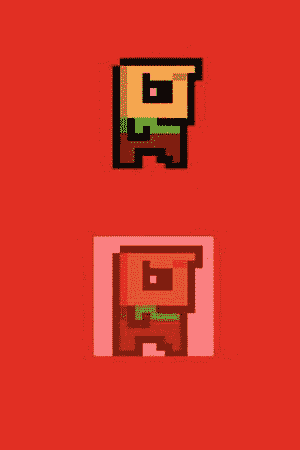

[图 7-16。](#_Fig16)鲍勃，顶点颜色混合(底部)和纹理混合(顶部)

在 RGB888 Bob 的情况下，混合是通过每顶点颜色中的 alpha 值执行的。因为我们将它们设置为 0.5f，Bob 是 50%半透明的。

在 RGBA8888 Bob 的情况下，每顶点颜色的 alpha 值都为 1。但是，由于该纹理的背景像素的 alpha 值为 0，并且由于顶点和纹理元素的颜色已被调制，因此该版本 Bob 的背景会消失。如果我们将每顶点颜色的 alpha 值也设置为 0.5f，那么 Bob 自己也会像他在屏幕底部的克隆体一样半透明 50%。图 7-17 显示了它的样子。


[图 7-17。](#_Fig17)RGB a8888 Bob 的替代版本，使用 0.5f 的逐顶点 alpha(屏幕顶部)

这基本上是我们需要知道的关于在 2D 与 OpenGL ES 混合的全部内容。

但是，还有一点非常重要的我们要指出:*勾兑贵*！说真的，不要过度使用。目前的移动 GPU 并不擅长混合大量的像素。只有在绝对必要的情况下，你才应该使用混合。

更多图元:点、线、带和扇形

当我们告诉你 OpenGL ES 是一个巨大的、讨厌的三角形渲染机器时，我们并没有 100%诚实。其实 OpenGL ES 也可以渲染点和线。最重要的是，这些也是通过顶点定义的，因此上述所有内容也适用于它们(纹理，逐顶点颜色，等等)。我们需要做的就是使用 GL10 以外的东西来渲染这些图元。GL_TRIANGLES 当我们调用 glDrawArrays()/glDrawElements()时。我们还可以用这些图元执行索引渲染，尽管这有点多余(至少在点的情况下)。[图 7-18](#Fig18) 显示了 OpenGL ES 提供的所有图元类型的列表。

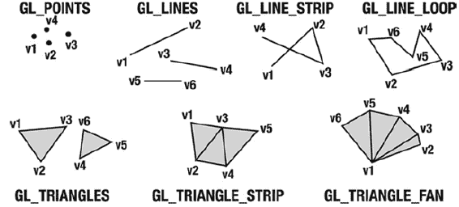

[图 7-18。](#_Fig18)OpenGL ES 可以渲染的所有图元

让我们快速浏览一下所有这些原语:

*   *点*:用一个点，每个顶点都是自己的图元。
*   *线*:一条线由两个顶点组成。和三角形一样，我们可以用 2 × *n* 个顶点来定义 *n* 条线。
*   *线条*:所有顶点被解释为属于一条长线。
*   *线条循环*:这类似于线条，不同的是 OpenGL ES 会自动从最后一个顶点到第一个顶点额外画一条线。
*   *三角形*:这个我们已经知道了。每个三角形由三个顶点组成。
*   *三角形带*:我们不指定三个顶点，只指定*个三角形* + 1 个顶点。然后 OpenGL ES 将从顶点(v1，v2，v3)构建第一个三角形，从顶点(v2，v3，v4)构建下一个三角形，依此类推。
*   *三角形扇形*:它有一个由所有三角形共享的基顶点(v1)。第一个三角形将是(v1，v2，v3)，下一个三角形将是(v1，v3，v4)，依此类推。

三角形条和扇形比纯三角形列表灵活一点。但是它们可以提供一点点性能提升，因为需要乘以投影和模型视图矩阵的顶点更少。不过，我们将在所有代码中坚持使用三角形列表，因为它们更容易使用，并且可以通过使用索引来实现类似的性能。

OpenGL ES 中的点和线有点奇怪。当我们使用像素完美的正交投影时——例如，我们的屏幕分辨率是 320×480 像素，我们的 glOrthof()调用使用这些精确值——我们仍然不能在所有情况下获得像素完美的渲染。由于所谓的*菱形退出规则*，点和线顶点的位置必须偏移 0.375f。如果你想渲染像素完美的点和线，请记住这一点。我们已经看到类似的东西也适用于三角形。然而，鉴于我们通常在 2D 画矩形，我们不会遇到这个问题。

鉴于你所要做的就是渲染 GL10 以外的图元。GL_TRIANGLES 是使用[图 7-17](#Fig17) 中的另一个常数，我们会给你一个示例程序。我们将在很大程度上坚持三角形列表，尤其是在做 2D 图形编程的时候。

现在让我们深入了解 OpenGL ES 提供给我们的另一个东西:全能的模型-视图矩阵！

2D 变换:模型-视图矩阵的乐趣

到目前为止，我们所做的只是以三角形列表的形式定义静态几何。没有任何东西在移动、旋转或缩放。此外，即使顶点数据本身保持不变(例如，由两个三角形以及纹理坐标和颜色组成的矩形的宽度和高度保持不变)，如果我们想在不同的地方绘制相同的矩形，我们仍然必须复制顶点。回头看看清单 7-11 中的[，现在忽略顶点的颜色属性。这两个矩形仅在 y 坐标上相差 200 个单位。如果我们有办法移动这些顶点而不实际改变它们的值，我们可以只定义 Bob 的矩形一次，并简单地在不同的位置画出他——这就是我们如何使用模型-视图矩阵。](#list11)

世界和模型空间

为了理解世界和模型是如何工作的，我们不得不跳出我们小小的正交视图平截头体盒子来思考。我们的视见平截头体在一个特殊的坐标系中，这个坐标系叫做*世界空间*。这是我们所有的顶点最终要到达的地方。

到目前为止，我们已经指定了相对于这个世界空间原点的绝对坐标中的所有顶点位置(对比[图 7-5](#Fig5) )。我们真正想要的是让我们的顶点位置的定义独立于这个世界空间坐标系。我们可以通过给每个模型(例如，Bob 的矩形、宇宙飞船等等)一个自己的坐标系来实现这一点。这就是我们通常所说的*模型空间*，我们在其中定义模型顶点位置的坐标系。[图 7-19](#Fig19) 展示了 2D 的这个概念，同样的规则也适用于 3D(只需添加一个 z 轴)。

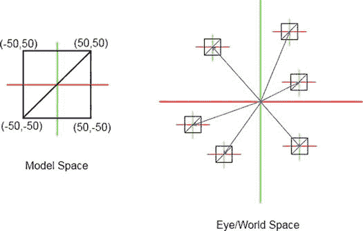

[图 7-19。](#_Fig19)在模型空间中定义我们的模型，重用它，并在世界空间的不同位置渲染它

在[图 7-19](#Fig19) 中，我们有一个通过顶点实例定义的单一模型——例如，像这样:

```java
Vertices vertices = new Vertices(glGraphics, 4, 12, false , false );
vertices.setVertices(new float [] { −50, -50,
                                    50, -50,
                                    50,  50,
                                   -50,  50 }, 0, 8);
vertices.setIndices(new short [] {0, 1, 2, 2, 3, 0}, 0, 6);
```

在我们的讨论中，我们只是忽略了顶点颜色和纹理坐标。现在，当我们渲染这个模型而没有任何进一步的修改时，它将被放置在我们最终图像中世界空间的原点周围。如果我们想在不同的位置渲染它，比如说，它的中心在世界空间中的(200，300)，我们可以像这样重新定义顶点位置:

```java
vertices.setVertices(new float [] { −50 + 200, -50 + 300,
                                    50 + 200, -50 + 300,
                                    50 + 200,  50 + 300,
                                   -50 + 200,  50 + 300 }, 0, 8);
```

在下一次调用 vertices.draw()时，模型将以(200，300)为中心进行渲染，但这有点乏味，不是吗？

又是矩阵

还记得我们简短地讨论过矩阵吗？我们讨论了矩阵如何对转换进行编码，比如平移(移动东西)、旋转和缩放。我们用来将顶点投影到投影平面上的投影矩阵编码了一种特殊类型的变换:投影。

矩阵是更优雅地解决我们之前问题的关键。我们不是通过重新定义来手动移动我们的顶点位置，而是简单地设置一个编码平移的矩阵。由于 OpenGL ES 的投影矩阵已经被我们通过 glOrthof()指定的正交图形投影矩阵占据，我们使用一个不同的 OpenGL ES 矩阵:模型-视图矩阵。下面是我们如何渲染我们的模型，将它的原点移动到眼睛/世界空间中的特定位置:

```java
gl.glMatrixMode(GL10.GL_MODELVIEW);
gl.glLoadIdentity();
gl.glTranslatef(200, 300, 0);
vertices.draw(GL10.GL_TRIANGLES, 0, 6);
```

我们首先要告诉 OpenGL ES 我们想要操作哪个矩阵。在我们的例子中，这是模型-视图矩阵，由常量 GL10 指定。GL_MODELVIEW。接下来，我们确保模型-视图矩阵被设置为单位矩阵。基本上，我们只是覆盖已经存在的任何东西——我们可以说是清除了矩阵。下一个电话是奇迹发生的地方。

glTranslatef()方法有三个参数:x、y 和 z 轴上的平移。因为我们希望模型的原点位于眼睛/世界空间中的(200，300)处，所以我们指定在 x 轴上平移 200 个单位，在 y 轴上平移 300 个单位。因为我们在 2D 工作，我们简单地忽略 z 轴，并将平移分量设置为 0。我们没有为顶点指定 z 坐标，所以这些将默认为 0。0 加 0 等于 0，所以我们的顶点会停留在 x-y 平面。

从这一点开始，OpenGL ES 的模型-视图矩阵通过(200，300，0)对平移进行编码，这将应用于通过 OpenGL ES 管道的所有顶点。如果你回头参考[图 7-4](#Fig4) ，你会看到 OpenGL ES 首先将每个顶点乘以模型-视图矩阵，然后应用投影矩阵。直到现在，模型-视图矩阵被设置为单位矩阵(OpenGL ES 的默认)；因此，它对我们的顶点没有影响。我们的小 glTranslatef()调用改变了这一点，它将在投影之前首先移动所有顶点。

当然，这是即时完成的；我们的顶点实例中的值根本没有改变。我们会注意到顶点实例的任何永久变化，因为按照这种逻辑，投影矩阵已经改变了它。

使用翻译的初始示例

我们可以用翻译来做什么？假设我们想在世界的不同位置渲染 100 个 bob。此外，我们希望它们在屏幕上四处移动，并在每次碰到屏幕的边缘时改变方向(或者更确切地说，是我们的平行投影视图平截头体的平面，它与我们的屏幕范围一致)。我们可以用一个大的顶点实例来保存 100 个矩形的顶点——每个 Bob 一个——并重新计算每个帧的顶点位置。更简单的方法是让一个小顶点实例只包含一个矩形(Bob 的模型),并通过动态转换模型-视图矩阵来重用它。让我们来定义我们的 Bob 模型:

```java
Vertices bobModel = new Vertices(glGraphics, 4, 12, false , true );
bobModel.setVertices(new float [] { −16, -16, 0, 1,
                                    16, -16, 1, 1,
                                    16,  16, 1, 0,
                                   -16,  16, 0, 0, }, 0, 8);
bobModel.setIndices(new short [] {0, 1, 2, 2, 3, 0}, 0, 6);
```

因此，每个 Bob 的大小为 32×32 个单位。我们也对他进行纹理映射——我们将使用 bobrgb888.png 来查看每个 Bob 的范围。

鲍勃成为一个阶层

让我们定义一个简单的 Bob 类。它将负责保持 Bob 实例的位置，并根据 delta 时间向其当前方向推进其位置，就像我们推进 Nom 先生一样(区别在于我们不再在网格中移动)。update()方法还将确保 Bob 不会超出我们的视图体积界限。清单 7-12 显示了 Bob 类。

***[清单 7-12](#_list12) 。****Bob.java*

```java
package com.badlogic.androidgames.glbasics;

import java.util.Random;

class Bob {
    static final Random *rand* = new Random();
    public float x, y;
    float dirX, dirY;

    public Bob() {
        x = *rand*.nextFloat() * 320;
        y = *rand*.nextFloat() * 480;
        dirX = 50;
        dirY = 50;
    }

    public void update(float deltaTime) {
        x = x + dirX * deltaTime;
        y = y + dirY * deltaTime;

        if (x < 0) {
            dirX = −dirX;
            x = 0;
        }

        if (x > 320) {
            dirX = −dirX;
            x = 320;
        }

        if (y < 0) {
            dirY = −dirY;
            y = 0;
        }

        if (y > 480) {
            dirY = −dirY;
            y = 480;
        }
    }
}
```

当我们构造 Bob 时，每个 Bob 实例都将自己放置在世界上的一个随机位置。所有 Bob 实例最初都将向同一方向移动:每秒向右移动 50 个单位，向上移动 50 个单位(当我们乘以 deltaTime 时)。在 update()方法中，我们简单地以基于时间的方式在当前方向上推进 Bob 实例，然后检查它是否离开了视图截锥边界。如果是这种情况，我们反转它的方向，并确保它仍然在视图截锥中。

现在让我们假设我们正在实例化 100 个 Bob 实例，如下所示:

```java
Bob[] bobs = new Bob[100];
for(int i = 0; i < 100; i++) {
    bobs[i] = new Bob();
}
```

为了渲染每个 Bob 实例，我们要做这样的事情(假设我们已经清空了屏幕，设置了投影矩阵，并绑定了纹理):

```java
gl.glMatrixMode(GL10.GL_MODELVIEW);
for(int i = 0; i < 100; i++) {
    bob.update(deltaTime);
    gl.glLoadIdentity();
    gl.glTranslatef(bobs[i].x, bobs[i].y, 0);
    bobModel.render(GL10.GL_TRIANGLES, 0, 6);
}
```

很甜蜜，不是吗？对于每个 Bob 实例，我们调用它的 update()方法，这将提高它的位置，并确保它保持在我们这个小世界的范围内。接下来，我们将一个单位矩阵加载到 OpenGL ES 的模型-视图矩阵中，这样我们就有了一个新的开始。然后，我们在对 glTranslatef()的调用中使用当前 Bob 实例的 x 和 y 坐标。当我们在下一个调用中渲染 Bob 模型时，所有顶点都将偏移当前 Bob 实例的位置——这正是我们想要的。

把它放在一起

让我们把它作为一个完整的例子。清单 7-13 显示了带有注释的代码。

***[清单 7-13](#_list13) 。****【BobTest.java】；100 个移动的 bob！*

```java
package com.badlogic.androidgames.glbasics;

import javax.microedition.khronos.opengles.GL10;

import com.badlogic.androidgames.framework.Game;
import com.badlogic.androidgames.framework.Screen;
import com.badlogic.androidgames.framework.gl.FPSCounter;
import com.badlogic.androidgames.framework.gl.Texture;
import com.badlogic.androidgames.framework.gl.Vertices;
import com.badlogic.androidgames.framework.impl.GLGame;
import com.badlogic.androidgames.framework.impl.GLGraphics;

public class BobTest extends GLGame {
    public Screen getStartScreen() {
        return new BobScreen(this );
    }

    class BobScreen extends Screen {
        static final int *NUM_BOBS* = 100;
        GLGraphics glGraphics;
        Texture bobTexture;
        Vertices bobModel;
        Bob[] bobs;
```

我们的 BobScreen 类包含一个纹理(从 bobrbg888.png 加载)、一个包含 Bob 模型的 Vertices 实例(一个简单的纹理矩形)和一个 Bob 实例数组。我们还定义了一个名为 NUM_BOBS 的小常量，这样我们就可以修改我们想要在屏幕上显示的 bob 数量。

```java
        public BobScreen(Game game) {
            super (game);
            glGraphics = ((GLGame)game).getGLGraphics();

            bobTexture = new Texture((GLGame)game, "bobrgb888.png");

            bobModel = new Vertices(glGraphics, 4, 12, false , true );
            bobModel.setVertices(new float [] { −16, -16, 0, 1,
                                                16, -16, 1, 1,
                                                16,  16, 1, 0,
                                               -16,  16, 0, 0, }, 0, 16);
            bobModel.setIndices(new short [] {0, 1, 2, 2, 3, 0}, 0, 6);

            bobs = new Bob[100];
            for (int i = 0; i < 100; i++) {
                bobs[i] = new Bob();
            }
        }
```

构造函数只是加载纹理，创建模型，并实例化 NUM_BOBS Bob 实例。

```java
        @Override
        public void update(float deltaTime) {
            game.getInput().getTouchEvents();
            game.getInput().getKeyEvents();

            for (int i = 0; i < *NUM_BOBS*; i++) {
                bobs[i].update(deltaTime);
            }
        }
```

update()方法是我们让 Bob 实例自我更新的地方。我们还确保输入事件缓冲区是空的。

```java
        @Override
        public void present(float deltaTime) {
            GL10 gl = glGraphics.getGL();
            gl.glClearColor(1,0,0,1);
            gl.glClear(GL10.*GL_COLOR_BUFFER_BIT*);
            gl.glMatrixMode(GL10.*GL_PROJECTION*);
            gl.glLoadIdentity();
            gl.glOrthof(0, 320, 0, 480, 1, -1);

            gl.glEnable(GL10.*GL_TEXTURE_2D*);
            bobTexture.bind();

            gl.glMatrixMode(GL10.*GL_MODELVIEW*);
            for (int i = 0; i < *NUM_BOBS*; i++) {
                gl.glLoadIdentity();
                gl.glTranslatef(bobs[i].x, bobs[i].y, 0);
                bobModel.draw(GL10.*GL_TRIANGLES*, 0, 6);
            }
        }
```

在 present()方法中，我们清除屏幕，设置投影矩阵，启用纹理，并绑定 Bob 的纹理。最后几行负责实际呈现每个 Bob 实例。由于 OpenGL ES 记住了它的状态，我们只需设置一次活动矩阵；在这种情况下，我们将在剩余的代码中修改模型-视图矩阵。然后，我们遍历所有的 Bob 实例，根据当前 Bob 实例的位置将模型-视图矩阵设置为转换矩阵，并呈现模型，这将由模型-视图矩阵自动转换。

```java
        @Override
        public void pause() {
        }

        @Override
        public void resume() {
        }

        @Override
        public void dispose() {
        }
    }
}
```

就这样。最棒的是，我们再次采用了在 Nom 先生中使用的 MVC 模式。它非常适合游戏编程。Bob 的逻辑方面与他的外观完全分离，这很好，因为我们可以很容易地用更复杂的东西替换他的外观。[图 7-20](#Fig20) 显示了我们的小程序运行几秒钟后的输出。


[图 7-20。](#_Fig20)波比真多！

这还不是我们所有转换乐趣的终结。如果你记得我们几页前说过的话，你就会知道接下来会发生什么:旋转和缩放。

更多转换

除了 glTranslatef()方法之外，OpenGL ES 还为我们提供了两种转换方法:glRotatef()和 glScalef()。

循环

下面是 glRotatef(): 的签名

```java
GL10.glRotatef(float angle, float axisX, float axisY, float axisZ);
```

第一个参数是我们想要旋转顶点的角度，以度为单位。其余参数是什么意思？

当我们旋转某物时，我们绕轴旋转它。什么是轴？我们已经知道了三个轴:x 轴，y 轴和 z 轴。我们可以将这三个轴表示为*向量*。正 x 轴将被描述为(1，0，0)，正 y 轴将被描述为(0，1，0)，正 z 轴将被描述为(0，0，1)。如你所见，向量实际上编码了一个方向——在我们的例子中，是在 3D 空间中。鲍勃的方向也是一个矢量，但在 2D 空间。向量也可以对位置进行编码，比如鲍勃在 2D 空间中的位置。

要定义 Bob 模型旋转所围绕的轴，我们需要回到 3D 空间。[图 7-21](#Fig21) 显示了 Bob 的模型(应用了纹理进行定向)，如先前代码在 3D 空间中所定义的。


[图 7-21。](#_Fig21)3D 中的鲍勃

由于我们还没有为 Bob 的顶点定义 z 坐标，所以他被嵌入到我们的 3D 空间(实际上是模型空间，记得吗？).如果我们想旋转 Bob，我们可以围绕我们能想到的任何轴来做:x、y 或 z 轴，甚至是一个完全疯狂的轴，比如(0.75，0.75，0.75)。然而，对于我们的 2D 图形编程需要，在 x-y 平面旋转 Bob 是有意义的；因此，我们将使用正 z 轴作为旋转轴，可以定义为(0，0，1)。旋转将围绕 z 轴逆时针旋转。如下调用 glRotatef()将导致 Bob 模型的顶点旋转，如图 7-22 所示:

GL . GL rotate ref(45.0，0.1)；

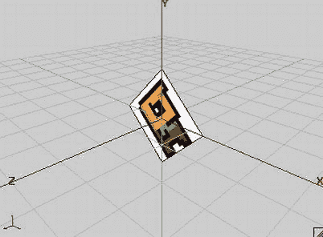

[图 7-22。](#_Fig22) Bob，绕 z 轴旋转 45 度

缩放比例

我们也可以用 glScalef()缩放 Bob 的模型，像这样:

```java
glScalef(2, 0.5f, 1);
```

给定 Bob 的原始模型姿势，这将导致图 7-23 中描绘的新方向。

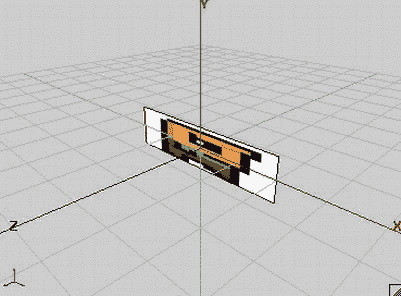

[图 7-23。](#_Fig23) Bob，在 x 轴上缩放 2 倍，在 y 轴上缩放 0.5 倍。。。哎哟！

组合转换

现在，我们还讨论了我们可以通过将多个矩阵相乘来组合它们的效果，从而形成一个新的矩阵。所有方法—glTranslatef()、glScalef()、glRotatef()和 glOrthof()—都是这样做的。它们根据我们传递给它们的参数，将当前的活动矩阵乘以内部创建的临时矩阵。所以，让我们结合鲍勃的旋转和缩放:

```java
gl.glRotatef(45, 0, 0, 1);
gl.glScalef(2, 0.5f, 1);
```

这将使 Bob 的模型看起来像[图 7-24](#Fig24) (记住，我们仍然在模型空间中)。


[图 7-24。](#_Fig24) Bob，先缩放后旋转(看起来还是不开心)

如果我们反过来应用转换，会发生什么？

```java
gl.glScalef(2, 0.5, 0);
gl.glRotatef(45, 0, 0, 1)
```

[图 7-25](#Fig25) 给你答案。

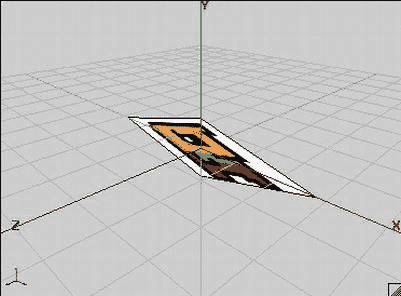

[图 7-25。](#_Fig25) Bob，先旋转后缩放

哇，这不是我们以前认识的鲍勃。这里发生了什么？如果你查看代码片段，你实际上会期望[图 7-24](#Fig24) 看起来像[图 7-25](#Fig25) ，而[图 7-25](#Fig25) 看起来像[图 7-24](#Fig24) 。在第一个片段中，我们首先应用旋转，然后缩放 Bob，对吗？

错了。OpenGL ES 将矩阵相乘的方式决定了矩阵编码的转换应用于模型的顺序。与当前活动矩阵相乘的最后一个矩阵将是第一个应用于顶点的矩阵。因此，如果我们想要以这种精确的顺序缩放、旋转和平移 Bob，我们必须像这样调用方法:

```java
glTranslatef(bobs[i].x, bobs[i].y, 0);
glRotatef(45, 0, 0, 1);
glScalef(2, 0.5f, 1);
```

如果我们将 BobScreen.present()方法中的循环改为以下代码，输出将类似于图 7-26 :

```java
gl.glMatrixMode(GL10.*GL_MODELVIEW*);
for (int i = 0; i <*NUM_BOBS*; i++) {
    gl.glLoadIdentity();
    gl.glTranslatef(bobs[i].x, bobs[i].y, 0);
    gl.glRotatef(45, 0, 0, 1);
    gl.glScalef(2, 0.5f, 0);
    bobModel.draw(GL10.*GL_TRIANGLES*, 0, 6);
```

}

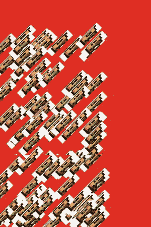

[图 7-26。](#_Fig26)一百个 bob 被缩放、旋转和平移(按此顺序)到它们在世界空间中的位置

当你第一次在桌面上使用 OpenGL 时，很容易混淆这些矩阵运算的顺序。为了记住如何正确地做这件事，使用称为拉斯菲亚原则的记忆方法:最后指定，首先应用。(是啊，这种记忆术也没那么好，是吧？)

熟悉模型-视图转换的最简单的方法是大量使用它们。我们建议您使用 BobTest.java 源文件，修改内部循环一段时间，并观察效果。请注意，您可以指定任意数量的转换来渲染每个模型。添加更多旋转、平移和缩放。发疯吧。

有了最后这个例子，我们基本上知道了编写 2D 游戏所需要知道的一切。。。还是我们？

优化性能

当我们在 Droid 或 Nexus One 等强大的第二代设备上运行这个例子时，一切都会像丝绸一样流畅。如果我们在一个英雄身上运行它，一切将开始结巴，看起来相当不愉快。但是，嘿，我们不是说过 OpenGL ES 是快速图形渲染的银弹吗？是的，但前提是我们要按照 OpenGL ES 希望我们做的方式去做。

测量帧速率

BobTest 提供了一个完美的例子来开始一些优化。然而，在此之前，我们需要一种评估性能的方法。人工目测(“doh，看起来有点口吃”)不够精准。衡量程序执行速度的一个更好的方法是计算我们每秒渲染的帧数。在第 3 章中，我们谈到了垂直同步，简称 vsync。到目前为止，市场上所有的 Android 设备都支持这一功能，并且它将每秒最大帧数(FPS)限制在 60 帧。当我们以那个帧速率运行时，我们知道我们的代码足够好。

**注意**虽然 60 FPS 很好，但实际上在许多 Android 设备上很难达到这样的性能。高分辨率平板电脑有很多像素需要填充，即使我们只是在清空屏幕。如果我们的游戏以超过 30 帧/秒的速度渲染世界，我们会很高兴。不过，多放几帧也无妨。

让我们编写一个小的助手类，它计算 FPS 并定期输出那个值。清单 7-14 显示了一个名为 FPSCounter 的类的代码。

***[清单 7-14](#_list14) 。****【FPSCounter.java】；每秒钟计算帧数并记录到 LogCat 中*

```java
package com.badlogic.androidgames.framework.gl;

import android.util.Log;

public class FPSCounter {
    long startTime = System.*nanoTime*();
    int frames = 0;

    public void logFrame() {
        frames++;
        if (System.*nanoTime*() - startTime > = 1000000000) {
            Log.*d*("FPSCounter", "fps: " + frames);
            frames = 0;
            startTime = System.*nanoTime*();
        }
    }
}
```

我们可以将这个类的一个实例放在我们的 BobScreen 类中，并在 BobScreen.present()方法中调用一次 logFrame()方法。我们刚刚做到了这一点，下面是一个 Hero(运行 Android 1.5)、一个 droid(运行 Android 2.2)和一个 Nexus One(运行 Android 2.2.1)的输出:

```java
Hero:
12–10 03:27:05.230: DEBUG/FPSCounter(17883): fps: 22
12–10 03:27:06.250: DEBUG/FPSCounter(17883): fps: 22
12–10 03:27:06.820: DEBUG/dalvikvm(17883): GC freed 21818 objects / 524280 bytes in 132ms
12–10 03:27:07.270: DEBUG/FPSCounter(17883): fps: 20
12–10 03:27:08.290: DEBUG/FPSCounter(17883): fps: 23

Droid:
12–10 03:29:44.825: DEBUG/FPSCounter(8725): fps: 39
12–10 03:29:45.864: DEBUG/FPSCounter(8725): fps: 38
12–10 03:29:46.879: DEBUG/FPSCounter(8725): fps: 38
12–10 03:29:47.879: DEBUG/FPSCounter(8725): fps: 39
12–10 03:29:48.887: DEBUG/FPSCounter(8725): fps: 40

Nexus One:
12–10 03:28:05.923: DEBUG/FPSCounter(930): fps: 43
12–10 03:28:06.933: DEBUG/FPSCounter(930): fps: 43
12–10 03:28:07.943: DEBUG/FPSCounter(930): fps: 44
12–10 03:28:08.963: DEBUG/FPSCounter(930): fps: 44
12–10 03:28:09.973: DEBUG/FPSCounter(930): fps: 44
12–10 03:28:11.003: DEBUG/FPSCounter(930): fps: 43
12–10 03:28:12.013: DEBUG/FPSCounter(930): fps: 44
```

第一次检查时，我们可以看到以下内容:

*   英雄比 Droid 和 Nexus One 慢一倍。
*   Nexus One 比 Droid 略快。
*   在我们的进程中，我们在英雄上生成垃圾(17883)。

现在，单子上的最后一项有点令人困惑。我们在所有三台设备上运行相同的代码。经过进一步检查，我们没有在 present()方法或 update()方法中分配任何临时对象。那么英雄身上发生了什么？

安卓 1.5 上的英雄奇案

原来 Android 1.5 有一个 bug。嗯，这不是真正的*错误，这只是一些极其草率的编程。还记得我们对顶点和索引使用直接 NIO 缓冲吗？这些实际上是本机堆内存中的内存块。每次我们调用 glVertexPointer()、glColorPointer()或任何其他 glXXXPointer()方法时，OpenGL ES 将尝试获取该缓冲区的本机堆内存地址，以查找顶点，从而将数据传输到视频 RAM。Android 1.5 上的问题是，每次我们从直接 NIO 缓冲区请求内存地址时，都会生成一个名为 PlatformAddress 的临时对象。由于我们有很多对 glXXXPointer()和 glDrawElements()方法的调用(记住，后者从直接 ShortBuffer 中获取地址)，Android 分配了大量临时 PlatformAddress 实例，对此我们无能为力。(实际上，有一个解决方法，但现在我们不讨论它。)让我们接受在 Android 1.5 上使用 NIO 缓冲区是可怕的错误这一事实，然后继续前进。*

 *是什么让我的 OpenGL ES 渲染这么慢？

英雄比第二代设备慢并不奇怪。然而，Droid 中的 PowerVR 芯片比 Nexus One 中的 Adreno 芯片略快，所以前面的结果乍一看有点奇怪。通过进一步的检查，我们可能不会将这种差异归因于 GPU 的能力，而是因为我们在每一帧中调用了许多 OpenGL ES 方法，这些方法是昂贵的 Java 本地接口方法。这意味着它们实际上是调入 C 代码，这比在 Dalvik 上调用一个 Java 方法花费更多。Nexus One 有一个 JIT 编译器，可以稍微优化一下。所以我们就假设区别源于 JIT 编译器(这可能不完全正确)。

现在，让我们来看看什么对 OpenGL ES 不利:

*   每帧改变很多状态(即混合、启用/禁用纹理映射等)
*   每帧改变矩阵很多
*   每帧绑定很多纹理
*   每帧大量更改顶点、颜色和纹理坐标指针

这真的可以归结为状态的改变。为什么这成本很高？GPU 的工作方式就像工厂里的装配线。当生产线的前端处理新来的工件时，生产线的末端完成生产线前一阶段已经处理过的工件。让我们用一个小的汽车工厂类比来尝试一下。

生产线有几种状态，例如工厂工人可用的工具、用于组装汽车零件的螺栓类型、汽车喷漆的颜色等等。是的，真正的汽车工厂有多条装配线，但我们就假装只有一条。现在，只要我们不改变任何状态，生产线的每个阶段都会很忙。然而，只要我们改变一个状态，生产线就会停止，直到所有正在组装的汽车都完成为止。只有到那时，我们才能真正改变状态，用新的油漆、螺栓或其他东西组装汽车。

关键在于，对 glDrawElements()或 glDrawArrays()的调用不会立即执行；相反，命令被放入缓冲区，由 GPU 异步处理。这意味着对绘图方法的调用不会阻塞。因此，测量调用 glDrawElements()所花费的时间并不是一个好主意，因为实际的工作可能会在将来执行。这就是为什么我们改为测量 FPS。当交换帧缓冲区时(是的，我们在 OpenGL ES 中也使用双缓冲)，OpenGL ES 将确保所有未完成的操作都被执行。

因此，将汽车工厂类比转换为 OpenGL ES 意味着以下内容:当新的三角形通过调用 glDrawElements()或 glDrawArrays()进入命令缓冲区时，GPU 管道可能会从对 render 方法的早期调用中完成对当前处理的三角形的渲染(例如，当前可以在管道的光栅化状态下处理三角形)。这有如下含义:

*   改变当前绑定的纹理代价很高。必须首先渲染命令缓冲区中尚未处理且使用纹理的任何三角形。管道会停止工作。
*   改变顶点、颜色和纹理坐标指针是昂贵的。必须首先渲染命令缓冲区中尚未渲染并使用旧指针的任何三角形。管道会停止工作。
*   改变混合状态是昂贵的。命令缓冲区中任何需要/不需要混合且尚未渲染的三角形都必须首先渲染。管道会停止工作。
*   改变模型视图或投影矩阵是昂贵的。命令缓冲区中任何尚未处理的三角形以及旧矩阵应该应用到的三角形必须首先渲染。管道会停止工作。

这一切的精髓是*减少你的状态变化*——所有的变化。

移除不必要的状态更改

让我们看看 BobTest 的 present()方法，看看我们能改变什么。下面是代码片段，其中我们添加了 FPSCounter，还使用了 glRotatef()和 glScalef()):

```java
@Override
public void present(float deltaTime) {
    GL10 gl = glGraphics.getGL();
    gl.glViewport(0, 0, glGraphics.getWidth(), glGraphics.getHeight());
    gl.glClearColor(1,0,0,1);
    gl.glClear(GL10.*GL_COLOR_BUFFER_BIT*);
    gl.glMatrixMode(GL10.*GL_PROJECTION*);
    gl.glLoadIdentity();
    gl.glOrthof(0, 320, 0, 480, 1, -1);

    gl.glEnable(GL10.*GL_TEXTURE_2D*);
    bobTexture.bind();

    gl.glMatrixMode(GL10.*GL_MODELVIEW*);
    for (int i = 0; i < *NUM_BOBS*; i++) {
        gl.glLoadIdentity();
        gl.glTranslatef(bobs[i].x, bobs[i].y, 0);
        gl.glRotatef(45, 0, 0, 1);
        gl.glScalef(2, 0.5f, 1);
        bobModel.draw(GL10.*GL_TRIANGLES*, 0, 6);
    }
    fpsCounter.logFrame();
}
```

我们可以做的第一件事是移动对 glViewport()和 glClearColor()的调用，以及将投影矩阵设置为 BobScreen.resume()方法的方法调用。清澈的颜色永远不会改变；视口和投影矩阵也不会改变。为什么不在 BobScreen 的构造函数中放入设置所有像 viewport 或 projection matrix 这样的持久 OpenGL 状态的代码？好吧，我们需要与语境缺失做斗争。我们执行的所有 OpenGL ES 状态修改都将丢失，并且当我们的屏幕的 resume()方法被调用时，我们知道上下文已经被重新创建，因此丢失了我们之前可能已经设置的所有状态。我们还可以将 glEnable()和纹理绑定调用放入 resume()方法中。毕竟，我们希望纹理一直处于启用状态，并且我们也只希望使用包含 Bob 图像的单一纹理。为了更好地测量，我们还在 resume()方法中调用 texture.reload()，以便在上下文丢失的情况下，我们的纹理图像数据也被重新加载。下面是我们修改后的 present()和 resume()方法:

```java
@Override
public void resume() {
    GL10 gl = glGraphics.getGL();
    gl.glViewport(0, 0, glGraphics.getWidth(), glGraphics.getHeight());
    gl.glClearColor(1, 0, 0, 1);
    gl.glMatrixMode(GL10.*GL_PROJECTION*);
    gl.glLoadIdentity();
    gl.glOrthof(0, 320, 0, 480, 1, -1);
    bobTexture.reload();
    gl.glEnable(GL10.*GL_TEXTURE_2D*);
    bobTexture.bind();
}
@Override
public void present(float deltaTime) {
    GL10 gl = glGraphics.getGL();
    gl.glClear(GL10.*GL_COLOR_BUFFER_BIT*);

    gl.glMatrixMode(GL10.*GL_MODELVIEW*);
    for (int i = 0; i < *NUM_BOBS*; i++) {
        gl.glLoadIdentity();
        gl.glTranslatef(bobs[i].x, bobs[i].y, 0);
        gl.glRotatef(45, 0, 0, 1);
        gl.glScalef(2, 0.5f, 0);
        bobModel.draw(GL10.*GL_TRIANGLES*, 0, 6);
    }

    fpsCounter.logFrame();
}
```

运行这一“改进”版本可在三台设备上获得以下性能:

```java
Hero:
12–10 04:41:56.750: DEBUG/FPSCounter(467): fps: 23
12–10 04:41:57.770: DEBUG/FPSCounter(467): fps: 23
12–10 04:41:58.500: DEBUG/dalvikvm(467): GC freed 21821 objects / 524288 bytes in 133ms
12–10 04:41:58.790: DEBUG/FPSCounter(467): fps: 19
12–10 04:41:59.830: DEBUG/FPSCounter(467): fps: 23

Droid:
12–10 04:45:26.906: DEBUG/FPSCounter(9116): fps: 39
12–10 04:45:27.914: DEBUG/FPSCounter(9116): fps: 41
12–10 04:45:28.922: DEBUG/FPSCounter(9116): fps: 41
12–10 04:45:29.937: DEBUG/FPSCounter(9116): fps: 40

Nexus One:
12–10 04:37:46.097: DEBUG/FPSCounter(2168): fps: 43
12–10 04:37:47.127: DEBUG/FPSCounter(2168): fps: 45
12–10 04:37:48.147: DEBUG/FPSCounter(2168): fps: 44
12–10 04:37:49.157: DEBUG/FPSCounter(2168): fps: 44
12–10 04:37:50.167: DEBUG/FPSCounter(2168): fps: 44
```

正如你所看到的，所有的设备都已经从我们的优化中受益了一点点。当然，影响并不十分巨大。这可以归因于这样一个事实，当我们最初在帧的开始调用所有这些方法时，管道中没有三角形。

减小纹理大小意味着要提取的像素更少

那么还有什么可以改变的呢？一些不那么明显的事情。我们的 Bob 实例大小为 32×32 个单元。我们使用大小为 320×480 单位的投影平面。在一个英雄身上，这将给我们像素级的完美渲染。在 Nexus One 或 Droid 上，我们坐标系中的单个单位将占用不到一个像素。无论如何，我们的纹理实际上是 128×128 像素大小。我们不需要那么高的分辨率，所以让我们将纹理图像 bobrgb888.png 的大小调整为 32×32 像素。我们将把这个新形象称为 bobrgb888-32x32.png。使用这个更小的纹理，我们为每个设备得到如下的 FPS:

```java
Hero:
12–10 04:48:03.940: DEBUG/FPSCounter(629): fps: 23
12–10 04:48:04.950: DEBUG/FPSCounter(629): fps: 23
12–10 04:48:05.860: DEBUG/dalvikvm(629): GC freed 21812 objects / 524256 bytes in 134ms
12–10 04:48:05.990: DEBUG/FPSCounter(629): fps: 21
12–10 04:48:07.030: DEBUG/FPSCounter(629): fps: 24

Droid:
12–10 04:51:11.601: DEBUG/FPSCounter(9191): fps: 56
12–10 04:51:12.609: DEBUG/FPSCounter(9191): fps: 56
12–10 04:51:13.625: DEBUG/FPSCounter(9191): fps: 55
12–10 04:51:14.641: DEBUG/FPSCounter(9191): fps: 55

Nexus One:
12–10 04:48:18.067: DEBUG/FPSCounter(2238): fps: 53
12–10 04:48:19.077: DEBUG/FPSCounter(2238): fps: 56
12–10 04:48:20.077: DEBUG/FPSCounter(2238): fps: 53
12–10 04:48:21.097: DEBUG/FPSCounter(2238): fps: 54
```

哇，这在第二代设备上产生了巨大的差异！事实证明，这些设备的 GPU 最讨厌的莫过于必须扫描大量像素。这适用于从纹理中获取纹理元素，以及实际将三角形渲染到屏幕上。这些 GPU 可以获取纹理元素并将像素渲染到帧缓冲区的速率称为*填充速率*。所有第二代 GPU 都有严重的填充率限制，所以我们应该尽量使用尽可能小的纹理(或者只将我们的三角形映射到其中的一小部分)，而不是将极其巨大的三角形渲染到屏幕上。我们还应该注意重叠:重叠的三角形越少越好。

**注意**实际上，对于像 Droid 上的 PowerVR SGX 530 这样的 GPU 来说，重叠并不是一个非常大的问题。这些 GPU 有一种称为*基于图块的延迟渲染*的特殊机制，可以在特定条件下消除大量重叠。尽管如此，我们仍然应该关心那些在屏幕上永远看不到的像素。

英雄只是稍微受益于纹理图像尺寸的减小。那么罪魁祸首是什么呢？

减少对 OpenGL ES/JNI 方法的调用

第一个疑点是，当我们为每个 Bob 渲染模型时，每帧都会发出许多 OpenGL ES 调用。首先，我们每个 Bob 有四个矩阵运算。如果我们不需要旋转或缩放，我们可以减少到两个调用。当我们在内部循环中只使用 glLoadIdentity()和 glTranslatef()时，每个设备的 FPS 数如下:

```java
Hero:
12–10 04:57:49.610: DEBUG/FPSCounter(766): fps: 27
12–10 04:57:49.610: DEBUG/FPSCounter(766): fps: 27
12–10 04:57:50.650: DEBUG/FPSCounter(766): fps: 28
12–10 04:57:50.650: DEBUG/FPSCounter(766): fps: 28
12–10 04:57:51.530: DEBUG/dalvikvm(766): GC freed 22910 objects / 568904 bytes in 128ms

Droid:
12–10 05:08:38.604: DEBUG/FPSCounter(1702): fps: 56
12–10 05:08:39.620: DEBUG/FPSCounter(1702): fps: 57
12–10 05:08:40.628: DEBUG/FPSCounter(1702): fps: 58
12–10 05:08:41.644: DEBUG/FPSCounter(1702): fps: 57

Nexus One:
12–10 04:58:01.277: DEBUG/FPSCounter(2509): fps: 54
12–10 04:58:02.287: DEBUG/FPSCounter(2509): fps: 54
12–10 04:58:03.307: DEBUG/FPSCounter(2509): fps: 55
12–10 04:58:04.317: DEBUG/FPSCounter(2509): fps: 55
```

嗯，它大大提高了英雄的性能，Droid 和 Nexus One 也受益于取消了两个矩阵运算。当然，这里有一点欺骗:如果我们需要旋转和缩放我们的 bob，没有办法发出这两个额外的调用。然而，当我们所做的只是 2D 渲染时，有一个巧妙的小技巧可以让我们摆脱所有的矩阵运算(我们将在下一章探讨这个技巧)。

OpenGL ES 是一个通过 JNI 包装器提供给 Java 的 C API。这意味着我们调用的任何 OpenGL ES 方法都必须穿过那个 JNI 包装器来调用实际的 C 原生函数。这在早期的 Android 版本上有点昂贵，但在最近的版本上已经变得更好了。如图所示，影响并不那么大，特别是如果实际操作比发出调用本身花费更多的时间。

绑定顶点的概念

那么，还有什么我们可以改进的吗？让我们再看一次当前的 present()方法[去掉了 glRotatef()和 glScalef()]:

```java
public void present(float deltaTime) {
    GL10 gl = glGraphics.getGL();
    gl.glClear(GL10.*GL_COLOR_BUFFER_BIT*);

    gl.glMatrixMode(GL10.*GL_MODELVIEW*);
    for (int i = 0; i < *NUM_BOBS*; i++) {
        gl.glLoadIdentity();
        gl.glTranslatef(bobs[i].x, bobs[i].y, 0);
        bobModel.draw(GL10.*GL_TRIANGLES*, 0, 6);
    }

    fpsCounter.logFrame();
}
```

这看起来非常理想，不是吗？嗯，事实上它不是最优的。首先，我们还可以将 gl.glMatrixMode()调用移动到 resume()方法，但正如我们已经看到的那样，这不会对性能产生巨大影响。第二件可以优化的事情稍微微妙一点。

我们使用 Vertices 类来存储和呈现 bob 的模型。还记得 Vertices.draw()方法吗？这又是一次:

```java
public void draw(int primitiveType, int offset, int numVertices) {
    GL10 gl = glGraphics.getGL();

    gl.glEnableClientState(GL10.*GL_VERTEX_ARRAY*);
    vertices.position(0);
    gl.glVertexPointer(2, GL10.*GL_FLOAT*, vertexSize, vertices);

    if (hasColor) {
        gl.glEnableClientState(GL10.*GL_COLOR_ARRAY*);
        vertices.position(2);
        gl.glColorPointer(4, GL10.*GL_FLOAT*, vertexSize, vertices);
    }

    if (hasTexCoords) {
        gl.glEnableClientState(GL10.*GL_TEXTURE_COORD_ARRAY*);
        vertices.position(hasColor?6:2);
        gl.glTexCoordPointer(2, GL10.*GL_FLOAT*, vertexSize, vertices);
    }

    if (indices! =null ) {
        indices.position(offset);
        gl.glDrawElements(primitiveType, numVertices, GL10.*GL_UNSIGNED_SHORT*, indices);
    } else {
        gl.glDrawArrays(primitiveType, offset, numVertices);
    }

    if (hasTexCoords)
        gl.glDisableClientState(GL10.*GL_TEXTURE_COORD_ARRAY*);

    if (hasColor)
        gl.glDisableClientState(GL10.*GL_COLOR_ARRAY*);
}
```

现在再看一下循环的前面。注意到什么了吗？对于每个 Bob，我们通过 glEnableClientState()反复启用相同的顶点属性。我们实际上只需要设置一次，因为每个 Bob 使用相同的模型，总是使用相同的顶点属性。下一个大问题是对每个 Bob 的 glXXXPointer()调用。因为这些指针也是 OpenGL ES 状态，我们只需要设置它们一次，因为它们一旦被设置就永远不会改变。那么我们如何解决这个问题呢？让我们稍微重写一下 Vertices.draw()方法:

```java
public void bind() {
    GL10 gl = glGraphics.getGL();

    gl.glEnableClientState(GL10.*GL_VERTEX_ARRAY*);
    vertices.position(0);
    gl.glVertexPointer(2, GL10.*GL_FLOAT*, vertexSize, vertices);

    if (hasColor) {
        gl.glEnableClientState(GL10.*GL_COLOR_ARRAY*);
        vertices.position(2);
        gl.glColorPointer(4, GL10.*GL_FLOAT*, vertexSize, vertices);
    }

    if (hasTexCoords) {
        gl.glEnableClientState(GL10.*GL_TEXTURE_COORD_ARRAY*);
        vertices.position(hasColor?6:2);
        gl.glTexCoordPointer(2, GL10.*GL_FLOAT*, vertexSize, vertices);
    }
}
public void draw(int primitiveType, int offset, int numVertices) {
    GL10 gl = glGraphics.getGL();

    if (indices !=null ) {
        indices.position(offset);
        gl.glDrawElements(primitiveType, numVertices, GL10.*GL_UNSIGNED_SHORT*, indices);
    } else {
        gl.glDrawArrays(primitiveType, offset, numVertices);
    }
}
public void unbind() {
    GL10 gl = glGraphics.getGL();
    if (hasTexCoords)
        gl.glDisableClientState(GL10.*GL_TEXTURE_COORD_ARRAY*);

    if (hasColor)
        gl.glDisableClientState(GL10.*GL_COLOR_ARRAY*);
}
```

你能看到我们做了什么吗？我们可以像对待纹理一样对待顶点和所有的指针。我们通过对 Vertices.bind()的一次调用来“绑定”顶点指针。从这一点开始，每个 Vertices.draw()调用都将使用那些“绑定”的顶点，就像 draw 调用也将使用当前绑定的纹理一样。一旦我们完成了顶点实例的渲染，我们调用 Vertices.unbind()来禁用另一个顶点实例可能不需要的任何顶点属性。保持我们的 OpenGL ES 状态干净是一件好事。下面是我们的 present()方法现在的样子[我们移动了 glMatrixMode(GL10。GL_MODELVIEW)调用 resume()也是]:

```java
@Override
public void present(float deltaTime) {
    GL10 gl = glGraphics.getGL();
    gl.glClear(GL10.*GL_COLOR_BUFFER_BIT*);

    bobModel.bind();
    for (int i = 0; i < *NUM_BOBS*; i++) {
        gl.glLoadIdentity();
        gl.glTranslatef(bobs[i].x, bobs[i].y, 0);
        bobModel.draw(GL10.*GL_TRIANGLES*, 0, 6);
    }
    bobModel.unbind();

    fpsCounter.logFrame();
}
```

这实际上是每帧只调用一次 glXXXPointer()和 glEnableClientState()方法。因此，我们节省了近 100 × 6 次对 OpenGL ES 的调用。这应该会对性能产生巨大的影响，对吗？

```java
Hero:
12–10 05:16:59.710: DEBUG/FPSCounter(865): fps: 51
12–10 05:17:00.720: DEBUG/FPSCounter(865): fps: 46
12–10 05:17:01.720: DEBUG/FPSCounter(865): fps: 47
12–10 05:17:02.610: DEBUG/dalvikvm(865): GC freed 21815 objects / 524272 bytes in 131ms
12–10 05:17:02.740: DEBUG/FPSCounter(865): fps: 44
12–10 05:17:03.750: DEBUG/FPSCounter(865): fps: 50

Droid:
12–10 05:22:27.519: DEBUG/FPSCounter(2040): fps: 57
12–10 05:22:28.519: DEBUG/FPSCounter(2040): fps: 57
12–10 05:22:29.526: DEBUG/FPSCounter(2040): fps: 57
12–10 05:22:30.526: DEBUG/FPSCounter(2040): fps: 55

Nexus One:
12–10 05:18:31.915: DEBUG/FPSCounter(2509): fps: 56
12–10 05:18:32.935: DEBUG/FPSCounter(2509): fps: 56
12–10 05:18:33.935: DEBUG/FPSCounter(2509): fps: 55
12–10 05:18:34.965: DEBUG/FPSCounter(2509): fps: 54
```

这三种设备现在几乎不相上下。Droid 表现最好，其次是 Nexus One。我们的小英雄也表现得很好。我们从非优化情况下的 22 FPS 提高到 50 FPS。这意味着性能提高了 100%以上。我们可以为自己感到骄傲。我们优化的 Bob 测试是非常优化的。

当然，我们新的可绑定顶点类现在有一些限制:

*   当 Vertices 实例未绑定时，我们只能设置顶点和索引数据，因为该信息的上传是在 Vertices.bind()中执行的。
*   我们不能同时绑定两个顶点实例。这意味着我们在任何时间点只能使用一个顶点实例进行渲染。虽然这通常不是一个大问题，但考虑到令人印象深刻的性能提升，我们将接受它。

最后

还有一个我们可以应用的优化，适用于平面几何的 2D 图形编程，比如矩形。我们将在下一章研究这个问题。要搜索的关键字是*批处理*，意思是减少 glDrawElements()/glDrawArrays()调用的次数。3D 图形也有一个对等物，叫做*实例化*，但这在 OpenGL ES 1.x 中是不可能的

在我们结束这一章之前，我们想再提两件事。首先，当您运行 BobTest 或 OptimizedBobTest(包含我们刚刚开发的超级优化的代码)时，请注意 bob 在屏幕周围有些晃动。这是因为它们的位置是作为浮点数传递给 glTranslatef()的。像素完美渲染的问题是 OpenGL ES 对坐标中有小数部分的顶点位置非常敏感。我们无法真正解决这个问题；这种效果在真实的游戏中不太明显，甚至不存在，我们将在下一个游戏中看到。我们可以通过使用更多样化的背景在某种程度上隐藏这种效果。

我们要指出的第二件事是我们如何解读 FPS 测量值。正如您在前面的输出中看到的，FPS 有一点波动。这可以归因于与我们的应用一起运行的后台进程。我们永远不会拥有游戏的所有系统资源，所以我们必须学会面对这个问题。当你在优化你的程序时，不要通过杀死所有后台进程来伪造环境。在处于正常状态的手机上运行该应用，就像你自己使用它一样。这将反映用户将拥有的相同体验。

我们的好成绩结束了这一章。作为一个警告，只有在你的渲染代码运行之后，并且只有在你真的遇到性能问题之后，才开始优化你的渲染代码。过早的优化通常是不得不重写整个渲染代码的原因，因为它可能变得不可维护。

摘要

OpenGL ES 是一头巨兽。我们设法把所有这些都浓缩到一个大小，使它容易用于我们的游戏编程需求。我们讨论了 OpenGL ES 是什么(一个精简的、平均的三角形渲染机器)以及它是如何工作的。然后，我们探讨了如何通过指定顶点、创建纹理和使用状态(如混合)来获得一些漂亮的效果，从而利用 OpenGL ES 的功能。我们还研究了一些投影以及它们与矩阵的关系。虽然我们没有在内部讨论矩阵的作用，但是我们探索了如何使用矩阵来旋转、缩放和转换可重用的模型，从模型空间到世界空间。当我们以后使用 OpenGL ES 进行 3D 编程时，你会注意到你已经学会了 90%你需要知道的东西。我们所要做的就是改变投影，并给我们的顶点添加一个 z 坐标(嗯，还有一些事情，但在高层次上，实际上就是这些)。然而，在此之前，我们将用 OpenGL ES 编写一个不错的 2D 游戏。在下一章，你将了解一些我们可能需要的 2D 编程技术。*******