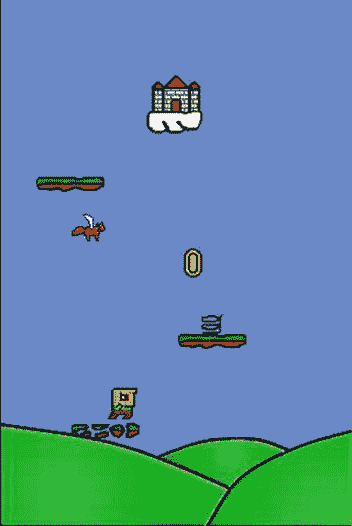
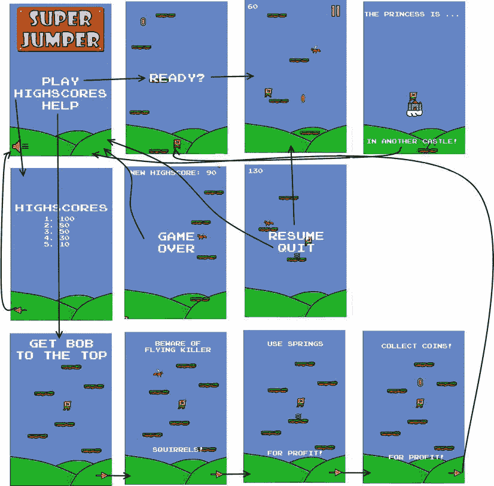
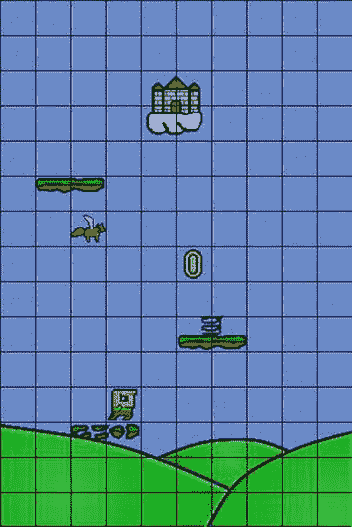
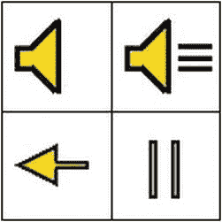
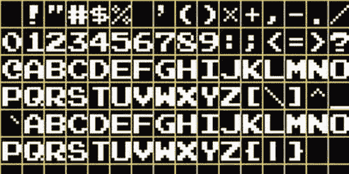
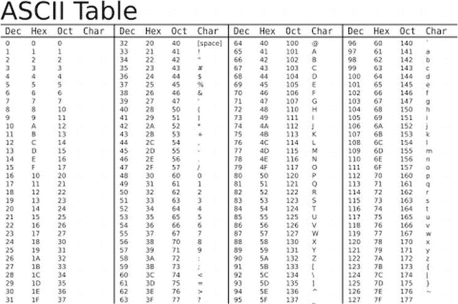
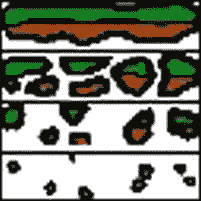
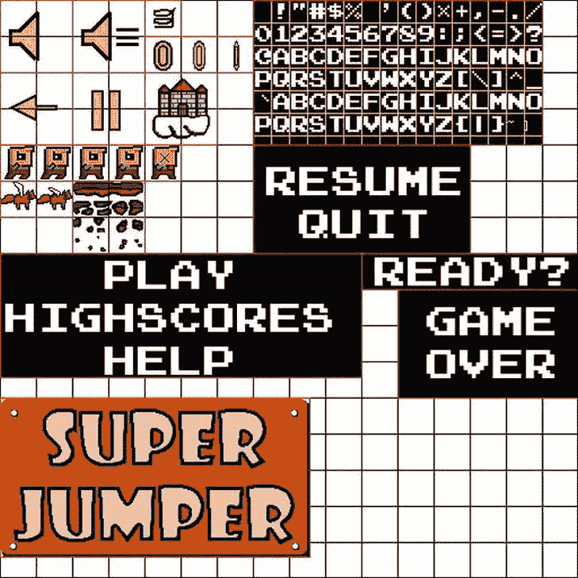

# 九、超级 Jumper：一款 2D OpenGL ES 游戏

是时候把你所学的关于 OpenGL ES 的知识整合到一个游戏中了。正如在第三章中所讨论的，在移动领域开发游戏时，有几个非常流行的类型可供选择。对于我们的下一个游戏，我们决定坚持休闲风格。我们将实现一个类似于*绑架*或*涂鸦跳跃*的跳跃游戏。和 Nom 先生一样，我们将从定义我们的游戏机制开始。

核心游戏机制

如果你不熟悉*诱拐*，我们建议你把它安装在你的 Android 设备上试一试(在 Google Play 上免费下载)，或者至少在网上看一段这个游戏的视频。以*绑架*为例，我们可以浓缩我们游戏的核心游戏机制，这款游戏将被称为超级 Jumper。以下是一些细节:

*   主角不断向上跳跃，从一个平台移动到另一个平台。游戏世界垂直跨越多个屏幕。
*   水平移动可以通过向左或向右倾斜手机来控制。
*   当主角离开一个水平的屏幕边界时，他从对面重新进入屏幕。
*   平台可以是静止的，也可以是水平移动的。
*   有些平台会在主角撞上的时候随机粉化。
*   一路上，主角可以收集物品得分。
*   除了硬币，还有一些平台上的弹簧会让主角跳得更高。
*   邪恶势力充斥着游戏世界，水平移动。当我们的主角击中其中一个时，他就会死亡，游戏也就结束了。
*   当我们的主角跌破屏幕底部边缘时，游戏就结束了。
*   最高级别是某种目标。当主角达到那个目标，一个新的水平就开始了。

虽然这个列表比我们为 Nom 先生创建的要长，但它看起来并没有复杂多少。图 9-1 显示了核心原则的初始模型。这一次，我们直接去了 Paint.NET 制作模型。让我们想一个背景故事。



[图 9-1。我们最初的游戏力学模型，展示了主角、平台、弹簧、硬币、邪恶力量和关卡顶端的目标](#_Fig1)

发展背景故事和选择艺术风格

我们将完全发挥创造力，为我们的游戏开发以下独特的故事。

我们的主角鲍勃患有慢性跳楼症。他每次触地都注定要跳起来。更糟糕的是，他心爱的公主，将保持无名，被一个邪恶的飞行杀手松鼠军队绑架，并放置在空中城堡。鲍勃的情况证明毕竟是有益的，他开始寻找他所爱的人，与邪恶的松鼠力量作斗争。

这个经典的视频游戏故事非常适合 8 位图形风格，这种风格可以在游戏中找到，例如 NES 上的原版*超级马里奥兄弟*。[图 9-1](#Fig1) 中的实体模型展示了我们游戏中所有元素的最终图形。鲍勃，硬币，飞行松鼠，粉碎平台，当然，动画。我们还将使用符合我们视觉风格的音乐和音效。

定义屏幕和过渡

我们现在能够定义我们的屏幕和过渡。按照我们在 Nom 先生中使用的公式，我们将包括以下元素:

*   带有标志的主屏幕；播放、高分和帮助菜单项。和启用声音的按钮。
*   一个游戏屏幕，要求玩家做好准备，并优雅地处理运行、暂停、游戏结束和下一级状态。我们在《诺姆先生》中使用的唯一新增加的是屏幕的下一级状态，这将在鲍勃击中城堡时触发。在这种情况下，将产生一个新的水平，鲍勃将再次从世界底部开始，保持他的分数。
*   一个高分屏幕，显示玩家目前为止获得的前五分。
*   向玩家展示游戏机制和目标的帮助屏幕。我们将偷偷摸摸地省略如何控制玩家的描述。现在的孩子应该能够处理我们在 80 年代和 90 年代初面临的复杂性，当时游戏没有提供任何指导。

这与《诺姆先生》中的设置大致相同。[图 9-2](#Fig2) 显示了所有的屏幕和过渡。请注意，除了暂停按钮，我们在游戏屏幕或其子屏幕上没有任何按钮。当被问及是否准备好时，用户会直观地触摸屏幕。



[图 9-2。](#_Fig2)超级跳线的所有屏幕和过渡

定义好屏幕和过渡后，我们现在可以考虑世界的大小和单位，以及这些大小和单位与图形资产的关系。

定义游戏世界

经典的先有鸡还是先有蛋的问题再次困扰着我们。正如你在第 8 章中了解到的，我们有世界单位(例如，米)和像素之间的对应关系。我们的物体在世界空间中被物理地定义。边界形状和位置以米为单位给出；速度以米每秒为单位。然而，我们对象的图形表示是用像素定义的，所以我们必须有某种映射。我们通过首先为我们的图形资产定义一个目标分辨率来克服这个问题。与 Nom 先生一样，我们将使用 320×480 像素的目标分辨率(纵横比为 1.5)。我们使用这个目标是因为它是最低的实际分辨率；如果你专门针对平板电脑，你可能希望使用 800×1280 这样的分辨率，或者介于两者之间，比如 480×800(典型的 Android 手机)。不管你的目标是什么，原则都是一样的。

接下来我们要做的是在我们的世界中建立像素和米之间的对应关系。图 9-1 中的模型给我们一种感觉，不同的对象使用了多少屏幕空间，以及它们相对于彼此的比例。我们建议为 2D 游戏选择 32 像素到 1 米的映射。因此，让我们覆盖我们的实体模型，它的大小为 320×380 像素，每个单元格为 32×32 像素。在我们的世界空间中，这将映射到 1×1 米的单元。[图 9-3](#Fig3) 显示了我们的实体模型和网格。



[图 9-3。](#_Fig3)覆盖有网格的实体模型。每个单元为 32×32 像素，对应游戏世界中 1×1 米的区域

我们在[图 9-3](#Fig3) 中作弊了一点。我们以某种方式排列图形，使它们与网格单元很好地对齐。在真实的游戏中，我们会把物体放在非整数的位置。

那么，我们能从[图 9-3](#Fig3) 中得到什么？首先，我们可以用米直接估算出我们世界中每个物体的宽度和高度。下面是我们将用于物体的矩形边界的值:

*   bob 0.8×0.8 米；他没有完全跨越一个完整的细胞。
*   一个平台为 2×0.5 米，水平占用两个单元，垂直占用半个单元。
*   一枚硬币是 0.8×0.5 米。它几乎垂直跨越一个单元格，水平占据大约半个单元格。
*   一个弹簧为 0.5×0.5 米，在每个方向上向上延伸半个单元。弹簧实际上比它的宽度要高一点。我们把它的边界形状做成方形，这样碰撞测试会更宽容一些。
*   一只松鼠是 1×0.8 米。
*   一座城堡是 1.8×1.8 米。

有了这些尺寸，我们也就有了用于碰撞检测的物体的边界矩形的尺寸。如果它们变得有点太大或太小，我们可以调整它们，这取决于游戏如何使用这些值。

从图 9-3 中我们可以得到的另一件事是我们的视见平截头体的大小。它将向我们展示 10×15 米的世界。

剩下唯一要定义的是游戏中的速度和加速度。这些在很大程度上取决于我们对游戏的期望。通常，你必须做一些实验来得到正确的值。经过几次反复调整后，我们得出了以下结论:

*   重力加速度矢量是(0，–13)米/秒 <sup>2</sup> ，比我们在地球上得到的和我们在[第八章](08.html)的大炮例子中使用的略多。
*   Bob 的初始跳跃速度向量为(0，11) m/s。请注意，跳跃速度仅影响 y 轴上的移动。水平移动将由当前加速度计读数来定义。
*   当 Bob 击中弹簧时，他的跳跃速度矢量将是正常跳跃速度的 1.5 倍。这相当于(0，16.5)米/秒。同样，该值完全是通过实验得出的。
*   Bob 的水平移动速度是 20 m/s，注意那是无方向的速度，不是矢量。我们稍后将解释它如何与加速度计一起工作。
*   松鼠会不断地从左到右来回巡逻。它们的恒定移动速度为 3 米/秒。用矢量表示，如果松鼠向左移动，速度为(–3，0)米/秒；如果松鼠向右移动，速度为(3，0)米/秒。

那么鲍勃的水平移动将如何工作呢？我们之前定义的移动速度，其实就是 Bob 的最大水平速度。根据玩家倾斜手机的程度，Bob 的水平移动速度将在 0(不倾斜)和 20 m/s(完全向一侧倾斜)之间。

我们将使用加速度计的 x 轴值，因为我们的游戏将以纵向模式运行。当手机没有倾斜时，axis 会报告 0 米/秒的加速度 <sup>2</sup> 。当完全向左倾斜以使手机处于横向时，axis 将报告大约-10 米/秒的加速度 <sup>2</sup> 。当完全向右倾斜时，轴将报告大约 10 米/秒的加速度 <sup>2</sup> 。我们需要做的就是将加速度计读数除以最大绝对值(10)，然后乘以 Bob 的最大水平速度，从而实现标准化。因此，当电话完全倾斜到一侧时，Bob 将向左或向右移动 20 m/s，如果电话倾斜较小，则移动更少。当手机完全倾斜时，Bob 每秒可以在屏幕上移动两次。

我们将根据 x 轴上的当前加速度计值更新每一帧的水平移动速度，并将其与 Bob 的垂直速度相结合，Bob 的垂直速度是从重力加速度和他的当前垂直速度中得出的，就像我们在第 8 章的示例中对炮弹所做的那样。

世界的一个重要方面是我们看到的那一部分。由于 Bob 在底部边缘离开屏幕时会死亡，因此我们的摄像头也在游戏机制中发挥了作用。虽然我们将使用一个相机进行渲染，并在 Bob 跳跃时将其向上移动，但我们不会在我们的世界模拟类中使用它。相反，我们记录 Bob 目前最高的 y 坐标。如果他低于这个值减去视锥高度的一半，我们知道他已经离开了屏幕。因此，我们在模型(我们的世界模拟类)和视图之间没有完全清晰的分离，因为我们需要知道视图截锥的高度来确定 Bob 是否死了。我们可以忍受这个。

让我们看看我们需要的资产。

创建资产

我们的新游戏有两种类型的图形资产:UI 元素和实际的游戏或世界元素。让我们从 UI 元素开始。

用户界面元素

首先要注意的是 UI 元素(按钮、徽标等等)不依赖于我们的像素到世界单位的映射。正如 Nom 先生所说，我们将它们设计成适合目标分辨率——在我们的例子中，是 320×480 像素。看[图 9-2](#Fig2) ，可以确定我们有哪些 UI 元素。

我们创建的第一个 UI 元素是不同屏幕所需的按钮。[图 9-4](#Fig4) 显示了我们游戏的所有按钮。



[图 9-4。](#_Fig4)各种按钮，每个大小为 64×64 像素

我们更喜欢在网格中创建所有图形资产，网格的单元格大小为 32×32 或 64×64 像素。[图 9-4](#Fig4) 中的按钮被布置在一个网格中，每个单元有 64×64 个像素。顶行中的按钮在主菜单屏幕上用于指示是否启用声音。左下角的箭头在几个屏幕中用于导航到下一个屏幕。游戏屏幕右下角的按钮用于游戏运行时，允许用户暂停游戏。

你可能想知道为什么没有指向右边的箭头。记住第八章中的内容，使用我们的高级精灵批处理器，我们可以通过指定负的宽度和/或高度值来轻松翻转我们绘制的东西。我们将对几个图形资产使用这个技巧来节省一些内存。

接下来是我们在主菜单屏幕上需要的元素:徽标、菜单项和背景图像。图 9-5 显示了所有这些元素。


[图 9-5。](#_Fig5)背景图像、主菜单项和徽标

背景图像不仅用于主菜单屏幕，还用于所有屏幕。它和我们的目标分辨率一样，320×480 像素。主菜单项由 300×110 像素组成。主菜单使用黑色背景是因为白底白字不好看。当然，在实际图像中，主菜单的背景是由透明像素组成的。该徽标为 274×142 像素，角上有一些透明像素。

接下来是帮助屏幕图像。我们没有用几个元素将它们合成，而是懒洋洋地将它们制作成 320×480 大小的全屏图像。这将减少我们的绘图代码的大小，而不会增加我们的程序的大小。您可以在[图 9-2](#Fig2) 中看到所有的帮助屏幕。我们将合成这些图像的唯一东西是箭头按钮。

对于高分屏幕，我们将重用主菜单图像中显示高分的部分。实际的分数是用一种特殊的技术来表现的，我们将在本章的后面部分研究这种技术。屏幕的其余部分再次由背景图像和一个按钮组成。

游戏屏幕还有一些文本 UI 元素，即 READY？标签、暂停状态的菜单项(恢复和退出)和游戏结束标签。图 9-6 展示了他们所有的荣耀。


[图 9-6。](#_Fig6)准备好了吗？、恢复、退出和游戏结束标签

用位图字体处理文本

那么，我们如何渲染游戏屏幕中的其他文本元素呢？我们使用在《诺姆先生》中使用的相同技术来渲染分数。我们现在不仅有数字，还有文字。我们使用一个图像图谱，其中每个子图像代表一个角色(例如， *0* 或 *a* )。这个图像集被称为位图字体。[图 9-7](#Fig7) 显示了我们将要使用的位图字体。



[图 9-7。](#_Fig7)位图字体

图 9-7 中的黑色背景和网格当然不是实际图像的一部分。在游戏中，使用位图字体在屏幕上呈现文本是一种非常古老的技术。位图字体通常包含一系列 ASCII 字符的图像。一个这样的字符图像被称为*字形* 。ASCII 是 Unicode 的前身之一。ASCII 字符集中有 128 个字符，如图[图 9-8](#Fig8) 所示。



[图 9-8。](#_Fig8) ASCII 字符及其十进制、十六进制和八进制值

在这 128 个字符中，有 95 个是可打印的(字符 32 到 126)。我们的位图字体只包含可打印的字符。位图字体的第一行包含字符 32 到 47，下一行包含字符 48 到 63，依此类推。ASCII 仅在您希望存储和显示使用标准拉丁字母的文本时有用。有一种扩展的 ASCII 格式，使用值 128 到 255 来编码西方语言的其他常见字符，如“”和“”。更具表现力的字符集(例如，中文或阿拉伯文)通过 Unicode 表示，不能通过 ASCII 编码。对于我们的游戏，标准的 ASCII 字符集就足够了。

那么，我们如何用位图字体渲染文本呢？事实证明这真的很容易。首先，我们创建 96 个纹理区域，每个映射到位图字体中的一个字形。我们可以将这些纹理区域存储在一个数组中，如下所示:

```java
TextureRegion[] glyphs = new TextureRegion[96];
```

Java 字符串以 16 位 Unicode 编码。幸运的是，位图字体中的 ASCII 字符在 ASCII 和 Unicode 中有相同的值。要获取 Java 字符串中字符的区域，我们只需要这样做:

```java
int index = string.charAt(i) – 32;
```

这为我们提供了纹理区域数组的直接索引。我们只是从字符串中的当前字符中减去空格字符(32)的值。如果索引小于 0 或大于 95，则我们有一个不在位图字体中的 Unicode 字符。通常，我们只是忽略了这样一个人物。

为了在一行中呈现多个字符，我们需要知道字符之间应该有多少空间。[图 9-7](#Fig7) 中的位图字体是一种*固定* - *宽度字体*，意思是每个字形宽度相同。我们的位图字体字形每个都有 16×20 像素的大小。当我们在字符串中从一个字符到另一个字符提升渲染位置时，我们只需要增加 20 个像素。我们将绘制位置从一个字符移动到另一个字符的像素数称为*前进*。对于我们的位图字体，它是固定的；然而，它通常是可变的，取决于我们绘制的字符。一种更复杂的前进形式通过考虑我们将要绘制的当前字符和下一个字符来计算前进。这个技巧叫做*字距调整* ，如果你想在网上查的话。我们将只使用固定宽度的位图字体，因为它们使我们的生活变得相当容易。

那么，我们是如何生成 ASCII 位图字体的呢？我们使用了网络上众多工具中的一种来生成位图字体。我们用的这个叫做 Codehead 的位图字体生成器(CBFG) ，在`www.codehead.co.uk/cbfg/`可以免费获得。您可以在硬盘上选择一个字体文件，并指定字体的高度，生成器将从该文件中为 ASCII 字符集生成一个图像。该工具有许多选项，超出了我们在这里讨论的范围。我们建议您下载 CBFG，并对它进行一些小的改动。

我们将使用这种技术来绘制游戏中所有剩余的字符串。稍后，您将看到位图字体类的具体实现。现在，让我们回到创建我们的资产。

有了位图字体，我们现在有了所有图形用户界面元素的资产。我们将通过一个 sprite 批处理程序使用一个相机来渲染它们，这个相机设置了一个直接映射到我们的目标分辨率的视锥。这样，我们可以在像素坐标中指定所有的坐标。

游戏元素

如前所述，实际的游戏对象取决于我们的像素到世界单位的映射。为了使游戏元素的创建尽可能容易，我们使用了一个小技巧:我们用每个单元 32×32 像素的网格开始每幅画。所有的物体都集中在一个或多个这样的单元中，因此它们很容易与我们世界中它们的物理尺寸相对应。让我们从鲍勃开始，如图 9-9 中的[所示。](#Fig9)


[图 9-9。](#_Fig9)鲍勃和他的五个动画帧

[图 9-9](#Fig9) 显示了跳跃的两帧，坠落的两帧，死亡的一帧。每个图像的大小为 160×32 像素，每个动画帧的大小为 32×32 像素。背景像素是透明的。

鲍勃可能处于三种状态之一:跳跃、坠落或死亡。我们有这些状态的动画帧。诚然，两个跳跃帧和两个下落帧之间的差异很小——只有他的额发在摆动。我们将为 Bob 的三个动画分别创建一个动画实例，并根据他的当前状态使用它们进行渲染。我们也没有鲍勃朝左的重复帧。和箭头按钮一样(如前所示，在图 9-4 中),我们将通过调用 SpriteBatcher.drawSprite()指定一个负宽度来水平翻转 Bob 的图像。

[图 9-10](#Fig10) 描绘了邪恶的飞鼠。我们又有了两个动画帧，所以松鼠看起来在拍打它邪恶的翅膀。


[图 9-10。](#_Fig10)一只邪恶的飞鼠和它的两个动画帧

[图 9-10](#Fig10) 中的图像为 64×32 像素，每帧为 32×32 像素。

[图 9-11](#Fig11) 所示的硬币动画比较特殊。我们的关键帧序列不会是 1，2，3，1，而是 1，2，3，2，1。否则，硬币将从第 3 帧中的折叠状态变为第 1 帧中的完全展开状态。我们可以通过重复使用第二个框架来节省一点空间。


[图 9-11。](#_Fig11)硬币及其动画帧

[图 9-11](#Fig11) 中的图像为 96×32 像素，每帧为 32×32 像素。

关于图 9-12 中的弹簧图像，不必多说。春天只是快乐地坐在图像的中心。该图像为 32×32 像素。


[图 9-12。](#_Fig12)春天

图 9-13 中的城堡也不是动画。它比其他对象大(64×64 像素)。


[图 9-13。](#_Fig13)城堡

[图 9-14](#Fig14) (64x64 像素)中的平台有四个动画帧。根据我们的游戏机制，一些平台在鲍勃击中时会被粉碎。我们将播放一次这种情况下平台的完整动画。对于静态平台，我们只使用第一个框架。



[图 9-14。](#_Fig14)平台及其动画帧

纹理图谱拯救世界

既然我们已经确定了游戏中所有的图形资产，我们需要讨论它们的纹理。我们已经讨论过纹理需要有 2 的幂的宽度和高度。我们的背景图像和所有帮助屏幕的尺寸都是 320×480 像素。我们将把它们存储在 512×512 像素的图像中，这样我们就可以把它们作为纹理来加载。已经有六种纹理了。

我们是否也为所有其他图像创建单独的纹理？不。我们创建一个单一的纹理图谱。事实证明，其他所有东西都可以很好地放在一个 512×512 像素的地图集里，我们可以将它作为一个单一的纹理来加载——这将使 GPU 非常高兴，因为我们只需要为所有游戏元素绑定一个纹理，除了背景和帮助屏幕图像。[图 9-15](#Fig15) 所示为图集。



[图 9-15。](#_Fig15)威武纹理图册

图 9-15 中的图像尺寸为 512×512 像素。网格和红色轮廓不是图像的一部分，背景像素是透明的。UI 标签的黑色背景像素和位图字体也是如此。网格单元的大小为 32×32 像素。像这样使用纹理贴图集很酷的一点是，如果你想支持更高分辨率的屏幕，除了这个纹理贴图集的大小，你不需要改变任何东西。您可以使用更高保真的图形将其放大到 1024×1024 像素，即使您的目标是 320×480，OpenGL ES 也可以在不改变游戏的情况下为您提供更好的图形！

我们把地图集里所有的图像放在坐标为 32 的倍数的角上。这使得创建纹理区域更容易。

音乐和声音

我们还需要音效和音乐。由于我们的游戏是一个 8 位复古风格的游戏，所以使用*芯片曲调*、音效和合成器生成的音乐是合适的。最著名的芯片曲调是由任天堂的 nes，s NES 和游戏男孩。为了音效，我们使用了一个叫做 *as3sfxr* 的工具(汤姆·维安的 Flash 版 *sfxr* ，由托马斯·彼得森创作)。可以在[www.superflashbros.net/as3sfxr](http://www.superflashbros.net/as3sfxr)找到。[图 9-16](#Fig16) 显示了其用户界面。


[图 9-16。](#_Fig16) as3sfxr，sfxr 的一个 Flash 端口

我们为跳跃、撞击弹簧、撞击硬币和撞击松鼠创造了音效。我们还为点击 UI 元素创建了声音效果。我们所做的就是在 as3sfxr 中为每一个类别捣碎左边的按钮，直到我们找到一个合适的声音效果。

游戏音乐通常比较难得到。网上有几个网站以 8 位芯片调谐为特色，适合像超级 Jumper 这样的游戏。我们将用一首名为“新歌”的歌曲，由盖尔·捷尔塔创作。这首歌可以在免费音乐档案馆([www.freemusicarchive.org](http://www.freemusicarchive.org))找到。它是在知识共享署名-非商业性使用-类似共享 3.0 美国许可证下许可的。这意味着我们可以在非商业项目中使用它，例如我们的开源超级 Jumper 游戏，只要我们将归属权交给 Geir，并且不修改原始作品。当你在网上搜索游戏中使用的音乐时，一定要确保你遵守许可。人们在他们的歌曲中投入了很多心血。如果许可证不适合你的项目(也就是说，如果你的游戏是商业游戏)，那么你就不能使用它。

实现超级跳线

实现超级 Jumper 将非常容易。我们可以重用第 8 章的完整框架，并在高层次上遵循 Nom 先生的架构。这意味着我们将为每个屏幕创建一个类，每个类都将实现该屏幕的逻辑和表示。除此之外，我们还将使用适当的清单文件、assets/folder 中的所有资产、应用的图标等来设置我们的标准项目。让我们从我们的主要资产类别开始。只要像以前一样设置项目，复制所有的框架类，就可以编写这个精彩的游戏了。

资产类别

在 Nom 先生中，我们已经有了一个资产类，它仅由静态成员变量中保存的一公吨的位图和声音引用组成。我们将在《超级 Jumper》中做同样的事情。不过，这一次，我们将添加一些加载逻辑。清单 9-1 显示了代码，其中夹杂了注释。

[**清单 9-1。Assets.java 的**](#_list1) ，它拥有除了帮助屏幕纹理之外的所有资源

```java
package com.badlogic.androidgames.jumper;

import com.badlogic.androidgames.framework.Music;
import com.badlogic.androidgames.framework.Sound;
import com.badlogic.androidgames.framework.gl.Animation;
import com.badlogic.androidgames.framework.gl.Font;
import com.badlogic.androidgames.framework.gl.Texture;
import com.badlogic.androidgames.framework.gl.TextureRegion;
import com.badlogic.androidgames.framework.impl.GLGame;

public class Assets {
    public static Texture*background*;
    public static TextureRegion*backgroundRegion*;

    public static Texture*items*;
    public static TextureRegion*mainMenu*;
    public static TextureRegion*pauseMenu*;
    public static TextureRegion*ready*;
    public static TextureRegion*gameOver*;
    public static TextureRegion*highScoresRegion*;
    public static TextureRegion*logo*;
    public static TextureRegion*soundOn*;
    public static TextureRegion*soundOff*;
    public static TextureRegion*arrow*;
    public static TextureRegion*pause*;
    public static TextureRegion*spring*;
    public static TextureRegion*castle*;
    public static Animation*coinAnim*;
    public static Animation*bobJump*;
    public static Animation*bobFall*;
    public static TextureRegion*bobHit*;
    public static Animation*squirrelFly*;
    public static TextureRegion*platform*;
    public static Animation*brakingPlatform*;
    public static Font*font*;

    public static Music*music*;

    public static Sound*jumpSound*;
    public static Sound*highJumpSound*;
    public static Sound*hitSound*;
    public static Sound*coinSound*;
    public static Sound*clickSound*;
```

该类包含了我们在游戏中需要的所有纹理、纹理区域、动画、音乐和声音实例的引用。这里我们唯一没有加载的是帮助屏幕的图像。

```java
    public static void load(GLGame game) {
        *background* = new Texture(game, "background.png");
        *backgroundRegion* = new TextureRegion(*background*, 0, 0, 320, 480);

        *items* = new Texture(game, "items.png");
        *mainMenu* = new TextureRegion(*items*, 0, 224, 300, 110);
        *pauseMenu* = new TextureRegion(*items*, 224, 128, 192, 96);
        *ready* = new TextureRegion(*items*, 320, 224, 192, 32);
        *gameOver* = new TextureRegion(*items*, 352, 256, 160, 96);
        *highScoresRegion* = new TextureRegion(Assets.*items*, 0, 257, 300, 110 / 3);
        *logo* = new TextureRegion(*items*, 0, 352, 274, 142);
        *soundOff* = new TextureRegion(*items*, 0, 0, 64, 64);
        *soundOn* = new TextureRegion(*items*, 64, 0, 64, 64);
        *arrow* = new TextureRegion(*items*, 0, 64, 64, 64);
        *pause* = new TextureRegion(*items*, 64, 64, 64, 64);

        *spring* = new TextureRegion(*items*, 128, 0, 32, 32);
        *castle* = new TextureRegion(*items*, 128, 64, 64, 64);
        *coinAnim* = new Animation(0.2f,
                                 new TextureRegion(*items*, 128, 32, 32, 32),
                                 new TextureRegion(*items*, 160, 32, 32, 32),
                                 new TextureRegion(*items*, 192, 32, 32, 32),
                                 new TextureRegion(*items*, 160, 32, 32, 32));
        *bobJump* = new Animation(0.2f,
                                new TextureRegion(*items*, 0, 128, 32, 32),
                                new TextureRegion(*items*, 32, 128, 32, 32));
        *bobFall* = new Animation(0.2f,
                                new TextureRegion(*items*, 64, 128, 32, 32),
                                new TextureRegion(*items*, 96, 128, 32, 32));
        *bobHit* = new TextureRegion(*items*, 128, 128, 32, 32);
        *squirrelFly* = new Animation(0.2f,
                                    new TextureRegion(*items*, 0, 160, 32, 32),
                                    new TextureRegion(*items*, 32, 160, 32, 32));
        *platform* = new TextureRegion(*items*, 64, 160, 64, 16);
        *brakingPlatform* = new Animation(0.2f,
                                     new TextureRegion(*items*, 64, 160, 64, 16),
                                     new TextureRegion(*items*, 64, 176, 64, 16),
                                     new TextureRegion(*items*, 64, 192, 64, 16),
                                     new TextureRegion(*items*, 64, 208, 64, 16));
        *font* = new Font(*items*, 224, 0, 16, 16, 20);
        *music* = game.getAudio().newMusic("music.mp3");
        *music*.setLooping( true );
        *music*.setVolume(0.5f);
        if (Settings.*soundEnabled*)
            *music*.play();
        *jumpSound* = game.getAudio().newSound("jump.ogg");
        *highJumpSound* = game.getAudio().newSound("highjump.ogg");
        *hitSound* = game.getAudio().newSound("hit.ogg");
        *coinSound* = game.getAudio().newSound("coin.ogg");
        *clickSound* = game.getAudio().newSound("click.ogg");
    }
```

load()方法将在游戏开始时调用一次，负责填充该类的所有静态成员。它加载背景图像并为其创建相应的 TextureRegion。接下来，它加载纹理地图并创建所有必要的纹理区域和动画。将代码与[图 9-15](#Fig15) 和上一节中的其他图进行比较。关于加载图形资产的代码，唯一值得注意的是硬币动画实例的创建。如前所述，我们在动画帧序列的末尾重用第二帧。所有动画都使用 0.2 秒的帧时间。

我们还创建了 Font 类的一个实例，我们还没有讨论过。它将实现用嵌入在 atlas 中的位图字体来呈现文本的逻辑。构造函数获取纹理，该纹理包含位图字体标志符号、包含标志符号的区域的左上角的像素坐标、每行的标志符号数以及每个标志符号的像素大小。

我们还在那个方法中加载所有的音乐和声音实例。正如你所看到的，我们又和老朋友一起工作了。我们可以从 Mr. Nom 项目中原样重用它，只需稍加修改，您马上就会看到。请注意，我们将 Music 实例设置为循环播放，音量设置为 0.5，因此它比声音效果稍微安静一些。只有当用户之前没有禁用声音时，音乐才会开始播放，声音存储在 Settings 类中，如 Mr. Nom。

```java
    public static void reload() {
        *background*.reload();
        *items*.reload();
        if (Settings.*soundEnabled*)
            *music*.play();
    }
```

接下来，我们有一个神秘的方法叫做 reload()。请记住，当我们的应用暂停时，OpenGL ES 上下文将会丢失。当应用恢复时，我们必须重新加载纹理，这正是这个方法要做的。如果启用了声音，我们还会恢复音乐播放。

```java
    public static void playSound(Sound sound) {
        if (Settings.*soundEnabled*)
            sound.play(1);
    }
}
```

这个类的最后一个方法 playSound()是一个助手方法，我们将在剩下的代码中使用它来回放音频。我们将检查封装在这个方法中，而不是检查是否在任何地方都启用了声音。

我们来看看修改后的设置类。

设置类

在设置类中没有太多变化。清单 9-2 显示了我们稍微修改过的设置类的代码。

[**清单 9-2。**](#_list2) 设置。java，我们稍微修改的设置类，借用了 Nom 先生

```java
package com.badlogic.androidgames.jumper;

import java.io.BufferedReader;
import java.io.BufferedWriter;
import java.io.IOException;
import java.io.InputStreamReader;
import java.io.OutputStreamWriter;

import com.badlogic.androidgames.framework.FileIO;

public class Settings {
    public static boolean *soundEnabled* = true ;
    public final static int []*highscores* = new int [] { 100, 80, 50, 30, 10 };
    public final static String*file* = ".superjumper";

    public static void load(FileIO files) {
        BufferedReader in = null ;
        try {
            in = new BufferedReader( new InputStreamReader(files.readFile(*file*)));
            *soundEnabled* = Boolean.*parseBoolean*(in.readLine());
            for (int i = 0; i < 5; i++) {
                *highscores*[i] = Integer.*parseInt*(in.readLine());
            }
        } catch (IOException e) {
            // :( It's ok we have defaults
        } catch (NumberFormatException e) {
            // :/ It's ok , defaults save our day
        } finally {
            try {
                if (in != null )
                    in.close();
            } catch (IOException e) {
            }
        }
    }

    public static void save(FileIO files) {
        BufferedWriter out = null ;
        try {
            out = new BufferedWriter( new OutputStreamWriter(
                    files.writeFile(*file*)));
            out.write(Boolean.*toString*(*soundEnabled*));
            out.write("\n");
            for (int i = 0; i < 5; i++) {
                out.write(Integer.*toString*(*highscores*[i]));
                out.write("\n");
            }

        } catch (IOException e) {
        } finally {
            try {
                if (out != null )
                    out.close();
            } catch (IOException e) {
            }
        }
    }

    public static void addScore( int score) {
        for (int i=0; i < 5; i++) {
            if (*highscores*[i] < score) {
                for (int j= 4; j > i; j--)
                    *highscores*[j] =*highscores*[j-1];
                *highscores*[i] = score;
                break ;
            }
        }
    }
}
```

与这个类的 Mr. Nom 版本的唯一区别是我们读写设置的文件。而不是。mrnom，我们现在使用文件. superjumper。

主要活动

我们需要一个活动作为我们游戏的主要切入点。我们称之为超级 Jumper。清单 9-3 显示了它的代码。

[**清单 9-3。**](#_list3)SuperJumper.java，主要入口点类

```java
package com.badlogic.androidgames.jumper;

import javax.microedition.khronos.egl.EGLConfig;
import javax.microedition.khronos.opengles.GL10;

import com.badlogic.androidgames.framework.Screen;
import com.badlogic.androidgames.framework.impl.GLGame;

public class SuperJumper extends GLGame {
    boolean firstTimeCreate = true ;

    public Screen getStartScreen() {
        return new MainMenuScreen( this );
    }

    @Override
    public void onSurfaceCreated(GL10 gl, EGLConfig config) {
        super.onSurfaceCreated(gl, config);
        if (firstTimeCreate) {
            Settings.load(getFileIO());
            Assets.load( this );
            firstTimeCreate = false ;
        } else {
            Assets.reload();
        }
    }

    @Override
    public void onPause() {
        super.onPause();
        if (Settings.soundEnabled)
            Assets.music.pause();
    }
}
```

我们从 GLGame 派生并实现 getStartScreen()方法，该方法返回一个 MainMenuScreen 实例。另外两种方法不太明显。

我们覆盖 onSurfaceCreate()，每次重新创建 OpenGL ES 上下文时都会调用它(与第 7 章中[GL game 的代码比较)。如果第一次调用该方法，我们将使用 Assets.load()方法加载所有资产，并从 SD 卡上的设置文件中加载设置(如果可用)。否则，我们需要做的就是通过 Assets.reload()方法重新加载纹理并开始播放音乐。我们还覆盖 onPause()方法来暂停正在播放的音乐。我们做这两件事，这样我们就不必在屏幕的 resume()和 pause()方法中重复它们。](07.html)

在我们深入到屏幕实现之前，让我们看一下我们的新字体类。

字体类

我们将使用位图字体来呈现任意(ASCII)文本。我们已经讨论了这在高层次上是如何工作的，所以让我们看看清单 9-4 中的代码。

[**清单 9-4。**](#_list4)Font.java，一个位图字体渲染类

```java
package com.badlogic.androidgames.framework.gl;

public class Font {
    public final Texture texture;
    public final int glyphWidth;
    public final int glyphHeight;
    public final TextureRegion[] glyphs = new TextureRegion[96];
```

该类存储包含字体标志符号的纹理、单个标志符号的宽度和高度以及一个 TextureRegions 数组(每个标志符号一个)。数组中的第一个元素保存空格标志符号的区域，下一个元素保存感叹号标志符号的区域，依此类推。换句话说，第一个元素对应于代码为 32 的 ASCII 字符，最后一个元素对应于代码为 126 的 ASCII 字符。

```java
    public Font(Texture texture,
                int offsetX, int offsetY,
                int glyphsPerRow, int glyphWidth, int glyphHeight) {
        this .texture = texture;
        this .glyphWidth = glyphWidth;
        this .glyphHeight = glyphHeight;
        int x = offsetX;
        int y = offsetY;
        for (int i = 0; i < 96; i++) {
            glyphs[i] = new TextureRegion(texture, x, y, glyphWidth, glyphHeight);
            x += glyphWidth;
            if (x == offsetX + glyphsPerRow * glyphWidth) {
                x = offsetX;
                y += glyphHeight;
            }
        }
    }
```

在构造函数中，我们存储位图字体的配置并生成字形区域。offsetX 和 offsetY 参数指定纹理中位图字体区域的左上角。在我们的纹理图谱中，这是(224，0)处的像素。参数 glyphsPerRow 告诉我们每行有多少个字形，参数 glyphWidth 和 glyphHeight 指定单个字形的大小。因为我们使用固定宽度的位图字体，所以所有字形的大小是相同的。glyphWidth 也是我们在渲染多个字形时要前进的值。

```java
    public void drawText(SpriteBatcher batcher, String text, float x, float y) {

        int len = text.length();
        for (int i = 0; i < len; i++) {
            int c = text.charAt(i) - ' ';
            if (c < 0 || c > glyphs.length - 1)
                continue ;

            TextureRegion glyph = glyphs[c];
            batcher.drawSprite(x, y, glyphWidth, glyphHeight, glyph);
            x += glyphWidth;
        }
    }
}
```

drawText()方法接受一个 SpriteBatcher 实例、一行文本以及开始绘制文本的 x 和 y 位置。x 和 y 坐标指定第一个字形的中心。我们所做的就是获取字符串中每个字符的索引，检查我们是否有它的字形，如果有，就通过 SpriteBatcher 呈现它。然后，我们将 x 坐标增加 glyphWidth，这样我们就可以开始呈现字符串中的下一个字符。

你可能想知道为什么我们不需要绑定包含字形的纹理。我们假设这是在调用 drawText()之前完成的。原因是文本渲染可能是批处理的一部分，在这种情况下，纹理必须已经绑定。为什么要在 drawText()方法中不必要地再绑定一次呢？请记住，OpenGL ES 只喜欢最小的状态变化。

当然，我们只能用这个类处理固定宽度的字体。如果我们想支持更通用的字体，我们还需要了解每个字符的前进方向。一种解决方案是使用字距调整，如前面的“用位图字体处理文本”一节所述不过，我们对自己的简单解决方案很满意。

goscreen 类

在前两章的例子中，我们总是通过造型来获取对 GLGraphics 的引用。让我们用一个叫做 GLScreen 的小助手类来解决这个问题，它将为我们做一些脏活，并将对 GLGraphics 的引用存储在一个成员中。清单 9-5 显示了代码。

[**清单 9-5。**](#_list5)GLScreen.java，一个小帮手类

```java
package com.badlogic.androidgames.framework.impl;

import com.badlogic.androidgames.framework.Game;
import com.badlogic.androidgames.framework.Screen;

public abstract class GLScreen extends Screen {
    protected final GLGraphics glGraphics;
    protected final GLGame glGame;

    public GLScreen(Game game) {
        super (game);
        glGame = (GLGame)game;
        glGraphics = glGame.getGLGraphics();
    }
}
```

我们将 GLGraphics 和 GLGame 实例存储在 GLScreen 类中。当然，如果作为参数传递给构造函数的游戏实例不是 GLGame，这将会崩溃。但我们会确保它是。Super Jumper 的所有屏幕都将从这个类派生。

主菜单屏幕

主菜单屏幕是由 SuperJumper.getStartScreen()返回的屏幕，因此它是玩家将看到的第一个屏幕。它呈现背景和 UI 元素，并简单地等待玩家触摸任何 UI 元素。基于被触摸的元素，游戏或者改变配置(声音启用/禁用)或者转换到新的屏幕。清单 9-6 显示了代码。

[**清单 9-6。**](#_list6)MainMenuScreen.java，主菜单屏幕

```java
package com.badlogic.androidgames.jumper;

import java.util.List;

import javax.microedition.khronos.opengles.GL10;

import com.badlogic.androidgames.framework.Game;
import com.badlogic.androidgames.framework.Input.TouchEvent;
import com.badlogic.androidgames.framework.gl.Camera2D;
import com.badlogic.androidgames.framework.gl.SpriteBatcher;
import com.badlogic.androidgames.framework.impl.GLScreen;
import com.badlogic.androidgames.framework.math.OverlapTester;
import com.badlogic.androidgames.framework.math.Rectangle;
import com.badlogic.androidgames.framework.math.Vector2;

public class MainMenuScreen extends GLScreen {
    Camera2D guiCam;
    SpriteBatcher batcher;
    Rectangle soundBounds;
    Rectangle playBounds;
    Rectangle highscoresBounds;
    Rectangle helpBounds;
    Vector2 touchPoint;
```

该类派生自 GLScreen，因此我们可以更容易地访问 GLGraphics 实例。

这个班有几个成员。第一个是名为 guiCam 的 Camera2D 实例。我们还需要一个 SpriteBatcher 来呈现我们的背景和 UI 元素。我们将使用矩形来确定用户是否触摸了 UI 元素。因为我们使用 Camera2D，所以我们还需要一个 Vector2 实例来将触摸坐标转换为世界坐标。

```java
    public MainMenuScreen(Game game) {
        super(game);
        guiCam = new Camera2D(glGraphics, 320, 480);
        batcher = new SpriteBatcher(glGraphics, 100);
        soundBounds = new Rectangle(0, 0, 64, 64);
        playBounds = new Rectangle(160 - 150, 200 + 18, 300, 36);
        highscoresBounds = new Rectangle(160 - 150, 200 - 18, 300, 36);
        helpBounds = new Rectangle(160 - 150, 200 - 18 - 36, 300, 36);
        touchPoint = new Vector2();
    }
```

在构造函数中，我们简单地设置了所有的成员。还有一个惊喜。Camera2D 实例将允许我们在 320×480 像素的目标分辨率下工作。我们需要做的就是将视图截锥的宽度和高度设置为合适的值。其余的由 OpenGL ES 动态完成。但是，请注意，原点仍然在左下角，y 轴指向上方。我们将在所有具有 UI 元素的屏幕中使用这样的 GUI 摄像头，这样我们就可以用像素而不是世界坐标来布局它们。当然，我们在不是 320×480 像素宽的屏幕上作弊了一点，但我们已经在 Nom 先生中这样做了，所以我们不需要为此感到难过。因此，我们为每个 UI 元素设置的矩形是以像素坐标给出的。

```java
    @Override
    public void update(float deltaTime) {
        List<TouchEvent> touchEvents = game.getInput().getTouchEvents();
        game.getInput().getKeyEvents();

        int len = touchEvents.size();
        for (int i = 0; i < len; i++) {
            TouchEvent event = touchEvents.get(i);
            if (event.type == TouchEvent.*TOUCH*_*UP*) {
                touchPoint.set(event.x, event.y);
                guiCam.touchToWorld(touchPoint);

                if (OverlapTester.*pointInRectangle*(playBounds, touchPoint)) {
                    Assets.*playSound*(Assets.*clickSound*);
                    game.setScreen( new GameScreen(game));
                    return ;
                }
                if (OverlapTester.*pointInRectangle*(highscoresBounds, touchPoint)) {
                    Assets.*playSound*(Assets.*clickSound*);
                    game.setScreen( new HighscoreScreen(game));
                    return ;
                }
                if (OverlapTester.*pointInRectangle*(helpBounds, touchPoint)) {
                    Assets.*playSound*(Assets.*clickSound*);
                    game.setScreen( new HelpScreen(game));
                    return ;
                }
                if (OverlapTester.*pointInRectangle*(soundBounds, touchPoint)) {
                    Assets.*playSound*(Assets.*clickSound*);
                    Settings.*soundEnabled* = !Settings.*soundEnabled*;
                    if (Settings.*soundEnabled*)
                        Assets.*music*.play();
                    else
                        Assets.*music*.pause();
                }
            }
        }
    }
```

接下来是 update()方法。我们遍历由输入实例返回的触摸事件，并检查触摸事件。如果我们有这样的事件，我们首先将触摸坐标转换为世界坐标。由于相机是以这样一种方式设置的，即我们在目标分辨率下工作，这种转换可以简单地归结为在 320×480 像素的屏幕上翻转 y 坐标。在更大或更小的屏幕上，我们只是将触摸坐标转换为目标分辨率。一旦我们有了世界接触点，我们就可以对照 UI 元素的矩形来检查它。如果触摸了 PLAY、HIGHSCORES 或 HELP，我们会转换到相应的屏幕。如果声音按钮被按下，我们改变设置，或者恢复或暂停音乐。还要注意，如果通过 Assets.playSound()方法按下了一个 UI 元素，我们将播放卡嗒声。

```java
    @Override
    public void present(float deltaTime) {
        GL10 gl = glGraphics.getGL();
        gl.glClear(GL10.*GL*_*COLOR*_*BUFFER*_*BIT*);
        guiCam.setViewportAndMatrices();

        gl.glEnable(GL10.*GL*_*TEXTURE*_*2D*);

        batcher.beginBatch(Assets.*background*);
        batcher.drawSprite(160, 240, 320, 480, Assets.*backgroundRegion*);
        batcher.endBatch();

        gl.glEnable(GL10.*GL*_*BLEND*);
        gl.glBlendFunc(GL10.*GL*_*SRC*_*ALPHA*, GL10.*GL*_*ONE*_*MINUS*_*SRC*_*ALPHA*);

        batcher.beginBatch(Assets.*items*);

        batcher.drawSprite(160, 480 - 10 - 71, 274, 142, Assets.*logo*);
        batcher.drawSprite(160, 200, 300, 110, Assets.*mainMenu*);
        batcher.drawSprite(32, 32, 64, 64, Settings.*soundEnabled*?Assets.*soundOn*:Assets.*soundOff*);

        batcher.endBatch();

        gl.glDisable(GL10.*GL*_*BLEND*);
    }
```

在这一点上，present()方法不需要任何解释，我们之前已经完成了所有这些。我们清空屏幕，通过摄像头设置投影矩阵，并渲染背景和 UI 元素。由于 UI 元素有透明的背景，我们暂时启用混合来渲染它们。背景不需要混合，所以我们不使用它，以节省一些 GPU 周期。再次注意，UI 元素是在一个坐标系统中呈现的，原点在屏幕的左下方，y 轴指向上方。

```java
    @Override
    public void pause() {
        Settings.*save*(game.getFileIO());
    }

    @Override
    public void resume() {
    }

    @Override
    public void dispose() {
    }
}
```

最后一个真正起作用的方法是 pause()方法。在这里，我们确保设置保存到 SD 卡，因为用户可以在此屏幕上更改声音设置。

帮助屏幕

我们总共有五个帮助屏幕，它们都以相同的方式工作:加载帮助屏幕图像，将其与箭头按钮一起呈现，并等待触摸箭头按钮以移动到下一个屏幕。这两个屏幕的区别仅在于各自加载的图像和切换到的屏幕。出于这个原因，我们将只查看第一个帮助屏幕的代码，如[清单 9-7](#list7) 所示，它会转换到第二个帮助屏幕。帮助屏幕的图像文件被命名为 help1.png、help2.png 等等，直到 help5.png。相应的屏幕类称为 HelpScreen、Help2Screen 等等。最后一个屏幕 Help5Screen 再次转换到 main menu 屏幕。

[**清单 9-7。**](#_list7)HelpScreen.java，第一个帮助屏幕

```java
package com.badlogic.androidgames.jumper;

import java.util.List;

import javax.microedition.khronos.opengles.GL10;
import com.badlogic.androidgames.framework.Game;

import com.badlogic.androidgames.framework.Input.TouchEvent;
import com.badlogic.androidgames.framework.gl.Camera2D;
import com.badlogic.androidgames.framework.gl.SpriteBatcher;
import com.badlogic.androidgames.framework.gl.Texture;
import com.badlogic.androidgames.framework.gl.TextureRegion;
import com.badlogic.androidgames.framework.impl.GLScreen;
import com.badlogic.androidgames.framework.math.OverlapTester;
import com.badlogic.androidgames.framework.math.Rectangle;
import com.badlogic.androidgames.framework.math.Vector2;

public class HelpScreen extends GLScreen {
    Camera2D guiCam;
    SpriteBatcher batcher;
    Rectangle nextBounds;
    Vector2 touchPoint;
    Texture helpImage;
    TextureRegion helpRegion;
```

我们又有几个成员拿着相机，一个 SpriteBatcher，一个箭头按钮的矩形，一个触摸点的向量，一个帮助图像的纹理和纹理区域。

```java
    public HelpScreen(Game game) {
        super (game);

        guiCam = new Camera2D(glGraphics, 320, 480);
        nextBounds = new Rectangle(320 - 64, 0, 64, 64);
        touchPoint = new Vector2();
        batcher = new SpriteBatcher(glGraphics, 1);
    }
```

在构造函数中，我们设置所有成员的方式与在 MainMenuScreen 中的方式非常相似。

```java
    @Override
    public void resume() {
        helpImage = new Texture(glGame, "help1.png" );
        helpRegion = new TextureRegion(helpImage, 0, 0, 320, 480);
    }

    @Override
    public void pause() {
        helpImage.dispose();
    }
```

在 resume()方法中，我们加载实际的帮助屏幕纹理，并创建一个相应的 TextureRegion，用于使用 SpriteBatcher 进行呈现。我们用这种方法加载，因为 OpenGL ES 上下文可能会丢失。如前所述，背景和 UI 元素的纹理由 Assets 和 SuperJumper 类处理。我们不需要在任何屏幕上处理它们。此外，我们再次在 pause()方法中释放帮助图像纹理来清理内存。

```java
    @Override
    public void update(float deltaTime) {
        List<TouchEvent> touchEvents = game.getInput().getTouchEvents();
        game.getInput().getKeyEvents();
        int len = touchEvents.size();
        for (int i = 0; i < len; i++) {
            TouchEvent event = touchEvents.get(i);
            touchPoint.set(event.x, event.y);
            guiCam.touchToWorld(touchPoint);

            if (event.type == TouchEvent.*TOUCH*_*UP*) {
                if (OverlapTester.*pointInRectangle*(nextBounds, touchPoint)) {
                    Assets.*playSound*(Assets.*clickSound*);
                    game.setScreen( new HelpScreen2(game));
                    return ;
                }
            }
        }
    }
```

接下来是 update()方法，它只是检查箭头按钮是否被按下。如果它被按下，我们过渡到下一个帮助屏幕。我们还播放卡嗒声。

```java
    @Override
    public void present(float deltaTime) {
        GL10 gl = glGraphics.getGL();
        gl.glClear(GL10.*GL*_*COLOR*_*BUFFER*_*BIT*);
        guiCam.setViewportAndMatrices();

        gl.glEnable(GL10.*GL*_*TEXTURE*_*2D*);

        batcher.beginBatch(helpImage);
        batcher.drawSprite(160, 240, 320, 480, helpRegion);
        batcher.endBatch();

        gl.glEnable(GL10.*GL*_*BLEND*);
        gl.glBlendFunc(GL10.*GL*_*SRC*_*ALPHA*, GL10.*GL*_*ONE*_*MINUS*_*SRC*_*ALPHA*);

        batcher.beginBatch(Assets.*items*);
        batcher.drawSprite(320 - 32, 32, -64, 64, Assets.*arrow*);
        batcher.endBatch();

        gl.glDisable(GL10.*GL*_*BLEND*);
    }

    @Override
    public void dispose() {
    }
}
```

在 present()方法中，我们清空屏幕，设置矩阵，成批呈现帮助图像，然后呈现箭头按钮。当然，我们不需要在这里呈现背景图像，因为帮助图像已经包含了背景图像。

如前所述，其他帮助屏幕是类似的。

高分屏幕

我们列表中的下一个是高分屏幕。这里，我们将使用主菜单 UI 标签的一部分(高分部分),并通过存储在 Assets 类中的字体实例呈现存储在 Settings 中的高分。当然，我们有一个箭头按钮，这样玩家可以回到主菜单。清单 9-8 显示了代码。

[**清单 9-8。**](#_list8)HighscoresScreen.java，高分屏幕

```java
package com.badlogic.androidgames.jumper;

import java.util.List;

import javax.microedition.khronos.opengles.GL10;

import com.badlogic.androidgames.framework.Game;
import com.badlogic.androidgames.framework.Input.TouchEvent;
import com.badlogic.androidgames.framework.gl.Camera2D;
import com.badlogic.androidgames.framework.gl.SpriteBatcher;
import com.badlogic.androidgames.framework.impl.GLScreen;
import com.badlogic.androidgames.framework.math.OverlapTester;
import com.badlogic.androidgames.framework.math.Rectangle;
import com.badlogic.androidgames.framework.math.Vector2;

public class HighscoreScreen extends GLScreen {
    Camera2D guiCam;
    SpriteBatcher batcher;
    Rectangle backBounds;
    Vector2 touchPoint;
    String[] highScores;
    float xOffset = 0;
```

像往常一样，我们有几个成员用于照相机、SpriteBatcher、箭头按钮的边界等等。在 highScores 数组中，我们存储呈现给玩家的每个高分的格式化字符串。xOffset 成员是我们计算的一个值，用来偏移每一行的呈现，以便这些行水平居中。

```java
    public HighscoreScreen(Game game) {
        super (game);

        guiCam = new Camera2D(glGraphics, 320, 480);
        backBounds = new Rectangle(0, 0, 64, 64);
        touchPoint = new Vector2();
        batcher = new SpriteBatcher(glGraphics, 100);
        highScores = new String[5];
        for (int i = 0; i < 5; i++) {
            highScores[i] = (i + 1) + ". " + Settings.*highscores*[i];
            xOffset = Math.*max*(highScores[i].length() * Assets.*font*.glyphWidth, xOffset);
        }
        xOffset = 160 - xOffset / 2;
    }
```

在构造函数中，我们像往常一样设置所有成员，并计算 xOffset 值。我们通过评估我们为五个高分创建的五个字符串中最长的字符串的大小来做到这一点。因为我们的位图字体是固定宽度的，所以我们可以通过将字符数乘以字形宽度来轻松计算单行文本所需的像素数。当然，这不包括不可打印的字符或 ASCII 字符集之外的字符。因为我们知道我们不会用到它们，所以我们可以通过这个简单的计算得到答案。然后，构造函数中的最后一行从 160(320×480 像素的目标屏幕的水平中心)中减去最大行宽的一半，并通过减去字形宽度的一半来进一步调整它。这是必要的，因为 Font.drawText()方法使用字形中心而不是其中一个角点。

```java
    @Override
    public void update(float deltaTime) {
        List<TouchEvent> touchEvents = game.getInput().getTouchEvents();
        game.getInput().getKeyEvents();
        int len = touchEvents.size();
        for (int i = 0; i < len; i++) {
            TouchEvent event = touchEvents.get(i);
            touchPoint.set(event.x, event.y);
            guiCam.touchToWorld(touchPoint);

            if (event.type == TouchEvent.*TOUCH*_*UP*) {
                if (OverlapTester.*pointInRectangle*(backBounds, touchPoint)) {
                    game.setScreen( new MainMenuScreen(game));
                    return ;
                }
            }
        }
    }
```

update()方法只是检查箭头按钮是否被按下。如果是，它会播放卡嗒声并切换回主菜单屏幕。

```java
    @Override
    public void present(float deltaTime) {
        GL10 gl = glGraphics.getGL();
        gl.glClear(GL10.*GL*_*COLOR*_*BUFFER*_*BIT*);
        guiCam.setViewportAndMatrices();

        gl.glEnable(GL10.*GL*_*TEXTURE*_*2D*);

        batcher.beginBatch(Assets.*background*);
        batcher.drawSprite(160, 240, 320, 480, Assets.*backgroundRegion*);
        batcher.endBatch();

        gl.glEnable(GL10.*GL*_*BLEND*);
        gl.glBlendFunc(GL10.*GL*_*SRC*_*ALPHA*, GL10.*GL*_*ONE*_*MINUS*_*SRC*_*ALPHA*);

        batcher.beginBatch(Assets.*items*);
        batcher.drawSprite(160, 360, 300, 33, Assets.*highScoresRegion*);

        float y = 240;
        for (int i = 4; i >= 0; i--) {
            Assets.*font*.drawText(batcher, highScores[i], xOffset, y);
            y += Assets.*font*.glyphHeight;
        }

        batcher.drawSprite(32, 32, 64, 64, Assets.*arrow*);
        batcher.endBatch();

        gl.glDisable(GL10.*GL*_*BLEND*);
    }

    @Override
    public void resume() {
    }

    @Override
    public void pause() {
    }

    @Override
    public void dispose() {
    }
}
```

present()方法也非常简单。我们清空屏幕，设置矩阵，呈现背景，呈现主菜单标签的“高分”部分，然后使用我们在构造函数中计算的 xOffset 呈现五个高分行。现在我们可以看到为什么字体不做任何纹理绑定:我们可以批处理对 Font.drawText()的五个调用。当然，我们必须确保 SpriteBatcher 实例可以根据渲染文本的需要批处理尽可能多的 sprites(或者说字形)。当我们在构造函数中创建它的时候，我们确保它可以有 100 个精灵(字形)的最大批量。

现在是时候看看我们模拟的类了。

模拟类

在我们进入游戏屏幕之前，我们需要创建我们的模拟类。我们将遵循与 Nom 先生相同的模式，每个游戏对象都有一个类，还有一个名为 World 的无所不知的超类，它将松散的部分联系在一起，使我们的游戏世界运转起来。我们需要以下的类:

*   上下移动
*   松鼠
*   弹簧
*   硬币
*   平台

Bob、松鼠和平台可以移动，所以我们将基于我们在第 8 章中创建的 DynamicGameObject 来创建它们的类。弹簧和硬币是静态的，所以它们将从 GameObject 类派生。我们每个模拟课程的任务如下:

*   存储对象的位置、速度和边界形状。
*   如果需要，存储对象的状态和处于该状态的时间长度(状态时间)。
*   提供一个 update()方法，如果需要，该方法将根据对象的行为推进对象。
*   提供改变对象状态的方法(例如，告诉 Bob 他死了或者撞到了弹簧)。

然后，World 类将跟踪这些对象的多个实例，每帧更新它们，检查对象和 Bob 之间的碰撞，并执行碰撞响应(即，让 Bob 死去，收集一枚硬币，等等)。接下来，我们将从最简单到最复杂，逐一介绍每个类。

春季班

让我们从 Spring 类开始，它出现在[清单 9-9](#list9) 中。

[**清单 9-9。**](#_list9)Spring.java，春班

```java
package com.badlogic.androidgames.jumper;

import com.badlogic.androidgames.framework.GameObject;

public class Spring extends GameObject {
    public static float *SPRING*_*WIDTH* = 0.3f;
    public static float *SPRING*_*HEIGHT* = 0.3f;

    public Spring(float x, float y) {
        super (x, y, SPRING_WIDTH, SPRING_HEIGHT);
    }
}
```

Spring 类源自我们在第 8 章中创建的 GameObject 类。我们只需要一个位置和一个边界形状，因为弹簧不会移动。

接下来，我们定义两个可公开访问的常量:弹簧宽度和弹簧高度，单位为米。我们之前估算过这些值，我们只是在这里重复使用它们。

最后一部分是构造函数，它获取弹簧中心的 x 和 y 坐标。这样，我们调用超类 GameObject 的构造函数，它接受对象的位置以及宽度和高度，并从该对象构造一个边界形状(一个以给定位置为中心的矩形)。有了这些信息，我们的 Spring 类就完全定义好了，有了要碰撞的位置和边界形状。

硬币类

接下来是硬币类，如清单 9-10 所示。

[**清单 9-10。**](#_list10)Coin.java，硬币类

```java
package com.badlogic.androidgames.jumper;

import com.badlogic.androidgames.framework.GameObject;

public class Coin extends GameObject {
    public static final float *COIN*_*WIDTH* = 0.5f;
    public static final float *COIN*_*HEIGHT* = 0.8f;
    public static final int *COIN*_*SCORE* = 10;

    float stateTime;
    public Coin(float x, float y) {
        super (x, y,*COIN*_*WIDTH*,*COIN*_*HEIGHT*);
        stateTime = 0;
    }

    public void update(float deltaTime) {
        stateTime += deltaTime;
    }
}
```

Coin 类与 Spring 类非常相似，只有一点不同:我们跟踪硬币已经存在的时间。当我们想稍后使用动画来渲染硬币时，需要这些信息。在第八章最后一个例子中，我们为我们的穴居人做了同样的事情。这是我们在所有模拟课上都会用到的技术。给定一个状态和状态时间，我们可以选择一个动画，以及该动画的关键帧，用于渲染。硬币只有一种状态，所以我们只需要记录状态时间。为此，我们有 update()方法，它将状态时间增加传递给它的增量时间。

在类的顶部定义的常量指定了硬币的宽度和高度，如前所述，以及 Bob 击中硬币所获得的分数。

城堡课程

接下来，我们有一个关于世界之巅城堡的课程。清单 9-11 显示了代码。

[**清单 9-11。**](#_list11)Castle.java，城堡类

```java
package com.badlogic.androidgames.jumper;

import com.badlogic.androidgames.framework.GameObject;

public class Castle extends GameObject {
    public static float *CASTLE*_*WIDTH* = 1.7f;
    public static float *CASTLE*_*HEIGHT* = 1.7f;

    public Castle(float x, float y) {
        super (x, y, CASTLE_WIDTH, CASTLE_HEIGHT);
    }

}
```

不太复杂。我们需要存储的只是城堡的位置和边界。城堡的大小由常量 CASTLE_WIDTH 和 CASTLE_HEIGHT 定义，使用我们前面讨论过的值。

松鼠班

接下来是松鼠类，如清单 9-12 所示。

[**清单 9-12。【Squirrel.java】T3**，松鼠类](#_list12)

```java
package com.badlogic.androidgames.jumper;

import com.badlogic.androidgames.framework.DynamicGameObject;

public class Squirrel extends DynamicGameObject {
    public static final float *SQUIRREL*_*WIDTH* = 1;
    public static final float *SQUIRREL*_*HEIGHT* = 0.6f;
    public static final float *SQUIRREL*_*VELOCITY* = 3f;

    float stateTime = 0;

    public Squirrel(float x, float y) {
        super (x, y, SQUIRREL_WIDTH, SQUIRREL_HEIGHT);
        velocity.set(*SQUIRREL*_*VELOCITY*, 0);
    }

    public void update(float deltaTime) {
        position.add(velocity.x * deltaTime, velocity.y * deltaTime);
        bounds.lowerLeft.set(position).sub(*SQUIRREL*_*WIDTH*/ 2,*SQUIRREL*_*HEIGHT*/ 2);

        if (position.x <*SQUIRREL*_*WIDTH*/ 2 ) {
            position.x =*SQUIRREL*_*WIDTH*/ 2;
            velocity.x =*SQUIRREL*_*VELOCITY*;
        }

        if (position.x > World.*WORLD*_*WIDTH*-*SQUIRREL*_*WIDTH*/ 2) {
            position.x = World.*WORLD*_*WIDTH*-*SQUIRREL*_*WIDTH*/ 2;
            velocity.x = -*SQUIRREL*_*VELOCITY*;
        }

        stateTime += deltaTime;
    }
}
```

松鼠是移动的物体，所以我们让这个类从 DynamicGameObject 派生，这给了我们一个速度向量和一个加速度向量。我们做的第一件事是定义一只松鼠的大小，以及它的速度。因为松鼠是动画，所以我们也记录它的状态时间。松鼠只有一种状态，就像硬币一样:水平移动。它是向左移动还是向右移动可以根据速度向量的 x 分量来决定，所以我们不需要为此存储单独的状态成员。

在构造函数中，我们用松鼠的初始位置和大小调用超类的构造函数。我们还将速度向量设置为(SQUIRREL_VELOCITY，0)。因此，所有的松鼠一开始都会向右移动。

update()方法根据速度和增量时间更新松鼠的位置和边界形状。这是我们标准的欧拉积分步骤，我们在第 8 章中讨论并使用了很多。我们还检查松鼠是撞到了世界的左边还是右边。如果是这样的话，我们只需简单地反转它的速度矢量，使它开始向相反的方向运动。如前所述，我们世界的宽度固定为 10 米。我们要做的最后一件事是根据 delta 时间更新状态时间，这样我们就可以决定稍后需要使用两个动画帧中的哪一个来渲染这只松鼠。

平台类

平台类如清单 9-13 中的[所示。](#list13)

[**清单 9-13。**](#_list13)Platform.java，站台班

```java
package com.badlogic.androidgames.jumper;

import com.badlogic.androidgames.framework.DynamicGameObject;

public class Platform extends DynamicGameObject {
    public static final float *PLATFORM*_*WIDTH* = 2;
    public static final float *PLATFORM*_*HEIGHT* = 0.5f;
    public static final int *PLATFORM*_*TYPE*_*STATIC* = 0;
    public static final int *PLATFORM*_*TYPE*_*MOVING* = 1;
    public static final int *PLATFORM*_*STATE*_*NORMAL* = 0;
    public static final int *PLATFORM*_*STATE*_*PULVERIZING* = 1;
    public static final float *PLATFORM*_*PULVERIZE*_*TIME* = 0.2f * 4;
    public static final float *PLATFORM*_*VELOCITY* = 2;
```

当然，平台稍微复杂一点。让我们复习一下在类中定义的常量。如前所述，前两个常数定义了平台的宽度和高度。一个平台有一个类型；它可以是静态平台，也可以是移动平台。我们通过常量平台类型静态和平台类型移动来表示这一点。平台也可以处于两种状态之一:它可以处于正常状态——也就是说，要么静止不动，要么移动——或者它可以被粉碎。状态通过常量平台状态正常或平台状态粉碎之一进行编码。当然，粉碎是一个有时间限制的过程。因此，我们将平台完全粉碎所需的时间定义为 0.8 秒。这个值简单地从平台动画的帧数和每帧的持续时间中得出——这是我们在试图遵循 MVC 模式时不得不接受的一个小怪癖。最后，如前所述，我们将移动平台的速度定义为 2 m/s。一个移动的平台的行为就像一只松鼠，它只是朝一个方向移动，直到碰到世界的水平边界，在这种情况下，它只是反转方向。

```java
    int type;
    int state;
    float stateTime;

    public Platform( int type, float x, float y) {
        super (x, y, PLATFORM_WIDTH, PLATFORM_HEIGHT);
        this .type = type;
        this .state =*PLATFORM*_*STATE*_*NORMAL*;
        this .stateTime = 0;
        if (type ==*PLATFORM*_*TYPE*_*MOVING*) {
            velocity.x =*PLATFORM*_*VELOCITY*;
        }
    }
```

为了存储平台实例的类型、状态和状态时间，我们需要三个成员。这些在构造函数中基于平台的类型进行初始化，平台的类型是构造函数的一个参数，以及平台中心的位置。

```java
    public void update(float deltaTime) {
        if (type ==*PLATFORM*_*TYPE*_*MOVING*) {
            position.add(velocity.x * deltaTime, 0);
            bounds.lowerLeft.set(position).sub(*PLATFORM*_*WIDTH*/ 2,*PLATFORM*_*HEIGHT*/ 2);

            if (position.x <*PLATFORM*_*WIDTH*/ 2) {
                velocity.x = -velocity.x;
                position.x =*PLATFORM*_*WIDTH*/ 2;
            }
            if (position.x > World.*WORLD*_*WIDTH*-*PLATFORM*_*WIDTH*/ 2) {
                velocity.x = -velocity.x;
                position.x = World.*WORLD*_*WIDTH*-*PLATFORM*_*WIDTH*/ 2;
            }
        }

        stateTime += deltaTime;
    }
```

update()方法将移动平台并检查外部条件，通过反转速度向量相应地采取行动。这与我们在 Squirrel.update()方法中所做的完全一样。我们还在方法结束时更新状态时间。

```java
    public void pulverize() {
        state = PLATFORM_STATE_PULVERIZING;
        stateTime = 0;
        velocity.x = 0;
    }
}
```

这个类的最后一个方法被称为粉化()。它将状态从平台状态正常切换到平台状态粉碎，并重置状态时间和速度。这意味着移动平台将停止移动。如果世界类检测到 Bob 和平台之间的冲突，它将调用该方法，并根据一个随机数决定粉碎平台。我们稍后会谈到这一点。首先我们需要谈谈鲍勃。

鲍勃类

Bob 类如清单 9-14 中的[所示。](#list14)

[**清单 9-14。**](#_list14)Bob.java

```java
package com.badlogic.androidgames.jumper;

import com.badlogic.androidgames.framework.DynamicGameObject;

public class Bob extends DynamicGameObject{
    public static final int *BOB*_*STATE*_*JUMP* = 0;
    public static final int *BOB*_*STATE*_*FALL* = 1;
    public static final int *BOB*_*STATE*_*HIT* = 2;
    public static final float *BOB*_*JUMP*_*VELOCITY* = 11;
    public static final float *BOB*_*MOVE*_*VELOCITY* = 20;
    public static final float *BOB*_*WIDTH* = 0.8f;
    public static final float *BOB*_*HEIGHT* = 0.8f;
```

我们再次从几个常数开始。鲍勃可能处于三种状态之一:向上跳、向下摔或被击中。他还有一个垂直跳跃速度，只应用在 y 轴上，还有一个水平移动速度，只应用在 x 轴上。最后两个常量定义了 Bob 在世界上的宽度和高度。当然，我们还必须存储 Bob 的州和州时间。

```java
    int state;
    float stateTime;

    public Bob(float x, float y) {
        super (x, y,*BOB*_*WIDTH*,*BOB*_*HEIGHT*);
        state =*BOB*_*STATE*_*FALL*;
        stateTime = 0;
    }
```

构造函数只是调用超类的构造函数，以便正确初始化 Bob 的中心位置和边界形状，然后初始化 state 和 stateTime 成员变量。

```java
public void update(float deltaTime) {
        velocity.add(World.*gravity*.x * deltaTime, World.*gravity*.y * deltaTime);
        position.add(velocity.x * deltaTime, velocity.y * deltaTime);
        bounds.lowerLeft.set(position).sub(bounds.width / 2, bounds.height / 2);

        if (velocity.y > 0 && state !=*BOB*_*STATE*_*HIT*) {
            if (state !=*BOB*_*STATE*_*JUMP*) {
                state =*BOB*_*STATE*_*JUMP*;
                stateTime = 0;
            }
        }

        if (velocity.y < 0 && state !=*BOB*_*STATE*_*HIT*) {
            if (state !=*BOB*_*STATE*_*FALL*) {
                state =*BOB*_*STATE*_*FALL*;
                stateTime = 0;
            }
        }

        if (position.x < 0)
            position.x = World.*WORLD*_*WIDTH*;
        if (position.x > World.*WORLD*_*WIDTH*)
            position.x = 0;

        stateTime += deltaTime;
    }
```

update()方法首先基于重力和 Bob 的当前速度更新 Bob 的位置和边界形状。请注意，由于跳跃和水平移动，速度是重力和 Bob 自身移动的合成。接下来的两个大条件块将 Bob 的状态设置为 BOB_STATE_JUMPING 或 BOB_STATE_FALLING，并根据其速度的 y 分量重新初始化其状态时间。如果大于零，则 Bob 在跳；如果它小于零，那么鲍勃正在下落。只有当 Bob 没有被击中，并且他还没有处于正确的状态时，我们才这样做。否则，我们总是将状态时间重置为零，这将不会很好地与 Bob 的动画播放。如果 Bob 向左或向右离开世界，我们也从世界的一边绕到另一边。最后，我们再次更新 stateTime 成员。

除了重力，鲍勃从哪里得到他的速度？这就是其他方法的用武之地。

```java
    public void hitSquirrel() {
        velocity.set(0,0);
        state =*BOB*_*STATE*_*HIT*;
        stateTime = 0;
    }

    public void hitPlatform() {
        velocity.y =*BOB*_*JUMP*_*VELOCITY*;
        state =*BOB*_*STATE*_*JUMP*;
        stateTime = 0;
    }

    public void hitSpring() {
        velocity.y =*BOB*_*JUMP*_*VELOCITY** 1.5f;
        state =*BOB*_*STATE*_*JUMP*;
        stateTime = 0;
    }
}
```

如果 Bob 击中了一只松鼠，World 类将调用 hitSquirrel()方法。如果是这样的话，Bob 自己停止移动，进入 BOB_STATE_HIT 状态。从这一点开始，只有重力会作用于鲍勃；玩家再也控制不了他，他也不再和平台互动。这类似于超级马里奥被敌人击中时的表现。他只是摔倒了。

hitPlatform()方法也由 World 类调用。当 Bob 下落时撞到平台时，将调用该函数。如果是这样的话，那么我们把他的 y 速度设置为 BOB_JUMP_VELOCITY，我们也相应地设置了他的状态和状态时间。从这一点开始，鲍勃将向上移动，直到重力再次获胜，使鲍勃摔倒。

最后一个方法 hitSpring()在 Bob 碰到弹簧时被 World 类调用。它与 hitPlatform()方法做同样的事情，只有一个例外；也就是说，初始向上速度设置为 BOB_JUMP_VELOCITY 的 1.5 倍。这意味着鲍勃在撞击弹簧时会比撞击平台时跳得高一点。

世界一流

我们要讨论的最后一门课是世界课。有点长，我们就分了吧。清单 9-15 显示了代码的第一部分。

[**清单 9-15。**](#_list15)摘自 World.java；常数、成员和初始化

```java
package com.badlogic.androidgames.jumper;

import java.util.ArrayList;
import java.util.List;
import java.util.Random;

import com.badlogic.androidgames.framework.math.OverlapTester;
import com.badlogic.androidgames.framework.math.Vector2;

public class World {
    public interface WorldListener {
        public void jump();
        public void highJump();
        public void hit();
        public void coin();
    }
```

我们首先定义的是一个名为 WorldListener 的接口。它是做什么的？我们需要它来解决一个小小的 MVC 问题:我们什么时候播放音效？我们可以只将 Assets.playSound()的调用添加到各自的模拟类中，但这并不是很干净。相反，我们将让一个世界级的用户注册一个 WorldListener，当 Bob 从一个平台上跳下、从一个弹簧上跳下、被一只松鼠击中或收集一枚硬币时，就会调用这个用户。稍后，我们将注册一个监听器，为每个事件播放正确的声音效果，使模拟类不直接依赖于渲染和音频播放。

```java
    public static final float *WORLD*_*WIDTH* = 10;
    public static final float *WORLD*_*HEIGHT* = 15 * 20;
    public static final int *WORLD*_*STATE*_*RUNNING* = 0;
    public static final int *WORLD*_*STATE*_*NEXT*_*LEVEL* = 1;
    public static final int *WORLD*_*STATE*_*GAME*_*OVER* = 2;
    public static final Vector2*gravity* = new Vector2(0, -12);
```

接下来，我们定义几个常数。WORLD_WIDTH 和 WORLD_HEIGHT 指定了我们世界的水平和垂直范围。请记住，我们的视见体将显示我们世界的一个 10×15 米的区域。给定这里定义的常数，我们的世界将垂直跨越 20 个视锥或屏幕。同样，这是我们通过调整得出的值。当我们讨论如何生成一个关卡时，我们会回到这个话题。世界也可以处于三种状态之一:奔跑，等待下一关开始，或者游戏结束状态——当 Bob 落得太远时(在视图截锥之外)。这里我们也把重力加速度向量定义为常数。

```java
    public final Bob bob;
    public final List<Platform> platforms;
    public final List<Spring> springs;
    public final List<Squirrel> squirrels;
    public final List<Coin> coins;
    public Castle castle;
    public final WorldListener listener;
    public final Random rand;

    public float heightSoFar;
    public int score;
    public int state;
```

接下来是世界级的所有成员。它跟踪鲍勃；所有的平台、弹簧、松鼠和硬币；还有城堡。此外，它还引用了一个 WorldListener 和一个 Random 实例，我们将使用它来为各种目的生成随机数。最后三个成员记录 Bob 目前达到的最高高度，以及世界状态和获得的分数。

```java
    public World(WorldListener listener) {
        this .bob = new Bob(5, 1);
        this .platforms = new ArrayList<Platform>();
        this .springs = new ArrayList<Spring>();
        this .squirrels = new ArrayList<Squirrel>();
        this .coins = new ArrayList<Coin>();
        this .listener = listener;
        rand = new Random();
        generateLevel();

        this .heightSoFar = 0;
        this .score = 0;
        this .state =*WORLD*_*STATE*_*RUNNING*;
    }
```

构造函数初始化所有成员，并存储作为参数传递的 WorldListener。Bob 被水平放置在世界的中间，并且在(5，1)处稍微高于地面。除了 generateLevel()方法之外，其余的几乎不言自明。

创造世界

你可能已经想知道我们实际上是如何在我们的世界中创建和放置物体的。我们使用一种叫做过程生成的方法。我们想出了一个简单的算法，可以为我们生成一个随机的等级。清单 9-16 显示了代码。

[**清单 9-16。**](#_list16)摘自 World.java；generateLevel()方法

```java
private void generateLevel() {
    float y = Platform.*PLATFORM*_*HEIGHT*/ 2;
    float maxJumpHeight = Bob.*BOB*_*JUMP*_*VELOCITY** Bob.*BOB*_*JUMP*_*VELOCITY*
            / (2 * -*gravity*.y);
    while (y <*WORLD*_*HEIGHT*-*WORLD*_*WIDTH*/ 2) {
        int type = rand.nextFloat() > 0.8f ? Platform.*PLATFORM*_*TYPE*_*MOVING*
                : Platform.*PLATFORM*_*TYPE*_*STATIC*;
        float x = rand.nextFloat()
                * (*WORLD_WIDTH*- Platform.*PLATFORM_WIDTH*)
                + Platform.*PLATFORM_WIDTH*/ 2;

        Platform platform = new Platform(type, x, y);
        platforms.add(platform);

        if (rand.nextFloat() > 0.9f
                && type != Platform.*PLATFORM_TYPE_MOVING*) {
            Spring spring = new Spring(platform.position.x,
                    platform.position.y + Platform.*PLATFORM_HEIGHT*/ 2
                            + Spring.*SPRING_HEIGHT*/ 2);
            springs.add(spring);
        }

        if (y >*WORLD_HEIGHT*/ 3 && rand.nextFloat() > 0.8f) {
            Squirrel squirrel = new Squirrel(platform.position.x
                    + rand.nextFloat(), platform.position.y
                    + Squirrel.*SQUIRREL_HEIGHT*+ rand.nextFloat() * 2);
            squirrels.add(squirrel);
        }

        if (rand.nextFloat() > 0.6f) {
            Coin coin = new Coin(platform.position.x + rand.nextFloat(),
                    platform.position.y + Coin.*COIN_HEIGHT*
                            + rand.nextFloat() * 3);
            coins.add(coin);
        }

        y += (maxJumpHeight - 0.5f);
        y -= rand.nextFloat() * (maxJumpHeight / 3);
    }

    castle = new Castle(*WORLD_WIDTH*/ 2, y);
}
```

让我们用简单的话概括一下算法的大致思想:

1.  从 y = 0 的世界底部开始。
2.  As long as we haven’t reached the top of the world yet, do the following:

    a.在当前 y 位置创建一个移动或静止的平台，并随机选择一个 x 位置。

    b.取一个 0 到 1 之间的随机数，如果大于 0.9，并且平台没有移动，则在平台顶部创建一个弹簧。

    c.如果我们高于第一个三分之一的水平，获取一个随机数，如果它高于 0.8，创建一个从平台位置随机偏移的松鼠。

    d.获取一个随机数，如果它大于 0.6，则创建一个从平台位置随机偏移的硬币。

    e.将 y 增加 Bob 的最大正常跳跃高度，随机减少一点点，但只减少到不低于最后一个 y 值的程度，然后转到第 2 步的开头。

3.  将城堡放置在最后一个 y 位置，水平居中。

这个过程的大秘密是我们如何在步骤 2e 中增加下一个平台的 y 位置。我们必须确保 Bob 可以从当前平台跳转到每个后续平台。鲍勃只能跳重力允许的高度，因为他的初始垂直跳跃速度是 11 米/秒。我们如何计算鲍勃会跳多高？我们可以用下面的公式做到这一点:


这意味着我们应该在每个平台之间保持 4.6 米的垂直距离，以便 Bob 仍然可以够到它。为了确保所有平台都可以到达，我们使用了一个比最大跳跃高度稍小的值。这保证了 Bob 总是能够从一个平台跳到下一个平台。平台的水平放置也是随机的。假设 Bob 的水平移动速度为 20 m/s，我们可以非常确定他不仅能够垂直到达平台，还能够水平到达平台。

其他的物体都是随机产生的。方法 Random.nextFloat()在每次调用时返回一个介于 0 和 1 之间的随机数，其中每个数字出现的概率相同。只有当我们从 random 中取出的随机数大于 0.8 时，才会产生松鼠。这意味着我们将以 20%的概率(1–0.8)生成一只松鼠。对于所有其他随机创建的对象也是如此。通过调整这些值，我们可以在我们的世界中拥有更多或更少的对象。

更新世界

一旦我们生成了我们的世界，我们可以更新其中的所有对象并检查碰撞。[清单 9-17](#list17) 显示了世界类的更新方法，并附有注释。

[**清单 9-17。**](#_list17)摘自 World.java；更新方法

```java
public void update(float deltaTime, float accelX) {
    updateBob(deltaTime, accelX);
    updatePlatforms(deltaTime);
    updateSquirrels(deltaTime);
    updateCoins(deltaTime);
    if (bob.state != Bob.*BOB_STATE_HIT*)
        checkCollisions();
    checkGameOver();
}
```

方法 update()是我们的游戏屏幕稍后调用的方法。它接收加速度计 x 轴上的增量时间和加速度作为参数。它负责调用其他更新方法，以及执行冲突检查和游戏结束检查。对于我们世界中的每一种对象类型，我们都有一个更新方法。

```java
private void updateBob(float deltaTime, float accelX) {
    if (bob.state != Bob.*BOB_STATE_HIT*&& bob.position.y <= 0.5f)
        bob.hitPlatform();
    if (bob.state != Bob.*BOB_STATE_HIT*)
        bob.velocity.x = -accelX / 10 * Bob.*BOB_MOVE_VELOCITY*;
    bob.update(deltaTime);
    heightSoFar = Math.*max*(bob.position.y, heightSoFar);
}
```

updateBob()方法负责更新鲍勃的状态。它做的第一件事是检查 Bob 是否到达世界的底部，在这种情况下，Bob 被指示跳跃。这意味着，在每一关开始时，鲍勃被允许跳离我们的世界。当然，一旦地面看不见了，这就行不通了。接下来，我们更新 Bob 的水平速度，这是基于我们作为参数得到的加速度计的 x 轴值。如前所述，我们将该值从–10 到 10 的范围归一化到–1 到 1 的范围(完全向左倾斜到完全向右倾斜)，然后乘以 Bob 的标准移动速度。接下来，我们告诉 Bob 通过调用 Bob.update()方法来更新自己。我们要做的最后一件事是记录 Bob 目前到达的最高 y 位置。我们需要这个来确定 Bob 后来是否走得太远了。

```java
private void updatePlatforms(float deltaTime) {
    int len = platforms.size();
    for (int i = 0; i < len; i++) {
        Platform platform = platforms.get(i);
        platform.update(deltaTime);
        if (platform.state == Platform.*PLATFORM_STATE_PULVERIZING*
                && platform.stateTime > Platform.*PLATFORM_PULVERIZE_TIME*) {
            platforms.remove(platform);
            len = platforms.size();
        }
    }
}
```

接下来，我们更新 updatePlatforms()中的所有平台。我们遍历平台列表，用当前的 delta 时间调用每个平台的 update()方法。如果平台处于粉碎过程中，我们检查这种情况已经持续了多长时间。如果平台处于平台 _ 状态 _ 粉碎状态的时间超过平台 _ 粉碎 _ 时间，我们只需从平台列表中删除该平台。

```java
private void updateSquirrels(float deltaTime) {
    int len = squirrels.size();
    for (int i = 0; i < len; i++) {
        Squirrel squirrel = squirrels.get(i);
        squirrel.update(deltaTime);
    }
}

private void updateCoins(float deltaTime) {
    int len = coins.size();
    for (int i = 0; i < len; i++) {
        Coin coin = coins.get(i);
        coin.update(deltaTime);
    }
}
```

在 updateSquirrels()方法中，我们通过其 update()方法更新每个松鼠实例，并传入当前的 delta 时间。我们在 updateCoins()方法中对每个 Coin 实例做同样的事情。

冲突检测和响应

回顾我们最初的 World.update()方法，我们可以看到，我们接下来要做的事情是检查 Bob 与世界上所有其他可能与他发生碰撞的对象之间的碰撞。只有当 Bob 处于不等于 BOB_STATE_HIT 的状态时，我们才这样做，因为在那个状态下，他只是由于重力而继续下落。让我们看看清单 9-18 中的那些碰撞检查方法。

[**清单 9-18。**](#_list18)摘自 World.java；冲突检查方法

```java
private void checkCollisions() {
    checkPlatformCollisions();
    checkSquirrelCollisions();
    checkItemCollisions();
    checkCastleCollisions();
}
```

checkCollisions()方法或多或少是另一个主方法，它简单地调用所有其他冲突检查方法。鲍勃可以与世界上的一些东西发生碰撞:平台、松鼠、硬币、弹簧和城堡。对于这些对象类型中的每一种，我们都有单独的冲突检查方法。请记住，在我们更新了世界中所有对象的位置和边界形状之后，我们将调用这个方法和从属方法。把它想象成在给定时间点我们世界状态的快照。我们所做的就是观察这张静止图像，看看是否有任何重叠。然后，我们可以采取行动，并确保碰撞的对象通过操纵它们的状态、位置、速度等，对下一帧中的重叠或碰撞做出反应。

```java
private void checkPlatformCollisions() {
    if (bob.velocity.y > 0)
        return ;

    int len = platforms.size();
    for (int i = 0; i < len; i++) {
        Platform platform = platforms.get(i);
        if (bob.position.y > platform.position.y) {
            if (OverlapTester
                    .*overlapRectangles*(bob.bounds, platform.bounds)) {
                bob.hitPlatform();
                listener.jump();
                if (rand.nextFloat() > 0.5f) {
                    platform.pulverize();
                }
                break ;
            }
        }
    }
}
```

在 checkPlatformCollisions()方法中，我们测试 Bob 和我们世界中的任何平台之间的重叠。如果 Bob 正在往上走，我们就提前脱离这个方法。这使得鲍勃能够从下面穿过平台。对于超级跳高运动员来说，那是好行为；在像超级马里奥兄弟这样的游戏中，如果鲍勃从下面撞上一个障碍物，我们可能会希望他摔倒。

接下来，我们遍历所有平台，检查 Bob 是否在当前平台之上。如果是，我们测试他的包围矩形是否与平台的包围矩形重叠。如果是，我们通过调用 Bob.hitPlatform()告诉 Bob 他碰到了一个平台。回头看看那个方法，我们看到它将触发一个跳转，并相应地设置 Bob 的状态。接下来，我们调用 WorldListener.jump()方法通知侦听器 Bob 刚刚再次开始跳转。我们稍后将使用它在听众中回放相应的声音效果。我们做的最后一件事是获取一个随机数，如果它大于 0.5，就告诉平台自行粉碎。它将在另一个 PLATFORM _ minuffy _ TIME 秒(0.8)内有效，然后将在前面显示的 updatePlatforms()方法中被删除。当我们渲染该平台时，我们将使用其状态时间来确定回放哪个平台动画关键帧。

```java
private void checkSquirrelCollisions() {
    int len = squirrels.size();
    for (int i = 0; i < len; i++) {
        Squirrel squirrel = squirrels.get(i);
        if (OverlapTester.*overlapRectangles*(squirrel.bounds, bob.bounds)) {
            bob.hitSquirrel();
            listener.hit();
        }
    }
}
```

checkSquirrelCollisions()方法根据每只松鼠的包围矩形测试 Bob 的包围矩形。如果 Bob 击中了一只松鼠，我们告诉他进入 BOB_STATE_HIT 状态，这将使他摔倒，而玩家无法进一步控制他。例如，我们还把它告诉了 WorldListener，以便 Bob 可以回放一个声音效果。

```java
private void checkItemCollisions() {
    int len = coins.size();
    for (int i = 0; i < len; i++) {
        Coin coin = coins.get(i);
        if (OverlapTester.*overlapRectangles*(bob.bounds, coin.bounds)) {
            coins.remove(coin);
            len = coins.size();
            listener.coin();
            score += Coin.*COIN_SCORE*;
        }

    }

    if (bob.velocity.y > 0)
        return ;

    len = springs.size();
    for (int i = 0; i < len; i++) {
        Spring spring = springs.get(i);
        if (bob.position.y > spring.position.y) {
            if (OverlapTester.*overlapRectangles*(bob.bounds, spring.bounds)) {
                bob.hitSpring();
                listener.highJump();
            }
        }
    }
}
```

checkItemCollisions()方法对照世界上所有的硬币和所有的弹簧来检查 Bob。如果 Bob 击中了一枚硬币，我们将该硬币从我们的世界中移除，告诉听者一枚硬币被收集，并将当前分数增加 COIN_SCORE。如果 Bob 向下坠落，我们还会对照世界上所有的弹簧来检查 Bob。如果他击中了一个，我们会告诉他，这样他就会比平时跳得更高。我们还会将此事件通知给侦听器。

```java
private void checkCastleCollisions() {
    if (OverlapTester.*overlapRectangles*(castle.bounds, bob.bounds)) {
        state = WORLD_STATE_NEXT_LEVEL;
    }
}
```

最后一个方法是用城堡来检验 Bob。如果 Bob 点击了它，我们将世界的状态设置为 WORLD_STATE_NEXT_LEVEL，向任何外部实体(如我们的游戏屏幕)发出信号，表明我们应该过渡到下一个级别，这将再次是一个随机生成的世界实例。

游戏结束了，伙计！

World 类中的最后一个方法在 World.update()方法的最后一行被调用，如清单 9-19 中的[所示。](#list19)

[**清单 9-19。**World.java 其余地区的](#_list19)；游戏结束检查方法

```java
    private void checkGameOver() {
        if (heightSoFar - 7.5f > bob.position.y) {
            state =*WORLD*_*STATE*_*GAME*_*OVER*;
        }
    }
}
```

还记得我们是如何定义游戏结束状态的吗:Bob 必须离开视图截锥的底部。当然，视图截锥由 Camera2D 实例控制，它有一个位置。那个位置的 y 坐标总是等于 Bob 到目前为止拥有的最大的 y 坐标，所以相机会在 Bob 向上的路上跟随他。因为我们想把渲染和模拟代码分开，所以在我们的世界里我们没有一个对相机的引用。因此，我们在 updateBob()中跟踪 Bob 的最高 y 坐标，并将该值存储在 heightSoFar 中。我们知道我们的视见平截头体将有 15 米高。因此，我们还知道，如果 Bob 的 y 坐标低于 heightSoFar–7.5，那么他已经将视图截锥留在了底部边缘。这时鲍勃被宣布死亡。当然，这有一点点粗糙，因为它是基于这样的假设:视见体的高度将始终是 15 米，并且摄像机将始终位于 Bob 到目前为止能够到达的最高 y 坐标处。如果我们允许变焦或使用不同的相机跟踪方法，这将不再成立。我们不会让事情变得过于复杂，而是让它保持原样。在游戏开发中，你会经常面临这样的决定，因为从软件工程的角度来看，有时很难保持一切整洁(正如我们过度使用公共或包私有成员所证明的)。

你可能想知道为什么我们不使用我们在第八章开发的 SpatialHashGrid 类。一会儿我们会告诉你原因。让我们通过首先实现 GameScreen 类来完成我们的游戏。

游戏屏幕

我们即将完成超级 Jumper。我们需要实现的最后一件事是游戏屏幕，它将把实际的游戏世界呈现给玩家，并允许玩家与之进行交互。游戏屏幕由五个子屏幕组成，如本章前面的[图 9-2](#Fig2) 所示。我们有就绪屏幕、正常运行屏幕、下一级屏幕、游戏结束屏幕和暂停屏幕。《诺姆先生》中的游戏画面与此类似；它只缺少一个下一级屏幕，因为只有一个级别。我们将使用与 Nom 先生相同的方法:我们将为所有更新和呈现游戏世界的子屏幕以及子屏幕中的 UI 元素提供单独的更新和呈现方法。由于游戏屏幕代码有点长，我们将在这里把它分成多个清单。[清单 9-20](#list20) 显示了游戏屏幕的第一部分。

[**清单 9-20。**](#_list20)摘自 GameScreen.java；成员和构造函数

```java
package com.badlogic.androidgames.jumper;

import java.util.List;

import javax.microedition.khronos.opengles.GL10;

import com.badlogic.androidgames.framework.Game;
import com.badlogic.androidgames.framework.Input.TouchEvent;
import com.badlogic.androidgames.framework.gl.Camera2D;
import com.badlogic.androidgames.framework.gl.FPSCounter;
import com.badlogic.androidgames.framework.gl.SpriteBatcher;
import com.badlogic.androidgames.framework.impl.GLScreen;
import com.badlogic.androidgames.framework.math.OverlapTester;
import com.badlogic.androidgames.framework.math.Rectangle;
import com.badlogic.androidgames.framework.math.Vector2;
import com.badlogic.androidgames.jumper.World.WorldListener;

public class GameScreen extends GLScreen {
    static final int *GAME*_*READY* = 0;
    static final int *GAME*_*RUNNING* = 1;
    static final int *GAME*_*PAUSED* = 2;
    static final int *GAME*_*LEVEL*_*END* = 3;
    static final int *GAME*_*OVER* = 4;

    int state;
    Camera2D guiCam;
    Vector2 touchPoint;
    SpriteBatcher batcher;
    World world;
    WorldListener worldListener;
    WorldRenderer renderer;
    Rectangle pauseBounds;
    Rectangle resumeBounds;
    Rectangle quitBounds;
    int lastScore;
    String scoreString;
```

这个类从定义屏幕五种状态的常量开始。接下来，我们有成员。我们有一个用于呈现 UI 元素的摄像头，以及一个向量，以便我们可以将触摸坐标转换为世界坐标(就像在其他屏幕中一样，转换为 320×480 单位的视见平截头体，这是我们的目标分辨率)。接下来，我们有一个 SpriteBatcher、一个 World 实例和一个 WorldListener。WorldRenderer 类是我们马上要研究的东西。它基本上只是把一个世界呈现出来。注意，它还将对 SpriteBatcher 的引用作为其构造函数的参数。这意味着我们将使用相同的 SpriteBatcher 来呈现屏幕的 UI 元素和游戏世界。其余的成员是不同 UI 元素的矩形(比如暂停的子屏幕上的 RESUME 和 QUIT 菜单项)和两个用于跟踪当前分数的成员。我们希望在渲染乐谱时避免每一帧都创建一个新的字符串，以便让垃圾收集器满意。

```java
    public GameScreen(Game game) {
        super (game);
        state =*GAME*_*READY*;
        guiCam = new Camera2D(glGraphics, 320, 480);
        touchPoint = new Vector2();
        batcher = new SpriteBatcher(glGraphics, 1000);
        worldListener = new WorldListener() {
            public void jump() {
                Assets.*playSound*(Assets.*jumpSound*);
            }

            public void highJump() {
                Assets.*playSound*(Assets.*highJumpSound*);
            }

            public void hit() {
                Assets.*playSound*(Assets.*hitSound*);
            }

            public void coin() {
                Assets.*playSound*(Assets.*coinSound*);
            }
        };
        world = new World(worldListener);
        renderer = new WorldRenderer(glGraphics, batcher, world);
        pauseBounds = new Rectangle(320- 64, 480- 64, 64, 64);
        resumeBounds = new Rectangle(160 - 96, 240, 192, 36);
        quitBounds = new Rectangle(160 - 96, 240 - 36, 192, 36);
        lastScore = 0;
        scoreString = "score: 0";
    }
```

在构造函数中，我们初始化所有的成员变量。这里唯一有趣的是我们作为匿名内部类实现的 WorldListener。它在 World 实例中注册，它将根据向它报告的事件播放声音效果。

更新游戏屏幕

接下来我们有更新方法，这将确保任何用户输入被正确地处理，并且如果必要的话还将更新世界实例。清单 9-21 显示了代码。

[**清单 9-21。**](#_list21)摘自 GameScreen.java；更新方法

```java
@Override
public void update(float deltaTime) {
    if (deltaTime > 0.1f)
        deltaTime = 0.1f;

    switch (state) {
    case *GAME*_*READY*:
        updateReady();
        break ;
    case GAME_RUNNING:
        updateRunning(deltaTime);
        break ;
    case GAME_PAUSED:
        updatePaused();
        break ;
    case GAME_LEVEL_END:
        updateLevelEnd();
        break ;
    case *GAME*_*OVER*:
        updateGameOver();
        break ;
    }
}
```

我们再次将 GLScreen.update()方法作为主方法，它根据屏幕的当前状态调用其他更新方法之一。请注意，我们将增量时间限制为 0.1 秒。我们为什么要这么做？在[第七章](07.html)中，我们谈到了 Android 版本中直接字节缓冲区的一个 bug，这个 bug 会产生垃圾。我们会在超级 Jumper 和 Android 1.5 设备上遇到这个问题。我们的游戏时不时会被垃圾收集器中断几百毫秒。这将反映在几百毫秒的时间增量中，这将使 Bob 从一个地方传送到另一个地方，而不是平稳地移动到那里。这对玩家来说很烦人，对我们的碰撞检测也有影响。Bob 可以穿过一个平台，而不会与它重叠，因为他在一个帧中移动了很大的距离。通过将增量时间限制为 0.1 秒的合理最大值，我们可以补偿这些影响。

```java
private void updateReady() {
    if (game.getInput().getTouchEvents().size() > 0) {
        state =*GAME*_*RUNNING*;
    }
}
```

在暂停的子屏幕中调用 updateReady()方法。它所做的只是等待一个触摸事件，在这种情况下，它会将游戏屏幕的状态更改为 GAME_RUNNING 状态。

```java
private void updateRunning(float deltaTime) {
    List<TouchEvent> touchEvents = game.getInput().getTouchEvents();
    int len = touchEvents.size();
    for (int i = 0; i < len; i++) {
        TouchEvent event = touchEvents.get(i);
        if (event.type != TouchEvent.*TOUCH*_*UP*)
            continue ;

        touchPoint.set(event.x, event.y);
        guiCam.touchToWorld(touchPoint);

        if (OverlapTester.*pointInRectangle*(pauseBounds, touchPoint)) {
            Assets.*playSound*(Assets.*clickSound*);
            state =*GAME*_*PAUSED*;
            return ;
        }
    }

    world.update(deltaTime, game.getInput().getAccelX());
    if (world.score != lastScore) {
        lastScore = world.score;
        scoreString = "" + lastScore;
    }
    if (world.state == World.*WORLD*_*STATE*_*NEXT*_*LEVEL*) {
        state =*GAME*_*LEVEL*_*END*;
    }
    if (world.state == World.*WORLD*_*STATE*_*GAME*_*OVER*) {
        state =*GAME*_*OVER*;
        if (lastScore >= Settings.*highscores*[4])
            scoreString = "new highscore: " + lastScore;
        else
            scoreString = "score: " + lastScore;
        Settings.*addScore*(lastScore);
        Settings.*save*(game.getFileIO());
    }
}
```

在 updateRunning()方法中，我们首先检查用户是否触摸了右上角的暂停按钮。如果是这种情况，那么游戏就进入 GAME_PAUSED 状态。否则，我们用当前的增量时间和加速度计的 x 轴值来更新世界实例，它们负责水平移动 Bob。世界更新后，我们检查我们的分数字符串是否需要更新。我们还检查鲍勃是否已经到达城堡；如果有，我们进入 GAME_NEXT_LEVEL 状态，在[图 9-2](#Fig2) 的左上角屏幕显示消息，等待触摸事件生成下一关。如果游戏结束了，我们将分数字符串设置为 score: #score 或 new highscore: #score，这取决于所达到的分数是否是新的高分。然后，我们将分数添加到 Settings 类中，并告诉它将所有设置保存到 SD 卡中。此外，我们将游戏屏幕设置为 GAME_OVER 状态。

```java
private void updatePaused() {
    List<TouchEvent> touchEvents = game.getInput().getTouchEvents();
    int len = touchEvents.size();
    for (int i = 0; i < len; i++) {
        TouchEvent event = touchEvents.get(i);
        if (event.type != TouchEvent.*TOUCH*_*UP*)
            continue ;

        touchPoint.set(event.x, event.y);
        guiCam.touchToWorld(touchPoint);

        if (OverlapTester.*pointInRectangle*(resumeBounds, touchPoint)) {
            Assets.*playSound*(Assets.*clickSound*);
            state =*GAME*_*RUNNING*;
            return ;
        }

        if (OverlapTester.*pointInRectangle*(quitBounds, touchPoint)) {
            Assets.*playSound*(Assets.*clickSound*);
            game.setScreen( new MainMenuScreen(game));
            return ;
        }
    }
}
```

在 updatePaused()方法中，我们检查用户是否触摸了 RESUME 元素或 QUIT UI 元素，并做出相应的反应。

```java
private void updateLevelEnd() {
    List<TouchEvent> touchEvents = game.getInput().getTouchEvents();
    int len = touchEvents.size();
    for (int i = 0; i < len; i++) {
        TouchEvent event = touchEvents.get(i);
        if (event.type != TouchEvent.*TOUCH*_*UP*)
            continue ;
        world = new World(worldListener);
        renderer = new WorldRenderer(glGraphics, batcher, world);
        world.score = lastScore;
        state =*GAME*_*READY*;
    }
}
```

在 updateLevelEnd()方法中，我们检查触摸事件；如果有，我们创建一个新的 World 和 WorldRenderer 实例。我们还告诉世界使用到目前为止取得的分数，并将游戏屏幕设置为 GAME_READY 状态，这将再次等待触摸事件。

```java
private void updateGameOver() {
    List<TouchEvent> touchEvents = game.getInput().getTouchEvents();
    int len = touchEvents.size();
    for (int i = 0; i < len; i++) {
        TouchEvent event = touchEvents.get(i);
        if (event.type != TouchEvent.*TOUCH*_*UP*)
            continue ;
        game.setScreen( new MainMenuScreen(game));
    }
}
```

在 updateGameOver()方法中，我们再次检查触摸事件，在这种情况下，我们简单地转换回主菜单，如图 9-2 所示。

渲染游戏屏幕

在所有这些更新之后，游戏屏幕将被要求通过调用 GameScreen.present()来呈现自己。让我们看看清单 9-22 中的方法。

[**清单 9-22。**](#_list22)摘自 GameScreen.java；渲染方法

```java
@Override
public void present(float deltaTime) {
    GL10 gl = glGraphics.getGL();
    gl.glClear(GL10.*GL*_*COLOR*_*BUFFER*_*BIT*);
    gl.glEnable(GL10.*GL*_*TEXTURE*_*2D*);

    renderer.render();

    guiCam.setViewportAndMatrices();
    gl.glEnable(GL10.*GL*_*BLEND*);
    gl.glBlendFunc(GL10.GL_SRC_ALPHA, GL10.GL_ONE_MINUS_SRC_ALPHA);
    batcher.beginBatch(Assets.*items*);
    switch (state) {
    case *GAME*_*READY*:
        presentReady();
        break ;
    case GAME_RUNNING:
        presentRunning();
        break ;
    case GAME_PAUSED:
        presentPaused();
        break ;
    case GAME_LEVEL_END:
        presentLevelEnd();
        break ;
    case *GAME*_*OVER*:
        presentGameOver();
        break ;
    }
    batcher.endBatch();
    gl.glDisable(GL10.*GL*_*BLEND*);
}
```

游戏屏幕的渲染分两步完成。我们首先通过 WorldRenderer 类渲染实际的游戏世界，然后根据游戏屏幕的当前状态在游戏世界上渲染所有的 UI 元素。render()方法就是这样做的。与我们的更新方法一样，我们也为所有子屏幕提供了单独的渲染方法。

```java
private void presentReady() {
    batcher.drawSprite(160, 240, 192, 32, Assets.*ready*);
}
```

presentRunning()方法只在右上角显示暂停按钮，在左上角显示乐谱字符串。

```java
private void presentRunning() {
    batcher.drawSprite(320 - 32, 480 - 32, 64, 64, Assets.*pause*);
    Assets.*font*.drawText(batcher, scoreString, 16, 480-20);
}
```

在 presentRunning()方法中，我们简单地呈现暂停按钮和当前的分数字符串。

```java
private void presentPaused() {
    batcher.drawSprite(160, 240, 192, 96, Assets.*pauseMenu*);
    Assets.*font*.drawText(batcher, scoreString, 16, 480-20);
}
```

presentPaused()方法再次显示暂停菜单 UI 元素和乐谱。

```java
private void presentLevelEnd() {
    String topText = "the princess is ...";
    String bottomText = "in another castle!";
    float topWidth = Assets.*font*.glyphWidth * topText.length();
    float bottomWidth = Assets.*font*.glyphWidth * bottomText.length();
    Assets.*font*.drawText(batcher, topText, 160 - topWidth / 2, 480 - 40);
    Assets.*font*.drawText(batcher, bottomText, 160 - bottomWidth / 2, 40);
}
```

presentLevelEnd()方法呈现公主所在的字符串。。。屏幕上方还有另一座城堡里的绳子！在屏幕下方，如图[图 9-2](#Fig2) 所示。我们执行一些计算来使这些字符串水平居中。

```java
private void presentGameOver() {
    batcher.drawSprite(160, 240, 160, 96, Assets.*gameOver*);
    float scoreWidth = Assets.*font*.glyphWidth * scoreString.length();
    Assets.*font*.drawText(batcher, scoreString, 160 - scoreWidth / 2, 480-20);
}
```

presentGameOver()方法显示游戏结束 UI 元素以及分数字符串。请记住，分数屏幕在 updateRunning()方法中设置为 score: #score 或 new highscore: #value。

收尾

这基本上是我们的游戏屏幕类。它的其余代码在清单 9-23 中给出。

[**清单 9-23。**GameScreen.java 其余地区的](#_list23)；pause()、resume()和 dispose()方法

```java
    @Override
    public void pause() {
        if (state ==*GAME*_*RUNNING*)
            state =*GAME*_*PAUSED*;
    }

    @Override
    public void resume() {
    }

    @Override
    public void dispose() {
    }
}
```

我们只是确保当用户决定暂停应用时，我们的游戏屏幕是暂停的。

我们必须实现的最后一件事是 WorldRenderer 类。

WorldRenderer 类

这堂课应该不奇怪。它只是在构造函数中使用我们传递给它的 SpriteBatcher，并相应地渲染世界。清单 9-24 显示了代码的开头。

[**清单 9-24。**](#_list24)摘自 WorldRenderer.java；常数、成员和构造函数

```java
package com.badlogic.androidgames.jumper;

import javax.microedition.khronos.opengles.GL10;

import com.badlogic.androidgames.framework.gl.Animation;
import com.badlogic.androidgames.framework.gl.Camera2D;
import com.badlogic.androidgames.framework.gl.SpriteBatcher;
import com.badlogic.androidgames.framework.gl.TextureRegion;
import com.badlogic.androidgames.framework.impl.GLGraphics;

public class WorldRenderer {
    static final float *FRUSTUM*_*WIDTH* = 10;
    static final float *FRUSTUM*_*HEIGHT* = 15;
    GLGraphics glGraphics;
    World world;
    Camera2D cam;
    SpriteBatcher batcher;

    public WorldRenderer(GLGraphics glGraphics, SpriteBatcher batcher, World world) {
        this .glGraphics = glGraphics;
        this .world = world;
        this .cam = new Camera2D(glGraphics,*FRUSTUM*_*WIDTH*,*FRUSTUM*_*HEIGHT*);
        this .batcher = batcher;
    }
```

像往常一样，我们从定义一些常数开始。在这种情况下，我们将视图截锥的宽度和高度分别定义为 10 米和 15 米。我们也有几个成员——即一个 GLGraphics 实例、一个摄像机和我们从游戏屏幕上获得的 SpriteBatcher 引用。

该构造函数将一个 GLGraphics 实例、一个 SpriteBatcher 和 WorldRenderer 应该绘制的世界作为参数。我们相应地设置了所有成员。清单 9-25 显示了实际的渲染代码。

[**清单 9-25。**WorldRenderer.java 其余地区的](#_list25)；实际的渲染代码

```java
   public void render() {
        if (world.bob.position.y > cam.position.y )
            cam.position.y = world.bob.position.y;
        cam.setViewportAndMatrices();
        renderBackground();
        renderObjects();
    }
```

render()方法将渲染分成两批:一批用于背景图像，另一批用于世界上的所有对象。它还根据 Bob 的当前 y 坐标更新摄像机位置。如果他在摄像机的 y 坐标上方，摄像机的位置会相应调整。请注意，我们使用的相机在这里的世界单位。我们只为背景和物体设置一次矩阵。

```java
    public void renderBackground() {
        batcher.beginBatch(Assets.*background*);
        batcher.drawSprite(cam.position.x, cam.position.y,
                           *FRUSTUM*_*WIDTH*,*FRUSTUM*_*HEIGHT*,
                           Assets.*backgroundRegion*);
        batcher.endBatch();
    }
```

renderBackground()方法简单地渲染背景，使其跟随摄像机。它不会滚动，而是始终呈现，以便填充整个屏幕。我们也不使用任何混合来渲染背景，这样我们可以挤出更多的性能。

```java
    public void renderObjects() {
        GL10 gl = glGraphics.getGL();
        gl.glEnable(GL10.*GL*_*BLEND*);
        gl.glBlendFunc(GL10.*GL*_*SRC*_*ALPHA*, GL10.*GL*_*ONE*_*MINUS*_*SRC*_*ALPHA*);

        batcher.beginBatch(Assets.*items*);
        renderBob();
        renderPlatforms();
        renderItems();
        renderSquirrels();
        renderCastle();
        batcher.endBatch();
        gl.glDisable(GL10.*GL*_*BLEND*);
    }
```

renderObjects()方法负责渲染第二批。这一次我们使用混合，因为我们所有的对象都有透明的背景像素。所有对象都在一个批处理中渲染。回头看看 GameScreen 的构造函数，我们看到我们使用的 SpriteBatcher 可以一次处理 1000 个 sprites 对于我们的世界来说绰绰有余。对于每种对象类型，我们都有单独的渲染方法。

```java
    private void renderBob() {
        TextureRegion keyFrame;
        switch (world.bob.state) {
        case Bob.*BOB*_*STATE*_*FALL*:
            keyFrame = Assets.*bobFall*.getKeyFrame(world.bob.stateTime, Animation.*ANIMATION*_*LOOPING*);
            break ;
        case Bob.*BOB*_*STATE*_*JUMP*:
            keyFrame = Assets.*bobJump*.getKeyFrame(world.bob.stateTime, Animation.*ANIMATION*_*LOOPING*);
            break ;
        case Bob.*BOB*_*STATE*_*HIT*:
        default :
            keyFrame = Assets.*bobHit*;
        }
        float side = world.bob.velocity.x < 0? -1: 1;
        batcher.drawSprite(world.bob.position.x, world.bob.position.y, side * 1, 1, keyFrame);
    }
```

方法 renderBob() 负责渲染 Bob。基于鲍勃的状态和状态时间，我们从鲍勃的总共五个关键帧中选择一个关键帧(见本章前面的[图 9-9](#Fig9) )。基于 Bob 的速度的 x 分量，我们还确定 Bob 面向哪一侧。基于此，我们乘以 1 或–1 来相应地翻转纹理区域。记住，我们只有向右看的 Bob 的关键帧。还要注意，我们不使用 BOB_WIDTH 或 BOB_HEIGHT 来指定我们为 BOB 绘制的矩形的大小。这些大小是边界形状的大小，不一定是我们渲染的矩形的大小。相反，我们使用 1×1 米到 32×32 像素的映射。这是我们将为所有的精灵渲染做的事情；我们将使用 1×1 矩形(鲍勃、硬币、松鼠、弹簧)、2×0.5 矩形(平台)或 2×2 矩形(城堡)。

```java
    private void renderPlatforms() {
        int len = world.platforms.size();
        for (int i = 0; i < len; i++) {
            Platform platform = world.platforms.get(i);
            TextureRegion keyFrame = Assets.*platform*;
            if (platform.state == Platform.*PLATFORM*_*STATE*_*PULVERIZING*) {
                keyFrame = Assets.*brakingPlatform*.getKeyFrame(platform.stateTime,Animation.*ANIMATION*_*NONLOOPING*);
            }
            batcher.drawSprite(platform.position.x, platform.position.y,
                               2, 0.5f, keyFrame);
        }
    }
```

方法 renderPlatforms() 遍历世界上所有的平台，并根据平台的状态选择一个 TextureRegion。平台可以粉碎，也可以不粉碎。在后一种情况下，我们简单地使用第一个关键帧；在前一种情况下，我们根据平台的状态时间从雾化动画中获取一个关键帧。

```java
    private void renderItems() {
        int len = world.springs.size();
        for (int i = 0; i < len; i++) {
            Spring spring = world.springs.get(i);
            batcher.drawSprite(spring.position.x, spring.position.y, 1, 1, Assets.*spring*);
        }

        len = world.coins.size();
        for (int i = 0; i < len; i++) {
            Coin coin = world.coins.get(i);
            TextureRegion keyFrame = Assets.*coinAnim*.getKeyFrame(coin.stateTime, Animation.*ANIMATION*_*LOOPING*);
            batcher.drawSprite(coin.position.x, coin.position.y, 1, 1, keyFrame);
        }
    }
```

方法 renderItems() 呈现弹簧和硬币。对于弹簧，我们只使用我们在资产中定义的一个 TextureRegion，对于硬币，我们再次根据硬币的状态时间从动画中选择一个关键帧。

```java
    private void renderSquirrels() {
        int len = world.squirrels.size();
        for (int i = 0; i < len; i++) {
            Squirrel squirrel = world.squirrels.get(i);
            TextureRegion keyFrame = Assets.*squirrelFly*.getKeyFrame(squirrel.stateTime, Animation.*ANIMATION*_*LOOPING*);
            float side = squirrel.velocity.x < 0?-1:1;
            batcher.drawSprite(squirrel.position.x, squirrel.position.y, side * 1, 1, keyFrame);
        }
    }
```

方法 renderSquirrels() 呈现松鼠。我们再次基于松鼠的状态时间获取一个关键帧，确定它面向哪个方向，并在使用 SpriteBatcher 渲染它时相应地操纵宽度。这是必要的，因为我们在纹理贴图集中只有一个朝左的松鼠版本。

```java
    private void renderCastle() {
        Castle castle = world.castle;
        batcher.drawSprite(castle.position.x, castle.position.y, 2, 2, Assets.*castle*);
    }
}
```

最后一个方法 renderCastle()，简单地用我们在 Assets 类中定义的 TextureRegion 绘制城堡。

这很简单，不是吗？我们只有两批渲染:一批用于背景，一批用于物体。后退一步，我们看到我们也为游戏屏幕的所有 UI 元素呈现了第三批。这是三次纹理更改和三次上传新顶点到 GPU。理论上我们可以合并 UI 和对象批处理，但是那会很麻烦，并且会在我们的代码中引入一些漏洞。

我们终于完成了。我们的第二个游戏，超级 Jumper，现在可以开始了。根据我们在第 7 章中的优化指导方针，我们应该拥有闪电般的渲染速度。让我们看看这是不是真的。

优化还是不优化

是时候测试我们的新游戏了。我们真正需要处理速度的地方是游戏屏幕。我们只是将 FPSCounter 实例放在 GameScreen 类中，并在 GameScreen.render()方法的末尾调用它的 FPSCounter.logFrame()方法。以下是一个英雄、一个机器人和一个 Nexus One 的结果:

```java
Hero (1.5):
01-02 20:58:06.417: DEBUG/FPSCounter(8251): fps: 57
01-02 20:58:07.427: DEBUG/FPSCounter(8251): fps: 57
01-02 20:58:08.447: DEBUG/FPSCounter(8251): fps: 57
01-02 20:58:09.447: DEBUG/FPSCounter(8251): fps: 56

Droid (2.1.1):
01-02 21:03:59.643: DEBUG/FPSCounter(1676): fps: 61
01-02 21:04:00.659: DEBUG/FPSCounter(1676): fps: 59
01-02 21:04:01.659: DEBUG/FPSCounter(1676): fps: 60
01-02 21:04:02.666: DEBUG/FPSCounter(1676): fps: 60

Nexus One (2.2.1):
01-02 20:54:05.263: DEBUG/FPSCounter(1393): fps: 61
01-02 20:54:06.273: DEBUG/FPSCounter(1393): fps: 61
01-02 20:54:07.273: DEBUG/FPSCounter(1393): fps: 60
01-02 20:54:08.283: DEBUG/FPSCounter(1393): fps: 61
```

每秒 60 帧已经很不错了。当然，由于其不太出色的 CPU，英雄有点挣扎。我们可以使用 SpatialHashGrid 来稍微加快我们世界的模拟速度。亲爱的读者，我们将把它留给你做练习。不过，这样做并没有真正的必要性，因为英雄总是充满问题(就此而言，其他 1.5 设备也是如此)。更糟糕的是，由于垃圾收集，英雄偶尔会打嗝。我们知道原因(direct ByteBuffer 中的一个 bug)，但是我们真的无能为力。令人欣慰的是，Android 版本已经不再那么普遍了。为了最大限度的兼容，还是要考虑的。

我们在主菜单中禁用声音的情况下进行了上述测量。让我们打开音频播放再试一次:

```java
Hero (1.5):
01-02 21:01:22.437: DEBUG/FPSCounter(8251): fps: 43
01-02 21:01:23.457: DEBUG/FPSCounter(8251): fps: 48
01-02 21:01:24.467: DEBUG/FPSCounter(8251): fps: 49
01-02 21:01:25.487: DEBUG/FPSCounter(8251): fps: 49

Droid (2.1.1):
01-02 21:10:49.979: DEBUG/FPSCounter(1676): fps: 54
01-02 21:10:50.979: DEBUG/FPSCounter(1676): fps: 56
01-02 21:10:51.987: DEBUG/FPSCounter(1676): fps: 54
01-02 21:10:52.987: DEBUG/FPSCounter(1676): fps: 56

Nexus One (2.2.1):
01-02 21:06:06.144: DEBUG/FPSCounter(1470): fps: 61
01-02 21:06:07.153: DEBUG/FPSCounter(1470): fps: 61
01-02 21:06:08.173: DEBUG/FPSCounter(1470): fps: 62
01-02 21:06:09.183: DEBUG/FPSCounter(1470): fps: 61
```

哎哟。当我们播放背景音乐时，主人公的表现明显下降。音频也对机器人造成了损害。不过，Nexus One 并不担心。我们能为英雄和机器人做些什么呢？没什么，真的。罪魁祸首与其说是音效，不如说是背景音乐。流式传输和解码 MP3 或 OGG 文件会占用我们游戏的 CPU 周期；世界就是这样运转的。请记住将这一点纳入您的绩效评估中。

摘要

我们已经用 OpenGL ES 的力量创造了我们的第二个游戏。由于我们良好的框架，它实际上很容易实现。纹理贴图和 SpriteBatcher 的使用带来了非常好的性能。我们还讨论了如何呈现固定宽度的 ASCII 位图字体。我们游戏机制的良好初始设计以及世界单位和像素单位之间关系的清晰定义使得开发游戏变得更加容易。想象一下，如果我们试图以像素为单位做任何事情，那将是一场噩梦。我们所有的计算都会被除法弄得千疮百孔——功能较弱的 Android 设备的 CPU 不太喜欢这一点。我们还非常小心地将我们的逻辑与演示分开。总而言之，《超级跳线》是成功的。

现在是时候把旋钮转到 11 了。让我们尝试一些 3D 图形编程。