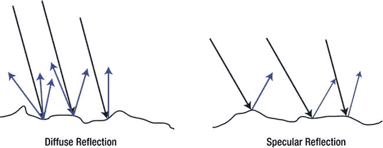
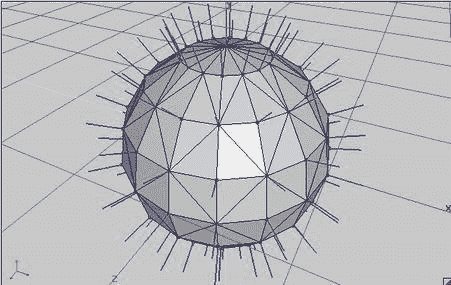
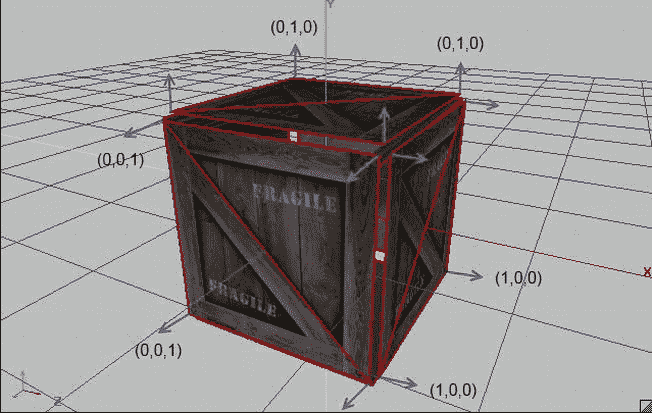
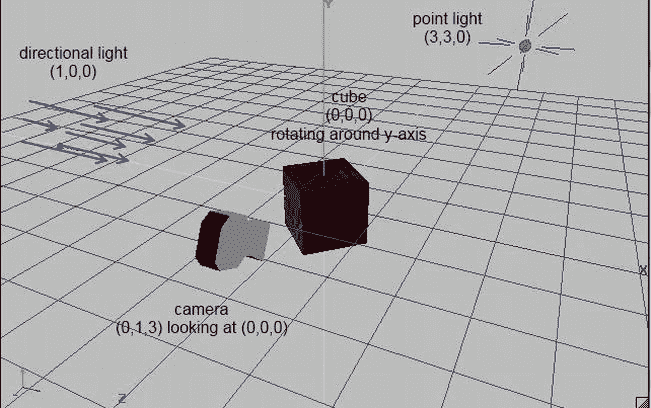
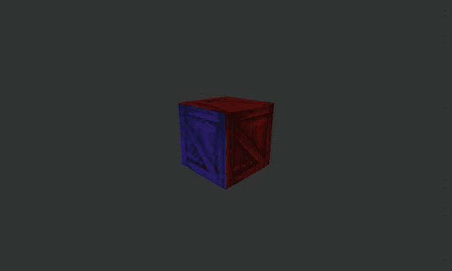
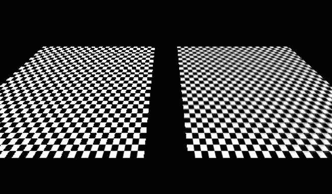
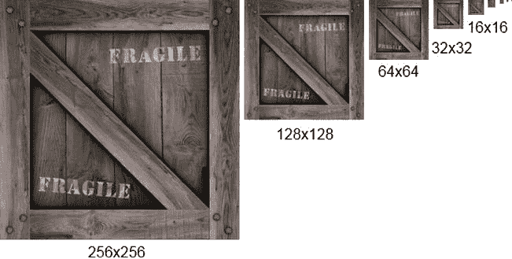
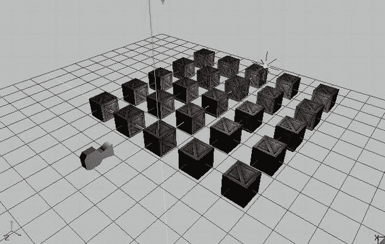
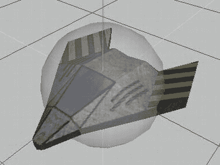

# 十一、3D 编程技巧

3D 编程是一个极其广泛和复杂的领域。本章探讨了一些主题，这些主题是编写一个简单的 3D 游戏的绝对最低要求:

*   我们将再次访问我们的朋友向量，并附加一个坐标。
*   灯光是任何 3D 游戏的重要组成部分。我们将看看如何用 OpenGL ES 实现简单的光照。
*   以编程方式定义对象很麻烦。我们将看一个简单的 3D 文件格式，以便我们可以加载和渲染用 3D 建模软件创建的 3D 模型。
*   在第 8 章中，我们讨论了对象表示和碰撞检测。我们将看看如何在 3D 中做同样的事情。
*   我们还将简要回顾一下我们在第 8 章中探索过的一些物理概念——这次是在 3D 环境中。

让我们从三维向量开始。

在我们开始之前

像往常一样，我们将在本章创建几个简单的示例程序。要做到这一点，我们只需创建一个新项目，并复制到目前为止我们开发的框架的所有源代码。

和前面的章节一样，我们将有一个单一的测试启动活动，以列表的形式向我们展示测试。我们将其命名为 GLAdvancedStarter，并将其作为我们的默认活动。简单地复制 GL3DBasicsStarter，并替换测试的类名。我们还需要用适当的<activity>元素将每个测试活动添加到清单中。</activity>

每个测试都会照常扩展 GLGame 实际的代码将被实现为一个 GLScreen 实例，我们将把它与 GLGame 实例连接起来。正如在第 10 章中一样，为了节省篇幅，我们将只介绍 GLScreen 实现的相关部分。所有的测试和启动活动都在 com . badlogic . androidgames . glad advanced 包中。一些类将是我们框架的一部分，并将进入各自的框架包中。

三维矢量

在第八章中，我们讨论了 2D 的向量及其解释。正如你可能已经猜到的，我们在那里讨论的所有事情在 3D 空间中仍然适用。我们需要做的就是给我们的向量再加一个坐标，也就是 z 坐标。

我们在 2D 用向量进行的操作可以很容易地转移到 3D 空间。我们用如下语句指定 3D 中的向量:

v = (x，y，z)

3D 中的添加按如下方式进行:

c = a + b = (a.x，a.y，b.z) + (b.x，b.y，b.z) = (a.x + b.x，a.y + b.y，a.z + b.z)

减法的工作方式完全相同:

c = a–b =(a . x，a.y，b . z)–(b . x，b.y，b . z)=(a . x–b . x，a . y–b . y，a . z–b . z)

向量乘以标量的工作原理如下:

a' = a *标量= (a.x *标量，a.y *标量，a.z *标量)

在 3D 中测量一个矢量的长度也很简单；我们只要把 z 坐标加到勾股方程:

| a | = sqrt(a . x * a . x+a . y * a . y+a . z * a . z)

基于此，我们也可以将我们的向量再次归一化为单位长度:

a' = (a.x / |a|，a.y / |a|，a.z / |a|)

我们在第八章中谈到的所有对向量的解释在 3D 中也成立:

*   位置只是由法向量的 x，y 和 z 坐标来表示。
*   速度和加速度也可以表示为 3D 矢量。然后，每个分量在一个轴上表示属性的某个量，例如速度情况下的米每秒(m/s)或加速度情况下的米每秒(m/s <sup>2</sup> )。
*   我们可以将方向(或轴)表示为简单的 3D 单位向量。当我们使用 OpenGL ES 的旋转工具时，我们在第 8 章中已经这样做了。
*   我们可以通过从结束向量中减去开始向量并测量结果向量的长度来测量距离。

另一个可能相当有用的操作是 3D 向量围绕 3D 轴的旋转。我们之前通过 OpenGL ES glRotatef()方法使用了这个原理。然而，我们不能使用它来旋转我们将用来存储我们的游戏对象的位置或方向的向量之一，因为它只对我们提交给 GPU 的顶点起作用。幸运的是，Android API 中有一个矩阵类，允许我们模拟 OpenGL ES 在 GPU 上做的事情。让我们编写一个实现所有这些特性的 Vector3 类。[清单 11-1](#list1) 显示了代码，我们会一路解释。

[**清单 11-1。**Vector3.java 的 T3，3D 中的矢量](#_list1)

```java
package com.badlogic.androidgames.framework.math;

import android.opengl.Matrix;
import android.util.FloatMath;

public class Vector3 {
    private static final float []*matrix* = new float [16];
    private static final float []*inVec* = new float [4];
    private static final float []*outVec* = new float [4];
    public float x, y, z;
```

该类从几个私有静态 final float 数组开始。我们稍后在实现 Vector3 类的新 rotate()方法时会用到它们。请记住，矩阵成员有 16 个元素，而 inVec 和 outVec 成员各有 4 个元素。我们创建这三个数组，这样我们就不必在以后一直创建它们。这将使垃圾收集器高兴。只要记住这样做，Vector3 类就不是线程安全的！

接下来定义的 x、y 和 z 成员应该是不言自明的。它们存储矢量的实际分量:

```java
    public Vector3() {
    }

    public Vector3(float x, float y, float z) {
        this .x = x;
        this .y = y;
        this .z = z;
    }

    public Vector3(Vector3 other) {
        this .x = other.x;
        this .y = other.y;
        this .z = other.z;
    }

    public Vector3 cpy() {
    return new Vector3(x, y, z);
    }

    public Vector3 set(float x, float y, float z) {
        this .x = x;
        this .y = y;
        this .z = z;
        return this ;
    }

    public Vector3 set(Vector3 other) {
        this .x = other.x;
        this .y = other.y;
        this .z = other.z;
        return this ;
    }
```

像 Vector2 一样，我们的 Vector3 类也有几个构造函数和设置函数以及一个 cpy()方法，这样我们就可以很容易地克隆 Vector 或者从程序中计算的组件中设置它们。

```java
    public Vector3 add(float x, float y, float z) {
        this .x += x;
        this .y += y;
        this .z += z;
        return this ;
    }

    public Vector3 add(Vector3 other) {
        this .x += other.x;
        this .y += other.y;
        this .z += other.z;
        return this ;
    }

    public Vector3 sub(float x, float y, float z) {
        this .x -= x;
        this .y -= y;
        this .z -= z;
        return this ;
    }

    public Vector3 sub(Vector3 other) {
        this .x -= other.x;
        this .y -= other.y;
        this .z -= other.z;
        return this ;
    }

    public Vector3 mul(float scalar) {
        this .x *= scalar;
        this .y *= scalar;
        this .z *= scalar;
        return this ;
    }
```

各种 add()、sub()和 mul()方法只是我们在 Vector2 类中的扩展，增加了一个 z 坐标。它们实现了我们几页前讨论过的内容。直截了当，对吧？

```java
    public float len() {
        return FloatMath.*sqrt*(x * x + y * y + z * z);
    }

    public Vector3 nor() {
        float len = len();
        if (len != 0) {
            this .x /= len;
            this .y /= len;
            this .z /= len;
        }

        return this ;
    }
```

len()和 nor()方法本质上也与 Vector2 类中的方法相同。我们所做的就是将新的 z 坐标合并到计算中。

```java
    public Vector3 rotate(float angle, float axisX, float axisY, float axisZ) {
        *inVec*[0] = x;
        *inVec*[1] = y;
        *inVec*[2] = z;
        *inVec*[3] = 1;
        Matrix.*setIdentityM*(*matrix*, 0);
        Matrix.*rotateM*(*matrix*, 0, angle, axisX, axisY, axisZ);
        Matrix.*multiplyMV*(*outVec*, 0,*matrix*, 0,*inVec*, 0);
        x = *outVec*[0];
        y = *outVec*[1];
        z = *outVec*[2];
        return this ;
    }
```

这是我们新的 rotate()方法。如前所述，它利用了 Android 的 Matrix 类。Matrix 类本质上由两个静态方法组成，比如 Matrix.setIdentityM()和 Matrix.rotateM()。这些在浮点数组上操作，类似于我们之前定义的那些。一个矩阵存储为 16 个浮点值，一个向量预计有四个元素。我们不会详细讨论这个类的内部工作原理；我们所需要的是一种在 Java 端模拟 OpenGL ES 矩阵功能的方法，而这正是这个类提供给我们的。所有这些方法都在矩阵上工作，其操作方式与 OpenGL ES 中的 glRotatef()、glTranslatef()和 glIdentityf()完全相同。

rotate()方法首先将向量的分量设置为我们前面定义的 inVec 数组。接下来，我们在类的矩阵成员上调用 Matrix.setIdentityM()。这将“清除”矩阵。在 OpenGL ES 中，我们使用 glIdentityf()对驻留在 GPU 上的矩阵做了同样的事情。接下来，我们调用 Matrix.rotateM()。它接受保存矩阵的浮点数组、该数组的偏移量、我们要旋转的角度(以度为单位)以及我们要绕其旋转的(单位长度)轴。此方法等效于 glRotatef()。它将给定的矩阵乘以一个旋转矩阵。最后，我们调用 Matrix.multiplyMV()，它将把我们存储在 inVec 中的向量乘以矩阵。这会将矩阵中存储的所有变换应用到向量。结果将在 outVec 中输出。该方法的其余部分只是从 outVec 数组中获取生成的新组件，并将它们存储在 Vector3 类的成员中。

注意除了旋转向量，你还可以使用 Matrix 类做更多的事情。在对传入矩阵的影响方面，它的操作方式与 OpenGL ES 完全相同。

```java
    public float dist(Vector3 other) {
        float distX = this .x - other.x;
        float distY = this .y - other.y;
        float distZ = this .z - other.z;
        return FloatMath.*sqrt*(distX * distX + distY * distY + distZ * distZ);
    }

    public float dist(float x, float y, float z) {
        float distX = this .x - x;
        float distY = this .y - y;
        float distZ = this .z - z;
        return FloatMath.*sqrt*(distX * distX + distY * distY + distZ * distZ);
    }

    public float distSquared(Vector3 other) {
        float distX = this .x - other.x;
        float distY = this .y - other.y;
        float distZ = this .z - other.z;
        return distX * distX + distY * distY + distZ * distZ;
    }

    public float distSquared(float x, float y, float z) {
        float distX = this .x - x;
        float distY = this .y - y;
        float distZ = this .z - z;
        return distX * distX + distY * distY + distZ * distZ;
    }

}
```

最后，我们有常用的 dist()和 distSquared()方法来计算 3D 中两个向量之间的距离。

注意，我们在 Vector2 中省略了 angle()方法。虽然可以在 3D 中测量两个向量之间的角度，但这并不能给出 0 到 360 范围内的角度。通常，我们只需使用每个向量的两个分量并应用 Vector2.angle()方法，就可以计算 x/y、z/y 和 x/z 平面中两个向量之间的角度。直到我们的最后一个游戏，我们才需要这个功能，所以我们将在那时回到主题。

使用这个类的一个明确的例子是不必要的。我们可以像在第 8 章中调用 Vector2 类一样调用它。进入下一个主题:OpenGL ES 中的光照。

OpenGL ES 中的光照

OpenGL ES 中的光照是一个有用的特性，可以给我们的 3D 游戏一个很好的触感。为了使用这个功能，我们必须对 OpenGL ES 光照模型有一个概念。

照明如何工作

让我们思考一下照明是如何工作的。我们首先需要的是一个发光的光源。我们还需要一个可以被点亮的物体。最后，我们需要一个传感器，就像我们的眼睛或相机一样，它将捕捉由光源发出并被物体反射回来的光子。照明根据以下因素改变物体的感知颜色:

*   光源的类型
*   光源的颜色和强度
*   光源相对于被照亮对象的位置和方向
*   对象的材质和纹理

物体反射光的强度取决于多种因素。我们最关心的是光线照射表面的角度。光线越垂直于它所照射的表面，表面反射的光的强度就越大。图 11-1 说明了这一点。


[图 11-1。](#_Fig1)光线越垂直于表面，反射光的强度越大

一旦光线到达一个表面，它会以两种不同的方式被反射。大多数光线被漫反射*，这意味着反射光线被物体表面的不规则性随机散射。有些反射是镜面反射，这意味着光线会反弹回来，就好像它们碰到了一面完美的镜子。[图 11-2](#Fig2) 显示了漫反射和镜面反射的区别。*

 *

[图 11-2。](#_Fig2)漫反射和镜面反射

镜面反射会在物体上表现为高光。一个物体是否会产生镜面反射取决于它的材质。具有粗糙或不平坦表面的对象，如皮肤或织物，不太可能具有镜面高光。表面光滑的物体，如玻璃或大理石，确实会出现这些照明伪像。当然，玻璃或大理石表面也不是绝对光滑的。然而，相对于木材或人类皮肤等材质，它们非常光滑。

当光线照射到一个表面时，它的反射也会根据照射到的物体的化学成分而改变颜色。例如，我们看到的红色物体是那些只反射光的红色部分的物体。该物体“吞噬”所有其他波长。黑色物体是一种几乎能吸收所有照射到它上面的光线的物体。

OpenGL ES 允许我们通过指定光源和对象的材质来模拟这种真实世界的行为。

光源

我们被各种光源包围着。太阳不断向我们发射光子。我们的监视器发出光，在夜晚用那种美丽的蓝色光芒包围着我们。灯泡和头灯让我们在黑暗中不会撞到或撞到东西。OpenGL ES 使我们能够创建四种类型的光源:

*   *环境光* : 环境光本身并不是一种光源，而是来自其他光源的光子在我们的世界中反弹的结果。所有这些杂散光子的组合构成了特定的默认照明级别，该级别是无方向的，并且同等地照明所有对象。
*   点光源 : 这些点光源在空间中有位置，向各个方向发光。例如，灯泡是一种点光源。
*   *方向灯* : 这些在 OpenGL ES 中被表示为方向，并被假设为无限远。太阳可以被理想化为定向光源。我们可以假设，由于地球和太阳之间的距离，来自太阳的光线都以相同的角度照射到地球上。
*   聚光灯 : 它们与点光源相似，在空间中有明确的位置。此外，他们有一个方向，他们发光，并创建一个光锥，是有限的一些半径。路灯是聚光灯。

我们将只研究环境光、点光和平行光。由于 OpenGL ES 计算光照的方式，使用有限的 GPU(如 Android 设备上的 GPU)很难获得正确的聚光灯。你马上就会明白为什么会这样。

除了光源的位置和方向，OpenGL ES 还允许我们指定光线的颜色或强度。这被表示为 RGBA 颜色。然而，OpenGL ES 要求我们为每个光源指定四种不同的颜色，而不是只有一种:

*   *环境*:这是一个物体整体阴影的强度/颜色。无论物体相对于光源的位置或方向如何，物体都会被均匀地照亮。
*   *漫反射*:这是计算漫反射时物体被照亮的强度/颜色。物体不面对光源的一侧不会被照亮，就像在现实生活中一样。
*   *镜面*:这种强度/颜色类似于漫反射颜色。但是，它只会影响对象上朝向观察者和光源的特定方向的点。
*   *发射*:这完全令人困惑，在现实应用中几乎没有用处，所以我们就不深入探讨了。

通常，我们只设置光源的漫反射和镜面反射强度，其他两个保持默认值。我们也将使用相同的 RGBA 颜色用于漫反射和高光强度。

材质

我们世界中的每一个物体都有一层材质。该材质不仅定义了照射到物体上的光线如何被反射，还修改了反射光线的颜色。OpenGL ES 允许我们为材质指定与光源相同的四种 RGBA 颜色:

*   *环境*:这是与场景中任何光源的环境颜色相结合的颜色。
*   *漫射*:这是与任何光源的漫射颜色相结合的颜色。
*   *镜面反射*:这是一种颜色，与物体表面镜面反射高光点的任何光源的镜面反射颜色相结合。
*   发射的:我们再次忽略它，因为它在我们的上下文中几乎没有用处。

图 11-3 展示了前三种材质/光源的属性:环境、漫射和镜面。


[图 11-3。](#_Fig3)不同的材质/灯光类型。左:仅环境温度。中心:仅漫射。右:环境光和漫反射，带镜面高光

在[图 11-3](#Fig3) 中，我们可以看到不同材质和灯光属性的贡献。环境光均匀地照亮物体。漫射光会根据光线击中物体的角度而被反射；直接面对光源的区域会比较亮，光线达不到的区域比较暗。最右边的图像显示了环境光、漫射光和镜面光的组合。镜面反射光在球体上显示为白色高光。

OpenGL ES 如何计算光照:顶点法线

你知道从物体反射回来的光的强度取决于光线照射到物体表面的角度。OpenGL ES 利用这个事实来计算光照。它通过使用*顶点法线*来做到这一点，我们必须在代码中定义它，就像我们定义纹理坐标和顶点颜色一样。[图 11-4](#Fig4) 显示了一个带有顶点法线的球体。



[图 11-4。](#_Fig4)一个球体及其顶点的法线

法线是简单的单位长度向量，指向一个表面所面对的方向。在我们的例子中，曲面是三角形。然而，我们必须指定顶点法线，而不是指定曲面法线。曲面法线和顶点法线之间的区别在于，顶点法线可能不必指向与曲面法线相同的方向。我们可以在图 11-4 中清楚地看到这一点，其中每个顶点法线实际上是该顶点所属三角形法线的平均值。这种平均有助于对象的平滑着色。

当我们渲染一个启用顶点法线和光照的物体时，OpenGL ES 将决定每个顶点和光源之间的角度。有了这个角度，它可以根据对象和光源的材质的环境、漫反射和镜面反射属性来计算顶点的颜色。最终结果是对象的每个顶点的颜色，然后结合其他顶点的计算颜色在每个三角形上进行插值。这个插值的颜色将会和我们应用到物体上的纹理贴图结合起来。

这听起来很可怕，但其实没那么糟糕。我们所需要做的就是启用照明，指定光源，我们想要渲染的对象的材质，顶点法线，以及我们通常指定的其他顶点属性，如位置和纹理坐标。让我们来看看如何用 OpenGL ES 实现这一切。

在实践中

我们现在将通过所有必要的步骤让照明与 OpenGL ES 一起工作。在这个过程中，我们将创建一些小的助手类，使使用光源变得更容易。我们将把它们放在 com . badlogic . Android games . framework . GL 包中。

启用和禁用照明

与所有 OpenGL ES 状态一样，我们首先必须启用相关的功能。我们是这样做的:

```java
gl.glEnable(GL10.GL_LIGHTING);
```

一旦启用，照明将应用于我们渲染的所有对象。当然，我们必须指定光源、材质和顶点法线来获得有意义的结果。渲染完所有需要照明的对象后，我们可以再次禁用照明:

```java
gl.glDisable(GL10.GL_LIGHTING);
```

指定光源

如前所述，OpenGL ES 为我们提供了四种类型的光源:环境光、点光、平行光和聚光灯。我们来看看如何定义前三个。为了让聚光灯更有效，看起来更好，我们需要为每个物体的模型设置一个非常高的三角形数。这在大多数当前的移动设备上是禁止的。

OpenGL ES 限制我们在一个场景中最多有八个光源，外加一个全局环境光。八个光源中的每一个都有一个标识符，来自 GL10。GL_LIGHT0 至 GL10。GL_LIGHT7。如果我们想要操作其中一个光源的属性，我们可以通过指定该光源各自的 ID 来实现。

必须使用以下语法启用光源:

```java
gl.glEnable(GL10.GL_LIGHT0);
```

在这种情况下，OpenGL ES 将获取 ID 为 0 的光源的属性，并相应地将其应用于所有渲染对象。如果我们想禁用一个光源，我们可以这样做:

```java
gl.glDisable(GL10.GL_LIGHT0);
```

环境光是一种特殊情况，因为它没有标识符。在 OpenGL ES 场景中只有一个环境光。让我们看看那个。

环境光

正如已经解释过的，环境光是一种特殊类型的光。它没有位置和方向，只有一种颜色，通过这种颜色，场景中的所有对象将被均匀地照亮。OpenGL ES 允许我们如下指定全局环境光:

```java
float[] ambientColor = { 0.2f, 0.2f, 0.2f, 1.0f };
gl.glLightModelfv(GL10.GL_LIGHT_MODEL_AMBIENT, color, 0);
```

ambientColor 数组保存环境光颜色的 RGBA 值，编码为 0 到 1 范围内的浮点数。glLightModelfv()方法将一个常量作为参数，指定我们要设置环境光的颜色；保存颜色的浮点数组；以及该方法应该开始读取 RGBA 值的浮点数组中的偏移量。让我们把这个放到可爱的小课堂里。清单 11-2 显示了代码。

[**清单 11-2。AmbientLight.java**T3，OpenGL ES 全局环境光的简单抽象](#_list2)

```java
package com.badlogic.androidgames.framework.gl;

import javax.microedition.khronos.opengles.GL10;

public class AmbientLight {
    float [] color = {0.2f, 0.2f, 0.2f, 1};

    public void setColor(float r, float g, float b, float a) {
        color[0] = r;
        color[1] = g;
        color[2] = b;
        color[3] = a;
    }

    public void enable(GL10 gl) {
        gl.glLightModelfv(GL10.*GL_LIGHT_MODEL_AMBIENT*, color, 0);
    }

}
```

我们所做的就是将环境光的颜色存储在一个浮点数组中，然后提供两种方法:一种是设置颜色，另一种是让 OpenGL ES 使用我们定义的环境光颜色。默认情况下，我们使用灰色的环境光颜色。

点光源

点光源有一个位置以及一个环境光，漫射光和镜面反射光的颜色/强度(我们忽略了发射光的颜色/强度)。要指定不同的颜色，我们可以执行以下操作:

```java
gl.glLightfv(GL10.GL_LIGHT3, GL10.GL_AMBIENT, ambientColor, 0);
gl.glLightfv(GL10.GL_LIGHT3, GL10.GL_DIFFUSE, diffuseColor, 0);
gl.glLightfv(GL10.GL_LIGHT3, GL10.GL_SPECULAR, specularColor, 0);
```

第一个参数是光标识符；在这种情况下，我们使用第四盏灯。下一个参数指定了我们想要修改的灯光属性。第三个参数也是一个保存 RGBA 值的浮点数组，最后一个参数是该数组的偏移量。指定位置很容易:

```java
float[] position = {x, y, z, 1};
gl.glLightfv(GL10.GL_LIGHT3, GL10.GL_POSITION, position, 0);
```

我们再次指定要修改的属性(在本例中是位置)，以及一个四元素数组，该数组存储光线在我们的世界中的 x、y 和 z 坐标。请注意，对于位置光源，数组的第四个元素必须设置为 1！让我们把它放到一个助手类中。清单 11-3 显示了代码。

[**清单 11-3。PointLight.java**T3，OpenGL ES 点光源的简单抽象](#_list3)

```java
package com.badlogic.androidgames.framework.gl;

import javax.microedition.khronos.opengles.GL10;

public class PointLight {
    float [] ambient = { 0.2f, 0.2f, 0.2f, 1.0f };
    float [] diffuse = { 1.0f, 1.0f, 1.0f, 1.0f };
    float [] specular = { 0.0f, 0.0f, 0.0f, 1.0f };
    float [] position = { 0, 0, 0, 1 };
    int lastLightId = 0;
    public void setAmbient(float r, float g, float b, float a) {
        ambient[0] = r;
        ambient[1] = g;
        ambient[2] = b;
        ambient[3] = a;
    }

    public void setDiffuse(float r, float g, float b, float a) {
        diffuse[0] = r;
        diffuse[1] = g;
        diffuse[2] = b;
        diffuse[3] = a;
    }

    public void setSpecular(float r, float g, float b, float a) {
        specular[0] = r;
        specular[1] = g;
        specular[2] = b;
        specular[3] = a;
    }

    public void setPosition(float x, float y, float z) {
        position[0] = x;
        position[1] = y;
        position[2] = z;
    }

    public void enable(GL10 gl, int lightId) {
        gl.glEnable(lightId);
        gl.glLightfv(lightId, GL10.*GL_AMBIENT*, ambient, 0);
        gl.glLightfv(lightId, GL10.*GL_DIFFUSE*, diffuse, 0);
        gl.glLightfv(lightId, GL10.*GL_SPECULAR*, specular, 0);
        gl.glLightfv(lightId, GL10.*GL_POSITION*, position, 0);
        lastLightId = lightId;
    }

    public void disable(GL10 gl) {
        gl.glDisable(lastLightId);
    }

}
```

我们的助手类存储光线的环境、漫射和镜面反射颜色分量以及位置(第四个元素设置为 1)。此外，我们存储了用于这个灯的最后一个灯标识符，这样我们就可以提供一个 disable()方法，在必要时关闭灯。对于每个灯光属性，我们都有一个很好的设置方法。我们还有一个 enable()方法，它接受一个 GL10 实例和一个 light 标识符(比如 GL10。GL_LIGHT6)。它启用灯光，设置其属性，并存储所使用的灯光标识符。disable()方法只是使用 enable()中设置的 lastLightId 成员来禁用灯光。

在成员数组的初始化器中，我们对环境、漫射和镜面反射颜色使用合理的默认值。灯光将是白色的，它不会产生任何高光，因为高光的颜色是黑色的。

方向灯

平行光与点光几乎相同。唯一不同的是它有方向而不是位置。方向的表达方式有些混乱。OpenGL ES 不使用方向向量，而是希望我们在世界上定义一个点。然后通过从该点到世界原点的方向向量来计算方向。以下片段将产生来自世界右侧的平行光:

```java
float[] dirPos = {1, 0, 0, 0};
gl.glLightfv(GL10.GL_LIGHT0, GL10.GL_POSITION, dirPos, 0);
```

我们可以把它转换成一个方向向量:

```java
dir = -dirPos = {-1, 0, 0, 0}
```

其余属性，如环境光或漫反射颜色，与点光源的属性相同。清单 11-4 显示了一个用于漫射灯光的小助手类的代码。

[**清单 11-4。DirectionalLight.java**T3，OpenGL ES 定向灯的简单抽象](#_list4)

```java
package com.badlogic.androidgames.framework.gl;

import javax.microedition.khronos.opengles.GL10;

public class DirectionalLight {
    float [] ambient = { 0.2f, 0.2f, 0.2f, 1.0f };
    float [] diffuse = { 1.0f, 1.0f, 1.0f, 1.0f };
    float [] specular = { 0.0f, 0.0f, 0.0f, 1.0f };
    float [] direction = { 0, 0, -1, 0 };
    int lastLightId = 0;
    public void setAmbient(float r, float g, float b, float a) {
        ambient[0] = r;
        ambient[1] = g;
        ambient[2] = b;
        ambient[3] = a;
    }

    public void setDiffuse(float r, float g, float b, float a) {
        diffuse[0] = r;
        diffuse[1] = g;
        diffuse[2] = b;
        diffuse[3] = a;
    }

    public void setSpecular(float r, float g, float b, float a) {
        specular[0] = r;
        specular[1] = g;
        specular[2] = b;
        specular[3] = a;
    }

    public void setDirection(float x, float y, float z) {
        direction[0] = -x;
        direction[1] = -y;
        direction[2] = -z;
    }

    public void enable(GL10 gl, int lightId) {
        gl.glEnable(lightId);
        gl.glLightfv(lightId, GL10.*GL_AMBIENT*, ambient, 0);
        gl.glLightfv(lightId, GL10.*GL_DIFFUSE*, diffuse, 0);
        gl.glLightfv(lightId, GL10.*GL_SPECULAR*, specular, 0);
        gl.glLightfv(lightId, GL10.*GL_POSITION*, direction, 0);
        lastLightId = lightId;
    }

    public void disable(GL10 gl) {
        gl.glDisable(lastLightId);
    }

}
```

我们的助手类几乎与点光源类相同。唯一的区别是方向数组的第四个元素被设置为 1。我们还有一个 setDirection()方法，而不是 setPosition()方法。setDirection()方法允许我们指定一个方向，比如(–1，0，0)，以便光线从右侧发出。在这个方法中，我们只是否定了所有的矢量分量，因此我们将方向转换为 OpenGL ES 期望的格式。

指定材质

材质由几个属性定义。与 OpenGL ES 中的任何东西一样，材质是一种状态，在我们再次改变它或 OpenGL ES 上下文丢失之前，它都是活动的。要设置当前活动的材质属性，我们可以执行以下操作:

```java
gl.glMaterialfv(GL10.GL_FRONT_AND_BACK, GL10.GL_AMBIENT, ambientColor, 0);
gl.glMaterialfv(GL10.GL_FRONT_AND_BACK, GL10.GL_DIFFUSE, diffuseColor, 0);
gl.glMaterialfv(GL10.GL_FRONT_AND_BACK, GL10.GL_SPECULAR, specularColor, 0);
```

像往常一样，我们有一个环境，一个漫射，和一个镜面 RGBA 颜色来指定。我们再次通过四元素浮动数组来实现，就像我们对光源属性所做的那样。将这些放到一个小助手类中也很容易。清单 11-5 显示了代码。

[**清单 11-5。**](#_list5)Material.java，OpenGL ES 素材的简单抽象

```java
package com.badlogic.androidgames.framework.gl;

import javax.microedition.khronos.opengles.GL10;

public class Material {

    float [] ambient = { 0.2f, 0.2f, 0.2f, 1.0f };
    float [] diffuse = { 1.0f, 1.0f, 1.0f, 1.0f };
    float [] specular = { 0.0f, 0.0f, 0.0f, 1.0f };
    public void setAmbient(float r, float g, float b, float a) {
        ambient[0] = r;
        ambient[1] = g;
        ambient[2] = b;
        ambient[3] = a;
    }

    public void setDiffuse(float r, float g, float b, float a) {
        diffuse[0] = r;
        diffuse[1] = g;
        diffuse[2] = b;
        diffuse[3] = a;
    }

    public void setSpecular(float r, float g, float b, float a) {
        specular[0] = r;
        specular[1] = g;
        specular[2] = b;
        specular[3] = a;
    }

    public void enable(GL10 gl) {
        gl.glMaterialfv(GL10.*GL_FRONT_AND_BACK*, GL10.*GL_AMBIENT*, ambient, 0);
        gl.glMaterialfv(GL10.*GL_FRONT_AND_BACK*, GL10.*GL_DIFFUSE*, diffuse, 0);
        gl.glMaterialfv(GL10.*GL_FRONT_AND_BACK*, GL10.*GL_SPECULAR*, specular, 0);
    }

}
```

这里也没有什么大的惊喜。我们只是存储材质的三个组件，并提供设置器和一个 enable()方法，用于设置材质。

谈到材质，OpenGL ES 还有一个锦囊妙计。通常我们不会使用 glMaterialfv()，而是选择一种叫做*颜色材质*的东西。这意味着 OpenGL ES 将采用模型的顶点颜色作为环境和漫射材质颜色，而不是通过 glMaterialfv()指定的环境和漫射颜色。要启用这个漂亮的特性，我们只需调用它:

```java
gl.glEnable(GL10.GL_COLOR_MATERIAL);
```

我们通常使用这个而不是一个完整的材质类，如前所示，因为环境光和漫反射颜色通常是相同的。因为我们在大多数演示和游戏中也不使用高光，所以我们可以只启用颜色材质而不使用任何 glMaterialfv()调用。选择使用材质类还是颜色材质完全取决于你。

指定法线

为了让光照在 OpenGL ES 中工作，我们必须为模型的每个顶点指定顶点法线。顶点法线必须是一个单位长度的向量，它指向顶点所属曲面的(平均)面向方向。图 11-5 显示了立方体的顶点法线。



[图 11-5。](#_Fig5)立方体每个顶点的顶点法线

顶点法线只是另一个顶点属性，就像位置或颜色一样。为了上传顶点法线，我们必须再次修改我们的顶点 3 类。为了告诉 OpenGL ES 在哪里可以找到每个顶点的法线，我们使用 glNormalPointer()方法，就像我们之前使用 glVertexPointer()或 glColorPointer()方法一样。清单 11-6 显示了我们最终修订的 Vertices3 类。

[**清单 11-6。Vertices3.java**T3，最终版本支持法线](#_list6)

```java
package com.badlogic.androidgames.framework.gl;

import java.nio.ByteBuffer;
import java.nio.ByteOrder;
import java.nio.IntBuffer;
import java.nio.ShortBuffer;

import javax.microedition.khronos.opengles.GL10;

import com.badlogic.androidgames.framework.impl.GLGraphics;

public class Vertices3 {
    final GLGraphics glGraphics;
    final boolean hasColor;
    final boolean hasTexCoords;
    final boolean hasNormals;
    final int vertexSize;
    final IntBuffer vertices;
    final int [] tmpBuffer;
    final ShortBuffer indices;
```

在这些成员中，唯一新增加的是 hasNormals 布尔值，它跟踪顶点是否有法线。

```java
    public Vertices3(GLGraphics glGraphics, int maxVertices, int maxIndices,
            boolean hasColor, boolean hasTexCoords, boolean hasNormals) {
        this .glGraphics = glGraphics;
        this .hasColor = hasColor;
        this .hasTexCoords = hasTexCoords;
        this .hasNormals = hasNormals;
        this .vertexSize = (3 + (hasColor ? 4 : 0) + (hasTexCoords ? 2 : 0) + (hasNormals ? 3 : 0)) * 4;
        this .tmpBuffer = new int [maxVertices * vertexSize / 4];

        ByteBuffer buffer = ByteBuffer.*allocateDirect*(maxVertices * vertexSize);
        buffer.order(ByteOrder.*nativeOrder*());
        vertices = buffer.asIntBuffer();

        if (maxIndices > 0) {
            buffer = ByteBuffer.*allocateDirect*(maxIndices * Short.*SIZE*/ 8);
            buffer.order(ByteOrder.*nativeOrder*());
            indices = buffer.asShortBuffer();
        } else {
            indices = null ;
        }

    }
```

在构造函数中，我们现在还接受一个 hasNormals 参数。我们还必须修改 vertexSize 成员的计算，如果法线可用，则为每个顶点添加三个浮点。

```java
    public void setVertices(float [] vertices, int offset, int length) {
        this .vertices.clear();
        int len = offset + length;
        for (int i = offset, j = 0; i < len; i++, j++)
            tmpBuffer[j] = Float.*floatToRawIntBits*(vertices[i]);
        this .vertices.put(tmpBuffer, 0, length);
        this .vertices.flip();
    }

    public void setIndices( short [] indices, int offset, int length) {
        this .indices.clear();
        this .indices.put(indices, offset, length);
        this .indices.flip();
    }
```

如您所见，方法 setVertices()和 setIndices()保持不变。

```java
    public void bind() {
        GL10 gl = glGraphics.getGL();

        gl.glEnableClientState(GL10.*GL_VERTEX_ARRAY*);
        vertices.position(0);
        gl.glVertexPointer(3, GL10.*GL_FLOAT*, vertexSize, vertices);

        if (hasColor) {
            gl.glEnableClientState(GL10.*GL_COLOR_ARRAY*);
            vertices.position(3);
            gl.glColorPointer(4, GL10.*GL_FLOAT*, vertexSize, vertices);
        }

        if (hasTexCoords) {
            gl.glEnableClientState(GL10.*GL_TEXTURE_COORD_ARRAY*);
            vertices.position(hasColor ? 7 : 3);
            gl.glTexCoordPointer(2, GL10.*GL_FLOAT*, vertexSize, vertices);
        }

        if (hasNormals) {
            gl.glEnableClientState(GL10.*GL_NORMAL_ARRAY*);
            int offset = 3;
            if (hasColor)
                offset += 4;
            if (hasTexCoords)
                offset += 2;
            vertices.position(offset);
            gl.glNormalPointer(GL10.*GL_FLOAT*, vertexSize, vertices);
        }

    }
```

在 bind()方法中，我们使用了通常的 ByteBuffer 技巧，这次还通过 glNormalPointer()方法合并了法线。为了计算法线指针的偏移量，我们必须考虑颜色和纹理坐标是否给定。

```java
    public void draw( int primitiveType, int offset, int numVertices) {
        GL10 gl = glGraphics.getGL();
        if (indices != null ) {
            indices.position(offset);
            gl.glDrawElements(primitiveType, numVertices,
                    GL10.*GL_UNSIGNED_SHORT*, indices);
        } else {
            gl.glDrawArrays(primitiveType, offset, numVertices);
        }

    }
```

您可以看到 draw()方法再次未被修改；所有神奇的事情都发生在 bind()方法中。

```java
    public void unbind() {
        GL10 gl = glGraphics.getGL();
        if (hasTexCoords)
            gl.glDisableClientState(GL10.*GL_TEXTURE_COORD_ARRAY*);

        if (hasColor)
            gl.glDisableClientState(GL10.*GL_COLOR_ARRAY*);

        if (hasNormals)
            gl.glDisableClientState(GL10.*GL_NORMAL_ARRAY*);
    }

}
```

最后，我们还稍微修改了 unbind()方法。如果使用了法线，我们禁用法线指针，以正确清理 OpenGL ES 状态。

使用这个修改后的 Vertices3 版本和以前一样简单。这里有一个小例子:

```java
float [] vertices = { -0.5f, -0.5f, 0, 0, 0, 1,
                      0.5f, -0.5f, 0, 0, 0, 1,
                      0.0f,  0.5f, 0, 0, 0, 1 };
Vertices3 vertices = new Vertices3(glGraphics, 3, 0, false , false , true );
vertices.setVertices(vertices);
```

我们创建一个浮点数组来保存三个顶点，每个顶点都有一个位置(每行的前三个浮点)和一个法线(每行的后三个浮点)。在这种情况下，我们在 x-y 平面上有一个三角形，它的法线指向 z 轴的正方向。剩下要做的就是创建顶点 3 实例并设置顶点。很简单，对吧？绑定、绘图和解除绑定工作与旧版本完全相同。当然，我们也可以像以前一样添加顶点颜色和纹理坐标。

将所有这些放在一起

让我们把所有这些照明知识放在一个例子中。我们想用一个全局环境光，一个点光和一个平行光来绘制一个场景，这些光都照亮一个以原点为中心的立方体。另外，我们还将调用 gluLookAt()来定位我们的摄像机。[图 11-6](#Fig6) 展示了我们这个世界的设置。



[图 11-6。](#_Fig6)我们的第一个灯光场景

和我们所有的例子一样，我们创建了一个名为 LightTest 的类，它照常扩展了 GLGame。它从 getStartScreen()方法返回一个新的 LightScreen 实例。LightScreen 类扩展了 GLScreen，如清单 11-7 所示。

[**清单 11-7。**](#_list7)摘自 LightTest.java；使用 OpenGL ES 进行照明

```java
class LightScreen extends GLScreen {
    float angle;
    Vertices3 cube;
    Texture texture;
    AmbientLight ambientLight;
    PointLight pointLight;
    DirectionalLight directionalLight;
    Material material;
```

我们从几个成员开始。角度成员存储立方体围绕 y 轴的当前旋转。Vertices3 成员存储立方体模型的顶点，我们稍后将对其进行定义。此外，我们存储环境光，点光，方向光和材质实例。

```java
    public LightScreen(Game game) {
        super (game);

        cube = createCube();
        texture = new Texture(glGame, "crate.png");
        ambientLight = new AmbientLight();
        ambientLight.setColor(0, 0.2f, 0, 1);
        pointLight = new PointLight();
        pointLight.setDiffuse(1, 0, 0, 1);
        pointLight.setPosition(3, 3, 0);
        directionalLight = new DirectionalLight();
        directionalLight.setDiffuse(0, 0, 1, 1);
        directionalLight.setDirection(1, 0, 0);
        material = new Material();
    }
```

接下来是构造函数。在这里我们创建立方体模型的顶点并加载箱子纹理，就像我们在第 10 章中所做的一样。我们还实例化所有的灯光和材质，并设置它们的属性。环境光颜色是浅绿色，点光源是红色，在我们的世界中位于(3，3，0)。平行光具有蓝色漫反射颜色，来自左侧。对于材质，我们使用默认值(一点环境光，白色用于漫反射，黑色用于镜面反射)。

```java
    @Override
    public void resume() {
        texture.reload();
    }
```

在 resume()方法中，我们确保在上下文丢失的情况下(重新)加载纹理。

```java
    private Vertices3 createCube() {
        float [] vertices = { -0.5f, -0.5f, 0.5f, 0, 1, 0, 0, 1,
                              0.5f, -0.5f, 0.5f, 1, 1, 0, 0, 1,
                              0.5f,  0.5f, 0.5f, 1, 0, 0, 0, 1,
                             -0.5f,  0.5f, 0.5f, 0, 0, 0, 0, 1,

                              0.5f, -0.5f,  0.5f, 0, 1, 1, 0, 0,
                              0.5f, -0.5f, -0.5f, 1, 1, 1, 0, 0,
                              0.5f,  0.5f, -0.5f, 1, 0, 1, 0, 0,
                              0.5f,  0.5f,  0.5f, 0, 0, 1, 0, 0,

                              0.5f, -0.5f, -0.5f, 0, 1, 0, 0, -1,
                             -0.5f, -0.5f, -0.5f, 1, 1, 0, 0, -1,
                             -0.5f,  0.5f, -0.5f, 1, 0, 0, 0, -1,
                              0.5f,  0.5f, -0.5f, 0, 0, 0, 0, -1,

                             -0.5f, -0.5f, -0.5f, 0, 1, -1, 0, 0,
                             -0.5f, -0.5f,  0.5f, 1, 1, -1, 0, 0,
                             -0.5f,  0.5f,  0.5f, 1, 0, -1, 0, 0,
                             -0.5f,  0.5f, -0.5f, 0, 0, -1, 0, 0,

                             -0.5f,  0.5f,  0.5f, 0, 1, 0, 1, 0,
                              0.5f,  0.5f,  0.5f, 1, 1, 0, 1, 0,
                              0.5f,  0.5f, -0.5f, 1, 0, 0, 1, 0,
                             -0.5f,  0.5f, -0.5f, 0, 0, 0, 1, 0,

                             -0.5f, -0.5f, -0.5f, 0, 1, 0, -1, 0,
                              0.5f, -0.5f, -0.5f, 1, 1, 0, -1, 0,
                              0.5f, -0.5f,  0.5f, 1, 0, 0, -1, 0,
                             -0.5f, -0.5f,  0.5f, 0, 0, 0, -1, 0 };
        short [] indices = { 0, 1, 2, 2, 3, 0,
                            4, 5, 6, 6, 7, 4,
                            8, 9, 10, 10, 11, 8,
                            12, 13, 14, 14, 15, 12,
                            16, 17, 18, 18, 19, 16,
                            20, 21, 22, 22, 23, 20,
                            24, 25, 26, 26, 27, 24 };
        Vertices3 cube = new Vertices3(glGraphics, vertices.length / 8, indices.length, false , true , true );
        cube.setVertices(vertices, 0, vertices.length);
        cube.setIndices(indices, 0, indices.length);
        return cube;
    }
```

createCube()方法与我们在前面的例子中使用的方法基本相同。然而这一次，我们给每个顶点添加了法线，如图[图 11-4](#Fig4) 所示。除此之外，没有什么真正改变。

```java
    @Override
    public void update(float deltaTime) {
        angle += deltaTime * 20;
    }
```

在 update()方法中，我们只是增加立方体的旋转角度。

```java
    @Override
    public void present(float deltaTime) {
        GL10 gl = glGraphics.getGL();
        gl.glClearColor(0.2f, 0.2f, 0.2f, 1.0f);
        gl.glClear(GL10.*GL_COLOR_BUFFER_BIT*| GL10.*GL_DEPTH_BUFFER_BIT*);
        gl.glEnable(GL10.*GL_DEPTH_TEST*);
        gl.glViewport(0, 0, glGraphics.getWidth(), glGraphics.getHeight());

        gl.glMatrixMode(GL10.*GL_PROJECTION*);
        gl.glLoadIdentity();
        GLU.*gluPerspective*(gl, 67, glGraphics.getWidth()
                / (float ) glGraphics.getHeight(), 0.1f, 10f);
        gl.glMatrixMode(GL10.*GL_MODELVIEW*);
        gl.glLoadIdentity();
        GLU.*gluLookAt*(gl, 0, 1, 3, 0, 0, 0, 0, 1, 0);
        gl.glEnable(GL10.*GL_LIGHTING*);

        ambientLight.enable(gl);
        pointLight.enable(gl, GL10.*GL_LIGHT0*);

        directionalLight.enable(gl, GL10.*GL_LIGHT1*);
        material.enable(gl);
        gl.glEnable(GL10.*GL_TEXTURE_2D*);
        texture.bind();
        gl.glRotatef(angle, 0, 1, 0);
        cube.bind();
        cube.draw(GL10.*GL_TRIANGLES*, 0, 6 * 2 * 3);
        cube.unbind();
        pointLight.disable(gl);
        directionalLight.disable(gl);

        gl.glDisable(GL10.*GL_TEXTURE_2D*);
        gl.glDisable(GL10.*GL_DEPTH_TEST*);
    }
```

这里变得有趣了。前几行是我们清除 colorbuffer 和 depthbuffer 的样板代码——启用深度测试和设置视口。

接下来，我们通过 gluPerspective()将投影矩阵设置为透视投影矩阵，并将 gluLookAt()用于模型-视图矩阵，这样我们就有了如图[图 11-6](#Fig6) 所示的摄像机设置。

接下来，我们启用照明本身。此时，我们还没有定义任何灯光，所以我们在接下来的几行中通过调用灯光和材质的 enable()方法来定义。

像往常一样，我们也启用纹理和绑定我们的板条箱纹理。最后，我们调用 glRotatef()来旋转我们的立方体，然后通过调用 Vertices3 实例来呈现它的顶点。

为了完善这个方法，我们禁用了点光源和平行光(记住，环境光是全局状态)以及纹理和深度测试。这就是 OpenGL ES 中光照的全部内容！

```java
    @Override
    public void pause() {
    }

    @Override
    public void dispose() {
    }

}
```

其余的类只是空的；在暂停的情况下，我们不必做任何特殊的事情。

图 11-7 显示了我们例子的输出。



[图 11-7。](#_Fig7)我们的场景来自[图 11-6](#Fig6) ，用 OpenGL ES 渲染

OpenGL ES 中光照的一些注意事项

虽然灯光可以给你的游戏增加一些好看的视觉效果，但是它也有它的局限性和缺陷。以下是一些你应该牢记在心的事情:

*   照明很贵，尤其是在低端设备上。小心使用。启用的光源越多，渲染场景所需的计算能力就越强。
*   当指定点光源/平行光的位置/方向时，您必须在加载相机矩阵之后和将模型视图矩阵与任何矩阵相乘以移动和旋转对象之前执行此操作！这一点至关重要。如果不按照这个方法，你会有一些莫名其妙的灯光神器。
*   当您使用 glScalef()更改模型的大小时，它的法线也会被缩放。这很糟糕，因为 OpenGL ES 期望单位长度的法线。要解决这个问题，您可以使用命令 glEnable(GL10。GL_NORMALIZE)或者在某些情况下是 glEnable(GL10。GL_RESCALE_NORMAL)。我们建议坚持前者，因为后者有一些限制和警告。问题是规格化或重定法线的计算量很大。为了获得最佳性能，最好不要缩放照明对象。

Mipmapping

如果你玩了我们之前的例子，让立方体远离相机，你可能会注意到，立方体越小，纹理开始变得粗糙，充满了小瑕疵。这种效应被称为*混叠* ，在所有类型的信号处理中都是一种突出的效应。[图 11-8](#Fig8) 显示了右侧的效果和左侧应用一种叫做 *mipmapping* 的技术的结果。



[图 11-8。](#_Fig8)右边混叠伪影；左边是小中见大贴图的结果

我们不会深入研究为什么会发生混叠的细节；你只需要知道如何让物体看起来更好。这就是 mipmapping 的用武之地。

解决锯齿问题的关键是对屏幕上较小或远离视点的对象部分使用较低分辨率的图像。这通常被称为 *mipmap 金字塔*或*链*T4。给定一个默认分辨率的图像，比如说 256×256 像素，我们创建它的较小版本，为 mipmap 金字塔的每个级别将边分成两部分。[图 11-9](#Fig9) 显示了具有不同 mipmap 级别的板条箱纹理。



[图 11-9。](#_Fig9)一个 mipmap 链

要在 OpenGL ES 中制作纹理贴图，我们必须做两件事:

*   将缩小过滤器设置为 GL_XXX_MIPMAP_XXX 常量之一，通常为 GL_LINEAR_MIPMAP_NEAREST。
*   通过调整原始图像的大小为每个 mipmap 链级别创建图像，并将它们上传到 OpenGL ES。小中见大贴图链附加到单个纹理，而不是多个纹理。

要调整 mipmap 链的基本图像的大小，我们可以简单地使用 Android API 提供的位图和画布类。让我们稍微修改一下纹理类。 [清单 11-8](#list8) 显示了代码。

[**清单 11-8。**](#_list8)Texture.java，我们最终版本的纹理类

```java
package com.badlogic.androidgames.framework.gl;

import java.io.IOException;
import java.io.InputStream;

import javax.microedition.khronos.opengles.GL10;

import android.graphics.Bitmap;
import android.graphics.BitmapFactory;
import android.graphics.Canvas;
import android.graphics.Rect;
import android.opengl.GLUtils;

import com.badlogic.androidgames.framework.FileIO;
import com.badlogic.androidgames.framework.impl.GLGame;
import com.badlogic.androidgames.framework.impl.GLGraphics;

public class Texture {
    GLGraphics glGraphics;
    FileIO fileIO;
    String fileName;
    int textureId;
    int minFilter;
    int magFilter;
    public int width;
    public int height;
    boolean mipmapped;
```

我们只添加了一个新成员，称为 mipmapped，它存储纹理是否有 mipmap 链。

```java
    public Texture(GLGame glGame, String fileName) {
        this (glGame, fileName, false );
    }

    public Texture(GLGame glGame, String fileName, boolean mipmapped) {
        this .glGraphics = glGame.getGLGraphics();
        this .fileIO = glGame.getFileIO();
        this .fileName = fileName;
        this .mipmapped = mipmapped;
        load();
    }
```

为了兼容，我们保留旧的构造函数，它调用新的构造函数。新的构造函数接受第三个参数，让我们指定是否希望纹理被 mipmapped。

```java
    private void load() {
        GL10 gl = glGraphics.getGL();
        int [] textureIds = new int [1];
        gl.glGenTextures(1, textureIds, 0);
        textureId = textureIds[0];

        InputStream in = null ;
        try {
            in = fileIO.readAsset(fileName);
            Bitmap bitmap = BitmapFactory.*decodeStream*(in);
            if (mipmapped) {
                createMipmaps(gl, bitmap);
            } else {
                gl.glBindTexture(GL10.*GL_TEXTURE_2D*, textureId);
                GLUtils.*texImage2D*(GL10.*GL_TEXTURE_2D*, 0, bitmap, 0);
                setFilters(GL10.*GL_NEAREST*, GL10.*GL_NEAREST*);
                gl.glBindTexture(GL10.*GL_TEXTURE_2D*, 0);
                width = bitmap.getWidth();
                height = bitmap.getHeight();
                bitmap.recycle();
            }

        } catch (IOException e) {
            throw new RuntimeException("Couldn't load texture '" + fileName
                    + "'", e);
        } finally {
            if (in != null )
                try {
                    in.close();
                } catch (IOException e) {
                }

        }

    }
```

load()方法本质上也保持不变。唯一增加的是调用 createMipmaps()，以防纹理应该被 mipmapped。非小中见大贴图纹理实例如前所述创建。

```java
    private void createMipmaps(GL10 gl, Bitmap bitmap) {
        gl.glBindTexture(GL10.*GL_TEXTURE_2D*, textureId);
        width = bitmap.getWidth();
        height = bitmap.getHeight();
        setFilters(GL10.*GL_LINEAR_MIPMAP_NEAREST*, GL10.*GL_LINEAR*);

        int level = 0;
        int newWidth = width;
        int newHeight = height;
        while (true ) {
            GLUtils.*texImage2D*(GL10.*GL_TEXTURE_2D*, level, bitmap, 0);
            newWidth = newWidth / 2;
            newHeight = newHeight / 2;
            if (newWidth <= 0)
                break ;
            Bitmap newBitmap = Bitmap.*createBitmap*(newWidth, newHeight,
                    bitmap.getConfig());
            Canvas canvas = new Canvas(newBitmap);
            canvas.drawBitmap(bitmap,
                    new Rect(0, 0, bitmap.getWidth(), bitmap.getHeight()),
                    new Rect(0, 0, newWidth, newHeight), null );
            bitmap.recycle();
            bitmap = newBitmap;
            level++;
        }

        gl.glBindTexture(GL10.*GL_TEXTURE_2D*, 0);
        bitmap.recycle();
    }
```

createMipmaps()方法相当简单。我们从绑定纹理开始，这样我们就可以操作它的属性。我们做的第一件事是跟踪位图的宽度和高度，并设置过滤器。请注意，我们使用 GL_LINEAR_MIPMAP_NEAREST 作为缩小过滤器。如果我们不使用那个过滤器，小中见大贴图将不起作用，OpenGL ES 将退回到正常的过滤，只使用基本图像。

while 循环非常简单。我们上传当前位图作为当前级别的图像。我们从第 0 层开始，原始图像的基础层。一旦当前级别的图像被上传，我们创建一个较小的版本，将其宽度和高度除以 2。如果新的宽度小于或等于 0，我们可以打破无限循环，因为我们已经为每个 mipmap 级别上传了一个图像(最后一个图像的大小为 1×1 像素)。我们使用 Canvas 类来调整图像的大小并将结果存储在 newBitmap 中。然后我们回收旧的位图，这样我们就可以清理掉它使用的所有内存，并将新位图设置为当前位图。我们重复这个过程，直到图像小于 1×1 像素。

最后，我们解除纹理绑定，并回收循环中创建的最后一个位图。

```java
    public void reload() {
        load();
        bind();
        setFilters(minFilter, magFilter);
        glGraphics.getGL().glBindTexture(GL10.*GL_TEXTURE_2D*, 0);
    }

    public void setFilters( int minFilter, int magFilter) {
        this .minFilter = minFilter;
        this .magFilter = magFilter;
        GL10 gl = glGraphics.getGL();
        gl.glTexParameterf(GL10.*GL_TEXTURE_2D*, GL10.*GL_TEXTURE_MIN_FILTER*,
                minFilter);
        gl.glTexParameterf(GL10.*GL_TEXTURE_2D*, GL10.*GL_TEXTURE_MAG_FILTER*,
                magFilter);
    }

    public void bind() {
        GL10 gl = glGraphics.getGL();
        gl.glBindTexture(GL10.*GL_TEXTURE_2D*, textureId);
    }

    public void dispose() {
        GL10 gl = glGraphics.getGL();
        gl.glBindTexture(GL10.*GL_TEXTURE_2D*, textureId);
        int [] textureIds = { textureId };
        gl.glDeleteTextures(1, textureIds, 0);
    }

}
```

该类的其余部分与前一版本相同。用法上唯一的区别是我们如何调用构造函数。因为这非常简单，所以我们不会只为 mipmapping 编写一个例子。我们将在所有用于 3D 物体的纹理上使用纹理映射。在 2D，小中见大贴图没那么有用。关于小中见大映射的最后几点说明:

*   如果使用纹理贴图绘制的对象很小，纹理贴图可以大大提高性能。其原因是 GPU 必须从 mipmap 金字塔中较小的图像获取较少的纹理元素。因此，明智的做法是在可能变小的物体上使用纹理贴图。
*   与等效的非小中见大贴图版本相比，小中见大贴图纹理占用 33%以上的内存。这种权衡通常是好的。
*   在 OpenGL ES 1.x 中，Mipmapping 只适用于正方形纹理。记住这一点至关重要。如果你的物体保持白色，即使它们有很好的图像纹理，你可以很确定你忘记了这个限制。

再次注意，因为这真的很重要，记住小中见大贴图只适用于正方形纹理！512×256 像素的图像无法工作。

简单相机

在前一章，我们讨论了两种创建相机的方法。第一个是欧拉相机，类似于第一人称射击游戏中使用的相机。第二个是观察相机，用于电影摄影或跟踪物体。让我们创建两个辅助类来创建可以在游戏中使用的摄像机。

第一人称或欧拉摄像机

第一人称或欧拉摄影机由以下属性定义:

*   以度为单位的视野。
*   视口纵横比。
*   近剪裁平面和远剪裁平面。
*   3D 空间中的位置。
*   围绕 y 轴的角度(偏航)。
*   围绕 x 轴的角度(斜度)。这被限制在–90 度到+90 度的范围内。想想你能把自己的头倾斜多远，试着超越那些角度！我们不对任何伤害负责。

前三个属性用于定义透视投影矩阵。在我们所有的 3D 示例中，我们已经通过调用 gluPerspective()做到了这一点。

其他三个属性定义了相机在我们世界中的位置和方向。我们将据此构建一个矩阵，如[第 10 章](10.html)所述。

我们还希望能够将相机朝它前进的方向移动。为此，我们需要一个单位长度的方向向量，我们可以把它加到摄像机的位置向量上。我们可以在 Android API 提供的 Matrix 类的帮助下创建这种类型的向量。让我们思考一下这个问题。

在其默认配置中，我们的相机将向下看负 z 轴，给它一个方向向量(0，0，-1)。当我们指定一个偏航角或俯仰角时，这个方向向量将相应地旋转。为了计算出方向向量，我们只需要将它乘以一个将旋转默认方向向量的矩阵，就像 OpenGL ES 将旋转我们模型的顶点一样。

让我们看看所有这些在代码中是如何工作的。清单 11-9 显示了 EulerCamera 类。

[**清单 11-9。**](#_list9)EulerCamera.java，基于绕 x 轴和 y 轴的欧拉角的简单第一人称相机

```java
package com.badlogic.androidgames.framework.gl;

import javax.microedition.khronos.opengles.GL10;

import android.opengl.GLU;
import android.opengl.Matrix;

import com.badlogic.androidgames.framework.math.Vector3;

public class EulerCamera {
    final Vector3 position = new Vector3();
    float yaw;
    float pitch;
    float fieldOfView;
    float aspectRatio;
    float near;
    float far;
```

前三个成员控制摄像机的位置和旋转角度。其他四个成员保存用于计算透视投影矩阵的参数。默认情况下，我们的相机位于世界的原点，向下看负 z 轴。

```java
    public EulerCamera(float fieldOfView, float aspectRatio, float near, float far){
        this .fieldOfView = fieldOfView;
        this .aspectRatio = aspectRatio;
        this .near = near;
        this .far = far;
    }
```

构造函数接受四个定义透视投影的参数。我们保留相机位置和旋转角度不变。

```java
    public Vector3 getPosition() {
        return position;
    }

    public float getYaw() {
        return yaw;
    }

    public float getPitch() {
        return pitch;
    }
```

getter 方法只是返回相机的方向和位置。

```java
    public void setAngles(float yaw, float pitch) {
        if (pitch < -90)
            pitch = -90;
        if (pitch > 90)
            pitch = 90;
        this .yaw = yaw;
        this .pitch = pitch;
    }

    public void rotate(float yawInc, float pitchInc) {
        this .yaw += yawInc;
        this .pitch += pitchInc;
        if (pitch < -90)
            pitch = -90;
        if (pitch > 90)
            pitch = 90;
    }
```

setAngles()方法允许我们直接指定摄像机的偏航和俯仰。请注意，我们将螺距限制在–90°到 90°的范围内。我们不能把自己的头转得比这更远，所以我们的相机也不能这样做。

rotate()方法与 setAngles()方法几乎相同。它不是设置角度，而是通过参数增加角度。在下一个例子中，当我们实现一个基于触摸屏的控制方案时，这将非常有用。

```java
    public void setMatrices(GL10 gl) {
        gl.glMatrixMode(GL10.*GL_PROJECTION*);
        gl.glLoadIdentity();
        GLU.*gluPerspective*(gl, fieldOfView, aspectRatio, near, far);
        gl.glMatrixMode(GL10.*GL_MODELVIEW*);
        gl.glLoadIdentity();
        gl.glRotatef(-pitch, 1, 0, 0);
        gl.glRotatef(-yaw, 0, 1, 0);
        gl.glTranslatef(-position.x, -position.y, -position.z);
    }
```

setMatrices()方法只是像前面讨论的那样设置投影和模型视图矩阵。投影矩阵是通过 gluPerspective()根据构造函数中给摄像机的参数设置的。模型-视图矩阵执行我们在第 10 章中谈到的移动世界的技巧，通过应用绕 x 和 y 轴的旋转和平移。所有涉及的因素都被取消，以实现相机保持在世界的原点，向下看负 z 轴的效果。因此，我们围绕相机旋转和平移对象，而不是反过来。

```java
    final float [] matrix = new float [16];
    final float [] inVec = { 0, 0, -1, 1 };
    final float [] outVec = new float [4];
    final Vector3 direction = new Vector3();
    public Vector3 getDirection() {
        Matrix.*setIdentityM*(matrix, 0);
        Matrix.*rotateM*(matrix, 0, yaw, 0, 1, 0);
        Matrix.*rotateM*(matrix, 0, pitch, 1, 0, 0);
        Matrix.*multiplyMV*(outVec, 0, matrix, 0, inVec, 0);
        direction.set(outVec[0], outVec[1], outVec[2]);
        return direction;
    }

}
```

最后，我们有神秘的 getDirection()方法。它伴随着几个我们在方法内部计算时使用的最终成员。我们这样做是为了在每次调用该方法时不分配新的浮点数组和 Vector3 实例。将这些成员视为临时工作变量。

在该方法中，我们首先设置一个包含绕 x 和 y 轴旋转的转换矩阵。我们不需要包括平移，因为我们只需要一个方向向量，而不是位置向量。相机的方向与其在世界上的位置无关。我们调用的矩阵方法应该是不言自明的。唯一奇怪的是，我们实际上以相反的顺序应用它们，而没有否定论点。我们在 setMatrices()方法中做了相反的事情。这是因为我们现在实际上是在以与我们变换虚拟相机相同的方式变换一个点，虚拟相机不必位于原点或定向为向下看负 z 轴。我们旋转的向量是(0，0，–1)，存储在 inVec 中。如果没有旋转，这就是我们相机的默认方向。矩阵乘法所做的只是通过相机的俯仰和滚动来旋转这个方向向量，以便它指向相机前进的方向。我们做的最后一件事是根据矩阵向量乘法的结果设置一个 Vector3 实例，并将其返回给调用者。稍后，我们可以使用这个单位长度的方向向量来移动摄像机。

有了这个小助手类，我们可以编写一个小小的示例程序，让我们在一个箱子世界中移动。

一个欧拉相机的例子

我们现在想在一个小程序中使用 EulerCamera 类。我们希望能够基于用手指滑动触摸屏来上下左右旋转相机。我们还希望它在按钮被按下时向前移动。我们的世界应该有几十个箱子。图 11-10 显示了我们场景的初始设置。



[图 11-10。](#_Fig10)一个简单的场景，有 25 个板条箱，一个点光源，一个欧拉摄像机在它的初始位置和方向

相机将位于(0，1，3)。我们在(3，3，–3)处也有一个白色的点光源。板条箱位于 x 轴上从–4 到 4 和 z 轴上从 0 到–8 的网格中，中心之间的距离为 2 个单位。

我们如何通过滑动来旋转相机？当我们水平滑动时，我们希望相机围绕 y 轴旋转。那相当于左右转动你的头。当我们垂直滑动时，我们还希望相机围绕 x 轴旋转。这相当于上下倾斜你的头。我们还希望能够结合这两种滑动动作。实现这一点最直接的方法是检查手指是否在屏幕上，如果是，则测量每个轴上手指在屏幕上最后已知位置的差值。然后，我们可以利用 y 轴旋转的 x 轴差和 x 轴旋转的 y 轴差得出两个轴的旋转变化。

我们还希望能够通过按下屏幕上的按钮来向前移动摄像机。那很简单；我们只需要调用 EulerCamera.getDirection()并将其结果乘以我们希望相机移动的速度和 delta 时间，这样我们就再次执行基于时间的移动。我们需要做的唯一事情是绘制按钮(我们决定在屏幕的左下角绘制一个 64×64 的按钮)并检查它当前是否被手指触摸。

为了简化我们的实现，我们只允许用户滑动-旋转或移动。我们可以为此使用多点触摸工具，但这会使我们的实现变得相当复杂。

有了这个攻击计划，让我们看看 EulerCameraScreen，一个包含在名为 EulerCameraTest 的 GLGame 实现中的 GLScreen 实现(只是通常的测试结构)。清单 11-10 显示了代码。

[**清单 11-10。**](#_list10)摘自 EulerCameraTest.java；电影《T4》

```java
class EulerCameraScreen extends GLScreen {
    Texture crateTexture;
    Vertices3 cube;
    PointLight light;
    EulerCamera camera;
    Texture buttonTexture;
    SpriteBatcher batcher;
    Camera2D guiCamera;
    TextureRegion buttonRegion;
    Vector2 touchPos;
    float lastX = -1;
    float lastY = -1;
```

我们从一些成员开始。前两个存储板条箱的纹理和纹理立方体的顶点。我们将使用前面示例中的 createCube()方法生成顶点。下一个成员是我们已经熟悉的 PointLight 实例，后面是我们新的 EulerCamera 类的实例。

接下来是我们需要呈现按钮的几个成员。我们为这个按钮使用一个单独的 64×64 的图像，名为 button.png。为了渲染它，我们还需要一个 SpriteBatcher 实例以及一个 Camera2D 实例和一个 TextureRegion 实例。这意味着我们将在这个例子中结合 3D 和 2D 渲染！最后三个成员用于跟踪 UI 坐标系(固定为 480×320)中的当前触摸位置，以及存储最后已知的触摸位置。我们将对 lastX 和 lastY 使用值-1 来表示还不知道有效的最后触摸位置。

```java
    public EulerCameraScreen(Game game) {
        super (game);

        crateTexture = new Texture(glGame, "crate.png", true );
        cube = createCube();
        light = new PointLight();
        light.setPosition(3, 3, -3);
        camera = new EulerCamera(67, glGraphics.getWidth() / (float )glGraphics.getHeight(), 1, 100);
        camera.getPosition().set(0, 1, 3);

        buttonTexture = new Texture(glGame, "button.png");
        batcher = new SpriteBatcher(glGraphics, 1);
        guiCamera = new Camera2D(glGraphics, 480, 320);
        buttonRegion = new TextureRegion(buttonTexture, 0, 0, 64, 64);
        touchPos = new Vector2();
    }
```

在构造器中，我们加载箱子纹理并创建立方体顶点，就像我们在前面的例子中所做的一样。我们还创建了一个点光源，并将其位置设置为(3，3，–3)。EulerCamera 实例是使用标准参数、67 度视野、当前屏幕分辨率的纵横比、1 的近剪裁平面距离和 100 的远剪裁平面距离创建的。最后，我们将相机位置设置为(0，1，3)，如图[图 11-10](#Fig10) 所示。

在构造函数的其余部分，我们只加载按钮纹理并创建呈现按钮所需的 SpriteBatcher 实例、Camera2D 实例和 TextureRegion 实例。最后，我们创建一个 Vector2 实例，这样我们就可以将真实的触摸坐标转换为用于 UI 渲染的 Camera2D 实例的坐标系，就像我们在第 9 章的《超级跳线》中所做的一样。

```java
    private Vertices3 createCube() {
       // same as in previous example
    }

    @Override
    public void resume() {
        crateTexture.reload();
    }
```

createCube()和 resume()方法与前面的示例完全相同，因此这里不再重复所有代码。

```java
    @Override
    public void update(float deltaTime) {
        game.getInput().getTouchEvents();
        float x = game.getInput().getTouchX(0);
        float y = game.getInput().getTouchY(0);
        guiCamera.touchToWorld(touchPos.set(x, y));

        if (game.getInput().isTouchDown(0)) {
            if (touchPos.x < 64 && touchPos.y < 64) {
                Vector3 direction = camera.getDirection();
                camera.getPosition().add(direction.mul(deltaTime));
            } else {
                if (lastX == -1) {
                    lastX = x;
                    lastY = y;
                } else {
                    camera.rotate((x - lastX) / 10, (y - lastY) / 10);
                    lastX = x;
                    lastY = y;
                }

            }

        } else {
            lastX = -1;
            lastY = -1;
        }

    }
```

update()方法是所有基于触摸事件的滑动旋转和移动发生的地方。我们做的第一件事是通过调用 Input.getTouchEvents()清空触摸事件缓冲区。接下来，我们获取第一个手指在屏幕上的当前触摸坐标。请注意，如果当前没有手指触摸屏幕，我们调用的方法将返回索引为 0 的手指的最后已知位置。我们还将真实的触摸坐标转换到我们的 2D UI 的坐标系中，以便我们可以轻松地检查左下角的按钮是否被按下。

有了所有这些值，我们就可以检查手指是否真的接触到了屏幕。如果是，我们首先检查它是否正在触摸按钮，该按钮在 2D UI 系统中跨越坐标(0，0)到(64，64)。如果是这种情况，我们获取摄像机的当前方向，并将其添加到其位置，乘以当前的增量时间。因为方向向量是一个单位长度的向量，这意味着相机将每秒移动一个单位。

如果按钮没有被触摸，我们将触摸解释为滑动手势。为此，我们需要一个有效的最后已知触摸坐标。用户第一次放下手指时，lastX 和 lastY 成员的值将为–1，这表明我们无法在上次和当前触摸坐标之间创建差异，因为我们只有一个数据点。因此，我们只是存储当前的触摸坐标，并从 update()方法返回。如果我们记录了最后一次调用 update()时的触摸坐标，我们只需获取当前和最后一次触摸坐标在 x 和 y 轴上的差值。我们直接将这些转化为旋转角度的增量。为了稍微减慢旋转速度，我们将差值除以 10。剩下的唯一一件事就是调用 EulerCamera.rotate()方法，该方法将相应地调整旋转角度。

最后，如果当前没有手指触摸屏幕，我们将 lastX 和 lastY 成员设置为–1，以指示我们必须等待第一次触摸事件，然后才能进行任何滑动手势处理。

```java
    @Override
    public void present(float deltaTime) {
        GL10 gl = glGraphics.getGL();
        gl.glClear(GL10.*GL_COLOR_BUFFER_BIT*| GL10.*GL_DEPTH_BUFFER_BIT*);
        gl.glViewport(0, 0, glGraphics.getWidth(), glGraphics.getHeight());

        camera.setMatrices(gl);

        gl.glEnable(GL10.*GL_DEPTH_TEST*);
        gl.glEnable(GL10.*GL_TEXTURE_2D*);
        gl.glEnable(GL10.*GL_LIGHTING*);

        crateTexture.bind();
        cube.bind();
        light.enable(gl, GL10.*GL_LIGHT0*);

        for (int z = 0; z >= -8; z- = 2) {
            for (int x = -4; x < =4; x + =2 ) {
                gl.glPushMatrix();
                gl.glTranslatef(x, 0, z);
                cube.draw(GL10.*GL_TRIANGLES*, 0, 6 * 2 * 3);
                gl.glPopMatrix();
            }

        }

        cube.unbind();
        gl.glDisable(GL10.*GL_LIGHTING*);
        gl.glDisable(GL10.*GL_DEPTH_TEST*);
        gl.glEnable(GL10.*GL_BLEND*);
        gl.glBlendFunc(GL10.*GL_SRC_ALPHA*, GL10.*GL_ONE_MINUS_SRC_ALPHA*);

        guiCamera.setViewportAndMatrices();
        batcher.beginBatch(buttonTexture);
        batcher.drawSprite(32, 32, 64, 64, buttonRegion);
        batcher.endBatch();

        gl.glDisable(GL10.*GL_BLEND*);
        gl.glDisable(GL10.*GL_TEXTURE_2D*);
    }
```

present()方法非常简单，这要归功于我们在所有这些小助手类中所做的工作。我们从一些常见的事情开始，比如清空屏幕和设置视窗。接下来，我们告诉 EulerCamera 实例设置投影矩阵和模型-视图矩阵。从这一点开始，我们可以在屏幕上渲染任何应该是 3D 的东西。在此之前，我们启用深度测试、纹理和光照。接下来，我们绑定箱子纹理和立方体顶点，并启用点光源。请注意，我们只绑定纹理和立方体顶点一次，因为我们将在渲染所有板条箱时重用它们。这和我们在第八章的 BobTest 中使用的技巧是一样的，当时我们想通过减少状态变化来加速渲染。

下一段代码只是通过一个简单的嵌套 for 循环绘制了网格形式的 25 个立方体。因为我们必须将模型-视图矩阵乘以一个转换矩阵，以将立方体顶点放在特定的位置，所以我们还必须使用 glPushMatrix()和 glPopMatrix()，这样我们就不会破坏也存储在模型-视图矩阵中的相机矩阵。

一旦我们完成了立方体的渲染，我们就解除立方体顶点的绑定，并禁用光照和深度测试。这是至关重要的，因为我们现在要呈现带有按钮的 2D UI 覆盖图。因为按钮实际上是圆形的，我们也启用混合来使纹理的边缘透明。

呈现按钮的方式与我们在 Super Jumper 中呈现 UI 元素的方式相同。我们告诉 Camera2D 实例设置视口和矩阵(我们实际上不需要在这里再次设置视口；随意“优化”这个方法)并告诉 SpriteBatcher 我们要渲染一个 sprite。我们在通过 guiCamera 实例设置的 480×320 坐标系中，在(32，32)处渲染完整的按钮纹理。

最后，我们只需禁用之前启用的最后几个状态，混合和纹理。

```java
    @Override
    public void pause() {
    }

    @Override
    public void dispose() {
    }

}
```

类的其余部分仍然只是 pause()和 dispose()的一些存根方法。[图 11-11](#Fig11) 显示了这个小程序的输出。


[图 11-11。第一人称射击游戏控件的简单例子，为了简单起见没有多点触摸](#_Fig11)

很不错，对吧？由于我们的助手类为我们做了出色的工作，它也不需要很多代码。现在，增加多点触摸支持当然会很棒。这里有一个提示:不要像刚才看到的例子那样使用轮询，而是使用实际的触摸事件。在“触地”事件中，检查按钮是否被按下。如果是，将与其相关联的指针 ID 标记为不能产生滑动手势，直到相应的“向上触摸”事件被发出信号。来自所有其他指针 id 的触摸事件可以被解释为滑动手势！

一台取景相机

游戏中常见的第二种相机是简单的观察相机。其定义如下:

*   太空中的位置。
*   向上的向量。把它想象成一个箭头，当你把相机平放在水平面上时，如果你在相机背面贴上“此面朝上”的标签，你就会看到这个箭头。
*   空间中的观察位置，或者方向向量。我们将使用前者。
*   以度为单位的视野。
*   视口纵横比。
*   近剪裁平面距离和远剪裁平面距离。

注视相机和欧拉相机之间的唯一区别是我们对相机的方向进行编码的方式。在这种情况下，我们通过上方向向量和观察位置来指定方向。让我们为这种类型的相机编写一个助手类。清单 11-11 显示了代码。

[**清单 11-11。**LookAtCamera.java 的 T3，一个没有花里胡哨的简单取景相机](#_list11)

```java
package com.badlogic.androidgames.framework.gl;

import javax.microedition.khronos.opengles.GL10;

import android.opengl.GLU;

import com.badlogic.androidgames.framework.math.Vector3;

public class LookAtCamera {
    final Vector3 position;
    final Vector3 up;
    final Vector3 lookAt;
    float fieldOfView;
    float aspectRatio;
    float near;
    float far;
    public LookAtCamera(float fieldOfView, float aspectRatio, float near, float far) {
        this .fieldOfView = fieldOfView;
        this .aspectRatio = aspectRatio;
        this .near = near;
        this .far = far;

        position = new Vector3();
        up = new Vector3(0, 1, 0);
        lookAt = new Vector3(0,0,-1);
    }

    public Vector3 getPosition() {
        return position;
    }

    public Vector3 getUp() {
        return up;
    }

    public Vector3 getLookAt() {
        return lookAt;
    }

    public void setMatrices(GL10 gl) {
        gl.glMatrixMode(GL10.*GL_PROJECTION*);
        gl.glLoadIdentity();
        GLU.*gluPerspective*(gl, fieldOfView, aspectRatio, near, far);
        gl.glMatrixMode(GL10.*GL_MODELVIEW*);
        gl.glLoadIdentity();
        GLU.*gluLookAt*(gl, position.x, position.y, position.z, lookAt.x, lookAt.y, lookAt.z, up.x, up.y, up.z);
    }

}
```

这里没有真正的惊喜。我们只是将 position、up 和 lookAt 值存储为 Vector3 实例，以及 EulerCamera 类中的透视投影参数。此外，我们提供了几个 getters，以便我们可以修改相机的属性。唯一有趣的方法是 setMatrices()，但即使这样对我们来说也是过时的。我们首先基于视野、纵横比以及近裁剪平面和远裁剪平面的距离将投影矩阵设置为透视投影矩阵。然后，我们通过 gluLookAt()设置模型-视图矩阵，使其包含摄像机位置和方向矩阵，如第 10 章所述。这实际上会产生一个矩阵，非常类似于我们在 EulerCamera 示例中“手工制作”的矩阵。它还会围绕相机旋转对象，而不是反过来。然而，gluLookAt()方法的良好接口使我们免受那些愚蠢的事情，比如颠倒位置或角度。

事实上，我们可以像使用 EulerCamera 实例一样使用这个相机。我们所需要做的就是通过从观察点减去相机的位置来创建一个方向向量，并将其归一化。然后，我们把这个方向向量旋转偏航角和俯仰角。最后，我们将新的观察位置设置为摄像机的位置，并添加方向向量。两种方法都会产生完全相同的变换矩阵。这只是处理相机方向的两种不同方式。

我们将避免为 LookAtCamera 类编写显式示例，因为该接口非常简单。我们将在本书的最后一个游戏中使用它，让它跟随一艘整洁的小飞船！如果您想稍微试验一下，可以将它添加到我们之前编写的 LightTest 中，或者修改 EulerCameraTest，使 LookAtCamera 类可以像第一人称射击相机一样使用，如前一段所述。

装载模型

至少可以说，在代码中定义像我们的立方体这样的模型是非常麻烦的。创建这些类型的模型的更好的方法是使用特殊的软件，该软件允许所见即所得地创建复杂的表单和对象。有很多软件可以完成这项任务:

*   *Blender* ，一个在很多游戏和电影制作中使用的开源项目。它非常能干和灵活，但也有点吓人。
*   我们的首选武器，也是开源的。我们用它对静态物体进行简单的低多边形建模。这非常简单，但却完成了任务。
*   *3D Studio Max* ，业界事实上的标准之一。这是一个商业产品，但也有学生版。
*   *玛雅*，另一个业界宠儿。这也是一个商业产品，但有一些价格选择，可能适合较小的钱包。

这只是在野外选择的更受欢迎的选项。教你如何使用其中的一个已经超出了本书的范围。然而，不管你用什么软件，在某个时候你会把你的作品保存成某种格式。其中一种格式是波前 OBJ，这是一种非常古老的纯文本格式，可以很容易地解析并转换为我们的 Vertices3 实例之一。

波前 OBJ 格式

我们将为这种格式的子集实现一个加载器。我们的加载器将支持仅由三角形组成的模型，并且可以选择包含纹理坐标和法线。OBJ 格式也支持任意凸多边形的存储，但我们不会深入探讨。无论你只是简单地找到一个 OBJ 模型还是创建自己的模型，只要确保它是三角形的就行了——这意味着它只由三角形组成。

OBJ 格式是基于行的。下面是我们将要处理的语法部分:

*   v x y z:v 表示线条对顶点位置进行编码，而 x、y 和 z 是编码为浮点数的坐标。
*   VN I j k:VN 表示直线编码顶点法线，I、j 和 k 是顶点法线的 x、y 和 z 分量。
*   vt u v:vt 表示线条编码一个纹理坐标对，u 和 v 是纹理坐标。
*   f v1/vt1/vn1 v2/vt2/vn2 v3/vt3/vn3:f 表示直线编码一个三角形。每个 v/vt/vn 块包含三角形的单个顶点的位置、纹理坐标和顶点法线的索引。这些索引是相对于顶点位置、纹理坐标和顶点法线的，它们是先前由其他三种线条格式定义的。vt 和 vn 索引可以省略，以指示三角形的特定顶点没有纹理坐标或法线。

我们将忽略任何不以 v、vn、vt 或 f 开头的行；如果任何允许的行没有遵循刚才描述的格式，我们也将输出一个错误。单行中的项目由空白分隔，空白可以包括空格、制表符等。

**注意**OBJ 格式可以存储比我们在这里解析的更多的信息。我们可以只解析这里显示的语法，忽略其他任何东西，只要模型是三角化的，并且具有法线和纹理坐标。

这是一个非常简单的 OBJ 格式的纹理三角形的例子:

```java
v -0.5 -0.5 0
v 0.5 -0.5 0
v 0 0.5 0
vn 0 0 1
vn 0 0 1
vn 0 0 1
vt 0 1
vt 1 1
vt 0.5 0
f 1/1/1 2/2/2 3/3/3
```

请注意，顶点位置，纹理坐标和法线不需要以如此好的顺序定义。如果保存文件的软件选择这样做，它们可能会纠缠在一起。

f 语句中给出的索引是从 1 开始的，而不是从 0 开始的(如 Java 数组的情况)。一些软件有时甚至输出负指数。这是 OBJ 格式规范所允许的，但却是一个大问题。我们必须跟踪到目前为止已经加载了多少顶点位置、纹理坐标或顶点法线，然后根据索引指示的顶点属性，将该负索引添加到相应的位置、顶点坐标或法线的数量中。

实现 OBJ 加载器

我们的攻击计划是将文件完全加载到内存中，并每行创建一个字符串。我们还将为将要加载的所有顶点位置、纹理坐标和法线创建临时浮动数组。它们的大小将等于 OBJ 文件中的行数乘以每个属性的组件数；也就是说，两个用于纹理坐标，三个用于法线。通过这样做，我们超出了存储数据所需的必要内存量，但这仍然比每次填满数组时都分配新数组要好。

我们也为定义每个三角形的索引做同样的事情。虽然 OBJ 格式确实是一种索引格式，但我们不能将这些索引直接用于我们的 Vertices3 类。这是因为一个顶点属性可能会被多个顶点重用，所以在 OpenGL ES 中不允许一对多的关系。因此，我们将使用一个无索引的顶点 3 实例，并简单地复制顶点。为了我们的需要，这是可以的。

让我们看看如何实现所有这些。清单 11-12 显示了代码。

[**清单 11-12。ObjLoader.java 的**T3，一个用于加载 OBJ 格式子集的简单类](#_list12)

```java
package com.badlogic.androidgames.framework.gl;

import java.io.BufferedReader;
import java.io.IOException;
import java.io.InputStream;
import java.io.InputStreamReader;
import java.util.ArrayList;
import java.util.List;

import com.badlogic.androidgames.framework.impl.GLGame;

public class ObjLoader {
    public static Vertices3 load(GLGame game, String file) {
        InputStream in = null ;
        try {
            in = game.getFileIO().readAsset(file);
            List <String> lines = *readLines*(in);

            float [] vertices = new float [lines.size()* 3];
            float [] normals = new float [lines.size()* 3];
            float [] uv = new float [lines.size()* 2];

            int numVertices = 0;
            int numNormals = 0;
            int numUV = 0;
            int numFaces = 0;

            int[] facesVerts = new int [lines.size() * 3];
            int[] facesNormals = new int [lines.size() * 3];
            int[] facesUV = new int [lines.size() * 3];
            int vertexIndex = 0;
            int normalIndex = 0;
            int uvIndex = 0;
            int faceIndex = 0;
```

我们做的第一件事是打开一个由 file 参数指定的素材文件的 InputStream。然后，我们使用名为 readLines()的方法(在下面的代码中定义)读入该文件的所有行。根据行数，我们分配浮点数组，这些数组将存储每个顶点位置的 x、y 和 z 坐标，每个顶点法线的 x、y 和 z 分量，以及每个顶点纹理坐标的 u 和 v 分量。由于我们不知道文件中有多少个顶点，我们只是为数组分配了比所需更多的空间。每个顶点属性存储在三个数组的后续元素中。第一个读取顶点的位置在顶点[0]、顶点[1]和顶点[2]中，依此类推。我们也为顶点的三个属性中的每一个跟踪三角形定义中的索引。此外，我们有几个计数器来记录我们已经装载了多少东西。

```java
            for (int i = 0; i < lines.size(); i++) {
                String line = lines.get(i);
```

接下来我们有一个 for 循环，它遍历文件中的所有行。

```java
                if (line.startsWith("v ")) {
                    String[] tokens = line.split("[ ] + ");
                    vertices[vertexIndex] = Float.*parseFloat*(tokens[1]);
                    vertices[vertexIndex + 1] = Float.*parseFloat*(tokens[2]);
                    vertices[vertexIndex + 2] = Float.*parseFloat*(tokens[3]);
                    vertexIndex += 3;
                    numVertices++;
                    continue ;
                }
```

如果当前行是顶点位置定义，我们通过空格分割该行，读取 x、y 和 z 坐标，并将其存储在顶点数组中。

```java
                if (line.startsWith("vn ")) {
                    String[] tokens = line.split("[ ] + ");
                    normals[normalIndex] = Float.*parseFloat*(tokens[1]);
                    normals[normalIndex + 1] = Float.*parseFloat*(tokens[2]);
                    normals[normalIndex + 2] = Float.*parseFloat*(tokens[3]);
                    normalIndex += 3;
                    numNormals++;
                    continue ;
                }

                if (line.startsWith("vt")) {
                    String[] tokens = line.split("[ ] + ");
                    uv[uvIndex] = Float.*parseFloat*(tokens[1]);
                    uv[uvIndex + 1] = Float.*parseFloat*(tokens[2]);
                    uvIndex += 2;
                    numUV++;
                    continue ;
                }
```

我们对法线和纹理坐标做同样的事情。

```java
                if (line.startsWith("f ")) {
                    String[] tokens = line.split("[ ] + ");

                    String[] parts = tokens[1].split("/");
                    facesVerts[faceIndex] = *getIndex*(parts[0], numVertices);
                    if (parts.length > 2)
                        facesNormals[faceIndex] = *getIndex*(parts[2], numNormals);
                    if (parts.length > 1)
                        facesUV[faceIndex] = *getIndex*(parts[1], numUV);
                    faceIndex++;

                    parts = tokens[2].split("/");
                    facesVerts[faceIndex] = *getIndex*(parts[0], numVertices);
                    if (parts.length > 2)
                        facesNormals[faceIndex] = *getIndex*(parts[2], numNormals);
                    if (parts.length > 1)
                        facesUV[faceIndex] = *getIndex*(parts[1], numUV);
                    faceIndex++;

                    parts = tokens[3].split("/");
                    facesVerts[faceIndex] = *getIndex*(parts[0], numVertices);
                    if (parts.length > 2)
                        facesNormals[faceIndex] = *getIndex*(parts[2], numNormals);
                    if (parts.length > 1)
                        facesUV[faceIndex] = *getIndex*(parts[1], numUV);
                    faceIndex++;
                    numFaces++;
                    continue ;
                }

            }
```

在这段代码中，三角形的每个顶点(这里称为*面*，因为这是 OBJ 格式中使用的术语)由顶点位置、纹理坐标和法向数组的三个索引定义。纹理坐标和法线索引可以被省略，所以我们跟踪这一点。索引也可以是负的，在这种情况下，我们必须将它们添加到目前为止加载的位置/纹理坐标/法线的数量中。这就是 getIndex()方法为我们做的事情。

```java
            float [] verts = new float [(numFaces * 3)
                    * (3 + (numNormals > 0 ? 3 : 0) + (numUV > 0 ? 2 : 0))];
```

一旦我们加载了所有的顶点位置、纹理坐标、法线和三角形，我们就可以开始组装一个浮动数组，以顶点 3 实例所期望的格式保存顶点。存储这些顶点所需的浮点数量可以很容易地从我们加载的三角形数量以及是否给定了法线和纹理坐标中导出。

```java
            for (int i = 0, vi = 0; i < numFaces * 3; i++) {
                int vertexIdx = facesVerts[i] * 3;
                verts[vi++] = vertices[vertexIdx];
                verts[vi++] = vertices[vertexIdx + 1];
                verts[vi++] = vertices[vertexIdx + 2];

                if (numUV > 0) {
                    int uvIdx = facesUV[i] * 2;
                    verts[vi++] = uv[uvIdx];
                    verts[vi++] = 1 - uv[uvIdx + 1];
                }

                if (numNormals > 0) {
                    int normalIdx = facesNormals[i] * 3;
                    verts[vi++] = normals[normalIdx];
                    verts[vi++] = normals[normalIdx + 1];
                    verts[vi++] = normals[normalIdx + 2];
                }

            }
```

要填充 verts 数组，我们只需遍历所有三角形，获取三角形每个顶点的 vertex 属性，并将它们放入我们通常用于 Vertices3 实例的布局中的 verts 数组。

```java
            Vertices3 model = new Vertices3(game.getGLGraphics(), numFaces * 3,
                    0, false , numUV > 0, numNormals > 0);
            model.setVertices(verts, 0, verts.length);
            return model;
```

我们做的最后一件事是实例化 vertics 3 实例并设置顶点。

```java
        } catch (Exception ex) {
            throw new RuntimeException("couldn't load '" + file + "'", ex);
        } finally {
            if (in != null )
                try {
                    in.close();
                } catch (Exception ex) {
                }

        }

    }
```

方法的其余部分只是做一些异常处理和关闭 InputStream。

```java
    static int getIndex(String index, int size) {
        int idx = Integer.*parseInt*(index);
        if (idx < 0)
            return size + idx;
        else
            return idx - 1;
    }
```

getIndex()方法获取一个给定的三角形定义中顶点属性的索引，以及到目前为止加载的属性的数量，并返回一个适合引用我们的一个工作数组中的属性的索引。

```java
    static List <String> readLines(InputStream in) throws IOException {
        List <String> lines = new ArrayList <String>();

        BufferedReader reader = new BufferedReader( new InputStreamReader(in));
        String line = null ;
        while ((line = reader.readLine()) != null )
            lines.add(line);
        return lines;
    }

}
```

最后，还有 readLines()方法，它只读取文件的每一行，并将所有这些行作为字符串列表返回。

为了从素材中加载 OBJ 文件，我们可以如下使用 obj loader:

```java
Vertices3 model = ObjLoader.load(game, "mymodel.obj");
```

在所有这些指数变戏法之后非常简单，对吗？为了渲染这个顶点 3 实例，我们需要知道它有多少个顶点。让我们再一次扩展 Vertices3 类，添加两个方法来返回实例中当前定义的顶点数和索引数。清单 11-13 显示了代码。

[**清单 11-13。**](#_list13)摘自 Vertices3.java；获取顶点和指数的数量

```java
public int getNumIndices() {
    return indices.limit();
}

public int getNumVertices() {
    return vertices.limit()/ (vertexSize / 4);
}
```

对于索引的数量，我们只返回存储索引的短缓冲区的限制。对于顶点的数量，我们做同样的事情。然而，由于限制是在 FloatBuffer 中定义的浮点数中报告的，所以我们必须用顶点大小来除它。因为我们在 vertexSize 中存储了字节数，所以我们将该成员除以 4。

使用 OBJ 装载机

为了演示 OBJ 加载器，让我们重写前面的示例，并创建一个名为 ObjTest 的新测试和一个 ObjScreen。复制上一个示例中的所有代码，仅更改负责创建多维数据集的 ObjScreen 类的构造函数中的代码行:

```java
cube = ObjLoader.*load*(glGame, "cube.obj");
```

我们没有使用 createCube()方法(我们已经删除了该方法)，而是直接从一个名为 cube.obj 的 OBJ 文件中加载一个模型。就像所有其他素材一样，您可以在 SVN 知识库中找到它。它与手工制作的版本具有相同的顶点位置、纹理坐标和法线。毫不奇怪，当你运行 ObjTest 时，它看起来和我们的 EulerCameraTest 一模一样。因此，我们将免去你的强制性截图。

加载模型的一些注意事项

对于我们将在下一章中编写的游戏，我们的加载器已经足够了，但是还不够健壮。有一些警告:

*   Android 中的字符串处理天生就很慢。OBJ 格式是一种纯文本格式，因此需要大量的解析。这将对加载时间产生负面影响。我们可以通过将我们的 OBJ 模型转换成定制的二进制格式来解决这个问题。例如，我们可以只序列化我们在 ObjLoader.load()方法中填充的 verts 数组。
*   OBJ 格式有很多我们没有利用的特性。如果您想扩展我们的简单加载器，请在 Web 上查找格式规范。添加更多功能应该很容易。
*   OBJ 文件通常伴随着所谓的*素材文件*。该文件定义了 OBJ 文件中顶点组使用的颜色和纹理。我们将不需要这个功能，因为我们知道哪个纹理用于特定的 OBJ 文件。对于一个更健壮的加载器，您还需要查看材质文件规范。

3D 中的一点物理

在第八章中，我们在 2D 开发了一个非常简单的基于质点的物理模型。好消息是:在 3D 中一切都一样！

*   位置现在是 3D 矢量，而不是 2D 矢量。我们只需添加一个 z 坐标。
*   每个轴上的速度仍然用米/秒来表示。我们只是为 z 轴增加了一个组件！
*   每个轴上的加速度仍然以米/秒平方(m/s <sup>2</sup> 表示。同样，我们只需添加另一个坐标。

在第八章中，我们描述物理模拟更新的伪代码是这样的:

```java
Vector2 position = new Vector2();
Vector2 velocity = new Vector2();
Vector2 acceleration = new Vector2(0, -10);
while (simulationRuns) {
   float deltaTime = getDeltaTime();
   velocity.add(acceleration.x * deltaTime, acceleration.y * deltaTime);
   position.add(velocity.x * deltaTime, velocity.y * deltaTime);
}
```

我们可以通过简单地将 Vector2 实例与 Vector3 实例进行交换来将其转化为 3D 空间:

```java
Vector3 position = new Vector3();
Vector3 velocity = new Vector3();
Vector3 acceleration = new Vector3(0, -10, 0);
while (simulationRuns) {
   float deltaTime = getDeltaTime();
   velocity.add(acceleration.x * deltaTime, acceleration.y * deltaTime, acceleration.z * deltaTime);
   position.add(velocity.x * deltaTime, velocity.y * deltaTime, velocity.z * deltaTime);
}
```

这就是它的全部！这个简单的物理模型对于许多简单的 3D 游戏来说已经足够了。在本书的最终游戏中，由于游戏中物体的性质，我们甚至不会使用任何加速。

当然，更复杂的 3D 物理(和 2D)更难实现。为此，您通常希望使用第三方库，而不是自己重新发明轮子。Android 的问题是基于 Java 的解决方案太慢，因为计算量太大。Android 版 2D 物理有一些解决方案，通过 Java 原生接口(JNI)包装了像 Box2D 这样的原生 C++库，为 Java 应用提供原生 API。对于 3D 物理，有一个叫做 Bullet 的库。然而，这个库还没有任何可用的 JNI 绑定。不过，这些话题已经超出了本书的范围，而且在很多情况下，我们不需要任何复杂的刚体物理学。

3D 中的碰撞检测和对象表示

在第 8 章中，我们讨论了物体表示和碰撞检测之间的关系。我们努力使我们的游戏世界对象尽可能独立于它们的图形表示。相反，我们想根据它们的边界形状、位置和方向来定义它们。位置和方向不是大问题:我们可以将前者表示为 Vector3 实例，将后者表示为绕 x、y 和 z 轴的旋转(注意在[第十章](10.html)中提到的潜在的万向锁定问题)。让我们来看看边界形状。

3D 中的边界形状

就边界形状而言，和 2D 编程一样，我们也有大量的选择。[图 11-12](#Fig12) 显示了 3D 编程中一些比较流行的边界形状。


[图 11-12。](#_Fig12)各种边界形状。从左到右:三角形网格、轴对齐的边界框和边界球体

*   *三角形网格*:尽可能紧密地约束物体。然而，基于三角形网格碰撞两个对象的计算量很大。
*   *轴对齐的边界框*:松散地限制对象。它的计算量比三角形网格要少得多。
*   *包围球*:这使得物体的边界更加模糊。这是检查冲突的最快方法。

三角形网格和边界框的另一个问题是，每当我们旋转或缩放对象时，我们都必须重新定向它们，就像在 2D 一样。另一方面，如果我们旋转一个物体，包围球不需要任何修改。如果我们缩放一个物体，我们只需要缩放球体的半径，这是一个简单的乘法。

包围球重叠测试

三角形网格和包围盒碰撞检测的数学可能非常复杂。对于我们的下一个游戏，边界球会做得很好。还有一个我们可以应用的小技巧，我们已经在 Super Jumper 中使用过了:为了让边界球更好地拟合，我们让它比图形表示小一些。图 11-13 显示了宇宙飞船的情况。



[图 11-13。](#_Fig13)缩小包围球以更好地适应物体

当然，这是一个非常廉价的技巧，但事实证明，在许多情况下，它足以维持大多数正确碰撞检测的假象。

那么我们如何让两个球体互相碰撞呢？或者说，我们如何测试重叠？它的工作原理与圆的情况完全一样！我们所需要做的就是测量一个球的中心到另一个球的中心的距离。如果这个距离小于两个球的半径之和，那么我们就有碰撞。让我们创建一个简单的球体类。清单 11-14 显示了代码。

[**清单 11-14。Sphere.java**T3，一个简单的包围球](#_list14)

```java
package com.badlogic.androidgames.framework.math;
public class Sphere {
    public final Vector3 center = new Vector3();
    public float radius;
    public Sphere(float x, float y, float z, float radius) {
        this .center.set(x,y,z);
        this .radius = radius;
    }

}
```

这与我们在第 8 章的[中的 Circle 类中使用的代码相同。我们改变的只是保持中心的向量，现在是向量 3 而不是向量 2。](08.html)

让我们用一些方法来扩展 OverlapTester 类，以检查两个球体的重叠，并测试一个点是否在球体内部。清单 11-15 显示了代码。

[**清单 11-15。**](#_list15)摘自 OverlapTester.java；增加球体测试方法

```java
public static boolean overlapSpheres(Sphere s1, Sphere s2) {
      float distance = s1.center.distSquared(s2.center);
      float radiusSum = s1.radius + s2.radius;
      return distance <= radiusSum * radiusSum;
}

public static boolean pointInSphere(Sphere c, Vector3 p) {
    return c.center.distSquared(p) < c.radius * c.radius;
}

public static boolean pointInSphere(Sphere c, float x, float y, float z) {
    return c.center.distSquared(x, y, z) < c.radius * c.radius;
}
```

这和圆圈重叠测试中的代码完全相同。我们只使用球体的中心，它是一个 Vector3 实例，而不是一个 Vector2 实例，就像圆的情况一样。

**注意**整本书都在讨论 3D 碰撞检测。如果你想深入那个相当有趣的世界，我们推荐克里斯特·埃里克森(Morgan Kaufmann，2005)的《T2 实时碰撞检测 》一书。应该是任何一个有自尊心的游戏开发者的架子上！

3D 游戏对象与 dynamic cgameobject 3d

现在我们有了一个很好的 3D 对象的边界形状，我们可以很容易地编写我们在 2D 使用的 GameObject 和 DynamicGameObject 类的等价物。我们只是用 Vector3 实例替换任何 Vector2 实例，并使用 Sphere 类代替 Rectangle 类。清单 11-16 显示了 GameObject3D 类。

[**清单 11-16。**](#_list16)GameObject3D.java，代表一个有位置和边界的简单物体

```java
package com.badlogic.androidgames.framework;

import com.badlogic.androidgames.framework.math.Sphere;
import com.badlogic.androidgames.framework.math.Vector3;

public class GameObject3D {
    public final Vector3 position;
    public final Sphere bounds;
    public GameObject3D(float x, float y, float z, float radius) {
        this .position = new Vector3(x,y,z);
        this .bounds = new Sphere(x, y, z, radius);
    }

}
```

这段代码非常简单，您可能不需要任何解释。唯一的问题是我们必须存储相同的位置两次:一次作为 GameObject3D 类中的位置成员，另一次在 GameObject3D 类中包含的 Sphere 实例的位置成员中。这有点难看，但是为了清楚起见，我们将坚持这样做。

从这个类派生一个 DynamicGameObject3D 类也很简单。清单 11-17 显示了代码。

[**清单 11-17。**](#_list17)DynamicGameObject3D.java，其动态相当于 GameObject3D

```java
package com.badlogic.androidgames.framework;

import com.badlogic.androidgames.framework.math.Vector3;

public class DynamicGameObject3D extends GameObject3D {
    public final Vector3 velocity;
    public final Vector3 accel;

    public DynamicGameObject3D(float x, float y, float z, float radius) {
        super (x, y, z, radius);
        velocity = new Vector3();
        accel = new Vector3();
    }

}
```

我们再次用 Vector3 实例替换任何 Vector2 实例，开心地笑了。

在 2D，我们不得不努力思考我们的对象的图形表示(以像素为单位)和我们的世界模型中使用的单位之间的关系。在 3D 中，我们可以摆脱这一点！我们从 OBJ 文件中加载的 3D 模型的顶点可以用我们想要的任何单位系统来定义。我们不再需要将像素转换为世界单位，反之亦然。这使得在 3D 中工作变得稍微容易一些。我们只需要训练我们的艺术家，让他或她为我们提供与我们世界的单位系统成比例的模型。

摘要

同样，我们已经揭开了游戏编程世界中的许多秘密。我们谈了一点 3D 矢量，它和 2D 的矢量一样简单易用。总的主题是:加个 z 坐标就行了！我们还看了一下 OpenGL ES 中的光照。有了我们编写的表示材质和光源的辅助类，在场景中设置照明就相当简单了。为了更好的性能和更少的图形伪影，我们还实现了简单的 mipmapping 作为纹理类的一部分。我们还探索了简单的欧拉和注视相机的实现，使用很少的代码和矩阵类的一点帮助。

由于用代码手工创建 3D 网格很繁琐，我们还研究了一种最简单也是最流行的 3D 文件格式:波前 OBJ。我们重新审视了我们简单的物理模型，并将其转移到 3D 领域，结果证明这就像创建 3D 向量一样简单。

我们议程的最后一点是弄清楚如何处理 3D 中的边界形状和对象表示。鉴于我们的适度需求，我们为这两个问题找到了非常简单的解决办法，这些办法与我们在 2D 使用的办法非常相似，甚至完全相同。

虽然 3D 编程还有很多我们无法在这里介绍的内容，但是你现在已经对编写一个 3D 游戏需要什么有了一个很好的想法。最大的体会是，2D 游戏和 3D 游戏之间确实没有太大的区别(当然，在一定程度上是复杂的)。我们再也不用害怕 3D 了！在第 12 章中，我们将使用我们的新知识来编写本书的最后一个游戏:机器人入侵者！*