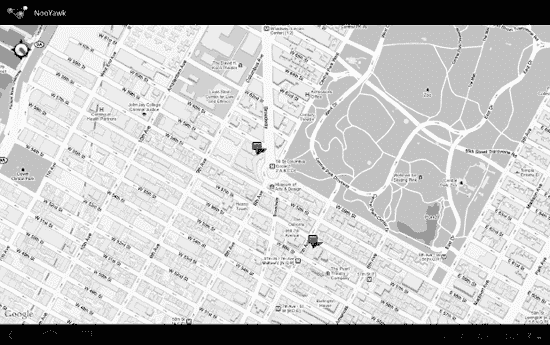

# 四十、使用 MapView 和 MapActivity 进行制图

谷歌最受欢迎的服务之一——当然是在搜索之后——是谷歌地图，它使你能够绘制从最近的比萨饼店的位置到从纽约市到旧金山的方向的所有信息(只有 2571 英里，或公制的 4135 公里),包括街景和卫星图像。

毫不奇怪，大多数 Android 设备都集成了谷歌地图。对于那些这样做的人，有一个直接从主 Android 启动器向用户提供的映射活动。作为开发人员，与您更相关的是`MapView`和`MapActivity`，它们允许您将地图集成到自己的应用中。你不仅可以显示地图，控制缩放级别，允许人们四处平移，还可以结合 Android 的基于位置的服务来显示设备的位置和去向。

幸运的是，将基本的地图功能集成到您的 Android 项目中相当容易。再努力一点，你就可以集成更复杂的地图功能。

### 术语，非爱称

将谷歌地图集成到第三方应用中需要同意一套相当长的法律条款。这些条款包括你可能会觉得不愉快的条款。

如果您正在考虑谷歌地图，请仔细阅读这些条款，以确定您的预期用途是否会与任何条款相冲突。如果有任何潜在的冲突，强烈建议您寻求专业的法律顾问。

此外，请留意基于其他地图数据源的其他地图选项，比如 OpenStreetMap ( `[www.openstreetmap.org/](http://www.openstreetmap.org/)`)。

### 打桩

从 Android 1.5 开始，谷歌地图并不是 Android SDK 的一部分。相反，它是 Google APIs 插件的一部分，是股票 SDK 的扩展。Android 附加系统为其他子系统提供挂钩，这些子系统可能是某些设备的一部分，但不是其他设备的一部分。

**注意:**由于谷歌地图不是 Android 开源项目的一部分，一些设备由于许可问题而缺少谷歌地图。例如，在撰写本文时，Archos 5 Android 平板电脑没有谷歌地图。

总的来说，谷歌地图是一个附加软件的事实不会影响你的日常开发。但是，请记住以下几点:

*   您需要创建具有适当目标的项目，以确保 Google Maps APIs 可用。
*   为了测试您的 Google Maps 集成，您还需要一个使用适当目标的 AVD。

### 这一切的关键

如果您下载这本书的源代码，编译`Maps/NooYawk`项目，将其安装在您的模拟器中，并运行它，您可能会看到一个带有网格和几个图钉的屏幕，但没有实际的地图。那是因为源代码中的 API 键对于你的开发机器是无效的。相反，您将需要生成您自己的 API 密钥，以供您的应用使用。这也适用于您自己从头开始创建的任何启用地图的项目。

可以在 Android 网站上找到用于开发和生产的生成 API 密钥的完整说明。为了简洁起见，让我们把重点放在让`NooYawk`在您的仿真器中运行这个狭窄的例子上。为此，需要执行以下步骤:

1.  请访问 API 密钥注册页面并查看服务条款。
2.  重读这些服务条款，并确保你真的想同意他们。
3.  找到用于对调试模式应用进行签名的证书的 MD5 摘要(在下面的列表中有详细描述)。
4.  在 API 密钥注册页面上，粘贴 MD5 签名并提交表单。
5.  在生成的页面上，复制 API 键并将其作为值粘贴到您的`MapView` -using 布局中。

最棘手的部分是找到用于签署调试模式应用的证书的 MD5 签名。大部分的复杂性仅仅在于理解这个概念。

所有 Android 应用都使用证书生成的数字签名进行签名。当您设置 SDK 时，系统会自动为您提供一个调试证书，并且有一个单独的过程来创建用于生产应用的自签名证书。这个签名过程涉及到 Java `keytool`和`jarsigner`实用程序的使用。为了得到你的 API 密匙，你只需要担心`keytool`。

要获取调试证书的 MD5 摘要，如果您使用的是 Mac OS X 或 Linux，请使用以下命令:

`keytool -list -alias androiddebugkey -keystore ~/.android/debug.keystore
 -storepass android -keypass android`

在其他开发平台上，比如 Windows，您需要用您的平台和用户帐户的位置替换`-keystore`开关的值(其中`<user>`是您的帐户名称):

*   在 Windows XP 上，使用`C:\Documents and Settings\<user>\.android\debug.keystore`。
*   在 Windows Vista 或 Windows 7 上，使用`C:\Users\<user>\.android\debug.keystore`。

输出的第二行包含您的 MD5 摘要，是由冒号分隔的一系列十六进制数字对。

### 光秃秃的骨头

要将地图放入您的应用，您需要创建自己的子类`MapActivity`。就像`ListActivity`总结了由`ListView`主导的活动背后的一些智慧一样，`MapActivity`处理了设置由`MapView`主导的活动的一些细微差别。A `MapView`只能被 a `MapActivity`使用，不能被任何其他类型的`Activity`使用。

在`MapActivity`子类的布局中，您需要添加一个名为`com.google.android.maps.MapView`的元素。这是拼写小部件类名的“手写”方式，包括完整的包名和类名。这是必要的，因为`MapView`不在`android.widget`名称空间中。你可以给`MapView`小部件任何你想要的`android:id`属性值，并处理所有的布局细节，让它和你的其他小部件一起正确呈现。

但是，您需要具备以下物品:

*   `android:apiKey`，您的谷歌地图 API 密钥
*   如果您希望用户能够点击并平移您的地图

例如，在`Maps/NooYawk`示例应用中，主要布局如下:

`<?xml version="1.0" encoding="utf-8"?>
<RelativeLayout xmlns:android="http://schemas.android.com/apk/res/android"
  android:layout_width="fill_parent"
  android:layout_height="fill_parent">
  <com.google.android.maps.MapView android:id="@+id/map"
    android:layout_width="fill_parent"
    android:layout_height="fill_parent"
    android:apiKey="00yHj0k7_7vxbuQ9zwyXI4bNMJrAjYrJ9KKHgbQ"
    android:clickable="true" />
</RelativeLayout>`

此外，在您的`AndroidManifest.xml`文件中还需要一些额外的东西:

*   `INTERNET`和`ACCESS_FINE_LOCATION`权限(后者与`MyLocationOverlay`类一起使用，将在本章后面描述)
*   在您的`<application>`中，一个带有`android:name = "com.google.android.maps"`的`<uses-library>`元素，表示您正在使用一个可选的 Android APIs

以下是`NooYawk`的`AndroidManifest.xml`文件:

`<?xml version="1.0" encoding="utf-8"?>
<manifest xmlns:android="http://schemas.android.com/apk/res/android"
 package="com.commonsware.android.maps">
  <uses-permission android:name="android.permission.INTERNET"/>
  <uses-permission android:name="android.permission.ACCESS_FINE_LOCATION"/>

  <application android:label="@string/app_name" android:icon="@drawable/cw">
    <uses-library android:name="com.google.android.maps"/>
    <activity android:name=".NooYawk" android:label="@string/app_name">
      <intent-filter>
        <action android:name="android.intent.action.MAIN"/>
        <category android:name="android.intent.category.LAUNCHER"/>
      </intent-filter>
    </activity>
  </application>
  <supports-screens android:largeScreens="true" android:normalScreens="true"
 android:smallScreens="true" android:anyDensity="true"/>
</manifest>`

除了从`MapActivity`开始对活动进行子类化之外，对于初学者来说，这几乎就是你所需要的全部了。如果你什么都不做，构建这个项目并把它扔进模拟器，你会得到一个漂亮的世界地图。然而，请注意，`MapActivity`是抽象的——您需要实现`isRouteDisplayed()`来表明您是否在提供某种驾驶方向。由于当前版本的服务条款不支持显示行驶方向，您应该让`isRouteDisplayed()`返回`false`。

#### 可选地图

虽然大多数主流 Android 设备都有谷歌地图，但有一小部分没有，因为他们的制造商没有选择从谷歌获得许可。因此，您需要决定 Google Maps 对于您的应用的运行是否至关重要。

如果谷歌地图是必不可少的，那么在你的应用中包含`<uses-library>`元素，如前所示，因为这将要求任何运行你的应用的设备都要有谷歌地图。

如果谷歌地图不是必不可少的，你可以通过`<uses-library>`上的`android:required`属性使其成为可选的。设置为`false`，如果谷歌地图可用的话，它会被加载到你的应用中，但是不管怎样，你的应用都会运行良好。然后，您将需要使用类似`Class.forName("com.google.android.maps.MapView")`的东西来查看您的应用是否可以使用 Google Maps。如果不是，你可以禁用它的菜单项，或者任何可以引导用户到你的`MapActivity`的东西。

**注意:**在旧的文档中，`android:required`属性是“未记录的”,它的使用和支持是有问题的。谷歌现在已经正式记录了它，它在 Android 4.0 冰淇淋三明治和未来的版本中可用。

### 运用你的控制力

你可以通过`findViewById()`找到你的`MapView`部件，就像其他部件一样。小部件本身提供了一个`getController()`方法。在`MapView`和`MapController`之间，你有相当多的能力来决定地图显示什么以及它如何表现。缩放和居中是您可能想要使用的两个功能，因此它们将在接下来讨论。

#### 缩放

你开始时的世界地图相当广阔。通常，在手机上看地图的人会期待范围稍微窄一点的东西，比如几个城市街区。

您可以通过`MapController`上的`setZoom()`方法直接控制缩放级别。这需要一个代表缩放级别的整数，其中`1`是世界视图，`21`是你能得到的最紧密的缩放。每一级都是有效分辨率的两倍:`1`的赤道宽度为 256 像素，而`21`的赤道宽度为 268，435，456 像素。由于手机的显示屏可能在两个维度上都没有 268，435，456 像素，用户看到的是聚焦在地球一个微小角落的小地图。一个`17`的关卡会在每个维度显示几个城市街区，这可能是你尝试的一个合理起点。

如果您希望允许用户更改缩放级别，调用`setBuiltInZoomControls(true);`，用户将能够通过地图底部中心的缩放控件放大和缩小地图。

#### 居中

通常，除了缩放级别之外，您还需要控制地图显示的内容，例如用户的当前位置或与活动中的一些数据一起保存的位置。要改变地图的位置，调用`MapController`上的`setCenter()`。

`setCenter()`方法将一个`GeoPoint`作为参数。一个`GeoPoint`通过纬度和经度代表一个位置。问题是`GeoPoint`将纬度和经度存储为整数，表示*微度数*(度数乘以 1E6)中的实际纬度和经度。与存储一个`float`或`double`相比，这节省了一点内存，并且大大加快了 Android 将`GeoPoint`转换成地图位置所需的一些内部计算。但是，这确实意味着您必须记住将真实世界的纬度和经度乘以 1E6。

### 层层叠叠

如果你曾经使用过全尺寸版的谷歌地图，你可能会习惯于看到覆盖在地图上的东西，比如图钉指示被搜索位置附近的企业。在地图术语中(就此而言，在许多严肃的图形编辑器中)，图钉位于与地图本身不同的图层上，您看到的是地图图层上图钉图层的组合。

Android 的地图也允许你创建图层，所以你可以根据用户输入和你的应用的目的来标记你需要的地图。例如，`NooYawk`使用一个层来显示选择的建筑物在曼哈顿岛上的位置。

#### 叠加类

任何想要添加到地图上的覆盖图都需要作为`Overlay`的子类来实现。如果你想添加图钉之类的东西，可以使用一个`ItemizedOverlay`子类；`ItemizedOverlay`简化了这个过程。

要给你的地图添加一个覆盖类，只需调用你的`MapView`上的`getOverlays()`和你的`Overlay`实例上的`add()`，就像我们在这里使用自定义的`SitesOverlay`一样:

`marker.**setBounds**(0, 0, marker.**getIntrinsicWidth**(),
                       marker.**getIntrinsicHeight**());

map.**getOverlays**().**add**(new **SitesOverlay**(marker));`

我们将在下一节中讨论`marker`。

#### 绘制明细 Overlay

顾名思义，`ItemizedOverlay`允许您提供要在地图上显示的兴趣点列表——特别是`OverlayItem`的实例。然后，覆盖层会为您处理大部分绘图逻辑。以下是实现这一目标的最基本步骤:

1.  覆盖`ItemizedOverlay<OverlayItem>`作为自己的子类(在这个例子中是`SitesOverlay`)。
2.  在构造器中，构建您的`OverlayItem`实例花名册，当它们准备好供覆盖使用时，调用`populate()`。
3.  实现`size()`以返回覆盖要处理的项目数。
4.  重写`createItem()`以返回给定索引的`OverlayItem`实例。
5.  当你实例化你的`ItemizedOverlay`子类时，给它提供一个`Drawable`来表示为每个项目显示的默认图标(例如，图钉),在这个图标上你调用`boundCenterBottom()`来启用投影效果。

来自`NooYawk`构造函数的`marker`是用于步骤 5 的`Drawable`，它显示了一个图钉。

比如这里是`SitesOverlay`:

`private class SitesOverlay extends ItemizedOverlay<OverlayItem> {
  private List<OverlayItem> items=new ArrayList<OverlayItem>();
  private Drawable marker=null;

  public **SitesOverlay**(Drawable marker) {
    super(marker);
    this.marker=marker;

    **boundCenterBottom**(marker);

    items.**add**(new **OverlayItem**(**getPoint**(40.748963847316034,
                                       -73.96807193756104),
                             "UN", "United Nations"));
    items.**add**(new **OverlayItem**(**getPoint**(40.76866299974387,
                                       -73.98268461227417),
                             "Lincoln Center",
                             "Home of Jazz at Lincoln Center"));
    items.**add**(new **OverlayItem**(**getPoint**(40.765136435316755,
                                       -73.97989511489868),
                             "Carnegie Hall",
            "Where you go with practice, practice, practice"));
    items.**add**(new **OverlayItem**(**getPoint**(40.70686417491799,
                                       -74.01572942733765),
                             "The Downtown Club",
                     "Original home of the Heisman Trophy"));

    **populate**();
  }

  @Override
  protected OverlayItem **createItem**(int i) {
    return(items.**get**(i));
  }

  @Override
  protected boolean **onTap**(int i) {
    Toast.**makeText**(NooYawk.this,
                    items.**get**(i).**getSnippet**(),
                    Toast.LENGTH_SHORT).**show**();

    return(true);
  }

  @Override
  public int **size**() {
    return(items.**size**());
  }
}`

#### 处理屏幕点击

一个`Overlay`子类也可以实现`onTap()`，当用户点击地图时得到通知，这样覆盖图可以调整它所绘制的内容。例如，在全尺寸的谷歌地图中，点击一个图钉会弹出一个气泡，显示图钉所在位置的企业信息。有了`onTap()`，你可以在 Android 上做同样的事情。

用于`ItemizedOverlay`的`onTap()`方法接收被点击的`OverlayItem`的索引。这取决于你做一些有意义的事情。

在`SitesOverlay`的情况下，如前一节所示，`onTap()`看起来像这样:

`@Override
protected boolean **onTap**(int i) {
  Toast.**makeText**(NooYawk.this,
                  items.get(i).**getSnippet**(),
                  Toast.LENGTH_SHORT).**show**();

  return(true);
}`

这里，我们只是用来自`OverlayItem`的片段抛出一个简短的`Toast`，返回`true`来表示我们处理了点击。

### 我的、我自己的和我的位置覆盖

Android 有一个内置的覆盖来处理两种常见的情况:

*   基于 GPS 或其他位置提供逻辑，显示您在地图上的位置
*   根据内建的指南针传感器显示您被指向的位置(如果有)

你所需要做的就是创建一个`MyLocationOverlay`实例，将其添加到你的`MapView`的覆盖列表中，并在适当的时候启用和禁用所需的功能。

“在适当的时候”的概念是为了最大限度地延长电池寿命。当活动暂停时，更新位置或方向没有意义，因此建议您在`onResume()`中启用这些功能，在`onPause()`中禁用它们。

例如，`NooYawk`将使用`MyLocationOverlay`显示罗盘。为此，我们首先需要创建覆盖图，并将其添加到覆盖图列表中(其中`me`是作为私有数据成员的`MyLocationOverlay`实例):

`me=new **MyLocationOverlay**(this, map);
map.**getOverlays**().**add**(me);`

然后，我们根据需要启用和禁用罗盘:

`@Override
public void **onResume**() {
  super.**onResume**();

  me.**enableCompass**();
}

@Override
public void **onPause**() {
  super.**onPause**();

  me.**disableCompass**();
}`

当活动在屏幕上时，这给了我们一个罗盘，如图[Figure 40–1](#fig_40_1)所示。

**图 40–1。** *诺亚克地图，显示一个罗盘和两个重叠的物品*

### 崎岖的地形

正如你在全尺寸电脑上使用的谷歌地图可以显示卫星图像一样，安卓地图也可以。

`MapView`提供`toggleSatellite()`，顾名思义，它可以打开和关闭正在查看的区域的卫星视角。您可以允许用户通过选项菜单来触发，或者在使用`NooYawk`的情况下，通过按键来触发:

` @Override
  public boolean **onKeyDown**(int keyCode, KeyEvent event) {
    if (keyCode == KeyEvent.KEYCODE_S) {
      map.**setSatellite**(!map.**isSatellite**());
      return(true);
    }
    else if (keyCode == KeyEvent.KEYCODE_Z) {
      map.**displayZoomControls**(true);
      return(true);
    }

    return(super.**onKeyDown**(keyCode, event));
  }`

[图 40–2](#fig_40_2)显示了点击`S`键后`NooYawk`中的卫星视图。

**图 40–2。***NooYawk 地图，显示一个罗盘和两个重叠的项目，重叠在卫星视图上*

### 地图和片段

您可能认为地图是使用片段的理想场所。毕竟，在一个大的平板电脑屏幕上，你可以将大部分空间分配给地图，但旁边仍然有其他东西。唉，在 Android 的最后两个主要版本中，地图和片段仍然是两种很好的口味，但合在一起就不那么好了。

首先，`MapView`要求你继承`MapActivity`。这有几个后果:

*   不能使用 Android 兼容库(ACL)，因为那需要你从`FragmentActivity`继承，而 Java 不支持多重继承。因此，你只能在 Android 3.0 和更高版本上使用分段地图，这需要你在旧版本的 Android 上使用一些替代实现。
*   任何可能在片段中托管地图的活动都必须从`MapActivity`继承，即使在某些情况下它可能不在片段中托管地图。

另外，`MapView`对各种事件的时间做了一些假设，这使得建立一个基于地图的片段变得更加复杂。

完全有可能有一天这些问题会得到解决，通过一个更新的 Google APIs Android 插件与片段支持的结合，可能还有一个更新的 ACL。与此同时，这是让地图尽可能地分段工作的方法。

#### 限制自己使用最新的安卓版本

在清单中，确保将您的`android:minSdkVersion`和`android:targetSdkVersion`都设置为至少`11`，这样您的应用只能在 Android 3.0 和更新版本上运行。例如，下面是来自`Maps/NooYawkFragments`示例项目的清单:

`<?xml version="1.0" encoding="utf-8"?>
<manifest xmlns:android="http://schemas.android.com/apk/res/android"
          package="com.commonsware.android.maps">
  <uses-permission android:name="android.permission.INTERNET"/>
  <uses-permission android:name="android.permission.ACCESS_FINE_LOCATION"/>

  <application android:label="@string/app_name"
              android:icon="@drawable/cw"
              android:hardwareAccelerated="true">
    <uses-library android:name="com.google.android.maps"/>
    <activity android:name=".NooYawk" android:label="@string/app_name">
      <intent-filter>
        <action android:name="android.intent.action.MAIN"/>
        <category android:name="android.intent.category.LAUNCHER"/>
      </intent-filter>
    </activity>
  </application>
  <uses-sdk android:minSdkVersion="11" android:targetSdkVersion="11" />
  <supports-screens android:largeScreens="true"
android:normalScreens="true" android:smallScreens="true" android:anyDensity="true"/>
</manifest>`

#### 使用 onCreateView()和 onActivityCreated()

基于地图的片段只是一个显示一个`MapView`的`Fragment`。总的来说，这段代码看起来和工作起来很像一个`MapActivity`，配置`MapView`，设置`ItemizedOverlay`，等等。

然而，有一个时间问题:您不能可靠地从`onCreateView()`返回一个`MapView`小部件，或者包含这样一个小部件的膨胀布局。不管出于什么原因，第一次运行正常，但是在配置改变时(例如屏幕旋转)，它会失败。

解决方案是从`onCreateView()`返回一个容器，比如一个`FrameLayout`，如这里的`NooYawkFragments`的`MapFragment`类所示:

`@Override
public View **onCreateView**(LayoutInflater inflater, ViewGroup container,
                         Bundle savedInstanceState) {
  return(new **FrameLayout**(**getActivity**()));
}`

然后，在`onActivityCreated()`——一旦`onCreate()`在托管`MapActivity`中完成——您可以向该容器添加一个`MapView`,并继续您的正常设置:

`@Override
public void **onActivityCreated**(Bundle savedInstanceState) {
  super.**onActivityCreated**(savedInstanceState);

  map=new **MapView**(**getActivity**(), "00yHj0k7_7vxbuQ9zwyXI4bNMJrAjYrJ9KKHgbQ");
  map.**setClickable**(true);

  map.**getController**().**setCenter**(**getPoint**(40.76793169992044,
                                        -73.98180484771729));
  map.**getController**().setZoom(17);
  map.**setBuiltInZoomControls**(true);

  Drawable marker=**getResources**().**getDrawable**(R.drawable.marker);

  marker.**setBounds**(0, 0, marker.**getIntrinsicWidth**(),
                         marker.**getIntrinsicHeight**());

  map.**getOverlays**().**add**(new **SitesOverlay**(marker));

  me=new **MyLocationOverlay**(**getActivity**(), map);
  map.**getOverlays**().**add**(me);

  ((ViewGroup)**getView**()).**addView**(map);
}`

注意，我们在 Java 代码中创建了一个`MapView`，这意味着我们的 Maps API 键驻留在 Java 代码中(或者可以从 Java 代码中获得的东西，比如一个字符串资源)。如果您愿意，您可以在这里展开包含一个`MapView`的布局——`MapFragment`的变化只是为了说明从 Java 代码创建一个`MapView`。

#### 在 MapActivity 中托管片段

您必须确保托管支持地图的片段的任何活动都是一个`MapActivity`。因此，即使`NooYawk`活动不再与映射有太大关系，它仍然是一个`MapActivity`:

`package com.commonsware.android.maps;

import android.os.Bundle;
import com.google.android.maps.MapActivity;

public class NooYawk extends MapActivity {
  @Override
  public void **onCreate**(Bundle savedInstanceState) {
    super.**onCreate**(savedInstanceState);
    **setContentView**(R.layout.main);
  }

  @Override
  protected boolean **isRouteDisplayed**() {
    return(false);
  }
}`

布局现在指向一个`<fragment>`而不是一个`MapView`:

`<?xml version="1.0" encoding="utf-8"?>
<fragment xmlns:android="http://schemas.android.com/apk/res/android"
  class="com.commonsware.android.maps.MapFragment"
  android:id="@+id/map_fragment"
  android:layout_width="fill_parent"
  android:layout_height="fill_parent"
/>`

最终的应用，如[Figure 40–3](#fig_40_3)所示，看起来像大屏幕上的原始`NooYawk`活动，因为我们没有对片段系统做任何其他事情(例如，在风景布局中有其他片段)。

**图 40–3。** *摩托罗拉 XOOM* 上渲染的 NooYawkFragments 地图

#### 地图和片段的定制替代方案

可以理解，Android 开发者社区对地图在片段中的限制感到沮丧，并努力应对`MapView`需要在`MapActivity`中的限制。你可以在 StackOverflow Android 开发者论坛上看到实验和讨论的历史，这导致了贡献者之一 Pete Doyle 发布了`android-support-v4-googlemaps`自定义兼容性库。

Doyle 的自定义兼容性库是一个使`FragmentActivity`扩展`MapActivity`的工作解决方案。这反过来允许你在一个片段中使用一个`MapView`对象。

你可以在`[https://github.com/petedoyle/android-support-v4-googlemaps](https://github.com/petedoyle/android-support-v4-googlemaps)`从 GitHub 下载`support-v4-googlemaps`自定义兼容性库。