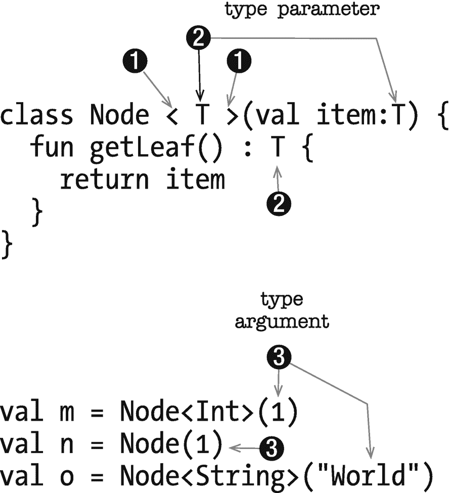
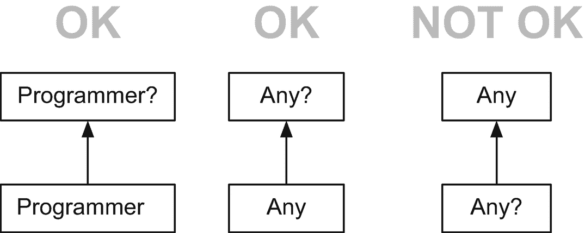

# 7.无商标消费品

*我们将介绍的内容:*

*   使用泛型

*   限制

*   变化

*   具体化的泛型

啊，仿制药。这个迂回的话题甚至出现在初学者的文章中。这个题目让许多初学者犯了错误，因为它很难理解，解释起来更难。但是我们需要处理它，因为没有泛型，就很难使用集合。

在很大程度上，Kotlin 泛型的工作方式与 Java 泛型相同；但是他们有一些不同。在这一章中，我们将看看如何使用泛型，以及 Kotlin 的泛型与 Java 的有多相似(或不同)——另外，不要太担心泛型的复杂性，在这一章中我们不会做任何疯狂的事情。

## 为什么是仿制药

泛型是在 2004 年左右来到 Java 的，当时 JDK 1.5 发布了。在泛型出现之前，你可以编写清单 [7-1](#PC1) 中的代码。

```java
List v = new ArrayList();
v.add("test");
Integer i = (Integer) v.get(0); // Run time error

Listing 7-1Using a Raw List, Java

```

你可能会说，“但是你为什么要做如此粗心和明显愚蠢的事情呢？从清单 [7-1](#PC1) 中可以清楚地看到，我们在 ArrayList 中放了一个字符串；所以，不要做任何不适合字符串的操作。问题解决了。”这可能并不总是那么容易。示例代码显然是精心设计的，现在很容易发现错误，但是如果您正在做一些重要的事情，列表包含的内容可能并不总是很明显。

关于示例代码，需要注意的另一点——实际上也是最重要的一点——是代码可以顺利编译。你只能在运行时发现错误。编译器没有办法警告我们将要做的事情不是类型安全的。这是泛型试图解决的主要问题:类型安全。

回到清单 [7-1](#PC1) ，我们知道变量 *v* 是一个列表。如果我们知道列表中存储了哪些内容，那会更有用。正是在这些情况下，泛型是有帮助的。它允许我们说类似“这是一个字符串列表”或“这是一个整型数列表”这样的话——编译器事先就知道；因为编译器知道这一点，所以它可以防止我们做一些不恰当的事情，比如把一个字符串转换成 Int 或者用字符串做减法等等。清单 [7-2](#PC2) 展示了如何在我们的代码中使用泛型。

```java
List<String> v = new ArrayList<String>();
v.add("test");
Integer i = v.get(0); // (type error)  compilation-time error

Listing 7-2List, with Generics: Java

```

现在编译器已经预知了列表中有哪些内容，它可以防止我们在列表上进行不受支持的操作。

清单 [7-1](#PC1) 和 [7-2](#PC2) 中的代码在 Java 中都是有效的，这意味着您可以选择不在集合中使用泛型(*原始类型*)。Java 必须这样做，因为它需要保持与 JDK 5 之前编写的代码的向后兼容性。另一方面，Kotlin 不需要维护任何与遗留代码的兼容性。所以，在 Kotlin 中，你不能使用*原始类型*。所有 Kotlin 集合都需要类型参数。你总是必须使用泛型。

## 术语

泛型编程是 Kotlin 的一个语言特性。有了它，我们可以定义接受类型参数的类、函数和接口。参数化类型允许我们重用算法来处理不同的类型；这确实是参数多态性的一种形式。图 [7-1](#Fig1) 显示了类型参数和类型实参在泛型类中的位置。

<colgroup><col class="tcol1 align-left"> <col class="tcol2 align-left"></colgroup> 
| -什么 | **尖括号**。当一个类的名字后面有尖括号时，它被称为泛型类(也有泛型函数和接口)。 |
| ➋ | **类型参数**。它定义了这个类可以处理的数据类型。您可以将其视为类实现的一部分。现在，我们使用字母 **T** 来表示类型参数，但是这是任意的。你可以随便叫它什么，可以是任何字母，也可以是字母的组合；如果我是你，我会坚持使用 **T** ，因为这是许多开发人员遵循的惯例。你可以在类内的整个代码中使用 **T** ，就像它是一个真实的类型一样。这是一个类型的占位符*。在本例中，我们使用 *T* 作为**项目**属性的类型，并作为 **getLeaf** 函数的返回类型。* |
| ➌ | **类型自变量**。为了使用泛型类，你必须提供**类型参数**。现在我们正在创建节点类的一个实例， **T** 将被*类型参数*所替代(在本图中为 *Int* 和 *String* )。 |



图 7-1

类型变量和类型参数

在前面的章节中你已经看到了泛型代码，具体在*章* [6](06.html) *(集合)*。Kotlin 的所有集合类都使用泛型。我之前说过，科特林没有原始类型。不可能只创建一个*列表*—你必须明确它是哪种*列表*(例如，一个“字符串列表”**列表<字符串>** 或“整数列表”**列表< Int >)。**

## 在函数中使用泛型

若要创建泛型函数，请在函数名之前声明类型参数。然后，您可以在函数中的任何地方使用类型参数。

<colgroup><col class="tcol1 align-left"> <col class="tcol2 align-left"></colgroup> 
| -什么 | 类型参数 **T** 用作函数参数 **arg 的类型。** |
| ➋ | 我们只是返回串接在字符串中的**参数**。 |

```java
fun <T> fooBar(arg:T) : String { ➊
  return "Heya $arg"  //  ➋
}

println(fooBar("Joe"))  // prints "Heya Joe"
println(fooBar(10))     // prints "Heya 10"

```

这很容易理解。我们只是在一个地方使用了 param 类型，不管 param 是什么类型，函数都返回一个字符串。另一个例子，见清单 [7-4](#PC4) 。

<colgroup><col class="tcol1 align-left"> <col class="tcol2 align-left"></colgroup> 
| -什么 | 在这个例子中，我们使用*类型参数*作为**arg**(T4】fooBar 函数的参数)的类型以及函数本身的返回类型。 |
| ➋ | 我们正在测试 **arg** 是否是字符串类型。如果是的话，我们也有效地把它转换成一个字符串；聪明的演员，记得吗？ |
| ➌ | 我们将返回“Hello world”，并(强制)将其转换为 **T** 。我们不能在这里返回“字符串”类型，因为 fooBar 期望返回类型 **T** 给它的调用者，而不是字符串。 |

```java
fun <T> fooBar(arg:T) : T {  ➊
  var retval:T = 0 as T
  when (arg) {
    is String -> {          ➋
      retval = "Hello world" as T  ➌
    }
    is Number -> {
      retval = 100 as T
    }
  }
  return retval
}

Listing 7-4A More Complex fooBar Function

```

您还可以将泛型用于扩展函数。如果你正在创建一个处理列表的函数，你可能希望它能处理任何类型的列表，而不仅仅是字符串或整型。清单 [7-5](#PC5) 展示了如何在扩展函数中使用泛型。

<colgroup><col class="tcol1 align-left"> <col class="tcol2 align-left"></colgroup> 
| -什么 | 可以使用*接收方* **(列表< T > )** 中的类型参数和扩展函数的返回类型。 |
| ➋ | 我们不要做任何花哨的事情；让我们返回一个给定索引的项。在生产代码中，您可能希望在返回索引之前检查它是否存在。如果您忘记了这个指的是什么，它指的是列表本身(它是 receiver 对象)。 |
| ➌ | 我们的扩展函数处理字符串列表。 |
| -你好 | 它也适用于一个整型列表。 |
| ➎ | 这个有点花里胡哨，但是最后还是返回了一个列表，所以我们的扩展函数应该还是可以的。 |

```java
fun <T> List<T>.getIt(index:Int): T { ➊
  return this[index] ➋
}

fun main(args: Array<String>) {

  val lfruits = listOf("Apples", "Bananas", "Oranges") ➌
  val lnumbers = listOf(1,3,5)    ➍
  val lnumlist = (1..100).toList().filter { it % 5 == 0 } ➎

  println(lnumlist.getIt(5))
  println(lfruits.getIt(1))
}

Listing 7-3fooBar, Generic Function

```

## 在类中使用泛型

像在 Java 中一样，您可以通过在类名后面放一对尖括号并将类型参数放在尖括号之间来创建 Kotlin 泛型类。之后，您可以在类中的任何地方使用类型参数。清单 [7-6](#PC6) 展示、注释并解释了如何编写一个泛型类。

<colgroup><col class="tcol1 align-left"> <col class="tcol2 align-left"></colgroup> 
| -什么 | 类型参数声明在类名**节点<T>T1】之后。我们使用 **T** 作为参数**项的类型。**** |
| ➋ | 我们还使用 **T** 作为函数 **getLeaf 的返回值。** |
| ➌ | 我们向 Node 的构造函数传递一个 Int。我们可以详细一点，指定 Int 作为类型参数，**节点< Int >。** |
| -你好 | 节点可以推断出类型参数是什么，所以我们可以跳过尖括号。这样写也没问题。 |
| ➎ | 因为它是一个泛型类，所以它也可以处理字符串。 |

```java
class Node<T>(val item:T) {   ➊
  fun getLeaf() : T {         ➋
    return item
  }
}

fun main(args: Array<String>) {
  val m = Node<Int>(1)           ➌
  val n = Node(1)                ➍
  val o = Node<String>("World")  ➎
}

Listing 7-6Writing a Generic Class

```

您可以约束或限制可用作类或函数的类型参数的类型。目前，我们的节点类应该可以处理任何类型，因为类型参数的默认父类(或*上界*)如果不指定约束，**是 any 吗？**(可空类型，所以包含问号)。

当您为类型参数指定上限约束时，这将限制可用于实例化该类的类型。例如，如果我们希望节点类只接受整型、双精度型或浮点型，我们可以使用 Number 作为上限约束。代码示例见清单 [7-7](#PC7) 。

<colgroup><col class="tcol1 align-left"> <col class="tcol2 align-left"></colgroup> 
| -什么 | 现在我们对类型参数 **<** **T:编号** **>** 进行约束。我们可以用来实例化这个类的唯一类型必须是数量为**的**的子类型。 |
| ➋ | Int 是数字的子类型，所以没问题。 |
| ➌ | 浮动也可以。 |
| -你好 | 这已经行不通了。IntelliJ 会告诉你“类型参数不在界限内”。 |
| ➎ | 这对 Double 仍然有效，因为它是 number 的子类。 |

```java
class Node<T:Number>(val item:T) { ➊
  fun getLeaf() : T {
    return item
  }
}

fun main(args: Array<String>) {
  val m = Node<Int>(1)           ➋
  val n = Node(1.0F)             ➌
  val o = Node<String>("World")  ➍
  val p = Node(1.0)              ➎
}

Listing 7-7Node Class, with Constraint

```

如果除了类型参数的可空性之外没有任何限制，可以简单地使用 **Any** 作为类型参数的上限；参见清单 [7-8](#PC8) 。

```java
class Node<T:Any>(val item:T) {
  fun getLeaf() : T {
    return item
  }
}

Listing 7-5Generics in Extension Function

Listing 7-8Prevent Null Type Arguments

```

## 变化

我们需要回顾一些面向对象编程(OOP)的基础知识，为讨论差异做准备。希望我们能唤起你的记忆，记住一些 OOP 的基本原则。

OOP 是开发者的福音；正因为如此，我们可以编写类似清单 [7-9](#PC9) 的代码。

```java
val a:Int =  1
val b:Number = a

println("b:$b is of type ${b.javaClass.name}")

Listing 7-9Assign an Int Variable to Number Type

```

我们也可以编写类似清单 [7-10](#PC10) 的函数。

```java
foo(1)
foo(100F)
foo(120)

fun foo(arg:Number) {
  println(arg)
}

Listing 7-10Function That Accepts a Number Type

```

清单 [7-9](#PC9) 和 [7-10](#PC10) 中的代码是可能的，因为*利斯科夫替代原理* (LSP)。这是 OOP 中最重要的部分之一——在需要父类型的地方，你可以用子类型来代替它。我们使用更一般化的类型(如清单 [7-10](#PC10) 中的**号**)的原因是，将来如果需要，我们可以编写一个子类型的实现，并插入到现有的工作代码中。这是**开闭原则**的精髓(声明一个类必须对扩展开放，但对修改关闭)。

### 注意

**利斯科夫替代原理**和**开闭原理**是立体设计原理的一部分。这是 OOP 中最流行的设计原则之一。实线代表(S)单一责任(O)开/闭(L)利斯科夫替代(I)界面分离和(D)依赖性倒置

再举一个例子，见清单 [7-11](#PC11) 。

<colgroup><col class="tcol1 align-left"> <col class="tcol2 align-left"></colgroup> 
| -什么 | employee_1 的类型是 **Employee** ，我们给它分配了一个**程序员**对象。这没关系。程序员是员工的一个*子类型*。 |
| ➋ | 这里同样的事情，类型**测试者**是**雇员**的一个子类型，所以分配应该没问题。 |

```java
open class Employee(val name:String) {
  override fun toString(): String {
    return name
  }
}

class Programmer(name:String) : Employee(name) {}
class Tester(name:String) : Employee(name) {}

fun main(args: Array<String>) {
  val employee_1 :Employee = Programmer("Ted")  ➊
  val employee_2 :Employee = Tester("Steph")    ➋

  println(employee_1)
  println(employee_2)
}

Listing 7-11Employee, Programmer, and Tester

```

毫无疑问，利斯科夫原理仍然在起作用。即使您将程序员和雇员放在一个列表中，类型关系也会保留。

```java
val list_1: List<Programmer> = listOf(Programmer("James"))
val list_2: List<Employee> = list_1

Listing 7-12Employee and Programmer in Lists

```

目前为止，一切顺利。下一个代码是什么？你认为这行得通吗？(参见清单 [7-13](#PC13) 。)

```java
class Group<T>
val a:Group<Employee> = Group<Programmer>()

Listing 7-13Group of Employees and Programmers

```

这是泛型最棘手的部分之一。清单 [7-13](#PC13) ，按照目前的情况，是行不通的。即使我们知道**程序员**是**雇员**的子类型，并且我们所做的是类型安全的，编译器也不会让我们通过，因为代码中的第二条语句有问题。

当你使用泛型时，永远记住默认情况下**组<雇员>，组<程序员>，**和**组<测试员>** 没有任何类型关系——即使我们知道测试员和程序员是雇员的子类型。默认情况下，类**组<T>T5】中的类型参数是*不变量*。为了使第二条语句(在清单 [7-13](#PC13) 中)起作用，**组< T >** 必须是*协变的*。我们将在清单 [7-14](#PC14) 中解决。**

<colgroup><col class="tcol1 align-left"> <col class="tcol2 align-left"></colgroup> 
| -什么 | 当您将 **out** 关键字放在类型参数之前时，这使得类型参数*协变。* |
| ➋ | 这段代码之所以有效，是因为，**组<程序员>** 是现在*组**员工<>**的一个子类型，这要归功于 **out** 关键字。* |

```java
class Group<out T>    ➊

open class Employee(val name:String) {
  override fun toString(): String {
    return name
  }
}
class Programmer(name:String) : Employee(name) {}
class Tester(name:String) : Employee(name) {}

fun main(args: Array<String>) {
  val a:Group<Employee> = Group<Programmer>() ➋
}

Listing 7-14Classes Employee, Programmer, Tester, and Group

```

从这些例子中，我们现在可以归纳出，如果 type Programmer 是 Employee 的一个子类型，并且**组<T>T1】是协变的，那么**组<程序员>T3】是**组< Employee >的一个子类型。**此外，我们可以归纳出，如果对于给定的类型**雇员**和**程序员**，**组<程序员>** 不是**组<雇员>的子类型，那么泛型类就像 Group 一样，在类型参数上是不变的。******

现在我们已经处理了*不变量*和*协变量*。我们需要处理的最后一个术语是*逆变*。如果**组< T >** 的类型参数是逆变的，对于相同的给定类型雇员和程序员，那么我们可以说**组<雇员>** 是**组<程序员>** 的一个子类型——与*共变*正好相反。

<colgroup><col class="tcol1 align-left"> <col class="tcol2 align-left"></colgroup> 
| -什么 | 关键字中的**使类型参数**<****T****>**逆变，意思是；** |
| ➋ | 类型**组<雇员>** 现在是**组<程序员>的子类型。** |

```java
class Group<in T> ➊

open class Employee(val name:String) {
  override fun toString(): String {
    return name
  }
}
class Programmer(name:String) : Employee(name) {}
class Tester(name:String) : Employee(name) {}

fun main(args: Array<String>) {
  val a:Group<Programmer> = Group<Employee>()  ➋
}

Listing 7-15Use the in Keyword for Contravariance

```

## 子类与子类型

好吧。我怀疑你在过去 10 分钟里读到的东西让你觉得很苦涩。怎么会出现**程序员**是**员工**的子类型，**列表<程序员>T5】是**列表<员工>、**的子类型，而**组<程序员>** 不是**组<员工>的子类型？让我们通过回到类、类型、子类和子类型的概念来尝试回答这个问题。****

我们认为类在某种程度上是类型的同义词，一般来说是这样的——至少对于非泛型类来说是这样，在大多数情况下也是这样。我们知道一个类至少有一种类型——它与类本身的类型相同。回到你第一次学习 Java 类的时候——你的老师、导师或者可能是你最喜欢的作者一定是这样定义一个对象的类型的:“它是它所有公共行为的总和，或者被称为对象的方法或契约”或者类似的东西。我们姑且说它是对象拥有的行为集合。

回到“一个类至少有一种类型”，它可以有更多类型。只看图 [7-2](#Fig2) 。


图 7-2

一堆类和接口的层次结构

从图 [7-2](#Fig2) 中，我们可以说:

*   **任何**都在类图表的顶部；类 **Any** 相当于 java.lang.Object

*   **员工**是 **Any** 的子类。Employee 有两种类型:一种是从 Any 继承的，另一种是它自己——因为 Employee 类可以定义自己的一组行为(方法),所以可以算作一种类型。

*   **程序员**是 **Employee 的子类，**是 **Any** 的子类，也就是说程序员有三种类型:一种来自 Any，一种来自 Employee，还有一种来自程序员类本身。

*   **号**是 **Any** 的子类型，但它也实现了**compatible**接口。因此，Number 有三种类型:一种来自 Any，另一种来自自身，还有一种来自可比接口。我们可以说，数字是任何的一个子类型，也是可比的一个子类型——无论你期望可比做什么，数字都能做；任何人能做的事，数字也能做。这是基本的 OOP。

*   **字符串**类有四种类型:一种来自 **Any** ，另一种来自 **Comparable** ，另一种来自 **CharSequence，**，最后来自自己的类。

根据陈述和图表，可以互换使用子类和子类型。两者没有太大区别。当我们开始考虑可空类型时，它们的区别将变得明显。

可空类型就是一个子类不同于子类型的例子。见图 [7-3](#Fig3) 。



图 7-3

可空类型

当你在一个类型的名字后面加上一个问号时，它就变成了该类型的可空版本。在 Kotlin 中，我们可以从同一个类中创建两种类型:可空版本和不可空版本。我们真的不能说**程序员**是**程序员的子类？**因为程序员只有一个类定义，而**程序员**(不可空版本)是**程序员的子类型？**(可空的那个)。同样， **Any** 是 **Any 的子类型？**但是**有吗？**不是 **Any** 的子类型——反方向不成立。

写没问题

```java
var j:Programmer? = Programmer("Ted") // assign non-null to nullable Programmer
j = null. // then we assign a null to j

```

但是不可以写

```java
var i:Programmer = j // assign j (which is null) to non-nullable Programmer

```

现在我们来看泛型。图 [7-4](#Fig4) 应该有助于我们阐明我们需要解决的下一组概念。


图 7-4

泛型类型

我们知道第一个关系**雇员**是**程序员**的父类型。我们还知道**列表<员工>T5】会接受**列表<程序员>T7】；我们在清单 [7-12](#PC12) 中对此进行了测试——您可能不太清楚它为什么会工作，所以在我们处理完第三组盒子后，我将回到这一点。****

现在，给定密码

```java
class Group<T>
val a:Group<Employee> = Group<Programmer>() // not sure

```

为什么我们不能可靠地回答“难道**集团<员工>** 是**集团<程序员>** 的超类型？”

这是因为虽然**组**是一个类，但是**组<雇员>** 不是，并且推而广之，**组<程序员>** 不是**组<雇员>** 的子类——如果你现在想列出<雇员>和<程序员>，请停止。我说过我会回到那个话题。先和团队<员工>和团队<程序员>在一起。表 [7-1](#Tab1) 应该可以帮助我们总结其中的一些东西。

表 7-1

类别与类型

<colgroup><col class="tcol1 align-left"> <col class="tcol2 align-left"> <col class="tcol3 align-left"></colgroup> 
|   | 

**是类**

 | 

**是 a 型**

 |
| --- | --- | --- |
| `Programmer` | 是 | 是 |
| `Programmer?` | 不 | 是 |
| `List` | 是 | 是 |
| `List<Programmer>` | 不 | 是 |
| `Group` | 是 | 是 |
| `Group<Programmer>` | 不 | 是 |

现在我们可以确定组<employee>与组<programmer>没有类型关系，即使类 Employee 与程序员有类型关系。默认情况下，<t>组中的类型参数是*不变量*(没有类型关系)。为了改变< T >的方差，你需要使用 **out** (使其协变)或 in**(使其逆变)关键字。**</t></programmer></employee>

所以，如果我们想让组<programmer>成为组<employee>的子类型，我们需要这样写**组**类:</employee></programmer>

```java
class Group<out T>
val a:Group<Employee> = Group<Programmer>() // this is ok now

```

现在我们可以循环回到列表<employee>和列表<programmer>问题。为什么以及如何工作？为什么写这个可以？</programmer></employee>

```java
var m:List<Employee> = listOf(Programmer("Ted"))

```

T4】

简单的答案在于 List 接口的定义，为了方便你，我复制了 List[7-16](#PC21)中 List 接口的源代码；我把所有的评论都删了。

<colgroup><col class="tcol1 align-left"> <col class="tcol2 align-left"></colgroup> 
| -什么 | 类型参数是协变的。List 在类型参数 **E.** 前使用 **out** 关键字 |

```java
public interface List<out E> : Collection<E> { ➊
    override val size: Int
    override fun isEmpty(): Boolean
    override fun contains(element: @UnsafeVariance E): Boolean
    override fun iterator(): Iterator<E>
    override fun containsAll(elements: Collection<@UnsafeVariance E>): Boolean
    public operator fun get(index: Int): E
    public fun indexOf(element: @UnsafeVariance E): Int
    public fun lastIndexOf(element: @UnsafeVariance E): Int
    public fun listIterator(): ListIterator<E>
    public fun listIterator(index: Int): ListIterator<E>
    public fun subList(fromIndex: Int, toIndex: Int): List<E>
}

Listing 7-16Excerpt of the List Interface Source Code

```

之所以把 List <programmer>赋给 List <employee>没问题，是因为 List <e>上的类型参数是*协变*。因此，如果类型**员工**是**程序员**的超类型，并且**列表< E >** 是协变的，那么**列表<程序员>** 是**列表<员工>的子类型。**</e></employee></programmer>

现在我们对类型和子类型有了更好的理解，就像在昆汀·塔伦蒂诺的电影中一样，我希望你们回到 20 分钟前，再读一遍关于“方差”的部分。

## 具体化的泛型

我们先来处理一下“具体化”的含义。它的意思是“让事情变得真实”，我们在同一个语句中使用 rify 和 generics 的原因是因为 Java 的*类型擦除*。

类型擦除的意思和你想的完全一样。Java 和 Kotlin 在运行时清除泛型类型信息。这有很好的理由，但不幸的是，我们不会讨论语言设计如此的原因——但我们会讨论它的影响。因为类型擦除，你不能执行任何反射活动，也不能对一个类型做任何运行时检查，如果它是泛型的话。参见清单 [7-17](#PC22) 中的示例。

<colgroup><col class="tcol1 align-left"> <col class="tcol2 align-left"></colgroup> 
| -什么 | 这不会编译。错误是"*无法检查擦除类型的实例。* |

```java
fun checkInfo(items:List<Any>) {
    if(items is List<String>) {       ➊
      println("item is a list of Strings")
    }
  }
}

Listing 7-17Check for Type at Runtime

```

在运行时， **is** 关键字对泛型类型不起作用；由于类型擦除，智能转换中断。如果你对列表的运行时类型有一些信心，你可以做一个推测性的决定，使用**作为**关键字进行转换，就像这样:

```java
val i = item as List<String>

```

编译器会让你通过，但这是一件危险的事情。让我们再考虑一个例子，我们可以建立一个更强的案例来解释为什么我们需要在运行时保留类型信息。

假设我有一个对象列表，程序员和测试员对象。我想创建一个函数，可以传递一个类型参数，并使用该类型参数过滤列表。我希望函数返回过滤后的列表。清单 [7-18](#PC24) 向我们展示了如何做到这一点的代码示例——由于类型擦除问题，该代码示例当然不会工作，但是先通读一遍，我们稍后会修复它。

<colgroup><col class="tcol1 align-left"> <col class="tcol2 align-left"></colgroup> 
| -什么 | 让我们创建一个程序员和测试人员对象的列表。 |
| ➋ | 让我们调用一个名为 **typeOf** 的扩展函数(列表类型的)。我们将**程序员**作为类型参数传递，这意味着我们希望这个函数只返回程序员对象的列表。 |
| ➌ | 我们只是遍历列表中的每一项。我们打印了 *name* 属性和 Java simpleName。 |
| -你好 | 现在我们来看扩展函数的定义。我们正在定义一个类型参数<t>，我们使用 **T** 作为这个函数的返回类型。此外，我们希望这个函数可以处理任何类型的列表——这就是语法。</t> |
| ➎ | 让我们定义一个可变列表；我们将用它来保存过滤后的列表。 |
| ➏ | 这是无法编译的代码，因为我们不知道在运行时这是什么类型的列表。像 Java 一样，Kotlin 删除类型信息。但是让我们假设 Kotlin 确实保留了泛型类型信息；如果是这样的话，那么这段代码是没问题的。 |
| -好的 | 如果条件没问题，我们把当前项加到返回值上。 |
| -好的 | 最后，让我们返回过滤后的列表。 |

```java
fun main(args: Array<String>) {
  val mlist = listOf(Programmer("Ted"), Tester("Steph"))    ➊
  val mprogs = mlist.typeOf<Programmer>()                   ➋

  mprogs.forEach {                                          ➌
    println("${it.toString()} : ${it.javaClass.simpleName}")
  }
}

fun <T> List<*>.typeOf() : List<T> {                         ➍

  val retlist = mutableListOf<T>()                           ➎
  this.forEach {
    if (it is T) {                                           ➏
      retlist.add(it)                                        ➐
    }
  }
  return retlist                                             ➑
}

open class Employee(val name:String) {
  override fun toString(): String {
    return name
  }
}
class Programmer(name:String) : Employee(name) {}
class Tester(name:String) : Employee(name) {}

Listing 7-18Filtering a List Using a Type Parameter

```

如果 **List.typeOf** 能够在运行时记住它是什么类型的列表，列表 [7-18](#PC24) 将会完美地工作。为了解决这个问题，我们将使用*内联*和*具体化*关键字。清单 [7-19](#PC25) 向我们展示了如何做到这一点。

<colgroup><col class="tcol1 align-left"> <col class="tcol2 align-left"></colgroup> 
| -什么 | 使函数**内联**并在类型参数前使用**具体化的**关键字。这样做之后，函数可以在运行时保留类型信息。 |

```java
inline fun <reified T> List<*>.typeOf() : List<T> { ➊

  val retlist = mutableListOf<T>()
  this.forEach {
    if (it is T) {
      retlist.add(it)
    }
  }
  return retlist
}

Listing 7-19How to Use Reified and Inline in a Function

```

您只能具体化内联函数。当您内联一个函数时，编译器会用它的实际字节码(不仅仅是函数的地址)替换对该函数的每个调用。这就像在调用函数的地方复制并粘贴函数的字节码一样。这就是编译器知道您用作类型参数的确切类型的方式。因此，编译器可以为用作类型参数的特定类生成字节码。

所以，如果我们打这样一个电话:

```java
val mprogs = mlist.typeOf<Programmer>()

```

如果我们对编译器将为我们的具体化函数生成的字节码进行逆向工程，它可能看起来像清单 [7-20](#PC27) 。

```java
val retlist = mutableListOf<Programmer>()
this.forEach {
  if (it is Programmer) {
    retlist.add(it)
  }
}
return retlist

Listing 7-20Reified Function

```

如你所见，我们不再测试**是否是 T**——我们测试**是否是程序员**。生成的字节码引用了特定的类(程序员)，而不是类型参数(T)。这就是具体化函数不受类型擦除影响的原因。这当然会增加运行时程序的大小，所以要谨慎使用。清单 [7-21](#PC28) 显示了具体化示例的完整和修改后的代码。

```java
fun main(args: Array<String>) {
  val mlist = listOf(Programmer("Ted"), Tester("Steph"))
  val mprogs = mlist.typeOf<Programmer>()

  mprogs.forEach {
    println("${it.toString()} : ${it.javaClass.simpleName}")
  }
}

inline fun <reified T> List<*>.typeOf() : List<T> {

  val retlist = mutableListOf<T>()
  this.forEach {
    if (it is T) {
      retlist.add(it)
    }
  }
  return retlist
}

open class Employee(val name:String) {
  override fun toString(): String {
    return name

  }
}
class Programmer(name:String) : Employee(name) {}
class Tester(name:String) : Employee(name) {}

Listing 7-21Filtering a List Using a Type Parameter

```

## 章节总结

*   泛型编程让我们可以重用算法。

*   Kotlin 中的所有集合都使用泛型。

*   Kotlin 没有原始类型，像 Java。

*   有三个方差你需要知道:(1)不变性；(2)协方差；(3)逆变。

*   Kotlin 和 Java 一样，在运行时删除泛型类型信息；但是如果你想保留类型信息，内联你的函数并使用具体化的关键字。

这是本书科特林部分的结尾。在下一章，我们将开始讨论 Android 编程。我们将通过设置 Android Studio 开发环境来解决这个问题。