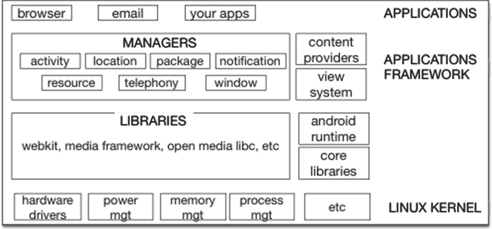
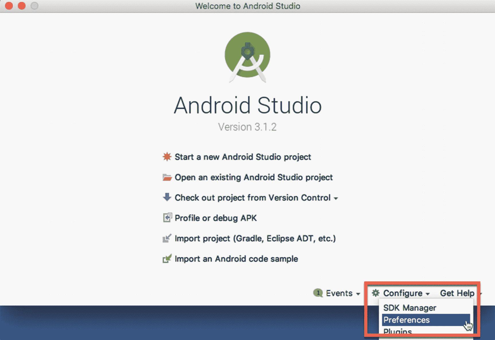
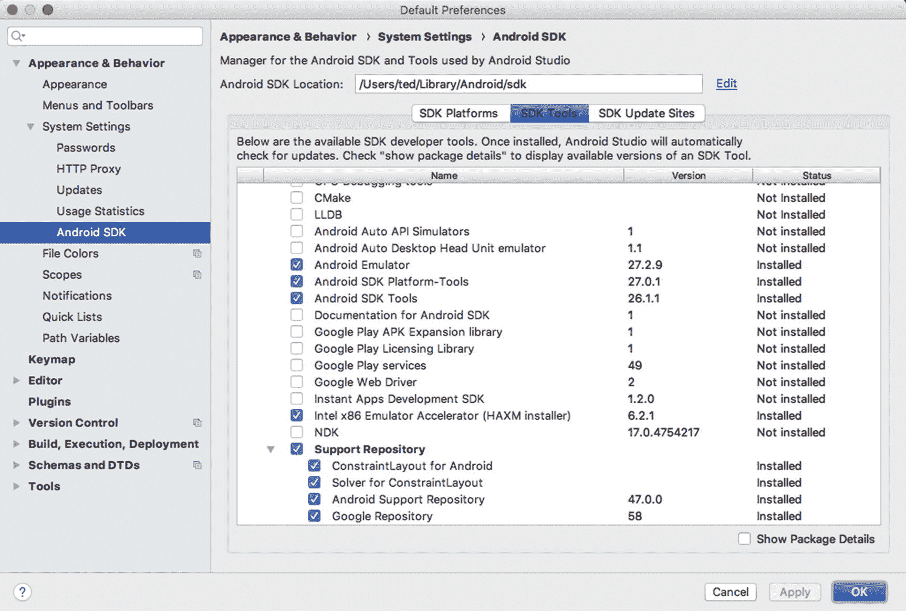
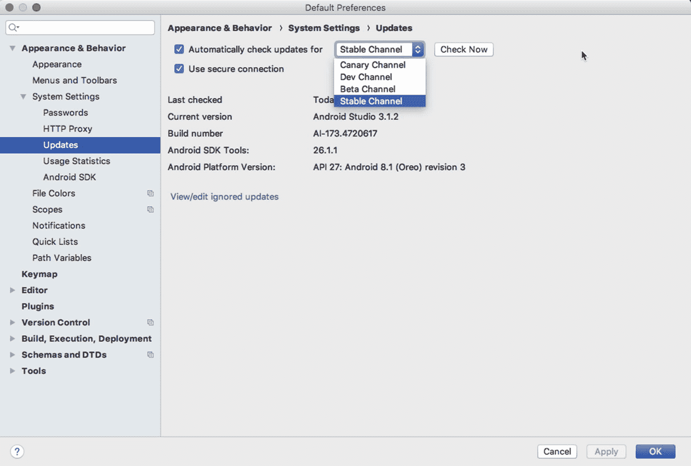

# 8.Android Studio 简介和设置

*我们将介绍的内容:*

*   Android 概述

*   历史

*   工具作业

*   设置

对于不同的人来说，Android 可能意味着很多事情，但是既然你拿着这本书，我想你会对 Android 中适合开发者的部分感兴趣。Android 是一个由操作系统、软件库、应用框架、软件开发工具包、预建应用和参考设计组成的平台。平台及其发展生态系统都随着时间的推移而演变。

在这一章，我们将看看 Android 的历史和架构。我们还将讨论 Android Studio 以及如何设置它。

## 历史

2003 年的某个时候，安迪·鲁宾创立了一家名为 Android Inc .的公司，Android 由此诞生。当时，谷歌已经在支持安卓公司，但还没有拥有它。谷歌在 2005 年的某个时候收购了安卓公司；然后在 2007 年，开放手机联盟诞生了，Android OS 正式*开源*。在这段时间里，Android 还没有达到 1.0 版本，还远未成为主流。Android 在 2008 年达到了 1.0 版本——当时甜点的名字还没有成为文化的一部分，但用不了多久它们就会成为文化的一部分。

接下来的两年，从 2009 年到 2010 年，见证了一股快速发行的洪流:纸杯蛋糕、甜甜圈、甜甜圈、圣克莱尔和姜饼版本在此期间发行。

2011 年是一个重要的里程碑，因为在那之前，Android 操作系统仍然局限于手机。Honeycomb 是 Gingerbread 的继任者，是第一个安装在平板电脑上的 Android 版本。Honeycomb 引起了一些争议，因为谷歌没有立即开放源代码。

表 [8-1](#Tab1) 显示了 Android 历史的简要总结。

表 8-1

安卓的历史

<colgroup><col class="tcol1 align-left"> <col class="tcol2 align-left"></colgroup> 
| **2003 年** | 由安迪·鲁宾创建并得到谷歌支持的安卓公司诞生了 |
| **2005 年** | 谷歌收购了安卓公司。 |
| **2007 年** | Android 是官方开源的。谷歌将其所有权移交给了开放手机联盟(OHA) |
| **2008 年** | 发布了 1.0 版本 |
| **2009 年** | 发布了版本 1.1、1.5(纸杯蛋糕)、1.6(甜甜圈)和 2.0(艾克蕾尔) |
| **2010 年** | 版本 2.2 (Froyo)和 2.3 (Gingerbread)已经发布 |
| **2011 年** | 发布了 3.0 版(蜂巢)和 4.0 版(冰淇淋三明治) |
| **2012 年** | 版本 4.1 (Jellybean)发布了 |
| **2013 年** | 发布了 4.4 版(KitKat) |
| **2014 年** | 5.0-5.1 版本(棒棒糖)发布；Android 变成了 64 位 |
| **2015 年** | 6.0 版本(棉花糖)发布 |
| **2016 年** | 发布了 7.0-7.1.2 版本(牛轧糖) |
| **2017 年** | 版本 8(奥利奥)发布 |
| **2018** | 版本 9 (Android P，beta)发布 |

## 体系结构

Android 最明显的部分，至少对开发者来说，是它的操作系统。操作系统是一个复杂的东西，但在大多数情况下，它是用户和硬件之间的桥梁。这太简单了，但对我们的目的来说已经足够了。我所说的“用户”并不是指最终用户或个人。我的意思是应用，程序员创造的一段代码，就像文字处理器或电子邮件客户端。

以电子邮件应用为例:当你在键盘上键入每个字符时，该应用需要与硬件通信，以便消息到达你的屏幕和硬盘，并最终通过你的网络发送到云端。这是一个比我在这里描述的更复杂的过程，但这是基本的想法。最简单地说，操作系统做三件事:

1.  代表应用管理硬件

2.  为网络、安全、内存管理等应用提供服务。

3.  管理应用的执行；这是允许我们几乎同时运行多个应用的部分

图 [8-1](#Fig1) 展示了 Android 平台的逻辑架构。



图 8-1

Android 的逻辑架构

图的最底层是 Linux 内核。它负责与硬件接口，以及其他事情。它还负责各种服务，如内存管理和进程执行。

Linux 是一个非常稳定的 OS，并且相当普遍；你会发现这个操作系统被广泛使用。它可以在小到手表，大到服务器农场的东西上运行。Android 内部有一个嵌入式 Linux，处理硬件接口和其他一些内核功能。

在 Linux 内核之上是低级库，如 SQLite、OpenGL 等。这些不是 Linux 内核的一部分，但仍然是低级的，因此，大部分是用 C/C++编写的。在同一层面上，你会发现 android 运行时(android 类库+ dalvik 虚拟机)，这是 Android 应用运行的地方。

接下来是应用框架层。它位于底层库和 android 运行时之上，因为它需要这两者。这是我们作为应用开发人员将与之交互的层，因为它包含了我们编写应用所需的所有库。

最后，最上面是应用层。这是我们所有应用的所在地，包括我们编写的应用和预构建的应用。应该指出的是，与我们将要编写的应用相比，设备自带的预构建应用没有任何特权。如果你不喜欢手机的电子邮件应用，你可以自己编写并替换它。安卓就是这样民主的。

## Android Studio IDE

为 Android 开发应用并不总是像今天这样方便。当 Android 1.0 在 2008 年发布时，开发人员通过开发工具包获得的只是一堆命令行工具和 Ant 构建脚本。如果你已经习惯了使用 Vim、Ant 和其他命令行工具来构建应用，这并没有那么糟糕，但是很多开发人员并不习惯这样。缺少代码提示、项目设置和集成调试等 IDE 功能在某种程度上是入门的障碍。

令人欣慰的是，Eclipse IDE 的 android 开发工具(ADT)也是在 2008 年发布的。Eclipse 过去是，现在仍然是许多 Java 开发人员最喜欢的 IDE 选择。很自然地，它也将成为 Android 开发者的首选 IDE。

从 2009 年到 2012 年，Eclipse 一直是开发 IDE 的选择。android SDK 在结构和范围上也经历了重大和渐进的变化。2009 年，SDK 管理器发布；我们用它来下载工具、单个 SDK 版本和可以用于模拟器的 android 图像。2010 年，发布了针对 ARM 处理器和 X86 CPUs 的附加映像。

2012 年是重要的一年，因为 Eclipse 和 ADT 最终被捆绑在一起，这是一件大事，因为在那之前，开发人员必须分别安装 Eclipse 和 ADT，安装过程并不总是顺利的。因此，将两者捆绑在一起使得开始 Android 开发变得更加容易。2012 年也值得纪念，因为它标志着 Eclipse 成为 android 主流 IDE 的最后一年。

2013 年 Android Studio 发布；可以肯定的是，它仍然处于测试阶段，但是不祥之兆已经很明显了。它将成为 Android 开发的官方 IDE。Android Studio 基于 JetBrains 的 IntelliJ。IntelliJ 是一个商业 Java IDE，也有一个社区(非付费)版本。这个版本将作为 Android Studio 的基础。

有相当多的 JVM 语言，但 Java 一直是 Android 开发的首选语言——直到 2017 年，谷歌 I/O 宣布 Android 将对 Kotlin 提供一流的支持。Android Studio 3 (AS3)自动支持 Kotlin。

## 设置

JDK 是 Android Studio 的必备软件，但是因为我们已经在第 [1](01.html) 章中介绍了 JDK 的安装，我们将继续安装 AS3。安装程序可用于 macOS、Windows 和 Linux 下载页面位于[`http://bit.ly/getas3`](http://bit.ly/getas3)—该页面应该能够检测到您正在使用的操作系统，并将为您显示合适的安装程序。您将被要求同意一些条款和条件，然后才能继续下载。阅读它，理解它，并同意它，这样你就可以继续下去。之后，AS3 安装程序将以压缩文件的形式下载。

对于 macOS，您需要执行以下操作:

1.  解压缩安装程序的压缩文件。

2.  将应用文件拖到应用文件夹中。

3.  推出 AS3。

4.  AS3 会提示你导入一些设置，如果你有以前的安装。您可以导入它，这是默认选项。

### 注意

如果您已经安装了 Android Studio，您可以继续使用该版本，并安装预览版。AS3 可以和你现有版本的 Android Studio 共存；其设置将保存在不同的目录中。

对于 Windows，您需要执行以下操作:

1.  解压缩安装程序文件。

2.  将解压后的目录移动到您选择的位置，例如*C:\ Users \ my name \ AndroidStudio*

3.  向下钻取到 *AndroidStudio* 文件夹；在里面，你会发现 studio64.exe 的*。这是您需要启动的文件。为这个文件创建一个快捷方式是个好主意——如果你右击 studio64.exe 并选择“*固定到开始菜单”，*你可以从 Windows 开始菜单中使用 AS3。或者，你也可以把它钉在任务栏上。*

Linux 安装需要做的工作比简单地双击并遵循安装程序提示要多一些。在 Ubuntu 及其衍生产品的未来版本中，这可能会发生变化，变得像 Windows 和 macOS 一样简单和无摩擦，但现在，我们需要做一些调整。Linux 上的额外活动主要是因为 AS3 需要一些 32 位库和硬件加速。

### 注意

本节中的安装说明适用于 64 位 Ubuntu 和其他 Ubuntu 衍生产品(例如，Linux Mint、Lubuntu、Xubuntu、Ubuntu MATE 等)。).我选择这个发行版是因为我认为它是一个非常常见的 Linux 版本；因此，本书的读者将会使用该发行版。

如果你运行的是 64 位版本的 Ubuntu，你需要安装一些 32 位的库，这样 AS 才能正常工作。

要开始获取 Linux 的 32 位库，请在终端窗口上运行以下命令:

```java
sudo apt-get update && sudo apt-get upgrade -y
sudo dpkg --add-architecture i386
sudo apt-get install libncurses5:i386 libstdc++6:i386 zlib1g:i386

```

所有准备工作完成后，您需要执行以下操作:

1.  解压下载的安装文件。您可以使用命令行工具或 GUI 工具来解包文件。例如，您可以右键单击该文件，然后选择“*在此解包”*选项，如果您的文件管理器有该选项的话。

2.  解压文件后，将文件夹重命名为 *AndroidStudio。*

3.  将文件夹移动到您拥有读取、写入和执行权限的位置。或者，你也可以把它移到 */usr/local/AndroidStudio。*

4.  打开一个终端窗口，进入 AndroidStudio */bin* 文件夹，然后运行*。/studio.sh.*

5.  第一次启动时，AS3 会问你是否要导入一些设置。如果您已经安装了以前版本的 Android Studio，您可能需要导入这些设置。

## Android Studio 配置

如果这是您第一次安装 AS3，您可能希望在开始编码工作之前先配置一些东西。在这一部分，我将带您了解以下内容:

*   获得更多我们需要的软件，以便创建针对特定版本 Android 的程序

*   确保我们拥有所有需要的 SDK 工具；并且可选地

*   改变我们获取 AS3 更新的方式

如果你还没有启动 AS3，那么点击“配置”，如图 [8-2](#Fig2) 所示。从下拉列表中选择“首选项”。



图 8-2

从 AS3 开始屏幕转到首选项

您将看到“首选项”窗口，如图 [8-3](#Fig3) 所示。在窗口的左侧，单击“Android SDK”


图 8-3

SDK 平台

当您进入 SDK 窗口时，启用“显示包细节”选项，这样您就可以看到每个 API 级别的更详细的视图。我们不需要下载 SDK 窗口中的所有内容。我们将只得到我们需要的物品。

SDK 级别或平台号是 Android 的特定版本。Android 8 或“奥利奥”是 API 等级 26 和 27，牛轧糖是 API 等级 24 和 25。你不需要记住平台号，至少不再需要，因为 AS3 用相应的 Android 昵称显示平台号。

如果你愿意，你可以下载“牛轧糖”和“奥利奥”;这些是 API 等级 24、25、26 和 27。出于我们的目的，请下载“棉花糖”——它是 API 等级 23。这是我们在整本书中最常使用的版本。请确保在下载平台的同时，您还将下载“Google APIs 英特尔 x86 Atom_64 系统映像”当我们测试运行我们的应用时，我们将需要这些。

选择一个 API 级别现在可能没什么大不了的，因为在这一点上，我们只是在练习应用。当您计划向公众发布您的应用时，您可能不会轻易做出这个选择。为你的应用选择一个最低的 SDK 或 API 级别将决定有多少人能够使用你的应用。在撰写本文时，所有安卓设备中有 25%在使用“棉花糖”，22%在使用“牛轧糖”，4%在使用“奥利奥”。这些统计数据来自开发者的仪表板页面。[安卓。com](http://android.com) 。不时检查这些统计数据是个好主意；你可以在这里找到 [`http://bit.ly/droiddashboard`](http://bit.ly/droiddashboard) 。

回到我们的配置，当您对您的选择满意时，启用您想要下载的 API 和图像的复选框，然后单击“SDK 工具”——它就在“SDK 平台”按钮的旁边，如图 [8-4](#Fig4) 所示。



图 8-4

SDK 工具

你通常不需要改变这个窗口上的任何东西，但是检查一下你是否有工具也无妨，如表 [8-2](#Tab2) 所示，标记为“已安装”

表 8-2

SDK 工具

<colgroup><col class="tcol1 align-left"> <col class="tcol2 align-left"></colgroup> 
| 

工具

 | 

描述

 |
| --- | --- |
| Android SDK 构建工具 | 这包含了像 adb 这样的重要工具，它将帮助我们进行诊断和调试；sqlite3，我们在创建使用数据库的应用时可以使用它；加上一些其他工具。 |
| Android SDK 平台工具 | 这包含了像 adb 这样的重要工具，它将帮助我们进行诊断和调试；sqlite3，我们在创建使用数据库的应用时可以使用它；加上一些其他工具。 |
| Android SDK 工具 | 这包括基本的 Android 工具，如 ProGuard。您不需要深入研究这些工具的细节(目前)。只要确保这个框被选中，我们就可以开始了。 |
| 安卓模拟器 | 你肯定会用这个。这是一个设备仿真工具。我们将使用它在虚拟设备中测试我们的应用。 |
| 支持知识库 | 如果你想写针对 Android Wear，Android TV，或者 Google Cast 的代码，你要下载这个。它还包含本地 Maven 资源库以支持库。支持库还允许您在旧版本的 Android 上使用新功能。 |
| HAXM 安装程序 | 如果你使用的是 macOS，或者是搭载英特尔处理器的 PC，你可以使用这个。它是 Android 模拟器的加速器。 |

### 注意

如果你在 Linux 平台上，你不能使用 HAXM，即使你有一个 Intel 处理器。KVM 将用于 Linux，而不是 HAXM。

一旦你对你的选择满意，点击“确定”按钮开始下载软件包。

我们要做的最后一项配置检查是“更新通道”它在同一个“偏好设置”窗口中。点击右侧的“更新”项，显示“更新”设置，如图 [8-5](#Fig5) 所示。



图 8-5

更新

AS3，就像任何 Android Studio 安装一样，默认配置为从您最初下载安装程序的渠道获取更新。因为我们从稳定的渠道下载了安装程序，所以默认情况下它会从那个渠道获得更新。您可以将频道切换到以下四个频道之一:

*   金丝雀频道:这是最新版本，每周都会更新。您不希望将它用于生产代码。

*   开发频道:就像金丝雀频道，但更稳定一些。你还是不想用这个做生产。

*   **Beta 通道:**这包含发布候选。在反馈到稳定的渠道之前，开发人员基本上都在等待反馈。

*   **稳定渠道:**这是官方稳定发布，适合生产工作。

## 硬件加速

在你编写应用的时候，不时地测试和运行它是很有用的，这样可以得到即时的反馈，并发现它是否像预期的那样运行，或者它是否在运行。为此，您将使用物理或虚拟设备。每个选项都有其利弊，你不必选择一个而不是另一个。事实上，你最终将不得不使用这两个选项。

Android 虚拟设备或 AVD 是一个仿真器，你可以在其中运行你的应用。在模拟器上运行有时会很慢——这就是谷歌和英特尔开发 HAXM 的原因。这是一个模拟器加速工具，让测试你的应用变得更容易忍受。这对开发者来说绝对是福音。也就是说，如果您使用的是支持虚拟化的英特尔处理器，并且您没有使用 Linux。但是，如果你不够幸运，没有落到馅饼的那一部分，也不用担心；在 Linux 中有很多方法可以实现模拟器加速，我们将在后面看到。

macOS 用户可能最容易拥有，因为 HAXM 是自动随 AS3 安装的。他们不需要做任何事情就可以得到它 AS3 安装程序会为他们做好准备。

Windows 用户可以通过以下方式获得 HAXM:

*   从 [`https://software.intel.com/en-us/android`](https://software.intel.com/en-us/android) 下载。像安装其他 Windows 软件一样安装它，双击它，然后按照提示进行操作。

*   或者，你可以通过 AS3 的 SDK 管理器获得 HAXM 这是推荐的方法。

对于 Linux 用户，推荐的软件是 KVM。KVM(基于内核的虚拟机)是一个用于 Linux 的虚拟化解决方案。它包含虚拟化扩展(英特尔 VT 或 AMD-V)。

要获得 KVM，我们需要从回购中提取一些软件。但是在做其他事情之前，你需要做两件事:

1.  确保在 BIOS 或 UEFI 设置中启用了虚拟化。关于如何获得这些设置，请查阅您的硬件手册。它通常包括关闭电脑，重新启动电脑，并在听到系统扬声器的声音时按下中断键，如 F2 或 DEL，但正如我所说的，请查阅您的硬件手册。

2.  一旦您完成了更改，并重新启动到 Linux，请检查您的系统是否可以运行虚拟化。这可以通过从终端`egrep –c '(vmx|svm)' /proc/cpuinfo`运行以下命令来完成。如果结果是一个大于零的数字，这意味着您可以继续安装。

要安装 KVM，在终端窗口上键入命令，如清单 [8-1](#PC2) 所示。

```java
sudo apt-get install qemu-kvm libvirt-bin ubuntu-vm-builder bridge-utils
sudo adduser your_user_name kvm
sudo adduser your_user_name libvirtd

Listing 8-1Commands to Install KVM

```

您可能需要重新启动系统才能完成安装。

## 章节总结

*   Android 是完整的开发平台。它包括操作系统、应用框架、应用、软件开发套件、预构建的应用和参考设计

*   Android 的发布周期大约是 12 个月；我们每年都有新版本。

*   AS3 自动包含对 Kotlin 的支持。

*   仿真器的硬件加速是你可能想要研究的东西。它将在开发和测试过程中节省大量的等待时间。

下面是下一章的内容:

*   一个安卓应用里面有什么？我们将探索应用的组成部分；Android 称之为组件，有好几个。我们将逐一查看。

*   我们将创建我们的第一个项目。我们将逐步介绍如何在 Android Studio 中启动并运行一个简单的项目。

*   我们将构建一个仿真器——它是用来测试应用的。Android devs 称之为 AVD，是 Android 虚拟设备的简称。

*   我们将看看 Android Studio IDE 的某些部分。了解你的工具的各个角落总是好的。