第七章

设备测试

如果评论对你很重要，那么理想情况下，你会想在离评论者的机器很近的地方测试你的 Android 应用，看看它是否能正常工作。有各种各样的事情可能会出错:不同版本的 Android 操作系统上的奇怪行为，没有正确处理硬件或软件按钮，没有足够流畅的设计来处理大小设备屏幕，没有在 Wi-Fi 上进行测试，没有考虑不同运营商之间的网络速度差异。不胜枚举。

OpenSignal 在 2013 年 7 月(`http://opensignal.com/reports/fragmentation-2013/`)发布了一份报告，称运行在八种不同 Android 操作系统上的 Android 设备数量不到 12000 台，而且这个数字显然还在增长。因此，现在有如此多的设备和配置，测试所有可能的变化是不现实的。

过去，在一小部分手机样本和一小部分平板电脑样本上进行测试是一种合理的策略，以获得所有组合的合理组合。但现在有这么多种类，将这些设备分为手机、平板电脑甚至平板电脑类别对于我们的测试来说太简单了。

或许，如果我们回到 OpenSignal 报告，按品牌查看使用统计数据，我们可能会取得更大的成功。图 7-1 中的图表告诉我们，超过 50%的设备是由三星制造的。

[图 7-1](#_Fig1) 。安卓品牌碎片化

仔细观察 OpenSignal 数据,我们发现 Galaxy S4、SIII、SII、S、Y 以及 Note 和 Note II 以及谷歌 Nexus 占据了大约 20%的市场份额。但这仍然只是可用设备的 20%。

而不同的安卓操作系统呢？我们可能还想在多个 Android 操作系统上进行测试。在 2013 年 11 月 1 日之前的七天里，谷歌的不同 Android 操作系统登陆谷歌 Play 商店的图表可以在[图 7-2](#Fig2) 中看到。

[图 7-2](#_Fig2) 。使用 Google Play 的 Android 操作系统

至少你的应用应该支持冰淇淋三明治和果冻豆，这两种产品总共拥有 72%的 Android 用户。有一个强有力的论据支持姜饼，它在 Android 用户中占 26.3%。然而，支持 Gingerbread 甚至 Froyo 需要一些开发权衡，比如在这些早期版本中寻找支持动作栏的方法。早期版本的手机通常也有更少的 CPU 能力和内存，并可以完全不同的行为。

选择策略

我们知道我们不会在 12，000 台设备上进行测试，所以我们需要制定一个策略来确定我们的用户在发布应用之前可能会遇到的问题。我们可以将这些选项分为以下几个选项:

*   使用我们的三星/Nexus 短列表中的设备进行测试。
*   使用各种通用屏幕尺寸的设备进行测试。
*   使用运行各种主要 Android 操作系统的设备进行测试。
*   找到特定的目标市场，比如 Kindle 或 Nook 用户。
*   使用 Android 模拟器测试更多设备。
*   使用制造商的仿真器测试更多设备。
*   使用第三方测试服务。
*   向制造商借设备。
*   做人群测试。

我已经在前一节中讨论了设备的简短列表，如果这符合您的预算和需求，那么像这样简单的东西可能非常适合您。但它并没有完全占领 80/20 的市场；更像是 20/80。当然，它总是一个移动的目标，所以对大多数人来说，这是行不通的。如果你幸运的话，你可能会将它限制在冰淇淋三明治及以上，或者只限于平板电脑，或者如果你真的很幸运，只限于特定的目标市场，如 Kindle 平板电脑。

或者，您可以购买小、普通、大和超大屏幕尺寸以及低、中、高和超高密度的设备。这些可以仔细选择，以便他们运行不同的 Android 操作系统，以获得更好的测试横截面。如果这是您的方法，您可能想尝试使用 Android 模拟器，它正好提供了这样的组合。我们将在下一节看到，您还可以下载额外的仿真器来测试更多的设备。还有其他第三方模拟器；有些是免费的(三星)，有些是付费服务(Perfecto Mobile)。

制造商也意识到了这些问题，一些制造商，如 LG，允许开发者短期出租设备。

最后，还有一些人群测试选项，如 TestFairy，你的社交媒体朋友和家人在他们的 Android 设备上进行测试，TestFairy 组织测试，这样你就可以看到用户测试的视频。

你需要一些标准来帮助你做决定，例如:

*   预算
*   测试自动化
*   支持的操作系统
*   支持的设备

在本章中，我们将更详细地探讨这些选项，以便您在形成自己的标准后能够做出明智的决定。

仿真器

如果你像大多数开发人员一样，你的预算可能会延伸到最多购买或借用半打设备，这接近于我们最初的场景。在有限的预算下，如果你想在更多的设备上测试，总有 Android 模拟器，如图[图 7-3](#Fig3) 所示。

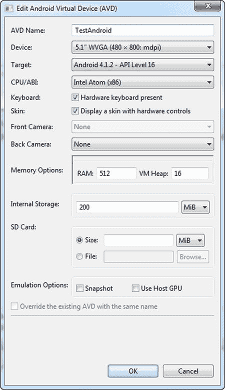

[图 7-3](#_Fig3) 。Android 虚拟设备(AVD)模拟器

Android 虚拟设备管理器(AVD) 配有以下默认设备:

*   Nexus 4
*   Nexus 10
*   Nexus 7
*   银河连锁公司
*   Nexus
*   Nexus One
*   10.1 WXVGA(平板电脑)
*   7.0 WSVGA(平板电脑)
*   5.4 FWVGA
*   5.1 WVGA
*   4.7 WXGA
*   4.65 720 便士
*   4.0 WVGA
*   3.7 FWVGA
*   3.7 WVGA
*   3.4 瓦 VGA
*   3.3 瓦 VGA
*   3.2 QVGA
*   3.2 英寸 wvga 滑块
*   2.7 QVGA 滑块
*   2.7 QVGA

正如你所看到的，它是谷歌 Nexus 设备和一些旧的通用设备的混合物。因为模拟器也是众所周知的非常慢和低效的测试方式，所以除了一些初始的 alpha 测试之外，它似乎没有太大的用处。

但是您可以采取一些简单的步骤来扩展 AVD，使其更加有用:

*   安装英特尔 x86 凌动系统映像
*   创建您自己的设备
*   安装制造商附加组件
*   在 Jenkins 中使用多个仿真器进行测试

安装英特尔 x86 凌动系统映像

Android 模拟器可能需要 3-5 分钟甚至更长时间才能启动，这一直是 Android 开发人员感到沮丧的原因。如果您在英特尔 PC 或 Mac 上运行，那么安装英特尔 x86 Atom 系统映像将使仿真器在 1-2 分钟内启动。[图 7-4](#Fig4) 显示了如何从 Android SDK 管理器安装英特尔加速器。注意，它必须为每个 Android API 级别安装。

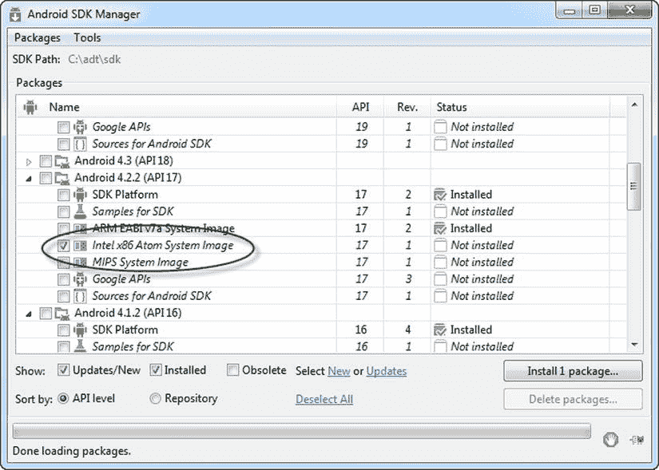

[图 7-4](#_Fig4) 。安装英特尔 x86 凌动系统映像

安装完成后，系统映像将作为 AVD 中 CPU/ABI 的下拉选项出现，正如您在图 7-4 中的早期 AVD 设置屏幕中看到的那样。

创建您自己的设备

虽然结果没有设备皮肤，但创建自己的设备模拟器版本非常简单。例如，采取以下步骤创建一个银河 S4 设备。(S4 的尺寸来自维基百科，`http://en.wikipedia.org/wiki/Samsung_Galaxy_S4`)。)

1.  打开 AVD。
2.  单击设备定义选项卡。
3.  单击新设备。
4.  Enter the details shown in [Figure 7-5](#Fig5).

    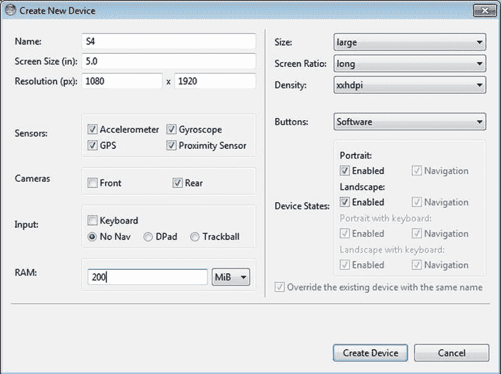

    [图 7-5](#_Fig5) 。创建 S4 设备

5.  单击创建设备。
6.  Click on the Android Device Definitions, as shown in [Figure 7-6](#Fig6).

    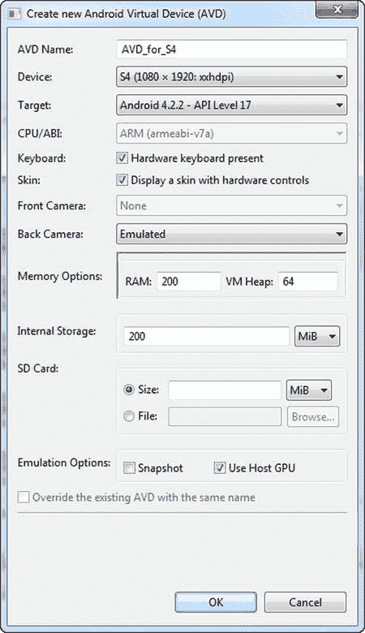

    [图 7-6](#_Fig6) 。创建 S4 AVD

7.  选择 S4，它现在在 AVD 设备下拉列表中可用。
8.  选择 API 等级 17。
9.  选择英特尔凌动 CPU。
10.  选中使用主机 GPU。
11.  再次单击创建设备。

现在，虽然模拟器只是真实事物的复制品，但如果你启动你的应用，它将适合屏幕，并以与 S4 相同的方式运行。

下载制造商的 AVDs

创建你自己的 avd 并不总是必要的，因为许多 Android 设备制造商提供了他们自己的 avd 甚至皮肤供你下载和安装。例如，亚马逊提供了许多 Kindle 设备定义。采取以下步骤安装 Kindle 设备:

1.  打开 Android SDK 管理器
2.  单击工具➤管理附加组件站点。
3.  单击用户定义的站点选项卡。
4.  Click on New and enter `http://kindle-sdk.s3.amazonaws.com/addon.xml`, as shown in [Figure 7-7](#Fig7).

    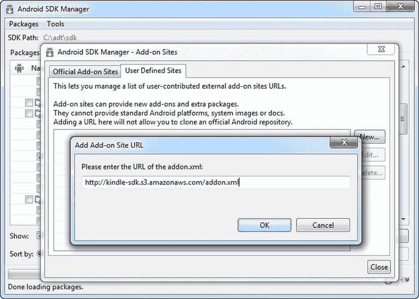

    [图 7-7](#_Fig7) 。用于附加 avd 的用户自定义站点

5.  Back in the Android SDK Manager, add the Kindle Fire HD 7", HDX 7" and HDX 8.9" (3rd Generation) packages; see [Figure 7-8](#Fig8).

    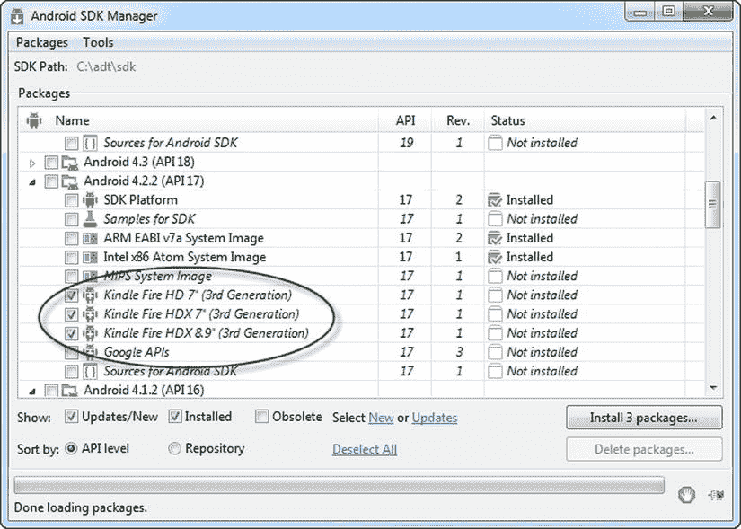

    [图 7-8](#_Fig8) 。在 SDK 管理器中添加 Kindle Fire 软件包

6.  Scroll down to the Extras section and add the Amazon AVD Launcher and the Kindle Fire Device Definitions, as shown in [Figure 7-9](#Fig9).

    

    [图 7-9](#_Fig9) 。在 SDK 管理器中添加 Kindle 启动器包

7.  安装软件包。

你现在可以在 Android 虚拟设备管理器中创建一个 Kindle AVD，或者使用亚马逊 AVD 启动器，你可以在`sdk/extras`文件夹中找到它；参见[图 7-10](#Fig10) 。

[图 7-10](#_Fig10) 。亚马逊 AVD 启动器

图 7-11 显示了一个 Kindle HDX AVD 的例子。

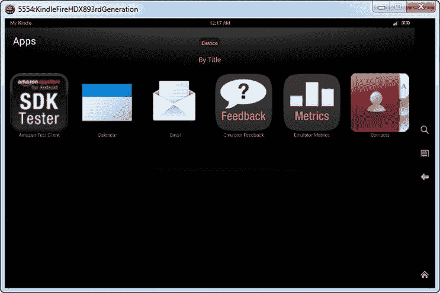

图 7-11 。hdx avd kindle(kindle hdx avd)

[表 7-1](#Tab1) 列出了一些提供仿真器附件的设备制造商。

[表 7-1](#_Tab1) 。安卓附加设备提供商

| 

制造商

 | 

统一资源定位器

 |
| --- | --- |
| 索尼 | `http://dl-developer.sonymobile.com/sdk_manager/Sony-Add-on-SDK.xml` |
| 亚马孙 | `http://kindle-sdk.s3.amazonaws.com/addon.xml` |
| 角落 | `http://su.barnesandnoble.com/nook/sdk/nook_hd_addon.xml` |
| 常简称为 HTC 或宏达电 | `http://dl.htcdev.com/apis/addon.xml` |

用 Jenkins 自动化仿真器测试

到目前为止，您应该能够为您认为需要的任意多的目标设备创建或安装 avd。[表 7-2](#Tab2) 提供了一个 avd 列表，这样你就可以很好的覆盖当前的 Android 市场；它来自另一个 Android AVD 库，这次是在`https://github.com/j5at/AndroidAVDRepo`。

[表 7-2](#_Tab2) 。仿真器测试的 avd 列表

| 

智能手机

 | 

药片

 |
| --- | --- |
| 谷歌的 Nexus One | 亚马逊的 Kindle Fire |
| 谷歌的 Nexus S | 亚马逊的 Kindle Fire HD (7 英寸和 8.9 英寸) |
| 谷歌的 Galaxy Nexus | 三星的 Galaxy 平板电脑 |
| 谷歌的 Nexus 4 |  |
| G1 又名梦想，由宏达电 |  |
| 机器人(原创)，摩托罗拉 |  |
| 机器人 X，作者摩托罗拉 |  |
| 摩托罗拉的 Droid Razr Maxx HD |  |
| 三星的银河 S2 |  |
| 三星的银河 S3 |  |
| 三星的银河 S4 |  |

现在创建这些 avd 可以让你在当前最流行的设备上测试你的 Android APK。然而，手动这样做真的很耗时，而且随着新的 KitKat 手机的发布，列表也会不断变化。我们需要一种自动化测试的方法，以确保我们正在测试我们对 APK 所做的任何更改。

我们在第四章第一次使用 Jenkins，同时实现了敏捷的 Android 技术。在这一章中，我们将使用它来自动化我们的构建，使用尽可能多的仿真器，因为 Jenkins 将允许您为多个仿真器设置一个变量。

采取以下步骤来使用多个模拟器自动化构建。

1.  Create a new job in Jenkins, and make it a multi-configuration project, as shown in [Figure 7-12](#Fig12).

    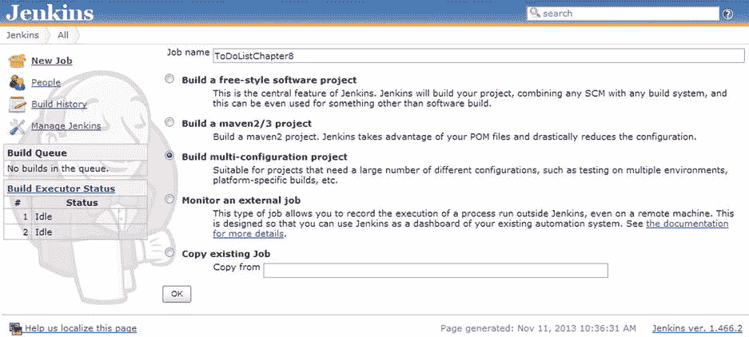

    [图 7-12](#_Fig12) 。多配置詹金斯项目

2.  添加源代码管理和构建触发器，如[第 4 章](4.html)所示。
3.  在配置矩阵下，添加一个轴，并将其命名为 AVD_Name。
4.  Enter the AVDs you want to test, as shown in [Figure 7-13](#Fig13).

    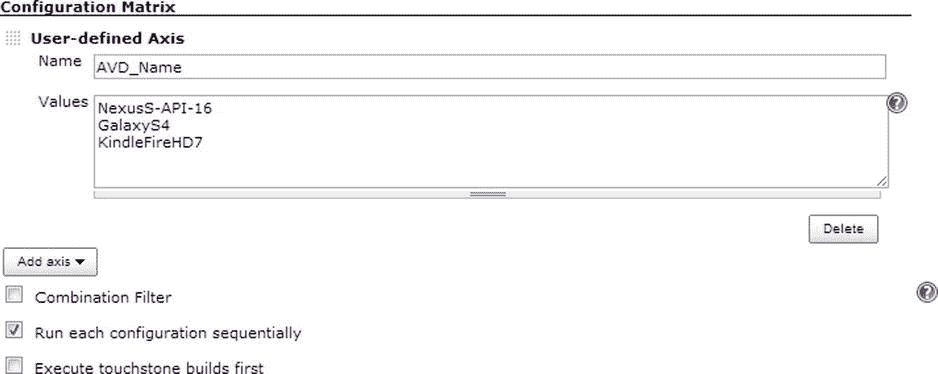

    [图 7-13](#_Fig13) 。向配置矩阵添加多个仿真器

5.  选中按顺序运行每个配置框。
6.  In the Run Existing Emulator section, add the AVD Name as ${AVD_NAME} so that Jenkins can do the substitution correctly; see [Figure 7-14](#Fig14).

    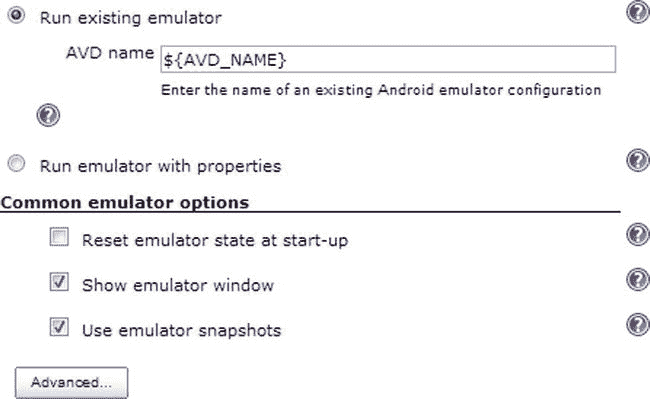

    [图 7-14](#_Fig14) 。添加仿真器变量

7.  Add the Calabash and Build steps as shown in [Chapter 4](4.html).

    当 Jenkins 运行下一个构建时，它将显示测试是否通过了每个不同的仿真器，如图 7-15 所示。

    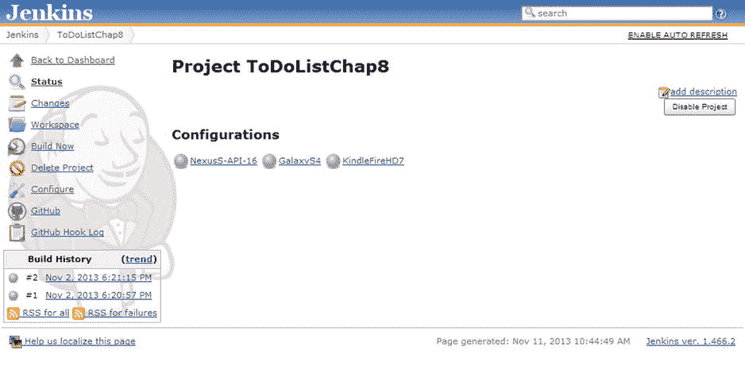

    [图 7-15](#_Fig15) 。多个仿真器测试结果

硬件测试

许多人不想在模拟器上测试，而更喜欢在真实设备上测试。无论仿真器软件有多好，还有许多其他因素可能会影响您的应用在仿真器无法测试的领域中的性能，例如您的应用在不同运营商上的行为，或者您是否需要作为应用的一部分进行实际呼叫。

如果您必须在真实硬件上进行测试，除了简单地购买您需要的所有设备之外，还有一些选项可供选择:

*   使用第三方测试服务。
*   向制造商借设备。
*   做人群测试。

第三方测试服务

有许多在线测试服务。这些网站有些是免费的，有些是付费服务。

正如您在本章前面所看到的，市场上的大多数设备都是由三星制造的。他们不提供附加仿真器，但是在云中提供他们自己的仿真器作为免费服务，见`http://developer.samsung.com/remotetestlab/rtlDeviceList.action`和[图 7-16](#Fig16) 。

[图 7-16](#_Fig16) 。三星远程测试实验室

像所有的云测试服务一样，它首先检查一个设备，然后将 APK 上传到远程服务器；然后设备的视频输出被投射到你的远程模拟器上。然而，基本开发人员帐户的测试仅限于使用基本免费帐户每天在 10 台设备上进行测试。

目前付费服务领域的领跑者是 Perfecto Mobile，但还有许多其他公司。Perfecto 还为 Jenkins 提供了一个插件，允许您在多种设备上自动进行 APK 测试。

从制造商处借用设备

制造商知道，在测试 Android 设备时，设备碎片即使不是问题，也是一个问题。大多数都有自己的开发者网站，试图缓解这个问题。虽然索尼和 Kindle 已经创建了仿真器插件，三星也有自己的仿真器，但 LG 采取了不同的方法，将借给你一个物理设备供你自己测试。目前设备如下，您可以在`http://developer.lge.com`注册:

*   G2 VS980(威瑞森)
*   G2 D800(美国电话电报公司)
*   Optimus G Pro E980(美国电话电报公司)
*   颁布 VS890(威瑞森)
*   擎天柱 P769 (T-Mobile)

人群测试

解决碎片化的一个更具创新性的解决方案是使用人群测试。开发人员向他们的朋友和家人乞讨、借用和窃取测试设备是很常见的。然而，因为没有人愿意放弃他们的手机，所以这种策略除了非常特别的测试之外没有任何作用。TestFairy 等公司的人群测试以一种更有组织的方式来组织这种测试。apk 被发送到一系列电子邮件中，或者 LinkedIn 或脸书的链接中，测试人员与应用的互动被录制成视频，以便日后查看。

摘要

这一章已经展示了一些方法，你可以解决在 Android 设备的巨大碎片世界中测试你的应用的问题，而不需要让你自己破产去购买 12，000 或更多不同的硬件。通过使用制造商 avd 和第三方设备测试服务，巧妙锁定设备子集，您可以大大扩大设备测试的覆盖范围。