第八章

网络服务

大多数 Android 应用程序都处理用户生成或消费的数据。在大多数情况下，数据量太大，无法存储在本地设备上，因此我们需要一种方法将数据保存在其他地方并进行检索。Web 服务通过在我们的 Android 应用程序使用的远程服务器上公开应用程序编程接口(API)来提供这种功能。在本章中，你将学习如何访问这些 API，以及如何安全地构建自己的 web 服务。但是首先你需要从总体上理解 web 服务。在本章中，我们将重构我们的 ToDo Android 应用程序，将数据存储从本地 SQLite 数据库转移到云中托管的 web 服务。

Web 服务类型

两种最流行的 web 服务架构是简单对象访问协议(SOAP) 和表述性状态转移(REST) 。这些架构以不同的方式公开远程 API，并且都有各自的优点和缺点。一般来说，您的应用程序可能使用的大多数服务都属于这两类。

休息还是肥皂？

在移动设备兴起之前，web 服务通常基于 SOAP，这种类型的服务架构通常被称为面向服务的架构(SOA)。SOAP web 服务使用远程过程调用(RPC)架构，其中 SOAP 消息(或信封)通过单个 URI(统一资源标识符)从客户端传递到服务器。SOAP 信封通常是一个 XML 文档，包含要执行的函数名、必要的参数和安全细节。服务器执行请求的函数，创建一个新的信封，插入结果，并将新的信封返回给客户机。信封的性质使 SOAP 非常安全，SOAP 的 WS-Security 扩展提供了确保消息完整性和安全性的方法。

对于开发人员来说，SOAP 的另一个优势是 WSDL (Web 服务描述语言)文件，它详细描述了每个函数调用的输入和输出结构。通常，用于构建 SOAP 服务的开发人员工具会自动生成 WSDL，创建关于 SOAP 服务的即时文档。WSDL 代表合同，即提供给客户的服务。开发人员工具通常还可以读取 WSDL 文件，并自动生成与客户端应用程序的 SOAP 服务的输入和输出相匹配的 Java 对象。SOAP 服务独立于传输层运行，但通常使用 HTTP 协议。

SOAP 的缺点是使用 XML 导致的消息大小，以及与处理信封相关的开销。移动网络的带宽通常是有限的，因此较大的消息需要更长的时间来传输。尽管移动设备在不断改进，但它们的 CPU 和可用内存是有限的；因此，对于大多数基于服务的移动解决方案来说，XML 解析并不是最佳实践。但是如果安全性在您的设计中是最重要的，那么尽管有缺点，SOAP 还是一个可行的解决方案。

REST 在许多方面与 SOAP 有很大的不同。使用 REST 架构构建的服务依赖于 HTTP 协议过程。SOAP 没有这种依赖性，尽管它通常使用 HTTP。REST 通过将表示资源名称的 URI 与 HTTP 动词结合起来，允许客户端应用程序管理服务器端资源，如数据库，从而实现了对 HTTP 的依赖。URIs 和动词到资源和动作的映射将 REST 与 SOAP 基于功能的架构区分开来。在 SOAP 实现中，函数名和动作是信封的一部分，而不是 URI 的一部分，这带来了灵活性，但也可能导致复杂性增加。

REST 调用中使用的 HTTP 动词包括但不限于`GET`、`POST`、`PUT`和`DELETE`。服务器端 REST 应用程序经常将这些动词分别映射到读取、更新、创建和删除操作。此外，这些服务使用与网站相同的 HTTP 响应代码。例如，如果我们使用数据库中不存在的 ID 向服务请求数据库记录，服务将返回 404(未找到)响应。当用户请求不属于网站的页面时，浏览器会收到同样的响应。

**注意**关于`PUT`或`POST`是否应该映射到一个创建动作，并由另一个映射来更新，还存在一些争议。目前还没有确定的答案；事实上，你可以花一些有趣的、相当多的时间来研究这一争议。目前，在创建自己的服务时，选择一个动词表示更新，另一个动词表示创建，并保持一致。

REST 服务可以接受和返回多种格式的数据，包括 HTML、XML(可扩展标记语言)、纯文本和 JSON (JavaScript 对象符号)。

理查森成熟度模型

REST web 服务实现在遵守 REST 服务的最纯粹定义方面有所不同。Richardson 成熟度模型 通过为服务指定一个从 0 到 3 的等级来描述 REST 服务遵守定义的程度。

0 级实现简单地使用 HTTP 作为客户机和 web 服务器之间的传输机制。0 级 web 服务客户端对所有调用使用相同的 URI 和 HTTP 动词，比如 POST，通常来回移动 XML。大多数早期的 Ajax 风格的 web 服务都是这样构建的。除了不使用 SOAP 信封之外，0 级与传统的 SOAP 实现没有什么不同。

第 1 级实现通过引入与特定 URI 相关的资源的定义，向纯粹的 REST 定义迈近了一步。例如，数据库中表示的某个项目的 ID 成为 URI 的一部分，因此 URI 只指向该数据库记录。第 1 级实现仍然只使用一两个 HTTP 动词，通常是`POST`和`GET`，尽管现在有许多 URIs。

将 HTTP 动词添加到唯一的 URI 定义了第 2 级实现。HTTP 谓词与在资源上执行的操作非常匹配:

*   `PUT` =创建
*   `GET` =阅读
*   `POST` =更新
*   `DELETE` =删除

**注意**这些操作统称为 CRUD，是创建、读取、更新和删除的缩写。

现在我们有许多 URIs，每个都响应一个或多个 HTTP 动词。当服务以这种方式运行时，它使 web 的基本路由基础结构能够使用 web 页面使用的相同缓存机制，从而提高了性能和可靠性。

在最高级别，第 3 级，服务实现了所有的第 2 级特性，但是增加了超媒体格式。这通常被称为超文本作为应用程序状态的引擎(HATEOAS) 。这意味着服务在响应头和/或响应体中提供 URIs。例如，通过 PUT 创建的记录将返回对相同数据执行 GET 所必需的 URI；对 ToDos 列表的 GET 请求产生的响应数据将包括操作结果集中每个元素所必需的 URIs。这允许服务成为自描述的，开发者不需要学习或编写与服务交互所需的所有 URIs。3 级服务符合最严格的 REST 定义。

消费 Web 服务

作为一名 Android 开发者，因此也是一名客户端构建者，最终你的开发工作将会涉及到消费 web 服务。在 Android 应用程序中，我们将遵循特定的流程与 web 服务对话:

1.  在你的`Activity`中，发送一个`Intent`给一个`IntentService`。
2.  `IntentService`接收并处理`Intent`并调用 web 服务。
3.  `IntentService`将结果放入一个新的`Intent`中，并将其发送回`Activity`。
4.  The `Activity` processes the new `Intent` and displays the result, perhaps in a `ListView`.

    我们的应用程序将调用 web 服务来获取所需的数据，或者调用服务来保存它们生成的数据。我们需要了解我们将消费的数据是什么样的。

XML 或 JSON

大多数 web 服务以 XML 或 JSON 的形式提供数据，或者两者都提供，尽管其他格式也是可能的。XML 在 1998 年成为 W3C 规范，它长期以来被用于面向服务的系统。JSON 稍微新一些，最近越来越受欢迎。JSON 是在 2006 年发布的 RFC 中定义的，尽管在那之前它就已经在使用了。

几年前，大多数关于 SOA 服务的讨论和实现都集中在 SOAP 服务上，并实现了 WS-Security 之类的协议。因此，基于 SOAP(因此也是基于 XML)的服务在许多企业中被广泛使用。

移动设备有一个受约束的网络管道，所以您想要尽可能小的消息。此外，移动设备往往受到 CPU 的限制，因此解析大消息需要更多的 CPU 能力，从而需要更多的电池电量。

让我们看一个简单的消息，一个地址，在[清单 8-1](#list1) 中被格式化为 XML 和 JSON。

[清单 8-1](#_list1) 。用 XML 和 JSON 两种格式表示的地址

```java
XML

<address>
    <street>123 Main St.</street>
    <city>Anytown</city>
    <state>MI</state>
    <postal>48123</postal>
</address>

JSON

{
    "street": "123 Main St.",
    "city" : "Anytown",
    "state" : "MI",
    "postal" : "48123"
}
```

JSON 消息使用 100 个字符来表示数据，而 XML 消息使用 128 个字符。虽然这种差异看起来不是很大，但是传输 JSON 消息将花费更少的时间和带宽。如果应用程序经常使用 web 服务，这种大小差异会很快增加。请记住，您的应用程序的许多用户正在为他们消耗的带宽付费。

对于 Android 应用消费的服务，首选 JSON。JSON 消息允许结构化数据，并且它们比格式化为 XML 消息的相同数据更小，适应移动应用程序遇到的有限带宽。此外，解析 JSON 比解析 XML 容易，因此移动设备使用的 CPU、内存和电池电量更少。Web 应用程序也擅长使用 JSON，所以一个设计良好的服务可以被移动应用程序和 web 应用程序使用。

JSON 的好处并不总是排除使用 XML。基于 REST 的服务还不能提供 SOAP 中存在的所有标准。如果您的应用程序需要高级别的安全性，比如 SOAP 中的 WS-Security 标准提供的安全性，或者如果只有基于 XML 的服务可用，那么您可能需要使用 XML。

HTTP 状态代码

HTTP 协议规定，对 web 服务器的每个调用都在响应中返回一个状态代码和数据(如果有数据的话)。该协议定义了大量代码，但是 web 服务通常使用一个公共代码子集来响应:

*   200–好的。请求成功。
*   **302 -找到了。**资源已经移动，在 Location HTTP 头中返回一个新的 URI。浏览器通常会自动加载新的 URI，无需用户干预。
*   304–未修改。请求的资源没有改变。例如，浏览器检查 HTML 页面上的图像，发现它可以使用图像的缓存副本，而不是从 web 服务器请求另一个副本。304 状态和缓存的正确使用对于网络受限的移动设备可能是重要的。
*   400–错误的请求。发送到 web 服务器的请求包含格式错误的语法，例如无效的 JSON 或 XML。
*   401–未经授权。服务器要求验证，但请求不包含正确的凭证。
*   404–未找到。资源不再位于 URI。
*   500–内部服务器错误。服务器遇到错误，无法响应请求。

当处理来自 web 服务的响应时，我们的 Android 应用程序可能需要显式地处理这些情况。万维网联盟(W3C) 在`http://www.w3.org/Protocols/rfc2616/rfc2616-sec10.html`托管 HTTP 协议中状态代码的完整列表。

读取和发送数据

我们知道 web 服务由一个 URI 组成，我们调用它来访问一些可能被格式化为 JSON 或 XML 的数据。让我们用 Android API 访问一个 web 服务。

Android API 中有两个类允许您连接到 web 服务。它们是 Apache HTTP 客户端 ( `DefaultHttpClient`)和`HttpURLConnection`。Android 团队建议使用`HttpURLConnection` ，除非你是为比姜饼更老的 Android 版本开发。此外，如果您需要使用 NTLM 认证协议来安全地连接到基于 Windows 的网络和服务，您将需要使用 Apache HTTP 客户端。另一方面，`HttpURLConnection`有更多的特性来提高应用程序的性能。`HttpURLConnection`可以跟踪多达五个 HTTP 302(找到的)重定向，这在处理针对 web 服务器的身份验证或与现有 web 应用程序的资源进行交互时非常重要。Apache HTTP 客户端要求您用自己的代码处理重定向。`HttpURLConnection`还包括从 Gingerbread 开始支持 gzip 压缩，从 Ice Cream Sandwich 开始支持基于 HTTP 304(未修改)响应代码的资源缓存。Android 团队将所有的开发工作都放在了`HttpURLConnection`上，所以计划使用这个类。

为了在我们的 ToDo 应用程序中使用 web 服务，我们需要实现一个使用`HttpURLConnection`的函数。[清单 8-2](#list2) 展示了一个函数，它可以执行基于 HTTP 的动作来调用带有`HttpURLConnection`的 web 服务。该功能包含三个部分。第一部分建立连接，指定 HTTP 方法和 URI。如果请求体是必需的，第二部分将 JSON 输入添加到请求体中。该函数的最后一部分从 URI 的服务器读取响应，并将其转换为字符串。该函数返回一个名为`WebResult` 的普通旧 Java 对象(POJO) ，其中包含 HTTP 状态代码和响应数据。Android 应用程序可以检查成功或错误的状态代码，并适当地处理结果数据。

[清单 8-2](#_list2) 。执行基于 REST 的 HTTP 任务的函数

```java
public WebResult executeHTTP(String url, String method, String input) throws IOException {

    OutputStream os = null;
    BufferedReader in = null;
    final WebResult result = new WebResult();

    try {
        final URL networkUrl = new URL(url);
        final HttpURLConnection conn = (HttpURLConnection) networkUrl.openConnection();
        conn.setRequestMethod(method);

        if (input !=null && !input.isEmpty()) {
            //Create HTTP Headers for the content length and type
            conn.setFixedLengthStreamingMode(input.getBytes().length);
            conn.setRequestProperty("Content-Type", "application/json");
            //Place the input data into the connection
            conn.setDoOutput(true);
            os = new BufferedOutputStream(conn.getOutputStream());
            os.write(input.getBytes());
            //clean up
            os.flush();
        }

        final InputStream inputFromServer = conn.getInputStream();

        in = new BufferedReader(new InputStreamReader(inputFromServer));
        String inputLine;
        StringBuffer json = new StringBuffer();

        while ((inputLine = in.readLine()) != null) {
            json.append(inputLine);
        }

        result.setHttpBody(json.toString());
        result.setHttpCode(conn.getResponseCode());
        return result;

    } catch (Exception ex) {
        Log.d("WebHelper", ex.getMessage());
        result.setHttpCode(500);
        return result;
    } finally {
        //clean up
        if (in != null) {
            in.close();
        }
        if (os != null) {
            os.close();
        }
    }
}

public class WebResult {

    private int mCode;
    private String mBody;

    public int getHttpCode() {
        return mCode;
    }

    public void setHttpCode(int mCode) {
        this.mCode = mCode;
    }

    public String getHttpBody() {
        return mBody;
    }

    public void setHttpBody(String mResult) {
        this.mBody = mResult;
    }
}
```

从 web 服务返回的结果实际上只是字符串，要么是 XML，要么是 JSON，我们希望将它们转换成 POJOs。有很多方法可以解析 JSON，从内置 API 到许多第三方库。为了简化字符串结果的处理，我们将使用一个名为 Gson 的库将 JSON 结果转换成 POJOs。

从`https://code.google.com/p/google-gson/`下载 Gson 库。提取 jar 文件，并将它们导入到 Android 项目的`libs`文件夹中。使用 Eclipse 中的构建路径将这个库添加到您的类路径中。

使用 Gson 很简单。向它传递来自 web 服务调用的 JSON 字符串结果和您期望从 JSON 得到的 POJO 类型，如清单 8-3 中的[所示。](#list3)

[清单 8-3](#_list3) 。从 JSON 创建 ToDo 对象的数组列表

```java
final Gson parser = new Gson();
results = parser.fromJson(webResult, new TypeToken<ArrayList<ToDo>>(){}.getType());
parser.toJson(newToDo, ToDo.class);
```

当然，解析 JSON 不仅仅是向库中传递一些参数。

要使用 Gson，您必须注释您的对象。我们在[清单 8-4](#list4) 中的`ToDo`类中这样做，将 JSON 结果中的字段名映射到`ToDo`类的成员变量。这允许我们根据惯例命名我们的类成员变量，而不是被迫匹配 JSON 中字段的名称和大小写。

[清单 8-4](#_list4) 。一个带注释的、可打包的 ToDo 类，用于 Gson 序列化，省略了 Getter 和 setter

```java
public class ToDo implements Parcelable {
    @SerializedName("id")
    private Long mId;

    @SerializedName("title")
    private String mTitle;

    @SerializedName("email")
    private String mEmail;

    // Default constructor for general object creation
    public ToDo() {
    }

    // Constructor needed for parcelable object creation
    public ToDo(Parcel item) {
        mId = item.readLong();
        mTitle = item.readString();
        mEmail = item.readString();
    }

    //Getters and setters omitted

    // Used to generate parcelable classes from a parcel
    public static final Parcelable.Creator<ToDo> CREATOR
            = new Parcelable.Creator<ToDo>() {
        public ToDo createFromParcel(Parcel in) {
            return new ToDo(in);
        }

        public ToDo[] newArray(int size) {
            return new ToDo[size];
        }
    };

    @Override
    public int describeContents() {
        return 0;
    }

    @Override
    public void writeToParcel(Parcel parcel, int i) {
        if(mId != null) {
            parcel.writeLong(mId);
        }
        else {
            parcel.writeLong(-1);
        }
        parcel.writeString(mTitle);
        parcel.writeString(mEmail);
    }
}
```

还要注意清单 8-4 中实现`Parcelable`接口的类。Android 中的 parcelable 类允许应用程序使用*意图*跨进程传递数据。关于[清单 8-4](#list4) **中的`Parcelable`类有两点需要注意。**首先是`writeToParcel()`函数和匹配的构造函数以相同的顺序将项目写入和读取到包中。没有与字段匹配的键；你必须把顺序弄对。第二个值得注意的是一个`Creator`函数，它允许从一个包中存储和重新生成`Parcelable`类。

表演

访问 web 服务意味着我们的应用程序通常通过一个缓慢且有时不太可靠的网络进行通信。因此，这些集成点会成为应用程序性能的瓶颈。为了让我们的应用程序在这些调用中感受到响应，我们可以采取许多设计方法，从运行在不同的线程上到优化 HTTP 调用，再到应用程序使用的服务。

服务和 AsyncTask 类

当调用 web 服务时，我们的应用程序必须异步进行这些调用。因此，对 web 服务的任何调用都应该发生在与 UI 线程不同的线程上。如果应用程序不这样做，可能会发生一些不好的事情，这取决于运行该应用程序的 Android 版本:

*   用户界面变得无响应或被阻止。
*   用户得到一个应用程序不响应(ANR)对话框。
*   应用程序会立即抛出异常。

任何写得好的应用程序都应该避免所有这些情况。基本思想是将任何对 web 服务的调用转移到它们自己的线程中。

许多例子展示了如何在一个`Activity`中使用`AsyncTask`类来实现这一点。虽然这种方法在大多数情况下都有效，但是从纵向到横向或从横向到纵向的方向变化会产生意想不到的效果。创建`AsyncTask`的`Activity`在方向改变时被破坏，并在新的方向上被重新创建。`AsyncTask`仍然与被销毁的活动相关联，因此结果不能返回给新的活动。此外，在 AsyncTask 中引用原始`Activity`中的回调方法会阻止垃圾收集器回收原始`Activity`的内存，除非在活动被销毁时特别小心。使用`AsyncTask`可以解决这个问题，但是更好的解决方法是使用`IntentService`类，因为它不在`Activity`的生命周期内。

除了一个`IntentService`，Android SDK 还提供了一个`Service`类。与`Service`级相比，`IntentService`级有很多好处。首先，它在自己的线程上异步运行。但是`IntentService`最大的特点之一是一旦完成，它会自动停止。您的应用程序不需要管理`IntentService`的状态。相比之下，`Service`类要求您自己管理线程，以及启动和停止`Service`。有些情况可能需要通过实现一个`Service`来实现控制，但是一个`IntentService`可以用更少的代码处理大多数服务调用。

在我们可以在应用程序中使用一个`IntentService`之前，它必须在我们项目的`androidmanifest.xml`文件中，在`<application>`标签中注册，如[清单 8-5](#list5) 所示。将`android:exported`属性设置为`false`可以确保应用程序之外的组件不能使用该服务。

[清单 8-5](#_list5) 。在 androidmanifest.xml 中声明 intent service

```java
<service android:name="com.logicdrop.todos.service.RestService" android:exported="false"></service>
```

一旦我们的`IntentService`在`androidmanifest.xml`中注册，启动它就很简单了。简单地创建一个`Intent`，然后调用`startService(intent)`，如[清单 8-6](#list6) 所示。

[清单 8-6](#_list6) 。从活动中启动 IntentService】

```java
Intent intent = new Intent(this, ToDoService.class);
intent.setAction("todo-list");
intent.putExtra("email", emailAddress);
startService(intent);
```

`IntentService`本身也很简单。它只有一个方法可以实现，`onHandleIntent()`。这个函数是发送给`IntentService`的任何意图的监听器。如果`IntentService`处理多个功能，设置传入意图的动作以区分传入请求，然后检查`IntentService`内的动作。

清单 8-7 显示了`onHandleIntent()`的一个实现。该函数通过从`Activity`发送的`Intent`传递。它检查`Intent`的动作，并通过调用不同的函数进行响应，这些函数最终使用前面描述的`executeHTTP()`函数调用 REST 服务。

[清单 8-7](#_list7) 。实现一个处理多个意图动作的 IntentService】

```java
public class RestService extends IntentService {

    public static final String SERVICE_NAME ="REST-TODO";

    public static final String LIST_ACTION = "todo-list";
    public static final String ADD_ACTION = "todo-add";
    public static final String DELETE_ACTION = "todo-remove";

    public RestService() {
        super("RestService");
    }

    @Override
    protected void onHandleIntent(Intent intent) {

        if (LIST_ACTION.equals(intent.getAction())) {
            final String email = intent.getStringExtra("email");
            listToDos(email);
        }
        else if (ADD_ACTION.equals(intent.getAction())) {
            final ToDo item = intent.getParcelableExtra("todo");
            addToDo(item);
        }
        else if (DELETE_ACTION.equals(intent.getAction())) {
            final long id = intent.getLongExtra("id", -1);
            final int position = intent.getIntExtra("position", -1);

            removeToDo(id, position);
        }
    }
    //Other private methods not shown....
}
```

一旦`executeHTTP()`函数返回一些 JSON，它就被转换回一个`Parcelable` POJO，并通过另一个`Intent`返回给活动。

通过[清单 8-8](#list8) 中的`Intent`发回数据的最重要的方面是`LocalBroadcastManager`类。这个类是支持库的一部分，是 Android SDK 的一个附件，提供了一些重要的好处。首先，`Intent`的范围保持在我们的应用程序中。安装在 Android 设备上的其他应用程序可以看到并响应应用程序抛出的正常`Intents`,包括恶意软件。此外，`LocalBroadcastManager`允许`Activity`在后台处理结果，所以当一个长时间运行的结果返回时，你的应用不会像监听一个启动`Activity`的`Intent`时那样被强制到前台。

[清单 8-8](#_list8) 。从 IntentService 发回意向

```java
final Intent sendBack = new Intent(SERVICE_NAME);
sendBack.putExtra("result", result);
sendBack.putExtra("function", LIST_ACTION);

if(results != null){
    sendBack.putParcelableArrayListExtra("data", results);
}

//Keep the intent local to the application
LocalBroadcastManager.getInstance(this).sendBroadcast(sendBack);
```

`IntentService`的主要缺点是它按顺序处理所有请求；请求不会并行运行。如果你需要在短时间内下载很多项目，一个`IntentService`可能不是一个好的解决方案。

既然`IntentService`正在发回结果，让我们检查一下如何使用我们用来发送`Intents`的同一个`LocalBroadcastManager`正确地处理这些结果。之前我们讨论过`AsyncTask`在设备旋转方面的缺点。`LocalBroadcastManager`提供了一个解决方案，如[清单 8-9](#list9) 所示。

[清单 8-9](#_list9) 。在活动中处理退货意向

```java
// Unhook the BroadcastManager that is listening for service returns before rotation
@Override
protected void onPause() {
    super.onPause();
    LocalBroadcastManager.getInstance(this).unregisterReceiver(onNotice);
}

// Hook up the BroadcastManager to listen to service returns
@Override
protected void onResume() {
    super.onResume();

    IntentFilter filter = new IntentFilter(RestService.SERVICE_NAME);
    LocalBroadcastManager.getInstance(this).registerReceiver(onNotice, filter);

    //Check for records stored locally if service returned while activity was not in the foreground
    mData = findPersistedRecords();
    if(!mData.isEmpty()) {
        BindToDoList();
    }
}

// The listener that responds to intents sent back from the service
private BroadcastReceiver onNotice = new BroadcastReceiver() {

    @Override
    public void onReceive(Context context, Intent intent) {
        final int serviceResult = intent.getIntExtra("result", -1);
        final String action = intent.getStringExtra("function");

        if (serviceResult == RESULT_OK) {

            if(action.equalsIgnoreCase(RestService.LIST_ACTION)){
                mData = intent.getParcelableArrayListExtra("data");
            }
            else if(action.equals(RestService.ADD_ACTION)) {

                final ToDo newItem = intent.getParcelableExtra("data");
                mData.add(newItem);
                etNewTask.setText("");

            } else if(action.equals(RestService.DELETE_ACTION)) {
                final int position = intent.getIntExtra("position", -1);
                if(position > -1){
                    mData.remove(position);
                }
            }

            BindToDoList();

        } else {
            Toast.makeText(TodoActivity.this, "Rest call failed.", Toast.LENGTH_LONG).show();
        }

        Log.d("BroadcastReciever", "onNotice called");
    }
};
```

在`OnResume`事件处理程序中，我们为从`IntentService`返回的意图创建一个`IntentFilter`。`OnResume`事件是活动生命周期的一部分，并且总是在创建活动时被调用。我们用`LocalBroadcastManager`注册了一个`BroadcastReceiver`来使用这个过滤器监听输入的意图。

在`OnPause`事件处理程序中，我们将`BroadcastReceiver`与`LocalBroadcastManager`脱钩。此事件也是活动生命周期的一部分，在活动被销毁时调用，例如在方向更改期间。因为`IntentService`生活在自己的线程上，与`AsyncTask`相反，活动的创建和销毁与它的行为无关。这种模式的一个缺陷是，当活动不再处于前台或者已经被销毁时，`IntentService`可能会完成并发送结果意图。为了减轻这种情况，`IntentService`应该将 web 服务调用结果写入数据库。当活动恢复时，它可以检查数据库中挂起的 web 服务结果。

当`BroadcastManager`从服务调用中获得数据时，它将 ToDos 列表放在类级成员变量中，并将列表绑定到 UI。

处理长时间运行的呼叫

如果您正在解决的问题需要长时间运行的 web 服务调用，那么实现服务而不是 IntentService 可能会更好。在一个长时间的通话中，有一些问题需要解决。首先，长时间运行的呼叫应该通知用户呼叫的状态。否则，应用程序可能看起来没有响应。此外，如果需要内存，操作系统可能会终止我们的服务，因为它在长时间运行的调用中似乎是空闲的。

为了解决这个问题，我们实现了一个`Service`而不是一个`IntentService`。`Service`类提供了通知用户状态和防止操作系统在应用程序繁忙时杀死它所需的工具。每个服务都可以在独立于应用程序的自己的进程中运行，并且可以设置为在操作系统终止服务时重新启动。这种类型的服务在`AndroidManifest.xml`文件中声明，如[清单 8-10](#list10) 所示。这种类型的服务实现应该只在必要的时候使用。启动另一个进程会占用更多的内存资源，好的应用程序会尽量减少这些资源。

[清单 8-10](#_list10) 。AndroidManifest.xml 文件中的服务声明，它在自己的进程中运行

```java
<service
  android:name="LongRunningService"
  android:process=":serviceconsumer_process"
  android:icon="@drawable/service-icon"
  android:label="@string/service_name">
</service>
```

为了告诉 Android 操作系统我们的服务在长时间的调用中是有效的，我们需要在我们的服务上调用`startForeground()`，如清单 8-11 中的[所示。函数`onStartCommand()`返回常数`Service.START_REDELIVER_INTENT`。这允许操作系统在内存不足的情况下终止服务，然后以最后一次提交的意图重新启动服务。然后，服务可以尝试重新处理它需要重新处理的最后一个意图，因为操作系统在上一次完成之前终止了服务。](#list11)

[清单 8-11](#_list11) 。为服务中的长期运行调用建立服务的方法

```java
private static final int mServiceId = 42;

@Override
public IBinder onBind(Intent intent) {

    Notification notice;
    if(Build.VERSION.SDK_INT >= Build.VERSION_CODES.HONEYCOMB) {
        notice = APIv11.createNotice(this);
    } else {
        notice = new Notification(R.drawable.icon, "Service Finished", System.currentTimeMillis());
    }

    startForeground(mServiceId, notice);
    return null;
}

private static class APIv11 {
    public static Notification createNotice(Service context){
        Notification notice = new Notification.Builder(context.getApplicationContext()).setContentTitle("Service finished").build();
        return notice;
    }
}

@Override
 public int onStartCommand(Intent intent, int flags, int startId) {

    return Service. START_REDELIVER_INTENT;
 }

@Override
public boolean onUnbind (Intent intent){
    stopForeground(true);
    return false;
}
```

最佳化

因为网络带宽是移动设备的一个约束，我们的 web 服务需要利用现代 web 服务器中可用的优化来减少我们的 Android 应用程序消耗的带宽。这些优化包括压缩和缓存。

压缩

现代的 web 服务器，像 IIS、Nginx 和 Apache 的 httpd 都支持 gzip 压缩。文本压缩非常有效，因为我们的 web 服务只传递文本，所以我们的代码应该利用压缩。如前所述，`HttpURLConnection`对象已经内置了对来自 Gingerbread 的 gzip 的支持，事实上，当在连接上调用`getInputStream()`时，默认情况下会使用这个特性。这个调用使得`HttpURLConnection`对象自动将 HTTP 头`Accept-Encoding: gzip`添加到请求中。只要 web 服务器配置了 gzip，HTTP 请求/响应对就会被压缩，这对于使用有限带宽的移动设备非常重要。

基于 Http 的缓存

当 web 服务器向客户机发送内容时，它可以通过`expires` HTTP 头向内容添加截止日期。通常，像图像这样的较大的静态项目经常有一个`expires`头设置在未来几天或几周，以防止当用户返回到已经下载了图像的页面时，web 浏览器不断地重新下载这些文件。对于冰淇淋三明治，`HttpURLConnection`支持基于 HTTP 的缓存。如果先前由`HttpURLConnection`获取的项目带有 future expires 标头，或者由于条件过期，web 服务器以 304 代码响应，则这些项目从本地存储而不是通过网络加载，从而再次最小化带宽使用。因为只有冰激凌三明治或更新的产品支持这个特性，一点小小的反射允许我们的代码使用这个特性，如[清单 8-12](#list12) 所示。

[清单 8-12](#_list12) 。一种为支持缓存的 Android 版本选择性启用 HTTP 缓存的方法

```java
private void enableHttpResponseCache() {
try {
    long httpCacheSize = 10 * 1024 * 1024; // 10 MiB
    File httpCacheDir = new File(getCacheDir(), "http");
    Class.forName("android.net.http.HttpResponseCache")
        .getMethod("install", File.class, long.class)
        .invoke(null, httpCacheDir, httpCacheSize);
    } catch (Exception httpResponseCacheNotAvailable) {}
}
```

我们之前注意到`IntentServices`是串行操作的，这在所有情况下都不好，比如下载大量图片。在 Google I/O 2013 上，谷歌宣布发布一个名为凌空(`http://www.youtube.com/watch?v=yhv8l9F44qo`)的新库。凌空支持并发下载，并内置了对图像处理和客户端可控缓存的支持。凌空目前不是 Android SDK 的一部分，但将来可能会是，但当串行 HTTP 连接不能提供必要的性能时，它代表了一个很好的解决方案。

安全

在一个频繁出现安全漏洞和组织侵犯用户隐私的时代，应用程序的客户端和服务器端的安全性已经成为应用程序开发人员主要关心的问题。

开放 Web 应用安全项目(OWASP) 是一个非营利组织，致力于教育开发人员了解安全威胁，并为他们提供减轻这些威胁的工具和信息。OWASP 定期发布应用程序安全的十大威胁列表。2013 年，OWASP 发布了新的十大网络应用(`https://www.owasp.org/index.php/Category:OWASP_Top_Ten_Project`)，并在 2011 年扩展到包括十大移动威胁列表:

*   M1:不安全的数据存储
*   M2:服务器端控制薄弱
*   M3:传输层保护不足
*   M4:客户端注入
*   M5:授权和认证较差
*   M6:会话处理不当
*   M7:通过不受信任的输入做出安全决策
*   M8:侧信道数据泄漏
*   M9:破解的加密技术
*   M10:敏感信息泄露

其中许多威胁直接适用于使用 web 服务的 Android 应用程序，包括:

*   M1:不安全的数据存储。这个问题是由于没有正确保护或加密存储在设备上的数据(如用户 ID)或存储临时数据(如密码)而引起的。
*   **M3:传输层保护不足**。不使用传输层安全性或忽略安全警告(如证书错误)的应用程序容易受到此漏洞的攻击。
*   **M5:授权和认证不佳**。当应用程序使用基于硬件的标识符(如 IMEI(国际移动设备身份)号)时，通常会发生这种情况，攻击者可以确定该标识符并用来冒充用户。
*   **M6:会话处理不当**。移动用户会话往往比网站会话长得多，因此在用户方便时，移动应用程序会让用户登录更长时间。长时间的会话会导致未经授权的访问，尤其是在设备丢失的情况下。让用户定期重新认证，并确保您的服务器端应用程序可以在必要时远程撤销会话。
*   **M9:破解密码术**。不要将编码、模糊处理或序列化与加密混淆。尽可能使用最强的加密算法。不要将用于双向加密的密钥与数据一起存储在不安全的位置，如应用程序代码中。
*   **M10:敏感信息泄露**。Android 应用程序代码可以很容易地反编译成 Java 代码。存储在代码中的任何敏感信息，如加密密钥、用户名、密码和 API 密钥都将被发现。

请务必花时间访问 OWASP 网站上的`https://www.owasp.org`,以便更加熟悉每种威胁以及 OWASP 能够提供的帮助您构建安全应用程序的所有工具。

Web 服务的注意事项

安全性是一个广泛的主题，在其他书籍中有更深入的介绍，如 Sheran Gunasekera 的*Android Apps Security*(a press，2012)。当我们继续讨论构建您自己的 web 服务时，这里有一些在您构建 web 服务时要遵循的一般实践。

不存储密码

如果必须将密码存储在服务数据库中，不要以明文形式存储。正确的步骤是用一个唯一的值对密码加盐，然后用一个强哈希算法(至少是 SHA-256 或 bcrypt)对加盐的密码执行单向哈希。更简单的哈希算法，如 MD-5 或 SHA-1，通常因其速度而被选择，但安全专业人员已经证明这些算法不安全。快速散列算法是散列密码存储的敌人，因为破解这些散列的计算能力变得越来越可用。

Salting 是将一个值附加或预先添加到密码中。当用户尝试进行身份验证时，应用程序可以根据用户输入的密码重新创建 salted hash，然后将该结果与存储在数据库中的结果进行比较。盐增加了密码的随机性和大小，使得数据库被破坏时更难猜测。

攻击者试图使用一种称为彩虹表的技术来破解哈希，这实际上是哈希算法的预编译逆向工程。足够强的散列算法使得彩虹表非常大，并且需要非常长的时间来计算。盐的添加迫使攻击者对每个可能的盐使用单独的彩虹表，这增加了找到匹配和成功恢复密码所需的时间和计算能力。在 2013 年末的这个时候，一个含有随机盐的足够强的散列很难被打破。随着计算能力和受扰计算的可用性随着时间的推移而增加，哈希算法将变得越来越不安全。

不要发送密码

如果您可以避免通过网络发送用户密码，攻击者就无法远程发现密码。在 Android 设备上，用户通常已经通过存储在设备上的谷歌账户获得了谷歌的认证。您的 web 服务可以与 Google 的 OAuth 服务集成，使用设备帐户进行身份验证(这个用户是谁)和授权(这个用户被允许做什么)。[清单 8-13](#list13) 展示了如何获取 Android 设备上当前的谷歌账户名称。当然，一些 Android 设备，如 Kindle Fire，不允许在设备上存储谷歌账户。

[清单 8-13](#_list13) 。一种在 Android 设备上获取 Google 账户列表的方法

```java
private String[] getAccountNames() {
    try {
        AccountManager accountManager = AccountManager.get(this);
        Account[] accounts = accountManager.getAccountsByType(GoogleAuthUtil.GOOGLE_ACCOUNT_TYPE);
        String[] names = new String[accounts.length];
        for (int i = 0; i < names.length; i++) {
            names[i] = accounts[i].name;
        }
        return names;
    } catch (Exception ex) {
        Log.d(APP_TAG, "Account error", ex);
        return null;
    }
}
```

一旦从设备上获得了 Google 帐户，就可以为基于 OAuth 的 Google 服务生成一个令牌，如清单 8-14 中的[所示。这个令牌允许用户访问其他 Google 服务和 API，而不需要为每个服务重新认证，也不需要从设备通过网络发送密码。令牌通常作为请求的 JSON 主体的一部分发送，尽管它也可以是 URI 的一部分或在 HTTP 头中发送。令牌还带有到期日期，接受令牌的服务将在满足请求之前检查令牌的有效性。这个函数还需要一个来自应用程序的`client_id`,我们正在使用这个应用程序的服务。该值由 web 服务开发人员在与 Google 集成时获取，并且必须与客户端共享，以便执行 Google OAuth 身份验证。](#list14)

[清单 8-14](#_list14) 。获得谷歌 OAuth 令牌

```java
private String authenticateGoogle(String accountName) {
    String token = "";
    try {
        String key = "audience:server:client_id:123456.apps.googleusercontent.com";
        token = GoogleAuthUtil.getToken(this, accountName,  key, null);

    } catch (IOException e) {
        Log.d("IO error", e.getMessage());
    } catch (GoogleAuthException ge) {
        Log.d("Google auth error", ge.getMessage());
    } catch (Exception ex) {
        Log.d("error", ex.getMessage());
    }
    return token;
}
```

不拥有密码

如果您不将密码存储在数据库中，那么当您的数据库遭到破坏时，攻击者就无法利用您的用户。像 Google、Yahoo、Twitter 和脸书这样的大型提供商提供集成 API，允许用户使用这些提供商提供的凭证登录您的应用程序。虽然您需要信任这些提供者来保证他们用户的安全，但是通过与这些提供者之一集成，您的应用程序的风险会更小。

OpenID 是一个分散的、开放的身份验证协议，使得人们可以使用移动应用程序轻松注册和访问 web 帐户。刚刚列出的许多相同的提供商都参与了 OpenID。StackOverflow 是一个流行的面向开发人员的众包讨论网站，它使用 OpenID 来认证用户。OpenID Connect 是 OpenID 之上的一个 API 层，设计用于移动应用程序，应该会在不久的将来正式发布。

使用传输层安全性(TLS/SSL )

至少，传输用户凭证或任何种类的个人信息的 web 服务需要使用传输层安全性(TLS) 来保护。TLS 保护移动应用程序和 web 服务之间传输的数据不被未经授权的访问或修改。术语 TLS 通常与安全套接字层(SSL) 互换使用。TSL 1.0 版实际上相当于 SSL v3.1 版。大多数现代浏览器都支持各种版本的 SSL 和 TLS。

使用会话

使用 REST 架构构建的 Web 服务本质上是无状态的，因此是无会话的。我并不是说我们违反了休息的原则。对于会话，我的意思是使用登录时创建的会话令牌，随后与每个请求一起发送，以验证请求的真实性。令牌不应该作为 URL 的一部分发送，而应该在请求体或 HTTP 头中发送。这些会话令牌应该有一个到期日期，并随着每个请求轮换，以防止令牌重放。OWASP 提供了一个称为企业安全 API 的开源 web 应用程序安全控制库，您可以使用它来创建和管理 web 服务中的会话令牌(`https://www.owasp.org/index.php/Category:OWASP_Enterprise_Security_API`)。这个库是为 Java 和 Ruby 发布的，还在为其他平台开发，包括 PHP。Net 和 Python。

认证

有许多方法可以向 web 服务验证用户身份，大多数都是基于传统的 web 技术。虽然可以使用自己的身份验证方法，但这不是一个好主意。许多聪明的、以安全为导向的专业人士已经花费了数千小时来思考、设计和实现这些协议，以保证数据的安全。您的 web 服务应该利用这些协议。

HTTP 基本认证是最简单的协议，由 Android SDK 提供本地支持。用户名和密码在`Authorization` HTTP 头中传递。用户名和密码用冒号连接，然后进行 Base-64 编码。编码不是加密，也不安全。因此，任何基本身份验证的使用都需要使用 TLS/SSL。因为基本身份验证是 HTTP 协议规范的一部分，所以所有现代 web 服务器都支持它，这使得开发使用基本身份验证的服务变得容易，因为这种管道已经存在于服务器端。

清单 8-15 展示了如何在 Android 客户端应用程序中实现基本认证。`Authenticator`类为对`HttpURLConnection`的后续调用设置认证处理程序，所以将这段代码放在对`HttpURLConnection`的任何调用之前。您可以自己计算 HTTP `Authorization`头，并通过调用`Request`对象上的`setHeader()`函数来添加它，但是这种方法不支持许多 web 服务器支持的抢先认证检查。抢先检查发生在实际请求之前，以便减少进行初始 HTTP 连接的开销，这是很重要的，因为移动设备通常操作的带宽是有限的。

[清单 8-15](#_list15) 。使用 Authenticator 类在 Android 客户端实现基本身份验证

```java
Authenticator.setDefault(new Authenticator() {
     protected PasswordAuthentication getPasswordAuthentication() {
       return new PasswordAuthentication(username, password.toCharArray());
   });
 }
```

互联网上许多最大的网站，包括 Google、Twitter、脸书、Yahoo 和 LinkedIn，都是通过 OAuth 实现其 web 服务认证的，OAuth 是一种开放的授权标准，更像是一个框架，而不是严格定义的协议。目前 OAuth 有两个版本，1.0 和 2.0，这两个版本都在前面提到的站点中生产。一般来说，OAuth 允许用户授权应用程序代表他们行事，而无需与应用程序共享他们的密码。作为这个授权过程的副作用，用户也需要被认证，从而也允许应用程序认证用户。OAuth 服务器通常会向经过身份验证的用户提供一个在未来某个时间到期的令牌。应用程序可以使用这个令牌来提供附加服务。例如，拥有谷歌账户的 Android 设备用户可以从谷歌获得一个令牌，允许手机访问其他谷歌服务，例如可以在您的自定义应用程序中使用的谷歌地图 API(参见前面的[清单 8-14](#list14) )。用户从不输入密码，也不会将任何密码发送到 Google Maps API。从 Google OAuth 服务获得的令牌管理所有这些授权。

创建自己的 Web 服务

几乎每种编程语言中的大多数 web 框架都提供了创建自己的 web 服务的方法。因为我们用 Java 编写 Android 代码，所以在我们的例子中，我们将使用 Java 创建一些基本的 web 服务。虽然使用 Java 创建 web 服务有很多选择，但我们将把重点放在 JAX-RS API 上。

JAX-RS 是 Java SE 5 中首次引入的用于 RESTful web 服务的 Java API。JAX-RS 使用注释将 POJO(普通旧 Java 对象)映射到 web 服务。我们可以在 Java 类中编写一个函数，就像我们过去多次做的那样，但是这一次我们添加了注释，使这个函数可以通过 REST URI 使用。许多框架都实现了 JAX-RS 规范，包括 Jersey、Restlet、Apache CXF 和 RESTeasy。Jersey 提供了一种简单易懂的方法，所以我们将使用 Jersey 来构建我们的示例。

示例 Web 服务

您可以在应用程序中使用的 Web 服务可以来自任何地方。大型互联网公司如谷歌、脸书、推特、ESPN、亚马逊、易贝和雅虎，地方和联邦政府部门都提供无数你(或你的用户)可以消费的服务。可用服务的一些示例包括运费、位置服务、社交媒体集成、金融数据，甚至是梦幻体育。这些服务中有许多是免费的，而其他的则需要很少的费用。在所有这些情况下，服务提供商通常会要求您注册他们的开发者计划。还有一些网站，如`programmableweb.com`和`usgovxml.com`，它们充当提供您可以消费的 web 服务的网站的目录。

谷歌应用引擎

开始编写自己的 web 服务的一个简单且经济的方法是将它们托管在 Google App Engine (GAE)的云中。作为一名 Android 开发者，你可能已经在谷歌注册了一个账户。

GAE 支持用 Java 编写的 web 应用程序(以及 Python、Go 和 PHP)，因此我们可以使用 Jersey 库构建一个 REST 服务，将我们的 ToDo 数据存储在云中，而不是设备上。这为我们的应用程序提供了许多优势，包括存储比移动设备上更大的数据量，允许我们的待办事项列表在同一用户的多个设备上共享，如手机和平板电脑，并为设备上的应用程序提供更简单的升级，因为我们不再需要担心在升级过程中本地数据库会发生什么。

我们将浏览到`https://appengine.google.com`，开始在 GAE 上建立我们自己的网络服务。使用您的 Google 帐户登录。可能会提示您输入第二个身份验证因素，例如接收带有代码的短信或自动电话。该步骤完成后，系统会提示您创建一个应用程序。单击该按钮，然后会提示您输入一些关于该应用程序的附加信息。每个 GAE 应用程序都需要一个唯一的 URL，所以您需要为您的服务创造一个唯一的应用程序标识符。让服务对所有谷歌账户用户开放，同意服务条款，并创建应用程序(见[图 8-1](#Fig1) )。

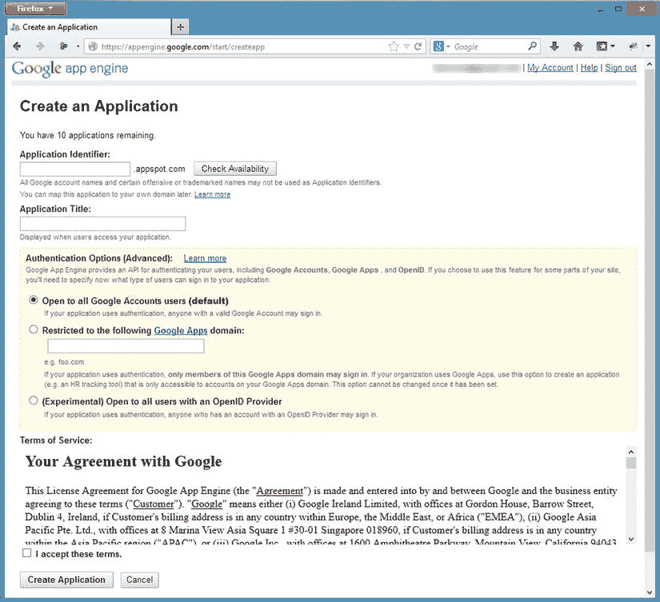

[图 8-1](#_Fig1) 。在谷歌应用引擎网站上创建一个应用程序

设置 Eclipse

在我们开始编写 Java 代码之前，我们需要下载 Google App Engine SDK for Java，并设置 ADT(或 Eclipse)与 GAE 一起工作。首先，我们需要下载 Eclipse 的 Google 插件和 GAE SDK:

1.  In ADT, open the Help menu and click Install New Software (see [Figure 8-2](#Fig2)).

    

    [图 8-2](#_Fig2) 。安装软件对话框

2.  Click the Add button in the upper-right part of the dialog. The Add Repository dialog opens (see [Figure 8-3](#Fig3)).

    

    [图 8-3](#_Fig3) 。添加存储库对话框，用于将 URL 添加到 GAE Eclipse 插件的存储库

3.  将存储库命名为 GAE 插件，并在 Location 字段中输入来自 Google Developer 站点的 URL:`http://dl.google.com/eclipse/plugin/4.2`。
4.  单击确定。
5.  Expand the Google App Engine Tools for Android (requires ADT) item, and select Google App Engine Tools for Android (see [Figure 8-4](#Fig4)).

    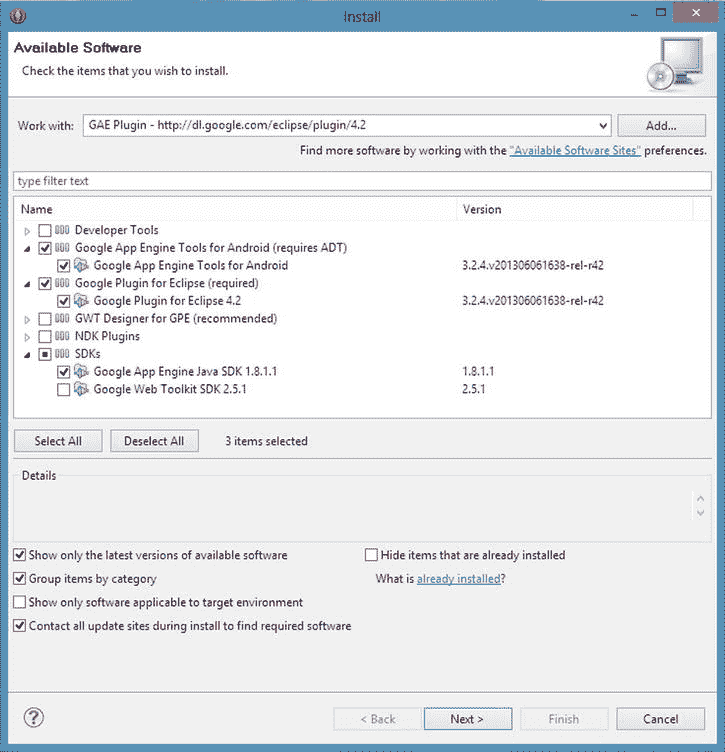

    [图 8-4](#_Fig4) 。选择支持 GAE 所需的插件

6.  展开 Google Plugin for Eclipse(required)项，选择 Google Plugin for Eclipse 4.2(参见[图 8-4](#Fig4) )。
7.  展开 SDKs 项，选择 Google App Engine Java SDK 1.8.1.1(参见[图 8-4](#Fig4) )。
8.  单击下一步。
9.  在安装详细信息对话框中再次单击下一步。
10.  查看并接受许可协议。
11.  单击完成，软件将安装到 ADT 中。可能会提示您重新启动 ADT。

我们还将使用 JAX-RS 的球衣实现。在本例中，我们将从`https://jersey.java.net`下载并使用 Jersey 1 . 17 . 1 版的 zip 包。将归档文件解压缩到您计算机上的一个位置，在那里您将获得项目所需的 JAR 文件。

创建项目

现在您已经下载了必要的组件和 SDK，在 Eclipse 中设置项目。

1.  In Eclipse, in the GDT pull-down menu in the toolbar, choose New Web Application Project (see [Figure 8-5](#Fig5)).

    

    [图 8-5](#_Fig5) 。创建一个新的网络应用项目

2.  Enter a name for your project, such as AppEngineToDoService, and a Package name, such as com.example.todo (see [Figure 8-6](#Fig6)).

    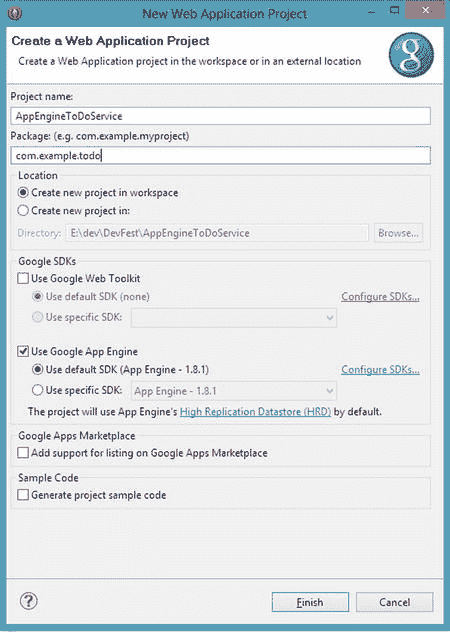

    [图 8-6](#_Fig6) 。为 ToDo 服务设置新的 web 应用程序项目

3.  取消选中使用谷歌网络工具包选项。
4.  取消选中示例代码选项。
5.  单击完成按钮。Eclipse 创建项目结构。

既然项目已经创建，我们需要在项目中进行配置更改，以确保 GAE SDK 和 Jersey 之间的兼容性。

配置项目

该项目需要一些配置更改，以便允许 GAE 使用球衣库 。在本例中，JDO/JPA 版本 2 与泽西岛版本相冲突。

1.  在包资源管理器中右键单击该项目，然后选择“属性”。
2.  Expand the Google item in the left pane, and then click App Engine (see [Figure 8-7](#Fig7)).

    

    [图 8-7](#_Fig7) 。为 GAE 更改项目配置

3.  将 Datanucleus JDO/JPA 版本更改为 v1，然后单击确定。

该项目现在准备好让我们进口球衣罐子。

将球衣添加到项目中

既然您已经在项目配置中保存了 JDO/JPA 版本的变更，那么添加组成 Jersey 库的 jar。

1.  Expand the `war`, `WEB-INF`, and `lib` folders of your project in the Package Explorer (see [Figure 8-8](#Fig8)).

    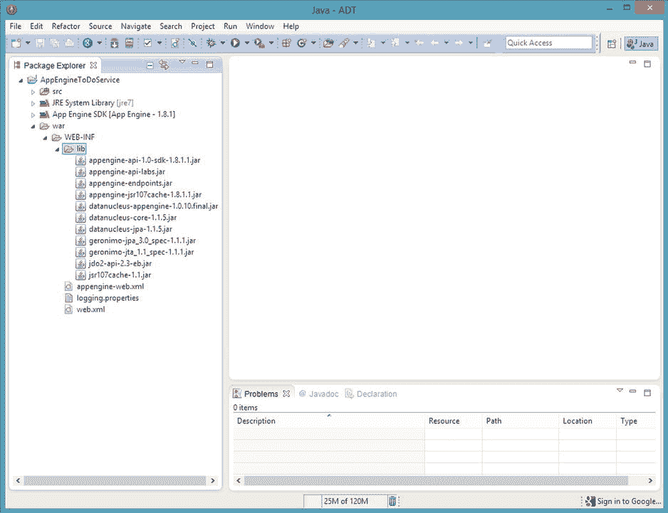

    [图 8-8](#_Fig8) 。新泽西罐子的项目地点

2.  右键单击`lib`文件夹并选择导入。
3.  展开常规项目。
4.  Click the File System item under General (see [Figure 8-9](#Fig9)).

    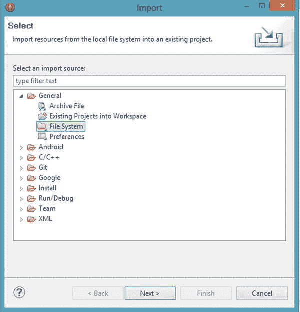

    [图 8-9](#_Fig9) 。从文件系统导入

5.  单击下一步。
6.  浏览到之前下载的 Jersey 档案文件的展开位置，并选择`lib`文件夹。
7.  In the Import dialog, click the `lib` folder in the left pane, which selects all the jars in the right pane (see [Figure 8-10](#Fig10)).

    

    [图 8-10](#_Fig10) 。进口球衣罐子

8.  单击完成。

将 Jersey 添加到类路径

在将 jar 添加到项目中之后，您必须将它们添加到类路径中，以便 Eclipse 能够正确编译您的项目。

1.  Right click the project in the Package Explorer, and choose Build Path and then Configure Build Path (see [Figure 8-11](#Fig11)).

    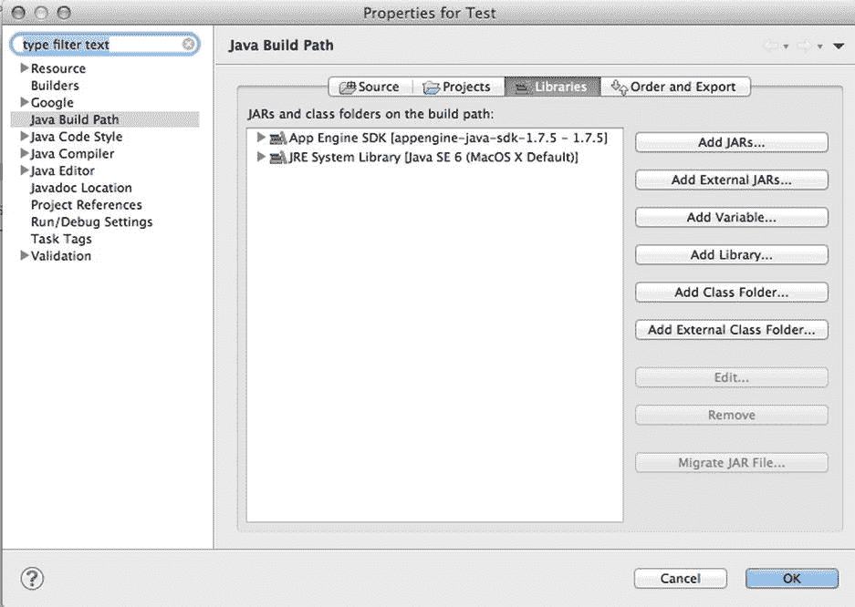

    [图 8-11](#_Fig11) 。用于将 Jersey 添加为库的构建路径对话框

2.  单击“库”选项卡。
3.  单击“添加库”按钮。
4.  Click User Library (see [Figure 8-12](#Fig12)).

    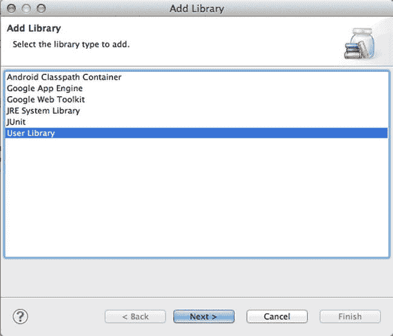

    [图 8-12](#_Fig12) 。为构建路径创建一个用户库

5.  单击下一步。
6.  单击“用户库”按钮。
7.  单击首选项对话框右侧的新建按钮。
8.  键入 Jersey 作为库名称。
9.  单击确定按钮。
10.  单击添加 JARs 按钮。
11.  Select the JARs that belong to Jersey (see [Figure 8-13](#Fig13)).

    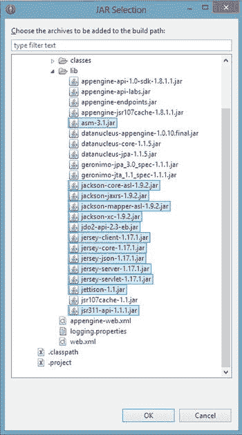

    [图 8-13](#_Fig13) 。选择要包含在用户库中的 jar

12.  单击确定。
13.  单击下一步确定按钮。
14.  单击完成。
15.  Click the OK button. The Jersey Library should appear in the Package Explorer (see [Figure 8-14](#Fig14)).

    

    [图 8-14](#_Fig14) 。将 Jersey JARs 添加为用户库的结果

既然我们已经设置了库，我们应该为 Jersey 配置`web.xml`文件。`web.xml`文件位于项目的 WEB-INF 文件夹中。打开`web.xml`，您将看到一个 XML 标签`<web-app>`。注意，这个标签中的版本是 2.5，这是 Google App Engine 目前支持的 servlet 规范。

在`web.xml`的`<web-app>`标签中添加 servlet 标签，如[清单 8-16](#list16) 所示。

[清单 8-16](#_list16) 。泽西岛图书馆的 Servlet 标签内容

```java
<servlet>
    <servlet-name>Jersey REST Service</servlet-name>
    <servlet-class>com.sun.jersey.spi.container.servlet.ServletContainer</servlet-class>
    <init-param>
        <param-name>com.sun.jersey.config.property.packages</param-name>
        <param-value>com.example.todo.service</param-value>
    </init-param>
    <init-param>
        <param-name>com.sun.jersey.api.json.POJOMappingFeature</param-name>
        <param-value>true</param-value>
    </init-param>
    <load-on-startup>1</load-on-startup>
</servlet>
```

注意在[清单 8-16](#list16) 中，我们的包名包含在一个`<init-param>`标签中。这告诉 Jersey 在哪里寻找组成我们的 web 服务的类。`POJOMappingFeature`也很重要；它允许类自动序列化为 XML 或 JSON，使我们不必编写代码来将类映射到 web 服务的输入和输出格式。

在 servlet 标签下，我们将添加一个 servlet 映射，但是仍然在`<web-app>`标签内，如[清单 8-17](#list17) 所示。[清单 8-17](#list17) 中的`<url-pattern>` 标签提供了一种映射基本 URI 模式的方法，让 Jersey 在接收来自客户端的请求时监听。该映射还允许 web 项目承载网页和服务。

[清单 8-17](#_list17) 。在 web.xml 中映射基本 URI 结构

```java
<servlet-mapping>
        <servlet-name>Jersey REST Service</servlet-name>
    <url-pattern>/api/*</url-pattern>
</servlet-mapping>
```

创建服务

既然项目已经设置好了，我们终于可以为我们的服务编写一些 Java 代码了。我们将从数据开始，逐步向客户提供服务。

这些数据将被存储在 GAE 内置的 NoSQL 数据库中，该数据库被称为*数据存储库*。数据存储保存称为实体的对象，这些对象映射到我们服务中的 Java 类。每个实体都包含属性，这些属性映射到 Java 类的成员变量。我们存储的每个实体在所有存储的相似实体的实例中必须有一个唯一的键。当部署到 GAE 的应用程序包含实体定义时，数据存储将能够存储这些实体，而无需任何管理工作，例如创建表或设置数据模式。此外，可以从 Google App Engine 网站的管理控制台操作数据存储(参见[图 8-15](#Fig15) )。

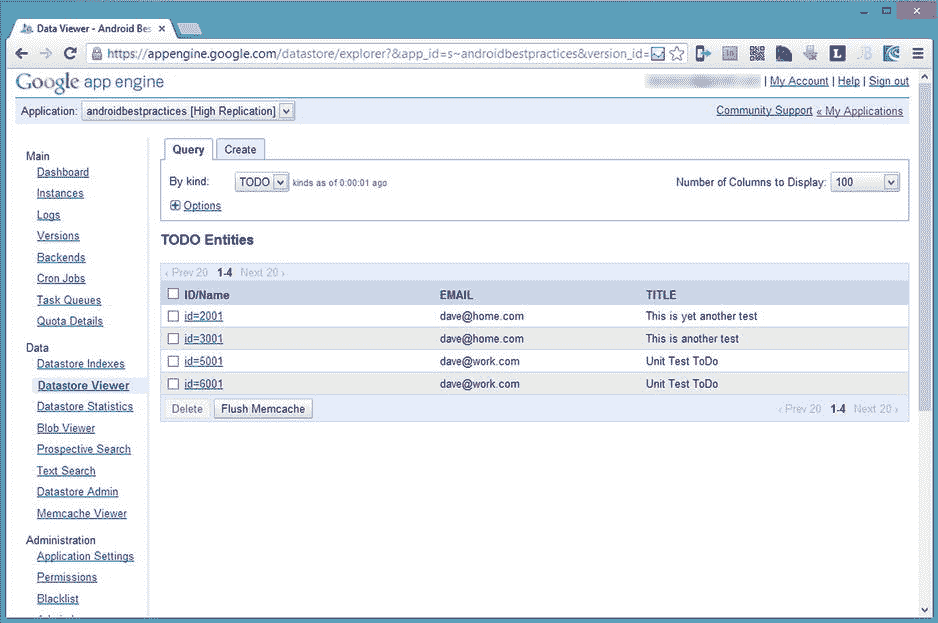

[图 8-15](#_Fig15) 。GAE 数据存储管理网页

我们的服务将利用 Google App Engine SDK 附带的 JPA 1.0 实现。这个版本与 Jersey 兼容，而 JPA 2.0 版本目前与 Jersey 不兼容——尽管它与 Jersey 共享一些库；不幸的是，Jersey 和 GAE JPA 2.0 使用了这些库的不兼容版本。

让我们从一个`ToDo`类开始，它是我们之前构建的一个小变化。`ToDo`类有两个用途。第一个是充当我们将在 GAE 上持久存储的数据的模式。第二个目的是提供一个数据结构，它将成为我们 web 服务的输入和输出。

在[清单 8-18](#list18) 中的类被标注了许多 JPA 属性，包括`@PersistenceCapable`告诉 JPA 保持这个数据结构，以及`@Persistent`标记我们想要保存的成员变量。请注意，主键是一个长整型，这是 GAE 的要求，并且主键将在创建新记录时自动生成。我们还添加了一个电子邮件地址，这样我们可以存储许多不同用户的记录。

[清单 8-18](#_list18) 。为 JPA 持久性注释的 ToDo 数据类

```java
@PersistenceCapable
public class ToDo {

    @PrimaryKey
    @Persistent(valueStrategy = IdGeneratorStrategy.IDENTITY)
    private Long id;

    @Persistent
    private String title;

    @Persistent
    private String email;

    public Long getId() {
        return id;
    }

    public void setId(Long id) {
        this.id = id;
    }

    public String getTitle() {
        return title;
    }

    public void setTitle(String title) {
        this.title = title;
    }

    public String getEmail() {
        return email;
    }

    public void setEmail(String email) {
        this.email = email;
    }
}
```

[清单 8-19](#list19) 定义了数据层中的不同动作，以操纵 GAE 数据存储中的 ToDo 记录:

*   创造
*   删除
*   为用户列出待办事项

[清单 8-19](#_list19) 。用于在云中操作 ToDos 的数据层类

```java
public class ToDoAppEngineData {
    //Ensure there is only one instance of the factory
    private static final PersistenceManagerFactory factory = JDOHelper
               .getPersistenceManagerFactory("transactions-optional");
    private PersistenceManager manager;

    public ToDoAppEngineData(){
        manager = factory.getPersistenceManager();
    }

    public Long createToDo(ToDo item) {
        ToDo newItem;
        Transaction trans = manager.currentTransaction();
        try {
            trans.begin();
            newItem = manager.makePersistent(item);
            trans.commit();
            return newItem.getId();
        } catch (Exception ex) {
            trans.rollback();
            return -1l;
        } finally {
            manager.close();
        }
    }

    public boolean deleteToDo(Long id) {
        ToDo item = getToDo(id);

        if(item == null)
            return false;
        Transaction trans = manager.currentTransaction();

        try {
            trans.begin();
            manager.deletePersistent(item);
            trans.commit();
            return true;
        } catch (Exception ex) {
            trans.rollback();
            return false;
        } finally {
            manager.close();
        }
    }

    public List<ToDo> getAll(String email) {

        if(email == null || email.isEmpty()) {
            return new ArrayList<ToDo>();
        }

        PersistenceManager manager = factory.getPersistenceManager();

        Query query = manager.newQuery(ToDo.class);
        query.setFilter("email == emailParam");
        query.declareParameters("String emailParam");
        List<ToDo> results;

        try {
            List<ToDo> temp = (List<ToDo>) query.execute(email);
            if (temp.isEmpty()) {
                return new ArrayList<ToDo>();
            }

            results = (List<ToDo>) manager.detachCopyAll(temp);
        } catch (Exception e){
            results = new ArrayList<ToDo>();
            e.printStackTrace();
        } finally {
            query.closeAll();
            manager.close();
        }
        return results;
    }
}
```

清单 8-19 中的大部分代码相当简单，有些重复。每个方法检索一个`PersistenceManager`的实例，该实例接受带注释的`ToDo`类并执行包装在`Transaction`中的 CRUD 操作。

清单 8-19`getAll()`中的最后一个函数包含了一些有趣的元素。该函数创建一个`Query`对象，并搜索与输入参数中指定的电子邮件地址相匹配的已保存的 ToDo 实体。同样，读取数据的函数调用将对象从`PersistenceManager`分离的函数。分离操作确保了如果我们的 read 函数的消费者修改了任何 ToDo 实体，这些更改不会被意外地保存到数据存储中。

既然 ToDo 实体是持久化的，那么这些 CRUD 操作就可以作为 web 服务公开，方法是将它们包装在一个用 Jersey 库中的属性进行注释的类中。

在清单 8-20 的开始，我们的类用`@Path`属性进行了注释。该属性为 Jersey 提供了我们的类所响应的 URI 的一部分。此时，我们类中所有 URIs 映射的函数调用都将以`http://localhost:8888/api/todo`开始。记住 URI 的`/api/`部分来自`web.xml`中的球衣配置。每个函数还可能有一个`@Path`注释，表示映射传入参数所需的 URI 的附加元素。

[清单 8-20](#list20) 一个通过 REST 操作公开 ToDo 实体的新泽西注释类

```java
@Path("/todo")
public class ToDoResource {

    private ToDoAppEngineData datastore;

    public ToDoResource(){
        datastore = new ToDoAppEngineData();
    }

    @GET
    @Path("list/{email}")
    @Produces(MediaType.APPLICATION_JSON)
    public List<ToDo> getToDoList(@PathParam("email") String email) {

        List<ToDo> result = datastore.getAll(email);

        return result;
    }

    @DELETE
    @Path("{id}")
    public void deleteToDo(@PathParam("id") long id) {

        if(!datastore.deleteToDo(id)) {
            throw new WebApplicationException(Response.Status.NOT_FOUND);
        }
    }

    @PUT
    @Consumes(MediaType.APPLICATION_JSON)
    @Produces(MediaType.APPLICATION_JSON)
    public ToDoId createToDo(ToDo item) {

        Long newId = datastore.createToDo(item);

        if(newId == -1){
            throw new WebApplicationException(Response.Status.INTERNAL_SERVER_ERROR);
        }

        ToDoId result = new ToDoId(newId);

        return result;
    }
}
```

每个函数都用对应于我们创建的数据层类中的 CRUD 操作的 HTTP 动词进行了注释。每个 HTTP 谓词可以有多个操作。例如，我们的类可以有多个 GET 操作。在我们的 REST URIs 中,`@Path`注释将这些函数区分开来。每个函数必须用 HTTP 动词和`@Path`属性的唯一组合进行注释。

返回数据的函数用`@Produces(MediaType.APPLICATION_JSON)`标注，它告诉 Jersey 将函数的输出序列化为 JSON。此外，响应的 HTTP 头中的内容类型将是`application/JSON`，告诉我们的 REST 服务的消费者在响应体中期待 JSON。接受 ToDo 实体作为输入的函数用`@Consumes(MediaType.APPLICATION_JSON)`标注。这迫使调用 REST 函数的客户机将内容类型`application/JSON`添加到传入 HTTP 调用的头部。如果没有这个注释，客户机可能会发送 XML 甚至纯文本。因为移动应用程序使用这些服务，所以 JSON 是我们的首选格式。如果 Android 客户端没有设置内容类型，我们的服务将抛出 HTTP 400 错误，表明组合的 HTTP 头和正文没有正确格式化。

注意，没有一个函数调用包含任何将来自 JSON 的传入消息或传出结果转换成 JSON 的代码。在`web.xml`文件中，启用了`POJOMappingFeature`,这允许 Jackson 库(作为组成 Jersey 的 jar 集的一部分)自动执行我们的 ToDo 对象与 JSON 之间的序列化。

`createToDo()`函数返回一个新类型，即`ToDoId`类。当一个新的 ToDo 插入数据存储时，这个简单的类简单地返回由数据存储生成的新 id。

通过返回一个类而不是一个数字，我们 API 的客户端将获得一个 JSON 对象，而不仅仅是响应体中的纯文本，如果我们只是简单地返回一个 long 类型，就会出现这种情况。注意清单 8-21 中缺少注释。我们不在数据存储中保存这个类；我们只是把它作为一个数据传输对象。

[清单 8-21](#_list21) 。用于返回新生成的 ToDo IDs 的数据传输对象

```java
public class ToDoId {

    public ToDoId(Long id){
        Id = id;
    }

    private Long Id;

    public Long getId() {
        return Id;
    }

    public void setId(Long id) {
        Id = id;
    }
}
```

对于我们正在使用的 Jersey 版本，我们需要创建一个应用程序类，它知道我们希望将哪些特定的 Java 类公开为 web 服务，如清单 8-22 所示。

[清单 8-22](#_list22) 。注册服务类的 Jersey 应用程序对象

```java
public class ToDoApplication extends Application {

    public Set<Class<?>> getClasses() {
               Set<Class<?>> s = new HashSet<Class<?>>();
               s.add(ToDoResource.class);
               return s;
    }
}
```

工具

一旦我们创建了一个服务，我们希望能够测试我们的代码。在我们构建 Android 客户端之前，有几个测试服务的选项。

测试 web 服务的第一个也是最有价值的工具是编写单元测试。无论您选择哪种测试框架，您都可以编写调用服务的 Java 代码。如果您远程托管服务，测试可能是一个挑战，因为数据不在单元测试的本地。单元测试的好处比手工测试大得多，因为单元测试可以成为持续集成(CI)周期的一部分。CI 构建提供了定期的反馈，可以帮助开发团队比发布服务进行手动测试更快地发现并修复服务中的错误。

锻炼一项服务的另一个选择是使用预制的 REST 客户端，比如 Google Chrome 的高级 REST 客户端或者 Firefox 的 REST Client(`https://addons.mozilla.org/en-us/firefox/addon/restclient/``)`)。这些手动工具帮助您编写原始 HTTP 调用，包括 HTTP 方法、头和主体。它们还显示了产生的 HTTP 响应和头。

我们将使用 Google Chrome 的高级 REST 客户端手动测试我们的服务。

1.  在 ADT 中，运行 web 服务项目。
2.  打开谷歌 Chrome。
3.  在 Chrome ( `https://chrome.google.com/webstore/detail/advanced-rest-client/hgmloofddffdnphfgcellkdfbfbjeloo?hl=en-US`)中跟随这个网址，安装应用程序。
4.  Open a new tab in Chrome, and navigate to the installed apps. Click Advanced REST Client (see [Figure 8-16](#Fig16)).

    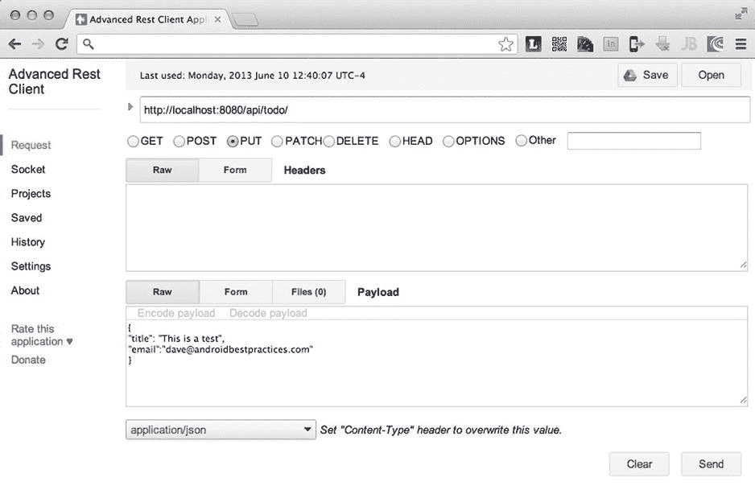

    [图 8-16](#_Fig16) 。用于测试 ToDo web 服务的高级 REST 客户端

5.  在 URL 框中，输入`http://localhost:8080/api/todo/`。
6.  选择卖出方法。
7.  In the Payload box enter:

    `{`
    `"title": "This is a test",`
    `"email":"` `dave@androidbestpractices.com` `"`

8.  在有效载荷框下方的下拉列表中，选择`application/json`。
9.  Click the Send button. The service should return a new ID for the record sent to the web service (see [Figure 8-17](#Fig17)).

    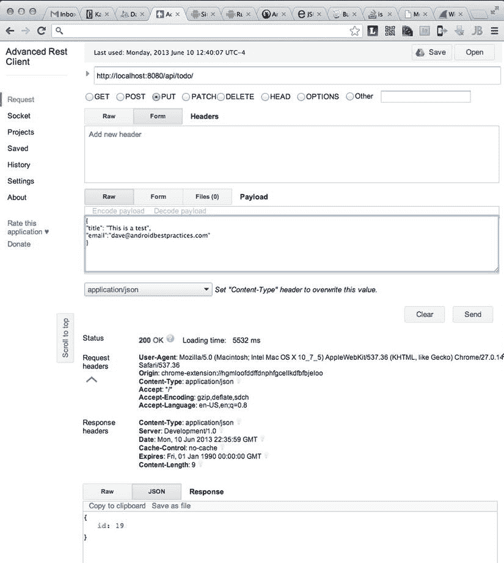

    [图 8-17](#_Fig17) 。使用高级 REST 客户端插入新的待办事项记录

一旦从调试服务转移到调试 Android 应用程序，您可能希望在 Android 客户端生成原始 HTTP 消息后检查它。Android 模拟器和 web 服务器之间设置的 HTTP 代理允许捕获和检查消息和响应。有很多 HTTP 代理工具，包括 Charles Proxy ( `http://www.charlesproxy.com/`)、WireShark ( `http://www.wireshark.org/`)和 PC 专用的 Fiddler ( `http://fiddler2.com/`)。如果您的电脑设置为共享其无线网络连接，并且 Android 设备连接到电脑而不是普通的无线接入点，则可以捕获设备流量。

负载平衡

当我们创建自己的服务时，我们必须考虑一些基础设施。这些是可用性和可伸缩性的概念。可用性是我们的应用程序“运行”的时间，即 web 服务可供我们的客户使用的时间。可用性通常用百分比表示，比如 99.9%，或“三个九”这意味着每年有 8.76 个小时的停机时间，也就是说每周大约有 10 分钟的停机时间。系统通过添加冗余服务器来获得可用性，这样，在一台服务器停机的情况下，不管是有意还是无意，另一台服务器都可以为请求提供服务。

另一方面，可伸缩性是您的服务处理数量不断增加或激增的请求的能力。如果您使用自己的 web 服务构建一个成功的移动应用程序，您最终会遇到可伸缩性问题。您将需要更多的服务器来处理越来越多的请求。

负载平衡器是一种用于管理可用性和可伸缩性的网络工具，由软件或专用硬件提供。负载平衡器位于托管您的 web 服务的服务器池的前面。负载平衡器在池中的可用服务器之间分发请求。如果服务器池增加或减少，负载平衡器会自动处理这种情况，自动转移流量。从外部来看，web 服务的消费者看到的是一个作为负载平衡器的 URL，这使得池中的服务器数量与消费应用程序无关。

负载平衡并不能完全解决可扩展性问题，因为应用程序仍然会产生比服务器池所能处理的更多的流量。负载平衡器允许您轻松地在池中添加或删除服务器，以便在不中断现有服务器的情况下调整传入流量。

此外，您的代码可能会以抑制可伸缩性的方式编写。您的应用程序代码应该正确地使用内存和外部资源，比如到数据库或文件系统的连接，以便很好地伸缩。糟糕的设计和编码是应用程序伸缩性差的主要原因。

如果您将 web 服务托管在云中，那么云平台的主要好处之一就是快速扩展。快速而相对容易地创建新的服务器实例，因此应用程序的扩展速度比传统托管更快，在传统托管中，需要购买、配置和部署硬件服务器，然后应用程序才能向上扩展。或者，如果您的流量下降，从池中移除的服务器将立即停止成为成本，这与您购买不再需要的硬件服务器的情况不同。Google App Engine 是我们托管服务的地方，在应用的生命周期中，它会自动平衡和扩展应用的负载。GAE 管理您的应用程序本身，自动建立新的服务器和安装您的应用程序。其他云服务，如亚马逊的 Elastic Beanstalk 和微软的 Windows Azure，也提供自动化的可扩展性。

摘要

在这一章中，我们讨论了 web 服务的许多方面，因为它们与 Android 应用程序相关。我们研究了 web 服务的类型，发现 REST 最适合移动应用程序。我们还研究了数据格式化，注意到 JSON 更小，更适合通过移动网络传输数据。

然后，我们研究了使用 Android 访问 web 服务的许多方法，检查了设计选项，以及如何将 JSON 数据转换成 Java 对象。

最后，我们在云中构建了自己的 web 服务，使用了 Google App Engine 和 Jersey REST 库。