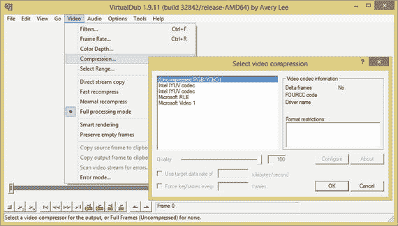
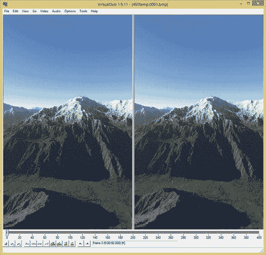
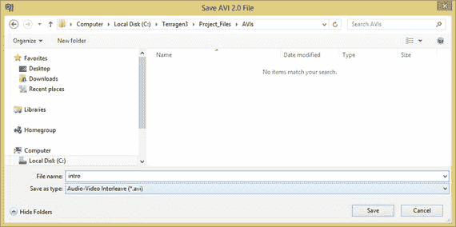
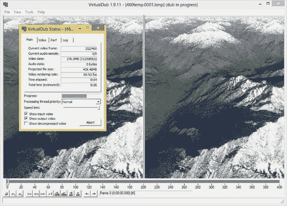
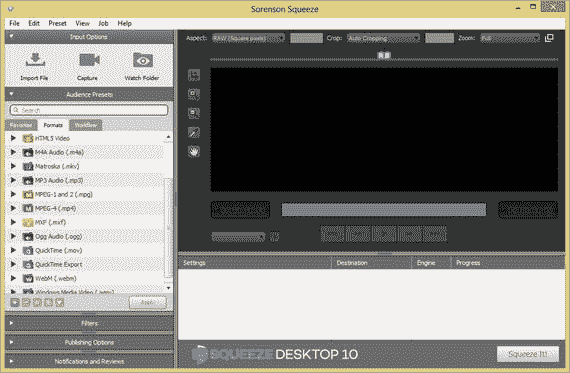
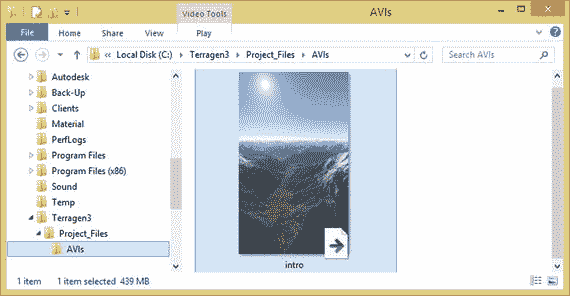
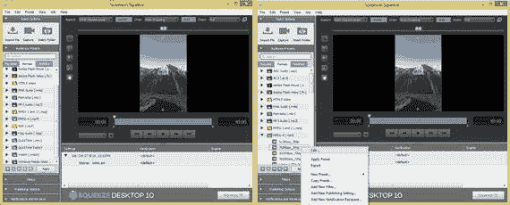
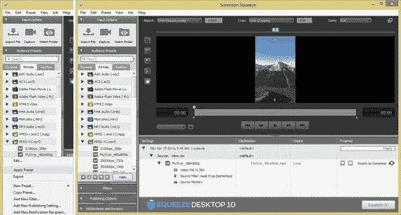

# 七、数字视频素材：数据占用优化

现在，您已经了解了数字视频新媒体内容的基本概念、术语和原则，以及 Android Studio 中支持的两种主要编解码器的数字视频素材优化注意事项，是时候使用流行的软件包 Terragen、VirtualDub 和 Squeeze 从头开始创建、编码和优化数字视频素材了。

由于 3D 渲染的内容更加“有序”，因为它是由算法(数学)而不是随机的 CCD 数据创建的，因此压缩效果会更好。另外，我可以向您展示如何“凭空”创建 2D 视频内容我还可以向您展示一个涉及多个软件包的复杂工作流程，其中大多数都是开源的。如果你愿意，你可以用 Lightworks 代替 Squeeze 来实现 100%开源的工作流。

## 创建数字视频内容:Terragen

您需要学习如何从头开始创建数字视频内容，以及如何优化其数据占用空间。为此，我将使用 Terragen 3.3，这是 Planetside Software 的一个创造世界的 3D 动画软件包；它不仅是一个令人印象深刻的 3D 软件包，而且是一个专业级别的 3D 制作软件包。幸运的是，有一个免费的版本，以及一个付费的专业版，如果你真的想在你的工具包里拥有所有最好的制作工具，我建议你购买。进入`planetside.co.uk`网站，如图 [7-1](#Fig1) 所示，下载最新版本的 Terragen 3。下载并安装软件后，用快捷图标启动它。在软件的各种渲染启动屏幕中，您会看到“致谢”和“支持”选项卡，如图 [7-1](#Fig1) 所示。通过查看这些不同的启动屏幕，您可以确切地了解该软件的功能；它们真的很壮观。

图 7-1。

Using Terragen 3.3 to create video (credits screen)

正如你所看到的，这个软件包在经验丰富的用户手中非常好用！接下来，为了让您不必学习 Terragen 的所有复杂内容，请打开一个无缝循环的虚拟世界 3D 摄像机飞越，您可以在名为 loopingOrbit_v03.tgd 的 book assets 文件夹中找到它。

a。tgd 文件是一个 TerraGen 数据格式文件；它包含本地 Terragen 项目。您应该使用 Terragen 的文件➤打开菜单序列来打开您的 Terragen 3.3 软件包中的这些类型的文件。

打开该文件后，您应该会看到 Terragen 3.3 软件包，其中包含用于 3D 世界创建预览的区域，以及用于设置和可视化编程的窗格(如图 [7-2](#Fig2) 所示)。

图 7-2。

Start Terragen: Use File ➤ Open on loopingOrbit_v03

在渲染对话框的顶部(显示在左侧)，设置图像宽度为 480 像素，图像高度为 800 像素。这是比较流行的 Android 硬件设备分辨率之一。WVGA 分辨率有足够的像素来放大或缩小，效果很好。将所有其他渲染设置保留为默认设置。

如果您只想渲染单个帧，可以使用该对话框中间的“渲染图像”按钮，但这不会创建一系列帧，而您需要这些帧来创建运动视频数据。在这个对话框的底部，您会看到七个选项卡，它们控制您的高级设置。

点按标签为“序列/输出”的第七个(最右边的)标签，以设定输出文件规格以及图像序列设置。

在输出图像文件名字段中，输入您的项目文件目录，如图 [7-2](#Fig2) 所示。截图中可以看到，我的命名为 C:\Terragen3\Project_Files。确保“序列第一个”字段的值设置为 1，然后在“序列最后一个”字段中设置值 400。

将序列步长设置为 1 帧。为渲染设置好所有参数后，单击“渲染序列”按钮，这将指示 Terragen 为您生成 400 帧自定义数字视频飞越。

由于 Terragen 输出带编号的 BMP 文件，而不是 Squeeze 要求的 AVI 格式，因此您需要了解一个名为 VirtualDub 的很酷的软件实用程序。接下来，您将利用 VirtualDub 工作流来生成 AVI 文件，该文件在数字视频行业中被称为“未压缩的全帧”

## 创建未压缩的 AVIs: VirtualDub

你需要使用的下一个软件包是 VirtualDub，它会将你在 Terragen 中创建的 400 个帧加载到 AVI 文件格式中。然后，您可以导入 AVI 在挤压压缩工作过程。从 [`www.virtualdub.org`](http://www.virtualdub.org/) 下载安装 VirtualDub，然后启动。您会看到一个空白屏幕(如图 [7-3](#Fig3) 所示)，在这里您可以使用视频➤压缩菜单序列。将结果文件的压缩设置为使用未压缩的 RGB/YCbCr 数据格式。

图 7-3。

Launch VirtualDub and use Video ➤ Compression menu

选择视频➤帧速率、视频➤颜色深度和视频➤选择范围菜单序列，分别将压缩参数设置为 10 FPS、24 位颜色和 0 到 400，如图 [7-4](#Fig4) 所示的一系列对话框。

图 7-4。

Setting the frame rate, video color depth, and frame range for an uncompressed AVI digital video data file

现在你已经准备好使用文件➤打开文件菜单序列加载 400 个编号的 BMP 帧(如图 [7-5](#Fig5) 所示)。

图 7-5。

Use File ➤ Open to open the first frame in a 400-frame 3D rendering sequence of numbered BMP files

选择 400 帧 BMP 序列中的第一帧，然后单击打开按钮在 VirtualDub 中打开所有 400 帧。一旦所有 400 帧加载完毕，您将在软件中看到第 0 帧。底部应该有一个 400 帧时长的时间线，如图 [7-5](#Fig5) 所示。

接下来，使用文件➤保存 AVI 2.0 文件菜单序列打开如图 [7-6](#Fig6) 所示的对话框。随便你给文件起什么名字(我用的是 intro.avi)，然后用保存按钮把 avi 文件保存到你的硬盘上(我创建了一个 AVIs 文件夹)。

图 7-6。

Use the File ➤ Save AVI 2.0 File dialog to save an uncompressed AVI file in a Terragen3/Project_Files/AVIs folder

单击保存按钮后，您会看到 AVI 建筑处理开始。我称之为“构建”过程，而不是压缩过程，因为您创建的 AVI 是全帧未压缩数字视频文件格式；因此，没有压缩，只是简单地将编号的 BMP 文件放置在看起来像是要压缩的数字视频文件格式中，所以它导入这些数据进行压缩。

当帧缓冲被写入(非压缩)到 AVI 文件容器时，在 VirtualDub 中显示实时进度对话框(见图 [7-7](#Fig7) )。

图 7-7。

VirtualDub loads 400 frames into a full-frames uncompressed AVI format while showing the build progress

使用未压缩的 AVI 文件有两个原因。首先，这是一种 Sorenson Squeeze 能够阅读的格式。Squeeze 目前不支持读取编号文件，这肯定会让 3D 动画师们难以置信地挠头。

更重要的是，您希望为您的编解码器提供未压缩(原始)的原始数据，以便获得最佳的视觉质量与文件大小的折衷结果。

现在，您已经有了 400 帧 Squeeze 可以导入的 AVI 格式的数字视频数据，您可以启动 Squeeze 并继续您的数据足迹优化工作流程。

## 应用视频压缩:挤压

您将使用 Sorenson Squeeze 10 来压缩我们的数字视频素材。我使用 Terragen 和 VirtualDub 的原因之一是为了创建完全未压缩的源视频，它没有任何压缩伪像。如果您想通过使用摄像机获得接近相同的原始数据，您可以使用 FireWire，将全帧未压缩(原始)视频数据采集到您的硬盘驱动器，而不是使用摄像机上的 MPEG 或 M-JPEG 压缩。

安装 Squeeze 并启动它。接下来，点击右上角的导入文件图标(参见图 [7-8](#Fig8) )。请注意，Squeeze 软件留下了用于保存编解码器、滤镜和发布选项的面板、顶部预览区域和底部时间线区域(您很快就会用到)，以便将 MPEG-4 编解码器预设(或者 WebM 预设，如果您想要使用该格式)应用到 intro.avi。

图 7-8。

Launch Squeeze and click the Import File icon

点按导入文件图标后，您会看到“选择一个或多个要打开的源媒体文件”对话框，该对话框使用文件夹名称作为对话框标题；在这种情况下，这是 AVIs，如截图顶部的图 [7-9](#Fig9) 所示。

图 7-9。

The Import File dialog showing the intro.avi file

如果找不到该文件，请导航到 Terragen3 Project_Files 子文件夹，然后导航到 AVIs 子文件夹。单击您的 AVI 简介文件将其选中，然后单击选择文件图标，在图 [7-9](#Fig9) 的左上角会看到一个内部带有红色复选标记的文档图标。这会将一个未压缩的 AVI 文件加载到 Sorenson Squeeze 中，以优化数据占用空间。

如图 [7-10](#Fig10) 所示，在左侧，视频数据加载到 Squeeze 中，并在软件的底部区域显示该 intro.avi 文件，您可以在创建编解码器预设后应用它们，这是您接下来要做的。

图 7-10。

Squeeze showing AVI file loaded and codecs (left); right-click an MPEG-4 codec and click Edit (right)

点按 MPEG-4 编解码器旁边的向右箭头，以打开 MPEG-4 编解码器子菜单。右键点击 Sorenson Squeeze 自带的 768Kbps_360p 预置。

选择“编辑”菜单选项，以便您可以编辑预设。编辑现有预置，为它们指定唯一的名称，并将它们存储为您自己的自定预置，这是一种创建您自己的数据压缩设置文件的简单方法，可用于您接下来将创建的 480×800 intro.mp4 文件。

该编辑上下文相关(右击)菜单选项打开预设对话框，如图 [7-11](#Fig11) 所示。你可以使用这个对话框来设置不同的压缩选项，这你在第 [6](06.html) 章中已经了解过了。

首先，让我们将预设命名为 FlyOver_480x800p，并在对话框顶部输入描述，480 像素宽 800 像素高的 3D Planet Fly Over Video。

请确保您的流类型设置为非流，因为视频将位于 Android Studio 应用文件夹中。格式约束应设置为无。

通过选择，然后使用编解码器下拉菜单，选择 MainConcept H.264 MPEG-4 编码器。使用“方法”下拉菜单，选择多通道压缩算法方法。

多次通过无疑会花费最长时间来压缩您的数字视频内容；但是，使用此设置还会产生使用此编码器算法可能得到的最佳压缩质量比结果。

图 7-11。

Showing MPEG-4 codec settings for 3D fly-over at 480x800 and 1000Kbps

将“帧速率”下拉列表保留为 1:1，以便每个帧都包含在目标数字视频资源中，然后将目标数据速率设置为 1000 Kbps。

选中“限制最大日期比率”复选框。将最大数据速率设定为 150%，这样您的比特率上限为 1500 Kbps。

在“预设”对话框的右侧，通过选择“与源相同”选项，设置帧大小以匹配源 AVI 分辨率 480×800。

在对话框右下角的“关键帧”区域，将“关键帧间隔”下拉列表设置为 40 秒，因为这是在 VirtualDub 中以 10 FPS 压缩的 400 帧视频的持续时间。这产生了 40 秒的持续时间。

此外，请确保选择“场景变化时自动关键帧”选项。这允许 MainConcept 编解码器确定何时获取新的数据样本；也就是您的数字视频帧数据的关键帧。由于视频编解码器会查看帧之间的“增量”，即哪些像素从一帧移动到了下一帧，因此对新的关键帧数据进行采样可以提高质量。但它也可能会增加您的数据足迹，因为帧图像数据被存储，以便随后的帧可以被重新创建。

选择“自动关键帧”选项的原因是允许 MainConcept 编解码器从算法上决定在压缩过程中获取关键帧样本的最佳数量。当一切设置正确时，单击 OK 按钮。

正如你在图 [7-12](#Fig12) 的底部所看到的，这个预置已经被添加到你的源 intro.avi 的下面。现在你可以右键单击图 [7-12](#Fig12) 左侧显示的预置，并从上下文菜单中选择应用预置选项，这将这个压缩预置添加到你的挤压项目。

图 7-12。

Right-click and Apply Preset (left), showing applied preset (center), Ready to Compress message (right)

一旦你将预置应用到你的 intro.avi 文件，如图 [7-12](#Fig12) 所示，你就可以点击挤压它！按钮，并使用您刚才设计的编解码器预设创建 MPEG-4 文件。文件名包括源文件名和编解码器预设名称。这是为了如果你改变预设设置，你一定会得到不同的结果文件名。

像使用 PCM WAV 文件作为基线一样使用未压缩的 AVI 文件；用同样的数学方法计算数据占用空间减少的百分比。

请务必查看视频回放中的质量水平，然后调整这些编解码器设置，如比特率、关键帧样本和帧速率，直到您的视觉质量由于运动像素伪像的引入而开始明显下降。

这是您工作流程中最大限度减少(优化)数字视频素材数据占用空间的点。您的 Android Studio 应用需要的任何进一步的降低都必须通过降低源 AVI 文件的分辨率来实现。

## 摘要

在本章中，您了解了使用几个流行软件包优化数字视频数据占用空间的工作流程，包括 Planetside 软件 Terragen 3.3、VirtualDub 1.9.11 和 Sorenson Squeeze Pro Desktop 10。

你用 Terragen 3 创建了一个 3D 虚拟世界飞越，然后用 VirtualDub 创建了一个源 AVI，再用专业的 Sorenson Squeeze Pro Desktop 10 软件创建了一个可以在 Android Studio 中使用的 MPEG-4 H.264 AVC 文件。

您了解了如何使用“编解码器预设”对话框设置源视频分辨率、关键帧、纵横比、帧速率、比特率和自动关键帧设置，以及它们如何有助于减少数字视频素材数据占用空间。

在下一章，你将会学到更多关于使用流行软件包的数字插图概念和术语。