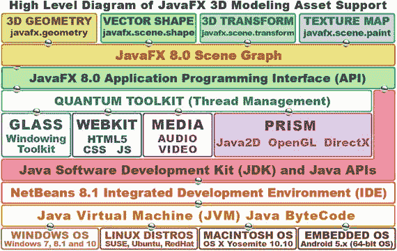
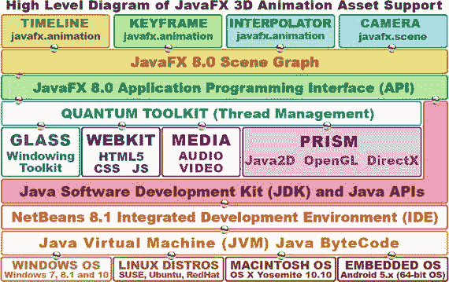
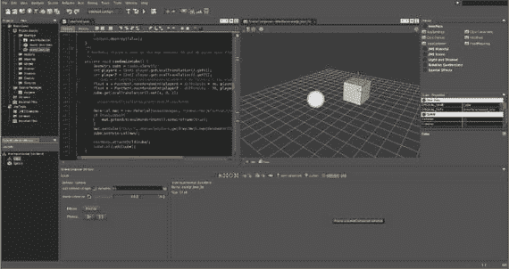
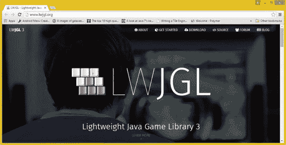
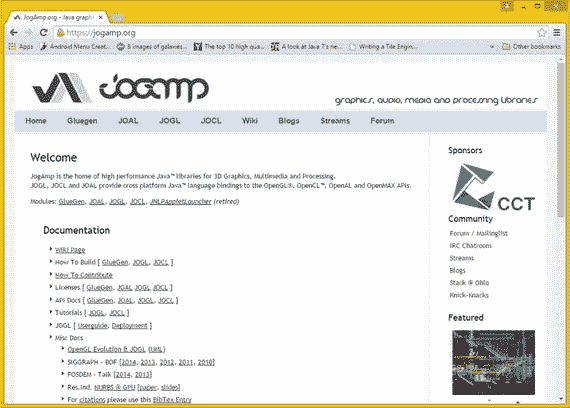

# 11.3D 新媒体:数据格式和平台

现在，您已经了解了创建 3D 新媒体资产的基本概念、术语、原则和工作流程，是时候看看如何将 3D 矢量新媒体资产融入 Android Studio 环境和 Android 应用程序了。Android Studio 只支持一个开源的 3D 渲染引擎，称为 OpenGL，即开放图形库，但还不支持场景图形层次结构，您可以使用它来构建 i3D 或交互式 3D 应用程序。JavaFX API 可以解决这个问题，它实际上是 Java 7 和 Java 8 的一部分，但还没有包含在 Android API 中。

也有一些第三方 Java 平台现在支持 Android 和一些 iOS，以及 HTML5，它们像 JavaFX 一样为 Java 7 和 Android 添加了场景图形功能。

您将看到 JavaFX 及其场景图形功能，因为 JavaFX 实际上是 Java 7、Java 8 以及即将到来的 Java 9 编程语言的一部分，并且还支持向 Android OS 和 iOS 交付 JavaFX 应用程序。

然后，您将查看其他第三方 Java 场景图平台，您可以使用这些平台为 Android 操作系统创建 3D 或 i3D 应用程序。您还将了解 OpenGL ES 3.1 (Android)、JavaFX、HTML5 WebGL 和 WebGL 2 中支持的流行 3D 文件(数据)格式。事实上，让我们先解决这个问题，然后再讨论 JavaFX 场景图和 3D 平台。

## 3D 模型数据:开放源文件格式

有许多 3D 文件(数据)格式曾经是专有的，例如 Autodesk 3D Studio Max 和 Wavefront 对象文件格式，它们得到了广泛的支持；尽管我不确定它们是否已经被正式开源。也有一些像 Collada 和 X3D 这样的开放 3D 数据交换格式，还有一个专有的 JavaFX 格式，也是开源的。

还有一种用于注塑机和 3D 打印机的制造 3D 数据文件格式，称为光固化快速成型文件格式，简称 STL。这些在表 [11-1](#Tab1) 中列出，大多数平台将这些 3D 格式导入到它们的场景图中，并支持它们的所有特性。

表 11-1。

3D Data File Formats Compatible with JavaFX in Java

<colgroup><col> <col> <col> <col></colgroup> 
| 3D 格式 | 文件扩展名 | JavaFX 3D 模型导入器 | 版本 |
| --- | --- | --- | --- |
| 欧特克 3D 工作室 | . 3ds | 3dsModelImporterJFX | Zero point seven |
| 科拉达 | 。dae 或。卓懿高 | ColModelImporterJFX | Zero point six |
| JavaFX FXML | .fxml | FxmlModelImporterJFX | Zero point five |
| 波前物体 | 。目标文件 | ObjModelImporterJFX | Zero point eight |
| 立体平板印刷术 | 。标准模板库（Standard Template Library 的缩写） | StlModelImporterJFX | Zero point seven |
| X3D 版本 3.3 | . x3d 或. x3dz | X3dModelImporterJFX | Zero point four |

让我们来看看这些格式，看看使用每种格式可以将哪些数据传输到 Java 3D APIs 中。

### Autodesk： 3D Studio for DOS 3DS

Autodesk 3DS 格式是一种三维数据导入和导出格式。它仅包括 3D 网格几何体、纹理贴图和灯光位置数据。3DS 格式也受 Autodesk 3DS Max 3D 建模、动画和渲染软件的支持，因为它是已退役的 Autodesk 3D Studio for DOS 软件的原生文件格式，在 1996 年被 3D Studio MAX 取代之前一直很流行。

这种 3DS 格式是为 3D Studio DOS 设计的。它于 1990 年发布，因此它只包含基本的网格(几何图形)和纹理贴图通道数据，这使它非常适合目前在 Android Studio、Java(使用 JavaFX APIs)和 HTML5(使用 WebGL 和 WebGL 2)中的 OpenGL ES 中找到的有限 3D 数据支持。

3DS 数据格式已成为在 3D 平台之间传输 3D 模型数据或在 3D 资源数据档案或 3D 模型店面中提供 3D 模型的行业标准。

另一种流行的模型归档文件格式是来自 Wavefront 的 OBJ 或 3D 对象文件格式。接下来让我们来看看。

### 波前技术:先进的可视化 OBJ

波前技术高级可视化 OBJ 数据格式是一种开源的三维几何定义数据格式。该数据格式已被其他 3D 应用程序和平台采用。

OBJ 文件格式是一种普遍接受的基本数据文件格式，仅表示 3D 几何图形。纹理贴图数据不包含在 OBJ 数据文件中，但可以在单独的 MTL(代表“材质”)数据文件中引用。然后，材料可以被 OBJ 文件中的数据引用，并且必须与 OBJ 文件包含在一起，这就是为什么使用这种格式的 3D 对象通常会以 ZIP 文件的形式分发。

这种 OBJ 数据格式可以包含您在第 [8](08.html) 到第 10 章中了解到的不同类型的 2D 和 3D 数据，包括顶点数据、样条曲线数据、模型层次分组数据、渲染属性数据、表面(法线)属性数据以及类似的高级 3D 模型数据结构。最常见的 3D 数据元素是几何顶点数据、纹理 UVW 坐标数据、面或顶点法线数据和多边形面数据。

接下来，我们来看看 Collada i3D 的数据格式。

### Collada: ISO 协作设计活动 DAE

ISO COLLADA 数据格式代表协作设计活动。它是用于交互式 3D 或 i3D 新媒体应用的 i3D 数据交换格式。它由非营利技术联盟 Khronos Group 管理。这种 DAE 或数字资产交换文件格式已被 ISO 采用，作为公开可用的 i3D 数据文件规范(ISO PAS 17506)。

COLLADA DAE 格式是本节介绍的所有 3D 数据格式中最先进的，因为它特别支持 i3D，因此支持高级功能，例如游戏中使用的物理模拟。

DAE 数据格式使用开放标准 DAE XML 模式来促进 i3D 软件应用程序和 i3D 渲染平台(如 HTML5 WebGL 和 WebGL2、Android 和 JavaFX)之间的 i3D 新媒体资产交换。你在第 [10](10.html) 章了解了 i3D。描述 i3D 新媒体资产的 COLLADA 数据文件实际上是一个 XML 文件，使用. dae 或。zae(ZAE 是一种压缩的 DAE)文件扩展名。

### 立体平版印刷术或 STL: 3D 系统 CAD

立体平版印刷或 STL 数据格式最初是 3D 系统立体平版印刷 CAD 软件包固有的文件格式。其他 3D 软件包也支持 STL 数据格式，因为它广泛用于快速原型制作、3D 打印和计算机辅助制造。STL 文件仅描述 3D 模型的表面几何，不包括任何颜色、纹理或其他 3D 模型属性。

因为 STL 文件只包含多边形数据，所以它可以被看作是本章这一节中你所看到的这六种格式中的“原始”3D 数据格式。

该数据由三角化的表面数据组成，这些数据由使用 3D 笛卡尔坐标系的每个三角形的单位法线和顶点组织。STL 顶点坐标必须是正数，并且没有对象比例信息。

这种 STL 数据格式能够指定 ASCII 或者二进制、3D 几何数据表示。二进制文件是最常见的格式，因为它更紧凑。让我们来看看另一种流行的{\\ f85 {\\ f85 ,} X3D 数据格式。

### X3D:VRML 的 ISO 继承者

X3D 3D 数据格式是一种 ISO 标准、开源、免费用于商业用途的 XML 定义的文件格式，用于传输 3D 模型和 3D 场景(光线和相机位置)数据。它是虚拟现实建模语言 VRML 的后继者。

X3D 包括对 VRML 的 CAD、地理空间、人形动画和 NURBS 扩展。它能够使用 XML 语法对场景图层次进行编码。它还支持 VRML 语法、二进制数据格式和增强的应用程序编程接口。如果实现平台允许，这种 X3D 数据格式支持多阶段和多纹理渲染。

X3D 数据格式还支持使用光照贴图和法线贴图的着色器，一旦 OpenGL ES 平台添加了对高级纹理贴图着色功能的渲染支持，这将是合适的(在第 [10 章](10.html)中介绍)。

### FXML:Java FX 标记语言数据格式

Java(通过 JavaFX)也有自己的 FXML 3D 场景图数据格式。这是另一种基于 XML 的格式，可以用脚本编写。它用于构建 Java 3D 对象场景图。FXML 提供了一种使用 Java 代码构建场景图层次的替代方法。它针对定义 i3D 内容或定义 JavaFX 应用程序的用户界面结构进行了优化。

FXML 文档的层次结构需要精确地反映或模拟 JavaFX 场景图的结构。FXML 适合于构建纯 3D 场景图、3D 子场景场景图或简单的由 JavaFX 8 节点子类组成的 3D 模型。

从位于场景图形层次顶部的 javafx.scene 包中的组类开始，并使用 javafx.scene.shape 库类(特别是长方体、网格视图、球体和圆柱体)来创建 3D 对象的几何数据。

使用 AmbientLight 和 PointLight 类照亮场景，使用 ParallelCamera 或 PerspectiveCamera 拍摄或录制场景视频。接下来，让我们仔细看看 JavaFX 平台，因为它内置于 Java 中。

## Java 3D 支持:JavaFX 场景图

因为 JavaFX 库(或 API)被集成到 Java 7、Java 8 和 Java 9 中，以取代 AWT 和 Swing 作为 Java 的“前端”用户界面设计库，所以我将首先介绍这个 i3D 解决方案。在这一章的后面，我将讨论其他“第三方”Java 解决方案，这些解决方案可以在 Android 上工作，在某些情况下也可以在 iOS 上工作。由于 JavaFX 现在 100%与 Java 集成，跨越三个版本，这些库被添加到 Android API 只是时间问题，Android API 从 Android 1.x 的 Java 6 升级到 Android 5.x 的 Java 7，并很可能在 2016 年升级到 Android 6.x 的 Java 8。

JavaFX 中目前有三个“顶级”包，包含对 2D 和 3D 新媒体资源类型的所有支持。javafx.geometry 包使用 Point2D 和 Point3D 类支持低级 3D 几何构造，如顶点；和 BoundingBox 类的区域。javafx.animation 包提供了时间轴、关键帧和运动曲线等低级动画构造，以及时间轴、关键帧、键值和插值器类。

javafx.scene 包提供了几个嵌套包，我喜欢称之为子包，包括包含 3D 形状构造的 javafx.scene.shape，如 Mesh、TriangleMesh 和 MeshView 类。javafx.scene.transform 包支持 2D 和 3D 变换，包括旋转、缩放、剪切和变换类。javafx.scene.paint 包包含着色器类，如 Material 和 PhongMaterial 类。javafx.scene.media 包使用 MediaPlayer 和 MediaView 类支持具有 3D 几何图形的数字视频。

### 3D 建模:点、多边形、网格和着色

我将 JavaFX 3D 资产支持分为两个图:一个用于静态 3D，或者渲染“静态”图像，另一个用于动画 3D。Interactive 3D 将使用所有的 JavaFX 3D 功能，以及许多 Java 7、8 和 9 API 功能。第一个图表显示了 JavaFX 包中支持的四个主要领域，这些领域对于创建 3D 模型非常重要，3D 模型可用于静态 3D 图像，以及与其他 JavaFX APIs 一起创建动画 3D 内容，并与 Java APIs 一起创建交互式 3D 游戏、物联网应用程序、可穿戴应用程序和 3D 模拟。图 [11-1](#Fig1) 显示了 3D 模型资产支持。

图 11-1。

JavaFX 3D Modeling asset support showing geometry, shape, transform, and paint JavaFX APIpackages

javafx.geometry 包包含 Java 和 javafx 中所有 2D 和 3D 几何的基础。这包括顶点(坐标和点)和空间(边界)。Point2D 类支持顶点(2D 空间中的一个点)和向量(2D 空间中从该点发出的一条线)表示。Point3D 类也支持顶点和矢量表示。

Bounds 超类用于表示 JavaFX 场景图节点的边界，以及它包含的对象。Bounds 超类的 BoundingBox 子类是场景图形节点对象在 2D 或 3D 空间中的边界的更专门化的化身，这取决于所使用的数据(X，Y 或 X，Y，Z)。

javafx.scene. shape 包包含一个 Mesh、MeshView 和 TriangleMesh 对象(类)。这些可用于创建 3D 几何图形。javafx.scene.transform 包包含一个旋转、缩放、剪切和变换对象(类)。这些可用于将 3D 空间变换应用于 3D 网格几何体。

javafx.scene.paint 包包含材质和 PhongMaterial 对象(类)。这些允许您在 JavaFX 中纹理化 3D 对象。

接下来，让我们看看 JavaFX 8 API 如何支持第四维，为 Android Studio 应用程序(如 3D 游戏、可穿戴设备应用程序或物联网应用程序)提供 3D 动画功能。之后可以看看其他第三方 Java 3D 平台。

### 3D 动画:时间轴、关键帧和插值器

您可能已经猜到，在 JavaFX 中实现 2D 和 3D 矢量动画的重要类存储在 javafx.animation 包中，如图 [11-2](#Fig2) 所示。例外情况是 Camera 超类和两个名为 PerspectiveCamera(用于透视相机投影)和 ParallelCamera(用于正交相机投影)的子类。当相机类记录场景时，它们在 javafx.scene 包中，javafx . scene 包是最高级别的 Java FX 场景图形包。

图 11-2。

JavaFX 3D Animation support showing animation and scene packages

时间轴对象(类)包含动画定义，动画定义由关键帧对象(类)组成，关键帧对象又由 KeyValue 对象(类)组成，key value 对象包含实际的旋转、移动和缩放变换指令数据。

一个关键帧对象包含一个 KeyValue 对象数组；因此，一个关键帧包含几个不同的键值数据对象。还有一个插值器类，它包含许多高级算法。这些将运动曲线应用到关键帧对象内的关键值对象，时间轴对象内。当前支持的插值器算法包括离散、缓入、缓出、缓入和缓出以及线性直线(均匀间隔)插值，这是占用内存和处理器(处理)最少的算法。

## 第三方 Java 场景图 3D 引擎

有许多第三方引擎为 Java 和 Android Studio 添加了场景图形和 3D 功能，最近其中一些引擎已经扩展到支持 iOS 和 HTML5。在本节中，您将会看到其中的一些内容，这样您就可以对这些内容有一个大致的了解。这些都是免费的商业用途，其中一些提供了非常专业的用户界面和功能集，包括碰撞检测、物理模拟、使用 OpenAL 的 3D 音频、使用 OpenCL 的 3D 着色器等等。

### jMonkeyEngine:JME i3D 游戏引擎

jMonkeyEngine 可以在 [`jmonkeyengine.org`](http://jmonkeyengine.org) 上找到，它是一个免费的开源 3D Java 游戏引擎，面向那些希望使用 i3D 场景图技术创建 3D 游戏的 Java 游戏开发者。该软件完全使用 Java 编码，旨在促进广泛的可访问性和快速的部署周期。jMonkeyEngine 游戏可以发布到 Windows、Mac 和 Linux，也可以发布到 Android 或 iOS。jMonkeyEngine 还支持 AR 和 VR 技术的硬件外设，如 Oculus Rift。正如你在图 [11-3](#Fig3) 中看到的，它拥有令人印象深刻的、专业的开发环境组织，在很多方面看起来与 IntelliJ 14 Android Studio 理念相似。

图 11-3。

jMonkeyEngine 3.1 has a plethora of new features

jMonkeyEngine 符合 BSD 许可。jME 3.1 SDK 支持它自己的插件框架，可以自动更新。

### LWJGL:轻量级 Java 游戏库 V3

LWJGL 3D Java 库是流行的本地 API 的多平台实现，用于开发 3D 场景图形(OpenGL)、音频(OpenAL)和并行计算(OpenCL)应用程序。LWJGL 提供低级别的访问，并且不是拖放式的 i3D 开发框架，因此它不提供比本机库所公开的更高级别的实用程序。LWJGL 也是一个开源软件，就像本书中涉及的所有内容一样，可以免费用于商业用途。

值得注意的是，如果您是一名初级 Java 程序员，在尝试直接编写 LWJGL3 库之前，您可能希望尝试使用一个框架或游戏引擎，在这个 LWJGL3 平台上构建一个用户界面。其中一些包括 libGDX，您将在接下来看到，以及 Slick2D，PlayN，JOGE，JMugen，GoldenT，jMonkeyEngine，Clyde，Ardor3D，Xith3D，Bonzai，Homura，JPCT，Gooei，TWL 和 FengGUI。

图 11-4。

Lightweight Java Game Library 3 web site lwjgl.org

接下来，让我们看看另一个流行的 3D 技术“桥接”到 Java 的框架，它不仅使 OpenGL 框架可访问，而且使 OpenAL (3D 音频库)和 OpenCL (3D 计算库)框架可用于 Java。

### JOGL: Java OpenGL、OpenAL 和 OpenCL

JOGL (Java OpenGL)是一个包装库，允许在 Java 中使用 OpenGL。它是由 Kenneth Bradley Russell 和 Christopher Kline 开发的，然后由 Sun Microsystems 进一步开发。

自 2010 年以来，JOGL 一直是一个 BSD 许可下的独立开源项目。这是 OpenGL Java 绑定的 JSR-231 参考实现。JOGL 允许通过使用 Java 本地接口(JNI)经由 C 编程语言访问 OpenGL 特征。JOGL 允许您访问标准的 OpenGL 函数，以及 OpenGL 实用程序。图 [11-5](#Fig5) 所示的 [`www.jogamp.org`](http://www.jogamp.org/) 网站有更多关于这些 JOGL、JOAL 和 JOCL Java 语言绑定的信息，以及其他有趣的信息。

图 11-5。

The jogamp.org web site, home of 3D Java libraries

接下来，您将看到 Google Code 的 libGDX，它允许您用 Java 编写 3D 应用程序，可以跨越桌面交付和 Android 交付的 i3D 开发场景。

### libGDX:跨平台桌面和 Android 3D

有一个用 Java 写的 3D 游戏开发应用框架叫 libGDX。它也有针对性能优化代码的 C 和 C++组件。这允许用一个代码库开发桌面和移动游戏。它支持 Windows，Linux，Mac OS X，Android Studio，iOS 和 WebKit，包括 WebGL 或 WebGL2。libGDX 使用第三方库 LWJGL3、OpenGL、FreeType、MPG123、Vorbis、SoundTouch Audio、Box2D、OpenAL 和 Kiss FFT。

使用 libGDX，开发人员可以使用桌面 PC 设计、编码、测试和调试他们的应用程序，并在 Android Studio 中使用相同的代码。libGDX 平台吸收了 Windows、Linux 和 Mac 桌面应用程序与 Android Studio 应用程序之间的差异。开发人员的工作流程包括在您的工作站上编码，同时验证您的 3D 项目仍然可以在 Android 下运行。libGDX 网站如图 [11-6](#Fig6) 所示。

图 11-6。

libgdx.badlogicgames.com cross-platform Java site

如果您不需要一次代码到处运行的开发场景，并且您只希望使用 Android Studio 在 Android OS 上交付，有一个 android.opengl 包也允许这样做。接下来，我们来看看这个集成解决方案。

## Android OpenGL 套件:Android i3

Android Studio 包括使用 OpenGL ES API 的开放图形库 OpenGL 的实时 3D 渲染支持。OpenGL ES 是用于嵌入式设备的 OpenGL 规范。Android 支持包括 1.1 在内的所有版本的 OpenGL ES，见于 Android 1.5 到 2.2；2.0，见于安卓 2.2 到 4.3；3.0，见于安卓 4.3 到 5；和 3.1，在 Android 5 或更高版本中找到。

为了利用 Android Studio 处理 3D 应用程序，您需要实现的最重要的 Android 类是 GLSurfaceView 基类和 GLSurfaceView。Renderer Java 接口，它进行渲染引擎刷新调用。您可以在`developer.android.com/reference/android/opengl/GLSurfaceView.html`和`developer.android.com/reference/android/opengl/GLSurfaceView.Renderer.html`找到关于这些课程的更多信息。

GLSurfaceView 子类提供了基本的 SurfaceView 类实现，该实现为 OpenGL ES 渲染调用的显示提供了专用的表面。您的 GLSurfaceView 对象可以支持许多关键功能，包括管理 3D 表面(canvas)，这是一个为 Android 的视图渲染生态系统合成 OpenGL 渲染内容而保留的操作系统内存区域。

GLSurfaceView 管理 EGL 显示，支持 OpenGL 渲染到表面，以及在专用线程上进行渲染，以便 Android 可以将渲染性能与 UI 线程分离。支持按需渲染和连续渲染。

GLSurfaceView 对象接受开发人员提供的 GLSurfaceView。Renderer 对象，它执行实际的渲染。开发人员可以选择使用这个 GLSurfaceView 来包装、跟踪或检查错误。渲染器对象的 OpenGL 调用。

默认情况下，GLSurfaceView 对象使用 PixelFormat 创建表面。RGB_888 格式表面。如果你需要一个 alpha——也就是一个半透明的表面，那么你可以使用`.getHolder().setFormat(PixelFormat.TRANSLUCENT)`方法调用结构，这样你就可以得到 PixelFormat。ARGB_8888 格式。

通过将 GLSurfaceView 子类化并覆盖其中一个 View 系统输入事件方法来实现它。如果您的应用程序不需要事件处理，GLSurfaceView 可以按原样使用。GLSurfaceView 对象可以通过调用。`set()`方法(而不是子类化)。与普通视图不同，绘图被委托给单独的 GLSurfaceView。Renderer 对象，通过使用`.setRenderer(` `Renderer` `)`调用向 GLSurfaceView 注册。要初始化 GLSurfaceView，调用`.setRenderer(Renderer)`。

## 摘要

在本章中，您了解了流行的开放 i3D 文件格式以及一些用于 Java 的 i3D 平台，如 JavaFX、jMonkeyEngine、LWJGL3、libGDX 和 android.opengl 包，所有这些都可以与 Android Studio 结合使用。

在下一章中，您将了解您在书中学习的新媒体资产是如何在 Android Studio 1.4 中引用的，正如您所知，Android Studio 1.4 是为 Android 5.4 操作系统开发应用程序的。