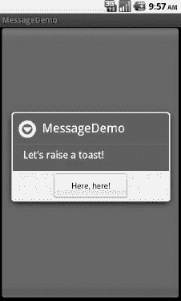
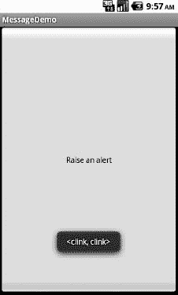

## 第十七章

## 显示弹出消息

有时候，你的活动(或者其他 Android 代码)需要大声说出来。

并不是每一次与 Android 用户的交互都是整洁的，都包含在由视图组成的片段或活动中。错误会突然出现。后台任务可能比预期花费更长时间。可能会发生一些不同步的情况，比如传入的消息。在这些和其他情况下，您可能需要在传统用户界面之外与用户进行交流。

当然，这并不是什么新鲜事。对话框形式的错误消息已经存在很长时间了。更微妙的指示器也存在，从任务托盘图标到跳跃的停靠图标到振动的手机。

Android 有很多系统可以让你在基于`Activity`的用户界面之外提醒你的用户。一个是通知，它与意图和服务紧密相关，因此包含在第 37 章中。在这一章中，你将学习两种弹出消息的方式:祝酒和提醒。

### 举杯

一个`Toast`是一个瞬时消息，意味着它在没有用户交互的情况下自己显示和消失。此外，它不会将焦点从当前活动的`Activity`上移开，所以如果用户正忙于编写下一个伟大的编程指南，按键不会被消息“吃掉”。

因为`Toast`是短暂的，你无法知道用户是否注意到了它。你得不到用户的确认，消息也不会停留很长时间来烦扰用户。因此，`Toast`主要用于咨询消息，比如指示一个长期运行的后台任务已经完成，电池电量已经下降到低水平，等等。

制作一个`Toast`相当容易。`Toast`类提供了一个静态的`makeText()`方法，该方法接受一个`String`(或字符串资源 ID)并返回一个`Toast`实例。`makeText()`方法也需要`Activity`(或其他`Context`)加上一个持续时间。持续时间以`LENGTH_SHORT`常量或`LENGTH_LONG`常量的形式表示，以相对基础表示消息保持可见的时间。

如果你希望你的`Toast`由其他的`View`组成，而不是一段无聊的旧文本，只需通过构造函数创建一个新的`Toast`实例(它需要一个`Context`，然后调用`setView()`来提供要使用的视图，调用`setDuration()`来设置持续时间。

一旦您的`Toast`被配置，调用它的`show()`方法，消息将被显示。在本章的后面，你将会看到一个这样的例子。

### 警惕！警惕！

如果你喜欢更经典的对话框风格，你想要的是一个`AlertDialog`。与任何其他模式对话框一样，会弹出一个`AlertDialog`，获取焦点，并停留在那里直到被用户关闭。您可以将它用于严重错误、无法在基本活动 UI 中有效显示的验证消息，或者您确定用户需要立即看到消息的其他情况。

构造`AlertDialog`最简单的方法是使用`Builder`类。遵循真正的构建器风格，`Builder`提供了一系列配置`AlertDialog`的方法，每个方法返回`Builder`以方便链接。最后，调用构建器上的`show()`来显示对话框。

`Builder`上常用的配置方法有以下几种:

*   `setMessage()`:将对话框的“主体”设置为简单的文本消息，来自提供的`String`或提供的字符串资源 ID
*   `setTitle()`和`setIcon()`:配置出现在对话框标题栏的文本和/或图标
*   `setPositiveButton()`和`setNegativeButton()`:指示哪个(些)按钮应该出现在对话框的底部，它们应该被放置在哪里(分别是左、中或右)，它们的标题应该是什么，以及当按钮被点击时应该调用什么逻辑(除了关闭对话框之外)。

如果需要对`AlertDialog`进行超出构建器允许范围的配置，不要调用`show()`，而是调用`create()`来获得部分构建的`AlertDialog`实例，剩下的部分进行配置，然后在`AlertDialog`本身上调用`show()`的一种风格。一旦`show()`被调用，对话框将出现并等待用户输入。

请注意，按下任何按钮都将关闭对话框，即使您已经为该按钮注册了侦听器。因此，如果你需要一个按钮来关闭对话框，给它一个标题和一个`null`监听器。使用`AlertDialog`时，没有选项可以让底部的按钮调用监听器，但不关闭对话框。

### 结账

要了解这些在实践中是如何工作的，请看一下包含以下布局的`Messages/Message`:

`<?xml version="1.0" encoding="utf-8"?>
<Button xmlns:android="http://schemas.android.com/apk/res/android"
  android:id="@+id/alert"
  android:text="Raise an alert"
  android:layout_width="fill_parent"
  android:layout_height="fill_parent"
  android:onClick="showAlert"
/>`

以下是 Java 代码:

`public void **onCreate**(Bundle icicle) {
    super.**onCreate**(icicle);

    **setContentView**(R.layout.main);
  }

  public void **showAlert**(View view) {
    new AlertDialog.**Builder**(this)
      .**setTitle**("MessageDemo")
      .**setMessage**("Let's raise a toast!")
      .**setNeutralButton**("Here, here!", new DialogInterface.**OnClickListener**() {
        public void **onClick**(DialogInterface dlg, int sumthin) {
          Toast
            .**makeText**(MessageDemo.this, "<clink, clink>",
                     Toast.LENGTH_SHORT)
            .**show**();
        }
      })
      .**show**();
  }
}`

布局并不起眼——只有一个很大的`Button`来显示`AlertDialog`。然而，冰激凌三明治为`AlertDialog(context, int)`形式的调用增加了两个新选项。这些选项通过`THEME_DEVICE_DEFAULT_LIGHT`和`THEME_DEVICE_DEFAULT_DARK`值支持设备范围的“亮”和“暗”背景报警。这些选项有助于在整个 Android 设备上推广无缝体验的概念。

当你点击`Button`时，在显示对话框之前，我们使用一个生成器(`new Builder(this)`)来设置标题(`setTitle("MessageDemo")`)、消息(`setMessage("Let's raise a toast!")`)和中性按钮(`setNeutralButton("Here, here!", new OnClickListener() ...`)。当按钮被点击时，`OnClickListener`回调触发`Toast`类来制作一个基于文本的 toast ( `makeText(this, "<clink, clink>", LENGTH_SHORT)`)，然后我们将其命名为`show()`。结果是一个典型的对话框，如图[Figure 17–1](#fig_17_1)所示。

**图 17–1。**T3【message demo】示例应用，点击后引发一个警告按钮

当您通过按钮关闭对话框时，它会升起烤面包片，如[Figure 17–2](#fig_17_2)所示。

**图 17–2。** *同样的应用，点击制作敬酒按钮后*