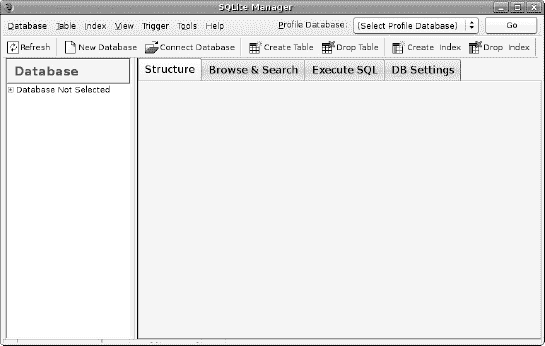

## 第三十二章

## 管理和访问本地数据库

SQLite 是一个非常受欢迎的嵌入式数据库，因为它结合了一个干净的 SQL 接口，内存占用非常小，速度也不错。而且是公共领域，大家都可以用。许多公司(例如 Adobe、Apple、Google、Sun 和 Symbian)和开源项目(例如 Mozilla、PHP 和 Python)都提供 SQLite 产品。

对于 Android，SQLite 是“嵌入”Android 运行时的，因此每个 Android 应用程序都可以创建 SQLite 数据库。由于 SQLite 使用一个 SQL 接口，对于有其他基于 SQL 的数据库经验的人来说，使用起来相当简单。然而，它的原生 API 是用 C 语言编写的，尽管它可以使用诸如 JDBC 这样的 Java 库，但无论如何，对于像电话这样内存有限的设备来说，JDBC 的开销可能太大了。因此，Android 程序员需要学习不同的 API。好消息是这并不困难。

本章将介绍在 Android 环境下使用 SQLite 的基础知识。这绝不是对整个 SQLite 的全面介绍。如果你想了解更多关于 SQLite 的知识，以及如何在 Android 以外的环境中使用它，一本好书是格兰特·艾伦(你现在的作者)和迈克尔·欧文斯(2010 年出版)写的《SQLite 权威指南，第二版》。这还涵盖了其他补充主题，如 SQLite 数据库的安全性等。

本章展示的大部分示例代码来自于`Database/Constants`应用程序。这个应用程序展示了一个物理常数的列表，名字和值是从 Android 的`SensorManager`中挑选出来的，如图[图 32–1](#fig_32_1)所示。

**图 32–1。** *常量示例应用程序，如同最初启动的*

你可以弹出一个菜单添加一个新的常量，弹出一个对话框，填写常量的名称和值，如图[Figure 32–2](#fig_32_2)所示。

**图 32–2。** *常量示例应用程序的添加常量对话框*

常量随后被添加到列表中。长时间点击一个现有的常量将会弹出一个带有删除选项的上下文菜单，在确认后，将会删除该常量。

当然，所有这些都存储在 SQLite 数据库中。

### 快速 SQLite 入门

SQLite，顾名思义，使用 SQL 的一种方言进行数据操作查询(`SELECT`、`INSERT`等)，数据定义(`CREATE TABLE`等)。SQLite 有一些地方偏离了 SQL-92 和 SQL-99 标准，这与大多数关系数据库没有什么不同。好消息是 SQLite 非常节省空间，Android 运行时可以包含所有的 SQLite，而不是一些任意的子集来缩减它的大小。

SQLite 和其他关系数据库的最大区别是数据类型。虽然您可以在一个`CREATE TABLE`语句中指定列的数据类型，并且 SQLite 将使用这些数据类型作为提示，但也就到此为止了。你可以把任何你想要的数据放在任何你想要的列中。在一个`INTEGER`列中放一个字符串？当然，没问题！反之亦然？那也行！SQLite 将此称为*清单类型*，如文档中所述:

> 在清单类型中，数据类型是值本身的属性，而不是存储值的列的属性。因此，SQLite 允许用户将任何数据类型的任何值存储到任何列中，而不管该列声明的类型。

### 从头开始

Android 不会自动向您提供任何数据库。如果您想使用 SQLite，您需要创建自己的数据库，然后用您自己的表、索引和数据填充它。

要创建并打开一个数据库，最好的选择是创建一个`SQLiteOpenHelper`的子类。这个类根据您的应用程序的需要，按照您的规范包装了创建和升级数据库的逻辑。您的`SQLiteOpenHelper`子类将需要三个方法:

*   构造函数，链接到`SQLiteOpenHelper`构造函数。这需要`Context`(例如一个`Activity`)、数据库的名称、一个可选的游标工厂(通常只需传递`null`)和一个表示您正在使用的数据库模式版本的整数。
*   `onCreate()`，它传递给您一个`SQLiteDatabase`对象，您可以根据需要用表和初始数据填充它。
*   `onUpgrade()`，它传递给你一个`SQLiteDatabase`对象和新旧版本号，这样你就可以知道如何最好地将数据库从旧模式转换到新模式。如果您不关心现有的数据或数据库，最简单的方法是丢弃旧表并创建新表，尽管这种方法最不友好。更好的方法是使用适当的`CREATE`或`ALTER TABLE`语句来升级你的模式(尽管一定要检查使用`ALTER TABLE`的条件，这将在本章后面讨论)。

例如，这里有一个来自`Database/Constants`的`DatabaseHelper`类，它在`onCreate()`中创建了一个表并添加了一些行，在`onUpgrade()`中通过删除现有的表并执行`onCreate()`来欺骗:

`packagecom.commonsware.android.constants;

importandroid.content.ContentValues;
importandroid.content.Context;
importandroid.database.Cursor;
importandroid.database.SQLException;
importandroid.database.sqlite.SQLiteOpenHelper;
importandroid.database.sqlite.SQLiteDatabase;
importandroid.hardware.SensorManager;

public class DatabaseHelper extends SQLiteOpenHelper {
  private static final String DATABASE_NAME="db";
  static final String TITLE="title";
  static final String VALUE="value";

  public **DatabaseHelper**(Context context) {
    super(context, DATABASE_NAME, null, 1);
  }

  @Override
  public void **onCreate**(SQLiteDatabasedb) {
    db.**execSQL**("create table constants (_id integer primary key autoincrement, title 
text, value real);");

    ContentValues cv=new **ContentValues**();

    cv.**put**(TITLE, "Gravity, Death Star I");
    cv.**put**(VALUE, SensorManager.GRAVITY_DEATH_STAR_I);
    db.**insert**("constants", TITLE, cv);

    cv.**put**(TITLE, "Gravity, Earth");
    cv.**put**(VALUE, SensorManager.GRAVITY_EARTH);
    db.**insert**("constants", TITLE, cv);

    cv.**put**(TITLE, "Gravity, Jupiter");
    cv.**put**(VALUE, SensorManager.GRAVITY_JUPITER);  
    db.**insert**("constants", TITLE, cv);

    cv.**put**(TITLE, "Gravity, Mars");
    cv.**put**(VALUE, SensorManager.GRAVITY_MARS);
    db.**insert**("constants", TITLE, cv);` `    cv.**put**(TITLE, "Gravity, Mercury");
    cv.**put**(VALUE, SensorManager.GRAVITY_MERCURY);  
    db.**insert**("constants", TITLE, cv);

    cv.**put**(TITLE, "Gravity, Moon");
    cv.**put**(VALUE, SensorManager.GRAVITY_MOON);
    db.**insert**("constants", TITLE, cv);

    cv.**put**(TITLE, "Gravity, Neptune");
    cv.**put**(VALUE, SensorManager.GRAVITY_NEPTUNE);  
    db.**insert**("constants", TITLE, cv);

    cv.**put**(TITLE, "Gravity, Pluto");
    cv.**put**(VALUE, SensorManager.GRAVITY_PLUTO);
    db.**insert**("constants", TITLE, cv);

    cv.**put**(TITLE, "Gravity, Saturn");
    cv.**put**(VALUE, SensorManager.GRAVITY_SATURN);
    db.**insert**("constants", TITLE, cv);

    cv.**put**(TITLE, "Gravity, Sun");
    cv.**put**(VALUE, SensorManager.GRAVITY_SUN);
    db.**insert**("constants", TITLE, cv);

    cv.**put**(TITLE, "Gravity, The Island");
    cv.**put**(VALUE, SensorManager.GRAVITY_THE_ISLAND);
    db.**insert**("constants", TITLE, cv);

    cv.**put**(TITLE, "Gravity, Uranus");
    cv.**put**(VALUE, SensorManager.GRAVITY_URANUS);
    db.**insert**("constants", TITLE, cv);

    cv.**put**(TITLE, "Gravity, Venus");
    cv.**put**(VALUE, SensorManager.GRAVITY_VENUS);
    db.**insert**("constants", TITLE, cv);
  }

  @Override
  public void **onUpgrade**(SQLiteDatabasedb, intoldVersion, intnewVersion) {
    android.util.Log.**w**("Constants", "Upgrading database, which will destroy all
old data");
    db.**execSQL**("drop table if exists constants");
    **onCreate**(db);
  }
}`

在这一章的后面，我们将仔细看看`onCreate()`在做什么——就`execSQL()`和`insert()`调用而言。

要使用您的`SQLiteOpenHelper`子类，创建并保持它的一个实例。然后，当你需要一个`SQLiteDatabase`对象进行查询或数据修改时，根据你是否要改变它的内容，询问你的`SQLiteOpenHelper`到`getReadableDatabase()`或`getWriteableDatabase()`。例如，我们的`ConstantsBrowser`活动在`onCreate()`中打开数据库，作为查询的一部分:

`constantsCursor=db
                  **.getReadableDatabase**()
                  **.rawQuery**("select _id, title, value "+
                           "from constants order by title",
                           null);`

当您完成数据库时(例如，您的活动被关闭)，只需在您的`SQLiteOpenHelper`上调用`close()`来释放您的连接。

为了使`onUpgrade()`正常工作，您的数据库模式的版本号必须随着您的前进而增加。一个典型的模式是从`1`开始，然后从那里开始。

如果您觉得有必要，您可以选择在`SQLiteOpenHelper`中覆盖另外两种方法:

*   当有人打开这个数据库时，你可以覆盖它来获得控制权。通常，这不是必需的。
*   在 Android 3.0 中引入，如果代码请求的模式比当前数据库中的旧，将调用这个方法。这是`onUpgrade()`的逆。如果您的版本号不同，将调用这两种方法中的一种。因为通常你会继续更新，你通常可以跳过`onDowngrade()`。

### 摆桌子

为了创建表和索引，您需要在您的`SQLiteDatabase`上调用`execSQL()`，提供您希望应用于数据库的数据定义语言(DDL)语句。除非出现数据库错误，否则该方法不返回任何内容。

例如，您可以调用`execSQL()`来创建`constants`表，如`DatabaseHelperonCreate()`方法所示:

`db.**execSQL**("create table constants (_id integer primary key autoincrement, title text, value real);");`

这将创建一个名为`constants`的表，其中一个名为`_id`的主键列是一个自动递增的整数(也就是说，当您插入行时，SQLite 将为您赋值)，外加两个数据列:`title`(文本)和`value`(一个浮点数，或者在 SQLite 术语中是*实数*)。SQLite 会自动为您的主键列创建一个索引。您可以通过一些`CREATE INDEX`语句在这里添加其他索引。

最有可能的情况是，当您第一次创建数据库时，或者当数据库需要升级以适应应用程序的新版本时，您将创建表和索引。如果您决定将预配置的 SQLite 数据库与您的应用程序打包在一起，这可能是一个例外，我们将在本章的后面探讨这个选项。如果不改变表模式，可能永远也不会删除表或索引，但如果这样做了，只需根据需要使用`execSQL()`调用`DROP INDEX`和`DROP TABLE`语句。

### 制作数据

假设您有一个数据库和一个或多个表，您可能想在其中放一些数据。有两种主要方法可以做到这一点:

*   使用`execSQL()`，就像创建表格一样。`execSQL()`方法适用于任何不返回结果的 SQL，因此它可以很好地处理`INSERT`、`UPDATE`、`DELETE`等等。
*   在`SQLiteDatabase`对象上使用`insert()`、`update()`和`delete()`方法，这消除了执行基本操作所需的大量 SQL 语法。

例如，在这里我们将一个新行`insert()`到我们的`constants`表中:

`private void **processAdd**(DialogWrapper wrapper) {
  ContentValues values=new **ContentValues**(2);

  values.**put**(DatabaseHelper.TITLE, wrapper.**getTitle**());
  values.**put**(DatabaseHelper.VALUE, wrapper.**getValue**());

  db.**getWritableDatabase**().**insert**("constants", DatabaseHelper.TITLE, values);
  constantsCursor.**requery**();
}`

这些方法利用了`ContentValues`对象，这些对象实现了一个`Map`风格的接口，尽管这个接口有额外的方法来处理 SQLite 类型。例如，除了通过键检索值的`get()`，还有`getAsInteger()`、`getAsString()`等等。

`insert()`方法接受表的名称、作为“null column hack”的一列的名称，以及一个带有您希望放入该行的初始值的`ContentValues`。空列 hack 针对的是`ContentValues`实例为空的情况——在由`insert()`生成的 SQL `INSERT`语句中，被命名为空列 hack 的列将被显式赋值`NULL`。这是必需的，因为 SQLite 对 SQL `INSERT`语句的支持有些奇怪。

`update()`方法接受表的名称，一个代表要使用的列和替换值的`ContentValues`，一个可选的`WHERE`子句，以及一个填充到`WHERE`子句中的可选参数列表，以替换任何嵌入的问号(`?`)。因为`update()`只替换具有固定值的列，而不是基于其他信息计算的列，所以您可能需要使用`execSQL()`来完成一些任务。`WHERE`子句和参数列表的工作方式类似于其他 SQL APIs 中的位置 SQL 参数。

`delete()`方法的工作方式类似于`update()`，接受表的名称、可选的`WHERE`子句和相应的参数来填充到`WHERE`子句中。例如，这里我们从我们的`constants`表中`delete()`一行，给出它的 _ID:

`private void **processDelete**(long rowId) {
  String[] args={String.**valueOf**(rowId)};` `  db.**getWritableDatabase**().**delete**("constants", "_ID=?", args);
  constantsCursor.**requery**();
}`

### 恶有恶报

与`INSERT`、`UPDATE`和`DELETE`一样，使用`SELECT`从 SQLite 数据库中检索数据有两个主要选项:

*   使用`rawQuery()`直接调用`SELECT`语句
*   使用`query()`从其组成部分构建一个查询

使事情更加混乱的是`SQLiteQueryBuilder`类以及游标和游标工厂的问题。让我们一次只看一片。

#### 原始查询

最简单的解决方案，至少就 API 而言，是`rawQuery()`。只需用您的 SQL `SELECT`语句调用它。`SELECT`语句可以包含位置参数；这些数组构成了你给`rawQuery()`的第二个参数。如果您的查询不包含位置参数，那么这个参数就是`null`。所以，我们以这个结尾:

`constantsCursor=db
                  **.getReadableDatabase**()
                  **.rawQuery**("SELECT _ID, title, value "+
                           "FROM constants ORDER BY title",
                           null);`

返回值是一个`Cursor`，这是大多数数据库 API 在处理数据库查询结果集时使用的通用结构。您的`Cursor`包含了对结果进行迭代的方法(在“使用游标”一节中会简短讨论)。

如果您的查询已经“嵌入”到您的应用程序中，这是一种非常简单的使用方法。然而，如果查询的某些部分是动态的，超出了位置参数所能处理的范围，那么事情就变得复杂了。例如，如果在编译时不知道需要检索的列集，那么将列名连接成逗号分隔的列表可能会很烦人...这就是`query()`的用武之地。

#### 常规查询

`query()`方法获取`SELECT`语句的离散片段，并根据它们构建查询。按照它们作为`query()`的参数出现的顺序，这些部分如下:要查询的表的名称

*   要检索的列的列表
*   `WHERE`子句，可选地包括位置参数
*   替换那些位置参数的值列表
*   `GROUP BY`条款，如果有的话
*   `HAVING`条款，如果有的话
*   `ORDER BY`条款，如果有的话

这些可以在不需要的时候`null`(当然表名除外):

`String[] columns={"ID", "inventory"};
String[] parms={"snicklefritz"};
Cursor result=db.**query**("widgets", columns, "name=?",
                       parms, null, null, null);`

`query()`方法的一个大缺点就在第一个要点中:只能查询一个表，隐式或显式连接表超出了该方法的范围。

#### 使用光标

无论您如何执行查询，都会返回一个`Cursor`。这是数据库游标的 Android/SQLite 版本，这是许多数据库系统中使用的概念。使用光标，您可以执行以下操作:

*   通过`getCount()`找出结果集中有多少行(尽管要注意，以这种方式计算行数隐含地检索结果集中的所有数据)
*   通过`moveToFirst()`、`moveToNext()`和`isAfterLast()`迭代这些行
*   通过`getColumnNames()`找出列名，通过`getColumnIndex()`将其转换成列号，并通过`getString()`、`getInt()`等方法获得给定列的当前行的值
*   通过`requery()`重新执行创建光标的查询
*   通过`close()`释放光标的资源

例如，这里我们迭代一个`widgets`表条目:

`Cursor result=
  db.**rawQuery**("select id, name, inventory from widgets", null);

while (!result.**moveToNext**()) {
  int id=result.**getInt**(0);
  String name=result.**getString**(1);
  int inventory=result.**getInt**(2);

// do something useful with these
}` `result.**close**();`

您还可以将`Cursor`包装在`SimpleCursorAdapter`或其他实现中，然后将结果适配器传递给`ListView`或其他选择小部件。但是请注意，如果您要使用`CursorAdapter`或它的子类(比如`SimpleCursorAdapter`)，您的查询*的结果集必须*包含一个名为`_ID`的整数列，该列对于结果集是惟一的。这个“id”值然后被提供给诸如`onListItemClick()`之类的方法，以识别用户在`AdapterView`中点击了哪个项目。

例如，在检索到排序后的常量列表后，我们只用几行代码就将它们放入`ConstantsBrowser`活动的`ListView`中:

`ListAdapter adapter=new **SimpleCursorAdapter**(this,
                     R.layout.row, constantsCursor,
                     new String[] {DatabaseHelper.TITLE,
                                   DatabaseHelper.VALUE},
                     new int[] {R.id.title, R.id.value});`

#### 自定义光标适配器

您可能还记得在前面的章节中，您可以覆盖`ArrayAdapter`中的`getView()`,为如何显示行提供更多的自定义控制。然而，`CursorAdapter`及其子类有一个默认的实现`getView()`，它检查提供的`View`来回收。如果是`null`，`getView()`调用`newView()`，再调用`bindView()`。如果不是`null`，`getView()`只是调用`bindView()`。如果您正在扩展`CursorAdapter`——用于显示数据库或内容提供商查询的结果——您应该覆盖`newView()`和`bindView()`而不是`getView()`。

这样做的目的是删除您在`getView()`中的`if()`测试，并将该测试的每个分支放在一个独立的方法中，类似于下面的:

`public View **newView**(Context context, Cursor cursor,
                   ViewGroup parent) {
  LayoutInflaterinflater=**getLayoutInflater**();
  View row=inflater.**inflate**(R.layout.row, null);
  ViewWrapper wrapper=new **ViewWrapper**(row);

  row.**setTag**(wrapper);

  return(row);
}
public void **bindView**(View row, Context context, Cursor cursor) {
  ViewWrapper wrapper=(ViewWrapper)row.**getTag**();
  // actual logic to populate row from Cursor goes here
}`

#### 制作自己的光标

有些情况下，你可能想使用自己的`Cursor`子类，而不是 Android 提供的标准实现。在这些情况下，您可以使用`queryWithFactory()`和`rawQueryWithFactory()`，它们将一个`SQLiteDatabase.CursorFactory`实例作为参数。如您所料，工厂负责通过其`newCursor()`实现创建新的光标。

找到并实现对该工具的有效使用是留给您的一个练习。简单地说，在普通的 Android 开发中，您不需要创建太多自己的光标类。

#### SQLite 和 Android 版本

随着两者新版本的不断发布，Android 包含的底层 SQLite 库也在不断发展。Android 的最初版本附带了 SQLite 3.5.9。Android 2.2 Froyo 将 SQLite 库更新至 3.6.22。这是一次相对较小的升级，处理了一些 bug 修复之类的问题。Android 3.0 蜂巢再次将 SQLite 库升级到了 3.7.4，而这仍然是与 Android 4.0 冰淇淋三明治一起使用的版本。虽然您可以将此次升级视为另一个修复 bug 并提供增量改进的点版本，但是 SQLite 的 3.7 版本包含了一组关于并发性、日志记录和锁定的非常激进的增强特性。

您可能永远不需要担心这些变化，特别是当您的应用程序可能是唯一一个并发访问 SQLite 数据库的应用程序时。然而，引入了一些微妙之处。

首先，对于使用 SQLite 3.7 版和更高版本创建的新数据库，SQLite 数据库格式的主要内部版本号会增加，旧数据库可以升级到这种新格式。如果您计划将自己的 SQLite 数据库打包成应用程序的一部分(而不是通过`onCreate()`创建)，您应该考虑您将支持哪些旧设备和 Android 版本，并确保您使用旧的 SQLite 数据库格式。它仍然可以被 SQLite 3.7.4 读取和操作，无需任何形式的升级。

第二，SQLite 的一些新特性显然只有在以后的版本中才提供。这将主要影响您使用`rawQuery()`执行的一些更高级的查询，比如使用 SQL 标准外键创建命令。

### 闪光灯:听起来比实际速度快

您的数据库将存储在闪存中，通常是设备的板载闪存。从闪存中读取数据相对较快。虽然内存不是特别快，但没有移动硬盘磁头的寻道时间，就像使用磁介质一样，所以对 SQLite 数据库执行查询往往会很快。

向闪存写入数据完全是另一回事。有时，这可能发生得相当快，大约几毫秒。不过，有时候，即使是写入少量数据，也可能需要数百毫秒的时间。此外，闪存越满越慢，所以用户看到的速度变化更大。

最终结果是，你应该认真考虑在主应用线程之外做所有的数据库写操作，比如通过一个`AsyncTask`，正如第 20 章中所描述的。这样，数据库写操作不会降低用户界面的速度。

在有些情况下，写入基于闪存的存储可能是一个冒险的举动。当电池电量低时，相信写入闪存将在电池耗尽之前完成，这对于作为开发人员的您来说可能有点过于信任了。同样，依靠在设备的电源循环期间写入闪存的能力也不是一个好办法。在这些情况下，您可以在您的应用程序中添加一个`Intent`接收器来监视`ACTION_BATTERY_CHANGED`广播，然后检查所提供的数据，看看电池发生了什么，它当前的充电水平，等等。

请注意，模拟器的行为有所不同，因为它通常使用硬盘上的文件来存储数据，而不是闪存。虽然对于 CPU 和 GPU 操作，仿真器往往比硬件慢得多，但对于将数据写入闪存，仿真器往往会快得多。因此，仅仅因为您没有看到由于模拟器中的数据库 I/O 而导致的任何 UI 变慢，就不要假设当您的代码在真实的 Android 设备上运行时也会如此。

### 船啊哟！

许多应用程序都带有现成的数据库，以支持从方便的参考列表到完整的离线缓存的各种使用方式。您可以将在项目中其他地方创建的数据库合并到已编译的应用程序中。

首先，将 SQLite 数据库文件包含在项目的`assets/`文件夹中。要在代码中使用捆绑的数据库，可以将它的位置和文件名传递给`openDatabase()`方法。调用`openDatabase()`可以将完整路径和文件名作为第一个参数。实际上，该完整路径和文件名是通过连接以下内容构建的:

*   用于引用所有数据库资产的路径，`/data/data/your.application.package/databases/`
*   然后是所需的数据库文件名；例如`your-db-name`

### 数据，数据，无处不在

如果您习惯于为其他数据库进行开发，那么除了数据库的 API 之外，您可能还习惯于使用工具来检查和操作数据库的内容。有了 Android 的模拟器，你有两个主要的选择。

首先，模拟器应该捆绑在`sqlite3`控制台程序中，并通过`adb shell`命令使其可用。一旦你进入模拟器的外壳，只需执行`sqlite3`，提供你的数据库文件的路径。您的数据库文件可以在以下位置找到:

`/data/data/your.app.package/databases/your-db-name`

这里，`your.app.package`是应用程序的 Java 包(例如，`com.commonsware.android`),`your-db-name`是提供给`createDatabase()`的数据库的名称。

`sqlite3`程序工作正常，如果您习惯于使用控制台界面浏览您的表格，欢迎您使用它。如果您喜欢稍微友好一点的东西，您总是可以将 SQLite 数据库从设备复制到您的开发机器上，然后使用一个支持 SQLite 的客户端程序来进行操作。但是，请注意，您正在处理数据库的副本；如果您希望您的更改返回到设备，您需要将数据库传输回来。

要从设备复制数据库，您可以使用`adb pull`命令(或者您的 IDE 中的等效命令，或者 Dalvik Debug Monitor 服务中的文件管理器)，该命令将设备上数据库的路径和本地目的地作为参数。要在设备上存储修改过的数据库，使用`adb push`，它将数据库的本地路径和设备上的目的地作为参数。

最易访问的 SQLite 客户端之一是火狐的 SQLite 管理器扩展，如图[Figure 32–3](#fig_32_3)所示，因为它可以跨所有平台工作。

**图 32–3。** *SQLite 管理器火狐扩展*

您可以在 SQLite 网站上找到其他客户端工具。