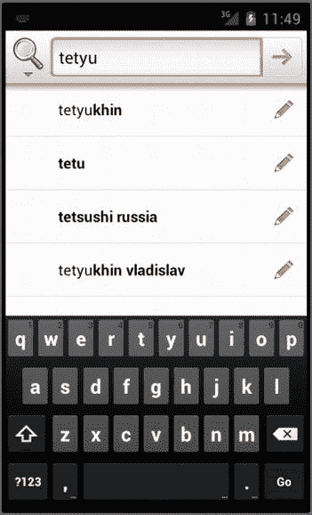
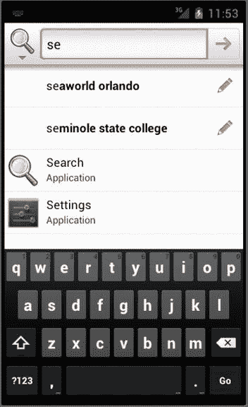
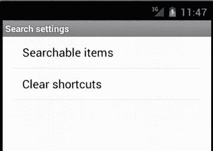
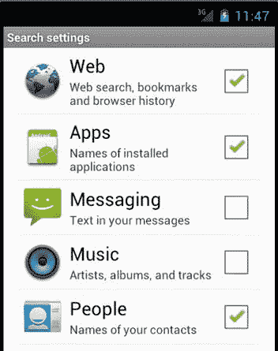
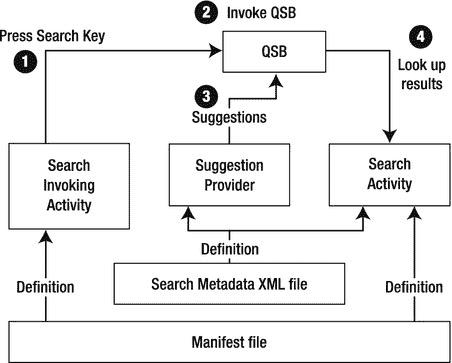
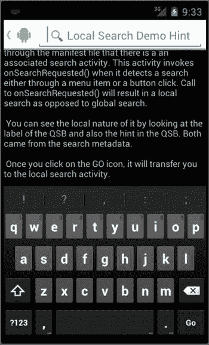
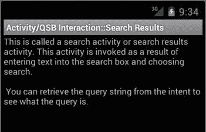
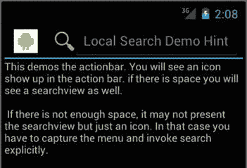

# 10.Android 搜索简介

Abstract

Android 中的搜索功能扩展了人们熟悉的基于网络的谷歌搜索栏，可以搜索基于设备的本地内容和基于互联网的外部内容。您可以进一步使用这种搜索机制，直接从主页上的搜索结果中发现和调用应用。Android 通过提供一个允许所有应用参与搜索的搜索框架，使这些功能成为可能。

Android 中的搜索功能扩展了人们熟悉的基于网络的谷歌搜索栏，可以搜索基于设备的本地内容和基于互联网的外部内容。您可以进一步使用这种搜索机制，直接从主页上的搜索结果中发现和调用应用。Android 通过提供一个允许所有应用参与搜索的搜索框架，使这些功能成为可能。

Android 搜索包含一个搜索框，让用户输入搜索数据。无论您是使用主页上的全局搜索框还是通过自己的应用进行搜索，都是如此:您使用相同的搜索框。

这个搜索框可以采用三种形式之一:搜索小部件、搜索对话框或搜索视图。搜索小部件是一个 Android 小部件，可以拖放到主屏幕上。应用可以调用搜索对话框来帮助用户输入搜索文本。这个搜索对话框可以由主页上或应用内部的搜索小部件调用。搜索视图是一种特殊的搜索对话框，它嵌入在视图中，特别是应用的操作栏中，用于搜索特定于该应用的数据。

当用户在搜索视图或搜索对话框中输入文本时，Android 获取文本并将其传递给各种已注册响应搜索的应用。应用将通过返回一组响应进行响应。Android 汇总了来自多个应用的这些响应，并将其作为可能的建议列表呈现。当用户点击其中一个响应时，Android 会调用给出建议的应用，按照给出建议的应用的设计做出正确的响应。从这个意义上说，Android 搜索是一组参与应用之间的联合搜索。

在这一章中，你将学到三件事:(1)在 Android 平台上搜索的最终用户体验是什么，(2)活动如何与搜索框架交互以调用或响应搜索，以及(3)在编写可搜索的应用时如何解决设备差异。这也是一个关于 Android 搜索的介绍性章节，它构成了编写你自己的搜索提供者的基础，这将在接下来的两个章节中讨论。

## 探索 Android 全球搜索

你不能错过 Android 设备上的搜索框；通常显示在首页，如图 [10-1](#Fig1) 所示。此搜索框也称为快速搜索框(QSB)或搜索小部件。在 Android 的某些版本中，或者取决于设备制造商或运营商，默认情况下，您可能不会在主屏幕上看到这个搜索小部件。本章中的所有图形都是使用 Android 4.0 中的模拟器捕获的。

如果您在主窗格上没有看到搜索小部件，或者如果您之前已经删除了它，就像任何其他 Android 小部件一样，您可以通过转到小部件目录并选择将搜索小部件放置在您可能有的任何主屏幕上来找到它。您也可以通过将搜索小部件拖到垃圾桶来将其从主页中移除。当然，您可以再次从小部件选项卡/屏幕中重新绘制它。

图 10-1。

Android home page with a search widget

QSB 作为一个窗口小部件的一个副作用是，将焦点转移到主页上的搜索窗口小部件以便输入数据，这基本上会将你带入一个全局搜索对话框(见图 [10-2](#Fig2) )，从而你离开主页上下文，进入搜索对话框的上下文。

图 10-2。

Global search dialog spawned from the home search widget

您也可以通过点击物理搜索键来调用图 [10-2](#Fig2) 的搜索对话框(如果您的设备上有)。当搜索键可用时，就像 Home 键一样，您可以随时点按搜索键，而不考虑可见的应用。

趋势是没有物理搜索键。搜索关键字可能是虚拟的，或者它甚至可能不是一个全局图标。在这种情况下，您将不得不依赖于搜索小部件。作为一个好的模式，建议应用使用自己的搜索菜单项，或者在应用的操作栏中放置一个搜索视图。简而言之，您可以可靠地假设搜索小部件将始终可用，并且您的应用应该通过提供菜单项(如果有操作栏，它可以变成搜索视图)来显式地提供搜索体验。

棘手的是，虚拟或物理的搜索关键字可能存在，但如果你想利用它，你必须为它编程。当这个键存在时，并且当一个应用处于焦点时，应用就有机会专门化搜索(我们将在后面讨论)。这种定制的搜索称为本地搜索。更一般、普通和非定制的搜索称为全局搜索。

Note

当应用处于焦点时按下搜索键，由应用决定是允许还是不允许本地和全局搜索。在 2.0 之前的版本中，默认操作是允许全局搜索。在 2.2 版和更高版本中，默认行为是禁用全局搜索。这意味着当一个活动成为焦点时，用户必须首先单击 Home 键，然后单击 search 键或 Search 小部件，如果他或她想要进行全局搜索的话。

在 2.2 版本之前，Android 全局搜索框不提供仅在单个应用中搜索数据的选择。所有启用搜索的应用都被视为全局搜索的上下文。

从 2.2 开始，Android 搜索允许用户选择特定的搜索上下文(或应用)。他们可以通过点击全局搜索活动的左侧图标来实现这一点，这将打开提供搜索的单个搜索应用的选择(参见图 [10-3](#Fig3) )。

图 10-3。

Global search dialog with various applications’ search contexts

你在图 [10-3](#Fig3) 中看到的是 4.0 中默认的搜索应用。该列表可能会随后续版本而变化。搜索上下文“All”的行为很像以前版本的全局搜索。您还可以通过将您的应用注册为可能的可搜索应用之一来创建自己的搜索上下文。我们将在接下来的两章中更详细地讨论这一方面，这里主要关注用户的搜索体验。

让我们暂时回头参考图 [10-2](#Fig2) 。根据您过去对设备的使用情况，图 [10-2](#Fig2) 中显示的图像可能会有所不同，因为 Android 会根据您过去的操作来猜测您在搜索什么。当在 QSB 中没有输入文本时，这种搜索模式被称为零建议模式。这是因为可搜索的应用没有被给予任何输入以提供建议。

根据输入的搜索文本，Android 会向用户提供一些建议，如图 [10-4](#Fig4) 所示。这些建议以列表形式显示在 QSB 下方，称为搜索建议。当你在搜索框中输入每个字母时，Android 会动态替换搜索建议以反映新信息。当没有搜索文本时，Android 会显示所谓的零建议。在图 [10-2](#Fig2) 中，Android 已经确定没有一个搜索应用主动提出任何零建议。但是，当您开始使用该设备时，您可能会看到一些建议，因为默认的建议提供程序可能会调出您上次的搜索字符串作为可能的建议，供您再次搜索。图 [10-4](#Fig4) 显示了当你在 QSB 中输入一些文本时出现的搜索建议。

图 10-4。

Search suggestions

图 [10-4](#Fig4) 中显示了六个重点区域。这些是:

The left-side search context/application icon   The search box   The search arrow on the right   The list of suggestions   The pencil icon next to each suggestion   The Go button on the keyboard  

左侧的搜索上下文/应用图标表示您的搜索上下文。对于“全部”，它通常是设备制造商提供的图标。例如，它可以是谷歌，也可以是必应，或者只是一个标准的搜索图标。

搜索框或 QSB 是一个编辑控件，您可以在其中输入搜索文本。如果搜索上下文是“All”，并且存在一些搜索文本，您可以单击右侧的搜索箭头，它将启动由设备制造商控制的默认搜索，这通常是浏览器搜索。此搜索的输入将是您在搜索框中输入的搜索文本。如果搜索的上下文是一个特定的应用，那么该应用中的一个活动将使用搜索框提供的输入来调用。

在图 [10-4](#Fig4) 中，建议列表中的每一项也是一组文字。然而，情况并不总是如此。这些建议可以是可以直接调用的应用的名称(稍后如图 [10-5](#Fig5) 所示)。如图 [10-4](#Fig4) 所示，当一个建议是一个可在网上搜索的文本时，你可以点击右边的铅笔图标，将建议文本移动到搜索编辑框中，从而对其进行修改。

在图 [10-4](#Fig4) 中还可以看到，键盘上的 Enter 按钮已经变成了 Go 按钮。在“全部”上下文的全局对话框中，此行为取决于制造商。当搜索上下文是您的应用时，您可以使用相关图标。

让我们再看一遍建议清单。Android 获取到目前为止已经输入到搜索框中的搜索文本，并寻找由可搜索应用提供的所谓的建议提供者。Android 异步并并行地调用每个建议提供者，以一组行的形式检索一组匹配的建议。Android 期望这些行(称为搜索建议)符合一组预定义的列(建议列)。通过探索这些众所周知的专栏，Android 绘制了建议列表。

当搜索文本改变时，Android 重复这个过程。为搜索建议调用所有建议提供者和接收建议的这种交互对于“所有”搜索上下文是真实的。然而，如果您要选择一个特定的搜索应用上下文(如图 [10-3](#Fig3) 所示)，则只有为该应用定义的建议提供程序将被调用来检索搜索建议。

Note

搜索建议集也称为建议光标。这是因为代表建议提供者的内容提供者返回了一个`cursor`对象。

图 [10-5](#Fig5) 显示了一个建议列表的例子，其中一些建议指向已经安装在设备上的应用。对于“se”的输入文本，有两个应用与此名称匹配:搜索和设置。各个应用的图标也显示在建议列表中，如左侧所示。如果您选择其中一个应用(搜索或设置)，则会调用相应的应用。

图 10-5。

Search suggestions for applications

## 为全球搜索启用可搜索的应用

正如我们已经说过的，您可以编写指定搜索特定数据集的应用。这些应用然后需要在它们的清单文件中注册它们将被考虑用于搜索。即使在此之后，最终用户也必须选择这些应用的一个子集或全部，使其成为可搜索上下文的一部分。

要选择或取消选择这些搜索应用，您必须访问搜索设置。要访问搜索设置，请单击主页上的搜索小部件。这将把您带到全局搜索对话框，正如我们到目前为止所展示的那样。现在，单击菜单(虚拟或物理)图标。迄今为止，大多数手机似乎都带有硬件菜单按钮；在平板电脑上，您可能会在屏幕的右上角看到软件菜单图标。该屏幕将显示可用于全局搜索活动的单个菜单项，如图 [10-6](#Fig6) 所示。

图 10-6。

Global search activity/dialog menu

如果你点击搜索设置菜单，如图 [10-6](#Fig6) 所示，你会看到搜索设置选项可用；见图 [10-7](#Fig7) 。

图 10-7。

Global search settings

“清除快捷方式”选项会删除搜索历史。相反，选择“可搜索项目”来查看可用的搜索应用集，如图 [10-8](#Fig8) 所示。

图 10-8。

Available searchable applications

如图 [10-8](#Fig8) 所示，一组可搜索的应用可用或安装在设备上。您可以根据需要选中/取消选中这些应用。

这就结束了对 Android 中搜索功能的高级使用的讨论。您还可以在网上搜索每种设备的专用用户指南。这些具体的指南将进一步展示不同设备之间的搜索体验可能会有所不同。我们提供了一个 Android 4.0 Nexus 用户指南的 URL 参考。

我们现在研究活动如何与搜索框架交互。

## 活动和搜索关键字交互

当用户在一个活动处于焦点时点击搜索键会发生什么？答案取决于很多因素。假设有一个搜索关键字，我们可以探究它对以下类型活动的影响:

*   不知道当前搜索的常规活动
*   明确禁止搜索的活动
*   明确调用全局搜索的活动
*   使用本地搜索的活动

### 常规活动中搜索关键字的行为

如果有一个完全不知道正在进行搜索的常规活动，单击搜索键将调用回调函数`onSearchRequested()` callback。默认情况下，这将调用本地搜索，除非另有定义。因为这是一个没有定义本地搜索的活动，所以单击搜索关键字不会产生任何影响。

Note

在 4.0 模拟器中，默认情况下不启用搜索键。如果您想测试这种行为，请转到 AVD 定义并选择启用物理键盘和 DPAD。

这种行为是有含义的。如果您的意图是在按下搜索键时调用全局搜索，那么您需要覆盖`onSearchRequested()`并显式调用全局搜索。或者，如果没有物理搜索关键字，您需要在应用中提供一个搜索菜单项。

### 禁用搜索的活动的行为

通过从 activity 类的`onSearchRequested()`回调方法返回 false，activity 可以选择完全禁用搜索(全局和局部)。清单 10-1 显示了这种禁用的一个例子。

清单 10-1。以编程方式禁用搜索

`//filename: NoSearchActivity.java`

`public class NoSearchActivity extends Activity`

`{`

`.....other code`

`@Override`

`public boolean onSearchRequested()`

`{`

`return false;`

`}`

`}`

### 通过菜单显式调用搜索

除了能够响应搜索关键字，活动还可以选择通过搜索菜单项显式调用搜索。当不再有物理搜索关键字时，这很有用。相反，您需要提供一个显式的菜单项。如果有足够的空间，这个菜单项可以嵌入到动作栏中。当搜索是一个菜单项时，您需要像处理任何其他菜单项一样处理它，并通过自己调用`onSearchRequested()`显式地调用搜索。

清单 10-2 显示了当一个菜单项被按下时调用搜索的一个活动(`SearchInvokerActivity`)的源代码。

清单 10-2。通过菜单调用搜索

`public class SearchInvokerActivity extends Activity`

`{`

`.....other stuff`

`@Override`

`public boolean onOptionsItemSelected(MenuItem item)`

`{`

`if (item.getItemId() == R.id.mid_si_search)`

`{`

`this.onSearchRequested();`

`return true;`

`}`

`return super.onOptionsItemSelected(item);`

`}`

`@Override`

`public boolean onSearchRequested()`

`{`

`this.startSearch("test",true,null,true);`

`return true;`

`}`

`}`

源代码的关键部分以粗体突出显示。注意菜单 ID ( `R.id.mid_si_search`)是如何调用函数`onSearchRequested()`的。这个方法，`onSearchRequested()`，调用搜索。

基础方法"`startSearch`"具有以下参数:

*   `initialQuery`:要搜索的文本。
*   selectInitialQuery:一个布尔值，指示是否突出显示搜索文本。在这种情况下，我们使用“true”来突出显示文本，以便在需要时可以删除它以支持新的文本。
*   `appSearchData`:要传递给搜索活动的 bundle 对象。在这种情况下，我们不针对任何特定的搜索活动。在清单 10-2 中，我们为这个参数传递了 null。
*   `globalSearch`:如果为真，则调用全局搜索。如果为假，则调用本地搜索(如果可用)；否则，调用全局搜索。

SDK 文档建议调用基类`onSearchRequested()`，不像我们在清单 10-2 中显示的那样。然而，默认的`onSearchRequested()`使用“false”作为`startSearch()`的最后一个参数。根据文档，如果没有可用的本地搜索，这将调用全局搜索。但是，在最近的版本中(从 2.2 开始)，不调用全局搜索。这可能是一个 bug，也可能是设计出来的，需要更新文档。

在本例中，我们通过向最后一个参数`startSearch()`传递“true”来强制进行全局搜索。

### 了解本地搜索

现在，让我们看看在什么情况下，应用中的搜索关键字或专门的搜索图标不会调用全局搜索，而是调用本地搜索。但是首先，我们必须进一步解释本地搜索。

本地搜索有四个组成部分:

A search dialog (with a QSB in it) or a search view   A search results activity   A searchable info XML file (search configuration)   An invoker activity that starts the search  

第一个组件是搜索对话框或搜索视图，其中包含一个搜索框，与全球搜索 QSB 非常相似(如果不是相同的话)。这个 QSB，无论是本地的还是全局的，都提供了一个用于输入文本的编辑文本控件和一个用于单击的搜索图标。当活动在清单文件中声明它需要本地搜索时，将调用本地 QSB 而不是全局。您可以通过查看图 [10-10](#Fig10) 中的图标和 QSB 中的提示(搜索框内的文本)来区分调用的本地 QSB 和全局。正如您将看到的，这两个值来自一个搜索配置元数据 XML 文件。

本地搜索的第二个组成部分是一个活动，它可以从 QSB(本地或全局)接收搜索字符串，并显示一组结果或与搜索文本相关的任何其他输出。这种活动通常被称为搜索活动或搜索结果活动。

第三个组件是一个名为`SearchableInfo`的 XML 搜索元数据文件，它定义了 QSB 应该如何表现，以及是否有任何建议提供者与该搜索相关联。

本地搜索的第四个组件是允许调用刚才描述的搜索结果活动的活动(第二个组件)。这个调用活动通常被称为搜索调用者或搜索调用活动。这个搜索调用程序活动是可选的，因为可以通过建议让全局搜索直接调用本地搜索活动(第二个组件)。

在图 [10-9](#Fig9) 中，你可以看到这四个组件以及它们在上下文中是如何相互作用的。

图 10-9。

Local search activity interaction

在图 [10-9](#Fig9) 中，重要的交互显示为带注释的箭头(带圆圈的数字)。以下是更详细的解释:

*   `SearchActivity`(或搜索结果活动)是安卓搜索中的中枢。搜索元数据 XML 文件和建议提供者都挂起了这个活动。需要在清单文件中将`SearchActivity`定义为能够接收搜索请求的活动。`SearchActivity`还使用一个强制性的 XML 文件来声明本地 QSB 应该如何呈现(比如标题、提示等等)，以及是否有相关的建议提供者(参见清单 10-6)。在图 [10-9](#Fig9) 中，你可以看到这是在`SearchActivity`和两个 XML 文件(清单文件和搜索元数据文件)之间的几个“定义”行。
*   一旦在清单文件中定义了`SearchActivity`(参见清单 10-5)，清单文件中的`Search InvokingActivity`通过清单 10-8 `)`中的元数据定义`android.app.default_searchable(`表明它与`SearchActivity`相关联。
*   有了这两个活动的定义，当`SearchInvokingActivity`成为焦点时，按下搜索键将调用本地 QSB。你可以在图 [10-9](#Fig9) 中看到这一点——编号为 1 和 2 的圆圈。您可以通过查看 QSB 的标题和提示来判断所调用的 QSB 是本地 QSB。这两个值是在强制搜索元数据 XML 定义中设置的。一旦通过搜索关键字调用 QSB，您将能够在 QSB 中键入查询文本。这个本地的 QSB，类似于全球的 QSB，能够提出建议。
*   一旦输入了查询文本并点击了搜索图标，本地 QSB 就会将搜索转移给负责处理它的`SearchActivity`,比如显示一组结果。

我们通过查看每个相关文件的代码片段来进一步研究这些交互。我们从清单 10-3 开始，`SearchActivity`的源代码(它也负责接收查询并显示搜索结果)。

清单 10-3。简单的搜索结果活动

`//filename: SearchActivity.java`

`public class SearchActivity extends Activity`

`{`

`@Override`

`protected void onCreate(Bundle savedInstanceState) {`

`super.onCreate(savedInstanceState);`

`setContentView(R.layout.search_activity);`

`.....`

`//Use the invoking intent to receive the search text`

`//and do present what is needed`

`......`

`return;`

`}`

`}`

这是一个非常简单的带有文本控件的活动。清单 10-4 显示了它的布局。

清单 10-4。简单搜索结果活动的布局文件

`<?xml version="1.0" encoding="utf-8"?>`

`<LinearLayout`

`xmlns:android="`[`http://schemas.android.com/apk/res/android`](http://schemas.android.com/apk/res/android)T2】

`android:orientation="vertical"`

`android:layout_width="fill_parent" android:layout_height="fill_parent"`

`>`

`<TextView`

`android:id="@+id/text1"`

`android:layout_width="fill_parent" android:layout_height="wrap_content"`

`android:text="@string/search_activity_prompt"`

`/>`

`</LinearLayout>`

我们使用了最简单的搜索活动。在下一章中，您将看到该活动如何检索搜索文本或搜索查询。现在，我们展示 QSB 是如何调用这个活动的。清单 10-5 显示了如何将`SearchActivity`定义为负责清单文件中搜索结果的搜索活动。

清单 10-5。用搜索元数据在清单文件中定义搜索结果活动

`<activity android:name=".SearchActivity"`

`android:label="Activity/QSB Interaction::Search Results">`

`<intent-filter>`

`<action android:name="android.intent.action.SEARCH"/>`

`<category android:name="android.intent.category.DEFAULT"/>`

`</intent-filter>`

`<meta-data android:name="android.app.searchable"`

`android:resource="@xml/searchable"/>`

`</activity>`

Note

对于搜索活动，需要指定两件事情。活动需要表明它可以响应搜索操作。它还需要指定一个 XML 文件，描述与该搜索活动交互所需的元数据。

清单 10-6 显示了这个`SearchActivity`的搜索元数据 XML 文件。

清单 10-6。搜索结果活动的 SearchableInfo

`<!-- /res/xml/searchable.xml -->`

`<searchable xmlns:android="`[`http://schemas.android.com/apk/res/android`](http://schemas.android.com/apk/res/android)T2】

`android:label="@string/search_label"`

`android:hint="@string/search_hint"`

`android:searchMode="showSearchLabelAsBadge"`

`/>`

Tip

该 XML 中可用的各种选项记录在位于 [`http://developer.android.com/guide/topics/search/searchable-config.html`](http://developer.android.com/guide/topics/search/searchable-config.html) 的 SDK 中。

我们将在接下来的两章中讨论更多这些可搜索的 info XML 属性。现在，属性`android:label`用于标记搜索框。属性`android:hint`用于在搜索框中放置初始文本(见图 [10-10](#Fig10) )。清单 10-6 中的`android:searchMode`属性表示使用`android:label`属性来标记搜索框。这个选项在手机上看起来很好，标签在一行，搜索框在下面。但是，在 4.0 中，这个标签与搜索框一致；这看起来很糟糕，因为它占用了搜索框的空间。最好用`showSearchIconAsBadge`来代替。

现在让我们看看活动如何将这个`SearchActivity`指定为它的搜索。我们称之为调用激活`LocalSearchEnabledActivity`。清单 10-7 显示了这个`LocalSearchEnbaledActivity`的源代码。

清单 10-7。LocalSearchEnabledActivity 源代码

`public class LocalSearchEnabledActivity extends Activity`

`{`

`@Override`

`protected void onCreate(Bundle savedInstanceState) {`

`super.onCreate(savedInstanceState);`

`setContentView(R.layout.local_search_enabled_activity);`

`return;`

`}`

`@Override`

`public boolean onCreateOptionsMenu(Menu menu)     {`

`super.onCreateOptionsMenu(menu);`

`MenuInflater inflater = getMenuInflater();`

`inflater.inflate(R.menu.search_invoker_menu, menu);`

`return true;`

`}`

`@Override`

`public boolean onOptionsItemSelected(MenuItem item)     {`

`if (item.getItemId() == R.id.mid_si_search)`

`{`

`onSearchRequested();`

`return true;`

`}`

`return super.onOptionsItemSelected(item);`

`}`

`}`

注意，在清单 10-7 中，我们为搜索定义了一个名为`R.id.mid_si_search`的菜单项。这个菜单项是菜单文件的一部分，在清单 10-7 中用`R.menu.search_invoker_menu`表示。我们将让您创建一个满足`R.id.mid_si_search`和`R.menu.search_invoker_menu`的菜单文件。如果选择了菜单项`R.id.mid_si_search`，那么我们称之为`onSearchRequested`()。Android 此时如何知道调用本地搜索？清单文件中的`LocalSearchEnabledActivity`的定义阐明了 Android 与`SearchActivity`的关系，如清单 10-8 所示。

清单 10-8。通过元数据绑定搜索结果活动

`<activity android:name=".LocalSearchEnabledActivity"`

`android:label="Activity/QSB Interaction::Local Search">`

`<meta-data android:name="android.app.default_searchable"`

`android:value=".SearchActivity" />`

`</activity>`

注意这个`LocalSearchEnabledActivity`是如何指向中枢销`SearchActivity`的。`SearchActivity`反过来告诉本地 QSB 应该如何呈现，搜索文本被传递给那个`SearchActivity`。

Note

您也可以在应用级别使用这个元数据定义，这样所有活动都将继承这个搜索活动。如果需要，单个活动可以进一步覆盖应用级别的搜索活动。以前的版本在这里接受“*”来表示全局搜索；该“*”规范现在已被弃用。

当`LocalSearchEnabledActivity`处于焦点时，如果你点击设备搜索，或者使用清单 10-7 中的菜单项，两者都将调用本地搜索框(本地 QSB)，如图 [10-10](#Fig10) 所示。

图 10-10。

Local search QSB

注意这个搜索框上的图标和这个搜索框的提示。看看它们与全局搜索有何不同(见图 [10-2](#Fig2) )。该图标来自应用包的图标，如应用包的清单文件中所定义。该提示来自为`SearchActivity`指定的搜索元数据(searchable.xml，清单 10-6)。现在，如果您在 QSB 中输入文本并点击搜索图标，您将最终调用`SearchActivity`(参见清单 10-3)。图 [10-11](#Fig11) 显示了这个`SearchActivity`的样子。

图 10-11。

Search results in response to the local search QSB

虽然这个活动不使用任何查询搜索文本来获取结果，但是它演示了如何定义和调用搜索活动。在接下来的两章中，我们将展示这个`SearchActivity`如何利用搜索查询以及它需要响应的各种与搜索相关的动作。

### 启用键入搜索

当你在查看如图 [10-10](#Fig10) 所示的`LocalSearchInvokerActivity`活动时，有一种方法可以通过键入一个随机的字母(如“t”)来调用搜索。这种模式称为“键入搜索”，因为您键入的任何不受活动处理的键都将调用搜索。

键入搜索的意图是这样的:在任何 Android 活动上，你可以告诉 Android 任何按键都可以调用搜索——除了活动明确处理的按键。例如，如果一个活动处理“x”和“y”，但不关心任何其他键，该活动可以选择调用对任何其他键的搜索，如“z”或“a”。这种模式对于已经显示搜索结果的活动很有用；它可以将按键解释为再次开始搜索的提示。

下面是几行代码，您可以在活动的`onCreate()`方法中使用它们来实现这种行为(第一行用于调用全局搜索，第二行用于调用局部搜索):

`this.setDefaultKeyMode(Activity.DEFAULT_KEYS_SEARCH_GLOBAL);`

或者

`this.setDefaultKeyMode(Activity.DEFAULT_KEYS_SEARCH_LOCAL);`

## 在操作栏中使用 SearchView

到目前为止，我们已经在主页上看到了一个搜索小部件、一个全局搜索对话框和一个本地搜索对话框。还有另一种方法来利用搜索功能。这是通过一个通过动作栏暴露出来的`SearchView`来实现的，这是现在手机和平板电脑都推荐的模式。

图 [10-12](#Fig12) 显示了手机上的搜索视图，以及顶部标题/操作栏中的应用图标。

图 10-12。

Search view in the action bar of a phone

图 [10-13](#Fig13) 显示了带有搜索视图的操作栏在平板电脑上的外观。

图 10-13。

Search view in the action bar of a tablet

### 将搜索视图小部件定义为菜单项

要定义一个显示在活动操作栏中的搜索视图，您需要在一个菜单 XML 文件中定义一个菜单项，如清单 10-9 所示。

清单 10-9。搜索视图菜单项定义

`<item android:id="@+id/menu_search"`

`android:title="Search"`

`android:showAsAction="ifRoom"`

`android:actionViewClass="android.widget.SearchView"`

`/>`

清单 10-9 中的关键元素是指向`android.widget.SearchView`的`actionViewClass`属性。其他属性仅仅是通常的菜单项属性。

### 标识搜索视图小部件的搜索目标

到目前为止，您的操作栏中已经有了搜索视图，并且您已经有了可以响应搜索的活动(`SearchActivity`)。我们需要将这两部分结合在一起，这是用 Java 代码完成的。作为设置菜单的一部分，您需要在搜索调用活动的`onCreateOptions()`回调中这样做。清单 10-10 中的函数可以从`onCreateOptions()`中调用，以便将搜索视图小部件和搜索结果活动联系起来。

清单 10-10。将搜索视图小部件绑定到搜索结果活动

`private void setupSearchView(Menu menu)`

`{`

`//Locate the search view widget`

`//as indicated by the menu item of listing 10-9`

`SearchView searchView =`

`(SearchView) menu.findItem(R.id.menu_search).getActionView();`

`if (searchView == null)`

`{`

`Log.d(tag, "Failed to get search view");`

`return;`

`}`

`//setup searchview`

`SearchManager searchManager =`

`(SearchManager) getSystemService(Context.SEARCH_SERVICE);`

`ComponentName cn =`

`new ComponentName(this,SearchActivity.class);`

`SearchableInfo info =`

`searchManager.getSearchableInfo(cn);`

`if (info == null)`

`{`

`Log.d(tag, "Failed to get search info");`

`return;`

`}`

`searchView.setSearchableInfo(info);`

`// Do not iconify the widget; expand it by default`

`searchView.setIconifiedByDefault(false);`

`}`

为了练习这段代码，我们在本章的示例项目中包含了一个名为`ActionBarSearchActivity`的活动。这就是我们在图 [10-12](#Fig12) 中展示的活动。

清单 10-9 中的菜单项可能在活动的动作栏中没有空间。在这种情况下，它仅仅是一个菜单项，你必须显式地调用`onSearchRequested()`来调用搜索对话框，而不是搜索视图。你可以看到这个例子的代码清单 10-7。

由于篇幅限制，我们没有包括测试本章中介绍的概念所需的每个文件。你可以下载本章的专用项目；我们在参考资料中给出了该项目的 URL。

## 参考

以下是我们在撰写本章时发现的有价值的资源列表。

*   [`http://static.googleusercontent.com/external_content/untrusted_dlcp/www.google.com/en/us/help/hc/img/android/android_ug_42/Nexus-7-Guidebook.pdf`](http://static.googleusercontent.com/external_content/untrusted_dlcp/www.google.com/en/us/help/hc/img/android/android_ug_42/Nexus-7-Guidebook.pdf) :这既是一篇 Nexus 7 用户指南，也是讲 Android 4.0 中的搜索用户体验。你也可以在谷歌上搜索“Android Jellybean 用户指南”您可能会发现市场上每种设备都有专门的指南。
*   [`http://developer.android.com/guide/topics/search/index.html`](http://developer.android.com/guide/topics/search/index.html) `:`谷歌安卓搜索概述及词条文档。
*   [`http://developer.android.com/guide/topics/search/searchable-config.html`](http://developer.android.com/guide/topics/search/searchable-config.html)`:`Google 的这个 URL 是一个关键文档，它概括了 searchableinfo xml 文件中可用的属性。
*   [`http://developer.android.com/reference/android/app/SearchManager.html`](http://developer.android.com/reference/android/app/SearchManager.html) :主要 Android 搜索工具的 API 引用，即`SearchManager`。
*   [`http://www.androidbook.com/notes_on_search`](http://www.androidbook.com/notes_on_search) `:`在这个网址你可以在安卓搜索上找到作者的笔记。本书出版后，我们将继续更新内容。您将在这里找到代码片段、摘要、用于搜索的关键 URL，以及每个版本中的变化。
*   在 [`www.androidbook.com/expertandroid/projects`](http://www.androidbook.com/expertandroid/projects) 下载本章测试项目。ZIP 文件的名称是`ExpertAndroid_Ch10_AndroidSearch.zip`。

## 摘要

这是关于 Android 搜索的介绍性章节，涵盖了用户体验。我们已经展示了如何使用搜索关键字来调用搜索。我们已经展示了创建能够响应搜索的搜索结果活动的基础。我们解释了如何将应用或搜索调用活动与搜索结果活动联系起来。我们已经展示了搜索结果活动如何通过可搜索的 info XML 文件定义其搜索需求。我们已经演示了如何在动作栏中使用 searchview。我们还列出了在设备上实现搜索功能的各种方式，以及如何编写代码来涵盖所有这些情况。

接下来的两章进一步探讨了检索搜索文本和产生结果的搜索结果活动。我们还将介绍如何编写简单和定制的建议提供程序，在搜索对话框中提供搜索建议。

## 复习问题

以下问题是你在本章所学内容的里程碑。

What is QSB?   What is a search widget, a search dialog, and a search view?   What is searchable info?   What is a global search and a local search?   What is a search results activity?   How do you attach a search results activity to an application or an activity?   What is search metadata?   What are search suggestions? What are suggestion columns? What is a suggestion cursor?   What is a suggestions provider? What is zero suggestions mode?   How do you craft a search so that it works well when the phyical search key is present and when it is not?   How do you craft a search so that it works well on both tablets and phones?   How does a search interact with the action bar?   How do you attach searchable info to a search view in the action bar?   How do you define the search icon for an action bar?   What is the class name you would use for a search view in the menu.xml?   How do you enable the Search key in the emulator if it is disabled by default?