# 七、制作 Android 应用

在这一点上，我们的游戏还远未完成，在接下来的几章中，你将学习如何添加关卡、关卡、菜单、更多的 UI 元素和许多其他功能。

但是我们有一个基本的游戏，现在可以作为一个游戏来玩，而且肯定是可以玩的。我们的画布已经就位——这将是重要的一点。简而言之，我觉得你已经等得够久了。是时候让这个东西在你的 Android 设备上运行了。

在本章中，您将学习如何创建 APK，如何在手机或平板电脑上测试游戏，以及如何在游戏中添加触摸控制。最终，你将能够把你制作的游戏带到任何地方，并把它放进你的口袋。理论上，你甚至可以把它公之于众。但是我不建议现在就这么做....

## 添加触摸控制

在我们开始构建 APK 之前，添加触摸控件是个好主意。现在，你可以在带有蓝牙键盘的 Android 设备上使用你的应用，但对大多数人来说，这不是一个非常方便的游戏方式。大多数人连蓝牙键盘都没有。你想让他们只用手机就能玩。幸运的是，添加触摸控件并不是一个太复杂的过程。

如果我们要做一个无止境的转轮，增加触摸控制会非常简单。在这种情况下，我们需要做的就是使用线`Input.GetMouseButtonDown(0)`而不是`Input.GetKey(KeyCode.Space)`或者任何我们用于跳转的东西。在 Unity 中，鼠标点击和触摸屏幕被注册为完全相同的事情，因为我们不需要知道用户在屏幕上点击的位置，这对于控制我们的游戏来说已经足够了。

我们将在未来的章节中探讨如何创造一个无止境的跑步者。如果这是您感兴趣的事情，您可以直接跳到下一节构建 APK。否则，请继续关注我，我们将看看如何实现适当的触摸控制。

### 设计控件

你要做的第一件事是设计一些触摸控件，当放在你的游戏上面时，看起来像一个部件。它们需要清晰且容易找到，但不分散玩家的注意力或掩盖游戏的任何重要元素也很重要。出于这个原因，选择一些看起来温和半透明的东西是一个不错的选择。

同样重要的是，按钮要符合你游戏世界的审美。你选择的颜色需要突出不同的层次，但又不与花哨的风格相冲突。随着玩家在游戏中的进展，游戏世界的调色板会发生变化，这是很正常的:也许一个关卡设置在水下，有许多蓝色和绿色，另一个关卡设置在空间，有许多黑色和白色。如果你把你的按钮做成红色或绿色，你会发现它们有时在游戏世界里看起来很丑。

出于这些原因，我把我的按钮做成浅灰色，轮廓略深一点。我还用图像编辑器 GIMP 应用了像素化滤镜，并将不透明度设置为 80%。结果应该是看起来不会太分散注意力，也不会觉得格格不入。你可以在图 [7-1](#Fig1) 和 [7-2](#Fig2) 中创建我的东西。


图 7-2。

A button

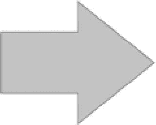

图 7-1。

An arrow

注意，我只需要创建一个方向箭头。这是因为我可以简单地反转图像来创建相反的箭头——不需要花时间画两个。

### 添加我们的控件

现在，我们需要将这些添加到我们的游戏中，并让它们做一些事情。首先，像处理其他图片一样，将图片添加到项目的 Sprite 文件夹中。现在右键单击你的画布下面的层级——你希望这个新元素成为`Canvas` GameObject 的子元素——并选择 UI ➤图像。游戏中会出现一个看起来像白色大方块的图像。选择这个元素，在它显示源图像的地方，拖放你从你的精灵文件夹中创建的箭头精灵。上面写着锚的地方，选择左下角。拖动并定位箭头，使其位于画布的左上角(此时可能会显得很大)，然后将水平刻度更改为负数，使箭头指向左边而不是右边。换句话说，将宽度从 1 更改为–1，这样它就会自己折回来。

取决于你画的箭头有多大，你需要试着确定这些图片的大小是正确的。一旦 APK 在你的手机上运行，你可以稍后对此进行调整，但现在我将我的设置为 X =–2 和 Y = 2(见图 [7-3](#Fig3) )。

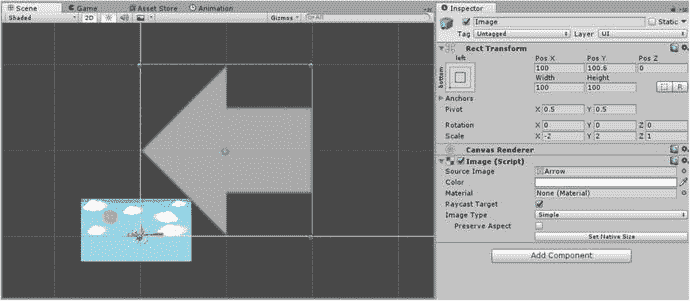

图 7-3。

Positioning the first control

现在对第二个箭头做同样的事情。这次位置会稍微偏右，主播还是左下方。当然，这次的规模将会是正数。之后，您可以添加跳转按钮，这将是我们的通用“按钮”图像。这一个将被锚定在屏幕的右下角。见图 [7-2](#Fig2) 。根据需要重命名按钮。

你会发现跳转按钮和右箭头可能会在这一点上重叠，或者看起来非常接近(如图 [7-4](#Fig4) )，但你不需要担心这一点。通过将图像设置为锚定到屏幕的底部角落，您声明所有的位置信息都是相对于那个角落的。Unity 不知道你将要玩的手机屏幕或任何设备的尺寸，因此画布的形状可能会有点奇怪。但是只要跳转按钮被设置在离右上角一定距离的地方，箭头和左上角也是一样，一旦你点击播放，它们就应该在正确的位置。


图 7-4。

The buttons don’t look quite right yet, but have faith

当然，要进行预览，你可以点击播放，看看它在你的电脑屏幕上是什么样子(图 [7-5](#Fig5) )。当放置你的箭头时，在边缘留一点空间是值得的，以确保它们不会太狭窄。

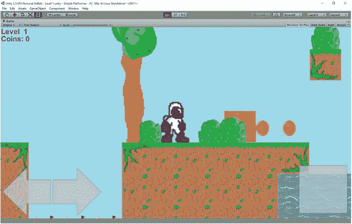

图 7-5。

See? Our arrows look lovely!!

### 控件编码

现在你已经有了你的按钮，是时候让它们真正做点什么了。考虑到这一点，我们需要创建一个空的游戏对象，作为这些元素的容器。右键单击画布，选择 Create Empty，然后将这个新对象锚定到屏幕底部。单击拉伸，使其与屏幕一样宽，然后将元素拖动到层次结构中的此处。调用您的新容器 TouchController。

进入你的`Player`脚本(正如我们在第 [6 章](06.html)中了解到的，它实际上是一个类)，我们将添加两个公共布尔。记住，bools 是可以为真或假的变量——1 或 0——因为它们是公共的，它们可以被我们游戏中的其他类(脚本)访问。

这些新变量将被称为`moveRight`和`moveLeft`，您将使用它们来完成这项工作(暂时不要粘贴这段代码):

```java
if (moveright)
 {
 rb.velocity = new Vector2(movespeed, rb.velocity.y);
 }
 if (moveleft)
 {
 rb.velocity = new Vector2(-movespeed, rb.velocity.y);
 }

```

请注意，这与手动按下左右箭头非常相似。

这些可触摸的图像元素的工作方式是，它们只允许我们在被点击和被释放时进行注册。这意味着我们不能问 Unity 按钮是否“被按下”相反，我们需要根据按钮何时被点击和何时被释放来设置我们的布尔值为真或假。

我告诉你不要粘贴代码的原因是有一种更简单的方法可以做到这一点。我们已经有一堆代码来处理玩家左右行走，目前它包括动画之类的东西——所以我们不想重复。

相反，我们将使用一个名为或的命令。这基本上允许我们询问两件事情中的一件是否正在发生。在这种情况下，我们要问的是玩家是否按下了箭头键，或者我们的布尔函数之一是否为真。在 C#中，我们编写或使用符号`||`。

因此，我们的代码现在应该是这样的:

```java
if (moveLeft || Input.GetKey(KeyCode.LeftArrow))
        {
            rb.velocity = new Vector2(-movespeed, rb.velocity.y);
            anim.SetBool("Walking", true);
            if (facing == 1)
            {
                transform.localScale = new Vector3(-1f, 1f, 1f);
                facing = 0;
            }

        } else if (moveRight || Input.GetKey(KeyCode.RightArrow))
        {
            rb.velocity = new Vector2(movespeed, rb.velocity.y);
            anim.SetBool("Walking", true);
            if (facing == 0)
            {
                transform.localScale = new Vector3(1f, 1f, 1f);
                facing = 1;
            }

        } else
        {
            anim.SetBool("Walking", false);
        }

```

现在，当你按左右键时，你的角色应该还在移动。但是，如果您将其中一个布尔值设置为 true(记住，所有变量在第一次创建时默认为 0，即 false)，那么玩家将自动移动。

同样，我希望您将处理玩家角色跳跃动作的代码移到一个新的公共方法中。公共方法是一种方法——一段指令代码——可以从其他类(脚本)中执行。这意味着我们现在可以通过从外部脚本激活来强迫玩家跳跃。

我们仍然希望在我们的`Update`方法中注册按钮按压，但是我们没有包含跳转代码，而是引用了包含所述代码的新公共方法。

因此，您将像这样创建公共方法:

```java
public void jump() {

    if (onGround) {
        rb.velocity = new Vector2(rb.velocity.x, jumppower);
    }
}

```

然后在`Update`方法中，您可以简单地这样说:

```java
if (Input.GetKey(KeyCode.Space))
{
    jump();
}

```

整个事情应该是这样的:

```java
void Update() {

        if (moveLeft || Input.GetKey(KeyCode.LeftArrow))
        {
            rb.velocity = new Vector2(-movespeed, rb.velocity.y);
            anim.SetBool("Walking", true);
            if (facing == 1)
            {
                transform.localScale = new Vector3(-1f, 1f, 1f);
                facing = 0;
            }

        } else if (moveRight || Input.GetKey(KeyCode.RightArrow))
        {
            rb.velocity = new Vector2(movespeed, rb.velocity.y);
            anim.SetBool("Walking", true);
            if (facing == 0)
            {
                transform.localScale = new Vector3(1f, 1f, 1f);
                facing = 1;
            }

        } else
        {
            anim.SetBool("Walking", false);
        }

        if (Input.GetKey(KeyCode.Space))
        {
            jump();
        }
    }

    public void jump() {

if (onGround) {
rb.velocity = new Vector2(rb.velocity.x, jumppower);
}
        }

```

这很重要，因为我们实际上给了自己一些访问点，可以用来从脚本之外控制玩家。我们将在控制按钮的脚本中利用这一点。如果你很难理解这里发生了什么，可以考虑重读第 6 章中关于面向对象编程(OOP)的部分。

看到了吗？边走边学理论总是好的。

好了，现在我们已经完成了。是时候让按钮有反应了。首先创建另一个新脚本，这次名为`Touch`。`Touch`将包含以下代码:

```java
public class Touch : MonoBehaviour
{
    private Player player; 

    void Start()
    {
        player = FindObjectOfType<Player>();
    }

    public void PressLeftArrow()
    {
        player.moveRight = false;
        player.moveLeft = true;
    }
    public void PressRightArrow()
    {
        player.moveRight = true;
        player.moveLeft = false;
    }
    public void ReleaseLeftArrow()
    {
        player.moveLeft = false;
    }
    public void ReleaseRightArrow()
    {
        player.moveRight = false;

    }

    public void Jump()
    {
        player.Jump();

    }
}

```

这基本上是一个公共方法的集合，每个方法都会以某种方式与`Player`脚本(类)交互。你可能已经猜到了，我们现在要让每个屏幕按钮触发其中一个方法。

现在回到 Unity，添加这个新的`Touch`脚本作为我们之前创建的`TouchController`空游戏对象的组件(见图 [7-6](#Fig6) )。


图 7-6。

Add the `Touch` script to the empty GameObject

现在，我们将向左箭头添加一个组件—这次是一个称为事件触发器的新组件。转到添加组件➤事件➤事件触发器。现在点击添加新事件类型➤指针向下。点击出现在右边的小加号(+)，然后拿起`TouchController`游戏对象并将其拖入无(对象)框。然后单击右侧的下拉菜单，选择触摸➤按左箭头()。基本上，你是在告诉 Unity 你希望指针向下事件(按下按钮的动作)触发`Touch`脚本中的公共方法`PressLeftArrow`。

点按“添加新事件类型”,然后选取“指针向上”。这记录了手指从箭头上抬起的动作。现在选择触摸➤释放左箭头()进入这里。如果一切正常，它看起来应该如图 [7-7](#Fig7) 所示。

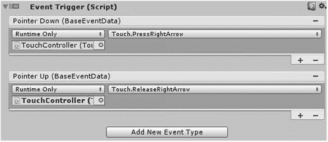

图 7-7。

Event triggers added

正如您可能已经猜到的，您需要对右箭头做同样的事情，但是使用各自的右箭头方法。对于跳转按钮，您将做一些稍微不同的事情，忽略向上指针类型的事件，选择向下指针的`Jump()`方法。

单击“播放”,您应该能够对此进行测试。如果你没有触摸屏笔记本电脑来试用，那么只需用鼠标点击按钮就可以达到同样的效果。如果它现在感觉不太响应，也不要担心——一旦它在 Android 设备上运行，应该会是一个不同的故事。

说到这里....

## 创造你的第一个 APK

现在你有了合适的输入形式，你终于可以在 Android 设备上测试你所有的努力了。

首先，确保你已经通过按 Ctrl+S 再次保存了你的场景。接下来，前往文件➤构建设置。您会在该窗口的顶部看到一个框，显示“构建中的场景”,这基本上是向您显示您创建的哪些场景希望包含在最终产品中。要添加你的级别 1，只需将它从项目窗口的场景文件夹中拖放到构建区域的场景中。它应该如图 [7-8](#Fig8) 所示。

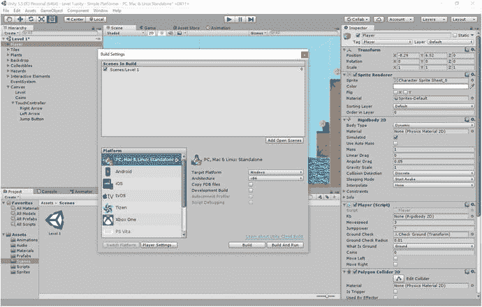

图 7-8。

Level 1 is currently the only scene in our build

当你有更多的场景时(你会的)，你需要确保顶部的场景是你想首先运行的场景。这通常意味着一个闪屏或某种菜单(但是记住，如果你有免费的 Unity 许可，你的闪屏之前会有一个 Unity)。

现在，不要担心纹理压缩。这对于创建 3D 游戏非常有用，并有助于优化您的应用。对于我们的目的来说，现在还没有必要(我们的应用很小，资源也不是很密集)，并且不是所有的 Android 平台都支持所有类型的压缩。我将在本书的后面讨论纹理压缩。

你会注意到这个窗口也有选择平台的选项，现在它可能显示 PC、Mac 和 Linux 单机版。您需要通过单击 Android 选项，然后单击切换平台来更改这一点。

### 播放器设置

接下来，点击平台滚动框下面的播放器设置按钮，你会发现一些新的选项在检查器中为你打开。在这里，您可以定义将要构建的 APK 的许多属性:比如图标、包名和方向(参见图 [7-9](#Fig9) )。

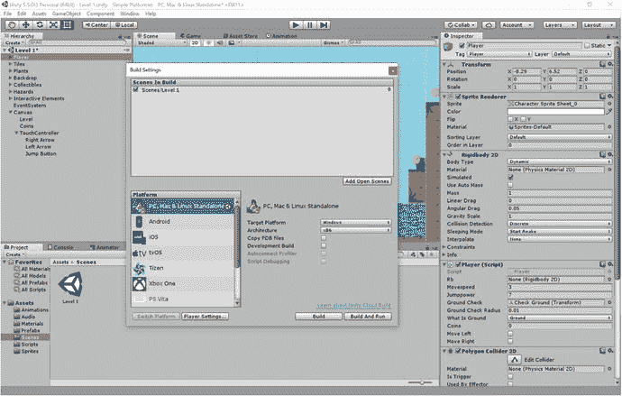

图 7-9。

Player Settings is where you set the properties for your new APK

在我们开始设置之前，请填写顶部的选项。在这里，您可以输入公司名称和应用名称。如果你让它保持原样，那么这个公司将会是 DefaultCompany，这个应用将会被叫做你的项目的名字。这里还有一个添加图标的选项。我们现在不会担心这个问题，我们将在讨论上传和营销您的应用时再次讨论这个问题。现在，我们将坚持使用默认的 Unity 图标。

现在，剩下的这些选项是做什么的？

#### 分辨率和演示

我们首先要看的是分辨率和呈现方式。目前，默认方向可能设置为自动旋转，在它下面有一个勾框显示哪些方向是允许的——现在，答案可能是所有方向。

如果你想做一个益智游戏(在下一章讨论)，你可能会想支持纵向。甚至还有少量类似 Fotonica 和 Sonic Jump 的人像动作游戏。但在大多数情况下，坚持横向更有意义，这将防止你的玩家感到太拥挤，这将显示最多的屏幕。在你玩游戏时握着手机的控制器也倾向于只支持横向。因此，要么在默认方向框中选择一个方向，要么取消选中下面的两个纵向选项。

#### 图标

下一部分是图标部分。正如我前面说过的，图标是我们以后会用到的东西，但是正如你所看到的，这里有空间添加各种不同分辨率的图标。如果你想在这里放些东西，只使用一张图片就可以了，在这种情况下，最好使用高分辨率的图片，而不是低分辨率的。与缩小相比，放大会产生更好的图像质量。稍后我将对此进行更详细的讨论——暂时将它保留为空是很好的。图 [7-10](#Fig10) 显示了默认图标安装后的样子。

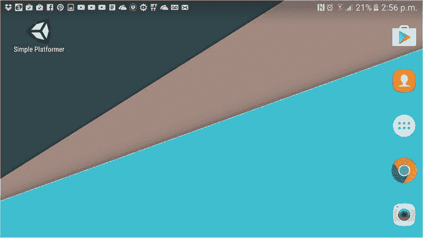

图 7-10。

Soon this will be your app

#### 飞溅图像

接下来是 Splash Image，我们将再次保留空白——特别是当你应该在免费许可证上保留默认图像时。

#### 其他设置

其他设置给了我们很多可以玩的东西。您可以更改与渲染相关的设置，以及最低 API 级别、写权限、安装位置等。这其中的大部分是不言自明的，其余的我们将在后面的章节中再来讨论。

您完全可以跳过这一部分，将所有内容都保留为默认值，但是这里有一两件事情值得注意。例如，包标识符是您输入包名的地方。正确的命名如下:com . your company here . your app name here。您需要在应用构建之前设置这个名称，所以请继续使用您自己的详细信息输入一个包名称。你现在选择什么并不重要，但是在发表之前一定要好好想想。先不说别的，应用一旦上传到 Play Store，你就不能再更改这个了。

版本和版本代码分别是为了我们和 Android。版本就是我们和我们的用户所看到的版本。不过，每次你在 Play Store 更新应用时，版本代码都需要更改。即使您做了最微小的更改，然后上传了一个新的 APK，您也需要确保新版本的代码高于上一个版本。

同时，最低 API 级别定义了你想要支持的 Android 的最低版本。默认情况下，这大概设置为 Android 2.3.1(姜饼)。在撰写本文时，谷歌刚刚发布了 Android O 的开发者预览版，可供用户使用的最新版本是 7.1(牛轧糖)。

你的 API 等级越低，就有越多的人能够下载你的应用。但如果你把它定得太低，你将无法访问 Android 的一些后期功能。同样，我将在本书的后面部分详细讨论这些内容。

### 准备您的手机

在你尝试在手机上运行游戏之前，还有一件事要做，那就是准备好手机。首先，这意味着你需要允许 USB 调试。不幸的是，我不能给你一步一步的指导，因为每部 Android 手机都是不同的(这就是与 Android 合作的奇妙之处和沮丧之处)。

USB 调试让您可以通过 USB 连接安装应用，然后获得关于它们运行情况的反馈。见图 [7-11](#Fig11) 。

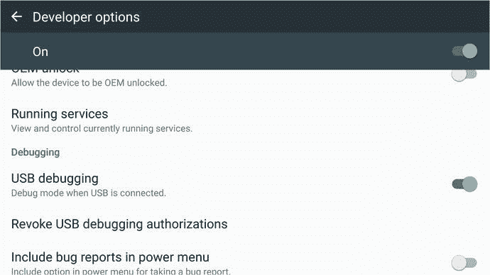

图 7-11。

Allowing USB debugging

通常，这个选项可以在你的手机设置中的开发者选项下找到。在一些手机中，这是隐藏的，所以在谷歌上搜索一下，看看如何在你的特定硬件上打开 USB 调试。图 [7-11](#Fig11) 显示了三星 Galaxy 设备上的此选项。

您需要更改的另一个设置是“允许安装来自 Play Store 以外来源的应用”这通常有一个标题未知的来源，可以在您的设置的应用部分，或锁定屏幕和安全部分找到。再次，快速谷歌搜索将帮助你。正如您所料，此设置确保您的手机将接受来自其他来源的 APKs 如您的 PC-因此您需要将其打开。参见图 [7-12](#Fig12) 。

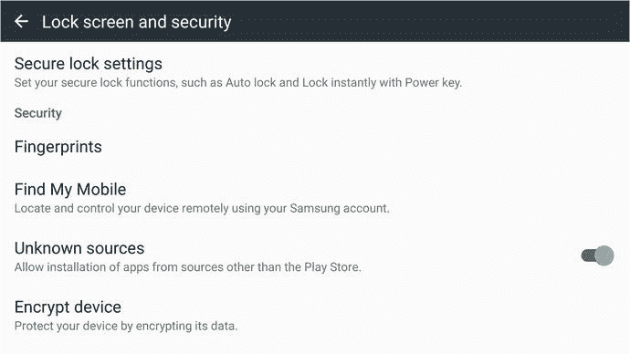

图 7-12。

You need to tick the Unknown Sources option

最后，确保你已经在电脑上为你的手机安装了驱动程序。这可能会发生在你第一次连接它来传输照片时，但为了以防万一，你可能需要做另一次搜索，并为你的手机获取这些驱动程序文件。但如果你不能解决这个问题，还有其他方法可以让应用在你的手机上运行。

### 扣动扳机

现在剩下要做的就是构建你的应用并运行它。继续通过 USB 端口将手机插入 PC，然后点击“构建并运行”。如果一切按计划进行，Unity 将构建 APK，然后安装到您的手机上。在显示启动画面后，它应该会直接出现在你面前。成功！

Technical Difficulties

不幸的是，当我这样做的时候，我遇到了一些技术难题，需要一段时间才能解决。对你来说幸运的是，我的工作就是处理这些事情，让你的生活更轻松。

在最近升级 Android SDK 工具后，兼容性似乎已经被破坏，构建停止工作。这意味着，如果你最近才安装 Android SDK，事情可能不会像它们应该的那样工作。解决办法是找一个旧版本的 Android SDK 工具，替换掉 SDK 根目录下的文件夹(把旧的改名为 ToolsXXX 什么的)。

希望当你读到这里的时候，这个小问题已经解决了。如果没有，你可能要做更多的谷歌搜索。不幸的是，这是开发的本质，尤其是在 Android 上的开发。但当它最终发挥作用时，确实会让一切变得更有价值。

如果一切都按计划进行，你现在应该有一个带有触摸控制的手机应用的工作版本。您可能会发现 UI 元素有点小，所以移动它们，并根据您的需要调整它们的大小。

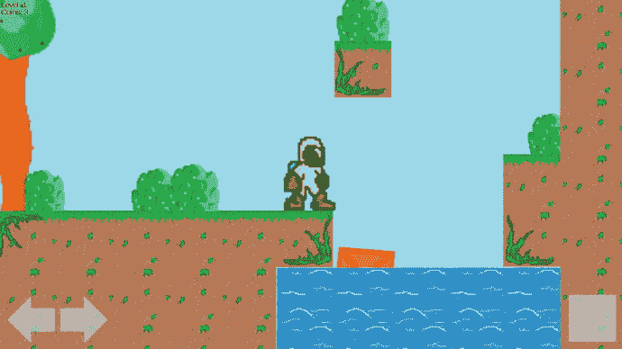

图 7-13。

That UI is going to need to get a little larger

借此机会享受你的成就。你刚刚创建了你的第一个 Android 应用。去给妈妈看看。

但是不要对自己太满意——还有很长的路要走。在第 8 章中，我们将创建多个级别、菜单和保存文件。我们才刚刚开始。

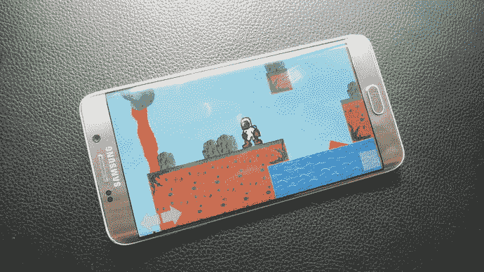

图 7-14。

We did it!