## 第 1 章

## 移动 Flash 简介

这本书，Pro Android Flash，是使用无处不在的 Flash 平台在移动设备上构建丰富、普及的用户体验的权威指南。我们将向您展示如何利用构成 Flash 平台的强大而成熟的技术、框架和工具来构建高度定制的应用程序，这些应用程序充分利用了用户要求其设备具备的所有移动功能。在阅读本书时，您将获得针对移动 Android 设备的基本知识，包括设备密度、硬件输入、本机集成和性能优化。

### 为什么选择安卓？

有许多不同的移动平台可供选择，也有大量的移动和平板设备可供消费者选择。与桌面市场不同，桌面市场已经有了大量的整合和巩固，移动市场也在不断发展，不断推出新的设备和功能。

显而易见的问题是，你的目标平台是哪个？我们的答案是从安卓开始；然后，通过利用闪存技术，您可以避免受限于任何特定的平台。

这本书着重于在运行 Android 操作系统的设备上创建应用程序。这是因为 Android 正在迅速成为世界上最受欢迎的移动操作系统，对不同硬件平台和多种外形的支持最好。

根据尼尔森公司的数据，Android 是 2010 年下半年购买智能手机的人的首选。黑莓 RIM 和苹果 iOS 在统计上处于第二位，如图[图 1–1](#fig_1_1)所示。

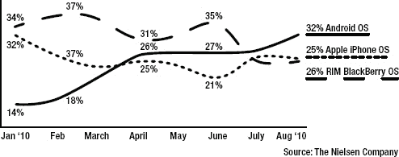

**图 1–1。** *美国移动 OS 流量份额 [1](#CHP-1-FN-1)*

这可能是由于许多不同的因素，包括平台是开源的这一事实，这吸引了设备制造商，Android Market、谷歌的设备内应用程序店面或谷歌体验提供的相对自由，谷歌体验为最终用户提供了 Gmail、谷歌地图、Gtalk、YouTube 和谷歌搜索的无缝集成。不管 Android 流行的原因是什么，很可能你的大部分客户已经拥有 Android 设备，或者正在考虑在不久的将来购买一台。

与此同时，您正在构建一个具有巨大横向增长潜力的平台。Android 只是 Flash 平台的开始，它受益于一个抽象的虚拟机和 API，这些 API 旨在跨多个不同的操作系统和设备工作。您可以利用 Flash 为所有移动应用程序带来的跨平台透明性。

### 其他平台上的 Flash

Adobe 启动了 Open Screen Project， [2](#CHP-1-FN-2) ，这是一项全行业的计划，旨在将 Flash 驱动的应用程序的优势带到您生活中的所有屏幕上。Adobe 已经宣布了支持 iOS、黑莓、Windows 7 和 webOS 的计划，将你从平台锁定中解放出来。

黑莓支持最初针对其平板电脑操作系统，第一个可用的设备是黑莓 PlayBook。预计这种支持将来会扩展到包括它的其他移动设备。

__________

1 资料来源:尼尔森公司，`[http://nielsen.com/](http://nielsen.com/)`，2010 年

2 Adobe，“开屏项目”，`[http://www.openscreenproject.org/](http://www.openscreenproject.org/)`

苹果仍然限制在浏览器中运行 Flash，但它已经开放了应用商店，允许第三方框架。这意味着对于 iOS 设备，您可以在任何 iOS 设备上部署 Flash 作为 AIR 应用程序，包括 iPod touch、iPhone 和 iPad。

您还可以在浏览器中支持 Flash 的任何设备上部署 Flash web 应用程序。这包括谷歌电视、webOS 和 Windows 7。未来，我们有望看到更多支持闪存技术的平台。

### 探索安卓系统

Android 是一个完整的移动堆栈，包括操作系统、服务和基础设施，以及一组核心应用程序。虽然您不需要成为 Android 方面的专家来有效地编写 Flash 应用程序并将其部署到 Android 设备上，但是熟悉 Android 的工作方式确实会有所帮助。

Android 的核心是基于 Linux 操作系统。它使用 Linux 内核的修改版本，该版本具有额外的驱动程序并支持移动硬件设备。

在此之上，有一组库和核心服务组成了基本的 Android 功能。你很少会直接与这些库进行交互，但是每当你播放一个媒体文件，浏览一个网页，甚至在屏幕上绘图，你都在经历一个核心的 Android 库。

原生 Android 应用程序是使用编译成 Dalvik 字节码的 Java 编程语言编写的。Dalvik 是 Android 特殊虚拟机的名称，它抽象了硬件并支持垃圾收集等高级功能。您运行的所有 Android 应用程序(包括 Adobe AIR 应用程序)都在 Dalvik 虚拟机中执行。

完整的 Android 系统架构，按 Linux 内核、库和运行时、应用程序框架和应用程序细分，如图 1–2 所示。

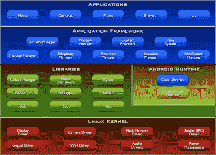

**图 1–2。** *安卓系统架构 [3](#CHP-1-FN-3)*

除了拥有非常坚实的技术基础，Android 还在不断发展，以适应新的硬件进步。Android 平台的一些当前功能包括:

*   移动浏览器(Mobile browser):WebKit，一个现代的框架，支持 HTML5 提出的所有扩展，并支持 Android 的内置浏览器
*   *Flash player* :从 Android 2.2 开始，你可以在网络浏览器中运行 Flash 内容，这是一项标准功能。
*   *多点触摸*:所有安卓手机都支持触摸屏，大多数都有至少两个触摸点，你可以用它们来进行手势识别。
*   摄像头:安卓手机被要求配备后置摄像头，现在许多手机也配备了前置摄像头。
*   *GPS，指南针*:所有安卓手机都要求有一个三向 GPS 和指南针，可用于导航应用。
*   *多任务处理* : Android 是第一个将应用程序切换和后台操作暴露给已安装应用程序的移动操作系统。
*   GSM 电话技术:作为电话使用的 Android 设备为您提供了 GSM 电话技术的全部功能。
*   *蓝牙、Wi-Fi 和 USB* :所有 Android 设备都配有蓝牙和 Wi-Fi 连接，以及一个标准 USB 端口，用于数据传输和调试。
*   *音频和视频支持* : Android 支持播放网络上最常见的音频和视频格式，包括 MP3、Ogg 和 H.264。

_________

3 转载自 Android 开源项目创建和共享的作品，并根据知识共享 2.5 归属许可中描述的条款使用:谷歌，“什么是 Android？”，`[http://developer.android.com/guide/basics/what-is-android.html](http://developer.android.com/guide/basics/what-is-android.html)`，2011 年

这些功能使得 Android 平台成为构建移动应用程序的一个非常强大的基础。此外，Adobe Flash 和 AIR 构建在这些基础功能之上，使 Flash 成为开发 Android 应用程序的绝佳平台。

### Flash 平台

Adobe Flash Platform 是一个完整的系统，集成了运行在不同操作系统、浏览器和设备上的工具、框架、服务器、服务和客户端。许多行业的公司都使用 Flash Platform 来消除设备和平台碎片，并开发出一致且富于表现力的交互式用户体验，不受设备限制。让我们来看看 Flash 平台的运行时和工具。

#### Flash 运行时

创建 Flash 应用程序时，您可以选择两个不同的部署目标。第一个是 Adobe Flash Player，这是一个嵌入式浏览器插件，第二个是 Adobe AIR，这是一个独立的客户端运行时。这两个选项都可以在桌面和移动设备上使用，并为您提供了很大的灵活性来定制您的应用程序部署，以满足最终用户的需求。

##### Adobe Flash 播放器

据 Adobe 称，Flash Player 安装在 98%的联网电脑和超过 4.5 亿台设备上， [4](#CHP-1-FN-4) 为运行在客户端的应用程序提供了最广泛的应用。2011 年，Adobe 预计将有超过 1.32 亿部智能手机支持 Flash Player，并且已经有超过 2000 万部智能手机预装了 Flash Player。预计 2011 年还会有另外 50 款新的平板设备支持 Flash Player。

Adobe Flash Player 在浏览器中的安全容器中运行。这允许您将 Flash 内容与用 HTML 和 JavaScript 编写的其他 web 内容混合在一起。您还可以获得免安装操作的优势。

__________

4 资料来源:Adobe，“富互联网应用的好处”，`www.adobe.com/resources/business/rich_internet_apps/benefits/#`，2009 年

##### Adobe AIR

目前为 Flash Player 发布内容的设计人员和开发人员也可以重新利用相同的内容来为 Adobe AIR 运行时制作应用程序。在撰写本文时，有 8400 万部智能手机和平板电脑可以运行 Adobe AIR 应用程序，Adobe 预计到 2011 年底将有超过 2 亿部智能手机和平板电脑支持 Adobe AIR 应用程序。

Adobe AIR 将 Flash 扩展到浏览器之外，允许您的内容从 Android Market 下载并作为一流的应用程序安装。此外，Adobe AIR 应用程序可以请求用户的许可，以访问受限的硬件，如照相机、麦克风和文件系统。

[Table 1–1](#tab_1_1)总结了在 Flash Player 中部署或作为 Adobe AIR mobile 应用程序部署的优势。由于 AIR 是 Flash APIs 的适当超集，因此也可以创建部署在两者下的单个应用程序。

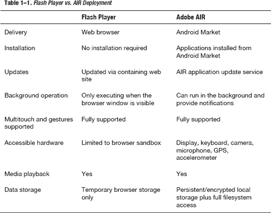

##### Adobe Flex

Flex 是一个开源软件开发工具包，专门用于在 Flash 平台上构建专业的业务应用程序。它包括一些额外的库，可以快速方便地构建带有布局、控件和图表的用户界面。此外，大多数 Flex UIs 都是用一种叫做 MXML 的 XML 方言以声明方式编写的，这使得构建嵌套的用户界面布局比直接的 ActionScript 更容易。

Adobe 非常积极地向 Flex 框架添加移动功能，如视图、触摸支持和移动优化皮肤。在本书中，我们将利用 Adobe Flex 技术来演示移动 API。同时，我们将演示纯 ActionScript APIs 的使用，如果您正在构建一个不包含 Flex SDK 的应用程序，则可以使用这些 API。

#### 闪光工具

自从 Creative Suite 5.5 (CS5.5)发布以来，所有用于 Flash 和 Flex 开发的 Adobe 工具也支持移动开发。

[Table 1–2](#tab_1_2)列出了 Adobe 提供的工具，您可以使用这些工具通过 Flash 和 Flex 开发移动应用程序。它们之间的互操作非常紧密，这使得利用每种工具的优势变得很容易。这扩展到 Adobe 设计工具，如 InDesign、Photoshop、Illustrator 和 Fireworks，它们可用于为您的应用程序开发内容，这些内容将直接插入到您的 Flash 和 Flex 应用程序中。

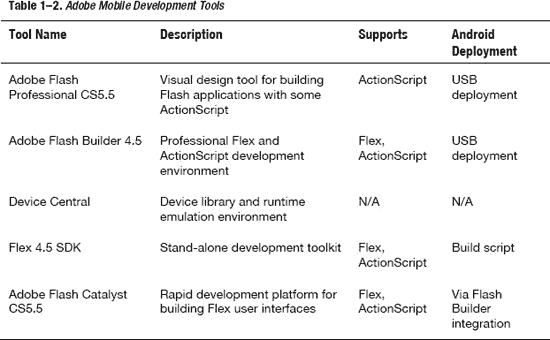

##### Adobe Flash 专业版

Adobe Flash Professional 为设计人员和开发人员提供了一套绘图工具、时间线以及添加交互性的能力，从而为多个平台创建丰富的交互式体验。它实际上起源于一个动画工具。当然，这意味着它的核心非常适合处理动画和图形。但是，从它卑微的开始，它已经成长为一个成熟的程序，能够创建丰富的身临其境的体验，并具有用 ActionScript 编写的高级交互性，可以发布到多个平台。

如果您是 Flash 开发的新手，Flash Professional 是一个很好的起点。它提供了一个可用于构建内容的图形电影和时间轴编辑器，以及一个非常实用的 ActionScript 编辑器，该编辑器具有代码模板、API 帮助和代码完成等高级功能。

##### 需单独购买

Adobe Flash Builder 软件旨在帮助开发人员快速开发适用于 Flash 平台的跨平台富互联网应用程序和游戏。用户可以通过编写 ActionScript 代码来创建游戏，就像使用 Flash Professional 一样。借助 Flash Builder，您还可以使用 Flex 框架编写应用程序，Flex 框架是一个用于开发和部署富互联网应用程序(RIA)的免费、高效的开源框架。

如果您正在开发一个具有复杂 UI 和复杂算法或业务逻辑的大型应用程序，您肯定会希望添加 Flash Builder 4.5。它基于全功能的 Eclipse IDE，提供了您期望从专业开发环境中获得的一切，包括代码导航、键盘加速器和完整的 GUI 生成器。

##### 设备中心

Device Central 是 Flash Professional 附带的补充应用程序，允许您在桌面上模拟不同的移动设备，包括对倾斜、多点触摸和加速度计的支持。它还让您可以访问一个巨大的信息库，其中列出了 Flash 平台支持的所有可用的移动和嵌入式设备，包括完整的规格和自定义仿真器。

**注意:**截至本文撰写时，Device Central 尚未更新到 AIR 2.6 以支持 Android 设备。

##### 土坯闪光催化剂

Flash Catalyst 是 Adobe 的快速应用程序开发平台。它允许您将 Photoshop、Illustrator 或 Flash 中制作的艺术资源转化为一流的 UI 控件。Catalyst 的移动工作流是创建或修改包含您的组件和资产的 FXP 文件，然后在 Flash Builder 中打开它，添加业务逻辑并在移动平台上运行。

所有这些应用程序都可以免费试用；但是，如果您想使用纯开源堆栈进行开发，您可以使用 Flex SDK 直接从命令行进行 Flex 和 ActionScript 开发。作为 Flash Builder 和 Catalyst 基础的所有组件都是 Flex SDK 的一部分，可以通过编程方式访问。如果您正在配置一个自动构建来编译和测试您的 Flex 应用程序，这也是您想要使用的。

##### 工作流程

除了已经列出的工具，Adobe 还有一个强大的工作流程，允许设计人员使用 Adobe InDesign、Adobe Photoshop、Adobe Illustrator 和 Adobe Fireworks 等程序将图形移动到 Flash Professional 或 Flash Builder 中进行进一步开发，如[图 1–3](#fig_1_3)所示。这意味着在处理图形时很少出现转换问题，也不存在将图形从设计转移到开发的漫长过程。

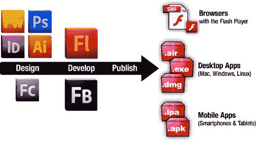

**图 1–3。** *从设计到开发再到发布到多个平台/设备的 Flash 工作流程*

我们将在第 9 章中更详细地讨论设计人员/开发人员的工作流程，给出如何在不同工具之间简化工作流程的真实例子。

#### 从 Flash Professional 运行应用程序

开始编写 Flash 应用程序的最简单方法是使用 Adobe Flash Professional。它为构建简单的电影提供了一个可视化的环境，也为构建更复杂的逻辑提供了良好的 ActionScript 编辑功能。

##### 创建新的 Android 项目

要为 Android 项目创建一个新的 AIR，从**文件 New…** 打开新项目对话框，点击模板选项卡。在这里你可以选择一个 AIR for Android 项目，并选择你的设备模板，如图[Figure 1–4](#fig_1_4)所示。

**图 1–4。** *Flash Professional 新建模板对话框*

这将创建一个新项目，画布的大小完全适合纵向模式下的移动项目，并且允许您在 Flash Professional 中或通过 USB 在设备上测试您的应用程序。有关设备部署的更多信息，请参阅第 5 章“应用程序部署和发布”。

##### 编写 Flash 功能报告

为了演示设备功能，我们将创建一个名为 Flash Capability Reporter 的简单应用程序。它将会有一个简单的滚动列表，列举出你正在运行的模拟器或设备的所有功能。

对于 ActionScript 代码，我们将使用来自`Capabilities`和`Multitouch`类的静态常量。其中大多数返回 true 或`false`，但有些会返回`string`或`integer`值。通过使用字符串连接操作符，我们可以很容易地对它们进行显示格式化，如清单 1–1 所示。

**清单 1–1。** *Flash 能力校验码*

`import flash.system.Capabilities;
import flash.ui.Multitouch;

capabilityScroller.capabilities.text =
  "AV Hardware Disable: " + Capabilities.avHardwareDisable + "\n" +
  "Has Accessibility: " + Capabilities.hasAccessibility + "\n" +
  "Has Audio: " + Capabilities.hasAudio + "\n" +
  "Has Audio Encoder: " + Capabilities.hasAudioEncoder + "\n" +
  "Has Embedded Video: " + Capabilities.hasEmbeddedVideo + "\n" +
  "Has MP3: " + Capabilities.hasMP3 + "\n" +
  "Has Printing: " + Capabilities.hasPrinting + "\n" +
  "Has Screen Broadcast: " + Capabilities.hasScreenBroadcast + "\n" +
  "Has Screen Playback: " + Capabilities.hasScreenPlayback + "\n" +
  "Has Streaming Audio: " + Capabilities.hasStreamingAudio + "\n" +
  "Has Video Encoder: " + Capabilities.hasVideoEncoder + "\n" +
  "Is Debugger: " + Capabilities.isDebugger +  "\n" +
  "Language: " + Capabilities.language + "\n" +
  "Local File Read Disable: " + Capabilities.localFileReadDisable + "\n" +
  "Manufacturer: " + Capabilities.manufacturer + "\n" +
  "OS: " + Capabilities.os + "\n" +
  "Pixel Aspect Ratio: " + Capabilities.pixelAspectRatio + "\n" +
  "Player Type: " + Capabilities.playerType + "\n" +
  "Screen Color: " + Capabilities.screenColor + "\n" +
  "Screen DPI: " + Capabilities.screenDPI + "\n" +
  "Screen Resolution: " + Capabilities.screenResolutionX + "x"
  + Capabilities.screenResolutionY + "\n" +
  "Touch Screen Type: " + Capabilities.touchscreenType + "\n" +
  "Version: " + Capabilities.version + "\n" +
  "Supports Gesture Events: " + Multitouch.supportsGestureEvents + "\n" +
  "Supports Touch Events: " + Multitouch.supportsTouchEvents + "\n" +
  "Input Mode: " + Multitouch.inputMode + "\n" +
  "Max Touch Points: " + Multitouch.maxTouchPoints + "\n" +
  "Supported Gestures: " + Multitouch.supportedGestures;`

每行末尾的`"\n"`字符增加了换行符以提高可读性。然后将结果字符串分配给在`capabilityScroller`电影中定义的 ID 为`capabilities`的 Flash 文本字段。在 Flash 中使用嵌入的电影通过隐藏文本的滚动动画来清理主时间轴。

虽然这在功能上已经完成，但我们在完成的图书样本中添加了一些额外的图形细节，包括以下内容:

1.  *一个图形剪辑层*:为了使文本在滚动时从图形后面出现，在滚动时消失，我们添加了一个带有纯色背景的附加层，并在文本应该可见的地方剪切了一部分。这代替了使用剪辑蒙版，所以我们可以获得使用设备字体的性能优势。
2.  *闪烁的灯光:一个简单的动画通过使用 Flash Deco 工具在左侧创建，使用砖块图案填充网格。选择了两种不同的颜色，并选中了“随机顺序”选项，以创建三帧动画上闪烁灯光的视觉外观。*
**   *Android 标志和文字*:没有一个 Android 应用程序是不完整的，没有一点吸引眼球的东西。借助 Android 上可用的全彩色高分辨率显示器，您可以对应用程序的图形外观做很多事情。在这种情况下，选择矢量图形来平滑缩放到任何大小的设备。*

 *要运行完整的示例，请转到 AIR Debug Launcher (Mobile) 中的**控制测试影片。这将在 AIR Debug Launcher (ADL)运行时运行应用程序，如图[图 1–5](#fig_1_5)所示。**

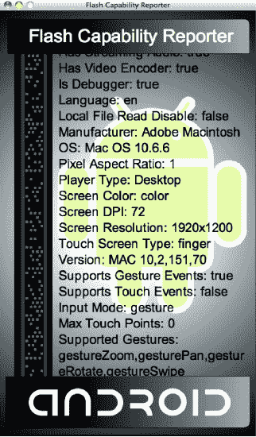

**图 1–5。** *桌面上 ADL 中运行的 Flash Capability Reporter 应用程序*

您可以在自己的开发过程中使用该示例来比较桌面和移动设备的功能。您可以随意添加功能列表，并尝试在不同设备上运行。

您会注意到，即使我们在 ADL 的移动模式下运行，返回的值也与您在设备上运行时得到的值不一致。在本章的后面，我们将向你展示如何在 Android 模拟器中或者通过 USB 在设备上运行你的应用程序。

#### 从 Flash Builder 运行应用程序

新版 Flash Builder 为移动设备构建 Flash 和 Flex 应用程序以及直接从 IDE 运行和调试这些应用程序提供了强大的支持。在本节中，我们将向您展示如何从头开始创建一个新的移动项目，演示 Flex 移动开发的基础知识，包括视图、控件和多点触摸手势识别。

我们将创建的应用程序称为手势检查。它允许您分析您的设备，以直观地发现支持哪些手势，并测试它们是否被成功识别。在创建此示例的过程中，您将全面了解 Flash Builder 的移动功能，包括如何创建新的 Flex 移动项目、使用 Flash Builder 调试器调试应用程序以及通过 USB 部署在设备上运行应用程序。

##### 创建新的 Flex 移动项目

要创建新的 Flex 移动项目，从**文件新建 Flex 移动项目**打开新建项目对话框。你会得到一个项目创建向导对话框，允许你输入项目名称，如图[图 1–6](#fig_1_6)所示。

**图 1–6。** *Flex 移动项目创建向导*

将项目命名为 GestureCheck，并选择一个文件夹来存储项目。

**提示:**如果您创建的项目名称中没有空格，Flex 将创建与您选择的名称相匹配的项目文件。如果您的名称包含空格、破折号或其他在 ActionScript 标识符中无效的字符，它将使用通用名称“Main”来代替。

完成后，点击下一步进入向导的移动设置页面，如图[Figure 1–7](#fig_1_7)所示。

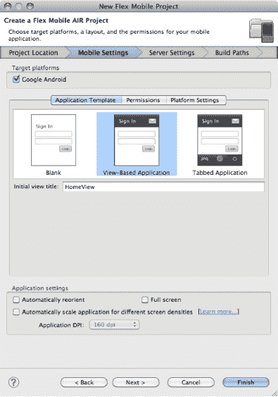

**图 1–7。**T3【移动设置】选项卡用于选择应用模板和设置

Flash Builder 附带了几个用于开发移动项目的内置模板，可用于快速启动新项目。其中包括一个简单的空白应用程序、一个从主页开始的基于视图的应用程序，以及一个允许您在不同命名视图之间切换的选项卡式应用程序。您可以在第 3 章中找到更多关于视图和选项卡导航的信息。

在本练习中，选择默认的基于视图的基本应用程序模板。您还可以选择重定向、全屏模式和密度缩放。确保禁用自动重定向，使应用程序停留在纵向模式。我们将在第 2 章中更深入地讨论纵向/横向切换。

在移动设置页面上完成后，单击完成创建您的移动应用程序。

首先，Flex 模板为您提供了以下项目结构(标有`internal`的文件您永远不要直接修改):

*   `.actionScriptProperties: [internal]`包含库、平台和应用程序设置的 Flash Builder 设置文件
*   `.flexProperties: [internal]` Flex 服务器设置
*   `.project: [internal]` Flex Builder 项目设置
*   `.settings: [internal]` Eclipse 设置文件夹
*   `bin-debug:`这是执行过程中存储 XML 和 SWF 文件的输出文件夹。
*   `libs:`资源库文件夹，您可以在其中添加自己的自定义扩展
*   `src:`包含您所有应用程序代码的源文件夹
    *   `views:`为存储您的应用程序视图而创建的包
        *   `[AppName]HomeView.mxml`:应用程序的主视图(由主视图`Application`引用)
    *   `[App-Name]-app.xml:`包含移动设置的应用描述符
    *   `[AppName].mxml:`项目的主要`Application`类和执行的切入点

我们将在本教程的剩余部分关注的文件都在`src`目录中。这包括您的应用程序描述符和主`Application`类，它们都在根包中，以及您的`HomeView`，它是在名为`views`的包中创建的。

##### 编写 Flex 移动配置器

创建应用程序的第一件事是为 UI 构建一个声明性的 XML 布局。为此，我们将使用 Flex 的一些基本布局和 UI 类，包括:

*   `H/VGroup:``HGroup`和`VGroup`类让你在一个简单的垂直或水平堆叠布局中安排一组组件。组件按顺序排列，间距由`gap`属性设置。
*   显示不可编辑的文本字符串的简单组件；这通常用作表单中另一个控件的标签。
*   `Image:``Image`类让你显示一个可以从`GIF, JPEG, PNG, SVG`或`SWF`文件中加载的图形。在这个例子中，我们将使用透明的`PNGs`。
*   `CheckBox:`一种表单控件，其值为选中或未选中，带有可视指示器；它还包括文本描述作为显示的一部分。

使用这些布局和控件，我们可以构建一个简单的用户界面，显示设备上是否启用了特定的多点触摸手势，以及用户是否成功测试了手势。第一个“滑动”手势的代码显示在[清单 1–2](#list_1_2)中。这个代码应该在视图文件中更新，可以在`[src/views/GestureCheckHomeView.mxml](http://src/views/GestureCheckHomeView.mxml)`中找到。

**清单 1–2。** *第一次手势显示的 UI 元素*

`<?xml version="1.0" encoding="utf-8"?>
<s:View xmlns:fx="http://ns.adobe.com/mxml/2009"
    xmlns:s="library://ns.adobe.com/flex/spark"
    title="Supported Gestures" initialize="init()">
  <s:VGroup paddingTop="15" paddingBottom="15"
                    paddingLeft="20" paddingRight="20" gap="10">
    <s:HGroup verticalAlign="middle" gap="20">
      <s:Label text="Swipe" fontSize="36" width="110"/>
      <s:Image source="@Embed('/gestures/swipe.png')" width="137"/>
      <s:VGroup gap="10">
        <s:CheckBox content="Enabled" mouseEnabled="false"/>
        <s:CheckBoxcontent="Tested" mouseEnabled="false"/>
      </s:VGroup>
    </s:HGroup>
  </s:VGroup>
</s:View>`

要运行此应用程序，请进入**运行作为移动应用程序运行**。这将调出运行配置对话框，如[图 1–8](#fig_1_8)所示。

**图 1–8。** *Flash 移动运行配置对话框*

首先，我们将使用桌面上的 AIR Debug Launcher (ADL)运行应用程序。为此，选择桌面启动方法，并选择一个合适的设备进行模拟(对于本例，您将需要选择一个具有高密度显示屏的设备，如 Droid X)。

单击 Run 按钮将在 ADL 中执行应用程序，向您显示您之前添加的 UI 元素，如图[Figure 1–9](#fig_1_9)所示。

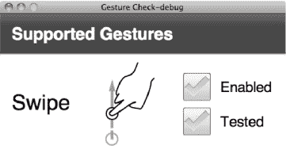

**图 1–9。** *手势检查用户界面*

这构建了基本的 UI 模式，但是没有连接任何应用程序逻辑来设置`CheckBoxes`的状态。为了实现这一点，我们将使用一个`initialize`函数，该函数遍历由`Multitouch`类报告的所有`supportedGestures`。这显示在[清单 1–3](#list_1_3)中。

**清单 1–3。** *检测手势支持和用法的附加代码以粗体突出显示*

`<?xml version="1.0" encoding="utf-8"?>
<s:View xmlns:fx="http://ns.adobe.com/mxml/2009"
    xmlns:s="library://ns.adobe.com/flex/spark"
    title="Supported Gestures" **initialize="init()"**>
  **<fx:Script>**
    **<![CDATA[**
      **import flash.ui.Multitouch;**

      **private function init():void {**
        **for each(var gesture:String in Multitouch.supportedGestures) {**
          **this[gesture+"Enabled"].selected = true;**
          **addEventListener(gesture, function(e:GestureEvent):void {**
            **e.currentTarget[e.type+"Tested"].selected = true;**
          **});**
        **}**
      **}**
    **]]**>
**</fx:Script>**
<s:VGroup paddingTop="15" paddingBottom="15"
                  paddingLeft="20" paddingRight="20" gap="10">
  <s:HGroup verticalAlign="middle" gap="20">
    <s:Label text="Swipe" fontSize="36" width="110"/>
    <s:Image source="@Embed('/gestures/swipe.png')" width="137"/>
    <s:VGroup gap="10">` `        <s:CheckBox **id="gestureSwipeEnabled"** content="Enabled" mouseEnabled="false"/>
        <s:CheckBox **id="gestureSwipeTested"** content="Tested" mouseEnabled="false"/>
      </s:VGroup>
    </s:HGroup>
  </s:VGroup>
</s:View>`

注意，我们已经向`CheckBoxes`添加了一些 id，以便从`initialize`函数中引用它们。命名约定是手势名称附加“启用”或“已测试”字样。在设置`selected`状态的代码中使用了相同的命名约定。

当创建视图时，`init`函数被调用一次，并遍历所有的`supportedGestures`。它将启用的`CheckBox`的状态设置为 true，并添加一个事件监听器，当在应用程序中使用该手势时，该监听器会将测试的`CheckBox`的状态设置为 true。如果你想了解更多关于手势和事件监听器的功能，我们会在[第二章](02.html#ch2)中详细介绍。

如果您运行更新后的示例，您将获得相同的 UI，但也会触发一个错误。ActionScript 错误对话框显示在[Figure 1–10](#fig_1_10)中，虽然您可能很清楚程序中的问题是什么，但我们将利用这个机会演示 Flash Builder 调试器是如何工作的。

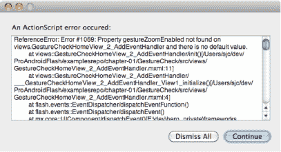

**图 1–10。** *更新后的应用程序执行时 ActionScript 出错*

**注意:**只有在启用了手势支持的电脑上运行，比如带触摸板的 Macintosh，才会出现前述错误。相反，您可以在带有触摸屏的移动设备上运行，以重现相同的错误。

##### 使用 Flash Builder 调试器

在上一节中，我们在运行应用程序时遇到了一个错误，但是错误窗口在识别发生了什么或者让我们检查当前状态方面并没有特别大的帮助。事实上，如果我们在移动设备上运行应用程序，它会继续执行，甚至不会让我们知道发生了错误。虽然这种行为对于生产应用程序来说是理想的，如果执行可以安全地继续，您不希望小错误困扰您的最终用户，但是这使得调试应用程序具有挑战性。

幸运的是，Flash Builder 附带了一个内置的调试器，您可以使用它来诊断您的应用程序。要使用调试器，您必须通过**RunDebug AsMobile Application**命令启动应用。

当您这样做时，与正常应用程序运行的唯一显著区别是，您现在将在控制台面板中获得跟踪输出和错误。当试图诊断应用程序行为时，这本身就非常有用；但是，如果在执行过程中遇到错误，系统会询问您是否要切换到 Flash Debug 透视图，如图[Figure 1–11](#fig_1_11)所示。

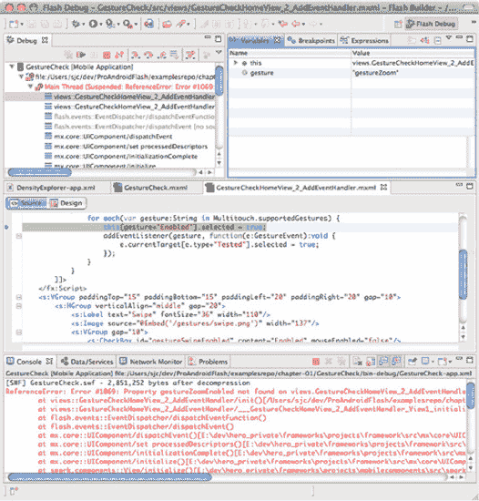

**图 1–11。***Flash 调试透视图突出显示手势检查应用程序中的错误*

Flash Debug 透视图使您能够在应用程序执行时查看其内部，这是非常强大的。在左上角的调试窗格中，您可以启动和停止您的应用程序，以及导航堆栈框架，例如我们遇到的错误情况。

当您在“调试”面板中选择一个帧时，它会在右上角的“变量”窗格中显示执行上下文的状态，并在中间的面板中显示相关的源代码。这使得很容易识别出我们在将 enabled `CheckBox`设置为`true`的调用中失败了，因为没有带有`id`“gestureZoom”的`CheckBox`。这是因为我们还没有添加 UI 元素来处理额外的手势。

由于我们已经确定了问题，您可以停止应用程序，并通过使用 Flash Builder 窗口右上角的透视图选择器切换回代码透视图。

正如您将在第 2 章中了解到的，Android 上的 Flash 支持五种不同的手势事件。这些措施如下:

*   *平移*:在显示屏上拖动两个手指。
*   *旋转*:将两个手指放在显示屏上，顺时针或逆时针旋转。
*   *缩放*:使用两个手指，同时分开或并拢。
*   *滑动*:用单个手指在显示屏上水平或垂直按压和滑动。
*   *双指轻击*:同时用两个手指触摸显示屏。

[清单 1–4](#list_1_4)展示了完整的应用程序，它将让您尝试这些手势。

**清单 1–4。** *手势检查示例应用程序的完整代码清单*

`<?xml version="1.0" encoding="utf-8"?>
<s:View xmlns:fx="http://ns.adobe.com/mxml/2009"
    xmlns:s="library://ns.adobe.com/flex/spark"
    title="Supported Gestures" initialize="init()">
  <fx:Script>
    <![CDATA[
      import flash.ui.Multitouch;

      privatefunction init():void {
        for each(var gesture:String in Multitouch.supportedGestures) {
          this[gesture+"Enabled"].selected = true;
          addEventListener(gesture, function(e:GestureEvent):void {
            e.currentTarget[e.type+"Tested"].selected = true;
          });
        }
      }
    ]]>
  </fx:Script>
  <s:VGroup paddingTop="15" paddingBottom="15"
                    paddingLeft="20" paddingRight="20" gap="10">` `  <s:HGroup verticalAlign="middle" gap="20">
    <s:Label text="Pan" fontSize="36" width="110"/>
    <s:Image source="@Embed('/gestures/pan.png')" width="137"/>
    <s:VGroup gap="10">
      <s:CheckBox id="gesturePanEnabled" content="Enabled" mouseEnabled="false"/>
      <s:CheckBox id="gesturePanTested" content="Tested" mouseEnabled="false"/>
    </s:VGroup>
  </s:HGroup>
  <s:HGroup verticalAlign="middle" gap="20">
    <s:Label text="Rotate" fontSize="36" width="110"/>
    <s:Image source="@Embed('/gestures/rotate.png')" width="137"/>
    <s:VGroup gap="10">
      <s:CheckBox id="gestureRotateEnabled" content="Enabled" mouseEnabled="false"/>
      <s:CheckBox id="gestureRotateTested" content="Tested" mouseEnabled="false"/>
    </s:VGroup>
  </s:HGroup>
  <s:HGroup verticalAlign="middle" gap="20">
    <s:Label text="Zoom" fontSize="36" width="110"/>
    <s:Image source="@Embed('/gestures/zoom.png')" width="137"/>
    <s:VGroup gap="10">
      <s:CheckBox id="gestureZoomEnabled" content="Enabled" mouseEnabled="false"/>
      <s:CheckBox id="gestureZoomTested" content="Tested" mouseEnabled="false"/>
    </s:VGroup>
  </s:HGroup>
  <s:HGroup verticalAlign="middle" gap="20">
    <s:Label text="Swipe" fontSize="36" width="110"/>
    <s:Image source="@Embed('/gestures/swipe.png')" width="137"/>
    <s:VGroup gap="10">
      <s:CheckBox id="gestureSwipeEnabled" content="Enabled" mouseEnabled="false"/>
      <s:CheckBox id="gestureSwipeTested" content="Tested" mouseEnabled="false"/>
    </s:VGroup>
  </s:HGroup>
  <s:HGroup verticalAlign="middle" gap="20">
    <s:Label text="Two-Finger Tap" fontSize="36" width="110"/>
    <s:Image source="@Embed('/gestures/twoFingerTap.png')" width="137"/>
    <s:VGroup gap="10">
      <s:CheckBox id="gestureTwoFingerTapEnabled"
                  content="Enabled" mouseEnabled="false"/>
      <s:CheckBox id="gestureTwoFingerTapTested"
                  content="Tested" mouseEnabled="false"/>
      </s:VGroup>
    </s:HGroup>
    <s:Label text="Graphics courtesy of GestureWorks.com" fontSize="12"/>
  </s:VGroup>
</s:View>`

如果您从 ADL 桌面模拟器测试此应用程序，您将会根据您的桌面手势支持获得不同的结果。对于不支持多点触摸的机器，不会启用任何手势；然而，如果你足够幸运，拥有一台带有支持多点触摸的触摸板的台式机或笔记本电脑，你或许可以对该应用进行一些有限的测试，如图[Figure 1–12](#fig_1_12)所示。

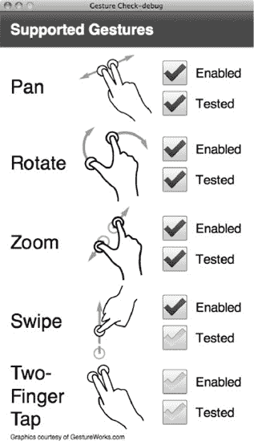

**图 1–12。** *在配有触控板的 MacBook Pro 上运行时，手势支持有限*

虽然它报告五个手势中有四个是启用的，但在我们用来执行这个示例的计算机上，实际上只可能执行平移、旋转和缩放。正如我们将在下一节中看到的，在完全支持所有多点触摸手势的设备上运行它会有趣得多。

##### 在设备上运行闪存

Flash Builder 使在移动设备上执行应用程序变得非常容易。只需点击一下，它就可以部署应用程序，在设备上启动它，甚至还可以连接一个远程调试器。

要在一个物理设备上运行你的应用程序，你需要确保它被正确设置用于 USB 调试。在大多数设备上，你可以通过进入**设置应用开发**来启用 USB 调试，在那里你会找到[图 1–13](#fig_1_13)所示的选项。

**图 1–13。** *安卓开发设置屏幕*

确保在此页面上启用了 USB 调试。您可能还想同时启用保持清醒的支持，这样您就不必在手机每次进入睡眠状态时都不断地重新登录。

一旦启用了 USB 调试，并且您已经通过 USB 电缆将手机连接到计算机，您的设备应该对 Flash Builder 可见。要切换到在设备上运行，请转到**运行运行配置** …，并返回参考[图 1–8](#fig_1_8)，您可以选择在设备上启动的选项。一旦选中，每次运行您的应用程序时，它都会在您连接的 Android 设备上启动，如[Figure 1–14](#fig_1_14)所示。

如你所见，在一个真实的设备上，锻炼所有的手势事件是可能的。当测试不同的设备以查看它们支持什么手势以及它们如何响应这些手势时，这个应用程序应该会派上用场。

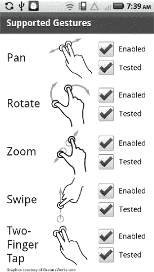

**图 1–14。** *完成了在 Android 移动设备上运行的手势检查应用*

如果您的 Android 手机无法连接到电脑，以下是您可以遵循的一些故障诊断步骤:

*   确保您的设备通过 USB 连接到电脑。如果成功，您的 Android 设备上的通知区域会显示已通过 USB 连接。
*   您还需要确保通过前面的步骤启用了设备调试。同样，当它正常工作时，会在通知区域列出。
*   如果没有 USB 连接，可能是驱动程序的问题。麦金塔电脑不需要驱动程序；但是，在 Windows 上，您可能需要为您的手机安装一个特殊的 USB 驱动程序。
*   这也可能是与电脑的连接有问题。尝试使用不同的电缆或不同的 USB 端口。
*   如果您有 USB 连接，但设备调试不工作，您可能需要在 Android 设备上更改您的 USB 连接模式。寻找一个写着“充电模式”或“禁用大容量存储”的选项

如果您仍然遇到问题，您应该验证您的手机是否在您正在使用的 Flash Builder 版本的支持设备列表中，并与您的制造商联系以确保您拥有正确的驱动程序和设置。

#### 从命令行运行应用程序

除了从 Flash Professional 和 Flash Builder 中运行之外，您还可以使用 AIR Debug Launcher (ADL)从命令行启动应用程序。如果您在没有工具支持的情况下直接使用 Flex，这也是您测试应用程序的方式。

要使用 ADL，您必须下载免费的 Flex 4.5 SDK，或者导航到 Flash Builder 安装的`sdks/4.5.0`文件夹。确保 Flex SDK 的 bin 文件夹在您的路径中，以便您可以调用 ADL 命令行工具。

ADL 工具的语法如下:

`adl ( -runtime <runtime-dir> )? ( -pubid <pubid> )? -nodebug? ( -profile PROFILE )? ( -
extdir <extensions-dir> )? ( -screensize SCREEN_SIZE )? <app-desc><root-dir>? ( -- …
)?`

ADL 支持许多可选参数，其中大部分是可选的。以下是对所有论点的简要描述，对移动开发重要的论点以粗体突出显示:

*   `runtime:`指定备用空气运行时间的可选参数；默认情况下，将使用 SDK 中包含的运行时。
*   `pubid:`用于指定应用程序 ID 的已弃用参数；您应该在应用程序描述符中使用 ID 标记。
*   `nodebug:`禁用调试支持，产生轻微的性能提升和更接近生产的应用行为
*   `**profile**`:您正在调试的应用程序的类型；对于移动开发，我们将使用`mobileDevice`概要文件。以下是完整的值列表:
    *   `mobileDevice, extendedMobileDevice, desktop, extendedDesktop, tv, extendedTV`
*   `extdir:`action script 扩展的可选目录
*   `**screensize**:`应用程序窗口的大小，可以是[Table 1–3](#tab_1_3)中列出的关键字之一或以下格式的字符串:
    *   `<width>×<height>:<fullscreen width>×<fullscreen height>`
*   `**app-desc**:`这是 ADL 运行时唯一需要的参数，应该引用您要执行的 AIR 程序的应用程序描述符。
*   默认情况下，ADL 会将应用程序的根目录设置为存储应用程序描述符的文件夹，但是您可以通过将其设置为另一个路径来覆盖它。
*   (-):最后，您可以通过在两个破折号后添加参数来将参数传入您的应用程序。

要运行您之前开发的手势检查应用程序，请导航到根项目文件夹并执行以下命令:

`adl -profile mobileDevice -screensize Droid bin-debug/GestureCheck-app.xml`

这将使用摩托罗拉 Droid 的移动配置文件和屏幕大小在 AIR Debug Launcher 中执行手势检查应用程序。由于手势检查应用程序在其应用程序描述符中没有将全屏设置为 true，因此 ADL 使用的窗口大小将为 480×816。

执行后，您应该会得到与图 1–12 中的[所示相同的结果，与您在 Flash Builder 中执行的早期运行相匹配。](#fig_1_12)

### 总结

这是一个开始移动开发的激动人心的时刻。智能手机的采用，尤其是基于 Android 的设备，正在呈指数级增长，您最终可以使用具有完整创作工具支持的现代开发框架，如 Flash 和 Flex。

在第一章的短短时间里，你已经学会了如何做以下事情:

*   使用 Flash Professional 和 Flex Builder 创建移动应用程序
*   在 AIR 调试启动程序中运行应用程序
*   通过 USB 连接在 Android 设备上部署和测试
*   使用 Flash Builder 调试器诊断您的应用程序
*   从命令行用不同的屏幕尺寸测试您的应用程序

这只是 Flash Android 移动开发的冰山一角。在接下来的章节中，我们将向您展示如何构建引人入胜、身临其境的 Flash 应用程序，充分利用所有移动功能。然后，我们演示如何将您的应用程序部署和发布到 Android Market。最后，我们将讨论一些高级主题，如原生 Android 集成、性能调优以及将您的应用扩展到平板电脑、电视等。*